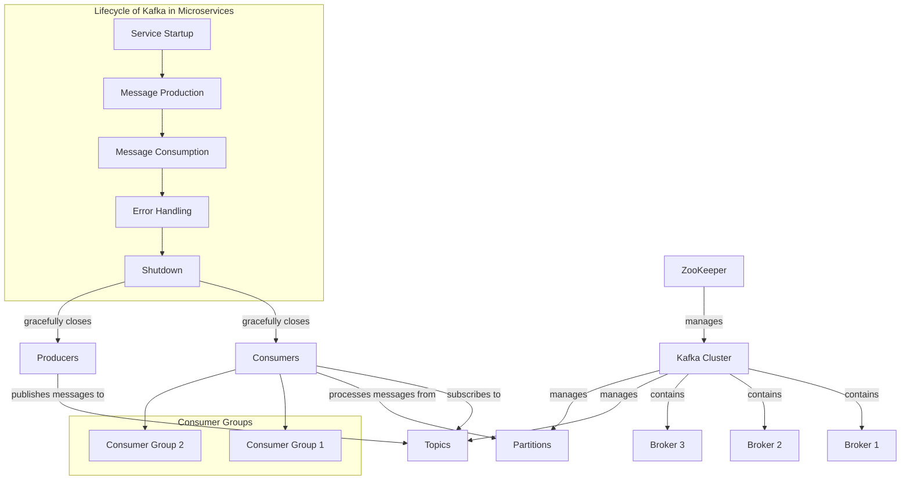

## Table of Contents

1. [Introduction](#introduction)
2. [Documentation](#documentation)
3. [Overview](#overview)
4. [Resilience Patterns](#resilience-patterns)
5. [Spring Boot](#spring-boot)
6. [Usage Examples](#usage-examples)
   - [CircuitBreaker, Retry and Fallback](#circuitbreaker-retry-and-fallback)
   - [RateLimiter](#ratelimiter)
   - [Bulkhead](#bulkhead)
7. [Consume Emitted Events](#consume-emitted-events)
   - [Examples](#examples)
8. [Talks](#talks)
9. [Companies That Use Resilience4j](#companies-that-use-resilience4j)

## Introduction

# Section 1 - Java:
<details>


Object-Oriented Programming (OOP) is a programming paradigm based on the concept of "objects," which can contain data and methods. Java is a fully object-oriented language, and its OOP principles facilitate modular and reusable code. Here’s an in-depth look at the core concepts of OOP:

### 1. Classes and Objects

- **Class**: A blueprint for creating objects. It defines properties (attributes) and behaviors (methods). For example:

    ```java
    public class Car {
        String color;
        String model;

        void drive() {
            System.out.println("The car is driving.");
        }
    }
    ```

- **Object**: An instance of a class. It represents a specific entity with state and behavior.

    ```java
    public class Main {
        public static void main(String[] args) {
            Car myCar = new Car(); // Creating an object of Car
            myCar.color = "Red";
            myCar.model = "Toyota";
            myCar.drive(); // Calling a method
        }
    }
    ```

### 2. Encapsulation

Encapsulation is the principle of bundling data (attributes) and methods that operate on the data within a single unit (class) and restricting access to some of the object's components. This is typically achieved using access modifiers:

- **Private**: Accessible only within the class.
- **Public**: Accessible from any other class.
- **Protected**: Accessible within the same package and subclasses.
- **Default**: Accessible only within the same package.

#### Example:

```java
public class BankAccount {
    private double balance;

    public void deposit(double amount) {
        if (amount > 0) {
            balance += amount;
        }
    }

    public double getBalance() {
        return balance;
    }
}
```

### 3. Inheritance

Inheritance is a mechanism that allows one class to inherit the properties and methods of another class. This promotes code reuse and establishes a hierarchy between classes.

- **Superclass (Parent class)**: The class whose properties and methods are inherited.
- **Subclass (Child class)**: The class that inherits from the superclass.

#### Example:

```java
public class Vehicle {
    void start() {
        System.out.println("Vehicle started.");
    }
}

public class Car extends Vehicle {
    void honk() {
        System.out.println("Car honks.");
    }
}

public class Main {
    public static void main(String[] args) {
        Car myCar = new Car();
        myCar.start(); // Inherited method
        myCar.honk();  // Car's own method
    }
}
```

### 4. Polymorphism

Polymorphism allows methods to do different things based on the object that it is acting upon. It is mainly achieved through method overloading and method overriding.

- **Method Overloading**: Same method name with different parameters within the same class.

    ```java
    public class MathOperations {
        int add(int a, int b) {
            return a + b;
        }

        double add(double a, double b) {
            return a + b;
        }
    }
    ```

- **Method Overriding**: Subclass provides a specific implementation of a method already defined in its superclass.

    ```java
    public class Animal {
        void sound() {
            System.out.println("Animal makes a sound.");
        }
    }

    public class Dog extends Animal {
        @Override
        void sound() {
            System.out.println("Dog barks.");
        }
    }

    public class Main {
        public static void main(String[] args) {
            Animal myDog = new Dog();
            myDog.sound(); // Output: Dog barks.
        }
    }
    ```

### 5. Abstraction

Abstraction is the concept of hiding complex implementation details and showing only the essential features of an object. This can be achieved using abstract classes and interfaces.

- **Abstract Class**: A class that cannot be instantiated and may contain abstract methods (methods without a body) and concrete methods.

    ```java
    abstract class Shape {
        abstract void draw(); // Abstract method
    }

    class Circle extends Shape {
        void draw() {
            System.out.println("Drawing a circle.");
        }
    }
    ```

- **Interface**: A reference type that can contain only constants, method signatures, default methods, static methods, and nested types. Interfaces cannot contain instance fields.

    ```java
    interface Drawable {
        void draw(); // Abstract method
    }

    class Rectangle implements Drawable {
        public void draw() {
            System.out.println("Drawing a rectangle.");
        }
    }
    ```

### Summary of OOP Concepts

- **Classes and Objects**: The foundation of OOP, where classes are blueprints for objects.
- **Encapsulation**: Bundles data and methods, restricting access to internal states.
- **Inheritance**: Enables classes to inherit properties and behaviors from other classes.
- **Polymorphism**: Allows methods to perform different functions based on the object context.
- **Abstraction**: Hides complex implementations and exposes only essential features.

These principles enable developers to build modular, maintainable, and scalable applications in Java. Understanding these concepts is crucial for effective programming and design in an object-oriented language.

### Why Use Functional Style Instead of OOP?

Functional programming (FP) and Object-Oriented Programming (OOP) are two distinct paradigms, each with its strengths. Here are reasons why functional style can be preferred:

1. **Simplicity and Clarity**: Functional programming focuses on pure functions and immutability, which can lead to simpler and more predictable code. Functions that don’t have side effects make it easier to understand program flow.

2. **Higher-Order Functions**: FP allows functions to be passed as parameters, returned from other functions, or stored in data structures, enabling powerful abstractions and code reuse.

3. **Conciseness**: Functional programming constructs like lambda expressions and streams can result in less boilerplate code. This can make code cleaner and easier to read.

4. **Parallelism**: FP constructs often lend themselves to parallel execution more naturally. For example, stream operations can be easily parallelized without changing the logic.

5. **Ease of Testing**: Pure functions (functions without side effects) are easier to test and reason about compared to methods in OOP that might rely on shared mutable state.


The **try-with-resources** statement in Java is a feature that simplifies the management of resources like files, sockets, or database connections. It ensures that each resource is closed automatically at the end of the statement, which helps prevent resource leaks and makes your code cleaner and more maintainable.

### Key Benefits of Try-With-Resources

1. **Automatic Resource Management**: Resources that implement `java.lang.AutoCloseable` are automatically closed at the end of the `try` block, even if an exception occurs.
2. **Cleaner Code**: Reduces boilerplate code by eliminating the need for explicit `finally` blocks to close resources.
3. **Exception Handling**: If an exception occurs while closing a resource, it is suppressed, allowing you to handle the original exception.

### Basic Syntax

```java
try (ResourceType resource = new ResourceType()) {
    // Use the resource
} catch (ExceptionType e) {
    // Handle exception
}
```

### Example 1: Reading a File

Here’s a simple example that demonstrates how to read a file using `BufferedReader` in a try-with-resources statement:

```java
import java.io.BufferedReader;
import java.io.FileReader;
import java.io.IOException;

public class TryWithResourcesExample {
    public static void main(String[] args) {
        String filePath = "example.txt";

        try (BufferedReader reader = new BufferedReader(new FileReader(filePath))) {
            String line;
            while ((line = reader.readLine()) != null) {
                System.out.println(line);
            }
        } catch (IOException e) {
            System.err.println("Error reading the file: " + e.getMessage());
        }
    }
}
```

### Explanation

- The `BufferedReader` is opened in the try-with-resources statement.
- It reads lines from the specified file and prints them.
- The `BufferedReader` is automatically closed when the block exits, even if an exception occurs.

### Example 2: Writing to a File

Here's another example that shows how to write to a file using `BufferedWriter`:

```java
import java.io.BufferedWriter;
import java.io.FileWriter;
import java.io.IOException;

public class WriteToFileExample {
    public static void main(String[] args) {
        String filePath = "output.txt";

        try (BufferedWriter writer = new BufferedWriter(new FileWriter(filePath))) {
            writer.write("Hello, World!");
            writer.newLine();
            writer.write("This is an example of try-with-resources.");
        } catch (IOException e) {
            System.err.println("Error writing to the file: " + e.getMessage());
        }
    }
}
```

### Explanation

- A `BufferedWriter` is used to write to a specified file.
- The writer automatically closes at the end of the try block, ensuring resources are freed properly.

### Example 3: Multiple Resources

You can manage multiple resources in a single try-with-resources statement:

```java
import java.io.BufferedReader;
import java.io.BufferedWriter;
import java.io.FileReader;
import java.io.FileWriter;
import java.io.IOException;

public class MultipleResourcesExample {
    public static void main(String[] args) {
        String inputFilePath = "input.txt";
        String outputFilePath = "output.txt";

        try (
            BufferedReader reader = new BufferedReader(new FileReader(inputFilePath));
            BufferedWriter writer = new BufferedWriter(new FileWriter(outputFilePath))
        ) {
            String line;
            while ((line = reader.readLine()) != null) {
                writer.write(line);
                writer.newLine();
            }
        } catch (IOException e) {
            System.err.println("Error processing files: " + e.getMessage());
        }
    }
}
```

### Explanation

- Both `BufferedReader` and `BufferedWriter` are declared in the try-with-resources statement.
- This setup allows reading from one file and writing to another seamlessly.

### Summary

The try-with-resources statement is a powerful feature in Java that enhances resource management by ensuring that all resources are closed automatically. This leads to cleaner code, reduced boilerplate, and minimized risk of resource leaks. If you have further questions or need more examples, feel free to ask!


It seems there might be some confusion in your question regarding the term "default method." However, I assume you're asking about the purpose of default methods in interfaces in Java 8, especially in the context of already existing methods in interfaces. Here's a clearer breakdown:

### Purpose of Default Methods

1. **Extending Interfaces Without Breaking Changes**:
   - Default methods allow you to add new methods to an interface without requiring all existing implementing classes to implement these new methods. This helps maintain backward compatibility.

2. **Providing Default Implementations**:
   - You can provide a common implementation for methods that can be shared across multiple classes. This reduces code duplication and centralizes behavior.

3. **Mixins and Multiple Inheritance of Behavior**:
   - Default methods allow a class to inherit implementations from multiple interfaces, enabling a form of multiple inheritance of behavior while avoiding the complexity and ambiguity of traditional multiple inheritance.

4. **Simplifying API Evolution**:
   - They facilitate the evolution of APIs. You can enhance an interface with new functionality while keeping the existing implementations valid.

5. **Encouraging Interface Segregation**:
   - Default methods can help implement more granular interfaces while still allowing for shared functionality, aligning with the Interface Segregation Principle.

### Example Scenario

Consider you have an interface that represents a `Shape`:

```java
interface Shape {
    double area();
    
    // Default method to provide a common implementation
    default void printShape() {
        System.out.println("Shape with area: " + area());
    }
}
```

If you later want to add a method like `printShape`, default methods allow you to do this without forcing all existing implementations (e.g., `Circle`, `Square`) to implement it. They can simply inherit the default behavior.

### Conclusion

Default methods enhance the flexibility of Java interfaces, allowing developers to evolve their code without breaking existing functionality. They provide a practical way to implement shared behavior and encourage better design principles in large codebases.


Sure! Let’s break down the purpose and use of default methods in functional interfaces, especially when there are multiple default methods.

### Purpose of Default Methods in Functional Interfaces

1. **Backward Compatibility**:
   - When you add a new method to an interface, existing implementations would break unless that method has a default implementation. Default methods allow you to evolve interfaces without forcing all implementers to modify their code.

2. **Adding Functionality**:
   - Default methods allow interfaces to provide common behavior that can be reused across multiple classes. This is especially useful when you want to add new functionalities to an interface without breaking existing implementations.

3. **Mixing Implementations**:
   - In scenarios where you might want to share behavior across different classes, default methods let you define that behavior in the interface itself. This is particularly useful for defining default behavior for new methods.

4. **Reducing Boilerplate Code**:
   - If several classes share the same method implementation, using a default method avoids the need to duplicate that code in each implementing class.

### Use Cases for Multiple Default Methods

1. **Shared Behavior**:
   - If you have several methods that many classes should implement with the same logic, you can provide those methods as default implementations in the interface. This way, classes can either use the default behavior or override it if they need custom logic.

2. **Mixing Interfaces**:
   - You can define multiple default methods in an interface that can be combined with other interfaces. This allows classes to implement multiple interfaces with shared functionality without the need for an abstract class.

3. **Enhanced Functional Interfaces**:
   - Even if an interface is primarily functional (with a single abstract method), adding default methods allows you to provide additional utility methods that can enhance usability. For example, a `Predicate` interface could have default methods for combining predicates (like `and` and `or`).

### Example

Here’s a simple example to illustrate:

```java
@FunctionalInterface
interface MyFunctionalInterface {
    void doSomething();

    default void defaultMethod1() {
        System.out.println("Default Method 1");
    }

    default void defaultMethod2() {
        System.out.println("Default Method 2");
    }
}

class MyClass implements MyFunctionalInterface {
    @Override
    public void doSomething() {
        System.out.println("Doing something!");
    }
}

public class Main {
    public static void main(String[] args) {
        MyClass myClass = new MyClass();
        myClass.doSomething(); // Calls the implemented method
        myClass.defaultMethod1(); // Calls the default method
        myClass.defaultMethod2(); // Calls another default method
    }
}
```

In this example, `MyFunctionalInterface` has two default methods. `MyClass` implements the functional method but can also use the default methods directly, reducing the need for boilerplate code.

### Summary

Default methods in functional interfaces provide flexibility, allow for shared behavior, support backward compatibility, and reduce code duplication. They enable you to extend interfaces in a way that is both powerful and safe, making them a useful feature in modern Java development.


Sure! Let’s compare interfaces, abstract classes, and functional interfaces with default methods, highlighting their characteristics, use cases, and differences.

### Interfaces vs. Abstract Classes

| Feature                       | Interface                                     | Abstract Class                                |
|-------------------------------|-----------------------------------------------|-----------------------------------------------|
| **Inheritance**               | Multiple inheritance (a class can implement multiple interfaces). | Single inheritance (a class can extend only one abstract class). |
| **Method Definitions**        | Can have only abstract methods (prior to Java 8), and can include default and static methods (from Java 8). | Can have both abstract methods (without implementation) and concrete methods (with implementation). |
| **Constructor**               | Cannot have constructors (no state).          | Can have constructors (can maintain state).  |
| **Fields**                    | Can only have static final fields (constants). | Can have instance variables (can maintain state). |
| **Accessibility Modifiers**   | All methods are implicitly public (unless marked private or static). | Can have various access modifiers (public, protected, private). |
| **Use Case**                  | Used to define a contract for classes, especially for multiple inheritance of type. | Used when a common base class functionality is needed and when sharing state is required. |

### Functional Interfaces

- A **functional interface** is a special type of interface that contains exactly one abstract method, allowing it to be used as the target for a lambda expression or method reference. 
- Functional interfaces can also have default and static methods, which provide additional utility without adding additional abstract methods.

### Default Methods in Functional Interfaces

| Feature                       | Functional Interface with Default Methods             |
|-------------------------------|------------------------------------------------------|
| **Single Abstract Method**    | Must have exactly one abstract method (e.g., `Runnable`, `Comparator`). |
| **Default Methods**           | Can have multiple default methods, allowing shared behavior without breaking existing implementations. |
| **Compatibility**             | Supports backward compatibility when new methods are added. |
| **Combination**               | Can mix with other functional interfaces, enabling more flexible design patterns (like combining predicates). |

### Comparison Summary

1. **Purpose**:
   - **Interfaces**: Define a contract for behavior without any implementation.
   - **Abstract Classes**: Provide a common base with shared code and state.
   - **Functional Interfaces**: Allow for single-method behavior that can be implemented with lambdas, but can also provide default behavior.

2. **Inheritance**:
   - **Interfaces** allow multiple inheritance, which means a class can implement multiple interfaces.
   - **Abstract Classes** enforce a single inheritance model but allow for shared behavior and state.
   - **Functional Interfaces** are a subset of interfaces that focus on providing a single behavior.

3. **Implementation Flexibility**:
   - **Default Methods** in functional interfaces allow adding new methods without breaking existing code, making interfaces more flexible.
   - Abstract classes can include multiple concrete methods but cannot be used to implement multiple behaviors due to their single inheritance.

4. **State Management**:
   - **Abstract Classes** can maintain state through instance variables, whereas interfaces (including functional interfaces) cannot.

### Example

Here’s a brief code example to illustrate these concepts:

```java
// Abstract Class Example
abstract class Animal {
    abstract void makeSound(); // Abstract method

    void sleep() { // Concrete method
        System.out.println("Sleeping...");
    }
}

// Interface Example
interface Eater {
    void eat(); // Abstract method

    default void eatDefault() { // Default method
        System.out.println("Eating...");
    }
}

// Functional Interface Example
@FunctionalInterface
interface Action {
    void perform(); // Single abstract method

    default void performDefault() { // Default method
        System.out.println("Performing default action...");
    }
}

// Implementing Classes
class Dog extends Animal implements Eater {
    @Override
    void makeSound() {
        System.out.println("Bark!");
    }

    @Override
    public void eat() {
        System.out.println("Dog is eating.");
    }
}

public class Main {
    public static void main(String[] args) {
        Dog dog = new Dog();
        dog.makeSound(); // "Bark!"
        dog.sleep();     // "Sleeping..."
        dog.eat();       // "Dog is eating."
        dog.eatDefault(); // "Eating..."

        Action action = () -> System.out.println("Action performed!");
        action.perform(); // "Action performed!"
        action.performDefault(); // "Performing default action..."
    }
}
```

### Conclusion

In summary, interfaces, abstract classes, and functional interfaces with default methods serve different purposes in Java:

- **Interfaces**: Define behavior without implementation, allowing for multiple inheritance.
- **Abstract Classes**: Provide shared behavior and state with a single inheritance model.
- **Functional Interfaces**: Simplify the use of lambda expressions and allow for default methods to enhance functionality without breaking existing implementations. 

Choosing between them depends on the specific requirements of your design and the behavior you want to model.

In Java 8, the introduction of default and static methods in interfaces provided several important capabilities that enhanced the design and functionality of interfaces. Here’s an overview of the purposes and uses of these features:

### Default Methods

**Purpose**:
1. **Backward Compatibility**: Default methods allow you to add new methods to existing interfaces without breaking the classes that already implement those interfaces. This is crucial for maintaining legacy code while evolving the interface.

2. **Code Reusability**: You can provide a common implementation for methods that multiple implementing classes can use, reducing code duplication.

3. **Enhancing Functionality**: Default methods allow interfaces to define some behavior, making them more powerful. This enables you to create more expressive APIs that provide default behaviors.

4. **Multiple Inheritance**: Default methods enable interfaces to provide implementations that can be shared across different classes, which can be particularly useful in scenarios where multiple interfaces are involved.

**Use Cases**:
- Adding utility methods to interfaces.
- Providing default implementations for methods that may not be relevant to all implementing classes.
- Facilitating mixin-style inheritance where multiple behaviors can be combined.

**Example**:
```java
interface MyInterface {
    void abstractMethod();

    default void defaultMethod() {
        System.out.println("This is a default method.");
    }
}

class MyClass implements MyInterface {
    @Override
    public void abstractMethod() {
        System.out.println("Implementing abstract method.");
    }
}

// Usage
MyClass obj = new MyClass();
obj.abstractMethod(); // Output: Implementing abstract method.
obj.defaultMethod();  // Output: This is a default method.
```

### Static Methods

**Purpose**:
1. **Utility Functions**: Static methods in interfaces can be used to define utility functions related to the interface, similar to static methods in classes. They can provide helper methods that are relevant to the interface's functionality.

2. **Encapsulation of Related Logic**: Static methods help encapsulate logic related to the interface, making it easier to understand the interface's purpose and behavior without requiring an instance of a class.

3. **Improved API Design**: By allowing static methods, interfaces can serve as a more complete API, offering both instance and static methods that can be used independently.

**Use Cases**:
- Providing factory methods for creating instances of classes implementing the interface.
- Implementing static utility methods that operate on the interface's type.

**Example**:
```java
interface MathOperations {
    static int add(int a, int b) {
        return a + b;
    }

    static int multiply(int a, int b) {
        return a * b;
    }
}

// Usage
int sum = MathOperations.add(5, 10);      // Output: 15
int product = MathOperations.multiply(5, 10); // Output: 50
```

### Summary

In summary, the introduction of default and static methods in Java 8 interfaces serves several key purposes:

- **Default Methods** enhance interfaces by providing a way to evolve them without breaking existing implementations and allow for shared behavior across classes.
- **Static Methods** offer utility functions that can be associated with the interface, improving the overall design and usability of APIs.

These features enable more flexible and maintainable code, allowing developers to create rich, expressive interfaces that can adapt over time.


In Java, functional interfaces are interfaces with exactly one abstract method, and they are used extensively with lambda expressions and method references. However, starting from Java 8, interfaces can also contain default methods. These default methods provide a way to add new methods to interfaces without breaking existing implementations.

### Purpose of Default Methods:

1. **Backward Compatibility**:
   - Default methods allow you to add new methods to an interface without breaking existing classes that implement that interface. This is crucial for maintaining backward compatibility in evolving APIs.

2. **Code Reusability**:
   - They enable the sharing of common behavior across multiple classes that implement the same interface. You can provide a default implementation in the interface itself, reducing code duplication.

3. **Enhanced Flexibility**:
   - Default methods allow you to define methods in interfaces that have a default implementation, which can be overridden by implementing classes if needed. This adds flexibility to your design.

### Syntax of Default Methods:

A default method is defined in an interface using the `default` keyword followed by the method definition. Here’s the syntax:

```java
public interface MyInterface {
    // Abstract method (to be implemented by implementing classes)
    void abstractMethod();

    // Default method (with a default implementation)
    default void defaultMethod() {
        System.out.println("This is a default method.");
    }
}
```

### Example Usage:

Here’s a practical example demonstrating the use of default methods in functional interfaces:

```java
@FunctionalInterface
interface Greeting {
    // Abstract method
    void greet(String name);

    // Default method
    default void greetWithHello(String name) {
        System.out.println("Hello, " + name);
    }

    // Static method
    static void greetFormally(String title, String name) {
        System.out.println("Good day, " + title + " " + name);
    }
}

public class Main {
    public static void main(String[] args) {
        // Lambda expression to implement the abstract method
        Greeting greeting = name -> System.out.println("Hi, " + name);

        // Using the abstract method
        greeting.greet("John");

        // Using the default method
        greeting.greetWithHello("John");

        // Using the static method (no need to implement the interface)
        Greeting.greetFormally("Dr.", "Smith");
    }
}
```

### Explanation of Example:

1. **Functional Interface**:
   - `Greeting` is a functional interface with one abstract method `greet`, a default method `greetWithHello`, and a static method `greetFormally`.

2. **Lambda Expression**:
   - The lambda expression `name -> System.out.println("Hi, " + name)` implements the abstract method `greet`.

3. **Default Method**:
   - The default method `greetWithHello` provides a default implementation that prints a greeting message. This method can be called on an instance of `Greeting` without needing to override it.

4. **Static Method**:
   - The static method `greetFormally` is called on the interface itself and doesn’t require an instance of `Greeting`.

### Key Points:

- **Default Methods in Functional Interfaces**: Even though `FunctionalInterface` has a single abstract method, it can still include default methods. This allows you to extend the functionality of interfaces while keeping the interface's core functional contract.
  
- **Method Overriding**: Implementing classes can override default methods if they need a different implementation. If they don’t override it, the default implementation is used.

- **Default and Static Methods**: Default methods are instance methods that provide default behavior, whereas static methods belong to the interface itself and are not tied to any specific instance.

### Summary:

Default methods enhance the flexibility of Java interfaces, allowing you to evolve APIs and share common behavior without breaking existing code. They are particularly useful in functional interfaces to provide additional utility methods while maintaining compatibility with existing implementations.


### Default Methods and Static Methods in Functional Interfaces

#### Functional Interfaces

A functional interface in Java is an interface that contains exactly one abstract method. They can have multiple default or static methods. Functional interfaces are key to using lambda expressions and method references, allowing for more concise and readable code.

#### Default Methods

**Definition**: Default methods are methods defined in an interface that have a body. They are declared using the `default` keyword.

**Benefits**:
1. **Backward Compatibility**: Default methods allow you to add new methods to interfaces without breaking existing implementations. This is especially useful in evolving APIs.
2. **Code Reusability**: Multiple implementations of an interface can share common functionality by utilizing default methods, reducing code duplication.
3. **Flexible Extensibility**: Implementing classes can either use the default implementation or override it, providing flexibility.

**Example**:
```java
@FunctionalInterface
interface MyFunctionalInterface {
    void abstractMethod();

    default void defaultMethod() {
        System.out.println("Default method implementation");
    }
}
```

#### Static Methods

**Definition**: Static methods in interfaces are methods that belong to the interface itself rather than instances of the implementing classes. They are defined using the `static` keyword.

**Benefits**:
1. **Utility Functions**: Static methods can provide utility or helper methods related to the interface, making them easier to use without requiring an instance of the interface.
2. **Encapsulation of Logic**: They allow you to encapsulate logic that is closely related to the interface, which can improve code organization.

**Example**:
```java
interface MyUtilityInterface {
    static void utilityMethod() {
        System.out.println("Utility method in interface");
    }
}
```

### Differences from Traditional Interfaces

1. **Abstract Methods**: Traditional interfaces can only contain abstract methods (methods without a body). Functional interfaces can have one abstract method, but also include default and static methods.
   
2. **Implementation**: In traditional interfaces, all methods must be implemented in the implementing class. In functional interfaces, the implementing class must implement only the single abstract method, while it can inherit default methods.

3. **Lambda Expressions**: Functional interfaces can be implemented using lambda expressions, making code more concise. Traditional interfaces cannot be used this way.

### Why Use Functional Interfaces?

Even with the availability of default methods and static methods, functional interfaces serve a unique purpose:

1. **Single Abstract Method**: They explicitly define a contract for a single operation, making them ideal for representing actions or behaviors (e.g., `Runnable`, `Callable`).
  
2. **Lambda Expressions**: They allow for concise syntax and readability, enabling you to use lambda expressions that make code easier to understand and maintain.

3. **Higher-Order Functions**: They enable functional programming paradigms in Java, allowing functions to be passed as arguments, returned from other functions, and stored in variables.

4. **Stream API and Collections**: Many functional interfaces are used throughout the Stream API, enhancing data manipulation and processing capabilities.

### Conclusion

Default methods and static methods in functional interfaces provide flexibility, code reusability, and maintainability while still enabling the use of lambda expressions and functional programming concepts. Functional interfaces remain crucial in Java for expressing single behavior contracts, which traditional interfaces do not inherently provide. This is why they are vital for modern Java programming, especially in the context of the Stream API and lambda expressions. If you have more questions or need further clarification, feel free to ask!

### Functional Interface vs. Abstract Class

#### Functional Interface

1. **Definition**: A functional interface is an interface that has exactly one abstract method. It can have multiple default and static methods.
  
2. **Purpose**: Functional interfaces are primarily used for lambda expressions and method references, enabling functional programming in Java.

3. **Example**:
   ```java
   @FunctionalInterface
   interface MyFunctionalInterface {
       void singleAbstractMethod(); // Abstract method
       
       default void defaultMethod() {
           System.out.println("Default method");
       }
       
       static void staticMethod() {
           System.out.println("Static method");
       }
   }
   ```

4. **Key Features**:
   - Can be implemented using lambda expressions.
   - Supports functional programming concepts.
   - Provides backward compatibility through default methods.

#### Abstract Class

1. **Definition**: An abstract class is a class that cannot be instantiated on its own and can contain abstract methods (without bodies) as well as concrete methods (with bodies).

2. **Purpose**: Abstract classes are used to provide a common base for subclasses, allowing code reuse and defining a template for derived classes.

3. **Example**:
   ```java
   abstract class MyAbstractClass {
       abstract void abstractMethod(); // Abstract method

       void concreteMethod() {
           System.out.println("Concrete method");
       }
   }
   ```

4. **Key Features**:
   - Can contain state (instance variables).
   - Can have constructors.
   - Allows multiple abstract methods.
   - Cannot be instantiated directly; must be extended by a subclass.

### Lambda Expressions vs. Anonymous Classes

#### Lambda Expressions

1. **Definition**: A lambda expression is a concise way to represent an instance of a functional interface using an expression. It provides a clear and readable syntax for implementing single-method interfaces.

2. **Syntax**: The basic syntax is `(parameters) -> expression` or `(parameters) -> { statements; }`.

3. **Example**:
   ```java
   MyFunctionalInterface myLambda = () -> System.out.println("Lambda implementation");
   myLambda.singleAbstractMethod(); // Outputs: Lambda implementation
   ```

4. **Benefits**:
   - More concise and readable than anonymous classes.
   - Reduces boilerplate code.
   - Enables functional programming styles.

#### Anonymous Classes

1. **Definition**: An anonymous class is a local class without a name that can be used to instantiate a class or interface, often for one-time use.

2. **Syntax**: Created by instantiating a class or interface directly at the point of use.

3. **Example**:
   ```java
   MyFunctionalInterface myAnonymousClass = new MyFunctionalInterface() {
       @Override
       public void singleAbstractMethod() {
           System.out.println("Anonymous class implementation");
       }
   };
   myAnonymousClass.singleAbstractMethod(); // Outputs: Anonymous class implementation
   ```

4. **Drawbacks**:
   - More verbose than lambda expressions.
   - Requires additional boilerplate code (e.g., method bodies).
   - Cannot access variables defined outside the class unless they are final or effectively final.

### Key Differences

1. **Conciseness**: 
   - Lambda expressions are more concise and easier to read compared to anonymous classes.

2. **Performance**: 
   - Lambda expressions can be more efficient because they can leverage invokedynamic, which reduces the overhead of creating class instances.

3. **Use Case**:
   - Use lambda expressions when implementing functional interfaces.
   - Use anonymous classes when you need to implement more than one method or require additional features such as constructors.

### Conclusion

Understanding the differences between functional interfaces and abstract classes, as well as lambda expressions and anonymous classes, is crucial for effective Java programming. Functional interfaces enable a functional programming style, while abstract classes provide a foundation for code reuse. Lambdas simplify the implementation of single-method interfaces, making code cleaner and more maintainable. If you have further questions or need more examples, feel free to ask!

### Difference Between Interface and Functional Interface

**1. Definition:**
   - **Interface**: A contract that can have multiple abstract methods. It can also contain default and static methods.
   - **Functional Interface**: A specific type of interface that has exactly one abstract method, allowing it to be implemented using a lambda expression or method reference.

**2. Purpose:**
   - **Interface**: Used to define a contract for classes to implement, promoting abstraction and multiple inheritance.
   - **Functional Interface**: Primarily used for functional programming paradigms, allowing for cleaner and more concise code.

**3. Abstract Methods:**
   - **Interface**: Can have multiple abstract methods.
   - **Functional Interface**: Must have exactly one abstract method.

**4. Default and Static Methods:**
   - Both interfaces and functional interfaces can have default and static methods.

### Benefits of Default and Static Methods

1. **Backward Compatibility**: Default methods allow you to add new methods to interfaces without breaking existing implementations.
   
2. **Code Reusability**: Default methods can provide shared functionality among multiple implementing classes, reducing code duplication.

3. **Utility Methods**: Static methods allow you to define utility functions related to the interface that can be called without needing an instance of the implementing class.

### Example Program

Here’s a program that demonstrates the differences between a regular interface and a functional interface, along with the use of default and static methods.

```java
// Regular interface with multiple abstract methods
interface RegularInterface {
    void method1();
    void method2();

    default void defaultMethod() {
        System.out.println("Default method in RegularInterface");
    }

    static void staticMethod() {
        System.out.println("Static method in RegularInterface");
    }
}

// Functional interface with a single abstract method
@FunctionalInterface
interface FunctionalInterface {
    void singleAbstractMethod(); // Single abstract method

    default void defaultMethod() {
        System.out.println("Default method in FunctionalInterface");
    }

    static void staticMethod() {
        System.out.println("Static method in FunctionalInterface");
    }
}

public class InterfaceExample {
    public static void main(String[] args) {
        // Implementation of RegularInterface using an anonymous class
        RegularInterface regular = new RegularInterface() {
            @Override
            public void method1() {
                System.out.println("Method1 implementation");
            }

            @Override
            public void method2() {
                System.out.println("Method2 implementation");
            }
        };

        regular.method1(); // Outputs: Method1 implementation
        regular.method2(); // Outputs: Method2 implementation
        regular.defaultMethod(); // Outputs: Default method in RegularInterface
        RegularInterface.staticMethod(); // Outputs: Static method in RegularInterface

        // Implementation of FunctionalInterface using a lambda expression
        FunctionalInterface functional = () -> System.out.println("Lambda implementation of singleAbstractMethod");

        functional.singleAbstractMethod(); // Outputs: Lambda implementation of singleAbstractMethod
        functional.defaultMethod(); // Outputs: Default method in FunctionalInterface
        FunctionalInterface.staticMethod(); // Outputs: Static method in FunctionalInterface
    }
}
```

### Explanation of the Example

1. **Regular Interface**:
   - Contains two abstract methods (`method1` and `method2`).
   - Has a default method and a static method.
   - Implemented using an anonymous class.

2. **Functional Interface**:
   - Contains one abstract method (`singleAbstractMethod`).
   - Has a default method and a static method.
   - Implemented using a lambda expression, showcasing the concise syntax available for functional interfaces.

3. **Output**:
   - The program demonstrates the use of both types of interfaces, showing how default and static methods can be utilized. 

### Conclusion

While both regular and functional interfaces serve to define contracts for classes, functional interfaces specifically enable a functional programming approach in Java, allowing for cleaner and more maintainable code. Default and static methods enhance the flexibility and reusability of interfaces, making them more powerful in modern Java development. If you have further questions or need more examples, feel free to ask!
In Java, memory management and garbage collection (GC) are crucial aspects of application performance and stability. Here’s a breakdown of the memory pools, garbage collection algorithms, and techniques to prevent memory leaks, specifically in Java and J2EE applications.


In Java, exception handling is a powerful mechanism to manage runtime errors, allowing the normal flow of program execution to continue. Here’s an overview of exception handling, including checked and unchecked exceptions, as well as `final`, `finally`, `finalize`, and garbage collection.

### Exception Handling

#### 1. Types of Exceptions
- **Checked Exceptions**: These are exceptions that are checked at compile time. The programmer is required to handle these exceptions using `try-catch` blocks or by declaring them with a `throws` clause. Examples include `IOException`, `SQLException`, etc.

- **Unchecked Exceptions**: These are exceptions that are not checked at compile time, usually derived from `RuntimeException`. They can occur during the program execution, and handling them is optional. Examples include `NullPointerException`, `ArrayIndexOutOfBoundsException`, etc.

#### Example Code for Exception Handling

```java
public class ExceptionHandlingExample {

    public static void main(String[] args) {
        try {
            int result = divide(10, 0); // This will throw an exception
            System.out.println("Result: " + result);
        } catch (ArithmeticException e) {
            System.out.println("Caught an unchecked exception: " + e.getMessage());
        } finally {
            System.out.println("Finally block executed.");
        }

        try {
            readFile("non_existent_file.txt"); // This will throw a checked exception
        } catch (IOException e) {
            System.out.println("Caught a checked exception: " + e.getMessage());
        }
    }

    static int divide(int a, int b) {
        return a / b; // May throw ArithmeticException
    }

    static void readFile(String fileName) throws IOException {
        throw new IOException("File not found: " + fileName); // Throws a checked exception
    }
}
```

### Final, Finally, and Finalize

#### 2. Final
- The `final` keyword can be used with variables, methods, and classes.
  - **Final Variables**: Once assigned, the value cannot be changed.
  - **Final Methods**: Cannot be overridden by subclasses.
  - **Final Classes**: Cannot be subclassed.

#### 3. Finally
- The `finally` block follows a `try` block and is used to execute important code such as resource cleanup, regardless of whether an exception was thrown or caught. It always executes after the `try` block.

#### 4. Finalize
- The `finalize()` method is called by the garbage collector on an object when it determines that there are no more references to the object. It’s used for cleanup operations before the object is removed from memory. However, relying on `finalize()` is discouraged in favor of explicit resource management (like using `try-with-resources`).

### Garbage Collection and Memory Management

#### 5. Garbage Collection
- Garbage collection (GC) is the process of automatically identifying and disposing of objects that are no longer in use in order to reclaim memory. This helps prevent memory leaks.

- Java uses several garbage collection algorithms, including:
  - **Mark-and-Sweep**: Marks reachable objects and sweeps away unreferenced objects.
  - **Generational GC**: Divides objects into generations (young, old) to optimize memory allocation and collection.

#### Example Code for Finalize

```java
class Example {
    @Override
    protected void finalize() throws Throwable {
        try {
            System.out.println("Finalize method called.");
            // Cleanup resources, if necessary
        } finally {
            super.finalize();
        }
    }
}

public class FinalizeExample {
    public static void main(String[] args) {
        Example obj = new Example();
        obj = null; // Remove reference to the object

        // Requesting Garbage Collector
        System.gc(); // Suggests to JVM to run garbage collection
        System.out.println("Garbage collection requested.");
    }
}
```

### Summary
- **Exception Handling**: Manage errors using `try-catch`, with checked and unchecked exceptions.
- **Final**: Used for variables, methods, and classes to restrict modification.
- **Finally**: Executes after `try-catch`, ensuring cleanup code runs.
- **Finalize**: A method called by the garbage collector for cleanup before object destruction.
- **Garbage Collection**: Automatic memory management in Java, reclaiming memory from unreferenced objects.

By understanding these concepts, you can write robust, memory-efficient Java applications while effectively managing exceptions.

### Memory Pools in Java

Java memory is divided into several regions:

1. **Heap Memory**: The area of memory where Java objects are stored. It is divided into:
   - **Young Generation**: Where new objects are allocated. It includes:
     - **Eden Space**: Where most objects are created.
     - **Survivor Space**: Objects that survive the first GC cycle are moved here.
   - **Old Generation (Tenured Generation)**: Contains long-lived objects that have survived multiple GC cycles.

2. **Stack Memory**: Used for storing local variables and method call information. Each thread has its own stack.

3. **Metaspace (Java 8 and later)**: Replaces the Permanent Generation (PermGen) in Java 7. It stores class metadata and is allocated from native memory.

4. **Native Memory**: Memory allocated by native code, often through JNI (Java Native Interface).

### Garbage Collection Algorithms

Java uses several garbage collection algorithms, which can be broadly categorized into:

1. **Serial Garbage Collector**: 
   - Uses a single thread for garbage collection.
   - Best for small applications with low memory requirements.

2. **Parallel Garbage Collector (Throughput Collector)**:
   - Uses multiple threads for minor collections.
   - Aimed at maximizing throughput for multi-threaded applications.

3. **Concurrent Mark-Sweep (CMS) Collector**:
   - Performs most of its work concurrently with the application threads.
   - Aimed at minimizing pause times.

4. **G1 (Garbage First) Collector**:
   - Divides the heap into regions and prioritizes collection of regions with the most garbage.
   - Suitable for large heap sizes and applications requiring predictable pause times.

5. **Z Garbage Collector (ZGC)** and **Shenandoah**:
   - Low-latency garbage collectors designed for large heaps, providing short pause times.

### Memory Leak Prevention

Memory leaks can occur when objects are no longer needed but still referenced, preventing them from being garbage collected. Here are some strategies to prevent memory leaks in Java and J2EE applications:

1. **Weak References**: Use `WeakReference` or `SoftReference` for objects that can be collected by the GC when memory is low.

2. **Remove References**: Explicitly set references to `null` when they are no longer needed.

3. **Avoid Static References**: Be cautious with static collections that hold onto objects for the entire application lifecycle.

4. **Use Thread Local Carefully**: Thread-local variables can lead to memory leaks if not cleaned up after use.

5. **Close Resources**: Always close resources like `ResultSet`, `Connection`, and `Streams` in a `finally` block or use try-with-resources.

6. **Profiling and Monitoring**: Use profiling tools like VisualVM, JProfiler, or Eclipse Memory Analyzer (MAT) to detect memory leaks.

### Fullstack Application Considerations

For fullstack applications, particularly those using J2EE frameworks, the following additional considerations apply:

1. **Managed Beans**: In frameworks like Spring, ensure that beans are appropriately scoped (e.g., singleton vs. prototype) to avoid holding references longer than necessary.

2. **Caching**: Implement caching strategies carefully. Use cache eviction policies to prevent holding onto stale data.

3. **Application Server Tuning**: Configure application servers (like Tomcat, JBoss, etc.) to optimize memory usage based on your application’s needs.

4. **Session Management**: Use session management strategies effectively. Avoid storing large objects in session scopes.

5. **Connection Pools**: Use connection pooling to manage database connections efficiently, and release connections when they are no longer needed.

### Conclusion

Understanding memory pools, garbage collection algorithms, and effective memory leak prevention techniques is essential for developing robust Java and J2EE applications. By implementing best practices for memory management and monitoring, you can improve application performance and stability. If you have further questions or need more detailed explanations on specific areas, feel free to ask!

If you have any further questions or need more specific examples, feel free to ask!

In Java, a **marker interface** is an interface that has no methods or fields. Its primary purpose is to signal to the Java compiler or runtime that a class possesses a certain property or should be treated in a specific way.

### Key Points:

1. **No Methods or Fields**: Marker interfaces do not declare any methods. They serve solely as a tag.

2. **Examples**:
   - `Serializable`: This marker interface indicates that a class can be serialized, meaning its objects can be converted into a byte stream for storage or transmission.
   - `Cloneable`: This interface signifies that a class allows its objects to be cloned using the `clone()` method.
   - `Remote`: Used in Java RMI to indicate that an object can be called remotely.

3. **Usage**: When a class implements a marker interface, it tells the Java Virtual Machine (JVM) or other components of the Java framework to treat instances of that class differently (e.g., enabling serialization).

### Example:

```java
import java.io.Serializable;

public class User implements Serializable {
    private String name;
    private int age;

    // Constructor, getters, and setters
}
```

In this example, the `User` class implements the `Serializable` marker interface, indicating that instances of `User` can be serialized.

### Advantages:
- **Type Safety**: Marker interfaces provide a way to enforce certain behaviors at compile time.
- **Polymorphism**: They can be used in method parameters or return types to specify that certain methods only accept classes that implement the marker interface.

### Alternative:
With the advent of annotations in Java (introduced in Java 5), many uses of marker interfaces have been replaced by annotations, which can provide more flexibility and better metadata handling. For instance, the `@Deprecated` annotation serves a similar purpose without needing a dedicated interface.

Overall, while marker interfaces are less common today, they still hold significance in certain contexts within Java.

Serialization and deserialization in Java are mechanisms used to convert an object into a byte stream and vice versa. This process is essential for saving the state of an object to a file or transmitting it over a network.

### What is Serialization?

**Serialization** is the process of converting an object into a byte stream. This byte stream can then be saved to a file, sent over a network, or stored in a database. When an object is serialized, its state is preserved so that it can be reconstructed later.

### What is Deserialization?

**Deserialization** is the reverse process, where a byte stream is converted back into a copy of the original object. This allows you to reconstruct the object with its previous state.

### How Serialization Works in Java

1. **Serializable Interface**:
   - To make a class serializable, it must implement the `java.io.Serializable` interface. This is a marker interface, meaning it does not contain any methods.

   ```java
   import java.io.Serializable;

   public class Employee implements Serializable {
       private static final long serialVersionUID = 1L; // Optional but recommended
       private String name;
       private int age;

       // Constructor, getters, and setters
   }
   ```

2. **serialVersionUID**:
   - This is a unique identifier for each class. It's used during deserialization to verify that the sender and receiver of a serialized object maintain compatibility with respect to the serialized class. If no `serialVersionUID` is defined, the default is calculated based on various aspects of the class, which can lead to issues if the class structure changes.

3. **Serialization Process**:
   - You can serialize an object using `ObjectOutputStream`:

   ```java
   import java.io.FileOutputStream;
   import java.io.ObjectOutputStream;

   public class SerializeExample {
       public static void main(String[] args) {
           Employee emp = new Employee("Alice", 30);

           try (FileOutputStream fileOut = new FileOutputStream("employee.ser");
                ObjectOutputStream out = new ObjectOutputStream(fileOut)) {
               out.writeObject(emp);
           } catch (Exception e) {
               e.printStackTrace();
           }
       }
   }
   ```

4. **Deserialization Process**:
   - You can deserialize an object using `ObjectInputStream`:

   ```java
   import java.io.FileInputStream;
   import java.io.ObjectInputStream;

   public class DeserializeExample {
       public static void main(String[] args) {
           Employee emp = null;

           try (FileInputStream fileIn = new FileInputStream("employee.ser");
                ObjectInputStream in = new ObjectInputStream(fileIn)) {
               emp = (Employee) in.readObject();
           } catch (Exception e) {
               e.printStackTrace();
           }

           System.out.println("Name: " + emp.getName() + ", Age: " + emp.getAge());
       }
   }
   ```

### Key Points

- **Transient Fields**: If you have fields in your class that you do not want to serialize (e.g., sensitive information), you can mark them as `transient`. These fields will not be included in the serialized representation.

   ```java
   private transient String password; // This field will not be serialized
   ```

- **Performance**: Serialization can introduce performance overhead. It is recommended to use it judiciously, especially for large objects or frequent operations.

- **Versioning**: If a class structure changes (e.g., fields are added or removed), managing the `serialVersionUID` correctly is crucial to ensure compatibility during serialization and deserialization.

### Conclusion

Serialization and deserialization in Java provide a convenient way to persist object states and transmit objects across different layers or systems. Understanding how to implement and manage these processes is essential for effective Java programming, especially in distributed applications.


Design patterns are typical solutions to common problems in software design. They are divided into three main categories: Creational, Structural, and Behavioral patterns. Here’s a detailed explanation of each category, along with coding examples in Java.

### Creational Design Patterns

Creational patterns deal with object creation mechanisms. They simplify the process of creating objects while hiding the creation logic.

#### 1. Singleton Pattern

**Intent**: Ensure a class has only one instance and provide a global point of access to it.

**Example**:

```java
public class Singleton {
    private static Singleton instance;

    private Singleton() {}

    public static Singleton getInstance() {
        if (instance == null) {
            instance = new Singleton();
        }
        return instance;
    }
}
```

#### 2. Factory Method Pattern

**Intent**: Define an interface for creating an object but let subclasses alter the type of objects that will be created.

**Example**:

```java
interface Shape {
    void draw();
}

class Circle implements Shape {
    public void draw() {
        System.out.println("Drawing a Circle");
    }
}

class Rectangle implements Shape {
    public void draw() {
        System.out.println("Drawing a Rectangle");
    }
}

abstract class ShapeFactory {
    abstract Shape createShape();
}

class CircleFactory extends ShapeFactory {
    Shape createShape() {
        return new Circle();
    }
}

class RectangleFactory extends ShapeFactory {
    Shape createShape() {
        return new Rectangle();
    }
}
```

#### 3. Abstract Factory Pattern

**Intent**: Provide an interface for creating families of related or dependent objects without specifying their concrete classes.

**Example**:

```java
interface Color {
    void fill();
}

class Red implements Color {
    public void fill() {
        System.out.println("Filling with Red color");
    }
}

class Blue implements Color {
    public void fill() {
        System.out.println("Filling with Blue color");
    }
}

interface ShapeFactory {
    Shape createShape();
    Color createColor();
}

class ShapeColorFactory implements ShapeFactory {
    public Shape createShape() {
        return new Circle();
    }

    public Color createColor() {
        return new Red();
    }
}
```

### Structural Design Patterns

Structural patterns focus on how classes and objects are composed to form larger structures.

#### 1. Adapter Pattern

**Intent**: Allow incompatible interfaces to work together.

**Example**:

```java
interface Voltage {
    int getVoltage();
}

class AC220 implements Voltage {
    public int getVoltage() {
        return 220;
    }
}

class Adapter implements Voltage {
    private Voltage voltage;

    public Adapter(Voltage voltage) {
        this.voltage = voltage;
    }

    public int getVoltage() {
        return voltage.getVoltage() / 2; // Convert voltage
    }
}
```

#### 2. Decorator Pattern

**Intent**: Add new functionalities to an object dynamically.

**Example**:

```java
interface Coffee {
    double cost();
}

class SimpleCoffee implements Coffee {
    public double cost() {
        return 5.0;
    }
}

class MilkDecorator implements Coffee {
    private Coffee coffee;

    public MilkDecorator(Coffee coffee) {
        this.coffee = coffee;
    }

    public double cost() {
        return coffee.cost() + 1.5; // Add milk cost
    }
}
```

#### 3. Composite Pattern

**Intent**: Allow you to compose objects into tree structures to represent part-whole hierarchies.

**Example**:

```java
import java.util.ArrayList;
import java.util.List;

interface Component {
    void operation();
}

class Leaf implements Component {
    public void operation() {
        System.out.println("Leaf operation");
    }
}

class Composite implements Component {
    private List<Component> children = new ArrayList<>();

    public void add(Component component) {
        children.add(component);
    }

    public void operation() {
        for (Component child : children) {
            child.operation();
        }
    }
}
```

### Behavioral Design Patterns

Behavioral patterns focus on communication between objects.

#### 1. Strategy Pattern

**Intent**: Define a family of algorithms, encapsulate each one, and make them interchangeable.

**Example**:

```java
interface Strategy {
    int execute(int a, int b);
}

class AddStrategy implements Strategy {
    public int execute(int a, int b) {
        return a + b;
    }
}

class SubtractStrategy implements Strategy {
    public int execute(int a, int b) {
        return a - b;
    }
}

class Context {
    private Strategy strategy;

    public void setStrategy(Strategy strategy) {
        this.strategy = strategy;
    }

    public int executeStrategy(int a, int b) {
        return strategy.execute(a, b);
    }
}
```

#### 2. Observer Pattern

**Intent**: Define a one-to-many dependency between objects so that when one object changes state, all its dependents are notified.

**Example**:

```java
import java.util.ArrayList;
import java.util.List;

interface Observer {
    void update(String message);
}

class ConcreteObserver implements Observer {
    public void update(String message) {
        System.out.println("Received update: " + message);
    }
}

class Subject {
    private List<Observer> observers = new ArrayList<>();

    public void attach(Observer observer) {
        observers.add(observer);
    }

    public void notifyObservers(String message) {
        for (Observer observer : observers) {
            observer.update(message);
        }
    }
}
```

#### 3. Command Pattern

**Intent**: Encapsulate a request as an object, thereby allowing for parameterization of clients with queues, requests, and operations.

**Example**:

```java
interface Command {
    void execute();
}

class Light {
    public void turnOn() {
        System.out.println("Light is ON");
    }

    public void turnOff() {
        System.out.println("Light is OFF");
    }
}

class LightOnCommand implements Command {
    private Light light;

    public LightOnCommand(Light light) {
        this.light = light;
    }

    public void execute() {
        light.turnOn();
    }
}

class LightOffCommand implements Command {
    private Light light;

    public LightOffCommand(Light light) {
        this.light = light;
    }

    public void execute() {
        light.turnOff();
    }
}
```

### Conclusion

Design patterns are crucial for creating scalable and maintainable software. By understanding and implementing these patterns, developers can solve common problems effectively. If you have more specific questions or need further examples, feel free to ask!

### Types of Class Loaders in Java

Java uses a hierarchical class loading mechanism to load classes into the Java Virtual Machine (JVM). Here are the main types of class loaders:

1. **Bootstrap Class Loader**:
   - The parent of all class loaders.
   - Loads the core Java classes from the Java Runtime Environment (JRE) (e.g., `java.lang`, `java.util`).
   - Implemented in native code and not written in Java.

2. **Extension Class Loader**:
   - Loads classes from the Java extension directory (`jre/lib/ext`).
   - Responsible for loading classes that are part of the Java standard library extensions.

3. **System/Application Class Loader**:
   - Loads classes from the classpath (the directories and JAR files specified in the `CLASSPATH` environment variable).
   - It is the default class loader for applications and user-defined classes.

4. **Custom Class Loaders**:
   - You can create your own class loaders by extending the `java.lang.ClassLoader` class.
   - Useful for loading classes from non-standard sources (e.g., network locations, encrypted files).

### Example of Custom Class Loader

```java
public class CustomClassLoader extends ClassLoader {
    @Override
    protected Class<?> findClass(String name) throws ClassNotFoundException {
        // Load class from custom source, e.g., a file
        byte[] b = ...; // read class file into byte array
        return defineClass(name, b, 0, b.length);
    }
}
```

### Accessing Private Members Using Reflection API

Java's Reflection API allows you to inspect classes, methods, and fields at runtime, including accessing private members. Here’s how to do it:

1. **Get the Class Object**: Use `Class.forName()` or the `.getClass()` method.

2. **Access the Field or Method**: Use the `getDeclaredField()` or `getDeclaredMethod()` methods to retrieve private members.

3. **Make the Member Accessible**: Call `setAccessible(true)` on the field or method.

4. **Get or Set Values**: Use `get()` or `set()` for fields, and `invoke()` for methods.

### Example Code

```java
import java.lang.reflect.Field;
import java.lang.reflect.Method;

class MyClass {
    private String secret = "Hidden Secret";

    private void displaySecret() {
        System.out.println(secret);
    }
}

public class ReflectionExample {
    public static void main(String[] args) throws Exception {
        // Create an instance of MyClass
        MyClass myObject = new MyClass();

        // Accessing private field
        Field secretField = MyClass.class.getDeclaredField("secret");
        secretField.setAccessible(true); // Make it accessible
        String secretValue = (String) secretField.get(myObject);
        System.out.println("Private Field Value: " + secretValue);

        // Accessing private method
        Method displayMethod = MyClass.class.getDeclaredMethod("displaySecret");
        displayMethod.setAccessible(true); // Make it accessible
        displayMethod.invoke(myObject); // Invoke the private method
    }
}
```

### Conclusion

- Java class loaders are responsible for loading classes into memory, and they follow a hierarchical structure.
- The Reflection API provides powerful capabilities to access and manipulate private members of a class, enhancing flexibility at the cost of performance and type safety.

If you have further questions or need additional details, feel free to ask!

### What is Immutability?

**Immutability** refers to the property of an object whose state cannot be modified after it is created. Immutable objects are particularly useful in multi-threaded applications, as they can be shared between threads without the risk of being changed, which helps avoid issues like race conditions.

### Benefits of Immutability

1. **Thread Safety**: Immutable objects are inherently thread-safe as their state cannot be changed.
2. **Simplicity**: Easier to reason about since their state does not change over time.
3. **Caching**: Immutable objects can be cached and reused, reducing memory overhead.
4. **Safe Publishing**: They can be safely shared between multiple threads without synchronization.

### Creating an Immutable Class in Java

To create an immutable class in Java, follow these guidelines:

1. **Declare the class as `final`**: This prevents subclasses from altering its behavior.
2. **Make all fields `private` and `final`**: This ensures that fields cannot be modified after construction.
3. **Do not provide setter methods**: This prevents any field from being changed after the object is created.
4. **Initialize all fields via the constructor**: This allows all fields to be set at the time of object creation.
5. **Return copies of mutable objects**: If your class holds references to mutable objects, return copies instead of the original objects to prevent external modification.

### Example of an Immutable Class

Here’s how you can implement an immutable class in Java:

```java
import java.util.Date;

public final class ImmutablePerson {
    private final String name;
    private final int age;
    private final Date birthDate; // Mutable field

    // Constructor
    public ImmutablePerson(String name, int age, Date birthDate) {
        this.name = name;
        this.age = age;
        // Create a defensive copy to maintain immutability
        this.birthDate = new Date(birthDate.getTime());
    }

    // Getter methods
    public String getName() {
        return name;
    }

    public int getAge() {
        return age;
    }

    public Date getBirthDate() {
        // Return a defensive copy
        return new Date(birthDate.getTime());
    }
}
```

### Usage Example

```java
public class Main {
    public static void main(String[] args) {
        Date birthDate = new Date();
        ImmutablePerson person = new ImmutablePerson("Alice", 30, birthDate);

        System.out.println("Name: " + person.getName());
        System.out.println("Age: " + person.getAge());
        System.out.println("Birth Date: " + person.getBirthDate());

        // Attempting to modify the birthDate
        birthDate.setTime(0); // This will not affect the ImmutablePerson instance
        System.out.println("Original Birth Date after modification: " + person.getBirthDate());
    }
}
```

### Conclusion

Immutability is a powerful concept in programming that enhances safety and simplicity. By following the guidelines to create immutable classes, you can ensure that your objects remain consistent and thread-safe. If you have further questions or need more examples, feel free to ask!


Sure! Let’s break down each of these concepts, starting with the concurrency executor framework, then moving on to threads, functional interfaces, default methods, and the differences between `HashMap` and `ConcurrentHashMap`.

### 1. Concurrency Executor Framework

The **Java Concurrency Executor Framework** provides a high-level API for managing and controlling threads. It simplifies the process of thread management and allows for better resource management.

- **Key Components**:
  - **Executor**: An interface for executing tasks asynchronously.
  - **ExecutorService**: A subinterface of `Executor` that provides methods to manage the lifecycle of the threads.
  - **ScheduledExecutorService**: Extends `ExecutorService` to support scheduling tasks.

- **Usage**: Instead of manually creating and managing threads, you can use `Executors` to create thread pools and submit tasks for execution.

**Example**:

```java
ExecutorService executor = Executors.newFixedThreadPool(5);
executor.submit(() -> {
    // Task to run in a separate thread
});
executor.shutdown();
```

### 2. Threads

A **Thread** is a lightweight process. Java allows the creation of threads to perform tasks concurrently, making use of multiple CPU cores.

- **Creating Threads**:
  - By extending the `Thread` class.
  - By implementing the `Runnable` interface.

**Example**:

```java
// Extending Thread
class MyThread extends Thread {
    public void run() {
        System.out.println("Thread running");
    }
}

// Implementing Runnable
class MyRunnable implements Runnable {
    public void run() {
        System.out.println("Runnable running");
    }
}
```

### 3. Functional Interface

A **Functional Interface** is an interface that has exactly one abstract method. They can have multiple default or static methods. Functional interfaces are used primarily in the context of lambda expressions.

- **Examples**: `Runnable`, `Callable`, `Comparator`, etc.

**Example**:

```java
@FunctionalInterface
interface MyFunctionalInterface {
    void doSomething();
    
    default void defaultMethod() {
        System.out.println("Default Method");
    }
}
```

### 4. Default Method

A **Default Method** is a method defined in an interface with a default implementation. This allows interfaces to evolve without breaking existing implementations.

- **Usage**: Useful for adding new functionality to interfaces while maintaining backward compatibility.

**Example**:

```java
interface MyInterface {
    void existingMethod();
    
    default void newMethod() {
        System.out.println("New default method");
    }
}
```

### 5. HashMap vs. ConcurrentHashMap

- **HashMap**:
  - Not thread-safe; multiple threads accessing it can lead to data inconsistencies.
  - Allows one null key and multiple null values.
  - Better performance in single-threaded environments.

- **ConcurrentHashMap**:
  - Designed for concurrent access; multiple threads can read and write without locking the entire map.
  - Segments the data for better performance under concurrent conditions.
  - Does not allow null keys or values.

**Example**:

```java
Map<String, String> hashMap = new HashMap<>();
Map<String, String> concurrentHashMap = new ConcurrentHashMap<>();
```

### Summary

- **Concurrency Executor Framework**: Simplifies thread management and resource handling.
- **Threads**: Allow concurrent execution of tasks.
- **Functional Interfaces**: Enable the use of lambda expressions.
- **Default Methods**: Allow interfaces to evolve without breaking existing code.
- **HashMap vs. ConcurrentHashMap**: Choose based on thread safety and performance needs.

These concepts form a fundamental part of concurrent programming and interface design in Java. If you have any specific questions or need more details on any topic, feel free to ask!

Let’s explore the concepts of **fail-fast** and **fail-safe** iterators, the internal representation of `HashSet`, differences between `HashMap` and `ConcurrentHashMap`, cloning in Java, and how to break the singleton pattern.

### 1. Fail-Fast vs. Fail-Safe

#### Fail-Fast
- **Definition**: Fail-fast iterators immediately throw a `ConcurrentModificationException` if the collection is modified while iterating (except through the iterator itself).
- **Example**: `ArrayList`, `HashMap`, and other non-concurrent collections exhibit fail-fast behavior.

**Example**:
```java
List<String> list = new ArrayList<>();
list.add("A");
for (String item : list) {
    list.add("B"); // This will throw ConcurrentModificationException
}
```

#### Fail-Safe
- **Definition**: Fail-safe iterators do not throw exceptions when the collection is modified during iteration. Instead, they may reflect the state of the collection at the time the iterator was created, allowing safe iteration.
- **Example**: `CopyOnWriteArrayList` and `ConcurrentHashMap` use fail-safe iterators.

**Example**:
```java
CopyOnWriteArrayList<String> list = new CopyOnWriteArrayList<>();
list.add("A");
for (String item : list) {
    list.add("B"); // This will not throw an exception
}
```

### 2. Internal Representation of `HashSet`

- **Internal Structure**: `HashSet` is backed by a `HashMap`. Each element in the `HashSet` is stored as a key in the `HashMap`, with a constant dummy value (usually `Boolean.TRUE`).
- **Usage**: It utilizes hashing to provide constant-time performance for basic operations (add, remove, contains).

**Example**:
```java
Set<String> set = new HashSet<>();
set.add("A"); // Internally uses HashMap.put("A", Boolean.TRUE);
```

### 3. HashMap vs. ConcurrentHashMap

#### HashMap
- **Thread Safety**: Not thread-safe; must be synchronized externally if accessed by multiple threads.
- **Performance**: Higher performance in single-threaded scenarios.
- **Null Keys/Values**: Allows one null key and multiple null values.

#### ConcurrentHashMap
- **Thread Safety**: Thread-safe; allows concurrent read and write operations.
- **Segmentation**: Divides the map into segments to reduce contention and allow concurrent access.
- **Null Keys/Values**: Does not allow null keys or values.

**Example**:
```java
Map<String, String> hashMap = new HashMap<>();
Map<String, String> concurrentMap = new ConcurrentHashMap<>();
```

### 4. Cloning in Java

- **Shallow Cloning**: The `clone()` method creates a new object, but the fields of the new object still point to the same objects as the original. This is the default behavior of the `Object` class.
  
  **Example**:
  ```java
  class MyClass implements Cloneable {
      int[] arr;

      public Object clone() throws CloneNotSupportedException {
          return super.clone(); // Shallow copy
      }
  }
  ```

- **Deep Cloning**: You manually create a new instance and copy the values of the fields, ensuring that nested objects are also cloned.

**Example**:
```java
class MyClass implements Cloneable {
    int[] arr;

    public Object clone() throws CloneNotSupportedException {
        MyClass cloned = (MyClass) super.clone();
        cloned.arr = arr.clone(); // Deep copy of the array
        return cloned;
    }
}
```

Cloning in Java refers to the process of creating a duplicate of an object. It involves creating a new instance of a class and copying the values of the fields from the original object to the new object. There are two main types of cloning:

### 1. Shallow Cloning

Shallow cloning creates a new object but does not recursively copy the objects that the original object references. Instead, it copies the references, meaning that both the original and the cloned object will reference the same nested objects.

- **How to Implement**: Use the `clone()` method from the `Object` class, which should be overridden in your class.
- **Example**:

```java
class MyClass implements Cloneable {
    int[] arr;

    public MyClass(int[] arr) {
        this.arr = arr;
    }

    @Override
    protected Object clone() throws CloneNotSupportedException {
        return super.clone(); // Shallow copy
    }
}

// Usage
MyClass original = new MyClass(new int[]{1, 2, 3});
MyClass cloned = (MyClass) original.clone();
cloned.arr[0] = 10; // Changes the original as well
```

### 2. Deep Cloning

Deep cloning creates a new object and also recursively copies all objects that the original object references. This means that the cloned object will have its own copies of the nested objects, ensuring that changes to the cloned object do not affect the original.

- **How to Implement**: You need to manually copy the nested objects when overriding the `clone()` method.
- **Example**:

```java
class MyClass implements Cloneable {
    int[] arr;

    public MyClass(int[] arr) {
        this.arr = arr;
    }

    @Override
    protected Object clone() throws CloneNotSupportedException {
        MyClass cloned = (MyClass) super.clone();
        cloned.arr = arr.clone(); // Deep copy of the array
        return cloned;
    }
}

// Usage
MyClass original = new MyClass(new int[]{1, 2, 3});
MyClass cloned = (MyClass) original.clone();
cloned.arr[0] = 10; // Does not change the original
```

### Summary

- **Cloning**: The process of creating an exact copy of an object.
- **Shallow Cloning**: Copies the object but shares references to nested objects.
- **Deep Cloning**: Copies the object and also creates new copies of nested objects.

Cloning is useful in various scenarios, such as when you want to maintain the original object while modifying its duplicate. If you have more specific questions about cloning or related concepts, feel free to ask!

### 5. Breaking the Singleton Pattern

The singleton pattern restricts a class to a single instance. However, there are several ways to break it:

#### 1. Reflection
By using reflection, you can create a new instance even if the constructor is private.

**Example**:
```java
Constructor<Singleton> constructor = Singleton.class.getDeclaredConstructor();
constructor.setAccessible(true);
Singleton singletonInstance = constructor.newInstance(); // Breaks singleton
```

#### 2. Serialization
If a singleton class implements `Serializable`, it can be deserialized into a new instance.

**Example**:
```java
ObjectOutputStream out = new ObjectOutputStream(new FileOutputStream("singleton.ser"));
out.writeObject(singletonInstance);
out.close();

// Deserialize
ObjectInputStream in = new ObjectInputStream(new FileInputStream("singleton.ser"));
Singleton newSingletonInstance = (Singleton) in.readObject(); // Breaks singleton
```

#### 3. Multiple Threads
If the singleton is not implemented with proper synchronization, multiple threads can create multiple instances.

**Example**:
```java
public class Singleton {
    private static Singleton instance;

    public static Singleton getInstance() {
        if (instance == null) {
            instance = new Singleton(); // Not thread-safe
        }
        return instance;
    }
}
```

### Summary

- **Fail-Fast vs. Fail-Safe**: Fail-fast iterators throw exceptions on concurrent modification, while fail-safe iterators handle modifications gracefully.
- **HashSet**: Internally backed by a `HashMap`.
- **HashMap vs. ConcurrentHashMap**: Differences in thread safety, performance, and null handling.
- **Cloning**: Shallow vs. deep cloning using the `clone()` method.
- **Breaking Singleton Pattern**: Using reflection, serialization, or improper synchronization.

If you have more questions or need further elaboration on any of these topics, feel free to ask!

Cloning in Java refers to the process of creating a duplicate of an object. It involves creating a new instance of a class and copying the values of the fields from the original object to the new object. There are two main types of cloning:

### 1. Shallow Cloning

Shallow cloning creates a new object but does not recursively copy the objects that the original object references. Instead, it copies the references, meaning that both the original and the cloned object will reference the same nested objects.

- **How to Implement**: Use the `clone()` method from the `Object` class, which should be overridden in your class.
- **Example**:

```java
class MyClass implements Cloneable {
    int[] arr;

    public MyClass(int[] arr) {
        this.arr = arr;
    }

    @Override
    protected Object clone() throws CloneNotSupportedException {
        return super.clone(); // Shallow copy
    }
}

// Usage
MyClass original = new MyClass(new int[]{1, 2, 3});
MyClass cloned = (MyClass) original.clone();
cloned.arr[0] = 10; // Changes the original as well
```

### 2. Deep Cloning

Deep cloning creates a new object and also recursively copies all objects that the original object references. This means that the cloned object will have its own copies of the nested objects, ensuring that changes to the cloned object do not affect the original.

- **How to Implement**: You need to manually copy the nested objects when overriding the `clone()` method.
- **Example**:

```java
class MyClass implements Cloneable {
    int[] arr;

    public MyClass(int[] arr) {
        this.arr = arr;
    }

    @Override
    protected Object clone() throws CloneNotSupportedException {
        MyClass cloned = (MyClass) super.clone();
        cloned.arr = arr.clone(); // Deep copy of the array
        return cloned;
    }
}

// Usage
MyClass original = new MyClass(new int[]{1, 2, 3});
MyClass cloned = (MyClass) original.clone();
cloned.arr[0] = 10; // Does not change the original
```

### Summary

- **Cloning**: The process of creating an exact copy of an object.
- **Shallow Cloning**: Copies the object but shares references to nested objects.
- **Deep Cloning**: Copies the object and also creates new copies of nested objects.

Cloning is useful in various scenarios, such as when you want to maintain the original object while modifying its duplicate. If you have more specific questions about cloning or related concepts, feel free to ask!

Let’s explore the concepts of **fail-fast** and **fail-safe** iterators, the internal representation of `HashSet`, differences between `HashMap` and `ConcurrentHashMap`, cloning in Java, and how to break the singleton pattern.

### 1. Fail-Fast vs. Fail-Safe

#### Fail-Fast
- **Definition**: Fail-fast iterators immediately throw a `ConcurrentModificationException` if the collection is modified while iterating (except through the iterator itself).
- **Example**: `ArrayList`, `HashMap`, and other non-concurrent collections exhibit fail-fast behavior.

**Example**:
```java
List<String> list = new ArrayList<>();
list.add("A");
for (String item : list) {
    list.add("B"); // This will throw ConcurrentModificationException
}
```

#### Fail-Safe
- **Definition**: Fail-safe iterators do not throw exceptions when the collection is modified during iteration. Instead, they may reflect the state of the collection at the time the iterator was created, allowing safe iteration.
- **Example**: `CopyOnWriteArrayList` and `ConcurrentHashMap` use fail-safe iterators.

**Example**:
```java
CopyOnWriteArrayList<String> list = new CopyOnWriteArrayList<>();
list.add("A");
for (String item : list) {
    list.add("B"); // This will not throw an exception
}
```

### 2. Internal Representation of `HashSet`

- **Internal Structure**: `HashSet` is backed by a `HashMap`. Each element in the `HashSet` is stored as a key in the `HashMap`, with a constant dummy value (usually `Boolean.TRUE`).
- **Usage**: It utilizes hashing to provide constant-time performance for basic operations (add, remove, contains).

**Example**:
```java
Set<String> set = new HashSet<>();
set.add("A"); // Internally uses HashMap.put("A", Boolean.TRUE);
```

### 3. HashMap vs. ConcurrentHashMap

#### HashMap
- **Thread Safety**: Not thread-safe; must be synchronized externally if accessed by multiple threads.
- **Performance**: Higher performance in single-threaded scenarios.
- **Null Keys/Values**: Allows one null key and multiple null values.

#### ConcurrentHashMap
- **Thread Safety**: Thread-safe; allows concurrent read and write operations.
- **Segmentation**: Divides the map into segments to reduce contention and allow concurrent access.
- **Null Keys/Values**: Does not allow null keys or values.

**Example**:
```java
Map<String, String> hashMap = new HashMap<>();
Map<String, String> concurrentMap = new ConcurrentHashMap<>();
```

### 4. Cloning in Java

- **Shallow Cloning**: The `clone()` method creates a new object, but the fields of the new object still point to the same objects as the original. This is the default behavior of the `Object` class.
  
  **Example**:
  ```java
  class MyClass implements Cloneable {
      int[] arr;

      public Object clone() throws CloneNotSupportedException {
          return super.clone(); // Shallow copy
      }
  }
  ```

- **Deep Cloning**: You manually create a new instance and copy the values of the fields, ensuring that nested objects are also cloned.

**Example**:
```java
class MyClass implements Cloneable {
    int[] arr;

    public Object clone() throws CloneNotSupportedException {
        MyClass cloned = (MyClass) super.clone();
        cloned.arr = arr.clone(); // Deep copy of the array
        return cloned;
    }
}
```

### 5. Breaking the Singleton Pattern

The singleton pattern restricts a class to a single instance. However, there are several ways to break it:

#### 1. Reflection
By using reflection, you can create a new instance even if the constructor is private.

**Example**:
```java
Constructor<Singleton> constructor = Singleton.class.getDeclaredConstructor();
constructor.setAccessible(true);
Singleton singletonInstance = constructor.newInstance(); // Breaks singleton
```

#### 2. Serialization
If a singleton class implements `Serializable`, it can be deserialized into a new instance.

**Example**:
```java
ObjectOutputStream out = new ObjectOutputStream(new FileOutputStream("singleton.ser"));
out.writeObject(singletonInstance);
out.close();

// Deserialize
ObjectInputStream in = new ObjectInputStream(new FileInputStream("singleton.ser"));
Singleton newSingletonInstance = (Singleton) in.readObject(); // Breaks singleton
```

#### 3. Multiple Threads
If the singleton is not implemented with proper synchronization, multiple threads can create multiple instances.

**Example**:
```java
public class Singleton {
    private static Singleton instance;

    public static Singleton getInstance() {
        if (instance == null) {
            instance = new Singleton(); // Not thread-safe
        }
        return instance;
    }
}
```

### Summary

- **Fail-Fast vs. Fail-Safe**: Fail-fast iterators throw exceptions on concurrent modification, while fail-safe iterators handle modifications gracefully.
- **HashSet**: Internally backed by a `HashMap`.
- **HashMap vs. ConcurrentHashMap**: Differences in thread safety, performance, and null handling.
- **Cloning**: Shallow vs. deep cloning using the `clone()` method.
- **Breaking Singleton Pattern**: Using reflection, serialization, or improper synchronization.

If you have more questions or need further elaboration on any of these topics, feel free to ask!

Let's explore the internal representation of `HashSet`, `HashMap`, and `ConcurrentHashMap` in Java.

### 1. HashSet

**Internal Representation**:
- A `HashSet` is internally backed by a `HashMap`.
- Each element in the `HashSet` is stored as a key in the `HashMap`, with a constant dummy value (usually `Boolean.TRUE`).

**Key Points**:
- It does not allow duplicate elements; if you try to add a duplicate, it won't be stored again.
- The underlying `HashMap` uses a hash table, which provides average constant-time complexity (O(1)) for basic operations like add, remove, and contains.
  
**Example**:
```java
Set<String> set = new HashSet<>();
set.add("A"); // Internally calls map.put("A", Boolean.TRUE);
```

### 2. HashMap

**Internal Representation**:
- A `HashMap` consists of an array of buckets. Each bucket can hold a linked list or a tree (for buckets with many entries).
- The key's hash code determines which bucket it goes into.

**Key Points**:
- When a key-value pair is added, the hash code of the key is computed to find the appropriate bucket.
- If two keys hash to the same bucket (collision), the entries are stored in a linked list or tree.
- The capacity and load factor of the hash table determine when to resize (rehash) the map.

**Example**:
```java
Map<String, String> map = new HashMap<>();
map.put("A", "1"); // Adds entry to the appropriate bucket based on hash
```

### 3. ConcurrentHashMap

**Internal Representation**:
- A `ConcurrentHashMap` is designed for concurrent access. It uses a segmented approach (in earlier versions) or a finer-grained locking mechanism in newer implementations.
- The map is divided into segments (or buckets), each of which can be accessed and modified independently by multiple threads.

**Key Points**:
- In Java 8 and later, `ConcurrentHashMap` uses a combination of linked lists and trees (for buckets with high contention).
- It allows concurrent read and write operations without locking the entire map.
- Operations like `put` and `get` use lock-free techniques (using atomic operations), which enhances performance under concurrent conditions.

**Example**:
```java
Map<String, String> concurrentMap = new ConcurrentHashMap<>();
concurrentMap.put("A", "1"); // Thread-safe put operation
```

### Summary

- **HashSet**: Internally backed by a `HashMap`, using keys to store unique elements.
- **HashMap**: Utilizes an array of buckets to store key-value pairs, handling collisions via linked lists or trees.
- **ConcurrentHashMap**: Designed for concurrent access, using segments or fine-grained locking to allow safe multi-threaded operations.

These internal representations allow these data structures to efficiently manage data and maintain performance under various conditions. If you have further questions or need more details on any specific aspect, feel free to ask!


In Java, the Garbage Collector (GC) is responsible for automatic memory management, reclaiming memory used by objects that are no longer needed. Different garbage collection algorithms have different performance characteristics and trade-offs. Here’s an in-depth look at **Serial GC**, **Parallel GC**, **G1 GC**, and **ZGC**, along with examples of their use.

### 1. Serial GC

**Overview**:
- **Type**: Single-threaded garbage collector.
- **Description**: The Serial Garbage Collector is designed for applications with small datasets and low memory footprint. It uses a single thread for both minor and major garbage collections, which makes it simple but can lead to long pause times.

**When to Use**:
- Suitable for small applications or those with limited resources.
- Ideal for single-threaded applications.

**Example Configuration**:
```bash
java -XX:+UseSerialGC -jar yourapp.jar
```

**Pros**:
- Simple implementation.
- Low overhead in terms of CPU usage.

**Cons**:
- Can lead to long pause times, especially with larger heaps.
- Not suitable for multi-threaded applications due to single-threaded nature.

### 2. Parallel GC

**Overview**:
- **Type**: Multi-threaded garbage collector.
- **Description**: The Parallel Garbage Collector (also known as the throughput collector) uses multiple threads to perform both minor and major collections. It aims to maximize throughput by utilizing available CPU resources effectively.

**When to Use**:
- Suitable for applications that require high throughput and can tolerate some pause time.
- Good for server-side applications with multi-threaded workloads.

**Example Configuration**:
```bash
java -XX:+UseParallelGC -jar yourapp.jar
```

**Pros**:
- Reduced pause times due to multi-threading.
- Better performance for CPU-bound applications.

**Cons**:
- May lead to longer GC pauses compared to other collectors for large heaps.

### 3. G1 GC (Garbage-First Garbage Collector)

**Overview**:
- **Type**: Incremental garbage collector.
- **Description**: The G1 Garbage Collector is designed for applications with large heaps (greater than 4GB). It divides the heap into regions and collects garbage incrementally. G1 aims to minimize pause times by prioritizing the collection of regions with the most garbage.

**When to Use**:
- Suitable for applications requiring predictable pause times.
- Good for applications with large heaps and multi-threaded workloads.

**Example Configuration**:
```bash
java -XX:+UseG1GC -jar yourapp.jar
```

**Pros**:
- Predictable pause times.
- Efficient with large heaps by prioritizing garbage collection.

**Cons**:
- Can be more complex and slower than simpler collectors in some scenarios.
- More overhead due to region management.

### 4. ZGC (Z Garbage Collector)

**Overview**:
- **Type**: Low-latency garbage collector.
- **Description**: ZGC is a scalable, low-latency garbage collector designed for applications requiring short pause times (usually in the range of milliseconds). It performs most of its work concurrently, minimizing the impact on application performance.

**When to Use**:
- Suitable for applications requiring low latency, such as real-time applications.
- Good for large heaps (up to several terabytes).

**Example Configuration**:
```bash
java -XX:+UseZGC -jar yourapp.jar
```

**Pros**:
- Extremely low pause times.
- Can handle very large heaps.

**Cons**:
- Relatively new, so there might be less community knowledge and experience.
- May not be as mature as other collectors in terms of stability.

### Summary

| GC Type       | Threads        | Best For                         | Characteristics                        |
|---------------|----------------|----------------------------------|----------------------------------------|
| **Serial GC** | Single-threaded | Small applications                | Simple, long pauses                    |
| **Parallel GC** | Multi-threaded | High throughput applications      | Shorter pauses, more CPU usage        |
| **G1 GC**     | Multi-threaded | Large heaps, predictable pauses   | Incremental, region-based              |
| **ZGC**       | Concurrent      | Low-latency applications          | Very low pauses, handles large heaps   |

### Conclusion

Choosing the right garbage collector depends on your application requirements, including memory size, throughput needs, and acceptable pause times. Each garbage collector has its strengths and weaknesses, so it's essential to test and profile your application under realistic loads to find the best fit. If you have further questions or need more specific examples, feel free to ask!

In Java, the concepts of regular interfaces and functional interfaces are important, especially with the introduction of lambda expressions in Java 8.

### Regular Interface
A regular interface can have multiple abstract methods, default methods, and static methods. It is a blueprint for classes that can be implemented by any class.

**Syntax of Regular Interface:**
```java
interface RegularInterface {
    void method1(); // Abstract method
    void method2(); // Abstract method

    default void defaultMethod() { // Default method
        System.out.println("This is a default method.");
    }

    static void staticMethod() { // Static method
        System.out.println("This is a static method.");
    }
}
```

**Implementation of Regular Interface:**
```java
class RegularInterfaceImpl implements RegularInterface {
    @Override
    public void method1() {
        System.out.println("Method1 implementation.");
    }

    @Override
    public void method2() {
        System.out.println("Method2 implementation.");
    }
}
```

### Functional Interface
A functional interface is an interface that contains exactly one abstract method. They can have multiple default or static methods but only one abstract method. Functional interfaces are the basis for lambda expressions in Java.

**Syntax of Functional Interface:**
```java
@FunctionalInterface
interface FunctionalInterface {
    void singleAbstractMethod(); // Single abstract method

    default void defaultMethod() { // Default method
        System.out.println("This is a default method in functional interface.");
    }

    static void staticMethod() { // Static method
        System.out.println("This is a static method in functional interface.");
    }
}
```

**Using Functional Interface with Lambda Expression:**
```java
public class Main {
    public static void main(String[] args) {
        // Using lambda expression
        FunctionalInterface functional = () -> {
            System.out.println("Implementation of the single abstract method using a lambda expression.");
        };

        functional.singleAbstractMethod(); // Call the method
        functional.defaultMethod(); // Call default method
        FunctionalInterface.staticMethod(); // Call static method
    }
}
```

### Key Differences
1. **Number of Abstract Methods**:
   - **Regular Interface**: Can have multiple abstract methods.
   - **Functional Interface**: Must have exactly one abstract method.

2. **Usage**:
   - **Regular Interface**: Used for general-purpose interfaces that require multiple method implementations.
   - **Functional Interface**: Primarily used in functional programming (with lambdas) and can be passed as arguments to methods.

3. **Annotation**:
   - **Functional Interface**: Should be annotated with `@FunctionalInterface` (this is not mandatory, but it helps to communicate intent and ensure correctness).

### Conclusion
Understanding the differences between regular and functional interfaces is essential for effective Java programming, especially when working with lambda expressions and functional programming concepts introduced in Java 8.

The introduction of functional interfaces in Java 8, along with default and static methods, was a key part of enhancing Java's support for functional programming. Here’s a deeper look at the reasons and distinctions:

### 1. **Purpose of Default and Static Methods**

- **Default Methods**: 
  - Both regular and functional interfaces can have default methods. This feature allows you to add new methods to interfaces without breaking existing implementations. This is particularly useful when you want to enhance an interface with additional functionality while maintaining backward compatibility.
  
- **Static Methods**: 
  - Static methods in interfaces allow you to define utility methods that can be called on the interface itself, rather than on instances of classes that implement the interface. This is useful for providing helper functions related to the interface.

### 2. **Why Functional Interfaces?**

- **Single Abstract Method**: 
  - The primary purpose of a functional interface is to allow for a target type for lambda expressions. When you define a functional interface, it signals to developers and the compiler that the interface is intended to be used in a functional style.

- **Concise Code**: 
  - With functional interfaces, you can write more concise and readable code using lambda expressions, which allow you to create instances of functional interfaces in a much simpler way compared to creating anonymous classes.

### 3. **Examples of Existing Functional Interfaces**

- Interfaces like `Runnable` and `Callable` were already functional interfaces before Java 8. They had exactly one abstract method:
  - `Runnable` has `void run()`.
  - `Callable` has `V call()`.

### 4. **Enhanced Functional Programming Support**

The introduction of functional interfaces in Java 8 led to:

- **Streams API**: 
  - Functional interfaces are heavily used in the Streams API, allowing for operations like filtering, mapping, and reducing collections in a functional manner.

- **Method References**: 
  - You can use method references in conjunction with functional interfaces, providing another way to simplify code.

### 5. **Why Introduce New Functional Interfaces?**

While `Runnable` and `Callable` were already functional interfaces, Java 8 introduced additional functional interfaces (like `Consumer`, `Supplier`, `Function`, and `Predicate`) to provide a standardized set of common functional programming patterns. This allows developers to:

- Use consistent functional programming paradigms across different scenarios.
- Write cleaner and more expressive code with built-in functional interfaces tailored for specific use cases.

### Conclusion

In summary, while default and static methods in regular interfaces are useful for providing shared functionality, functional interfaces specifically facilitate functional programming in Java. They allow for cleaner, more expressive code through the use of lambda expressions, enabling developers to write code that is both concise and easy to understand. The introduction of new functional interfaces in Java 8 enhanced the language's capabilities and aligned it more closely with functional programming principles.


In Java, iterators are part of the Java Collections Framework and are used to traverse collections such as lists, sets, and maps. There are several types of iterators in Java, each with its specific use cases and characteristics.

### 1. **Iterator**
- **Definition**: The most basic iterator interface in Java, defined in `java.util.Iterator`.
- **Methods**:
  - `boolean hasNext()`: Returns `true` if there are more elements to iterate.
  - `E next()`: Returns the next element in the iteration.
  - `void remove()`: Removes the last element returned by the iterator (optional operation).
- **Use Cases**: General-purpose iteration over any collection that implements the `Collection` interface (like `ArrayList`, `HashSet`, etc.).
- **Differences**: Does not support concurrent modifications directly and throws `ConcurrentModificationException` if the collection is modified while iterating.

### 2. **ListIterator**
- **Definition**: An extension of `Iterator` specifically for lists, defined in `java.util.ListIterator`.
- **Methods**:
  - All `Iterator` methods.
  - `boolean hasPrevious()`: Returns `true` if there is a previous element.
  - `E previous()`: Returns the previous element.
  - `int nextIndex()`: Returns the index of the element that would be returned by a subsequent call to `next()`.
  - `int previousIndex()`: Returns the index of the element that would be returned by a subsequent call to `previous()`.
  - `void set(E e)`: Replaces the last element returned by `next()` or `previous()` with the specified element.
  - `void add(E e)`: Inserts the specified element into the list.
- **Use Cases**: Useful for bidirectional traversal of lists (like `ArrayList` or `LinkedList`).
- **Differences**: Supports additional functionality for navigating both forwards and backwards.

### 3. **Enumeration**
- **Definition**: An older interface, part of the `java.util` package, primarily used with legacy collections (e.g., `Vector` and `Hashtable`).
- **Methods**:
  - `boolean hasMoreElements()`: Returns `true` if there are more elements.
  - `E nextElement()`: Returns the next element.
- **Use Cases**: Used mainly with legacy collections, and not recommended for new implementations.
- **Differences**: Simpler than `Iterator`, does not support the `remove()` operation.

### 4. **Spliterator**
- **Definition**: Introduced in Java 8, the `Spliterator` interface is designed for traversing and partitioning sequences of elements. It is defined in `java.util.Spliterator`.
- **Methods**:
  - `boolean tryAdvance(Consumer<? super T> action)`: Performs the given action on the next element if present and returns `true`.
  - `Spliterator<T> trySplit()`: Attempts to split the spliterator into two parts.
  - `long estimateSize()`: Returns an estimate of the number of elements that can be traversed.
  - `int characteristics()`: Returns a set of characteristics of this spliterator.
- **Use Cases**: Useful for parallel processing and bulk operations, as it allows splitting data for concurrent processing.
- **Differences**: Provides more advanced capabilities than `Iterator`, especially for parallelism and processing large data sets.

### 5. **Stream Iterator**
- **Definition**: Part of the Stream API introduced in Java 8, which provides a high-level abstraction for processing sequences of elements.
- **Methods**: Uses methods like `filter()`, `map()`, `reduce()`, and others to process data.
- **Use Cases**: Ideal for functional-style operations on collections, supporting parallel and sequential execution.
- **Differences**: Not a traditional iterator, but rather a pipeline for data manipulation, emphasizing immutability and functional programming.

### Summary of Differences

| Iterator Type  | Bidirectional | Remove Support | Legacy Support | Parallel Processing |
|----------------|---------------|----------------|----------------|---------------------|
| **Iterator**    | No            | Yes            | No             | No                  |
| **ListIterator**| Yes           | Yes            | No             | No                  |
| **Enumeration** | No            | No             | Yes            | No                  |
| **Spliterator** | Yes (in a way)| Yes            | No             | Yes                 |
| **Stream**      | No            | No             | No             | Yes                 |

### Conclusion

Java provides several types of iterators to accommodate various collection types and processing needs. Understanding these iterators, their uses, and differences can help you choose the right one based on the requirements of your application.

### DescendingIterator in Java

**`DescendingIterator`** is an interface that is part of the `java.util` package and is specifically used to traverse elements in a collection in reverse order. It is primarily associated with the `Deque` interface, which represents a double-ended queue.

#### Key Characteristics

- **Interface**: `DescendingIterator` is part of the `Deque` interface but is not a standalone interface. It is typically used through the `iterator()` method of a `Deque`.
- **Usage**: Allows iteration through the elements of a deque in the reverse order of their natural ordering.

#### Methods

The `DescendingIterator` interface extends the standard `Iterator` interface and includes the following methods:

1. **`boolean hasNext()`**: Returns `true` if there are more elements to iterate over in the reverse direction.
2. **`E next()`**: Returns the next element in the iteration in reverse order.
3. **`void remove()`**: Removes the last element returned by the iterator (optional operation).

#### Example Usage

Here's an example demonstrating how to use `DescendingIterator` with a `Deque`:

```java
import java.util.ArrayDeque;
import java.util.Deque;
import java.util.Iterator;

public class DescendingIteratorExample {
    public static void main(String[] args) {
        // Create a Deque
        Deque<String> deque = new ArrayDeque<>();
        deque.add("One");
        deque.add("Two");
        deque.add("Three");

        // Get the descending iterator
        Iterator<String> descendingIterator = deque.descendingIterator();

        // Iterate in reverse order
        while (descendingIterator.hasNext()) {
            System.out.println(descendingIterator.next());
        }
    }
}
```

#### Output
```
Three
Two
One
```

### Differences from Other Iterators

- **Direction**: The primary difference is that `DescendingIterator` allows for traversal in reverse order, while standard iterators only allow forward traversal.
- **Use Case**: It is useful when you need to process elements from the end of a collection to the beginning, particularly in double-ended queues (deques).

### Conclusion

`DescendingIterator` is a convenient way to iterate through collections in reverse order, enhancing the flexibility of data processing in Java, especially when dealing with deques. It simplifies scenarios where you need to access elements starting from the last to the first.

Yes, in addition to the iterators already discussed, there are a few more specialized iterators and related interfaces in Java. Here are some notable ones:

### 1. **ListIterator**
- **Description**: Extends the `Iterator` interface and is specifically designed for iterating over `List` collections (like `ArrayList` and `LinkedList`).
- **Features**:
  - Allows bidirectional traversal (both forwards and backwards).
  - Supports operations like adding and replacing elements.
- **Example**:
  ```java
  List<String> list = new ArrayList<>();
  list.add("One");
  list.add("Two");
  list.add("Three");

  ListIterator<String> listIterator = list.listIterator();
  while (listIterator.hasNext()) {
      System.out.println(listIterator.next());
  }
  ```

### 2. **Iterator of a Stream**
- **Description**: Java 8 introduced the Stream API, which provides a way to process sequences of elements. Streams have an underlying iterator mechanism.
- **Features**:
  - Supports functional-style operations like `map`, `filter`, and `reduce`.
  - Can be processed in parallel.
- **Example**:
  ```java
  List<String> list = Arrays.asList("One", "Two", "Three");
  Stream<String> stream = list.stream();
  stream.forEach(System.out::println);
  ```

### 3. **Spliterator**
- **Description**: A more advanced iterator introduced in Java 8 that can be used for parallel processing. It allows for traversing and partitioning sequences.
- **Features**:
  - Can split the elements into smaller parts for parallel processing.
  - Provides characteristics like size estimation and sequential or parallel mode.
- **Example**:
  ```java
  List<String> list = Arrays.asList("One", "Two", "Three");
  Spliterator<String> spliterator = list.spliterator();
  spliterator.forEachRemaining(System.out::println);
  ```

### 4. **Enumeration**
- **Description**: An older interface primarily used with legacy collections (like `Vector` and `Hashtable`).
- **Features**:
  - Provides a simple way to iterate through elements.
  - Does not support removal of elements.
- **Example**:
  ```java
  Vector<String> vector = new Vector<>();
  vector.add("One");
  vector.add("Two");

  Enumeration<String> enumeration = vector.elements();
  while (enumeration.hasMoreElements()) {
      System.out.println(enumeration.nextElement());
  }
  ```

### Summary of Iterators

| Iterator Type      | Description                                          | Bidirectional | Removal Support | Parallel Processing |
|--------------------|------------------------------------------------------|---------------|-----------------|---------------------|
| **Iterator**        | Basic iterator for collections                        | No            | Yes             | No                  |
| **ListIterator**    | Iterator for lists with bidirectional support        | Yes           | Yes             | No                  |
| **DescendingIterator** | Iterator for deque in reverse order               | Yes           | Yes             | No                  |
| **Stream Iterator** | Iterator as part of Stream API for functional processing | No            | No              | Yes                 |
| **Spliterator**     | Advanced iterator for parallel processing             | Yes (in a way)| Yes             | Yes                 |
| **Enumeration**     | Legacy iterator for legacy collections                | No            | No              | No                  |

### Conclusion

In addition to the previously discussed iterators, Java provides several specialized iterators and mechanisms that cater to different needs and data structures. Understanding these iterators helps in selecting the right one based on the specific requirements of your application.


Creating custom implementations for data structures like linked lists, maps, and sets from scratch can help you understand how these structures work under the hood. Additionally, I'll include an example of a class that demonstrates a memory leak to show how issues can arise and be mitigated.

Here's how you can create these custom classes in Java:

### 1. Custom Linked List

A linked list is a data structure consisting of nodes, where each node points to the next node in the sequence.

```java
public class CustomLinkedList<T> {
    private Node<T> head;
    private int size;

    private static class Node<T> {
        T data;
        Node<T> next;

        Node(T data) {
            this.data = data;
        }
    }

    public void add(T data) {
        if (head == null) {
            head = new Node<>(data);
        } else {
            Node<T> current = head;
            while (current.next != null) {
                current = current.next;
            }
            current.next = new Node<>(data);
        }
        size++;
    }

    public T get(int index) {
        if (index < 0 || index >= size) {
            throw new IndexOutOfBoundsException();
        }
        Node<T> current = head;
        for (int i = 0; i < index; i++) {
            current = current.next;
        }
        return current.data;
    }

    public int size() {
        return size;
    }

    @Override
    public String toString() {
        StringBuilder sb = new StringBuilder();
        Node<T> current = head;
        while (current != null) {
            sb.append(current.data).append(" -> ");
            current = current.next;
        }
        return sb.append("null").toString();
    }
}
```

### 2. Custom Map

A map is a collection of key-value pairs, and it can be implemented using an array of linked lists (hash table approach).

```java
public class CustomMap<K, V> {
    private static final int INITIAL_CAPACITY = 16;
    private LinkedList<Entry<K, V>>[] table;

    public CustomMap() {
        table = new LinkedList[INITIAL_CAPACITY];
        for (int i = 0; i < table.length; i++) {
            table[i] = new LinkedList<>();
        }
    }

    private static class Entry<K, V> {
        K key;
        V value;

        Entry(K key, V value) {
            this.key = key;
            this.value = value;
        }
    }

    public void put(K key, V value) {
        int index = key.hashCode() % table.length;
        LinkedList<Entry<K, V>> bucket = table[index];
        for (Entry<K, V> entry : bucket) {
            if (entry.key.equals(key)) {
                entry.value = value;
                return;
            }
        }
        bucket.add(new Entry<>(key, value));
    }

    public V get(K key) {
        int index = key.hashCode() % table.length;
        LinkedList<Entry<K, V>> bucket = table[index];
        for (Entry<K, V> entry : bucket) {
            if (entry.key.equals(key)) {
                return entry.value;
            }
        }
        return null;
    }
}
```

### 3. Custom Set

A set is a collection of unique elements. You can implement it using a custom linked list or a hash table.

```java
public class CustomSet<T> {
    private CustomLinkedList<T> list;

    public CustomSet() {
        list = new CustomLinkedList<>();
    }

    public void add(T item) {
        if (!contains(item)) {
            list.add(item);
        }
    }

    public boolean contains(T item) {
        for (int i = 0; i < list.size(); i++) {
            if (list.get(i).equals(item)) {
                return true;
            }
        }
        return false;
    }

    public int size() {
        return list.size();
    }

    @Override
    public String toString() {
        return list.toString();
    }
}
```

### 4. Custom Class Demonstrating Memory Leak

Here's a class demonstrating a potential memory leak by holding onto references that are never cleared.

```java
import java.util.ArrayList;
import java.util.List;

public class MemoryLeakDemo {
    private List<Object> leakedList = new ArrayList<>();

    public void createLeak() {
        // Add objects to the list, which will never be removed
        for (int i = 0; i < 100000; i++) {
            leakedList.add(new Object());
        }
    }

    public void clearLeak() {
        // You would normally clear the list to avoid the leak
        // leakedList.clear(); 
        // However, in this example, it's commented out to simulate a leak
    }

    public static void main(String[] args) {
        MemoryLeakDemo demo = new MemoryLeakDemo();
        demo.createLeak();
        System.out.println("Leak created.");
        
        // Uncommenting the next line would help in preventing memory leak
        // demo.clearLeak();
    }
}
```

### Summary

- **Linked List:** Provides basic operations for adding and accessing elements.
- **Map:** Implements a basic hash table approach for storing key-value pairs.
- **Set:** Implements a set using a custom linked list.
- **Memory Leak:** Shows a simple memory leak scenario by holding onto references indefinitely.

When implementing data structures and managing memory, it's crucial to understand how references are handled and how to properly clean up resources to avoid memory leaks.

# Java Reflection API

In Java, the Reflection API allows you to inspect and manipulate classes and objects at runtime. This includes accessing and invoking private methods. While accessing private methods can be useful for certain tasks, it's generally recommended to use reflection sparingly and cautiously due to potential impacts on code maintainability and security.

Here’s a step-by-step guide on how to use the Reflection API to call private methods in a class:

### Example Class with Private Method

```java
public class ExampleClass {
    private String privateMethod(String message) {
        return "Hello, " + message;
    }
}
```

### Using Reflection to Call a Private Method

1. **Obtain the `Class` Object:**
   Use the `Class.forName()` method or `getClass()` method to get the `Class` object of the class you want to work with.

2. **Get the Private Method:**
   Use `Class.getDeclaredMethod()` to get the private method from the class. This method requires the method name and parameter types.

3. **Set Accessibility:**
   Use `Method.setAccessible(true)` to bypass Java access control checks and allow access to private methods.

4. **Invoke the Method:**
   Use `Method.invoke()` to call the private method on an instance of the class.

Here is a complete example demonstrating these steps:

```java
import java.lang.reflect.Method;

public class ReflectionExample {
    public static void main(String[] args) {
        try {
            // Step 1: Obtain the Class object
            Class<?> clazz = Class.forName("ExampleClass");

            // Step 2: Create an instance of the class
            Object instance = clazz.getDeclaredConstructor().newInstance();

            // Step 3: Get the private method
            Method privateMethod = clazz.getDeclaredMethod("privateMethod", String.class);

            // Step 4: Set the method accessible
            privateMethod.setAccessible(true);

            // Step 5: Invoke the private method
            Object result = privateMethod.invoke(instance, "World");

            // Print the result
            System.out.println("Result from private method: " + result);
        } catch (Exception e) {
            e.printStackTrace();
        }
    }
}
```

### Detailed Breakdown

1. **Obtain the `Class` Object:**
   ```java
   Class<?> clazz = Class.forName("ExampleClass");
   ```

2. **Create an Instance:**
   ```java
   Object instance = clazz.getDeclaredConstructor().newInstance();
   ```

3. **Get the Private Method:**
   ```java
   Method privateMethod = clazz.getDeclaredMethod("privateMethod", String.class);
   ```

4. **Set Accessibility:**
   ```java
   privateMethod.setAccessible(true);
   ```

5. **Invoke the Method:**
   ```java
   Object result = privateMethod.invoke(instance, "World");
   ```

### Important Notes

- **Exception Handling:** Reflection operations can throw several exceptions, including `ClassNotFoundException`, `NoSuchMethodException`, `InstantiationException`, `IllegalAccessException`, and `InvocationTargetException`. Ensure you handle these exceptions appropriately.
- **Security Concerns:** Accessing private methods can violate encapsulation and expose the internal workings of a class. Use reflection responsibly and be aware of potential security implications.
- **Performance:** Reflection can be slower than direct method calls due to the overhead of inspection and dynamic method invocation.

### Use Cases

Reflection is often used in frameworks and libraries for tasks like:

- **Testing:** Unit testing frameworks like JUnit might use reflection to test private methods.
- **Dependency Injection:** Frameworks like Spring use reflection to manage dependencies and configuration.
- **Serialization:** Libraries for serialization (e.g., Jackson for JSON) often use reflection to inspect fields and methods.

In summary, while the Reflection API provides powerful capabilities to interact with private methods, it should be used judiciously to avoid compromising code integrity and performance.

### Java Code Snippet for Employee List

#### Original Code

```java
import java.util.*;
import java.util.stream.Collectors;

public class Employee {
  private String name;
  private double salary;

  public String getName() {
    return name;
  }

  public double getSalary() {
    return salary;
  }

  public static void main(String[] args) {
    List<Employee> employees = Arrays.asList(
        new Employee("Alice", 70000),
        new Employee("Bob", 80000),
        new Employee("Charlie", 90000)
    );

    //How do you find the second highest salary of employee?
    Optional<Double> secondHighestSalary = employees.stream()
        .map(Employee::getSalary)
        .sorted(Comparator.reverseOrder())
        .skip(1)
        .findFirst();

    secondHighestSalary.ifPresent(System.out::println);
  }
}
```

### Java String Array Example

#### Original Code
```java
String[] array = {"a", "ab", "cd", "aef"};
// Output: abcdef
// Using Arrays.stream or Arrays.asList for concatenation
```

#### Corrected Code
```java
import java.util.Arrays;

public class ArrayConcatenation {
  public static void main(String[] args) {
    String[] array = {"a", "ab", "cd", "aef"};

    // Concatenate all strings in the array
    String result = Arrays.stream(array)
        .reduce("", (a, b) -> a + b);

    System.out.println(result); // Output: abcdef
  }
}
```

```java
import java.util.Arrays;

public class ArrayConcatenation {
  public static void main(String[] args) {
    String[] array = { "a", "ab", "cd", "aef" };		

    //Approach 1
		String result = Arrays.stream(array)  // Create a stream from the array
			        .collect(Collectors.joining()).chars()  // Stream of int values representing characters
			        .mapToObj(c -> (char) c)  // Convert int to Character
			        .collect(Collectors.toCollection(LinkedHashSet::new))  // Collect unique characters in order
			        .stream()  // Stream of unique characters
			        .map(String::valueOf)  // Convert characters to strings
			        .collect(Collectors.joining());  // Join them into a single string
		
		 System.out.println(result); // Output: abcdef
		//Approach 2
		// Concatenate all strings in the array
		String result1 = Arrays.stream(array)
					.reduce("", (a, b) -> a + b)
					.chars()  // Stream of int values representing characters
	                .mapToObj(c -> (char) c)  // Convert int to Character
	                .collect(Collectors.toCollection(LinkedHashSet::new))  // Collect unique characters in order
	                .stream()  // Stream of unique characters
	                .map(String::valueOf)  // Convert characters to strings
	                .collect(Collectors.joining());  // Join them into a single string

		 System.out.println(result1); // Output: abcdef
    }
}
```

### Summary

- **React Components**: Correct import statements and component definitions.
- **Java Stream Operations**: Ensure proper accessors and use of stream methods.
- **SQL Queries**: Proper usage of `DENSE_RANK()` and SQL ordering.
- **Java String Array**: Concatenate strings using `reduce()`.

Feel free to ask if you need further clarification or additional examples!


Certainly! You can implement the same logic using different constructs or by breaking it down into separate methods for clarity. Here’s an alternative using a traditional for loop instead of `forEach`, while keeping the `HashSet` for tracking seen numbers:

### Using a For Loop

```java
import java.util.HashSet;

public class ArraySumUsingForLoop {
    public static void main(String[] args) {
        int[] array = {10, 21, 5, 14, 20};
        int targetSum = 25;
        HashSet<Integer> seen = new HashSet<>();

        for (int number : array) {
            int complement = targetSum - number;
            if (seen.contains(complement)) {
                System.out.println("Pair found: " + number + " + " + complement);
            }
            seen.add(number);
        }
    }
}
```


### Encapsulating Logic in a Method

If you want to keep the logic clean and reusable, you could encapsulate the logic in a separate method:

```java
import java.util.HashSet;

public class ArraySumEncapsulated {
    public static void main(String[] args) {
        int[] array = {10, 21, 5, 14, 20};
        int targetSum = 25;
        findPairsWithSum(array, targetSum);
    }

    private static void findPairsWithSum(int[] array, int targetSum) {
        HashSet<Integer> seen = new HashSet<>();

        for (int number : array) {
            int complement = targetSum - number;
            if (seen.contains(complement)) {
                System.out.println("Pair found: " + number + " + " + complement);
            }
            seen.add(number);
        }
    }
}
```

### Using a List Instead of Set for Storage

You could also use a `List` to keep track of seen numbers, although this would not be as efficient as using a `HashSet` for lookups:

```java
import java.util.ArrayList;
import java.util.List;

public class ArraySumUsingList {
    public static void main(String[] args) {
        int[] array = {10, 21, 5, 14, 20};
        int targetSum = 25;
        List<Integer> seen = new ArrayList<>();

        for (int number : array) {
            int complement = targetSum - number;
            if (seen.contains(complement)) {
                System.out.println("Pair found: " + number + " + " + complement);
            }
            seen.add(number);
        }
    }
}
```

### Summary

These implementations provide different styles while keeping the core logic intact. The use of `HashSet` remains the most efficient for this problem due to its average O(1) time complexity for lookups. Let me know if you’d like to explore more variations!
To improve the performance of the pair-finding logic when dealing with large datasets, you can optimize both the data structure and the algorithmic approach. Here are some suggestions:


Certainly! Here are some common JavaScript coding interview questions along with detailed answers and explanations:

### 1. Reverse a String

**Question**: Write a function that takes a string as input and returns the string reversed.

**Answer**:
```javascript
function reverseString(str) {
    return str.split('').reverse().join('');
}

// Example usage:
console.log(reverseString("hello")); // Output: "olleh"
```

**Explanation**:
- `split('')` converts the string into an array of characters.
- `reverse()` reverses the array.
- `join('')` combines the array back into a string.

---

### 2. Check for Palindrome

**Question**: Write a function that checks if a given string is a palindrome (reads the same forwards and backwards).

**Answer**:
```javascript
function isPalindrome(str) {
    const cleanedStr = str.replace(/[^a-z0-9]/gi, '').toLowerCase();
    return cleanedStr === cleanedStr.split('').reverse().join('');
}

// Example usage:
console.log(isPalindrome("A man, a plan, a canal: Panama")); // Output: true
```

**Explanation**:
- `replace(/[^a-z0-9]/gi, '')` removes non-alphanumeric characters and ignores case.
- The cleaned string is then checked against its reversed version.

---

### 3. FizzBuzz

**Question**: Write a function that prints numbers from 1 to n. But for multiples of three print "Fizz" instead of the number and for the multiples of five print "Buzz". For numbers which are multiples of both three and five print "FizzBuzz".

**Answer**:
```javascript
function fizzBuzz(n) {
    for (let i = 1; i <= n; i++) {
        if (i % 3 === 0 && i % 5 === 0) {
            console.log("FizzBuzz");
        } else if (i % 3 === 0) {
            console.log("Fizz");
        } else if (i % 5 === 0) {
            console.log("Buzz");
        } else {
            console.log(i);
        }
    }
}

// Example usage:
fizzBuzz(15);
```

**Explanation**:
- The function uses a loop to iterate from 1 to n and applies conditional checks to print the appropriate string or number.

---

### 4. Find the Largest Number in an Array

**Question**: Write a function that returns the largest number in a given array.

**Answer**:
```javascript
function findLargestNumber(arr) {
    return Math.max(...arr);
}

// Example usage:
console.log(findLargestNumber([1, 2, 3, 4, 5])); // Output: 5
```

**Explanation**:
- The `Math.max()` function returns the largest of zero or more numbers.
- The spread operator `...` allows the array to be passed as individual arguments.

---

### 5. Merge Two Sorted Arrays

**Question**: Write a function that merges two sorted arrays into one sorted array.

**Answer**:
```javascript
function mergeSortedArrays(arr1, arr2) {
    let merged = [];
    let i = 0, j = 0;

    while (i < arr1.length && j < arr2.length) {
        if (arr1[i] < arr2[j]) {
            merged.push(arr1[i]);
            i++;
        } else {
            merged.push(arr2[j]);
            j++;
        }
    }

    // Add remaining elements from arr1 or arr2
    while (i < arr1.length) merged.push(arr1[i++]);
    while (j < arr2.length) merged.push(arr2[j++]);

    return merged;
}

// Example usage:
console.log(mergeSortedArrays([1, 3, 5], [2, 4, 6])); // Output: [1, 2, 3, 4, 5, 6]
```

**Explanation**:
- The function uses two pointers to iterate through both arrays and push the smaller element to the merged array.
- Remaining elements are appended after one array is fully traversed.

---

### 6. Remove Duplicates from an Array

**Question**: Write a function to remove duplicates from an array.

**Answer**:
```javascript
function removeDuplicates(arr) {
    return [...new Set(arr)];
}

// Example usage:
console.log(removeDuplicates([1, 2, 2, 3, 4, 4])); // Output: [1, 2, 3, 4]
```

**Explanation**:
- A `Set` is used to store unique values. The spread operator converts it back into an array.

---

### 7. Debounce Function

**Question**: Write a debounce function that delays the execution of a function until after a specified time period has elapsed since the last time it was invoked.

**Answer**:
```javascript
function debounce(func, delay) {
    let timeout;
    return function(...args) {
        clearTimeout(timeout);
        timeout = setTimeout(() => func.apply(this, args), delay);
    };
}

// Example usage:
const log = debounce(() => console.log("Executed!"), 2000);
log();
log(); // Only the last call will execute after 2 seconds
```

**Explanation**:
- The `debounce` function creates a closure to hold a timer.
- `clearTimeout` prevents the previous timer from executing if the function is called again within the delay.

---

### Conclusion

These examples cover a range of fundamental JavaScript concepts, such as string manipulation, array operations, and asynchronous programming patterns. Being familiar with these types of questions can help you perform well in coding interviews. If you need more questions or specific topics, feel free to ask!

# Complete Tutorial on Threads and Concurrency in Java

## Table of Contents

1. [Introduction to Threads](#introduction-to-threads)
2. [Creating Threads](#creating-threads)
   - [Extending the Thread Class](#extending-the-thread-class)
   - [Implementing the Runnable Interface](#implementing-the-runnable-interface)
3. [Thread Lifecycle](#thread-lifecycle)
4. [Thread States](#thread-states)
5. [Thread Synchronization](#thread-synchronization)
   - [Synchronized Methods](#synchronized-methods)
   - [Synchronized Blocks](#synchronized-blocks)
6. [Concurrency Utilities](#concurrency-utilities)
   - [Executors](#executors)
   - [Callable and Future](#callable-and-future)
   - [Locks](#locks)
7. [Thread Safety](#thread-safety)
8. [Best Practices](#best-practices)
9. [Conclusion](#conclusion)

# In-Depth Guide to the Executor Framework in Java

1. [Introduction to the Executor Framework](#introduction-to-the-executor-framework)
2. [Key Interfaces](#key-interfaces)
   - [Executor](#executor)
   - [ExecutorService](#executorservice)
   - [ScheduledExecutorService](#scheduledexecutorservice)
   - [Callable](#callable)
3. [Core Classes](#core-classes)
   - [ThreadPoolExecutor](#threadpoolexecutor)
   - [ScheduledThreadPoolExecutor](#scheduledthreadpoolexecutor)
   - [Executors Utility Class](#executors-utility-class)
4. [Creating Executors](#creating-executors)
   - [Fixed Thread Pool](#fixed-thread-pool)
   - [Cached Thread Pool](#cached-thread-pool)
   - [Single Thread Executor](#single-thread-executor)
   - [Scheduled Executor](#scheduled-executor)
5. [Using Callable and Future](#using-callable-and-future)
6. [Handling Tasks with Executors](#handling-tasks-with-executors)
   - [Submitting Tasks](#submitting-tasks)
   - [Shutting Down Executors](#shutting-down-executors)
7. [Error Handling in Executors](#error-handling-in-executors)
8. [Best Practices](#best-practices)
9. [Conclusion](#conclusion)

In this post, we will discuss both methods.

# In-Depth Guide to Concurrency and the Executors Framework in Java

## Table of Contents

1. [Introduction to Concurrency](#introduction-to-concurrency)
2. [Understanding Threads](#understanding-threads)
   - [Thread Lifecycle](#thread-lifecycle)
   - [Thread States](#thread-states)
3. [Introduction to the Executors Framework](#introduction-to-the-executors-framework)
4. [Key Interfaces in the Executors Framework](#key-interfaces-in-the-executors-framework)
   - [Executor](#executor)
   - [ExecutorService](#executorservice)
   - [ScheduledExecutorService](#scheduledexecutorservice)
   - [Callable](#callable)
5. [Core Classes in the Executors Framework](#core-classes-in-the-executors-framework)
   - [ThreadPoolExecutor](#threadpoolexecutor)
   - [ScheduledThreadPoolExecutor](#scheduledthreadpoolexecutor)
   - [Executors Utility Class](#executors-utility-class)
6. [Creating Executors](#creating-executors)
   - [Fixed Thread Pool](#fixed-thread-pool)
   - [Cached Thread Pool](#cached-thread-pool)
   - [Single Thread Executor](#single-thread-executor)
   - [Scheduled Executor](#scheduled-executor)
7. [Using Callable and Future](#using-callable-and-future)
8. [Handling Tasks with Executors](#handling-tasks-with-executors)
   - [Submitting Tasks](#submitting-tasks)
   - [Shutting Down Executors](#shutting-down-executors)
9. [Error Handling in Executors](#error-handling-in-executors)
10. [Concurrency Utilities](#concurrency-utilities)
    - [Locks](#locks)
    - [Concurrent Collections](#concurrent-collections)
11. [Best Practices](#best-practices)
12. [Conclusion](#conclusion)

## Introduction to Threads

In Java, a thread is a lightweight process that allows concurrent execution of two or more parts of a program. Each thread has its own stack, but shares the heap memory with other threads. This is useful for tasks that can run independently and can improve the performance of applications, especially those that are I/O bound or have long-running computations.

## Creating Threads

### Extending the Thread Class

You can create a thread by extending the `Thread` class and overriding its `run()` method.

```java
class MyThread extends Thread {
    @Override
    public void run() {
        System.out.println("Thread is running.");
    }
}

public class Main {
    public static void main(String[] args) {
        MyThread thread = new MyThread();
        thread.start(); // Starts the thread
    }
}
```

### Implementing the Runnable Interface

Alternatively, you can implement the `Runnable` interface, which allows you to define a thread without extending the `Thread` class.

```java
class MyRunnable implements Runnable {
    @Override
    public void run() {
        System.out.println("Runnable thread is running.");
    }
}

public class Main {
    public static void main(String[] args) {
        Thread thread = new Thread(new MyRunnable());
        thread.start(); // Starts the thread
    }
}
```

## Thread Lifecycle

A thread can exist in various states during its lifecycle. The lifecycle of a thread is managed by the Java Virtual Machine (JVM) and includes:

1. **New**: The thread is created but not yet started.
2. **Runnable**: The thread is ready to run and is waiting for CPU time.
3. **Blocked**: The thread is waiting for a resource that is currently held by another thread.
4. **Waiting**: The thread is waiting indefinitely for another thread to perform a particular action.
5. **Timed Waiting**: The thread is waiting for another thread to perform an action for up to a specified waiting time.
6. **Terminated**: The thread has completed its execution.

## Thread States

You can get the current state of a thread using the `getState()` method.

```java
Thread thread = new Thread(new MyRunnable());
System.out.println("Thread state: " + thread.getState()); // NEW
thread.start();
System.out.println("Thread state: " + thread.getState()); // RUNNABLE
```

## Thread Synchronization

To prevent thread interference and ensure data consistency, you need to synchronize access to shared resources.

### Synchronized Methods

You can declare a method as synchronized, which ensures that only one thread can execute it at a time.

```java
class Counter {
    private int count = 0;

    public synchronized void increment() {
        count++;
    }
}
```

### Synchronized Blocks

Synchronized blocks offer more fine-grained control over synchronization by allowing you to synchronize only a portion of a method.

```java
public void increment() {
    synchronized (this) {
        count++;
    }
}
```

## Concurrency Utilities

Java provides a rich set of concurrency utilities in the `java.util.concurrent` package.

### Executors

The `Executor` framework simplifies thread management by abstracting thread creation and management.

```java
ExecutorService executor = Executors.newFixedThreadPool(5);
executor.submit(new MyRunnable());
executor.shutdown();
```

### Callable and Future

Unlike `Runnable`, `Callable` can return a result and throw checked exceptions.

```java
class MyCallable implements Callable<Integer> {
    @Override
    public Integer call() {
        return 42; // Some computation
    }
}

ExecutorService executor = Executors.newFixedThreadPool(1);
Future<Integer> future = executor.submit(new MyCallable());
System.out.println(future.get()); // Blocks until result is available
executor.shutdown();
```

### Locks

Explicit locks provide more flexibility than synchronized methods and blocks.

```java
Lock lock = new ReentrantLock();
lock.lock();
try {
    // critical section
} finally {
    lock.unlock();
}
```

## Thread Safety

Thread safety ensures that shared data is accessed and modified safely by multiple threads. Common strategies for achieving thread safety include:

- **Immutable Objects**: Objects that cannot be modified after creation.
- **Thread-Local Variables**: Variables that are accessible only by the thread that created them.
- **Using Concurrency Utilities**: Classes like `ConcurrentHashMap`, `CopyOnWriteArrayList`, etc.

## Best Practices

- Use higher-level concurrency utilities like `Executors` instead of managing threads manually.
- Minimize shared mutable data.
- Keep synchronized blocks and methods as short as possible.
- Use `volatile` keyword for variables that are accessed by multiple threads without synchronization.

## Conclusion

Java's threading and concurrency model allows developers to create robust applications that can perform multiple tasks simultaneously. By understanding the concepts of threads, synchronization, and concurrency utilities, you can effectively manage resources and ensure the thread safety of your applications. Always remember to follow best practices to create efficient and maintainable multithreaded applications.

## Introduction to the Executor Framework

The Executor Framework, introduced in Java 5, provides a higher-level API for managing threads and asynchronous task execution. It decouples task submission from the mechanics of how each task will be run, including details like thread pooling, task scheduling, and resource management. This framework simplifies the complexities of thread management, making it easier to write concurrent applications.

## Key Interfaces

### Executor

The `Executor` interface is the simplest interface for task execution. It has a single method, `execute(Runnable command)`, that accepts a `Runnable` task for execution.

```java
public interface Executor {
    void execute(Runnable command);
}
```

### ExecutorService

The `ExecutorService` interface extends `Executor` and adds more features, such as lifecycle management, task submission, and retrieving results.

```java
public interface ExecutorService extends Executor {
    <T> Future<T> submit(Callable<T> task);
    Future<?> submit(Runnable task);
    List<Runnable> shutdownNow();
    void shutdown();
}
```

### ScheduledExecutorService

The `ScheduledExecutorService` interface extends `ExecutorService` to support the execution of tasks after a given delay or periodically.

```java
public interface ScheduledExecutorService extends ExecutorService {
    ScheduledFuture<?> schedule(Runnable command, long delay, TimeUnit unit);
    ScheduledFuture<?> schedule(Callable<V> callable, long delay, TimeUnit unit);
    ScheduledFuture<?> scheduleAtFixedRate(Runnable command, long initialDelay, long period, TimeUnit unit);
    ScheduledFuture<?> scheduleWithFixedDelay(Runnable command, long initialDelay, long delay, TimeUnit unit);
}
```

### Callable

The `Callable` interface is similar to `Runnable` but can return a result and throw checked exceptions.

```java
public interface Callable<V> {
    V call() throws Exception;
}
```

## Core Classes

### ThreadPoolExecutor

The `ThreadPoolExecutor` class is a versatile implementation of the `ExecutorService` interface. It provides thread pooling capabilities and allows for fine-tuning of thread pool parameters.

```java
public class ThreadPoolExecutor extends AbstractExecutorService {
    // Constructors and methods for core functionality
}
```

**Key Parameters:**
- `corePoolSize`: Number of threads to keep in the pool.
- `maximumPoolSize`: Maximum number of threads allowed in the pool.
- `keepAliveTime`: Time for which excess idle threads will wait for new tasks.
- `BlockingQueue<Runnable> workQueue`: Queue for holding tasks before they are executed.

### ScheduledThreadPoolExecutor

The `ScheduledThreadPoolExecutor` is a subclass of `ThreadPoolExecutor` that implements the `ScheduledExecutorService` interface. It supports both periodic and delayed execution of tasks.

```java
public class ScheduledThreadPoolExecutor extends ThreadPoolExecutor {
    // Constructors and methods for scheduling tasks
}
```

### Executors Utility Class

The `Executors` utility class provides factory methods for creating different types of executor services.

```java
public class Executors {
    public static ExecutorService newFixedThreadPool(int nThreads);
    public static ExecutorService newCachedThreadPool();
    public static ExecutorService newSingleThreadExecutor();
    public static ScheduledExecutorService newScheduledThreadPool(int corePoolSize);
}
```

## Creating Executors

### Fixed Thread Pool

A fixed-size thread pool that reuses a fixed number of threads.

```java
ExecutorService fixedThreadPool = Executors.newFixedThreadPool(5);
```

### Cached Thread Pool

A thread pool that creates new threads as needed and reuses previously constructed threads when they are available.

```java
ExecutorService cachedThreadPool = Executors.newCachedThreadPool();
```

### Single Thread Executor

An executor that uses a single worker thread to execute tasks. This is useful when you want to ensure that tasks are executed sequentially.

```java
ExecutorService singleThreadExecutor = Executors.newSingleThreadExecutor();
```

### Scheduled Executor

A scheduled executor that can be used for executing tasks with a fixed delay or at a specified rate.

```java
ScheduledExecutorService scheduledExecutor = Executors.newScheduledThreadPool(3);
```

## Using Callable and Future

You can use `Callable` with `ExecutorService` to submit tasks that return results.

```java
Callable<Integer> task = () -> {
    // Simulate some computation
    return 42;
};

Future<Integer> future = executorService.submit(task);
Integer result = future.get(); // Blocks until the result is available
```

## Handling Tasks with Executors

### Submitting Tasks

You can submit tasks using the `submit()` method of `ExecutorService`.

```java
Runnable task = () -> System.out.println("Running a task");
Future<?> future = executorService.submit(task);
```

### Shutting Down Executors

It’s important to properly shut down the executor to release resources. You can do this using the `shutdown()` method.

```java
executorService.shutdown(); // Initiates an orderly shutdown
try {
    if (!executorService.awaitTermination(60, TimeUnit.SECONDS)) {
        executorService.shutdownNow(); // Force shutdown if tasks are not finished
    }
} catch (InterruptedException e) {
    executorService.shutdownNow(); // Re-cancel if the current thread is interrupted
}
```

## Error Handling in Executors

When using `Callable`, exceptions thrown within the task can be retrieved via the `Future` object. 

```java
try {
    Integer result = future.get(); // This will throw ExecutionException if the task fails
} catch (ExecutionException e) {
    System.out.println("Task failed with exception: " + e.getCause());
}
```

## Best Practices

1. **Use Thread Pooling**: Avoid creating new threads for every task. Use thread pools to manage threads efficiently.
2. **Shutdown Executors**: Always shutdown executors properly to avoid resource leaks.
3. **Handle Exceptions**: Always check for exceptions when using `Future` to ensure that task failures are handled.
4. **Choose the Right Executor**: Depending on the use case, choose the appropriate type of executor (fixed, cached, single-threaded, scheduled).
5. **Avoid Blocking Calls**: Be cautious with blocking calls in executor tasks, as they can lead to performance issues.

## Conclusion

The Executor Framework in Java simplifies the management of concurrent tasks and thread execution. By providing a higher-level abstraction over thread management, it allows developers to focus on the logic of their applications rather than the intricacies of thread lifecycle management. Understanding the different types of executors, how to submit tasks, and proper error handling will enable you to build efficient and robust concurrent applications.

# How To Stop A Thread In Java?

How do you stop a thread in Java? This has become a popular question in Java interviews, especially since the `stop()` method has been deprecated for safety reasons. Interviewers are often interested in the logic you will use to stop a thread. There are two main ways to stop a thread in Java:

1. Using a boolean variable
2. Using the `interrupt()` method

## Introduction to Concurrency

Concurrency refers to the ability of a program to execute multiple tasks simultaneously. In Java, this is achieved through multithreading, which allows several threads to run in parallel. Concurrency is essential for improving the efficiency of applications, especially those that are I/O-bound or require parallel processing.

## Understanding Threads

### Thread Lifecycle

A thread undergoes several states during its lifecycle, managed by the Java Virtual Machine (JVM):

1. **New**: The thread is created but not yet started.
2. **Runnable**: The thread is ready to run and is waiting for CPU time.
3. **Blocked**: The thread is waiting for a resource held by another thread.
4. **Waiting**: The thread is waiting indefinitely for another thread to perform a particular action.
5. **Timed Waiting**: The thread is waiting for another thread to perform an action for up to a specified time.
6. **Terminated**: The thread has completed its execution.

### Thread States

You can check the current state of a thread using the `getState()` method.

```java
Thread thread = new Thread(new MyRunnable());
System.out.println("Thread state: " + thread.getState()); // NEW
thread.start();
System.out.println("Thread state: " + thread.getState()); // RUNNABLE
```

## Introduction to the Executors Framework

The Executors Framework, introduced in Java 5, provides a higher-level API for managing threads and executing tasks asynchronously. It decouples task submission from the mechanics of how each task will be run, including thread pooling, scheduling, and resource management.

## Key Interfaces in the Executors Framework

### Executor

The `Executor` interface is the simplest interface for task execution. It has a single method, `execute(Runnable command)`, that accepts a `Runnable` task for execution.

```java
public interface Executor {
    void execute(Runnable command);
}
```

### ExecutorService

The `ExecutorService` interface extends `Executor` and adds methods for lifecycle management, task submission, and result retrieval.

```java
public interface ExecutorService extends Executor {
    <T> Future<T> submit(Callable<T> task);
    Future<?> submit(Runnable task);
    List<Runnable> shutdownNow();
    void shutdown();
}
```

### ScheduledExecutorService

The `ScheduledExecutorService` interface extends `ExecutorService` to support delayed and periodic task execution.

```java
public interface ScheduledExecutorService extends ExecutorService {
    ScheduledFuture<?> schedule(Runnable command, long delay, TimeUnit unit);
    ScheduledFuture<?> schedule(Callable<V> callable, long delay, TimeUnit unit);
    ScheduledFuture<?> scheduleAtFixedRate(Runnable command, long initialDelay, long period, TimeUnit unit);
    ScheduledFuture<?> scheduleWithFixedDelay(Runnable command, long initialDelay, long delay, TimeUnit unit);
}
```

### Callable

The `Callable` interface represents a task that can return a result and can throw checked exceptions.

```java
public interface Callable<V> {
    V call() throws Exception;
}
```

## Core Classes in the Executors Framework

### ThreadPoolExecutor

The `ThreadPoolExecutor` class is a versatile implementation of the `ExecutorService` interface, providing thread pooling capabilities.

**Key Parameters:**
- `corePoolSize`: Number of threads to keep in the pool.
- `maximumPoolSize`: Maximum number of threads allowed in the pool.
- `keepAliveTime`: Time for which excess idle threads will wait for new tasks.
- `BlockingQueue<Runnable> workQueue`: Queue for holding tasks before they are executed.

### ScheduledThreadPoolExecutor

The `ScheduledThreadPoolExecutor` is a subclass of `ThreadPoolExecutor` that implements the `ScheduledExecutorService` interface, allowing for scheduling tasks.

### Executors Utility Class

The `Executors` utility class provides factory methods for creating different types of executor services.

```java
public class Executors {
    public static ExecutorService newFixedThreadPool(int nThreads);
    public static ExecutorService newCachedThreadPool();
    public static ExecutorService newSingleThreadExecutor();
    public static ScheduledExecutorService newScheduledThreadPool(int corePoolSize);
}
```

## Creating Executors

### Fixed Thread Pool

A fixed-size thread pool that reuses a fixed number of threads.

```java
ExecutorService fixedThreadPool = Executors.newFixedThreadPool(5);
```

### Cached Thread Pool

A thread pool that creates new threads as needed and reuses previously constructed threads.

```java
ExecutorService cachedThreadPool = Executors.newCachedThreadPool();
```

### Single Thread Executor

An executor that uses a single worker thread to execute tasks.

```java
ExecutorService singleThreadExecutor = Executors.newSingleThreadExecutor();
```

### Scheduled Executor

A scheduled executor that can be used for executing tasks with a fixed delay or at a specified rate.

```java
ScheduledExecutorService scheduledExecutor = Executors.newScheduledThreadPool(3);
```

## Using Callable and Future

You can use `Callable` with `ExecutorService` to submit tasks that return results.

```java
Callable<Integer> task = () -> {
    // Simulate some computation
    return 42;
};

Future<Integer> future = executorService.submit(task);
Integer result = future.get(); // Blocks until the result is available
```

## Handling Tasks with Executors

### Submitting Tasks

You can submit tasks using the `submit()` method of `ExecutorService`.

```java
Runnable task = () -> System.out.println("Running a task");
Future<?> future = executorService.submit(task);
```

### Shutting Down Executors

It’s important to properly shut down the executor to release resources.

```java
executorService.shutdown(); // Initiates an orderly shutdown
try {
    if (!executorService.awaitTermination(60, TimeUnit.SECONDS)) {
        executorService.shutdownNow(); // Force shutdown if tasks are not finished
    }
} catch (InterruptedException e) {
    executorService.shutdownNow(); // Re-cancel if the current thread is interrupted
}
```

## Error Handling in Executors

When using `Callable`, exceptions thrown within the task can be retrieved via the `Future` object. 

```java
try {
    Integer result = future.get(); // This will throw ExecutionException if the task fails
} catch (ExecutionException e) {
    System.out.println("Task failed with exception: " + e.getCause());
}
```

## Concurrency Utilities

Java provides various utilities in the `java.util.concurrent` package to aid in concurrency:

### Locks

Locks provide more control than synchronized methods and blocks, allowing finer granularity and greater flexibility.

```java
Lock lock = new ReentrantLock();
lock.lock();
try {
    // Critical section
} finally {
    lock.unlock();
}
```

### Concurrent Collections

Java offers thread-safe collections like `ConcurrentHashMap`, `CopyOnWriteArrayList`, and others designed for concurrent access.

```java
ConcurrentMap<String, Integer> map = new ConcurrentHashMap<>();
map.put("key", 1);
```

## Best Practices

1. **Use Thread Pooling**: Prefer using executor services over manual thread management.
2. **Shutdown Executors**: Always ensure proper shutdown to release resources.
3. **Handle Exceptions**: Be prepared to handle exceptions when using `Future`.
4. **Choose the Right Executor**: Select the appropriate type of executor based on the workload.
5. **Avoid Blocking Calls**: Minimize blocking operations within tasks to improve throughput.

## Conclusion

The Executors Framework in Java significantly simplifies the complexities of thread management and concurrency. By providing a higher-level abstraction, it allows developers to focus on the application's logic while efficiently managing task execution. Understanding the various components of the Executors Framework and concurrency utilities is essential for building scalable and robust concurrent applications in Java.
## How To Stop A Thread In Java Using A Boolean Variable

In this method, we declare a boolean variable called `flag` in the thread. Initially, we set this flag to `true`. We keep the task to be performed in a `while` loop inside the `run()` method, which continues to run until the flag becomes `false`. We define a `stopRunning()` method that sets the flag to `false`, effectively stopping the thread. Additionally, we declare the flag as `volatile` to ensure that the thread reads its value from main memory, ensuring it always gets the updated value.

```java
class MyThread extends Thread {
    // Initially setting the flag as true
    private volatile boolean flag = true;

    // This method will set flag to false
    public void stopRunning() {
        flag = false;
    }

    @Override
    public void run() {
        // Keep the task in while loop
        // This will make the thread continue to run until flag becomes false
        while (flag) {
            System.out.println("I am running....");
        }
        System.out.println("Stopped Running....");
    }
}

public class MainClass {
    public static void main(String[] args) {
        MyThread thread = new MyThread();
        thread.start();
        try {
            Thread.sleep(100);
        } catch (InterruptedException e) {
            e.printStackTrace();
        }
        // Call stopRunning() method whenever you want to stop the thread
        thread.stopRunning();
    }
}
```

### Output:

```
I am running….
I am running….
...
I am running….
Stopped Running….
```

## How To Stop A Thread In Java Using the `interrupt()` Method

In this method, we use the `interrupt()` method to stop a thread. Whenever you call the `interrupt()` method on a thread, it sets the interrupted status of the thread. This status can be checked using the `interrupted()` method. The status is then used in a `while` loop to stop the thread.

```java
class MyThread extends Thread {
    @Override
    public void run() {
        while (!Thread.interrupted()) {
            System.out.println("I am running....");
        }
        System.out.println("Stopped Running.....");
    }
}

public class MainClass {
    public static void main(String[] args) {
        MyThread thread = new MyThread();
        thread.start();
        try {
            Thread.sleep(100);
        } catch (InterruptedException e) {
            e.printStackTrace();
        }
        // Interrupting the thread
        thread.interrupt();
    }
}
```

### Output:

```
I am running….
I am running….
...
I am running….
Stopped Running….
``` 

Both methods provide effective ways to manage thread lifecycle in Java, but using `interrupt()` is generally preferred in modern Java programming practices.


- Certainly! Let's dive into Java thread lifecycle, thread states, and concurrency frameworks such as Semaphore, Callable, Executor, and other concurrency utilities with detailed explanations and examples.

## 1. Java Thread Lifecycle and States

### Thread Lifecycle

A thread in Java goes through several states during its lifecycle:

1. **New**: A thread that is created but not yet started.
2. **Runnable**: A thread that is ready to run and waiting for CPU time. In this state, the thread is considered eligible to run.
3. **Blocked**: A thread that is blocked waiting for a monitor lock to enter a synchronized block/method.
4. **Waiting**: A thread that is waiting indefinitely for another thread to perform a particular action.
5. **Timed Waiting**: A thread that is waiting for a specified period.
6. **Terminated**: A thread that has finished execution or terminated due to an exception.

### Example Code

Here’s an example demonstrating different states of a thread:

```java
public class ThreadStatesExample {
    public static void main(String[] args) {
        Thread thread = new Thread(new RunnableTask());
        
        // New state
        System.out.println("State after thread creation: " + thread.getState());
        
        thread.start(); // Moves to Runnable state

        try {
            Thread.sleep(100); // Ensure thread has time to start
        } catch (InterruptedException e) {
            e.printStackTrace();
        }

        // The state might still be Runnable or Blocked/Waiting depending on what the thread is doing
        System.out.println("State while thread is running: " + thread.getState());
    }
}

class RunnableTask implements Runnable {
    @Override
    public void run() {
        try {
            synchronized (this) {
                wait(2000); // Thread goes to Waiting state
            }
        } catch (InterruptedException e) {
            e.printStackTrace();
        }
    }
}
```

## 2. Java Concurrency Utilities

### Semaphore

A `Semaphore` is used to control access to a shared resource by multiple threads. It maintains a set of permits. Threads acquire permits before accessing the resource and release permits after usage.

#### Example

```java
import java.util.concurrent.Semaphore;

public class SemaphoreExample {
    private static final Semaphore semaphore = new Semaphore(3); // Allow up to 3 threads

    public static void main(String[] args) {
        for (int i = 0; i < 10; i++) {
            new Thread(new Worker()).start();
        }
    }

    static class Worker implements Runnable {
        @Override
        public void run() {
            try {
                semaphore.acquire();
                System.out.println(Thread.currentThread().getName() + " acquired a permit.");
                Thread.sleep(2000); // Simulate work
                System.out.println(Thread.currentThread().getName() + " released a permit.");
            } catch (InterruptedException e) {
                e.printStackTrace();
            } finally {
                semaphore.release();
            }
        }
    }
}
```

### Callable

`Callable` is similar to `Runnable`, but it can return a result or throw an exception. It is used with the `ExecutorService` for concurrent tasks that need to return a result.

#### Example

```java
import java.util.concurrent.Callable;
import java.util.concurrent.ExecutionException;
import java.util.concurrent.ExecutorService;
import java.util.concurrent.Executors;
import java.util.concurrent.Future;

public class CallableExample {
    public static void main(String[] args) {
        ExecutorService executor = Executors.newFixedThreadPool(2);
        Future<Integer> future = executor.submit(new Task());

        try {
            Integer result = future.get(); // Blocks until the task completes
            System.out.println("Result of the callable task: " + result);
        } catch (InterruptedException | ExecutionException e) {
            e.printStackTrace();
        } finally {
            executor.shutdown();
        }
    }

    static class Task implements Callable<Integer> {
        @Override
        public Integer call() throws Exception {
            Thread.sleep(2000); // Simulate work
            return 123;
        }
    }
}
```

### Executor Framework

The `Executor` framework simplifies the management of thread execution. The `ExecutorService` is a higher-level replacement for using `Thread` directly.

#### Example

```java
import java.util.concurrent.ExecutorService;
import java.util.concurrent.Executors;

public class ExecutorExample {
    public static void main(String[] args) {
        ExecutorService executor = Executors.newFixedThreadPool(3);

        for (int i = 0; i < 6; i++) {
            executor.submit(new Task(i));
        }

        executor.shutdown(); // Initiates an orderly shutdown
    }

    static class Task implements Runnable {
        private final int taskId;

        Task(int id) {
            this.taskId = id;
        }

        @Override
        public void run() {
            System.out.println("Task " + taskId + " is being executed by " + Thread.currentThread().getName());
            try {
                Thread.sleep(1000); // Simulate work
            } catch (InterruptedException e) {
                e.printStackTrace();
            }
        }
    }
}
```

### Concurrency Framework

Java provides several utilities for concurrency in the `java.util.concurrent` package:

- **`Locks`**: Provides more flexible thread synchronization than synchronized blocks. Example: `ReentrantLock`.
- **`Concurrent Collections`**: Thread-safe collections like `ConcurrentHashMap`.
- **`Executors`**: Provides factory methods for creating thread pools and managing tasks.
- **`Atomic Variables`**: Provides thread-safe variables such as `AtomicInteger`.
- **`CountDownLatch`**: Allows one or more threads to wait until a set of operations are completed.

#### Example with CountDownLatch

```java
import java.util.concurrent.CountDownLatch;

public class CountDownLatchExample {
    public static void main(String[] args) {
        CountDownLatch latch = new CountDownLatch(3);

        Runnable worker = () -> {
            try {
                Thread.sleep(1000);
                System.out.println(Thread.currentThread().getName() + " finished work.");
                latch.countDown(); // Decrement the count of the latch
            } catch (InterruptedException e) {
                e.printStackTrace();
            }
        };

        for (int i = 0; i < 3; i++) {
            new Thread(worker).start();
        }

        try {
            latch.await(); // Wait until latch count reaches zero
            System.out.println("All workers finished.");
        } catch (InterruptedException e) {
            e.printStackTrace();
        }
    }
}
```

### Summary

- **Thread Lifecycle**: Includes states such as New, Runnable, Blocked, Waiting, Timed Waiting, and Terminated.
- **Semaphore**: Manages access to resources using permits.
- **Callable**: Allows tasks to return results and throw exceptions.
- **Executor Framework**: Manages thread execution with services like `ExecutorService`.
- **Concurrency Utilities**: Includes locks, concurrent collections, atomic variables, and utilities like `CountDownLatch`.

Understanding these concepts helps in writing efficient and effective concurrent programs in Java.


In Java, the concept of `Future` and threads are central to concurrent programming. Let’s explore what `Future` is, the types of threads you can work with, their purposes, and examples of how they are used.

## 1. **Understanding `Future` in Java**

A `Future` represents the result of an asynchronous computation. It allows you to retrieve the result of a computation that is done in a separate thread, potentially blocking until the computation is complete.

### Key Methods of `Future`

- **`get()`**: Retrieves the result of the computation. If the computation is not complete, this method blocks until it is done.
- **`get(long timeout, TimeUnit unit)`**: Retrieves the result of the computation, waiting up to the specified timeout.
- **`cancel(boolean mayInterruptIfRunning)`**: Attempts to cancel the computation.
- **`isCancelled()`**: Checks if the computation was cancelled.
- **`isDone()`**: Checks if the computation is complete.

### Example

Here’s a simple example demonstrating the use of `Future` with `ExecutorService`:

```java
import java.util.concurrent.Callable;
import java.util.concurrent.ExecutionException;
import java.util.concurrent.ExecutorService;
import java.util.concurrent.Executors;
import java.util.concurrent.Future;

public class FutureExample {
    public static void main(String[] args) {
        ExecutorService executor = Executors.newFixedThreadPool(1);
        
        Callable<Integer> task = () -> {
            Thread.sleep(2000); // Simulate long-running task
            return 123;
        };
        
        Future<Integer> future = executor.submit(task);

        try {
            Integer result = future.get(); // Blocks until the result is available
            System.out.println("Result of the computation: " + result);
        } catch (InterruptedException | ExecutionException e) {
            e.printStackTrace();
        } finally {
            executor.shutdown();
        }
    }
}
```

## 2. **Types of Threads in Java**

Threads in Java can be broadly categorized based on their purpose and lifecycle. The most common types are:

### a. **User Threads**

These are threads that perform regular tasks and typically run in the background. They continue running until their tasks are complete or they are explicitly terminated.

#### Example

```java
public class UserThreadExample {
    public static void main(String[] args) {
        Thread userThread = new Thread(() -> {
            for (int i = 0; i < 5; i++) {
                System.out.println("User Thread: " + i);
                try {
                    Thread.sleep(500);
                } catch (InterruptedException e) {
                    e.printStackTrace();
                }
            }
        });

        userThread.start();
    }
}
```

### b. **Daemon Threads**

Daemon threads are background threads that do not prevent the JVM from exiting when the program finishes. They are typically used for housekeeping tasks, such as garbage collection or logging.

#### Example

```java
public class DaemonThreadExample {
    public static void main(String[] args) {
        Thread daemonThread = new Thread(() -> {
            while (true) {
                System.out.println("Daemon Thread is running...");
                try {
                    Thread.sleep(1000);
                } catch (InterruptedException e) {
                    e.printStackTrace();
                }
            }
        });
        daemonThread.setDaemon(true); // Set the thread as daemon
        daemonThread.start();

        // Main thread sleeps for 3 seconds before exiting
        try {
            Thread.sleep(3000);
        } catch (InterruptedException e) {
            e.printStackTrace();
        }
    }
}
```

### c. **Main Thread**

The main thread is the initial thread that starts when a Java application is launched. It is responsible for executing the `main` method.

#### Example

```java
public class MainThreadExample {
    public static void main(String[] args) {
        System.out.println("Main thread is running.");
    }
}
```

### d. **Worker Threads**

These threads are often used in thread pools to perform tasks asynchronously. They are part of the Executor framework.

#### Example

```java
import java.util.concurrent.ExecutorService;
import java.util.concurrent.Executors;

public class WorkerThreadExample {
    public static void main(String[] args) {
        ExecutorService executor = Executors.newFixedThreadPool(2);

        Runnable task1 = () -> {
            System.out.println("Worker Thread 1 is running");
        };
        
        Runnable task2 = () -> {
            System.out.println("Worker Thread 2 is running");
        };

        executor.execute(task1);
        executor.execute(task2);

        executor.shutdown(); // Initiate an orderly shutdown
    }
}
```

## 3. **Purpose of Different Thread Types**

- **User Threads**: Used for application-specific tasks and operations. They are the primary type of threads in typical applications.
- **Daemon Threads**: Used for background tasks that are not critical to the application’s completion. They provide useful services but don’t block JVM shutdown.
- **Main Thread**: Starts the application and executes the `main` method. It is the entry point of any Java program.
- **Worker Threads**: Part of thread pools managed by the Executor framework. They handle asynchronous tasks efficiently without the overhead of manual thread management.

## Summary

- **`Future`**: Represents the result of an asynchronous computation, allowing you to retrieve results and manage task execution.
- **Types of Threads**:
  - **User Threads**: Regular threads performing tasks.
  - **Daemon Threads**: Background threads that do not prevent JVM exit.
  - **Main Thread**: The initial thread running the `main` method.
  - **Worker Threads**: Managed by the Executor framework for task execution.
  
Each type of thread has a specific role, and understanding these roles helps in designing efficient and responsive concurrent applications in Java.

In Java, the states of a thread during its lifecycle are critical for understanding how threads are managed and executed. The Java Virtual Machine (JVM) defines these states as part of the thread management process. Here’s a detailed look at each state a thread can be in:

### 1. **New**

- **Description**: This is the initial state of a thread. A thread is in this state right after it has been created but before it has been started.
- **Example**: 
  ```java
  Thread thread = new Thread(); // The thread is in the 'New' state
  ```

### 2. **Runnable**

- **Description**: In this state, the thread is ready to run and is waiting for CPU time. A thread moves to the Runnable state after calling the `start()` method, but it may not actually be running yet due to thread scheduling.
- **Example**:
  ```java
  Thread thread = new Thread(() -> {
      // Thread logic
  });
  thread.start(); // The thread is now in the 'Runnable' state
  ```

### 3. **Blocked**

- **Description**: A thread enters the Blocked state when it is trying to access an object’s monitor lock but the monitor is held by another thread. The thread will remain in this state until it can acquire the lock.
- **Example**:
  ```java
  public class BlockedExample {
      private final Object lock = new Object();

      public void method1() {
          synchronized (lock) {
              // Thread enters 'Blocked' state if another thread holds the lock
              try {
                  Thread.sleep(2000); // Simulate work
              } catch (InterruptedException e) {
                  e.printStackTrace();
              }
          }
      }

      public void method2() {
          synchronized (lock) {
              // This will cause a thread to block if another thread is holding the lock
              System.out.println("In method2");
          }
      }
  }
  ```

### 4. **Waiting**

- **Description**: A thread enters the Waiting state when it waits indefinitely for another thread to perform a particular action, such as when it calls `Object.wait()`, `Thread.join()`, or `LockSupport.park()`.
- **Example**:
  ```java
  public class WaitingExample {
      private final Object lock = new Object();

      public void waitingMethod() {
          synchronized (lock) {
              try {
                  lock.wait(); // The thread enters 'Waiting' state
              } catch (InterruptedException e) {
                  e.printStackTrace();
              }
          }
      }
  }
  ```

### 5. **Timed Waiting**

- **Description**: A thread enters the Timed Waiting state when it is waiting for a specific period, such as when it calls `Thread.sleep(long millis)`, `Object.wait(long timeout)`, `Thread.join(long millis)`, or `LockSupport.parkNanos(long nanos)`.
- **Example**:
  ```java
  public class TimedWaitingExample {
      public void timedWait() {
          try {
              Thread.sleep(1000); // The thread is in 'Timed Waiting' state
          } catch (InterruptedException e) {
              e.printStackTrace();
          }
      }
  }
  ```

### 6. **Terminated**

- **Description**: A thread enters the Terminated state when it has completed its execution or has been terminated due to an exception. This state is final, meaning the thread will not transition to any other state.
- **Example**:
  ```java
  public class TerminatedExample {
      public static void main(String[] args) {
          Thread thread = new Thread(() -> {
              System.out.println("Thread is running.");
          });

          thread.start(); // Thread is in 'Runnable' state
          try {
              thread.join(); // Wait for the thread to finish
          } catch (InterruptedException e) {
              e.printStackTrace();
          }
          // After the thread completes, it enters the 'Terminated' state
      }
  }
  ```

## Summary of Thread States

- **New**: Thread has been created but not started.
- **Runnable**: Thread is ready to run and is waiting for CPU time.
- **Blocked**: Thread is blocked waiting for a monitor lock.
- **Waiting**: Thread is waiting indefinitely for another thread to perform a specific action.
- **Timed Waiting**: Thread is waiting for a specified period.
- **Terminated**: Thread has completed execution or terminated due to an exception.

Understanding these states helps in diagnosing thread-related issues and designing effective multi-threaded applications.

Let's break down the concepts related to thread synchronization and locking in Java, including how they work and their implications.

### 1. **Locking**

Locking is a mechanism used to ensure that only one thread can access a critical section of code at a time, preventing data corruption and ensuring thread safety. Java provides several synchronization mechanisms to manage access to shared resources.

### 2. **Synchronization**

Synchronization in Java ensures that only one thread can access a synchronized block or method at a time, preventing concurrent access issues. It can be applied at two levels:

- **Instance-Level Synchronization**: Synchronizes on an instance of a class.
- **Class-Level Synchronization**: Synchronizes on the `Class` object itself.

### 3. **`synchronized` Keyword**

- **Instance-Level Synchronization**: Uses an instance of a class to lock access.

  ```java
  public class InstanceLockExample {
      public synchronized void synchronizedMethod() {
          // Only one thread can execute this method on the same instance at a time
      }
  }
  ```

- **Class-Level Synchronization**: Uses the `Class` object to lock access.

  ```java
  public class ClassLockExample {
      public static synchronized void synchronizedStaticMethod() {
          // Only one thread can execute this method on the class level at a time
      }
  }
  ```

### 4. **`wait`, `notify`, and `notifyAll`**

These methods are used for inter-thread communication in Java:

- **`wait()`**: Causes the current thread to wait until another thread calls `notify()` or `notifyAll()` on the same object. It releases the lock on the object while waiting.
  
  ```java
  synchronized (lock) {
      while (!condition) {
          lock.wait(); // Wait until condition becomes true
      }
  }
  ```

- **`notify()`**: Wakes up one of the threads waiting on the object’s monitor. The thread that gets notified will compete for the lock.

  ```java
  synchronized (lock) {
      condition = true;
      lock.notify(); // Notify one waiting thread
  }
  ```

- **`notifyAll()`**: Wakes up all threads waiting on the object’s monitor.

  ```java
  synchronized (lock) {
      condition = true;
      lock.notifyAll(); // Notify all waiting threads
  }
  ```

### 5. **`sleep()`**

The `sleep()` method pauses the execution of the current thread for a specified period. Unlike `wait()`, `sleep()` does not release any locks.

```java
try {
    Thread.sleep(1000); // Pause for 1 second
} catch (InterruptedException e) {
    e.printStackTrace();
}
```

### 6. **Synchronization Example**

Here’s a detailed example of synchronization using both instance-level and class-level locks:

#### Instance-Level Lock Example

```java
public class Counter {
    private int count = 0;

    public synchronized void increment() {
        count++;
    }

    public synchronized int getCount() {
        return count;
    }
}
```

In this example, `increment` and `getCount` methods are synchronized on the instance level. Only one thread can execute either method on the same instance at a time.

#### Class-Level Lock Example

```java
public class SharedResource {
    private static int sharedCounter = 0;

    public static synchronized void increment() {
        sharedCounter++;
    }

    public static synchronized int getSharedCounter() {
        return sharedCounter;
    }
}
```

Here, `increment` and `getSharedCounter` methods are synchronized on the class level. Only one thread can execute either method across all instances of the `SharedResource` class.

### 7. **Class-Level Lock and Instance Creation**

When you synchronize on a class-level lock (using `synchronized` methods or blocks on `Class`), it applies to all instances of the class. Here’s how it works:

- **Creating an Instance**: The synchronization mechanism applies across all instances of the class because the lock is held on the class object, not on the individual instance.

```java
public class ClassLevelLock {
    private static final Object classLock = new Object();

    public void instanceMethod() {
        synchronized (classLock) {
            // Critical section that is synchronized on the class-level lock
        }
    }
}
```

**Scenario**:

```java
public class Main {
    public static void main(String[] args) {
        ClassLevelLock obj1 = new ClassLevelLock();
        ClassLevelLock obj2 = new ClassLevelLock();

        Runnable task1 = () -> obj1.instanceMethod();
        Runnable task2 = () -> obj2.instanceMethod();

        new Thread(task1).start();
        new Thread(task2).start();
    }
}
```

**Explanation**:

- Both `obj1` and `obj2` share the same `classLock` object because it is a static field.
- Even though `task1` and `task2` operate on different instances (`obj1` and `obj2`), the lock on `classLock` is shared.
- Hence, only one of the threads will execute the critical section at a time, regardless of the instance.

### Summary

- **Locking** ensures that only one thread accesses a critical section of code at a time.
- **Synchronization** can be applied at the instance level (using `synchronized` on methods or blocks) or the class level (using `synchronized` on static methods or blocks).
- **`wait()`, `notify()`, `notifyAll()`**: Used for inter-thread communication.
- **`sleep()`**: Pauses a thread's execution but does not release any locks.
- **Class-Level Lock**: Synchronizes access across all instances of a class, ensuring that all threads accessing any instance are synchronized.

Understanding these concepts helps in managing thread safety and concurrency in Java applications effectively.

Certainly! Here are some common interview questions related to threads in Java, along with detailed explanations and code examples to illustrate the answers.

### 1. **What are the different states of a thread in Java?**

**Answer:**
In Java, a thread can be in one of the following states:

- **New**: The thread is created but not yet started.
- **Runnable**: The thread is ready to run and waiting for CPU time.
- **Blocked**: The thread is blocked waiting to acquire a monitor lock.
- **Waiting**: The thread is waiting indefinitely for another thread to perform a specific action (e.g., using `wait()`).
- **Timed Waiting**: The thread is waiting for a specified amount of time (e.g., using `sleep()`).
- **Terminated**: The thread has completed execution or has been terminated due to an exception.

**Example:**

```java
public class ThreadStatesExample {
    public static void main(String[] args) {
        Thread thread = new Thread(new RunnableTask());
        
        System.out.println("Initial State: " + thread.getState()); // NEW
        
        thread.start();
        
        try {
            Thread.sleep(100); // Allow thread to start
        } catch (InterruptedException e) {
            e.printStackTrace();
        }
        
        System.out.println("State after start: " + thread.getState()); // RUNNABLE or BLOCKED
        
        try {
            thread.join(); // Wait for thread to complete
        } catch (InterruptedException e) {
            e.printStackTrace();
        }
        
        System.out.println("State after completion: " + thread.getState()); // TERMINATED
    }
}

class RunnableTask implements Runnable {
    @Override
    public void run() {
        try {
            Thread.sleep(500); // Simulate work
        } catch (InterruptedException e) {
            e.printStackTrace();
        }
    }
}
```

### 2. **How does the `synchronized` keyword work in Java?**

**Answer:**
The `synchronized` keyword is used to control access to a block of code or a method. When a method or block is synchronized, the thread must acquire a lock on the object before executing the code. Only one thread can hold the lock at a time, which ensures that only one thread can execute the synchronized code block or method at any given time.

**Example of Synchronizing a Method:**

```java
public class SynchronizedMethodExample {
    private int count = 0;

    public synchronized void increment() {
        count++;
    }

    public synchronized int getCount() {
        return count;
    }
}
```

**Example of Synchronizing a Block:**

```java
public class SynchronizedBlockExample {
    private int count = 0;
    private final Object lock = new Object();

    public void increment() {
        synchronized (lock) {
            count++;
        }
    }

    public int getCount() {
        synchronized (lock) {
            return count;
        }
    }
}
```

### 3. **What is the difference between `wait()` and `sleep()`?**

**Answer:**
- **`wait()`**: Used for inter-thread communication. When a thread calls `wait()`, it releases the lock on the object and waits until another thread calls `notify()` or `notifyAll()` on the same object. It can be called only within a synchronized block or method.
  
- **`sleep()`**: Pauses the thread’s execution for a specified period. Unlike `wait()`, `sleep()` does not release any locks. It is a static method of `Thread` class.

**Example using `wait()` and `notify()`:**

```java
public class WaitNotifyExample {
    private final Object lock = new Object();
    private boolean condition = false;

    public void waitForCondition() throws InterruptedException {
        synchronized (lock) {
            while (!condition) {
                lock.wait(); // Wait until condition is true
            }
            System.out.println("Condition met!");
        }
    }

    public void setCondition(boolean value) {
        synchronized (lock) {
            condition = value;
            lock.notify(); // Notify waiting thread
        }
    }
}
```

**Example using `sleep()`:**

```java
public class SleepExample {
    public static void main(String[] args) {
        Thread thread = new Thread(() -> {
            try {
                System.out.println("Thread sleeping...");
                Thread.sleep(2000); // Sleep for 2 seconds
                System.out.println("Thread awake!");
            } catch (InterruptedException e) {
                e.printStackTrace();
            }
        });

        thread.start();
    }
}
```

### 4. **What is a thread pool, and why is it used?**

**Answer:**
A thread pool is a collection of worker threads that efficiently execute tasks. Instead of creating and destroying threads for each task, a thread pool reuses a fixed number of threads to perform multiple tasks. This reduces the overhead associated with thread creation and destruction and improves performance and resource management.

**Example of using a thread pool:**

```java
import java.util.concurrent.ExecutorService;
import java.util.concurrent.Executors;

public class ThreadPoolExample {
    public static void main(String[] args) {
        ExecutorService executor = Executors.newFixedThreadPool(3); // Thread pool with 3 threads
        
        for (int i = 0; i < 10; i++) {
            executor.submit(() -> {
                System.out.println("Task executed by " + Thread.currentThread().getName());
                try {
                    Thread.sleep(1000); // Simulate work
                } catch (InterruptedException e) {
                    e.printStackTrace();
                }
            });
        }
        
        executor.shutdown(); // Initiate shutdown
    }
}
```

### 5. **Explain the difference between `Callable` and `Runnable`.**

**Answer:**
- **`Runnable`**: Represents a task that can be executed by a thread. It does not return any result or throw checked exceptions. It is suitable for tasks that don’t need to return a result.

- **`Callable`**: Similar to `Runnable`, but it can return a result and throw checked exceptions. It is used with `ExecutorService` to submit tasks that need to return a result.

**Example with `Runnable`:**

```java
import java.util.concurrent.ExecutorService;
import java.util.concurrent.Executors;

public class RunnableExample {
    public static void main(String[] args) {
        ExecutorService executor = Executors.newSingleThreadExecutor();
        executor.submit(() -> {
            System.out.println("Runnable task running");
        });
        executor.shutdown();
    }
}
```

**Example with `Callable`:**

```java
import java.util.concurrent.Callable;
import java.util.concurrent.ExecutionException;
import java.util.concurrent.ExecutorService;
import java.util.concurrent.Executors;
import java.util.concurrent.Future;

public class CallableExample {
    public static void main(String[] args) {
        ExecutorService executor = Executors.newSingleThreadExecutor();
        Callable<Integer> task = () -> {
            return 123; // Task that returns a result
        };
        
        Future<Integer> future = executor.submit(task);
        
        try {
            Integer result = future.get(); // Get the result of the computation
            System.out.println("Callable result: " + result);
        } catch (InterruptedException | ExecutionException e) {
            e.printStackTrace();
        }
        
        executor.shutdown();
    }
}
```

### 6. **What is a `deadlock`, and how can you prevent it?**

**Answer:**
A **deadlock** is a situation where two or more threads are blocked forever, each waiting on the other to release a resource. It typically occurs when threads acquire multiple locks in different orders.

**Example of Deadlock:**

```java
public class DeadlockExample {
    private final Object lock1 = new Object();
    private final Object lock2 = new Object();

    public void method1() {
        synchronized (lock1) {
            synchronized (lock2) {
                // Critical section
            }
        }
    }

    public void method2() {
        synchronized (lock2) {
            synchronized (lock1) {
                // Critical section
            }
        }
    }
}
```

**Preventing Deadlocks:**

1. **Avoid Nested Locks**: Minimize the use of nested locks.
2. **Lock Ordering**: Establish a global order for acquiring locks.
3. **Timeouts**: Use timeouts when attempting to acquire locks.

**Example of Lock Ordering:**

```java
public class DeadlockPreventionExample {
    private final Object lock1 = new Object();
    private final Object lock2 = new Object();

    public void method1() {
        synchronized (lock1) {
            synchronized (lock2) {
                // Critical section
            }
        }
    }

    public void method2() {
        synchronized (lock1) { // Locking order changed
            synchronized (lock2) {
                // Critical section
            }
        }
    }
}
```

### Summary

- **Thread States**: Understand the various states a thread can be in (New, Runnable, Blocked, Waiting, Timed Waiting, Terminated).
- **Synchronization**: Use `synchronized` blocks or methods to ensure that only one thread accesses a critical section at a time.
- **`wait()` vs. `sleep()`**: `wait()` releases the lock and waits for a condition; `sleep()` pauses the thread without releasing the lock.
- **Thread Pool**: Efficiently manages a pool of threads to handle tasks concurrently.
- **`Callable` vs. `Runnable`**: `Callable` can return results and throw exceptions; `Runnable` cannot.
- **Deadlock**: Prevent deadlocks by avoiding nested locks, using a lock ordering strategy, and implementing timeouts.

These

 questions and answers provide a solid foundation for understanding and explaining thread management and synchronization in Java during an interview.


 Understanding concurrency and the Executor framework in Java is crucial for managing multiple threads efficiently. Here’s an in-depth explanation with examples for common interview questions related to these topics.

### 1. **What is concurrency in Java?**

**Answer:**
Concurrency in Java refers to the ability of the Java platform to execute multiple threads in parallel, allowing multiple tasks to progress simultaneously. It’s a critical aspect of Java programming, enabling efficient use of resources and improving application performance.

**Key Concepts:**
- **Threads**: The basic unit of execution in Java. Each thread runs independently.
- **Synchronization**: Mechanism to control access to shared resources by multiple threads.
- **Concurrency Utilities**: Java provides several classes and interfaces in the `java.util.concurrent` package to handle concurrency, such as the `Executor` framework.

**Example:**

```java
public class ConcurrencyExample {
    public static void main(String[] args) {
        Runnable task = () -> {
            System.out.println("Running in thread: " + Thread.currentThread().getName());
        };

        Thread thread1 = new Thread(task);
        Thread thread2 = new Thread(task);

        thread1.start();
        thread2.start();
    }
}
```

In this example, `task` is executed by two separate threads, demonstrating concurrent execution.

### 2. **What is the Executor framework in Java?**

**Answer:**
The Executor framework in Java, introduced in Java 5, simplifies the management of thread pools and the execution of tasks. It provides higher-level abstractions to handle concurrency, making it easier to manage threads without directly manipulating `Thread` objects.

**Key Components:**
- **`Executor`**: The base interface for executing tasks.
- **`ExecutorService`**: Extends `Executor` and provides methods to manage the lifecycle of tasks and return `Future` objects.
- **`ScheduledExecutorService`**: Extends `ExecutorService` for scheduling tasks.
- **`ThreadPoolExecutor`**: A common implementation of `ExecutorService` that uses a pool of threads.

**Example:**

```java
import java.util.concurrent.ExecutorService;
import java.util.concurrent.Executors;

public class ExecutorFrameworkExample {
    public static void main(String[] args) {
        ExecutorService executor = Executors.newFixedThreadPool(3); // Create a pool with 3 threads

        Runnable task = () -> {
            System.out.println("Running task in thread: " + Thread.currentThread().getName());
        };

        for (int i = 0; i < 10; i++) {
            executor.submit(task); // Submit tasks to the executor
        }

        executor.shutdown(); // Initiate an orderly shutdown
    }
}
```

In this example, `ExecutorService` is used to manage a thread pool and execute multiple tasks concurrently.

### 3. **What are the types of Executors provided by the Executor framework?**

**Answer:**
The `Executors` class provides factory methods to create different types of executors:

- **`newFixedThreadPool(int nThreads)`**: Creates a thread pool with a fixed number of threads.
  
  ```java
  ExecutorService fixedThreadPool = Executors.newFixedThreadPool(4);
  ```

- **`newCachedThreadPool()`**: Creates a thread pool with a variable number of threads. Threads are created as needed and reused.
  
  ```java
  ExecutorService cachedThreadPool = Executors.newCachedThreadPool();
  ```

- **`newSingleThreadExecutor()`**: Creates a single-threaded executor that uses a single worker thread to process tasks.
  
  ```java
  ExecutorService singleThreadExecutor = Executors.newSingleThreadExecutor();
  ```

- **`newScheduledThreadPool(int corePoolSize)`**: Creates a thread pool that can schedule commands to run after a given delay or to execute periodically.
  
  ```java
  ScheduledExecutorService scheduledThreadPool = Executors.newScheduledThreadPool(2);
  ```

**Example of ScheduledExecutorService:**

```java
import java.util.concurrent.Executors;
import java.util.concurrent.ScheduledExecutorService;
import java.util.concurrent.TimeUnit;

public class ScheduledExecutorServiceExample {
    public static void main(String[] args) {
        ScheduledExecutorService scheduler = Executors.newScheduledThreadPool(1);

        Runnable task = () -> {
            System.out.println("Scheduled task executed at: " + System.currentTimeMillis());
        };

        scheduler.scheduleAtFixedRate(task, 0, 1, TimeUnit.SECONDS); // Schedule task to run every second

        // Shutdown scheduler after 5 seconds
        scheduler.schedule(() -> {
            scheduler.shutdown();
        }, 5, TimeUnit.SECONDS);
    }
}
```

### 4. **How does `Future` work with `ExecutorService`?**

**Answer:**
`Future` represents the result of an asynchronous computation. It allows you to retrieve the result of a computation once it's complete, check if the computation is complete, or cancel it.

**Key Methods of `Future`:**
- **`get()`**: Blocks until the result is available.
- **`get(long timeout, TimeUnit unit)`**: Blocks until the result is available or the timeout expires.
- **`cancel(boolean mayInterruptIfRunning)`**: Attempts to cancel the task.
- **`isCancelled()`**: Checks if the task was cancelled.
- **`isDone()`**: Checks if the task is complete.

**Example:**

```java
import java.util.concurrent.Callable;
import java.util.concurrent.ExecutionException;
import java.util.concurrent.ExecutorService;
import java.util.concurrent.Executors;
import java.util.concurrent.Future;

public class FutureExample {
    public static void main(String[] args) {
        ExecutorService executor = Executors.newFixedThreadPool(1);

        Callable<Integer> task = () -> {
            Thread.sleep(2000); // Simulate long computation
            return 42;
        };

        Future<Integer> future = executor.submit(task);

        try {
            Integer result = future.get(); // Wait for the result
            System.out.println("Result of the computation: " + result);
        } catch (InterruptedException | ExecutionException e) {
            e.printStackTrace();
        }

        executor.shutdown();
    }
}
```

### 5. **What is a `ThreadPoolExecutor`, and how does it work?**

**Answer:**
`ThreadPoolExecutor` is a powerful and flexible implementation of `ExecutorService` that allows fine-grained control over the thread pool’s behavior. It provides various features to manage the pool of threads, such as core and maximum pool sizes, keep-alive times, and work queue types.

**Key Parameters:**
- **Core Pool Size**: The number of threads to keep in the pool, even if they are idle.
- **Maximum Pool Size**: The maximum number of threads allowed in the pool.
- **Keep Alive Time**: The time for which idle threads are kept alive before being terminated.
- **Work Queue**: A queue to hold tasks before they are executed.

**Example:**

```java
import java.util.concurrent.ArrayBlockingQueue;
import java.util.concurrent.ThreadPoolExecutor;
import java.util.concurrent.TimeUnit;

public class ThreadPoolExecutorExample {
    public static void main(String[] args) {
        ThreadPoolExecutor executor = new ThreadPoolExecutor(
            2,  // Core pool size
            4,  // Maximum pool size
            60, // Keep alive time
            TimeUnit.SECONDS, // Time unit for keep alive time
            new ArrayBlockingQueue<>(10) // Work queue
        );

        Runnable task = () -> {
            System.out.println("Executing task in thread: " + Thread.currentThread().getName());
        };

        for (int i = 0; i < 15; i++) {
            executor.execute(task);
        }

        executor.shutdown(); // Initiate an orderly shutdown
    }
}
```

In this example, `ThreadPoolExecutor` is configured with a core pool size of 2, a maximum pool size of 4, a keep-alive time of 60 seconds, and an `ArrayBlockingQueue` with a capacity of 10 tasks.

### Summary

- **Concurrency**: Refers to executing multiple threads simultaneously to perform tasks efficiently.
- **Executor Framework**: Provides abstractions for managing and executing tasks with thread pools.
- **Types of Executors**: Include `FixedThreadPool`, `CachedThreadPool`, `SingleThreadExecutor`, and `ScheduledThreadPool`.
- **`Future`**: Represents the result of an asynchronous computation, allowing task management and result retrieval.
- **`ThreadPoolExecutor`**: A flexible and configurable implementation of `ExecutorService` for managing thread pools.

These concepts and examples cover the essential aspects of concurrency and the Executor framework in Java, providing a solid foundation for interview discussions.


Certainly! Let's break down the concepts of `ConcurrentHashMap`, thread concurrency, the `Future` and `Callable` interfaces, and compare `Runnable`, `Callable`, and `Future` through an explanation and a tabular format.

### ConcurrentHashMap

**`ConcurrentHashMap`** is a thread-safe implementation of the `Map` interface. It allows concurrent read and write operations without locking the entire map, improving performance in multithreaded environments. 

**Key Features**:
- **Segmented Locking**: The map is divided into segments, allowing multiple threads to operate on different segments simultaneously.
- **Lock-Free Reads**: Read operations are generally lock-free, which makes them very fast.
- **Atomic Operations**: Provides atomic methods like `putIfAbsent()`, `remove()`, and `replace()`, which can be used to ensure safe updates in concurrent situations.

### Thread Concurrency

Thread concurrency refers to the ability of a program to manage multiple threads executing independently but potentially interacting with shared resources. This can lead to issues such as race conditions, deadlocks, and data inconsistencies if not managed properly.

### Callable and Future Interfaces

- **`Callable<T>`**: Similar to `Runnable`, but can return a result and throw checked exceptions. It's primarily used in the context of concurrent tasks.
- **`Future<T>`**: Represents the result of an asynchronous computation. It can be used to retrieve the result of a `Callable` or check if a task is complete.

### Runnable vs Callable vs Future

Here's a comparison of `Runnable`, `Callable`, and `Future`:

| Feature                     | Runnable                              | Callable                              | Future                                |
|-----------------------------|---------------------------------------|---------------------------------------|---------------------------------------|
| Return Value                | No return value (void)                | Can return a value of type `T`       | Represents the result of a computation |
| Exception Handling           | Cannot throw checked exceptions        | Can throw checked exceptions          | Can be used to check for exceptions   |
| Use Case                    | Suitable for tasks that do not need a result | Suitable for tasks that return a result | Used to manage the result of `Callable` |
| Execution Context           | Used with `Thread` or `Executor`     | Used with `ExecutorService`           | Used to retrieve the result or status of a task |
| Example                     | `new Thread(new Runnable() {...})`    | `Future<Integer> future = executor.submit(new Callable() {...})` | `result = future.get()`                |

### Example Code

#### Using Runnable

```java
import java.util.concurrent.ExecutorService;
import java.util.concurrent.Executors;

public class RunnableExample {
    public static void main(String[] args) {
        ExecutorService executor = Executors.newFixedThreadPool(2);

        Runnable task = () -> {
            System.out.println("Running Task with Runnable");
        };

        executor.submit(task);
        executor.shutdown();
    }
}
```

#### Using Callable and Future

```java
import java.util.concurrent.Callable;
import java.util.concurrent.ExecutionException;
import java.util.concurrent.ExecutorService;
import java.util.concurrent.Executors;
import java.util.concurrent.Future;

public class CallableExample {
    public static void main(String[] args) {
        ExecutorService executor = Executors.newFixedThreadPool(2);

        Callable<Integer> task = () -> {
            System.out.println("Running Task with Callable");
            return 42;
        };

        Future<Integer> future = executor.submit(task);

        try {
            Integer result = future.get(); // This blocks until the result is available
            System.out.println("Callable result: " + result);
        } catch (InterruptedException | ExecutionException e) {
            e.printStackTrace();
        } finally {
            executor.shutdown();
        }
    }
}
```

### Summary

- **`ConcurrentHashMap`** allows safe concurrent access to maps.
- **Thread concurrency** involves managing multiple threads effectively.
- **`Callable`** is useful for tasks that return a result, while **`Runnable`** is for tasks that don’t.
- **`Future`** represents the result of asynchronous computations.

These concepts are fundamental for understanding concurrent programming in Java, especially in environments where you need to manage multiple threads and shared resources effectively. If you have any further questions or need additional details, feel free to ask!

In the realm of thread concurrency, managing multiple threads interacting with shared resources can lead to several issues, most notably race conditions, deadlocks, and data inconsistencies. Let's dive into each concept:

### 1. Race Conditions

**Definition**: A race condition occurs when two or more threads attempt to change shared data at the same time, leading to unpredictable results. This typically happens when threads read and write shared variables without proper synchronization.

**Example**:
```java
public class RaceConditionExample {
    private static int counter = 0;

    public static void main(String[] args) throws InterruptedException {
        Runnable incrementTask = () -> {
            for (int i = 0; i < 1000; i++) {
                counter++;
            }
        };

        Thread thread1 = new Thread(incrementTask);
        Thread thread2 = new Thread(incrementTask);

        thread1.start();
        thread2.start();
        thread1.join();
        thread2.join();

        // The expected counter value is 2000, but it may be less due to race conditions
        System.out.println("Counter: " + counter);
    }
}
```

**Prevention**: Use synchronization mechanisms such as `synchronized` blocks, locks, or higher-level abstractions like `AtomicInteger`.

### 2. Deadlocks

**Definition**: A deadlock occurs when two or more threads are waiting for each other to release resources, leading to a situation where none of the threads can proceed. This typically happens when multiple threads hold locks and try to acquire additional locks held by other threads.

**Example**:
```java
public class DeadlockExample {
    private static final Object lock1 = new Object();
    private static final Object lock2 = new Object();

    public static void main(String[] args) {
        Thread thread1 = new Thread(() -> {
            synchronized (lock1) {
                try { Thread.sleep(100); } catch (InterruptedException e) {}
                synchronized (lock2) {
                    System.out.println("Thread 1 acquired both locks.");
                }
            }
        });

        Thread thread2 = new Thread(() -> {
            synchronized (lock2) {
                try { Thread.sleep(100); } catch (InterruptedException e) {}
                synchronized (lock1) {
                    System.out.println("Thread 2 acquired both locks.");
                }
            }
        });

        thread1.start();
        thread2.start();
    }
}
```

**Prevention**: 
- Lock ordering: Always acquire locks in a consistent order.
- Timeout: Use try-lock mechanisms with timeouts to avoid indefinite waiting.
- Deadlock detection: Implement algorithms to detect deadlocks and recover.

### 3. Data Inconsistencies

**Definition**: Data inconsistency occurs when the shared data is left in an invalid state due to concurrent modifications. This can happen if threads modify data without proper synchronization, leading to unexpected results.

**Example**:
```java
public class InconsistencyExample {
    private static int sharedData = 0;

    public static void main(String[] args) throws InterruptedException {
        Runnable updateTask = () -> {
            for (int i = 0; i < 1000; i++) {
                sharedData++;
            }
        };

        Thread thread1 = new Thread(updateTask);
        Thread thread2 = new Thread(updateTask);

        thread1.start();
        thread2.start();
        thread1.join();
        thread2.join();

        // The value of sharedData may not be as expected due to concurrent updates
        System.out.println("Shared Data: " + sharedData);
    }
}
```

**Prevention**: Use synchronization to protect shared data during updates, or use thread-safe data structures like `ConcurrentHashMap` or atomic classes in `java.util.concurrent.atomic`.

### Summary

- **Race Conditions**: Arise from unsynchronized access to shared variables, leading to unpredictable results.
- **Deadlocks**: Occur when threads wait indefinitely for resources held by each other.
- **Data Inconsistencies**: Result from concurrent modifications without proper synchronization, leading to invalid states.

To effectively manage these issues, you should employ proper synchronization mechanisms, adhere to best practices for resource management, and utilize concurrent data structures when necessary. If you have further questions or need examples of solutions, feel free to ask!

Certainly! Let's break down the concepts of `ConcurrentHashMap`, thread concurrency, the `Future` and `Callable` interfaces, and compare `Runnable`, `Callable`, and `Future` through an explanation and a tabular format.

### ConcurrentHashMap

**`ConcurrentHashMap`** is a thread-safe implementation of the `Map` interface. It allows concurrent read and write operations without locking the entire map, improving performance in multithreaded environments. 

**Key Features**:
- **Segmented Locking**: The map is divided into segments, allowing multiple threads to operate on different segments simultaneously.
- **Lock-Free Reads**: Read operations are generally lock-free, which makes them very fast.
- **Atomic Operations**: Provides atomic methods like `putIfAbsent()`, `remove()`, and `replace()`, which can be used to ensure safe updates in concurrent situations.

### Thread Concurrency

Thread concurrency refers to the ability of a program to manage multiple threads executing independently but potentially interacting with shared resources. This can lead to issues such as race conditions, deadlocks, and data inconsistencies if not managed properly.

### Callable and Future Interfaces

- **`Callable<T>`**: Similar to `Runnable`, but can return a result and throw checked exceptions. It's primarily used in the context of concurrent tasks.
- **`Future<T>`**: Represents the result of an asynchronous computation. It can be used to retrieve the result of a `Callable` or check if a task is complete.

### Runnable vs Callable vs Future

Here's a comparison of `Runnable`, `Callable`, and `Future`:

| Feature                     | Runnable                              | Callable                              | Future                                |
|-----------------------------|---------------------------------------|---------------------------------------|---------------------------------------|
| Return Value                | No return value (void)                | Can return a value of type `T`       | Represents the result of a computation |
| Exception Handling           | Cannot throw checked exceptions        | Can throw checked exceptions          | Can be used to check for exceptions   |
| Use Case                    | Suitable for tasks that do not need a result | Suitable for tasks that return a result | Used to manage the result of `Callable` |
| Execution Context           | Used with `Thread` or `Executor`     | Used with `ExecutorService`           | Used to retrieve the result or status of a task |
| Example                     | `new Thread(new Runnable() {...})`    | `Future<Integer> future = executor.submit(new Callable() {...})` | `result = future.get()`                |

### Example Code

#### Using Runnable

```java
import java.util.concurrent.ExecutorService;
import java.util.concurrent.Executors;

public class RunnableExample {
    public static void main(String[] args) {
        ExecutorService executor = Executors.newFixedThreadPool(2);

        Runnable task = () -> {
            System.out.println("Running Task with Runnable");
        };

        executor.submit(task);
        executor.shutdown();
    }
}
```

#### Using Callable and Future

```java
import java.util.concurrent.Callable;
import java.util.concurrent.ExecutionException;
import java.util.concurrent.ExecutorService;
import java.util.concurrent.Executors;
import java.util.concurrent.Future;

public class CallableExample {
    public static void main(String[] args) {
        ExecutorService executor = Executors.newFixedThreadPool(2);

        Callable<Integer> task = () -> {
            System.out.println("Running Task with Callable");
            return 42;
        };

        Future<Integer> future = executor.submit(task);

        try {
            Integer result = future.get(); // This blocks until the result is available
            System.out.println("Callable result: " + result);
        } catch (InterruptedException | ExecutionException e) {
            e.printStackTrace();
        } finally {
            executor.shutdown();
        }
    }
}
```

### Summary

- **`ConcurrentHashMap`** allows safe concurrent access to maps.
- **Thread concurrency** involves managing multiple threads effectively.
- **`Callable`** is useful for tasks that return a result, while **`Runnable`** is for tasks that don’t.
- **`Future`** represents the result of asynchronous computations.

These concepts are fundamental for understanding concurrent programming in Java, especially in environments where you need to manage multiple threads and shared resources effectively. If you have any further questions or need additional details, feel free to ask!

In the realm of thread concurrency, managing multiple threads interacting with shared resources can lead to several issues, most notably race conditions, deadlocks, and data inconsistencies. Let's dive into each concept:

### 1. Race Conditions

**Definition**: A race condition occurs when two or more threads attempt to change shared data at the same time, leading to unpredictable results. This typically happens when threads read and write shared variables without proper synchronization.

**Example**:
```java
public class RaceConditionExample {
    private static int counter = 0;

    public static void main(String[] args) throws InterruptedException {
        Runnable incrementTask = () -> {
            for (int i = 0; i < 1000; i++) {
                counter++;
            }
        };

        Thread thread1 = new Thread(incrementTask);
        Thread thread2 = new Thread(incrementTask);

        thread1.start();
        thread2.start();
        thread1.join();
        thread2.join();

        // The expected counter value is 2000, but it may be less due to race conditions
        System.out.println("Counter: " + counter);
    }
}
```

**Prevention**: Use synchronization mechanisms such as `synchronized` blocks, locks, or higher-level abstractions like `AtomicInteger`.

To prevent race conditions in your `RaceConditionExample`, you can use synchronization mechanisms, such as `synchronized` blocks or locks, or higher-level abstractions like `AtomicInteger`. Below are examples demonstrating each approach.

### 1. Using Synchronization

You can use a synchronized block to ensure that only one thread can increment the counter at a time.

**Modified Code with Synchronized Block**:
```java
public class RaceConditionExample {
    private static int counter = 0;

    public static void main(String[] args) throws InterruptedException {
        Object lock = new Object(); // Lock object

        Runnable incrementTask = () -> {
            for (int i = 0; i < 1000; i++) {
                synchronized (lock) { // Synchronizing the block
                    counter++;
                }
            }
        };

        Thread thread1 = new Thread(incrementTask);
        Thread thread2 = new Thread(incrementTask);

        thread1.start();
        thread2.start();
        thread1.join();
        thread2.join();

        // The counter value should now be consistent
        System.out.println("Counter: " + counter); // Output: 2000
    }
}
```

**Explanation**:
- A lock object is used for synchronization. The `synchronized (lock)` block ensures that only one thread can execute the increment operation at a time, preventing race conditions.

### 2. Using ReentrantLock

You can also use `ReentrantLock` for more advanced locking capabilities.

**Modified Code with ReentrantLock**:
```java
import java.util.concurrent.locks.Lock;
import java.util.concurrent.locks.ReentrantLock;

public class RaceConditionExample {
    private static int counter = 0;
    private static final Lock lock = new ReentrantLock(); // Lock instance

    public static void main(String[] args) throws InterruptedException {
        Runnable incrementTask = () -> {
            for (int i = 0; i < 1000; i++) {
                lock.lock(); // Acquire the lock
                try {
                    counter++; // Critical section
                } finally {
                    lock.unlock(); // Ensure the lock is released
                }
            }
        };

        Thread thread1 = new Thread(incrementTask);
        Thread thread2 = new Thread(incrementTask);

        thread1.start();
        thread2.start();
        thread1.join();
        thread2.join();

        // The counter value should now be consistent
        System.out.println("Counter: " + counter); // Output: 2000
    }
}
```

**Explanation**:
- `ReentrantLock` allows for more control over locking. The `lock()` method is called to acquire the lock, and the `unlock()` method is called in a `finally` block to ensure the lock is released even if an exception occurs.

### 3. Using AtomicInteger

You can use `AtomicInteger` for atomic operations that inherently prevent race conditions.

**Modified Code with AtomicInteger**:
```java
import java.util.concurrent.atomic.AtomicInteger;

public class RaceConditionExample {
    private static AtomicInteger counter = new AtomicInteger(0); // AtomicInteger instance

    public static void main(String[] args) throws InterruptedException {
        Runnable incrementTask = () -> {
            for (int i = 0; i < 1000; i++) {
                counter.incrementAndGet(); // Atomically increments the counter
            }
        };

        Thread thread1 = new Thread(incrementTask);
        Thread thread2 = new Thread(incrementTask);

        thread1.start();
        thread2.start();
        thread1.join();
        thread2.join();

        // The counter value should now be consistent
        System.out.println("Counter: " + counter.get()); // Output: 2000
    }
}
```

**Explanation**:
- `AtomicInteger` provides thread-safe operations for incrementing the counter. The method `incrementAndGet()` atomically increments the value, ensuring that no race conditions occur.

### Summary

- **Synchronized Block**: Use synchronized blocks to ensure that only one thread can access the critical section at a time.
- **ReentrantLock**: Utilize `ReentrantLock` for more flexibility and control over locking mechanisms.
- **AtomicInteger**: Use `AtomicInteger` for atomic operations that are inherently thread-safe and provide a simpler interface for concurrent programming.

By implementing these strategies, you can effectively prevent race conditions in your Java applications. If you have more questions or need further clarification, feel free to ask!

### 2. Deadlocks

**Definition**: A deadlock occurs when two or more threads are waiting for each other to release resources, leading to a situation where none of the threads can proceed. This typically happens when multiple threads hold locks and try to acquire additional locks held by other threads.

**Example**:
```java
public class DeadlockExample {
    private static final Object lock1 = new Object();
    private static final Object lock2 = new Object();

    public static void main(String[] args) {
        Thread thread1 = new Thread(() -> {
            synchronized (lock1) {
                try { Thread.sleep(100); } catch (InterruptedException e) {}
                synchronized (lock2) {
                    System.out.println("Thread 1 acquired both locks.");
                }
            }
        });

        Thread thread2 = new Thread(() -> {
            synchronized (lock2) {
                try { Thread.sleep(100); } catch (InterruptedException e) {}
                synchronized (lock1) {
                    System.out.println("Thread 2 acquired both locks.");
                }
            }
        });

        thread1.start();
        thread2.start();
    }
}
```

**Prevention**: 
- Lock ordering: Always acquire locks in a consistent order.
- Timeout: Use try-lock mechanisms with timeouts to avoid indefinite waiting.
- Deadlock detection: Implement algorithms to detect deadlocks and recover.

To prevent deadlocks in the provided `DeadlockExample`, we can implement three strategies: **lock ordering**, **timeout using try-lock mechanisms**, and **deadlock detection**. Let’s go through each one with code modifications.

### 1. Lock Ordering

**Concept**: Always acquire locks in a consistent order across all threads. In this example, we can enforce that all threads first acquire `lock1` and then `lock2`.

**Modified Code**:
```java
public class DeadlockExample {
    private static final Object lock1 = new Object();
    private static final Object lock2 = new Object();

    public static void main(String[] args) {
        Thread thread1 = new Thread(() -> {
            synchronized (lock1) {
                try { Thread.sleep(100); } catch (InterruptedException e) {}
                synchronized (lock2) {
                    System.out.println("Thread 1 acquired both locks.");
                }
            }
        });

        Thread thread2 = new Thread(() -> {
            synchronized (lock1) { // Changed to lock1 first
                try { Thread.sleep(100); } catch (InterruptedException e) {}
                synchronized (lock2) {
                    System.out.println("Thread 2 acquired both locks.");
                }
            }
        });

        thread1.start();
        thread2.start();
    }
}
```

### 2. Timeout with Try-Lock Mechanisms

**Concept**: Use `tryLock()` from `java.util.concurrent.locks.Lock`, which allows you to specify a timeout for acquiring a lock. If the lock isn’t acquired within the specified time, the thread can back off and try again later.

**Modified Code**:
```java
import java.util.concurrent.locks.Lock;
import java.util.concurrent.locks.ReentrantLock;

public class DeadlockExample {
    private static final Lock lock1 = new ReentrantLock();
    private static final Lock lock2 = new ReentrantLock();

    public static void main(String[] args) {
        Thread thread1 = new Thread(() -> {
            try {
                if (lock1.tryLock()) {
                    try {
                        Thread.sleep(100); // Simulate some work
                        if (lock2.tryLock()) {
                            try {
                                System.out.println("Thread 1 acquired both locks.");
                            } finally {
                                lock2.unlock();
                            }
                        }
                    } finally {
                        lock1.unlock();
                    }
                }
            } catch (InterruptedException e) {
                Thread.currentThread().interrupt();
            }
        });

        Thread thread2 = new Thread(() -> {
            try {
                if (lock2.tryLock()) {
                    try {
                        Thread.sleep(100); // Simulate some work
                        if (lock1.tryLock()) {
                            try {
                                System.out.println("Thread 2 acquired both locks.");
                            } finally {
                                lock1.unlock();
                            }
                        }
                    } finally {
                        lock2.unlock();
                    }
                }
            } catch (InterruptedException e) {
                Thread.currentThread().interrupt();
            }
        });

        thread1.start();
        thread2.start();
    }
}
```

### 3. Deadlock Detection

**Concept**: Implement an algorithm to detect deadlocks by monitoring thread states and resources. However, this requires more complex logic and isn’t always practical for simple applications.

In practice, Java does not have built-in support for deadlock detection in a simple form, but you could simulate detection by keeping track of locks held by threads and analyzing if threads are waiting indefinitely. Here’s a conceptual example:

**Conceptual Example**:
```java
import java.util.concurrent.locks.Lock;
import java.util.concurrent.locks.ReentrantLock;

public class DeadlockDetectionExample {
    private static final Lock lock1 = new ReentrantLock();
    private static final Lock lock2 = new ReentrantLock();

    public static void main(String[] args) {
        Runnable task1 = () -> {
            try {
                while (true) {
                    if (lock1.tryLock()) {
                        try {
                            if (lock2.tryLock()) {
                                try {
                                    System.out.println("Thread 1 acquired both locks.");
                                    break;
                                } finally {
                                    lock2.unlock();
                                }
                            }
                        } finally {
                            lock1.unlock();
                        }
                    }
                }
            } catch (Exception e) {
                e.printStackTrace();
            }
        };

        Runnable task2 = () -> {
            try {
                while (true) {
                    if (lock2.tryLock()) {
                        try {
                            if (lock1.tryLock()) {
                                try {
                                    System.out.println("Thread 2 acquired both locks.");
                                    break;
                                } finally {
                                    lock1.unlock();
                                }
                            }
                        } finally {
                            lock2.unlock();
                        }
                    }
                }
            } catch (Exception e) {
                e.printStackTrace();
            }
        };

        new Thread(task1).start();
        new Thread(task2).start();
    }
}
```

### Summary

1. **Lock Ordering**: Ensure all threads acquire locks in the same order to avoid circular wait conditions.
2. **Timeout with Try-Lock**: Use `tryLock()` to set a timeout for acquiring locks, allowing threads to back off if they can't get the lock.
3. **Deadlock Detection**: While complex, you can track which threads hold locks and which are waiting. More advanced algorithms can be used in production environments to handle deadlocks effectively.

Using these techniques, you can significantly reduce the risk of deadlocks in multithreaded applications. If you have more questions or need further examples, feel free to ask!
### 3. Data Inconsistencies

**Definition**: Data inconsistency occurs when the shared data is left in an invalid state due to concurrent modifications. This can happen if threads modify data without proper synchronization, leading to unexpected results.

**Example**:
```java
public class InconsistencyExample {
    private static int sharedData = 0;

    public static void main(String[] args) throws InterruptedException {
        Runnable updateTask = () -> {
            for (int i = 0; i < 1000; i++) {
                sharedData++;
            }
        };

        Thread thread1 = new Thread(updateTask);
        Thread thread2 = new Thread(updateTask);

        thread1.start();
        thread2.start();
        thread1.join();
        thread2.join();

        // The value of sharedData may not be as expected due to concurrent updates
        System.out.println("Shared Data: " + sharedData);
    }
}
```

**Prevention**: Use synchronization to protect shared data during updates, or use thread-safe data structures like `ConcurrentHashMap` or atomic classes in `java.util.concurrent.atomic`.

To prevent data inconsistency in your `InconsistencyExample`, you can use synchronization mechanisms or atomic classes from the `java.util.concurrent.atomic` package. Below are two methods for achieving this: one using synchronization and the other using `AtomicInteger`.

### 1. Using Synchronization

You can synchronize the method that updates the shared data to ensure that only one thread can modify it at a time.

**Modified Code with Synchronization**:
```java
public class InconsistencyExample {
    private static int sharedData = 0;

    // Synchronize the method to prevent concurrent access
    private static synchronized void incrementSharedData() {
        sharedData++;
    }

    public static void main(String[] args) throws InterruptedException {
        Runnable updateTask = () -> {
            for (int i = 0; i < 1000; i++) {
                incrementSharedData();
            }
        };

        Thread thread1 = new Thread(updateTask);
        Thread thread2 = new Thread(updateTask);

        thread1.start();
        thread2.start();
        thread1.join();
        thread2.join();

        // The value of sharedData should now be consistent
        System.out.println("Shared Data: " + sharedData); // Output: 2000
    }
}
```

**Explanation**:
- The `incrementSharedData` method is marked as `synchronized`, which means that only one thread can execute this method at a time, ensuring that the increment operation is atomic.

### 2. Using AtomicInteger

Another way to achieve thread safety is to use the `AtomicInteger` class, which provides methods to perform atomic operations.

**Modified Code with AtomicInteger**:
```java
import java.util.concurrent.atomic.AtomicInteger;

public class InconsistencyExample {
    private static AtomicInteger sharedData = new AtomicInteger(0);

    public static void main(String[] args) throws InterruptedException {
        Runnable updateTask = () -> {
            for (int i = 0; i < 1000; i++) {
                sharedData.incrementAndGet(); // Atomically increments by 1
            }
        };

        Thread thread1 = new Thread(updateTask);
        Thread thread2 = new Thread(updateTask);

        thread1.start();
        thread2.start();
        thread1.join();
        thread2.join();

        // The value of sharedData should now be consistent
        System.out.println("Shared Data: " + sharedData.get()); // Output: 2000
    }
}
```

**Explanation**:
- The `AtomicInteger` class provides the `incrementAndGet()` method, which atomically increments the value by one and returns the updated value. This guarantees that the increment operation is thread-safe without needing explicit synchronization.

### Summary

- **Synchronization**: Use the `synchronized` keyword to protect shared resources during updates, ensuring that only one thread can access the critical section at a time.
- **Atomic Classes**: Use classes like `AtomicInteger` for atomic operations that are inherently thread-safe and provide a simpler interface for concurrent programming.

Both methods effectively prevent data inconsistency, ensuring that the final value of `sharedData` is as expected. If you have further questions or need more examples, feel free to ask!

### Summary

- **Race Conditions**: Arise from unsynchronized access to shared variables, leading to unpredictable results.
- **Deadlocks**: Occur when threads wait indefinitely for resources held by each other.
- **Data Inconsistencies**: Result from concurrent modifications without proper synchronization, leading to invalid states.

To effectively manage these issues, you should employ proper synchronization mechanisms, adhere to best practices for resource management, and utilize concurrent data structures when necessary. If you have further questions or need examples of solutions, feel free to ask!

The **try-with-resources** statement in Java is a feature that simplifies the management of resources like files, sockets, or database connections. It ensures that each resource is closed automatically at the end of the statement, which helps prevent resource leaks and makes your code cleaner and more maintainable.

### Key Benefits of Try-With-Resources

1. **Automatic Resource Management**: Resources that implement `java.lang.AutoCloseable` are automatically closed at the end of the `try` block, even if an exception occurs.
2. **Cleaner Code**: Reduces boilerplate code by eliminating the need for explicit `finally` blocks to close resources.
3. **Exception Handling**: If an exception occurs while closing a resource, it is suppressed, allowing you to handle the original exception.

### Basic Syntax

```java
try (ResourceType resource = new ResourceType()) {
    // Use the resource
} catch (ExceptionType e) {
    // Handle exception
}
```

### Example 1: Reading a File

Here’s a simple example that demonstrates how to read a file using `BufferedReader` in a try-with-resources statement:

```java
import java.io.BufferedReader;
import java.io.FileReader;
import java.io.IOException;

public class TryWithResourcesExample {
    public static void main(String[] args) {
        String filePath = "example.txt";

        try (BufferedReader reader = new BufferedReader(new FileReader(filePath))) {
            String line;
            while ((line = reader.readLine()) != null) {
                System.out.println(line);
            }
        } catch (IOException e) {
            System.err.println("Error reading the file: " + e.getMessage());
        }
    }
}
```

### Explanation

- The `BufferedReader` is opened in the try-with-resources statement.
- It reads lines from the specified file and prints them.
- The `BufferedReader` is automatically closed when the block exits, even if an exception occurs.

### Example 2: Writing to a File

Here's another example that shows how to write to a file using `BufferedWriter`:

```java
import java.io.BufferedWriter;
import java.io.FileWriter;
import java.io.IOException;

public class WriteToFileExample {
    public static void main(String[] args) {
        String filePath = "output.txt";

        try (BufferedWriter writer = new BufferedWriter(new FileWriter(filePath))) {
            writer.write("Hello, World!");
            writer.newLine();
            writer.write("This is an example of try-with-resources.");
        } catch (IOException e) {
            System.err.println("Error writing to the file: " + e.getMessage());
        }
    }
}
```

### Explanation

- A `BufferedWriter` is used to write to a specified file.
- The writer automatically closes at the end of the try block, ensuring resources are freed properly.

### Example 3: Multiple Resources

You can manage multiple resources in a single try-with-resources statement:

```java
import java.io.BufferedReader;
import java.io.BufferedWriter;
import java.io.FileReader;
import java.io.FileWriter;
import java.io.IOException;

public class MultipleResourcesExample {
    public static void main(String[] args) {
        String inputFilePath = "input.txt";
        String outputFilePath = "output.txt";

        try (
            BufferedReader reader = new BufferedReader(new FileReader(inputFilePath));
            BufferedWriter writer = new BufferedWriter(new FileWriter(outputFilePath))
        ) {
            String line;
            while ((line = reader.readLine()) != null) {
                writer.write(line);
                writer.newLine();
            }
        } catch (IOException e) {
            System.err.println("Error processing files: " + e.getMessage());
        }
    }
}
```

### Explanation

- Both `BufferedReader` and `BufferedWriter` are declared in the try-with-resources statement.
- This setup allows reading from one file and writing to another seamlessly.

### Summary

The try-with-resources statement is a powerful feature in Java that enhances resource management by ensuring that all resources are closed automatically. This leads to cleaner code, reduced boilerplate, and minimized risk of resource leaks. If you have further questions or need more examples, feel free to ask!

Certainly! Here are some common JavaScript coding interview questions along with detailed answers and explanations:

### 1. Reverse a String

**Question**: Write a function that takes a string as input and returns the string reversed.

**Answer**:
```javascript
function reverseString(str) {
    return str.split('').reverse().join('');
}

// Example usage:
console.log(reverseString("hello")); // Output: "olleh"
```

**Explanation**:
- `split('')` converts the string into an array of characters.
- `reverse()` reverses the array.
- `join('')` combines the array back into a string.

---

### 2. Check for Palindrome

**Question**: Write a function that checks if a given string is a palindrome (reads the same forwards and backwards).

**Answer**:
```javascript
function isPalindrome(str) {
    const cleanedStr = str.replace(/[^a-z0-9]/gi, '').toLowerCase();
    return cleanedStr === cleanedStr.split('').reverse().join('');
}

// Example usage:
console.log(isPalindrome("A man, a plan, a canal: Panama")); // Output: true
```

**Explanation**:
- `replace(/[^a-z0-9]/gi, '')` removes non-alphanumeric characters and ignores case.
- The cleaned string is then checked against its reversed version.

---

### 3. FizzBuzz

**Question**: Write a function that prints numbers from 1 to n. But for multiples of three print "Fizz" instead of the number and for the multiples of five print "Buzz". For numbers which are multiples of both three and five print "FizzBuzz".

**Answer**:
```javascript
function fizzBuzz(n) {
    for (let i = 1; i <= n; i++) {
        if (i % 3 === 0 && i % 5 === 0) {
            console.log("FizzBuzz");
        } else if (i % 3 === 0) {
            console.log("Fizz");
        } else if (i % 5 === 0) {
            console.log("Buzz");
        } else {
            console.log(i);
        }
    }
}

// Example usage:
fizzBuzz(15);
```

**Explanation**:
- The function uses a loop to iterate from 1 to n and applies conditional checks to print the appropriate string or number.

---

### 4. Find the Largest Number in an Array

**Question**: Write a function that returns the largest number in a given array.

**Answer**:
```javascript
function findLargestNumber(arr) {
    return Math.max(...arr);
}

// Example usage:
console.log(findLargestNumber([1, 2, 3, 4, 5])); // Output: 5
```

**Explanation**:
- The `Math.max()` function returns the largest of zero or more numbers.
- The spread operator `...` allows the array to be passed as individual arguments.

---

### 5. Merge Two Sorted Arrays

**Question**: Write a function that merges two sorted arrays into one sorted array.

**Answer**:
```javascript
function mergeSortedArrays(arr1, arr2) {
    let merged = [];
    let i = 0, j = 0;

    while (i < arr1.length && j < arr2.length) {
        if (arr1[i] < arr2[j]) {
            merged.push(arr1[i]);
            i++;
        } else {
            merged.push(arr2[j]);
            j++;
        }
    }

    // Add remaining elements from arr1 or arr2
    while (i < arr1.length) merged.push(arr1[i++]);
    while (j < arr2.length) merged.push(arr2[j++]);

    return merged;
}

// Example usage:
console.log(mergeSortedArrays([1, 3, 5], [2, 4, 6])); // Output: [1, 2, 3, 4, 5, 6]
```

**Explanation**:
- The function uses two pointers to iterate through both arrays and push the smaller element to the merged array.
- Remaining elements are appended after one array is fully traversed.

---

### 6. Remove Duplicates from an Array

**Question**: Write a function to remove duplicates from an array.

**Answer**:
```javascript
function removeDuplicates(arr) {
    return [...new Set(arr)];
}

// Example usage:
console.log(removeDuplicates([1, 2, 2, 3, 4, 4])); // Output: [1, 2, 3, 4]
```

**Explanation**:
- A `Set` is used to store unique values. The spread operator converts it back into an array.

---

### 7. Debounce Function

**Question**: Write a debounce function that delays the execution of a function until after a specified time period has elapsed since the last time it was invoked.

**Answer**:
```javascript
function debounce(func, delay) {
    let timeout;
    return function(...args) {
        clearTimeout(timeout);
        timeout = setTimeout(() => func.apply(this, args), delay);
    };
}

// Example usage:
const log = debounce(() => console.log("Executed!"), 2000);
log();
log(); // Only the last call will execute after 2 seconds
```

**Explanation**:
- The `debounce` function creates a closure to hold a timer.
- `clearTimeout` prevents the previous timer from executing if the function is called again within the delay.

---

### Conclusion

These examples cover a range of fundamental JavaScript concepts, such as string manipulation, array operations, and asynchronous programming patterns. Being familiar with these types of questions can help you perform well in coding interviews. If you need more questions or specific topics, feel free to ask!

### Java Code Snippet for Employee List

#### Original Code

```java
import java.util.*;
import java.util.stream.Collectors;

public class Employee {
  private String name;
  private double salary;

  public String getName() {
    return name;
  }

  public double getSalary() {
    return salary;
  }

  public static void main(String[] args) {
    List<Employee> employees = Arrays.asList(
        new Employee("Alice", 70000),
   

### Java String Array Example

#### Original Code
```java
String[] array = {"a", "ab", "cd", "aef"};
// Output: abcdef
// Using Arrays.stream or Arrays.asList for concatenation
```

#### Corrected Code
```java
import java.util.Arrays;

public class ArrayConcatenation {
  public static void main(String[] args) {
    String[] array = {"a", "ab", "cd", "aef"};

    // Concatenate all strings in the array
    String result = Arrays.stream(array)
        .reduce("", (a, b) -> a + b);

    System.out.println(result); // Output: abcdef
  }
}
```

```java
import java.util.Arrays;

public class ArrayConcatenation {
  public static void main(String[] args) {
    String[] array = { "a", "ab", "cd", "aef" };		

    //Approach 1
		String result = Arrays.stream(array)  // Create a stream from the array
			        .collect(Collectors.joining()).chars()  // Stream of int values representing characters
			        .mapToObj(c -> (char) c)  // Convert int to Character
			        .collect(Collectors.toCollection(LinkedHashSet::new))  // Collect unique characters in order
			        .stream()  // Stream of unique characters
			        .map(String::valueOf)  // Convert characters to strings
			        .collect(Collectors.joining());  // Join them into a single string
		
		 System.out.println(result); // Output: abcdef
		//Approach 2
		// Concatenate all strings in the array
		String result1 = Arrays.stream(array)
					.reduce("", (a, b) -> a + b)
					.chars()  // Stream of int values representing characters
	                .mapToObj(c -> (char) c)  // Convert int to Character
	                .collect(Collectors.toCollection(LinkedHashSet::new))  // Collect unique characters in order
	                .stream()  // Stream of unique characters
	                .map(String::valueOf)  // Convert characters to strings
	                .collect(Collectors.joining());  // Join them into a single string

		 System.out.println(result1); // Output: abcdef
    }
}
```


Certainly! You can implement the same logic using different constructs or by breaking it down into separate methods for clarity. Here’s an alternative using a traditional for loop instead of `forEach`, while keeping the `HashSet` for tracking seen numbers:

### Using a For Loop

```java
import java.util.HashSet;

public class ArraySumUsingForLoop {
    public static void main(String[] args) {
        int[] array = {10, 21, 5, 14, 20};
        int targetSum = 25;
        HashSet<Integer> seen = new HashSet<>();

        for (int number : array) {
            int complement = targetSum - number;
            if (seen.contains(complement)) {
                System.out.println("Pair found: " + number + " + " + complement);
            }
            seen.add(number);
        }
    }
}
```

### Encapsulating Logic in a Method

If you want to keep the logic clean and reusable, you could encapsulate the logic in a separate method:

```java
import java.util.HashSet;

public class ArraySumEncapsulated {
    public static void main(String[] args) {
        int[] array = {10, 21, 5, 14, 20};
        int targetSum = 25;
        findPairsWithSum(array, targetSum);
    }

    private static void findPairsWithSum(int[] array, int targetSum) {
        HashSet<Integer> seen = new HashSet<>();

        for (int number : array) {
            int complement = targetSum - number;
            if (seen.contains(complement)) {
                System.out.println("Pair found: " + number + " + " + complement);
            }
            seen.add(number);
        }
    }
}
```

### Using a List Instead of Set for Storage

You could also use a `List` to keep track of seen numbers, although this would not be as efficient as using a `HashSet` for lookups:

```java
import java.util.ArrayList;
import java.util.List;

public class ArraySumUsingList {
    public static void main(String[] args) {
        int[] array = {10, 21, 5, 14, 20};
        int targetSum = 25;
        List<Integer> seen = new ArrayList<>();

        for (int number : array) {
            int complement = targetSum - number;
            if (seen.contains(complement)) {
                System.out.println("Pair found: " + number + " + " + complement);
            }
            seen.add(number);
        }
    }
}
```

### Summary

These implementations provide different styles while keeping the core logic intact. The use of `HashSet` remains the most efficient for this problem due to its average O(1) time complexity for lookups. Let me know if you’d like to explore more variations!
To improve the performance of the pair-finding logic when dealing with large datasets, you can optimize both the data structure and the algorithmic approach. Here are some suggestions:

### 1. Use a HashSet for Fast Lookups
You’re already using a `HashSet`, which provides average O(1) time complexity for lookups and insertions. This is optimal for this type of problem.

### 2. Avoid Unnecessary Operations
Instead of using `Optional`, you can stick to straightforward checks. This reduces overhead and improves readability.

### 3. Parallel Processing
For very large datasets, consider using parallel streams, which can leverage multiple cores for processing.

### 4. Early Exit Strategy
If you just need to find one pair, you can exit early once you find it.

### Example of Optimized Code

Here’s how you could implement these optimizations:

```java
import java.util.HashSet;

public class OptimizedArraySum {
    public static void main(String[] args) {
        int[] array7 = {10, 21, 5, 15, 20, /* large dataset here */};
        int targetSum = 25;
        findPairsWithSum(array7, targetSum);
    }

    private static void findPairsWithSum(int[] array, int targetSum) {
        HashSet<Integer> seen = new HashSet<>();

        for (int number : array) {
            int complement = targetSum - number;

            // Direct check without Optional
            if (seen.contains(complement)) {
                System.out.println("Pair found: " + number + " + " + complement);
                return; // Exit early if only one pair is needed
            }
            seen.add(number);
        }
    }
}
```

### Parallel Processing Example

If the dataset is very large and you want to take advantage of multiple cores, consider using parallel streams:

```java
import java.util.HashSet;
import java.util.stream.IntStream;

public class ParallelArraySum {
    public static void main(String[] args) {
        int[] array7 = {10, 21, 5, 15, 20, /* large dataset here */};
        int targetSum = 25;
        findPairsWithSum(array7, targetSum);
    }

    private static void findPairsWithSum(int[] array, int targetSum) {
        HashSet<Integer> seen = new HashSet<>();

        IntStream.of(array)
                 .parallel() // Enable parallel processing
                 .forEach(number -> {
                     int complement = targetSum - number;
                     synchronized (seen) { // Ensure thread safety
                         if (seen.contains(complement)) {
                             System.out.println("Pair found: " + number + " + " + complement);
                         }
                         seen.add(number);
                     }
                 });
    }
}
```

### Summary

- **Use HashSet**: You are already using a good data structure for this problem.
- **Simplify Logic**: Avoid unnecessary overhead by using straightforward conditionals.
- **Parallel Processing**: Use parallel streams for larger datasets.
- **Early Exit**: Exit the loop early if you only need one pair.

These changes will help you handle larger datasets more efficiently! Let me know if you have any more questions or need further assistance!

Yes, implementing an early exit can significantly improve performance, especially if you only need to find one pair that sums to the target. Once you find the first valid pair, you can exit the loop immediately, reducing unnecessary iterations.

### Example of Early Exit

Here's how you can implement this:

```java
import java.util.HashSet;

public class EarlyExitArraySum {
    public static void main(String[] args) {
        int[] array7 = {10, 21, 5, 15, 20, /* large dataset here */};
        int targetSum = 25;
        findFirstPairWithSum(array7, targetSum);
    }

    private static void findFirstPairWithSum(int[] array, int targetSum) {
        HashSet<Integer> seen = new HashSet<>();

        for (int number : array) {
            int complement = targetSum - number;

            // Check if the complement exists in the seen set
            if (seen.contains(complement)) {
                System.out.println("Pair found: " + number + " + " + complement);
                return; // Early exit after finding the first pair
            }

            // Add the current number to the seen set
            seen.add(number);
        }

        // Optional: If no pair is found
        System.out.println("No pair found that adds up to " + targetSum);
    }
}
```

### Explanation

1. **Loop Through the Array**: Iterate through each number in the array.
2. **Calculate Complement**: For each number, calculate its complement (the value needed to reach the target sum).
3. **Check for Complement**: Check if this complement is already in the `seen` set.
4. **Early Exit**: If the complement is found, print the pair and immediately return from the method, stopping any further iterations.
5. **Add Current Number**: If the complement isn’t found, add the current number to the `seen` set.

### Benefits

- **Reduced Complexity**: The loop can terminate early, leading to potentially fewer iterations, especially in large datasets where a valid pair may be found early.
- **Improved Performance**: This can lead to a noticeable performance improvement when looking for pairs in larger arrays.

This approach is particularly useful when you only need to find the first occurrence of a valid pair. If you need to find all pairs, then you would remove the early exit logic and continue iterating through the entire dataset.

In Java, streams can be processed sequentially or in parallel. Understanding the difference between these two modes can help you choose the right approach for your use case.

### Sequential Processing

In sequential processing, the elements of the stream are processed one after another. This is the default behavior of Java streams. It uses a single thread to process the data.

#### Example of Sequential Processing

```java
import java.util.Arrays;

public class SequentialStreamExample {
    public static void main(String[] args) {
        int[] array = {10, 21, 5, 15, 20};
        int targetSum = 25;

        Arrays.stream(array)
              .forEach(number -> {
                  int complement = targetSum - number;
                  // Process each number one by one
                  System.out.println("Processing: " + number);
                  // Here you can add logic for pairs, etc.
              });
    }
}
```

### Parallel Processing

In parallel processing, the stream's operations are executed in multiple threads, taking advantage of multicore processors. This can lead to performance improvements, especially when processing large datasets, because tasks can be divided among available threads.

#### Example of Parallel Processing

```java
import java.util.Arrays;

public class ParallelStreamExample {
    public static void main(String[] args) {
        int[] array = {10, 21, 5, 15, 20};
        int targetSum = 25;

        Arrays.stream(array)
              .parallel() // Enable parallel processing
              .forEach(number -> {
                  int complement = targetSum - number;
                  // Process each number potentially in different threads
                  System.out.println("Processing: " + number + " (Thread: " + Thread.currentThread().getName() + ")");
                  // Here you can add logic for pairs, etc.
              });
    }
}
```

### Key Differences

1. **Threading**:
   - **Sequential**: Runs in a single thread.
   - **Parallel**: Utilizes multiple threads for processing.

2. **Performance**:
   - **Sequential**: Suitable for smaller datasets or simpler computations.
   - **Parallel**: Can offer performance benefits for larger datasets but has overhead from managing multiple threads.

3. **Order of Execution**:
   - **Sequential**: Maintains the order of processing.
   - **Parallel**: The order may not be guaranteed, meaning results may appear in any order.

### Use Cases

- **Use Sequential Streams** when:
  - The dataset is small.
  - Order of operations matters.
  - The overhead of thread management is greater than the performance gain.

- **Use Parallel Streams** when:
  - The dataset is large.
  - Operations are independent and can be processed in any order.
  - You want to take advantage of multicore processors for performance improvement.

### Considerations

- When using parallel streams, be cautious with shared mutable state (like collections), as it can lead to concurrency issues. In the example with `HashSet`, you need to synchronize access to ensure thread safety.
  
- Always benchmark your application, as parallel processing can sometimes lead to slower performance due to the overhead of managing threads, especially for smaller datasets.


In Java, the Reflection API allows you to inspect and manipulate classes and objects at runtime. This includes accessing and invoking private methods. While accessing private methods can be useful for certain tasks, it's generally recommended to use reflection sparingly and cautiously due to potential impacts on code maintainability and security.

Here’s a step-by-step guide on how to use the Reflection API to call private methods in a class:

### Example Class with Private Method

```java
public class ExampleClass {
    private String privateMethod(String message) {
        return "Hello, " + message;
    }
}
```

### Using Reflection to Call a Private Method

1. **Obtain the `Class` Object:**
   Use the `Class.forName()` method or `getClass()` method to get the `Class` object of the class you want to work with.

2. **Get the Private Method:**
   Use `Class.getDeclaredMethod()` to get the private method from the class. This method requires the method name and parameter types.

3. **Set Accessibility:**
   Use `Method.setAccessible(true)` to bypass Java access control checks and allow access to private methods.

4. **Invoke the Method:**
   Use `Method.invoke()` to call the private method on an instance of the class.

Here is a complete example demonstrating these steps:

```java
import java.lang.reflect.Method;

public class ReflectionExample {
    public static void main(String[] args) {
        try {
            // Step 1: Obtain the Class object
            Class<?> clazz = Class.forName("ExampleClass");

            // Step 2: Create an instance of the class
            Object instance = clazz.getDeclaredConstructor().newInstance();

            // Step 3: Get the private method
            Method privateMethod = clazz.getDeclaredMethod("privateMethod", String.class);

            // Step 4: Set the method accessible
            privateMethod.setAccessible(true);

            // Step 5: Invoke the private method
            Object result = privateMethod.invoke(instance, "World");

            // Print the result
            System.out.println("Result from private method: " + result);
        } catch (Exception e) {
            e.printStackTrace();
        }
    }
}
```

### Detailed Breakdown

1. **Obtain the `Class` Object:**
   ```java
   Class<?> clazz = Class.forName("ExampleClass");
   ```

2. **Create an Instance:**
   ```java
   Object instance = clazz.getDeclaredConstructor().newInstance();
   ```

3. **Get the Private Method:**
   ```java
   Method privateMethod = clazz.getDeclaredMethod("privateMethod", String.class);
   ```

4. **Set Accessibility:**
   ```java
   privateMethod.setAccessible(true);
   ```

5. **Invoke the Method:**
   ```java
   Object result = privateMethod.invoke(instance, "World");
   ```

### Important Notes

- **Exception Handling:** Reflection operations can throw several exceptions, including `ClassNotFoundException`, `NoSuchMethodException`, `InstantiationException`, `IllegalAccessException`, and `InvocationTargetException`. Ensure you handle these exceptions appropriately.
- **Security Concerns:** Accessing private methods can violate encapsulation and expose the internal workings of a class. Use reflection responsibly and be aware of potential security implications.
- **Performance:** Reflection can be slower than direct method calls due to the overhead of inspection and dynamic method invocation.

### Use Cases

Reflection is often used in frameworks and libraries for tasks like:

- **Testing:** Unit testing frameworks like JUnit might use reflection to test private methods.
- **Dependency Injection:** Frameworks like Spring use reflection to manage dependencies and configuration.
- **Serialization:** Libraries for serialization (e.g., Jackson for JSON) often use reflection to inspect fields and methods.

### Java 8 or 8+

**1. Interview Questions:**

- What are the major features introduced in Java 8?
- Explain the concept of functional interfaces. Give an example.
- How does Java 8 handle date and time with the `java.time` package?
- What is a lambda expression, and how does it differ from an anonymous class?
- Can you describe how the `Optional` class works and when to use it?

**2. Coding Challenge:**

Write a Java 8 program to filter a list of integers to keep only the even numbers and then sort the resulting list in ascending order.

```java
import java.util.Arrays;
import java.util.List;
import java.util.stream.Collectors;

public class Main {
    public static void main(String[] args) {
        List<Integer> numbers = Arrays.asList(5, 3, 8, 1, 4, 9, 2);
        
        List<Integer> evenSortedNumbers = numbers.stream()
            .filter(n -> n % 2 == 0)
            .sorted()
            .collect(Collectors.toList());
        
        System.out.println(evenSortedNumbers); // Output should be [2, 4, 8]
    }
}
```

### Angular 9 or 9+

**1. Interview Questions:**

- What are the new features introduced in Angular 9?
- Explain the concept of Angular modules and their purpose.
- How does Angular handle dependency injection?
- What is the difference between `Observable` and `Promise` in Angular?
- Describe how Angular’s change detection mechanism works.

**2. Coding Challenge:**

Create a simple Angular component that displays a list of items and a button to add a new item. Use Angular CLI to set up the project.

```typescript
// item-list.component.ts
import { Component } from '@angular/core';

@Component({
  selector: 'app-item-list',
  template: `
    <ul>
      <li *ngFor="let item of items">{{ item }}</li>
    </ul>
    <input [(ngModel)]="newItem" placeholder="Add new item" />
    <button (click)="addItem()">Add Item</button>
  `
})
export class ItemListComponent {
  items: string[] = ['Item 1', 'Item 2', 'Item 3'];
  newItem: string = '';

  addItem() {
    if (this.newItem) {
      this.items.push(this.newItem);
      this.newItem = '';
    }
  }
}
```

In Java, a singleton class is designed to ensure that only one instance of the class is created and provides a global point of access to that instance. Writing a singleton class correctly is crucial to ensure that it adheres to the singleton pattern principles.

### Creating a Singleton Class

Here are common methods to create a singleton class in Java:

**1. Eager Initialization Singleton**

This approach initializes the singleton instance when the class is loaded. It’s simple but can be inefficient if the instance is never used.

```java
public class EagerSingleton {
    private static final EagerSingleton INSTANCE = new EagerSingleton();

    private EagerSingleton() {
        // Private constructor to prevent instantiation
    }

    public static EagerSingleton getInstance() {
        return INSTANCE;
    }
}
```

**2. Lazy Initialization Singleton**

This approach initializes the singleton instance when it’s needed. This can save resources but requires additional synchronization to ensure thread safety.

```java
public class LazySingleton {
    private static LazySingleton instance;

    private LazySingleton() {
        // Private constructor to prevent instantiation
    }

    public static synchronized LazySingleton getInstance() {
        if (instance == null) {
            instance = new LazySingleton();
        }
        return instance;
    }
}
```

**3. Double-Checked Locking Singleton**

This approach improves performance by reducing synchronization overhead. It uses a volatile variable to ensure visibility and atomicity.

```java
public class DoubleCheckedLockingSingleton {
    private static volatile DoubleCheckedLockingSingleton instance;

    private DoubleCheckedLockingSingleton() {
        // Private constructor to prevent instantiation
    }

    public static DoubleCheckedLockingSingleton getInstance() {
        if (instance == null) {
            synchronized (DoubleCheckedLockingSingleton.class) {
                if (instance == null) {
                    instance = new DoubleCheckedLockingSingleton();
                }
            }
        }
        return instance;
    }
}
```

**4. Bill Pugh Singleton Design**

This approach uses a static inner helper class to implement the singleton pattern. It’s thread-safe, lazy-loaded, and does not require synchronization.

```java
public class BillPughSingleton {
    private BillPughSingleton() {
        // Private constructor to prevent instantiation
    }

    private static class SingletonHelper {
        private static final BillPughSingleton INSTANCE = new BillPughSingleton();
    }

    public static BillPughSingleton getInstance() {
        return SingletonHelper.INSTANCE;
    }
}
```

### Serialization of Singleton Class

Serialization is the process of converting an object into a byte stream, which can be useful for persisting the state of an object or transmitting it over a network. However, serialization can pose challenges for singleton classes.

**Can a Singleton Class be Serialized?**

Yes, a singleton class can be serialized, but special care needs to be taken to ensure that serialization does not break the singleton property.

**Why is Serialization a Challenge?**

When a singleton object is serialized and then deserialized, it can lead to the creation of a new instance, thereby breaking the singleton pattern.

**How to Serialize and Deserialize a Singleton Class**

To ensure that a singleton class remains a singleton even after deserialization, you need to implement the `readResolve` method. This method is called during deserialization and should return the singleton instance.

**Example:**

```java
import java.io.Serializable;

public class SerializableSingleton implements Serializable {
    private static final long serialVersionUID = 1L;
    
    private static final SerializableSingleton INSTANCE = new SerializableSingleton();
    
    private SerializableSingleton() {
        // Private constructor to prevent instantiation
    }
    
    public static SerializableSingleton getInstance() {
        return INSTANCE;
    }

    // Implement readResolve to preserve singleton property
    private Object readResolve() {
        return INSTANCE;
    }
}
```

### Key Points:

1. **Serialization UID:** Define a `serialVersionUID` to ensure that the class version is compatible during serialization and deserialization.

2. **Private Constructor:** The constructor remains private to prevent instantiation from outside the class.

3. **Read Resolve Method:** Implement the `readResolve` method to return the existing singleton instance during deserialization, preserving the singleton property.

### Summary

In Java, singleton classes can be implemented using various methods such as eager initialization, lazy initialization, double-checked locking, and the Bill Pugh design. Serialization of singleton classes is possible but requires implementing the `readResolve` method to maintain the singleton property during deserialization. By adhering to these principles, you can ensure that your singleton class remains consistent and behaves correctly across serialization boundaries.

### Java

In Java, you can use `Thread` or the `ExecutorService` for background tasks.

**Using `Thread`:**

```java
public class BackgroundTaskExample {

    public static void main(String[] args) {
        // Start the background thread
        Thread backgroundThread = new Thread(new BackgroundTask());
        backgroundThread.start();

        // Main application logic
        System.out.println("Application is running. Main thread is doing work...");
        for (int i = 0; i < 5; i++) {
            System.out.println("Main thread working...");
            try {
                Thread.sleep(1000); // Simulate work
            } catch (InterruptedException e) {
                e.printStackTrace();
            }
        }
    }
}

class BackgroundTask implements Runnable {
    @Override
    public void run() {
        while (true) {
            System.out.println("Background task running...");
            try {
                Thread.sleep(2000); // Simulate background work
            } catch (InterruptedException e) {
                e.printStackTrace();
            }
        }
    }
}
```

**Using `ExecutorService`:**

```java
import java.util.concurrent.ExecutorService;
import java.util.concurrent.Executors;

public class BackgroundTaskWithExecutor {

    public static void main(String[] args) {
        ExecutorService executorService = Executors.newSingleThreadExecutor();
        executorService.submit(new BackgroundTask());

        // Main application logic
        System.out.println("Application is running. Main thread is doing work...");
        for (int i = 0; i < 5; i++) {
            System.out.println("Main thread working...");
            try {
                Thread.sleep(1000); // Simulate work
            } catch (InterruptedException e) {
                e.printStackTrace();
            }
        }

        executorService.shutdown(); // Shut down the executor service
    }
}

class BackgroundTask implements Runnable {
    @Override
    public void run() {
        while (true) {
            System.out.println("Background task running...");
            try {
                Thread.sleep(2000); // Simulate background work
            } catch (InterruptedException e) {
                e.printStackTrace();
            }
        }
    }
}
```
- Certainly! Let's dive into Java thread lifecycle, thread states, and concurrency frameworks such as Semaphore, Callable, Executor, and other concurrency utilities with detailed explanations and examples.

## 1. Java Thread Lifecycle and States

### Thread Lifecycle

A thread in Java goes through several states during its lifecycle:

1. **New**: A thread that is created but not yet started.
2. **Runnable**: A thread that is ready to run and waiting for CPU time. In this state, the thread is considered eligible to run.
3. **Blocked**: A thread that is blocked waiting for a monitor lock to enter a synchronized block/method.
4. **Waiting**: A thread that is waiting indefinitely for another thread to perform a particular action.
5. **Timed Waiting**: A thread that is waiting for a specified period.
6. **Terminated**: A thread that has finished execution or terminated due to an exception.

### Example Code

Here’s an example demonstrating different states of a thread:

```java
public class ThreadStatesExample {
    public static void main(String[] args) {
        Thread thread = new Thread(new RunnableTask());
        
        // New state
        System.out.println("State after thread creation: " + thread.getState());
        
        thread.start(); // Moves to Runnable state

        try {
            Thread.sleep(100); // Ensure thread has time to start
        } catch (InterruptedException e) {
            e.printStackTrace();
        }

        // The state might still be Runnable or Blocked/Waiting depending on what the thread is doing
        System.out.println("State while thread is running: " + thread.getState());
    }
}

class RunnableTask implements Runnable {
    @Override
    public void run() {
        try {
            synchronized (this) {
                wait(2000); // Thread goes to Waiting state
            }
        } catch (InterruptedException e) {
            e.printStackTrace();
        }
    }
}
```

## 2. Java Concurrency Utilities

### Semaphore

A `Semaphore` is used to control access to a shared resource by multiple threads. It maintains a set of permits. Threads acquire permits before accessing the resource and release permits after usage.

#### Example

```java
import java.util.concurrent.Semaphore;

public class SemaphoreExample {
    private static final Semaphore semaphore = new Semaphore(3); // Allow up to 3 threads

    public static void main(String[] args) {
        for (int i = 0; i < 10; i++) {
            new Thread(new Worker()).start();
        }
    }

    static class Worker implements Runnable {
        @Override
        public void run() {
            try {
                semaphore.acquire();
                System.out.println(Thread.currentThread().getName() + " acquired a permit.");
                Thread.sleep(2000); // Simulate work
                System.out.println(Thread.currentThread().getName() + " released a permit.");
            } catch (InterruptedException e) {
                e.printStackTrace();
            } finally {
                semaphore.release();
            }
        }
    }
}
```

### Callable

`Callable` is similar to `Runnable`, but it can return a result or throw an exception. It is used with the `ExecutorService` for concurrent tasks that need to return a result.

#### Example

```java
import java.util.concurrent.Callable;
import java.util.concurrent.ExecutionException;
import java.util.concurrent.ExecutorService;
import java.util.concurrent.Executors;
import java.util.concurrent.Future;

public class CallableExample {
    public static void main(String[] args) {
        ExecutorService executor = Executors.newFixedThreadPool(2);
        Future<Integer> future = executor.submit(new Task());

        try {
            Integer result = future.get(); // Blocks until the task completes
            System.out.println("Result of the callable task: " + result);
        } catch (InterruptedException | ExecutionException e) {
            e.printStackTrace();
        } finally {
            executor.shutdown();
        }
    }

    static class Task implements Callable<Integer> {
        @Override
        public Integer call() throws Exception {
            Thread.sleep(2000); // Simulate work
            return 123;
        }
    }
}
```

### Executor Framework

The `Executor` framework simplifies the management of thread execution. The `ExecutorService` is a higher-level replacement for using `Thread` directly.

#### Example

```java
import java.util.concurrent.ExecutorService;
import java.util.concurrent.Executors;

public class ExecutorExample {
    public static void main(String[] args) {
        ExecutorService executor = Executors.newFixedThreadPool(3);

        for (int i = 0; i < 6; i++) {
            executor.submit(new Task(i));
        }

        executor.shutdown(); // Initiates an orderly shutdown
    }

    static class Task implements Runnable {
        private final int taskId;

        Task(int id) {
            this.taskId = id;
        }

        @Override
        public void run() {
            System.out.println("Task " + taskId + " is being executed by " + Thread.currentThread().getName());
            try {
                Thread.sleep(1000); // Simulate work
            } catch (InterruptedException e) {
                e.printStackTrace();
            }
        }
    }
}
```

### Concurrency Framework

Java provides several utilities for concurrency in the `java.util.concurrent` package:

- **`Locks`**: Provides more flexible thread synchronization than synchronized blocks. Example: `ReentrantLock`.
- **`Concurrent Collections`**: Thread-safe collections like `ConcurrentHashMap`.
- **`Executors`**: Provides factory methods for creating thread pools and managing tasks.
- **`Atomic Variables`**: Provides thread-safe variables such as `AtomicInteger`.
- **`CountDownLatch`**: Allows one or more threads to wait until a set of operations are completed.

#### Example with CountDownLatch

```java
import java.util.concurrent.CountDownLatch;

public class CountDownLatchExample {
    public static void main(String[] args) {
        CountDownLatch latch = new CountDownLatch(3);

        Runnable worker = () -> {
            try {
                Thread.sleep(1000);
                System.out.println(Thread.currentThread().getName() + " finished work.");
                latch.countDown(); // Decrement the count of the latch
            } catch (InterruptedException e) {
                e.printStackTrace();
            }
        };

        for (int i = 0; i < 3; i++) {
            new Thread(worker).start();
        }

        try {
            latch.await(); // Wait until latch count reaches zero
            System.out.println("All workers finished.");
        } catch (InterruptedException e) {
            e.printStackTrace();
        }
    }
}
```

### Summary

- **Thread Lifecycle**: Includes states such as New, Runnable, Blocked, Waiting, Timed Waiting, and Terminated.
- **Semaphore**: Manages access to resources using permits.
- **Callable**: Allows tasks to return results and throw exceptions.
- **Executor Framework**: Manages thread execution with services like `ExecutorService`.
- **Concurrency Utilities**: Includes locks, concurrent collections, atomic variables, and utilities like `CountDownLatch`.

Understanding these concepts helps in writing efficient and effective concurrent programs in Java.


In Java, the concept of `Future` and threads are central to concurrent programming. Let’s explore what `Future` is, the types of threads you can work with, their purposes, and examples of how they are used.

## 1. **Understanding `Future` in Java**

A `Future` represents the result of an asynchronous computation. It allows you to retrieve the result of a computation that is done in a separate thread, potentially blocking until the computation is complete.

### Key Methods of `Future`

- **`get()`**: Retrieves the result of the computation. If the computation is not complete, this method blocks until it is done.
- **`get(long timeout, TimeUnit unit)`**: Retrieves the result of the computation, waiting up to the specified timeout.
- **`cancel(boolean mayInterruptIfRunning)`**: Attempts to cancel the computation.
- **`isCancelled()`**: Checks if the computation was cancelled.
- **`isDone()`**: Checks if the computation is complete.

### Example

Here’s a simple example demonstrating the use of `Future` with `ExecutorService`:

```java
import java.util.concurrent.Callable;
import java.util.concurrent.ExecutionException;
import java.util.concurrent.ExecutorService;
import java.util.concurrent.Executors;
import java.util.concurrent.Future;

public class FutureExample {
    public static void main(String[] args) {
        ExecutorService executor = Executors.newFixedThreadPool(1);
        
        Callable<Integer> task = () -> {
            Thread.sleep(2000); // Simulate long-running task
            return 123;
        };
        
        Future<Integer> future = executor.submit(task);

        try {
            Integer result = future.get(); // Blocks until the result is available
            System.out.println("Result of the computation: " + result);
        } catch (InterruptedException | ExecutionException e) {
            e.printStackTrace();
        } finally {
            executor.shutdown();
        }
    }
}
```

## 2. **Types of Threads in Java**

Threads in Java can be broadly categorized based on their purpose and lifecycle. The most common types are:

### a. **User Threads**

These are threads that perform regular tasks and typically run in the background. They continue running until their tasks are complete or they are explicitly terminated.

#### Example

```java
public class UserThreadExample {
    public static void main(String[] args) {
        Thread userThread = new Thread(() -> {
            for (int i = 0; i < 5; i++) {
                System.out.println("User Thread: " + i);
                try {
                    Thread.sleep(500);
                } catch (InterruptedException e) {
                    e.printStackTrace();
                }
            }
        });

        userThread.start();
    }
}
```

### b. **Daemon Threads**

Daemon threads are background threads that do not prevent the JVM from exiting when the program finishes. They are typically used for housekeeping tasks, such as garbage collection or logging.

#### Example

```java
public class DaemonThreadExample {
    public static void main(String[] args) {
        Thread daemonThread = new Thread(() -> {
            while (true) {
                System.out.println("Daemon Thread is running...");
                try {
                    Thread.sleep(1000);
                } catch (InterruptedException e) {
                    e.printStackTrace();
                }
            }
        });
        daemonThread.setDaemon(true); // Set the thread as daemon
        daemonThread.start();

        // Main thread sleeps for 3 seconds before exiting
        try {
            Thread.sleep(3000);
        } catch (InterruptedException e) {
            e.printStackTrace();
        }
    }
}
```

### c. **Main Thread**

The main thread is the initial thread that starts when a Java application is launched. It is responsible for executing the `main` method.

#### Example

```java
public class MainThreadExample {
    public static void main(String[] args) {
        System.out.println("Main thread is running.");
    }
}
```

### d. **Worker Threads**

These threads are often used in thread pools to perform tasks asynchronously. They are part of the Executor framework.

#### Example

```java
import java.util.concurrent.ExecutorService;
import java.util.concurrent.Executors;

public class WorkerThreadExample {
    public static void main(String[] args) {
        ExecutorService executor = Executors.newFixedThreadPool(2);

        Runnable task1 = () -> {
            System.out.println("Worker Thread 1 is running");
        };
        
        Runnable task2 = () -> {
            System.out.println("Worker Thread 2 is running");
        };

        executor.execute(task1);
        executor.execute(task2);

        executor.shutdown(); // Initiate an orderly shutdown
    }
}
```

## 3. **Purpose of Different Thread Types**

- **User Threads**: Used for application-specific tasks and operations. They are the primary type of threads in typical applications.
- **Daemon Threads**: Used for background tasks that are not critical to the application’s completion. They provide useful services but don’t block JVM shutdown.
- **Main Thread**: Starts the application and executes the `main` method. It is the entry point of any Java program.
- **Worker Threads**: Part of thread pools managed by the Executor framework. They handle asynchronous tasks efficiently without the overhead of manual thread management.

## Summary

- **`Future`**: Represents the result of an asynchronous computation, allowing you to retrieve results and manage task execution.
- **Types of Threads**:
  - **User Threads**: Regular threads performing tasks.
  - **Daemon Threads**: Background threads that do not prevent JVM exit.
  - **Main Thread**: The initial thread running the `main` method.
  - **Worker Threads**: Managed by the Executor framework for task execution.
  
Each type of thread has a specific role, and understanding these roles helps in designing efficient and responsive concurrent applications in Java.

In Java, the states of a thread during its lifecycle are critical for understanding how threads are managed and executed. The Java Virtual Machine (JVM) defines these states as part of the thread management process. Here’s a detailed look at each state a thread can be in:

### 1. **New**

- **Description**: This is the initial state of a thread. A thread is in this state right after it has been created but before it has been started.
- **Example**: 
  ```java
  Thread thread = new Thread(); // The thread is in the 'New' state
  ```

### 2. **Runnable**

- **Description**: In this state, the thread is ready to run and is waiting for CPU time. A thread moves to the Runnable state after calling the `start()` method, but it may not actually be running yet due to thread scheduling.
- **Example**:
  ```java
  Thread thread = new Thread(() -> {
      // Thread logic
  });
  thread.start(); // The thread is now in the 'Runnable' state
  ```

### 3. **Blocked**

- **Description**: A thread enters the Blocked state when it is trying to access an object’s monitor lock but the monitor is held by another thread. The thread will remain in this state until it can acquire the lock.
- **Example**:
  ```java
  public class BlockedExample {
      private final Object lock = new Object();

      public void method1() {
          synchronized (lock) {
              // Thread enters 'Blocked' state if another thread holds the lock
              try {
                  Thread.sleep(2000); // Simulate work
              } catch (InterruptedException e) {
                  e.printStackTrace();
              }
          }
      }

      public void method2() {
          synchronized (lock) {
              // This will cause a thread to block if another thread is holding the lock
              System.out.println("In method2");
          }
      }
  }
  ```

### 4. **Waiting**

- **Description**: A thread enters the Waiting state when it waits indefinitely for another thread to perform a particular action, such as when it calls `Object.wait()`, `Thread.join()`, or `LockSupport.park()`.
- **Example**:
  ```java
  public class WaitingExample {
      private final Object lock = new Object();

      public void waitingMethod() {
          synchronized (lock) {
              try {
                  lock.wait(); // The thread enters 'Waiting' state
              } catch (InterruptedException e) {
                  e.printStackTrace();
              }
          }
      }
  }
  ```

### 5. **Timed Waiting**

- **Description**: A thread enters the Timed Waiting state when it is waiting for a specific period, such as when it calls `Thread.sleep(long millis)`, `Object.wait(long timeout)`, `Thread.join(long millis)`, or `LockSupport.parkNanos(long nanos)`.
- **Example**:
  ```java
  public class TimedWaitingExample {
      public void timedWait() {
          try {
              Thread.sleep(1000); // The thread is in 'Timed Waiting' state
          } catch (InterruptedException e) {
              e.printStackTrace();
          }
      }
  }
  ```

### 6. **Terminated**

- **Description**: A thread enters the Terminated state when it has completed its execution or has been terminated due to an exception. This state is final, meaning the thread will not transition to any other state.
- **Example**:
  ```java
  public class TerminatedExample {
      public static void main(String[] args) {
          Thread thread = new Thread(() -> {
              System.out.println("Thread is running.");
          });

          thread.start(); // Thread is in 'Runnable' state
          try {
              thread.join(); // Wait for the thread to finish
          } catch (InterruptedException e) {
              e.printStackTrace();
          }
          // After the thread completes, it enters the 'Terminated' state
      }
  }
  ```

## Summary of Thread States

- **New**: Thread has been created but not started.
- **Runnable**: Thread is ready to run and is waiting for CPU time.
- **Blocked**: Thread is blocked waiting for a monitor lock.
- **Waiting**: Thread is waiting indefinitely for another thread to perform a specific action.
- **Timed Waiting**: Thread is waiting for a specified period.
- **Terminated**: Thread has completed execution or terminated due to an exception.

Understanding these states helps in diagnosing thread-related issues and designing effective multi-threaded applications.

Let's break down the concepts related to thread synchronization and locking in Java, including how they work and their implications.

### 1. **Locking**

Locking is a mechanism used to ensure that only one thread can access a critical section of code at a time, preventing data corruption and ensuring thread safety. Java provides several synchronization mechanisms to manage access to shared resources.

### 2. **Synchronization**

Synchronization in Java ensures that only one thread can access a synchronized block or method at a time, preventing concurrent access issues. It can be applied at two levels:

- **Instance-Level Synchronization**: Synchronizes on an instance of a class.
- **Class-Level Synchronization**: Synchronizes on the `Class` object itself.

### 3. **`synchronized` Keyword**

- **Instance-Level Synchronization**: Uses an instance of a class to lock access.

  ```java
  public class InstanceLockExample {
      public synchronized void synchronizedMethod() {
          // Only one thread can execute this method on the same instance at a time
      }
  }
  ```

- **Class-Level Synchronization**: Uses the `Class` object to lock access.

  ```java
  public class ClassLockExample {
      public static synchronized void synchronizedStaticMethod() {
          // Only one thread can execute this method on the class level at a time
      }
  }
  ```

### 4. **`wait`, `notify`, and `notifyAll`**

These methods are used for inter-thread communication in Java:

- **`wait()`**: Causes the current thread to wait until another thread calls `notify()` or `notifyAll()` on the same object. It releases the lock on the object while waiting.
  
  ```java
  synchronized (lock) {
      while (!condition) {
          lock.wait(); // Wait until condition becomes true
      }
  }
  ```

- **`notify()`**: Wakes up one of the threads waiting on the object’s monitor. The thread that gets notified will compete for the lock.

  ```java
  synchronized (lock) {
      condition = true;
      lock.notify(); // Notify one waiting thread
  }
  ```

- **`notifyAll()`**: Wakes up all threads waiting on the object’s monitor.

  ```java
  synchronized (lock) {
      condition = true;
      lock.notifyAll(); // Notify all waiting threads
  }
  ```

### 5. **`sleep()`**

The `sleep()` method pauses the execution of the current thread for a specified period. Unlike `wait()`, `sleep()` does not release any locks.

```java
try {
    Thread.sleep(1000); // Pause for 1 second
} catch (InterruptedException e) {
    e.printStackTrace();
}
```

### 6. **Synchronization Example**

Here’s a detailed example of synchronization using both instance-level and class-level locks:

#### Instance-Level Lock Example

```java
public class Counter {
    private int count = 0;

    public synchronized void increment() {
        count++;
    }

    public synchronized int getCount() {
        return count;
    }
}
```

In this example, `increment` and `getCount` methods are synchronized on the instance level. Only one thread can execute either method on the same instance at a time.

#### Class-Level Lock Example

```java
public class SharedResource {
    private static int sharedCounter = 0;

    public static synchronized void increment() {
        sharedCounter++;
    }

    public static synchronized int getSharedCounter() {
        return sharedCounter;
    }
}
```

Here, `increment` and `getSharedCounter` methods are synchronized on the class level. Only one thread can execute either method across all instances of the `SharedResource` class.

### 7. **Class-Level Lock and Instance Creation**

When you synchronize on a class-level lock (using `synchronized` methods or blocks on `Class`), it applies to all instances of the class. Here’s how it works:

- **Creating an Instance**: The synchronization mechanism applies across all instances of the class because the lock is held on the class object, not on the individual instance.

```java
public class ClassLevelLock {
    private static final Object classLock = new Object();

    public void instanceMethod() {
        synchronized (classLock) {
            // Critical section that is synchronized on the class-level lock
        }
    }
}
```

**Scenario**:

```java
public class Main {
    public static void main(String[] args) {
        ClassLevelLock obj1 = new ClassLevelLock();
        ClassLevelLock obj2 = new ClassLevelLock();

        Runnable task1 = () -> obj1.instanceMethod();
        Runnable task2 = () -> obj2.instanceMethod();

        new Thread(task1).start();
        new Thread(task2).start();
    }
}
```

**Explanation**:

- Both `obj1` and `obj2` share the same `classLock` object because it is a static field.
- Even though `task1` and `task2` operate on different instances (`obj1` and `obj2`), the lock on `classLock` is shared.
- Hence, only one of the threads will execute the critical section at a time, regardless of the instance.

### Summary

- **Locking** ensures that only one thread accesses a critical section of code at a time.
- **Synchronization** can be applied at the instance level (using `synchronized` on methods or blocks) or the class level (using `synchronized` on static methods or blocks).
- **`wait()`, `notify()`, `notifyAll()`**: Used for inter-thread communication.
- **`sleep()`**: Pauses a thread's execution but does not release any locks.
- **Class-Level Lock**: Synchronizes access across all instances of a class, ensuring that all threads accessing any instance are synchronized.

Understanding these concepts helps in managing thread safety and concurrency in Java applications effectively.

Certainly! Here are some common interview questions related to threads in Java, along with detailed explanations and code examples to illustrate the answers.

### 1. **What are the different states of a thread in Java?**

**Answer:**
In Java, a thread can be in one of the following states:

- **New**: The thread is created but not yet started.
- **Runnable**: The thread is ready to run and waiting for CPU time.
- **Blocked**: The thread is blocked waiting to acquire a monitor lock.
- **Waiting**: The thread is waiting indefinitely for another thread to perform a specific action (e.g., using `wait()`).
- **Timed Waiting**: The thread is waiting for a specified amount of time (e.g., using `sleep()`).
- **Terminated**: The thread has completed execution or has been terminated due to an exception.

**Example:**

```java
public class ThreadStatesExample {
    public static void main(String[] args) {
        Thread thread = new Thread(new RunnableTask());
        
        System.out.println("Initial State: " + thread.getState()); // NEW
        
        thread.start();
        
        try {
            Thread.sleep(100); // Allow thread to start
        } catch (InterruptedException e) {
            e.printStackTrace();
        }
        
        System.out.println("State after start: " + thread.getState()); // RUNNABLE or BLOCKED
        
        try {
            thread.join(); // Wait for thread to complete
        } catch (InterruptedException e) {
            e.printStackTrace();
        }
        
        System.out.println("State after completion: " + thread.getState()); // TERMINATED
    }
}

class RunnableTask implements Runnable {
    @Override
    public void run() {
        try {
            Thread.sleep(500); // Simulate work
        } catch (InterruptedException e) {
            e.printStackTrace();
        }
    }
}
```

### 2. **How does the `synchronized` keyword work in Java?**

**Answer:**
The `synchronized` keyword is used to control access to a block of code or a method. When a method or block is synchronized, the thread must acquire a lock on the object before executing the code. Only one thread can hold the lock at a time, which ensures that only one thread can execute the synchronized code block or method at any given time.

**Example of Synchronizing a Method:**

```java
public class SynchronizedMethodExample {
    private int count = 0;

    public synchronized void increment() {
        count++;
    }

    public synchronized int getCount() {
        return count;
    }
}
```

**Example of Synchronizing a Block:**

```java
public class SynchronizedBlockExample {
    private int count = 0;
    private final Object lock = new Object();

    public void increment() {
        synchronized (lock) {
            count++;
        }
    }

    public int getCount() {
        synchronized (lock) {
            return count;
        }
    }
}
```

### 3. **What is the difference between `wait()` and `sleep()`?**

**Answer:**
- **`wait()`**: Used for inter-thread communication. When a thread calls `wait()`, it releases the lock on the object and waits until another thread calls `notify()` or `notifyAll()` on the same object. It can be called only within a synchronized block or method.
  
- **`sleep()`**: Pauses the thread’s execution for a specified period. Unlike `wait()`, `sleep()` does not release any locks. It is a static method of `Thread` class.

**Example using `wait()` and `notify()`:**

```java
public class WaitNotifyExample {
    private final Object lock = new Object();
    private boolean condition = false;

    public void waitForCondition() throws InterruptedException {
        synchronized (lock) {
            while (!condition) {
                lock.wait(); // Wait until condition is true
            }
            System.out.println("Condition met!");
        }
    }

    public void setCondition(boolean value) {
        synchronized (lock) {
            condition = value;
            lock.notify(); // Notify waiting thread
        }
    }
}
```

**Example using `sleep()`:**

```java
public class SleepExample {
    public static void main(String[] args) {
        Thread thread = new Thread(() -> {
            try {
                System.out.println("Thread sleeping...");
                Thread.sleep(2000); // Sleep for 2 seconds
                System.out.println("Thread awake!");
            } catch (InterruptedException e) {
                e.printStackTrace();
            }
        });

        thread.start();
    }
}
```

### 4. **What is a thread pool, and why is it used?**

**Answer:**
A thread pool is a collection of worker threads that efficiently execute tasks. Instead of creating and destroying threads for each task, a thread pool reuses a fixed number of threads to perform multiple tasks. This reduces the overhead associated with thread creation and destruction and improves performance and resource management.

**Example of using a thread pool:**

```java
import java.util.concurrent.ExecutorService;
import java.util.concurrent.Executors;

public class ThreadPoolExample {
    public static void main(String[] args) {
        ExecutorService executor = Executors.newFixedThreadPool(3); // Thread pool with 3 threads
        
        for (int i = 0; i < 10; i++) {
            executor.submit(() -> {
                System.out.println("Task executed by " + Thread.currentThread().getName());
                try {
                    Thread.sleep(1000); // Simulate work
                } catch (InterruptedException e) {
                    e.printStackTrace();
                }
            });
        }
        
        executor.shutdown(); // Initiate shutdown
    }
}
```

### 5. **Explain the difference between `Callable` and `Runnable`.**

**Answer:**
- **`Runnable`**: Represents a task that can be executed by a thread. It does not return any result or throw checked exceptions. It is suitable for tasks that don’t need to return a result.

- **`Callable`**: Similar to `Runnable`, but it can return a result and throw checked exceptions. It is used with `ExecutorService` to submit tasks that need to return a result.

**Example with `Runnable`:**

```java
import java.util.concurrent.ExecutorService;
import java.util.concurrent.Executors;

public class RunnableExample {
    public static void main(String[] args) {
        ExecutorService executor = Executors.newSingleThreadExecutor();
        executor.submit(() -> {
            System.out.println("Runnable task running");
        });
        executor.shutdown();
    }
}
```

**Example with `Callable`:**

```java
import java.util.concurrent.Callable;
import java.util.concurrent.ExecutionException;
import java.util.concurrent.ExecutorService;
import java.util.concurrent.Executors;
import java.util.concurrent.Future;

public class CallableExample {
    public static void main(String[] args) {
        ExecutorService executor = Executors.newSingleThreadExecutor();
        Callable<Integer> task = () -> {
            return 123; // Task that returns a result
        };
        
        Future<Integer> future = executor.submit(task);
        
        try {
            Integer result = future.get(); // Get the result of the computation
            System.out.println("Callable result: " + result);
        } catch (InterruptedException | ExecutionException e) {
            e.printStackTrace();
        }
        
        executor.shutdown();
    }
}
```

### 6. **What is a `deadlock`, and how can you prevent it?**

**Answer:**
A **deadlock** is a situation where two or more threads are blocked forever, each waiting on the other to release a resource. It typically occurs when threads acquire multiple locks in different orders.

**Example of Deadlock:**

```java
public class DeadlockExample {
    private final Object lock1 = new Object();
    private final Object lock2 = new Object();

    public void method1() {
        synchronized (lock1) {
            synchronized (lock2) {
                // Critical section
            }
        }
    }

    public void method2() {
        synchronized (lock2) {
            synchronized (lock1) {
                // Critical section
            }
        }
    }
}
```

**Preventing Deadlocks:**

1. **Avoid Nested Locks**: Minimize the use of nested locks.
2. **Lock Ordering**: Establish a global order for acquiring locks.
3. **Timeouts**: Use timeouts when attempting to acquire locks.

**Example of Lock Ordering:**

```java
public class DeadlockPreventionExample {
    private final Object lock1 = new Object();
    private final Object lock2 = new Object();

    public void method1() {
        synchronized (lock1) {
            synchronized (lock2) {
                // Critical section
            }
        }
    }

    public void method2() {
        synchronized (lock1) { // Locking order changed
            synchronized (lock2) {
                // Critical section
            }
        }
    }
}
```

### Summary

- **Thread States**: Understand the various states a thread can be in (New, Runnable, Blocked, Waiting, Timed Waiting, Terminated).
- **Synchronization**: Use `synchronized` blocks or methods to ensure that only one thread accesses a critical section at a time.
- **`wait()` vs. `sleep()`**: `wait()` releases the lock and waits for a condition; `sleep()` pauses the thread without releasing the lock.
- **Thread Pool**: Efficiently manages a pool of threads to handle tasks concurrently.
- **`Callable` vs. `Runnable`**: `Callable` can return results and throw exceptions; `Runnable` cannot.
- **Deadlock**: Prevent deadlocks by avoiding nested locks, using a lock ordering strategy, and implementing timeouts.

These

 questions and answers provide a solid foundation for understanding and explaining thread management and synchronization in Java during an interview.


 Understanding concurrency and the Executor framework in Java is crucial for managing multiple threads efficiently. Here’s an in-depth explanation with examples for common interview questions related to these topics.

### 1. **What is concurrency in Java?**

**Answer:**
Concurrency in Java refers to the ability of the Java platform to execute multiple threads in parallel, allowing multiple tasks to progress simultaneously. It’s a critical aspect of Java programming, enabling efficient use of resources and improving application performance.

**Key Concepts:**
- **Threads**: The basic unit of execution in Java. Each thread runs independently.
- **Synchronization**: Mechanism to control access to shared resources by multiple threads.
- **Concurrency Utilities**: Java provides several classes and interfaces in the `java.util.concurrent` package to handle concurrency, such as the `Executor` framework.

**Example:**

```java
public class ConcurrencyExample {
    public static void main(String[] args) {
        Runnable task = () -> {
            System.out.println("Running in thread: " + Thread.currentThread().getName());
        };

        Thread thread1 = new Thread(task);
        Thread thread2 = new Thread(task);

        thread1.start();
        thread2.start();
    }
}
```

In this example, `task` is executed by two separate threads, demonstrating concurrent execution.

### 2. **What is the Executor framework in Java?**

**Answer:**
The Executor framework in Java, introduced in Java 5, simplifies the management of thread pools and the execution of tasks. It provides higher-level abstractions to handle concurrency, making it easier to manage threads without directly manipulating `Thread` objects.

**Key Components:**
- **`Executor`**: The base interface for executing tasks.
- **`ExecutorService`**: Extends `Executor` and provides methods to manage the lifecycle of tasks and return `Future` objects.
- **`ScheduledExecutorService`**: Extends `ExecutorService` for scheduling tasks.
- **`ThreadPoolExecutor`**: A common implementation of `ExecutorService` that uses a pool of threads.

**Example:**

```java
import java.util.concurrent.ExecutorService;
import java.util.concurrent.Executors;

public class ExecutorFrameworkExample {
    public static void main(String[] args) {
        ExecutorService executor = Executors.newFixedThreadPool(3); // Create a pool with 3 threads

        Runnable task = () -> {
            System.out.println("Running task in thread: " + Thread.currentThread().getName());
        };

        for (int i = 0; i < 10; i++) {
            executor.submit(task); // Submit tasks to the executor
        }

        executor.shutdown(); // Initiate an orderly shutdown
    }
}
```

In this example, `ExecutorService` is used to manage a thread pool and execute multiple tasks concurrently.

### 3. **What are the types of Executors provided by the Executor framework?**

**Answer:**
The `Executors` class provides factory methods to create different types of executors:

- **`newFixedThreadPool(int nThreads)`**: Creates a thread pool with a fixed number of threads.
  
  ```java
  ExecutorService fixedThreadPool = Executors.newFixedThreadPool(4);
  ```

- **`newCachedThreadPool()`**: Creates a thread pool with a variable number of threads. Threads are created as needed and reused.
  
  ```java
  ExecutorService cachedThreadPool = Executors.newCachedThreadPool();
  ```

- **`newSingleThreadExecutor()`**: Creates a single-threaded executor that uses a single worker thread to process tasks.
  
  ```java
  ExecutorService singleThreadExecutor = Executors.newSingleThreadExecutor();
  ```

- **`newScheduledThreadPool(int corePoolSize)`**: Creates a thread pool that can schedule commands to run after a given delay or to execute periodically.
  
  ```java
  ScheduledExecutorService scheduledThreadPool = Executors.newScheduledThreadPool(2);
  ```

**Example of ScheduledExecutorService:**

```java
import java.util.concurrent.Executors;
import java.util.concurrent.ScheduledExecutorService;
import java.util.concurrent.TimeUnit;

public class ScheduledExecutorServiceExample {
    public static void main(String[] args) {
        ScheduledExecutorService scheduler = Executors.newScheduledThreadPool(1);

        Runnable task = () -> {
            System.out.println("Scheduled task executed at: " + System.currentTimeMillis());
        };

        scheduler.scheduleAtFixedRate(task, 0, 1, TimeUnit.SECONDS); // Schedule task to run every second

        // Shutdown scheduler after 5 seconds
        scheduler.schedule(() -> {
            scheduler.shutdown();
        }, 5, TimeUnit.SECONDS);
    }
}
```

### 4. **How does `Future` work with `ExecutorService`?**

**Answer:**
`Future` represents the result of an asynchronous computation. It allows you to retrieve the result of a computation once it's complete, check if the computation is complete, or cancel it.

**Key Methods of `Future`:**
- **`get()`**: Blocks until the result is available.
- **`get(long timeout, TimeUnit unit)`**: Blocks until the result is available or the timeout expires.
- **`cancel(boolean mayInterruptIfRunning)`**: Attempts to cancel the task.
- **`isCancelled()`**: Checks if the task was cancelled.
- **`isDone()`**: Checks if the task is complete.

**Example:**

```java
import java.util.concurrent.Callable;
import java.util.concurrent.ExecutionException;
import java.util.concurrent.ExecutorService;
import java.util.concurrent.Executors;
import java.util.concurrent.Future;

public class FutureExample {
    public static void main(String[] args) {
        ExecutorService executor = Executors.newFixedThreadPool(1);

        Callable<Integer> task = () -> {
            Thread.sleep(2000); // Simulate long computation
            return 42;
        };

        Future<Integer> future = executor.submit(task);

        try {
            Integer result = future.get(); // Wait for the result
            System.out.println("Result of the computation: " + result);
        } catch (InterruptedException | ExecutionException e) {
            e.printStackTrace();
        }

        executor.shutdown();
    }
}
```

### 5. **What is a `ThreadPoolExecutor`, and how does it work?**

**Answer:**
`ThreadPoolExecutor` is a powerful and flexible implementation of `ExecutorService` that allows fine-grained control over the thread pool’s behavior. It provides various features to manage the pool of threads, such as core and maximum pool sizes, keep-alive times, and work queue types.

**Key Parameters:**
- **Core Pool Size**: The number of threads to keep in the pool, even if they are idle.
- **Maximum Pool Size**: The maximum number of threads allowed in the pool.
- **Keep Alive Time**: The time for which idle threads are kept alive before being terminated.
- **Work Queue**: A queue to hold tasks before they are executed.

**Example:**

```java
import java.util.concurrent.ArrayBlockingQueue;
import java.util.concurrent.ThreadPoolExecutor;
import java.util.concurrent.TimeUnit;

public class ThreadPoolExecutorExample {
    public static void main(String[] args) {
        ThreadPoolExecutor executor = new ThreadPoolExecutor(
            2,  // Core pool size
            4,  // Maximum pool size
            60, // Keep alive time
            TimeUnit.SECONDS, // Time unit for keep alive time
            new ArrayBlockingQueue<>(10) // Work queue
        );

        Runnable task = () -> {
            System.out.println("Executing task in thread: " + Thread.currentThread().getName());
        };

        for (int i = 0; i < 15; i++) {
            executor.execute(task);
        }

        executor.shutdown(); // Initiate an orderly shutdown
    }
}
```

In this example, `ThreadPoolExecutor` is configured with a core pool size of 2, a maximum pool size of 4, a keep-alive time of 60 seconds, and an `ArrayBlockingQueue` with a capacity of 10 tasks.

### Summary

- **Concurrency**: Refers to executing multiple threads simultaneously to perform tasks efficiently.
- **Executor Framework**: Provides abstractions for managing and executing tasks with thread pools.
- **Types of Executors**: Include `FixedThreadPool`, `CachedThreadPool`, `SingleThreadExecutor`, and `ScheduledThreadPool`.
- **`Future`**: Represents the result of an asynchronous computation, allowing task management and result retrieval.
- **`ThreadPoolExecutor`**: A flexible and configurable implementation of `ExecutorService` for managing thread pools.

These concepts and examples cover the essential aspects of concurrency and the Executor framework in Java, providing a solid foundation for interview discussions.

### 1. Use a HashSet for Fast Lookups
You’re already using a `HashSet`, which provides average O(1) time complexity for lookups and insertions. This is optimal for this type of problem.

### 2. Avoid Unnecessary Operations
Instead of using `Optional`, you can stick to straightforward checks. This reduces overhead and improves readability.

### 3. Parallel Processing
For very large datasets, consider using parallel streams, which can leverage multiple cores for processing.

### 4. Early Exit Strategy
If you just need to find one pair, you can exit early once you find it.

### Example of Optimized Code

Here’s how you could implement these optimizations:

```java
import java.util.HashSet;

public class OptimizedArraySum {
    public static void main(String[] args) {
        int[] array7 = {10, 21, 5, 15, 20, /* large dataset here */};
        int targetSum = 25;
        findPairsWithSum(array7, targetSum);
    }

    private static void findPairsWithSum(int[] array, int targetSum) {
        HashSet<Integer> seen = new HashSet<>();

        for (int number : array) {
            int complement = targetSum - number;

            // Direct check without Optional
            if (seen.contains(complement)) {
                System.out.println("Pair found: " + number + " + " + complement);
                return; // Exit early if only one pair is needed
            }
            seen.add(number);
        }
    }
}
```

### Parallel Processing Example

If the dataset is very large and you want to take advantage of multiple cores, consider using parallel streams:

```java
import java.util.HashSet;
import java.util.stream.IntStream;

public class ParallelArraySum {
    public static void main(String[] args) {
        int[] array7 = {10, 21, 5, 15, 20, /* large dataset here */};
        int targetSum = 25;
        findPairsWithSum(array7, targetSum);
    }

    private static void findPairsWithSum(int[] array, int targetSum) {
        HashSet<Integer> seen = new HashSet<>();

        IntStream.of(array)
                 .parallel() // Enable parallel processing
                 .forEach(number -> {
                     int complement = targetSum - number;
                     synchronized (seen) { // Ensure thread safety
                         if (seen.contains(complement)) {
                             System.out.println("Pair found: " + number + " + " + complement);
                         }
                         seen.add(number);
                     }
                 });
    }
}
```

### Summary

- **Use HashSet**: You are already using a good data structure for this problem.
- **Simplify Logic**: Avoid unnecessary overhead by using straightforward conditionals.
- **Parallel Processing**: Use parallel streams for larger datasets.
- **Early Exit**: Exit the loop early if you only need one pair.

These changes will help you handle larger datasets more efficiently! Let me know if you have any more questions or need further assistance!

Yes, implementing an early exit can significantly improve performance, especially if you only need to find one pair that sums to the target. Once you find the first valid pair, you can exit the loop immediately, reducing unnecessary iterations.

### Example of Early Exit

Here's how you can implement this:

```java
import java.util.HashSet;

public class EarlyExitArraySum {
    public static void main(String[] args) {
        int[] array7 = {10, 21, 5, 15, 20, /* large dataset here */};
        int targetSum = 25;
        findFirstPairWithSum(array7, targetSum);
    }

    private static void findFirstPairWithSum(int[] array, int targetSum) {
        HashSet<Integer> seen = new HashSet<>();

        for (int number : array) {
            int complement = targetSum - number;

            // Check if the complement exists in the seen set
            if (seen.contains(complement)) {
                System.out.println("Pair found: " + number + " + " + complement);
                return; // Early exit after finding the first pair
            }

            // Add the current number to the seen set
            seen.add(number);
        }

        // Optional: If no pair is found
        System.out.println("No pair found that adds up to " + targetSum);
    }
}
```

### Explanation

1. **Loop Through the Array**: Iterate through each number in the array.
2. **Calculate Complement**: For each number, calculate its complement (the value needed to reach the target sum).
3. **Check for Complement**: Check if this complement is already in the `seen` set.
4. **Early Exit**: If the complement is found, print the pair and immediately return from the method, stopping any further iterations.
5. **Add Current Number**: If the complement isn’t found, add the current number to the `seen` set.

### Benefits

- **Reduced Complexity**: The loop can terminate early, leading to potentially fewer iterations, especially in large datasets where a valid pair may be found early.
- **Improved Performance**: This can lead to a noticeable performance improvement when looking for pairs in larger arrays.

This approach is particularly useful when you only need to find the first occurrence of a valid pair. If you need to find all pairs, then you would remove the early exit logic and continue iterating through the entire dataset.

In Java, streams can be processed sequentially or in parallel. Understanding the difference between these two modes can help you choose the right approach for your use case.

### Sequential Processing

In sequential processing, the elements of the stream are processed one after another. This is the default behavior of Java streams. It uses a single thread to process the data.

#### Example of Sequential Processing

```java
import java.util.Arrays;

public class SequentialStreamExample {
    public static void main(String[] args) {
        int[] array = {10, 21, 5, 15, 20};
        int targetSum = 25;

        Arrays.stream(array)
              .forEach(number -> {
                  int complement = targetSum - number;
                  // Process each number one by one
                  System.out.println("Processing: " + number);
                  // Here you can add logic for pairs, etc.
              });
    }
}
```

### Parallel Processing

In parallel processing, the stream's operations are executed in multiple threads, taking advantage of multicore processors. This can lead to performance improvements, especially when processing large datasets, because tasks can be divided among available threads.

#### Example of Parallel Processing

```java
import java.util.Arrays;

public class ParallelStreamExample {
    public static void main(String[] args) {
        int[] array = {10, 21, 5, 15, 20};
        int targetSum = 25;

        Arrays.stream(array)
              .parallel() // Enable parallel processing
              .forEach(number -> {
                  int complement = targetSum - number;
                  // Process each number potentially in different threads
                  System.out.println("Processing: " + number + " (Thread: " + Thread.currentThread().getName() + ")");
                  // Here you can add logic for pairs, etc.
              });
    }
}
```

### Key Differences

1. **Threading**:
   - **Sequential**: Runs in a single thread.
   - **Parallel**: Utilizes multiple threads for processing.

2. **Performance**:
   - **Sequential**: Suitable for smaller datasets or simpler computations.
   - **Parallel**: Can offer performance benefits for larger datasets but has overhead from managing multiple threads.

3. **Order of Execution**:
   - **Sequential**: Maintains the order of processing.
   - **Parallel**: The order may not be guaranteed, meaning results may appear in any order.

### Use Cases

- **Use Sequential Streams** when:
  - The dataset is small.
  - Order of operations matters.
  - The overhead of thread management is greater than the performance gain.

- **Use Parallel Streams** when:
  - The dataset is large.
  - Operations are independent and can be processed in any order.
  - You want to take advantage of multicore processors for performance improvement.

### Considerations

- When using parallel streams, be cautious with shared mutable state (like collections), as it can lead to concurrency issues. In the example with `HashSet`, you need to synchronize access to ensure thread safety.
  
- Always benchmark your application, as parallel processing can sometimes lead to slower performance due to the overhead of managing threads, especially for smaller datasets.

Certainly! Let's break down the concepts of `ConcurrentHashMap`, thread concurrency, the `Future` and `Callable` interfaces, and compare `Runnable`, `Callable`, and `Future` through an explanation and a tabular format.

### ConcurrentHashMap

**`ConcurrentHashMap`** is a thread-safe implementation of the `Map` interface. It allows concurrent read and write operations without locking the entire map, improving performance in multithreaded environments. 

**Key Features**:
- **Segmented Locking**: The map is divided into segments, allowing multiple threads to operate on different segments simultaneously.
- **Lock-Free Reads**: Read operations are generally lock-free, which makes them very fast.
- **Atomic Operations**: Provides atomic methods like `putIfAbsent()`, `remove()`, and `replace()`, which can be used to ensure safe updates in concurrent situations.

### Thread Concurrency

Thread concurrency refers to the ability of a program to manage multiple threads executing independently but potentially interacting with shared resources. This can lead to issues such as race conditions, deadlocks, and data inconsistencies if not managed properly.

### Callable and Future Interfaces

- **`Callable<T>`**: Similar to `Runnable`, but can return a result and throw checked exceptions. It's primarily used in the context of concurrent tasks.
- **`Future<T>`**: Represents the result of an asynchronous computation. It can be used to retrieve the result of a `Callable` or check if a task is complete.

### Runnable vs Callable vs Future

Here's a comparison of `Runnable`, `Callable`, and `Future`:

| Feature                     | Runnable                              | Callable                              | Future                                |
|-----------------------------|---------------------------------------|---------------------------------------|---------------------------------------|
| Return Value                | No return value (void)                | Can return a value of type `T`       | Represents the result of a computation |
| Exception Handling           | Cannot throw checked exceptions        | Can throw checked exceptions          | Can be used to check for exceptions   |
| Use Case                    | Suitable for tasks that do not need a result | Suitable for tasks that return a result | Used to manage the result of `Callable` |
| Execution Context           | Used with `Thread` or `Executor`     | Used with `ExecutorService`           | Used to retrieve the result or status of a task |
| Example                     | `new Thread(new Runnable() {...})`    | `Future<Integer> future = executor.submit(new Callable() {...})` | `result = future.get()`                |

### Example Code

#### Using Runnable

```java
import java.util.concurrent.ExecutorService;
import java.util.concurrent.Executors;

public class RunnableExample {
    public static void main(String[] args) {
        ExecutorService executor = Executors.newFixedThreadPool(2);

        Runnable task = () -> {
            System.out.println("Running Task with Runnable");
        };

        executor.submit(task);
        executor.shutdown();
    }
}
```

#### Using Callable and Future

```java
import java.util.concurrent.Callable;
import java.util.concurrent.ExecutionException;
import java.util.concurrent.ExecutorService;
import java.util.concurrent.Executors;
import java.util.concurrent.Future;

public class CallableExample {
    public static void main(String[] args) {
        ExecutorService executor = Executors.newFixedThreadPool(2);

        Callable<Integer> task = () -> {
            System.out.println("Running Task with Callable");
            return 42;
        };

        Future<Integer> future = executor.submit(task);

        try {
            Integer result = future.get(); // This blocks until the result is available
            System.out.println("Callable result: " + result);
        } catch (InterruptedException | ExecutionException e) {
            e.printStackTrace();
        } finally {
            executor.shutdown();
        }
    }
}
```

### Summary

- **`ConcurrentHashMap`** allows safe concurrent access to maps.
- **Thread concurrency** involves managing multiple threads effectively.
- **`Callable`** is useful for tasks that return a result, while **`Runnable`** is for tasks that don’t.
- **`Future`** represents the result of asynchronous computations.

These concepts are fundamental for understanding concurrent programming in Java, especially in environments where you need to manage multiple threads and shared resources effectively. If you have any further questions or need additional details, feel free to ask!

In the realm of thread concurrency, managing multiple threads interacting with shared resources can lead to several issues, most notably race conditions, deadlocks, and data inconsistencies. Let's dive into each concept:

### 1. Race Conditions

**Definition**: A race condition occurs when two or more threads attempt to change shared data at the same time, leading to unpredictable results. This typically happens when threads read and write shared variables without proper synchronization.

**Example**:
```java
public class RaceConditionExample {
    private static int counter = 0;

    public static void main(String[] args) throws InterruptedException {
        Runnable incrementTask = () -> {
            for (int i = 0; i < 1000; i++) {
                counter++;
            }
        };

        Thread thread1 = new Thread(incrementTask);
        Thread thread2 = new Thread(incrementTask);

        thread1.start();
        thread2.start();
        thread1.join();
        thread2.join();

        // The expected counter value is 2000, but it may be less due to race conditions
        System.out.println("Counter: " + counter);
    }
}
```

**Prevention**: Use synchronization mechanisms such as `synchronized` blocks, locks, or higher-level abstractions like `AtomicInteger`.

### 2. Deadlocks

**Definition**: A deadlock occurs when two or more threads are waiting for each other to release resources, leading to a situation where none of the threads can proceed. This typically happens when multiple threads hold locks and try to acquire additional locks held by other threads.

**Example**:
```java
public class DeadlockExample {
    private static final Object lock1 = new Object();
    private static final Object lock2 = new Object();

    public static void main(String[] args) {
        Thread thread1 = new Thread(() -> {
            synchronized (lock1) {
                try { Thread.sleep(100); } catch (InterruptedException e) {}
                synchronized (lock2) {
                    System.out.println("Thread 1 acquired both locks.");
                }
            }
        });

        Thread thread2 = new Thread(() -> {
            synchronized (lock2) {
                try { Thread.sleep(100); } catch (InterruptedException e) {}
                synchronized (lock1) {
                    System.out.println("Thread 2 acquired both locks.");
                }
            }
        });

        thread1.start();
        thread2.start();
    }
}
```

**Prevention**: 
- Lock ordering: Always acquire locks in a consistent order.
- Timeout: Use try-lock mechanisms with timeouts to avoid indefinite waiting.
- Deadlock detection: Implement algorithms to detect deadlocks and recover.

### 3. Data Inconsistencies

**Definition**: Data inconsistency occurs when the shared data is left in an invalid state due to concurrent modifications. This can happen if threads modify data without proper synchronization, leading to unexpected results.

**Example**:
```java
public class InconsistencyExample {
    private static int sharedData = 0;

    public static void main(String[] args) throws InterruptedException {
        Runnable updateTask = () -> {
            for (int i = 0; i < 1000; i++) {
                sharedData++;
            }
        };

        Thread thread1 = new Thread(updateTask);
        Thread thread2 = new Thread(updateTask);

        thread1.start();
        thread2.start();
        thread1.join();
        thread2.join();

        // The value of sharedData may not be as expected due to concurrent updates
        System.out.println("Shared Data: " + sharedData);
    }
}
```

**Prevention**: Use synchronization to protect shared data during updates, or use thread-safe data structures like `ConcurrentHashMap` or atomic classes in `java.util.concurrent.atomic`.

### Summary

- **Race Conditions**: Arise from unsynchronized access to shared variables, leading to unpredictable results.
- **Deadlocks**: Occur when threads wait indefinitely for resources held by each other.
- **Data Inconsistencies**: Result from concurrent modifications without proper synchronization, leading to invalid states.

To effectively manage these issues, you should employ proper synchronization mechanisms, adhere to best practices for resource management, and utilize concurrent data structures when necessary. If you have further questions or need examples of solutions, feel free to ask!

Certainly! Let's break down the concepts of `ConcurrentHashMap`, thread concurrency, the `Future` and `Callable` interfaces, and compare `Runnable`, `Callable`, and `Future` through an explanation and a tabular format.

### ConcurrentHashMap

**`ConcurrentHashMap`** is a thread-safe implementation of the `Map` interface. It allows concurrent read and write operations without locking the entire map, improving performance in multithreaded environments. 

**Key Features**:
- **Segmented Locking**: The map is divided into segments, allowing multiple threads to operate on different segments simultaneously.
- **Lock-Free Reads**: Read operations are generally lock-free, which makes them very fast.
- **Atomic Operations**: Provides atomic methods like `putIfAbsent()`, `remove()`, and `replace()`, which can be used to ensure safe updates in concurrent situations.

### Thread Concurrency

Thread concurrency refers to the ability of a program to manage multiple threads executing independently but potentially interacting with shared resources. This can lead to issues such as race conditions, deadlocks, and data inconsistencies if not managed properly.

### Callable and Future Interfaces

- **`Callable<T>`**: Similar to `Runnable`, but can return a result and throw checked exceptions. It's primarily used in the context of concurrent tasks.
- **`Future<T>`**: Represents the result of an asynchronous computation. It can be used to retrieve the result of a `Callable` or check if a task is complete.

### Runnable vs Callable vs Future

Here's a comparison of `Runnable`, `Callable`, and `Future`:

| Feature                     | Runnable                              | Callable                              | Future                                |
|-----------------------------|---------------------------------------|---------------------------------------|---------------------------------------|
| Return Value                | No return value (void)                | Can return a value of type `T`       | Represents the result of a computation |
| Exception Handling           | Cannot throw checked exceptions        | Can throw checked exceptions          | Can be used to check for exceptions   |
| Use Case                    | Suitable for tasks that do not need a result | Suitable for tasks that return a result | Used to manage the result of `Callable` |
| Execution Context           | Used with `Thread` or `Executor`     | Used with `ExecutorService`           | Used to retrieve the result or status of a task |
| Example                     | `new Thread(new Runnable() {...})`    | `Future<Integer> future = executor.submit(new Callable() {...})` | `result = future.get()`                |

### Example Code

#### Using Runnable

```java
import java.util.concurrent.ExecutorService;
import java.util.concurrent.Executors;

public class RunnableExample {
    public static void main(String[] args) {
        ExecutorService executor = Executors.newFixedThreadPool(2);

        Runnable task = () -> {
            System.out.println("Running Task with Runnable");
        };

        executor.submit(task);
        executor.shutdown();
    }
}
```

#### Using Callable and Future

```java
import java.util.concurrent.Callable;
import java.util.concurrent.ExecutionException;
import java.util.concurrent.ExecutorService;
import java.util.concurrent.Executors;
import java.util.concurrent.Future;

public class CallableExample {
    public static void main(String[] args) {
        ExecutorService executor = Executors.newFixedThreadPool(2);

        Callable<Integer> task = () -> {
            System.out.println("Running Task with Callable");
            return 42;
        };

        Future<Integer> future = executor.submit(task);

        try {
            Integer result = future.get(); // This blocks until the result is available
            System.out.println("Callable result: " + result);
        } catch (InterruptedException | ExecutionException e) {
            e.printStackTrace();
        } finally {
            executor.shutdown();
        }
    }
}
```

### Summary

- **`ConcurrentHashMap`** allows safe concurrent access to maps.
- **Thread concurrency** involves managing multiple threads effectively.
- **`Callable`** is useful for tasks that return a result, while **`Runnable`** is for tasks that don’t.
- **`Future`** represents the result of asynchronous computations.

These concepts are fundamental for understanding concurrent programming in Java, especially in environments where you need to manage multiple threads and shared resources effectively. If you have any further questions or need additional details, feel free to ask!

In the realm of thread concurrency, managing multiple threads interacting with shared resources can lead to several issues, most notably race conditions, deadlocks, and data inconsistencies. Let's dive into each concept:

### 1. Race Conditions

**Definition**: A race condition occurs when two or more threads attempt to change shared data at the same time, leading to unpredictable results. This typically happens when threads read and write shared variables without proper synchronization.

**Example**:
```java
public class RaceConditionExample {
    private static int counter = 0;

    public static void main(String[] args) throws InterruptedException {
        Runnable incrementTask = () -> {
            for (int i = 0; i < 1000; i++) {
                counter++;
            }
        };

        Thread thread1 = new Thread(incrementTask);
        Thread thread2 = new Thread(incrementTask);

        thread1.start();
        thread2.start();
        thread1.join();
        thread2.join();

        // The expected counter value is 2000, but it may be less due to race conditions
        System.out.println("Counter: " + counter);
    }
}
```

**Prevention**: Use synchronization mechanisms such as `synchronized` blocks, locks, or higher-level abstractions like `AtomicInteger`.

To prevent race conditions in your `RaceConditionExample`, you can use synchronization mechanisms, such as `synchronized` blocks or locks, or higher-level abstractions like `AtomicInteger`. Below are examples demonstrating each approach.

### 1. Using Synchronization

You can use a synchronized block to ensure that only one thread can increment the counter at a time.

**Modified Code with Synchronized Block**:
```java
public class RaceConditionExample {
    private static int counter = 0;

    public static void main(String[] args) throws InterruptedException {
        Object lock = new Object(); // Lock object

        Runnable incrementTask = () -> {
            for (int i = 0; i < 1000; i++) {
                synchronized (lock) { // Synchronizing the block
                    counter++;
                }
            }
        };

        Thread thread1 = new Thread(incrementTask);
        Thread thread2 = new Thread(incrementTask);

        thread1.start();
        thread2.start();
        thread1.join();
        thread2.join();

        // The counter value should now be consistent
        System.out.println("Counter: " + counter); // Output: 2000
    }
}
```

**Explanation**:
- A lock object is used for synchronization. The `synchronized (lock)` block ensures that only one thread can execute the increment operation at a time, preventing race conditions.

### 2. Using ReentrantLock

You can also use `ReentrantLock` for more advanced locking capabilities.

**Modified Code with ReentrantLock**:
```java
import java.util.concurrent.locks.Lock;
import java.util.concurrent.locks.ReentrantLock;

public class RaceConditionExample {
    private static int counter = 0;
    private static final Lock lock = new ReentrantLock(); // Lock instance

    public static void main(String[] args) throws InterruptedException {
        Runnable incrementTask = () -> {
            for (int i = 0; i < 1000; i++) {
                lock.lock(); // Acquire the lock
                try {
                    counter++; // Critical section
                } finally {
                    lock.unlock(); // Ensure the lock is released
                }
            }
        };

        Thread thread1 = new Thread(incrementTask);
        Thread thread2 = new Thread(incrementTask);

        thread1.start();
        thread2.start();
        thread1.join();
        thread2.join();

        // The counter value should now be consistent
        System.out.println("Counter: " + counter); // Output: 2000
    }
}
```

**Explanation**:
- `ReentrantLock` allows for more control over locking. The `lock()` method is called to acquire the lock, and the `unlock()` method is called in a `finally` block to ensure the lock is released even if an exception occurs.

### 3. Using AtomicInteger

You can use `AtomicInteger` for atomic operations that inherently prevent race conditions.

**Modified Code with AtomicInteger**:
```java
import java.util.concurrent.atomic.AtomicInteger;

public class RaceConditionExample {
    private static AtomicInteger counter = new AtomicInteger(0); // AtomicInteger instance

    public static void main(String[] args) throws InterruptedException {
        Runnable incrementTask = () -> {
            for (int i = 0; i < 1000; i++) {
                counter.incrementAndGet(); // Atomically increments the counter
            }
        };

        Thread thread1 = new Thread(incrementTask);
        Thread thread2 = new Thread(incrementTask);

        thread1.start();
        thread2.start();
        thread1.join();
        thread2.join();

        // The counter value should now be consistent
        System.out.println("Counter: " + counter.get()); // Output: 2000
    }
}
```

**Explanation**:
- `AtomicInteger` provides thread-safe operations for incrementing the counter. The method `incrementAndGet()` atomically increments the value, ensuring that no race conditions occur.

### Summary

- **Synchronized Block**: Use synchronized blocks to ensure that only one thread can access the critical section at a time.
- **ReentrantLock**: Utilize `ReentrantLock` for more flexibility and control over locking mechanisms.
- **AtomicInteger**: Use `AtomicInteger` for atomic operations that are inherently thread-safe and provide a simpler interface for concurrent programming.

By implementing these strategies, you can effectively prevent race conditions in your Java applications. If you have more questions or need further clarification, feel free to ask!

### 2. Deadlocks

**Definition**: A deadlock occurs when two or more threads are waiting for each other to release resources, leading to a situation where none of the threads can proceed. This typically happens when multiple threads hold locks and try to acquire additional locks held by other threads.

**Example**:
```java
public class DeadlockExample {
    private static final Object lock1 = new Object();
    private static final Object lock2 = new Object();

    public static void main(String[] args) {
        Thread thread1 = new Thread(() -> {
            synchronized (lock1) {
                try { Thread.sleep(100); } catch (InterruptedException e) {}
                synchronized (lock2) {
                    System.out.println("Thread 1 acquired both locks.");
                }
            }
        });

        Thread thread2 = new Thread(() -> {
            synchronized (lock2) {
                try { Thread.sleep(100); } catch (InterruptedException e) {}
                synchronized (lock1) {
                    System.out.println("Thread 2 acquired both locks.");
                }
            }
        });

        thread1.start();
        thread2.start();
    }
}
```

**Prevention**: 
- Lock ordering: Always acquire locks in a consistent order.
- Timeout: Use try-lock mechanisms with timeouts to avoid indefinite waiting.
- Deadlock detection: Implement algorithms to detect deadlocks and recover.

To prevent deadlocks in the provided `DeadlockExample`, we can implement three strategies: **lock ordering**, **timeout using try-lock mechanisms**, and **deadlock detection**. Let’s go through each one with code modifications.

### 1. Lock Ordering

**Concept**: Always acquire locks in a consistent order across all threads. In this example, we can enforce that all threads first acquire `lock1` and then `lock2`.

**Modified Code**:
```java
public class DeadlockExample {
    private static final Object lock1 = new Object();
    private static final Object lock2 = new Object();

    public static void main(String[] args) {
        Thread thread1 = new Thread(() -> {
            synchronized (lock1) {
                try { Thread.sleep(100); } catch (InterruptedException e) {}
                synchronized (lock2) {
                    System.out.println("Thread 1 acquired both locks.");
                }
            }
        });

        Thread thread2 = new Thread(() -> {
            synchronized (lock1) { // Changed to lock1 first
                try { Thread.sleep(100); } catch (InterruptedException e) {}
                synchronized (lock2) {
                    System.out.println("Thread 2 acquired both locks.");
                }
            }
        });

        thread1.start();
        thread2.start();
    }
}
```

### 2. Timeout with Try-Lock Mechanisms

**Concept**: Use `tryLock()` from `java.util.concurrent.locks.Lock`, which allows you to specify a timeout for acquiring a lock. If the lock isn’t acquired within the specified time, the thread can back off and try again later.

**Modified Code**:
```java
import java.util.concurrent.locks.Lock;
import java.util.concurrent.locks.ReentrantLock;

public class DeadlockExample {
    private static final Lock lock1 = new ReentrantLock();
    private static final Lock lock2 = new ReentrantLock();

    public static void main(String[] args) {
        Thread thread1 = new Thread(() -> {
            try {
                if (lock1.tryLock()) {
                    try {
                        Thread.sleep(100); // Simulate some work
                        if (lock2.tryLock()) {
                            try {
                                System.out.println("Thread 1 acquired both locks.");
                            } finally {
                                lock2.unlock();
                            }
                        }
                    } finally {
                        lock1.unlock();
                    }
                }
            } catch (InterruptedException e) {
                Thread.currentThread().interrupt();
            }
        });

        Thread thread2 = new Thread(() -> {
            try {
                if (lock2.tryLock()) {
                    try {
                        Thread.sleep(100); // Simulate some work
                        if (lock1.tryLock()) {
                            try {
                                System.out.println("Thread 2 acquired both locks.");
                            } finally {
                                lock1.unlock();
                            }
                        }
                    } finally {
                        lock2.unlock();
                    }
                }
            } catch (InterruptedException e) {
                Thread.currentThread().interrupt();
            }
        });

        thread1.start();
        thread2.start();
    }
}
```

### 3. Deadlock Detection

**Concept**: Implement an algorithm to detect deadlocks by monitoring thread states and resources. However, this requires more complex logic and isn’t always practical for simple applications.

In practice, Java does not have built-in support for deadlock detection in a simple form, but you could simulate detection by keeping track of locks held by threads and analyzing if threads are waiting indefinitely. Here’s a conceptual example:

**Conceptual Example**:
```java
import java.util.concurrent.locks.Lock;
import java.util.concurrent.locks.ReentrantLock;

public class DeadlockDetectionExample {
    private static final Lock lock1 = new ReentrantLock();
    private static final Lock lock2 = new ReentrantLock();

    public static void main(String[] args) {
        Runnable task1 = () -> {
            try {
                while (true) {
                    if (lock1.tryLock()) {
                        try {
                            if (lock2.tryLock()) {
                                try {
                                    System.out.println("Thread 1 acquired both locks.");
                                    break;
                                } finally {
                                    lock2.unlock();
                                }
                            }
                        } finally {
                            lock1.unlock();
                        }
                    }
                }
            } catch (Exception e) {
                e.printStackTrace();
            }
        };

        Runnable task2 = () -> {
            try {
                while (true) {
                    if (lock2.tryLock()) {
                        try {
                            if (lock1.tryLock()) {
                                try {
                                    System.out.println("Thread 2 acquired both locks.");
                                    break;
                                } finally {
                                    lock1.unlock();
                                }
                            }
                        } finally {
                            lock2.unlock();
                        }
                    }
                }
            } catch (Exception e) {
                e.printStackTrace();
            }
        };

        new Thread(task1).start();
        new Thread(task2).start();
    }
}
```

### Summary

1. **Lock Ordering**: Ensure all threads acquire locks in the same order to avoid circular wait conditions.
2. **Timeout with Try-Lock**: Use `tryLock()` to set a timeout for acquiring locks, allowing threads to back off if they can't get the lock.
3. **Deadlock Detection**: While complex, you can track which threads hold locks and which are waiting. More advanced algorithms can be used in production environments to handle deadlocks effectively.

Using these techniques, you can significantly reduce the risk of deadlocks in multithreaded applications. If you have more questions or need further examples, feel free to ask!
### 3. Data Inconsistencies

**Definition**: Data inconsistency occurs when the shared data is left in an invalid state due to concurrent modifications. This can happen if threads modify data without proper synchronization, leading to unexpected results.

**Example**:
```java
public class InconsistencyExample {
    private static int sharedData = 0;

    public static void main(String[] args) throws InterruptedException {
        Runnable updateTask = () -> {
            for (int i = 0; i < 1000; i++) {
                sharedData++;
            }
        };

        Thread thread1 = new Thread(updateTask);
        Thread thread2 = new Thread(updateTask);

        thread1.start();
        thread2.start();
        thread1.join();
        thread2.join();

        // The value of sharedData may not be as expected due to concurrent updates
        System.out.println("Shared Data: " + sharedData);
    }
}
```

**Prevention**: Use synchronization to protect shared data during updates, or use thread-safe data structures like `ConcurrentHashMap` or atomic classes in `java.util.concurrent.atomic`.

To prevent data inconsistency in your `InconsistencyExample`, you can use synchronization mechanisms or atomic classes from the `java.util.concurrent.atomic` package. Below are two methods for achieving this: one using synchronization and the other using `AtomicInteger`.

### 1. Using Synchronization

You can synchronize the method that updates the shared data to ensure that only one thread can modify it at a time.

**Modified Code with Synchronization**:
```java
public class InconsistencyExample {
    private static int sharedData = 0;

    // Synchronize the method to prevent concurrent access
    private static synchronized void incrementSharedData() {
        sharedData++;
    }

    public static void main(String[] args) throws InterruptedException {
        Runnable updateTask = () -> {
            for (int i = 0; i < 1000; i++) {
                incrementSharedData();
            }
        };

        Thread thread1 = new Thread(updateTask);
        Thread thread2 = new Thread(updateTask);

        thread1.start();
        thread2.start();
        thread1.join();
        thread2.join();

        // The value of sharedData should now be consistent
        System.out.println("Shared Data: " + sharedData); // Output: 2000
    }
}
```

**Explanation**:
- The `incrementSharedData` method is marked as `synchronized`, which means that only one thread can execute this method at a time, ensuring that the increment operation is atomic.

### 2. Using AtomicInteger

Another way to achieve thread safety is to use the `AtomicInteger` class, which provides methods to perform atomic operations.

**Modified Code with AtomicInteger**:
```java
import java.util.concurrent.atomic.AtomicInteger;

public class InconsistencyExample {
    private static AtomicInteger sharedData = new AtomicInteger(0);

    public static void main(String[] args) throws InterruptedException {
        Runnable updateTask = () -> {
            for (int i = 0; i < 1000; i++) {
                sharedData.incrementAndGet(); // Atomically increments by 1
            }
        };

        Thread thread1 = new Thread(updateTask);
        Thread thread2 = new Thread(updateTask);

        thread1.start();
        thread2.start();
        thread1.join();
        thread2.join();

        // The value of sharedData should now be consistent
        System.out.println("Shared Data: " + sharedData.get()); // Output: 2000
    }
}
```

**Explanation**:
- The `AtomicInteger` class provides the `incrementAndGet()` method, which atomically increments the value by one and returns the updated value. This guarantees that the increment operation is thread-safe without needing explicit synchronization.

### Summary

- **Synchronization**: Use the `synchronized` keyword to protect shared resources during updates, ensuring that only one thread can access the critical section at a time.
- **Atomic Classes**: Use classes like `AtomicInteger` for atomic operations that are inherently thread-safe and provide a simpler interface for concurrent programming.

Both methods effectively prevent data inconsistency, ensuring that the final value of `sharedData` is as expected. If you have further questions or need more examples, feel free to ask!

### Summary

- **Race Conditions**: Arise from unsynchronized access to shared variables, leading to unpredictable results.
- **Deadlocks**: Occur when threads wait indefinitely for resources held by each other.
- **Data Inconsistencies**: Result from concurrent modifications without proper synchronization, leading to invalid states.

To effectively manage these issues, you should employ proper synchronization mechanisms, adhere to best practices for resource management, and utilize concurrent data structures when necessary. If you have further questions or need examples of solutions, feel free to ask!


The thread life cycle in Java consists of several states that a thread can be in during its execution. Here’s a breakdown of the states, along with an example code that illustrates these concepts, including the use of `yield()` and `join()` methods.

### Thread Life Cycle States
1. **New**: A thread is created but not yet started.
2. **Runnable**: The thread is ready to run and is waiting for CPU time.
3. **Blocked**: The thread is blocked waiting for a monitor lock to enter a synchronized block/method.
4. **Waiting**: The thread is waiting indefinitely for another thread to perform a particular action (like calling `join()`).
5. **Timed Waiting**: The thread is waiting for another thread to perform an action for a specified waiting time (like using `sleep()` or `wait()`).
6. **Terminated**: The thread has completed its execution.

### Example Code
Here's a simple example demonstrating thread life cycle, along with the use of `yield()` and `join()`:

```java
public class ThreadLifeCycleExample {

    public static void main(String[] args) {
        // Creating a new thread
        Thread thread1 = new Thread(new Task("Thread 1"));
        Thread thread2 = new Thread(new Task("Thread 2"));

        // Starting threads
        thread1.start();
        thread2.start();

        try {
            // Wait for thread1 to complete
            thread1.join();
            // This line will only execute after thread1 has completed
            System.out.println("Thread 1 has finished execution.");
        } catch (InterruptedException e) {
            e.printStackTrace();
        }

        // Demonstrate yield
        for (int i = 0; i < 5; i++) {
            System.out.println("Main Thread executing: " + i);
            // Suggesting to the thread scheduler that other threads can run
            Thread.yield();
        }

        try {
            // Wait for thread2 to complete
            thread2.join();
            System.out.println("Thread 2 has finished execution.");
        } catch (InterruptedException e) {
            e.printStackTrace();
        }
    }

    static class Task implements Runnable {
        private String name;

        public Task(String name) {
            this.name = name;
        }

        @Override
        public void run() {
            for (int i = 0; i < 5; i++) {
                System.out.println(name + " executing: " + i);
                // Simulating some work
                try {
                    Thread.sleep(100);
                } catch (InterruptedException e) {
                    e.printStackTrace();
                }
            }
        }
    }
}
```

### Explanation of the Code

1. **Creating Threads**:
   - Two threads (`thread1` and `thread2`) are created using the `Task` class that implements `Runnable`.

2. **Starting Threads**:
   - The threads are started using the `start()` method, which moves them from the **New** state to the **Runnable** state.

3. **Using `join()`**:
   - `thread1.join()` is called, making the main thread wait until `thread1` completes its execution. This is an example of the **Waiting** state. After `thread1` completes, the main thread resumes and prints a message.

4. **Using `yield()`**:
   - In the main thread, `Thread.yield()` is called within a loop. This method hints to the thread scheduler that the current thread is willing to yield its current use of the CPU. This allows other threads to run, which helps with better CPU utilization.

5. **Waiting for the Second Thread**:
   - Finally, the main thread waits for `thread2` to complete using `thread2.join()`.

### Summary of `yield()` and `join()`
- **`yield()`**: Used to suggest to the thread scheduler that the current thread is willing to pause its execution and allow other threads to run. It does not guarantee that it will relinquish the CPU immediately or at all.
- **`join()`**: Used to wait for a thread to finish its execution. The calling thread will pause until the thread on which `join()` is called completes.

This example illustrates the thread life cycle, as well as the purposes of `yield()` and `join()`, providing a clear understanding of how threads operate in Java.


### Thread and Concurrency in Java

#### 1. Threads in Java

- **Thread**: A thread is a lightweight process. Java allows concurrent execution of two or more threads for maximum utilization of CPU.

#### 2. Types of Threads

- **User Threads**: These are threads that are created by the application (e.g., the main thread or any thread created by the user). They have higher priority and will keep running until they complete their execution.

    ```java
    public class UserThreadExample extends Thread {
        public void run() {
            System.out.println("User thread is running.");
        }

        public static void main(String[] args) {
            UserThreadExample thread = new UserThreadExample();
            thread.start();
        }
    }
    ```

- **Daemon Threads**: These are service providers for user threads. They run in the background to perform tasks such as garbage collection. Daemon threads do not prevent the JVM from exiting when the program finishes. They are created using the `setDaemon(true)` method.

    ```java
    public class DaemonThreadExample extends Thread {
        public void run() {
            while (true) {
                System.out.println("Daemon thread is running.");
                try {
                    Thread.sleep(1000);
                } catch (InterruptedException e) {
                    break;
                }
            }
        }

        public static void main(String[] args) {
            DaemonThreadExample thread = new DaemonThreadExample();
            thread.setDaemon(true);
            thread.start();
            // Main thread sleeps for a while
            try {
                Thread.sleep(5000);
            } catch (InterruptedException e) {
                e.printStackTrace();
            }
        }
    }
    ```

- **Worker Threads**: These are typically used in thread pools where a task is submitted for execution. They handle the execution of runnable tasks in a background manner.

#### 3. Thread Lifecycle

1. **New**: A thread is created but not yet started.
2. **Runnable**: A thread that is ready to run or is currently running.
3. **Blocked**: A thread waiting for a monitor lock to enter a synchronized block/method.
4. **Waiting**: A thread waiting indefinitely for another thread to perform a specific action.
5. **Timed Waiting**: A thread waiting for another thread to perform an action for a specified period.
6. **Terminated**: A thread that has completed execution.

### New Methods in Concurrency and Collections

#### Concurrency

1. **`CompletableFuture`**:
   - Introduced in Java 8, `CompletableFuture` provides a powerful mechanism for asynchronous programming, allowing you to write non-blocking code easily.

   **Example**:

   ```java
   import java.util.concurrent.CompletableFuture;

   public class CompletableFutureExample {
       public static void main(String[] args) {
           CompletableFuture<String> future = CompletableFuture.supplyAsync(() -> {
               // Simulate a long-running task
               try { Thread.sleep(2000); } catch (InterruptedException e) { }
               return "Hello, CompletableFuture!";
           });

           future.thenAccept(result -> System.out.println(result)); // Callback
           System.out.println("Doing other tasks...");
       }
   }
   ```

2. **`ForkJoinPool`**:
   - A special type of thread pool designed to take advantage of multi-core processors by dividing tasks into smaller sub-tasks.

   **Example**:

   ```java
   import java.util.concurrent.RecursiveTask;
   import java.util.concurrent.ForkJoinPool;

   public class ForkJoinExample extends RecursiveTask<Integer> {
       private int start, end;

       public ForkJoinExample(int start, int end) {
           this.start = start;
           this.end = end;
       }

       @Override
       protected Integer compute() {
           if (end - start <= 10) {
               return calculateSum();
           }
           int mid = (start + end) / 2;
           ForkJoinExample leftTask = new ForkJoinExample(start, mid);
           ForkJoinExample rightTask = new ForkJoinExample(mid, end);
           leftTask.fork(); // Asynchronously execute the left task
           return rightTask.compute() + leftTask.join(); // Compute right task and join left
       }

       private Integer calculateSum() {
           int sum = 0;
           for (int i = start; i < end; i++) {
               sum += i;
           }
           return sum;
       }

       public static void main(String[] args) {
           ForkJoinPool pool = new ForkJoinPool();
           ForkJoinExample task = new ForkJoinExample(1, 100);
           int result = pool.invoke(task);
           System.out.println("Total Sum: " + result);
       }
   }
   ```

#### Collections

1. **`forEach()`**:
   - A method to iterate over elements in a collection.

   **Example**:

   ```java
   import java.util.Arrays;
   import java.util.List;

   public class ForEachExample {
       public static void main(String[] args) {
           List<String> list = Arrays.asList("A", "B", "C");
           list.forEach(item -> System.out.println(item));
       }
   }
   ```

2. **`removeIf()`**:
   - Removes all elements that match the given predicate.

   **Example**:

   ```java
   import java.util.ArrayList;
   import java.util.List;

   public class RemoveIfExample {
       public static void main(String[] args) {
           List<Integer> numbers = new ArrayList<>(List.of(1, 2, 3, 4, 5));
           numbers.removeIf(n -> n % 2 == 0); // Remove even numbers
           System.out.println(numbers); // Output: [1, 3, 5]
       }
   }
   ```

3. **`replaceAll()`**:
   - Replaces each element of the collection with the result of applying a given operator.

   **Example**:

   ```java
   import java.util.ArrayList;
   import java.util.List;

   public class ReplaceAllExample {
       public static void main(String[] args) {
           List<String> list = new ArrayList<>(List.of("apple", "banana", "cherry"));
           list.replaceAll(String::toUpperCase);
           System.out.println(list); // Output: [APPLE, BANANA, CHERRY]
       }
   }
   ```

4. **`computeIfAbsent()`**:
   - Computes a value for the specified key if it is not already associated with a value.

   **Example**:

   ```java
   import java.util.HashMap;
   import java.util.Map;

   public class ComputeIfAbsentExample {
       public static void main(String[] args) {
           Map<String, Integer> map = new HashMap<>();
           map.put("A", 1);
           map.put("B", 2);

           map.computeIfAbsent("C", k -> 3);
           System.out.println(map); // Output: {A=1, B=2, C=3}
       }
   }
   ```

### Conclusion

Using functional programming constructs such as lambdas and streams can simplify code and enhance performance, particularly with asynchronous and parallel processing capabilities introduced in Java 8. The new methods in concurrency and collections empower developers to write more concise, efficient, and readable code, making Java a robust choice for modern application development. Understanding these concepts helps you leverage the full power of Java in building scalable and maintainable applications.

In Java, you can achieve parallel and sequential processing using streams from the Stream API introduced in Java 8. This allows you to handle collections of data in a more functional style, either processing them sequentially or in parallel. Here’s how you can do both with example code.

### Sequential Processing

Sequential processing is done in a single thread. The elements of the stream are processed one after the other.

#### Example of Sequential Processing

```java
import java.util.Arrays;
import java.util.List;

public class SequentialProcessingExample {
    public static void main(String[] args) {
        List<Integer> numbers = Arrays.asList(1, 2, 3, 4, 5);

        // Sequential stream processing
        int sum = numbers.stream()
                         .map(n -> n * n) // Square each number
                         .reduce(0, Integer::sum); // Sum the squares

        System.out.println("Sum of squares (sequential): " + sum);
    }
}
```

### Parallel Processing

Parallel processing allows the stream to utilize multiple threads, processing elements concurrently. This can significantly speed up processing for large data sets.

#### Example of Parallel Processing

```java
import java.util.Arrays;
import java.util.List;

public class ParallelProcessingExample {
    public static void main(String[] args) {
        List<Integer> numbers = Arrays.asList(1, 2, 3, 4, 5);

        // Parallel stream processing
        int sum = numbers.parallelStream()
                         .map(n -> n * n) // Square each number
                         .reduce(0, Integer::sum); // Sum the squares

        System.out.println("Sum of squares (parallel): " + sum);
    }
}
```

### Explanation

1. **Sequential Processing**:
   - In the sequential example, we create a stream from the list of integers, square each number using the `map` function, and then sum the squared values with `reduce`. This is done in a single thread.

2. **Parallel Processing**:
   - In the parallel example, we use `parallelStream()` instead of `stream()`. This allows the Java runtime to split the stream into multiple parts, processing each part in a different thread. The `map` and `reduce` operations are applied concurrently.

### Performance Considerations

- **Overhead**: Parallel processing introduces overhead due to thread management. For small data sets, sequential processing might be faster.
- **Thread Safety**: Ensure that the operations in the stream are stateless and side-effect-free to avoid concurrency issues.
- **Data Size**: Parallel processing shines when dealing with large collections. For smaller collections, sequential processing is often more efficient.

### Conclusion

Using streams for parallel and sequential processing in Java allows for more readable and maintainable code while leveraging modern multi-core architectures. Depending on the size of your data and the complexity of the operations, you can choose the appropriate processing style to optimize performance.

In Spring Boot and Java, managing thread concurrency and parallel processing can significantly improve application performance and responsiveness, especially for web applications handling multiple requests simultaneously. Below are key concepts and examples to illustrate how to achieve this in a Spring Boot application.

### 1. Thread Concurrency in Spring Boot

Spring Boot provides various ways to manage concurrency, including using `@Async`, thread pools, and the `ExecutorService`. 

#### Using `@Async`

You can use the `@Async` annotation to run methods asynchronously. This allows your application to handle long-running tasks without blocking the main thread.

**Example**:

1. **Enable Async Support**:
   First, you need to enable async processing in your Spring Boot application by adding the `@EnableAsync` annotation.

   ```java
   import org.springframework.boot.SpringApplication;
   import org.springframework.boot.autoconfigure.SpringBootApplication;
   import org.springframework.scheduling.annotation.EnableAsync;

   @SpringBootApplication
   @EnableAsync
   public class AsyncApplication {
       public static void main(String[] args) {
           SpringApplication.run(AsyncApplication.class, args);
       }
   }
   ```

2. **Create an Async Service**:

   ```java
   import org.springframework.scheduling.annotation.Async;
   import org.springframework.stereotype.Service;

   @Service
   public class AsyncService {
       @Async
       public void executeTask() {
           try {
               // Simulate a long-running task
               Thread.sleep(5000);
               System.out.println("Task executed asynchronously.");
           } catch (InterruptedException e) {
               Thread.currentThread().interrupt();
           }
       }
   }
   ```

3. **Call the Async Method**:

   ```java
   import org.springframework.beans.factory.annotation.Autowired;
   import org.springframework.web.bind.annotation.GetMapping;
   import org.springframework.web.bind.annotation.RestController;

   @RestController
   public class AsyncController {

       @Autowired
       private AsyncService asyncService;

       @GetMapping("/start-task")
       public String startTask() {
           asyncService.executeTask();
           return "Task started!";
       }
   }
   ```

### 2. Parallel Processing with ExecutorService

For more control over thread management, you can use the `ExecutorService` to execute tasks in parallel.

#### Example Using ExecutorService

1. **Create a Service**:

   ```java
   import org.springframework.stereotype.Service;

   import java.util.concurrent.ExecutorService;
   import java.util.concurrent.Executors;

   @Service
   public class ExecutorServiceExample {
       private final ExecutorService executorService = Executors.newFixedThreadPool(5);

       public void executeTasks() {
           for (int i = 1; i <= 10; i++) {
               final int taskId = i;
               executorService.submit(() -> {
                   try {
                       Thread.sleep(2000); // Simulate task
                       System.out.println("Task " + taskId + " executed by " + Thread.currentThread().getName());
                   } catch (InterruptedException e) {
                       Thread.currentThread().interrupt();
                   }
               });
           }
       }
   }
   ```

2. **Create a Controller**:

   ```java
   import org.springframework.beans.factory.annotation.Autowired;
   import org.springframework.web.bind.annotation.GetMapping;
   import org.springframework.web.bind.annotation.RestController;

   @RestController
   public class ExecutorServiceController {

       @Autowired
       private ExecutorServiceExample executorServiceExample;

       @GetMapping("/execute-tasks")
       public String executeTasks() {
           executorServiceExample.executeTasks();
           return "Tasks are being executed!";
       }
   }
   ```

### 3. Parallel Processing Using Spring Batch

If you need to process large amounts of data, you might consider using Spring Batch, which allows parallel processing of tasks.

#### Example Using Spring Batch

1. **Add Dependencies**: Include Spring Batch dependencies in your `pom.xml`.

   ```xml
   <dependency>
       <groupId>org.springframework.boot</groupId>
       <artifactId>spring-boot-starter-batch</artifactId>
   </dependency>
   ```

2. **Create a Batch Job**:

   ```java
   import org.springframework.batch.core.Job;
   import org.springframework.batch.core.Step;
   import org.springframework.batch.core.configuration.annotation.EnableBatchProcessing;
   import org.springframework.batch.core.configuration.annotation.JobBuilderFactory;
   import org.springframework.batch.core.configuration.annotation.StepBuilderFactory;
   import org.springframework.batch.item.ItemProcessor;
   import org.springframework.batch.item.ItemWriter;
   import org.springframework.batch.item.support.ListItemReader;
   import org.springframework.context.annotation.Bean;
   import org.springframework.context.annotation.Configuration;

   import java.util.Arrays;
   import java.util.List;

   @Configuration
   @EnableBatchProcessing
   public class BatchConfig {

       @Bean
       public Job job(JobBuilderFactory jobBuilderFactory, StepBuilderFactory stepBuilderFactory) {
           return jobBuilderFactory.get("myJob")
                   .start(step(stepBuilderFactory))
                   .build();
       }

       @Bean
       public Step step(StepBuilderFactory stepBuilderFactory) {
           return stepBuilderFactory.get("myStep")
                   .<String, String>chunk(5) // Process 5 items at a time
                   .reader(reader())
                   .processor(processor())
                   .writer(writer())
                   .build();
       }

       @Bean
       public ListItemReader<String> reader() {
           List<String> data = Arrays.asList("item1", "item2", "item3", "item4", "item5");
           return new ListItemReader<>(data);
       }

       @Bean
       public ItemProcessor<String, String> processor() {
           return item -> {
               System.out.println("Processing: " + item);
               return item.toUpperCase(); // Transform the item
           };
       }

       @Bean
       public ItemWriter<String> writer() {
           return items -> items.forEach(item -> System.out.println("Writing: " + item));
       }
   }
   ```

### Conclusion

Spring Boot provides various ways to handle thread concurrency and parallel processing, from simple asynchronous method execution to using the `ExecutorService` and Spring Batch for more complex tasks. Depending on your application's needs, you can choose the appropriate method to improve performance and responsiveness, ensuring a better user experience.

In Spring Boot, you can use synchronous and asynchronous processing to handle tasks efficiently. Understanding when to use each can significantly impact your application's performance and responsiveness. Here’s how to implement both and improve performance in your Spring Boot application.

### Synchronous Processing

Synchronous processing occurs when tasks are executed sequentially. The caller waits for a task to complete before moving on to the next line of code. This can be simple but may lead to delays, especially if a task is long-running.

#### Example of Synchronous Processing

```java
import org.springframework.web.bind.annotation.GetMapping;
import org.springframework.web.bind.annotation.RestController;

@RestController
public class SyncController {

    @GetMapping("/sync-task")
    public String syncTask() {
        // Simulate a long-running task
        try {
            Thread.sleep(5000); // 5 seconds
        } catch (InterruptedException e) {
            Thread.currentThread().interrupt();
        }
        return "Synchronous Task Completed!";
    }
}
```

### Asynchronous Processing

Asynchronous processing allows tasks to run in the background, freeing up the main thread to handle other requests. This can significantly improve the responsiveness of your application, especially when dealing with long-running tasks.

#### Enabling Asynchronous Processing

1. **Enable Async Support**:
   You need to enable asynchronous processing in your Spring Boot application using the `@EnableAsync` annotation.

   ```java
   import org.springframework.boot.SpringApplication;
   import org.springframework.boot.autoconfigure.SpringBootApplication;
   import org.springframework.scheduling.annotation.EnableAsync;

   @SpringBootApplication
   @EnableAsync
   public class AsyncApplication {
       public static void main(String[] args) {
           SpringApplication.run(AsyncApplication.class, args);
       }
   }
   ```

2. **Creating an Async Service**:

   ```java
   import org.springframework.scheduling.annotation.Async;
   import org.springframework.stereotype.Service;

   @Service
   public class AsyncService {
       @Async
       public void executeAsyncTask() {
           try {
               // Simulate a long-running task
               Thread.sleep(5000); // 5 seconds
           } catch (InterruptedException e) {
               Thread.currentThread().interrupt();
           }
           System.out.println("Asynchronous Task Completed!");
       }
   }
   ```

3. **Calling the Async Method**:

   ```java
   import org.springframework.beans.factory.annotation.Autowired;
   import org.springframework.web.bind.annotation.GetMapping;
   import org.springframework.web.bind.annotation.RestController;

   @RestController
   public class AsyncController {

       @Autowired
       private AsyncService asyncService;

       @GetMapping("/async-task")
       public String asyncTask() {
           asyncService.executeAsyncTask();
           return "Asynchronous Task Started!";
       }
   }
   ```

### Performance Improvement Strategies

1. **Use Asynchronous Processing**:
   As shown in the examples above, using asynchronous methods can improve responsiveness. This allows the server to handle other requests while waiting for long-running tasks to complete.

2. **Thread Pool Configuration**:
   Configure the thread pool size for asynchronous processing to optimize resource usage. You can customize the executor settings by defining a bean.

   ```java
   import org.springframework.context.annotation.Bean;
   import org.springframework.context.annotation.Configuration;
   import org.springframework.scheduling.annotation.EnableAsync;
   import org.springframework.scheduling.concurrent.ThreadPoolTaskExecutor;

   import java.util.concurrent.Executor;

   @Configuration
   @EnableAsync
   public class AsyncConfig {

       @Bean(name = "taskExecutor")
       public Executor taskExecutor() {
           ThreadPoolTaskExecutor executor = new ThreadPoolTaskExecutor();
           executor.setCorePoolSize(5);
           executor.setMaxPoolSize(10);
           executor.setQueueCapacity(100);
           executor.initialize();
           return executor;
       }
   }
   ```

3. **Use Non-blocking I/O**:
   For I/O operations, consider using non-blocking libraries (like WebFlux) to enhance performance. This can be particularly beneficial for applications that perform a lot of network calls.

4. **Batch Processing**:
   For tasks that can be batched (like database inserts), using batch processing can reduce overhead and improve performance.

5. **Caching**:
   Implement caching (using Spring Cache or similar mechanisms) for frequently accessed data to reduce the load on databases and improve response times.

6. **Profiling and Monitoring**:
   Use profiling tools (like Spring Actuator) to monitor performance bottlenecks and optimize them accordingly.

### Conclusion

By effectively leveraging synchronous and asynchronous processing in Spring Boot, you can enhance the performance and responsiveness of your applications. Asynchronous methods free up resources for handling multiple requests concurrently, while proper configuration and optimization strategies can lead to significant performance gains. Consider your specific application needs when choosing between synchronous and asynchronous approaches to ensure optimal performance.


Concurrency in Java refers to the ability to execute multiple threads simultaneously, allowing for more efficient use of resources and better performance in multi-core processors. The Executor framework is a part of the Java Concurrency API that simplifies the management of threads and tasks. Let’s explore these concepts in depth.

### Concurrency in Java

1. **Definition**:
   - Concurrency is the execution of multiple instruction sequences at the same time. In Java, this is typically achieved through threads.

2. **Threads**:
   - A thread is a lightweight process that can run independently. Java provides built-in support for multithreading using the `Thread` class and `Runnable` interface.

3. **Benefits of Concurrency**:
   - **Improved Performance**: Better resource utilization, especially in multi-core systems.
   - **Responsiveness**: UI applications can remain responsive while performing background tasks.
   - **Scalability**: Applications can handle more tasks concurrently.

4. **Challenges of Concurrency**:
   - **Race Conditions**: When two or more threads access shared resources concurrently and try to change them, leading to inconsistent results.
   - **Deadlock**: A situation where two or more threads are blocked forever, waiting for each other to release resources.
   - **Thread Safety**: Ensuring that shared data is accessed by only one thread at a time to prevent inconsistency.

### Executor Framework

The Executor framework provides a high-level API for managing threads and executing asynchronous tasks. It decouples task submission from the mechanics of how each task will be run.

#### Key Components of the Executor Framework

1. **Executor Interface**:
   - The simplest interface that defines a single method, `execute(Runnable command)`, for running a task.

2. **ExecutorService Interface**:
   - Extends `Executor` and provides methods for managing the lifecycle of the executor and for submitting tasks that return results. Key methods include:
     - `submit(Callable<T> task)`: Submits a task for execution and returns a Future representing the task's result.
     - `invokeAll(Collection<? extends Callable<T>> tasks)`: Executes a collection of tasks and returns a list of Future objects.
     - `shutdown()`: Initiates an orderly shutdown of the executor, rejecting new tasks and completing currently executing tasks.

3. **ThreadPoolExecutor Class**:
   - A concrete implementation of `ExecutorService` that manages a pool of threads. It allows you to configure parameters such as:
     - Core pool size: Minimum number of threads to keep in the pool.
     - Maximum pool size: Maximum number of threads allowed in the pool.
     - Keep-alive time: Time for which excess idle threads are kept alive.

4. **ScheduledExecutorService Interface**:
   - Extends `ExecutorService` for scheduling tasks to run after a given delay or to execute periodically.

5. **Future Interface**:
   - Represents the result of an asynchronous computation. It provides methods to check if the task is complete, to retrieve the result, or to cancel the task.

#### Example of Executor Framework

Here’s a simple example demonstrating the use of the Executor framework:

```java
import java.util.concurrent.ExecutorService;
import java.util.concurrent.Executors;
import java.util.concurrent.TimeUnit;

public class ExecutorExample {
    public static void main(String[] args) {
        // Create a thread pool with 3 threads
        ExecutorService executorService = Executors.newFixedThreadPool(3);

        // Submit 5 tasks
        for (int i = 0; i < 5; i++) {
            final int taskId = i;
            executorService.submit(() -> {
                System.out.println("Task " + taskId + " is running in thread " + Thread.currentThread().getName());
                try {
                    TimeUnit.SECONDS.sleep(1); // Simulate work
                } catch (InterruptedException e) {
                    Thread.currentThread().interrupt();
                }
            });
        }

        // Shutdown the executor
        executorService.shutdown();
        try {
            // Wait for all tasks to finish
            if (!executorService.awaitTermination(5, TimeUnit.SECONDS)) {
                executorService.shutdownNow();
            }
        } catch (InterruptedException e) {
            executorService.shutdownNow();
        }
    }
}
```

### Best Practices for Concurrency

1. **Use the Executor Framework**: Instead of manually creating and managing threads, use the Executor framework to simplify thread management.

2. **Avoid Shared Mutable State**: Minimize shared state among threads. Use immutable objects or thread-local variables where possible.

3. **Synchronization**: Use synchronization mechanisms (like `synchronized` blocks or `Lock` classes) to protect shared resources when necessary.

4. **Use Concurrency Utilities**: Java provides many utility classes in `java.util.concurrent` (like `CountDownLatch`, `Semaphore`, `CyclicBarrier`, etc.) to help manage concurrency.

5. **Monitor and Profile**: Regularly monitor the performance of concurrent applications to detect bottlenecks or thread contention issues.

### Conclusion

Concurrency and the Executor framework in Java provide powerful tools for building responsive and scalable applications. Understanding how to effectively manage threads and tasks is essential for leveraging the full potential of modern multi-core processors. By following best practices, developers can avoid common pitfalls and create efficient concurrent applications. If you have more questions or need specific examples, feel free to ask!

### Race Conditions

**Definition**: A race condition occurs when two or more threads access shared resources (like variables or objects) simultaneously and at least one of the threads modifies that resource. This can lead to inconsistent or unexpected results, depending on the timing of the thread execution.

**Example**:
Imagine two threads trying to increment a shared counter:

```java
public class RaceConditionExample {
    private static int counter = 0;

    public static void main(String[] args) {
        Thread thread1 = new Thread(() -> {
            for (int i = 0; i < 1000; i++) {
                counter++;
            }
        });

        Thread thread2 = new Thread(() -> {
            for (int i = 0; i < 1000; i++) {
                counter++;
            }
        });

        thread1.start();
        thread2.start();

        try {
            thread1.join();
            thread2.join();
        } catch (InterruptedException e) {
            e.printStackTrace();
        }

        System.out.println("Final counter value: " + counter); // May not be 2000
    }
}
```

**Prevention**:
To prevent race conditions, you can use synchronization mechanisms like:

1. **Synchronized Methods/Blocks**:
   ```java
   public synchronized void increment() {
       counter++;
   }
   ```

2. **Locks**:
   Using explicit locking via the `Lock` interface.
   ```java
   Lock lock = new ReentrantLock();
   lock.lock();
   try {
       counter++;
   } finally {
       lock.unlock();
   }
   ```

### Deadlock

**Definition**: A deadlock occurs when two or more threads are blocked forever, each waiting for the other to release a resource. This situation leads to a standstill where none of the threads can proceed.

**Example**:
Consider two threads that hold locks on two resources and try to acquire the locks in reverse order:

```java
public class DeadlockExample {
    private static final Object lock1 = new Object();
    private static final Object lock2 = new Object();

    public static void main(String[] args) {
        Thread thread1 = new Thread(() -> {
            synchronized (lock1) {
                try {
                    Thread.sleep(100);
                } catch (InterruptedException e) {}
                synchronized (lock2) {
                    // Do something
                }
            }
        });

        Thread thread2 = new Thread(() -> {
            synchronized (lock2) {
                try {
                    Thread.sleep(100);
                } catch (InterruptedException e) {}
                synchronized (lock1) {
                    // Do something
                }
            }
        });

        thread1.start();
        thread2.start();
    }
}
```

**Prevention**:
To prevent deadlocks, you can:

1. **Avoid Nested Locks**: Try to minimize locking and avoid acquiring multiple locks at once.
2. **Lock Ordering**: Always acquire locks in a consistent global order to prevent circular wait conditions.
3. **Use Timeout**: Implement timeouts when trying to acquire locks, allowing threads to back off if they cannot acquire the lock within a specified time.

### Diamond Problem in Inheritance

**Definition**: The diamond problem occurs in multiple inheritance scenarios where a class inherits from two classes that have a common ancestor. This creates ambiguity in the method resolution order, as the derived class might inherit methods from two different parent classes that both implement the same method.

**Example**:
```java
class A {
    void display() {
        System.out.println("Class A");
    }
}

class B extends A {
    void display() {
        System.out.println("Class B");
    }
}

class C extends A {
    void display() {
        System.out.println("Class C");
    }
}

class D extends B, C { // This will not compile in Java
    // Ambiguity in display() method
}
```

**Prevention**:
Java does not support multiple inheritance with classes to avoid the diamond problem. Instead, you can use interfaces:

1. **Use Interfaces**: In Java, a class can implement multiple interfaces. If the interfaces contain the same method, the class must provide its own implementation.

```java
interface X {
    default void display() {
        System.out.println("Interface X");
    }
}

interface Y {
    default void display() {
        System.out.println("Interface Y");
    }
}

class Z implements X, Y {
    @Override
    public void display() {
        X.super.display(); // Calls display from interface X
        Y.super.display(); // Calls display from interface Y
    }
}
```

2. **Explicit Method Implementation**: By providing your own implementation, you avoid ambiguity.

### Conclusion

Understanding race conditions, deadlocks, and the diamond problem is crucial for writing safe and effective concurrent Java applications. Using synchronization techniques, adhering to good design principles, and leveraging Java's object-oriented features like interfaces can help mitigate these issues effectively. If you have more questions or need further examples, feel free to ask!


Certainly! Let's break down the various concepts you've mentioned related to threads, concurrency, memory management, exceptions, and the features introduced in recent Java versions.

### Thread Lifecycle

The thread lifecycle in Java consists of several states:

1. **New**: A thread is created but not yet started.
2. **Runnable**: A thread is ready to run but waiting for CPU time.
3. **Blocked**: A thread is blocked waiting for a monitor lock.
4. **Waiting**: A thread is waiting indefinitely for another thread to perform a particular action.
5. **Timed Waiting**: A thread is waiting for another thread to perform an action for a specified period.
6. **Terminated**: A thread has completed execution.

**Example**:
```java
class ThreadLifecycleExample extends Thread {
    public void run() {
        System.out.println("Thread is running");
    }

    public static void main(String[] args) {
        ThreadLifecycleExample thread = new ThreadLifecycleExample(); // New state
        thread.start(); // Runnable state
        // After this point, it may enter running or blocked states based on CPU scheduling.
    }
}
```

### Difference Between `wait()`, `sleep()`, `yield()`, and `join()`

- **`wait()`**: Used in synchronized contexts. It makes the current thread wait until another thread invokes `notify()` or `notifyAll()` on the same object. It releases the lock.
  
- **`sleep(long millis)`**: Causes the current thread to sleep for a specified time without releasing locks. It can throw `InterruptedException`.
  
- **`yield()`**: Hints to the scheduler that the current thread is willing to yield its current use of the CPU. The thread moves to the runnable state but doesn’t guarantee immediate execution.
  
- **`join()`**: Waits for the thread to die. When one thread calls `join()` on another, it blocks until the other thread finishes execution.

### Locks and Concurrency Utilities

- **Lock**: An interface that provides more extensive locking operations than can be obtained using synchronized methods and statements.

- **Semaphore**: A counting semaphore that maintains a set of permits. Threads can acquire permits before proceeding and release them when done.
  
- **ReentrantLock**: A lock that can be acquired multiple times by the same thread. It also allows for timed, interruptible, and fair locking.
  
- **CountDownLatch**: A synchronization aid that allows one or more threads to wait until a set of operations being performed in other threads completes.
  
- **Monitor**: An object that allows threads to have mutual exclusive access to an object's methods and fields.

- **Future**: Represents the result of an asynchronous computation. It provides methods to check if the computation is complete and to retrieve the result.
  
- **Runnable**: A functional interface representing a task that can be run. It does not return a result.
  
- **Callable**: Similar to `Runnable`, but it can return a result and throw a checked exception.

### Memory Management

- **Stack Memory**: Stores local variables and function call information. Memory is managed in a last-in-first-out manner.
  
- **Heap Memory**: Used for dynamic memory allocation. Objects are stored here and can be accessed via references.

- **Object Pool**: A design pattern that manages a set of reusable objects, reducing the overhead of object creation.

- **Memory Pool**: A specific area of memory allocated for a particular type of object or data structure.

### Exception Handling in Java

- **Checked Exceptions**: Exceptions that are checked at compile-time. The programmer is required to handle them (e.g., `IOException`, `SQLException`).
  
- **Unchecked Exceptions**: Exceptions that are not checked at compile-time. They are subclasses of `RuntimeException` (e.g., `NullPointerException`, `IndexOutOfBoundsException`).

### Newly Introduced Features in Java Collections and Concurrency

1. **Java 8 Streams**: A new abstraction that allows functional-style operations on sequences of elements, including methods like `filter()`, `map()`, and `reduce()`.

2. **Optional Class**: Helps in avoiding `NullPointerException` by encapsulating optional values.

3. **CompletableFuture**: Provides a way to write asynchronous code that is easier to manage than traditional threading.

4. **Concurrent Collections**: New concurrent collection classes like `ConcurrentHashMap` with improved performance and thread safety.

### Example of Thread and Concurrency Concepts

```java
import java.util.concurrent.*;

public class ConcurrencyExample {
    public static void main(String[] args) {
        ExecutorService executor = Executors.newFixedThreadPool(2);

        // Callable example
        Callable<String> task = () -> {
            Thread.sleep(1000);
            return "Task completed";
        };

        Future<String> future = executor.submit(task);

        try {
            // Using Future to retrieve the result
            System.out.println(future.get()); // Will wait if the task is not finished
        } catch (InterruptedException | ExecutionException e) {
            e.printStackTrace();
        }

        executor.shutdown();
    }
}
```

### Conclusion

Understanding the thread lifecycle, concurrency utilities, exception handling, and memory management is crucial for effective Java programming. With the introduction of new features, Java provides robust tools for managing concurrency and handling collections, improving performance and code maintainability. If you have more questions or need specific examples, feel free to ask!


`CompletableFuture` in Java provides a wide range of methods to work with asynchronous programming. Here’s an overview of some of the key methods you can use:

### Key Methods of `CompletableFuture`

1. **Creation Methods:**
   - `CompletableFuture.completedFuture(T value)`: Returns a new `CompletableFuture` that is already completed with the given value.
   - `CompletableFuture.supplyAsync(Supplier<U> supplier)`: Returns a `CompletableFuture` that is completed asynchronously by a task running in a different thread.
   - `CompletableFuture.runAsync(Runnable runnable)`: Returns a `CompletableFuture` that is completed asynchronously when the given Runnable is finished.

2. **Combining Futures:**
   - `thenApply(Function<? super T,? extends U> fn)`: Transforms the result of the `CompletableFuture` when it completes.
   - `thenAccept(Consumer<? super T> action)`: Executes a given action when the `CompletableFuture` completes.
   - `thenRun(Runnable action)`: Executes a Runnable when the `CompletableFuture` completes, ignoring its result.
   - `thenCombine(CompletionStage<? extends U> other, BiFunction<? super T,? super U,? extends R> fn)`: Combines the results of this and another `CompletionStage`.
   - `thenCompose(Function<? super T,? extends CompletionStage<U>> fn)`: Chains another asynchronous computation after the current one completes.

3. **Error Handling:**
   - `exceptionally(Function<Throwable, ? extends T> fn)`: Provides a way to handle exceptions that occur during the execution of the `CompletableFuture`.
   - `handle(BiFunction<? super T, Throwable, ? extends U> fn)`: Allows you to process both the result and any exception that may have occurred.

4. **Waiting for Completion:**
   - `join()`: Waits for the computation to complete and retrieves its result, throwing an unchecked exception if it completed exceptionally.
   - `get()`: Waits for the computation to complete and retrieves its result, throwing checked exceptions.
   - `get(long timeout, TimeUnit unit)`: Waits for the computation to complete within the specified timeout.

5. **Completion Methods:**
   - `complete(T value)`: Manually completes the `CompletableFuture` with the given value.
   - `completeExceptionally(Throwable ex)`: Manually completes the `CompletableFuture` with an exception.

6. **Utility Methods:**
   - `allOf(CompletableFuture<?>... cfs)`: Returns a new `CompletableFuture` that is completed when all the given `CompletableFutures` complete.
   - `anyOf(CompletableFuture<?>... cfs)`: Returns a new `CompletableFuture` that is completed when any of the given `CompletableFutures` complete.

### Example Usage

Here’s a simple example demonstrating some of these methods:

```java
import java.util.concurrent.CompletableFuture;
import java.util.concurrent.ExecutionException;

public class CompletableFutureExample {
    public static void main(String[] args) {
        CompletableFuture<String> future = CompletableFuture.supplyAsync(() -> {
            // Simulate a long-running task
            try {
                Thread.sleep(2000);
            } catch (InterruptedException e) {
                throw new RuntimeException(e);
            }
            return "Result";
        });

        future.thenApply(result -> "Processed: " + result)
              .thenAccept(System.out::println)
              .exceptionally(ex -> {
                  System.err.println("Error: " + ex.getMessage());
                  return null;
              });

        // Wait for completion to show output
        try {
            future.join(); // or future.get() for checked exceptions
        } catch (Exception e) {
            e.printStackTrace();
        }
    }
}
```

### Summary

`CompletableFuture` offers a powerful way to handle asynchronous programming in Java, allowing for flexible composition, error handling, and completion control. Using these methods, you can build complex asynchronous workflows easily.


In the Java `Executor` framework, the `submit` and `execute` methods are used to manage the execution of tasks. While both methods are part of the `ExecutorService` interface, they serve different purposes and have different return types. Here’s a breakdown of each:

### 1. `execute` Method

- **Purpose**: The `execute` method is used to run a `Runnable` task.
- **Return Type**: This method does not return any result. It has a `void` return type.
- **Use Case**: It is typically used when you do not need any feedback from the task execution (i.e., you don’t care about the result of the task).
- **Example**:

```java
ExecutorService executorService = Executors.newFixedThreadPool(2);
executorService.execute(() -> {
    System.out.println("Executing a task...");
});
executorService.shutdown();
```

### 2. `submit` Method

- **Purpose**: The `submit` method is used to submit a `Callable` or `Runnable` task for execution.
- **Return Type**: 
  - If you submit a `Runnable`, it returns a `Future<?>`.
  - If you submit a `Callable<V>`, it returns a `Future<V>`, which can be used to retrieve the result of the computation.
- **Use Case**: It is useful when you need to obtain a result from the task or check if the task completed successfully.
- **Example**:

```java
ExecutorService executorService = Executors.newFixedThreadPool(2);
Future<Integer> futureResult = executorService.submit(() -> {
    // Some computation
    return 42;
});

try {
    // Get the result of the computation
    Integer result = futureResult.get(); // This will block until the result is available
    System.out.println("Result: " + result);
} catch (InterruptedException | ExecutionException e) {
    e.printStackTrace();
} finally {
    executorService.shutdown();
}
```

### Key Differences

| Feature                | `execute`                   | `submit`                      |
|------------------------|-----------------------------|-------------------------------|
| Type of Task           | `Runnable`                  | `Runnable` or `Callable<V>`   |
| Return Type            | `void`                      | `Future<?>` or `Future<V>`    |
| Result Retrieval        | Not possible                | Possible via `Future.get()`   |
| Exception Handling      | Exceptions thrown directly  | Exceptions captured in `Future` |

### Summary

- **`execute`**: Use this method when you want to run a task that doesn't return a result and you're not concerned with exceptions beyond the task failing.
- **`submit`**: Use this method when you need a result from the task or want to handle exceptions in a more controlled way through the returned `Future`.

If you have further questions or need clarification on any specific aspect, feel free to ask!
</details>

# Section 2 - Kafka:

<details>

 

Certainly! Apache Kafka is a distributed streaming platform used for building real-time data pipelines and streaming applications. Here’s an in-depth look at Kafka interview questions, including replication concepts and examples.

### 1. **What is Apache Kafka, and what are its key components?**

**Answer:**
Apache Kafka is a distributed streaming platform designed for high-throughput, low-latency data streaming. It allows for the real-time processing of data streams and is commonly used for building data pipelines and streaming applications.

**Key Components:**
- **Producer**: Publishes messages to Kafka topics.
- **Consumer**: Subscribes to topics and processes messages.
- **Broker**: Kafka server that stores and serves data. A Kafka cluster consists of multiple brokers.
- **Topic**: A category or feed name to which messages are published.
- **Partition**: A topic is divided into partitions, which allow Kafka to scale and provide parallel processing.
- **Offset**: A unique identifier for each message within a partition.
- **Zookeeper**: Manages and coordinates Kafka brokers (though Kafka is moving towards its own consensus protocol and might not require ZooKeeper in the future).

### 2. **How does Kafka achieve fault tolerance and high availability?**

**Answer:**
Kafka achieves fault tolerance and high availability through **replication**.

**Replication in Kafka:**
- Each partition of a topic can be replicated across multiple brokers.
- **Leader and Followers**: Each partition has one leader and multiple followers.
  - **Leader**: Handles all reads and writes for the partition.
  - **Followers**: Replicate the data from the leader. They don’t handle read or write requests.
- **Replication Factor**: Defines the number of replicas for a partition, including the leader. For example, if a topic's replication factor is 3, there will be 1 leader and 2 followers.

**High-Level Steps for Replication:**
1. **Write**: Producers send data to the leader of the partition.
2. **Replication**: The leader replicates data to follower brokers.
3. **Acknowledgment**: The leader waits for acknowledgments from followers before confirming successful writes.

### 3. **What is the "highest order of replication" in Kafka, and how does it work?**

**Answer:**
The "highest order of replication" typically refers to ensuring that the replication factor is high enough to guarantee data durability and availability, even if some brokers fail. In practice, the term often points to configurations that aim to achieve "in-sync replicas" (ISR) to maintain data consistency and durability.

**Key Concepts:**
- **In-Sync Replicas (ISR)**: A set of replicas that are fully caught up with the leader. Kafka ensures that writes are acknowledged only after being replicated to a majority of ISR to ensure durability.
- **Replication Factor**: The total number of replicas for each partition, including the leader. For example, a replication factor of 3 ensures that there are 3 copies of each partition's data.

**Example Configuration:**

```properties
# Kafka Broker Configuration
num.replica.fetchers=1
default.replication.factor=3
min.insync.replicas=2
```

In this configuration:
- `default.replication.factor=3`: Each partition has 3 replicas (1 leader + 2 followers).
- `min.insync.replicas=2`: To consider a write successful, at least 2 replicas (including the leader) must acknowledge it. This ensures that even if one replica fails, data will still be available.

### 4. **How does Kafka handle data durability and consistency?**

**Answer:**
Kafka ensures data durability and consistency through its replication and acknowledgment mechanisms.

**Data Durability:**
- Kafka guarantees that data is not lost as long as at least one replica remains intact.
- Data written to a Kafka topic will be retained according to the configured retention policy, even if some brokers fail.

**Consistency:**
- **Leader-Follower Synchronization**: Only the leader handles read and write requests. Followers replicate data from the leader.
- **Acks Configuration**: Producers can configure the acknowledgment setting (`acks`) to determine when a write is considered successful:
  - `acks=0`: The producer does not wait for any acknowledgment (least reliable).
  - `acks=1`: The producer waits for the leader to acknowledge the write.
  - `acks=all`: The producer waits for all in-sync replicas to acknowledge the write (most reliable).

**Example of Producer Configuration:**

```properties
# Producer Configuration
acks=all
```

This ensures that the producer waits for all in-sync replicas to acknowledge the write, enhancing data durability and consistency.

### 5. **Explain Kafka's message delivery semantics.**

**Answer:**
Kafka provides three types of message delivery semantics:
- **At Most Once**: Messages may be lost but are never redelivered. This occurs when the producer doesn’t wait for acknowledgment or the consumer doesn’t commit offsets properly.
- **At Least Once**: Messages are never lost but may be redelivered. This occurs when the producer waits for acknowledgment and the consumer commits offsets after processing the message.
- **Exactly Once**: Each message is delivered and processed exactly once. Achieving exactly-once semantics requires careful configuration and coordination between producers, Kafka, and consumers.

**Example of Configuring Exactly-Once Semantics:**

1. **Producer Configuration:**
   ```properties
   enable.idempotence=true
   ```

2. **Consumer Configuration:**
   - Use transactions or commit offsets after processing messages to avoid reprocessing.

### 6. **How can you monitor and manage Kafka clusters?**

**Answer:**
Monitoring and managing Kafka clusters involve tracking metrics, logs, and using tools for performance tuning and troubleshooting.

**Key Monitoring Metrics:**
- **Broker Metrics**: JVM memory usage, disk I/O, network I/O, and request handling.
- **Topic Metrics**: Message rates (produced/consumed), lag (difference between the latest offset and the last committed offset).
- **Consumer Metrics**: Offset lag, processing time.

**Tools for Monitoring:**
- **Kafka Manager**: Web-based tool for managing Kafka clusters.
- **Confluent Control Center**: Part of Confluent Platform, provides a graphical interface for monitoring and managing Kafka.
- **Prometheus & Grafana**: Open-source tools for monitoring and visualizing metrics.

**Example of Monitoring with JMX:**
Kafka exposes metrics via JMX (Java Management Extensions). You can use JMX exporters to scrape metrics and visualize them with tools like Grafana.

**JMX Exporter Configuration Example:**
```yaml
# jmx_exporter.yaml
rules:
  - pattern: "kafka.server<type=(.*), name=(.*)>(.*)"
    name: kafka_$1_$2
    type: GAUGE
    help: "Kafka $1 $2"
```

**Kafka Startup Command:**
```bash
KAFKA_OPTS="-Dcom.sun.management.jmxremote" ./kafka-server-start.sh config/server.properties
```

These questions and answers provide a comprehensive overview of Apache Kafka's key concepts, including replication, fault tolerance, and monitoring. Understanding these concepts will help you discuss Kafka's capabilities and configurations effectively during an interview.

Ensuring that messages are successfully sent from Kafka topics involves several considerations related to producer configuration, acknowledgment settings, monitoring, and handling failures. Here’s a detailed guide on how to ensure message delivery in Kafka, including code examples and explanations:

### 1. **Producer Configuration for Reliable Message Delivery**

**a. Acknowledgment Settings (`acks`):**
The `acks` setting controls the acknowledgment behavior from the Kafka broker to the producer. Configuring this correctly ensures that messages are reliably acknowledged.

- **`acks=0`**: The producer does not wait for any acknowledgment from the broker. This can lead to data loss if the broker fails.
- **`acks=1`**: The producer waits for the leader broker to acknowledge the write. This is a trade-off between reliability and performance.
- **`acks=all`** or **`acks=-1`**: The producer waits for the leader and all in-sync replicas to acknowledge the write. This provides the highest level of durability but may impact performance.

**Example Producer Configuration:**

```properties
acks=all
```

**b. Enable Idempotence:**
Enabling idempotence ensures that messages are not duplicated due to retries. Kafka producers can be configured to ensure exactly-once semantics.

**Example Producer Configuration:**

```properties
enable.idempotence=true
```

**c. Configure Retries:**
Set the number of retries for message sending. This helps in handling transient issues.

**Example Producer Configuration:**

```properties
retries=5
```

**d. Configure Delivery Timeout:**
Set a timeout for how long the producer will wait for acknowledgments.

**Example Producer Configuration:**

```properties
delivery.timeout.ms=120000
```

### 2. **Handling Producer Errors and Retries**

**a. Catch Exceptions:**
Always handle exceptions that may occur when sending messages. Kafka producers throw exceptions for various reasons such as network issues, broker failures, or message size limits.

**Example in Java:**

```java
import org.apache.kafka.clients.producer.KafkaProducer;
import org.apache.kafka.clients.producer.ProducerConfig;
import org.apache.kafka.clients.producer.ProducerRecord;
import org.apache.kafka.clients.producer.RecordMetadata;
import org.apache.kafka.clients.producer.Callback;
import org.apache.kafka.common.serialization.StringSerializer;

import java.util.Properties;

public class KafkaProducerExample {
    public static void main(String[] args) {
        Properties props = new Properties();
        props.put(ProducerConfig.BOOTSTRAP_SERVERS_CONFIG, "localhost:9092");
        props.put(ProducerConfig.KEY_SERIALIZER_CLASS_CONFIG, StringSerializer.class.getName());
        props.put(ProducerConfig.VALUE_SERIALIZER_CLASS_CONFIG, StringSerializer.class.getName());
        props.put(ProducerConfig.ACKS_CONFIG, "all");
        props.put(ProducerConfig.ENABLE_IDEMPOTENCE_CONFIG, "true");

        KafkaProducer<String, String> producer = new KafkaProducer<>(props);

        ProducerRecord<String, String> record = new ProducerRecord<>("my-topic", "key", "value");

        producer.send(record, new Callback() {
            @Override
            public void onCompletion(RecordMetadata metadata, Exception exception) {
                if (exception != null) {
                    System.err.println("Error sending message: " + exception.getMessage());
                } else {
                    System.out.println("Message sent to topic " + metadata.topic() + " partition " + metadata.partition());
                }
            }
        });

        producer.close();
    }
}
```

**b. Implement Retries and Backoff:**
Incorporate retry logic with backoff to handle temporary failures.

### 3. **Monitoring and Logging**

**a. Monitor Producer Metrics:**
Use Kafka’s metrics to monitor producer performance, including successful and failed sends, latency, and retries.

**Example Monitoring Metrics:**
- **`records-send-total`**: Total number of records sent.
- **`record-send-rate`**: Rate of records sent per second.
- **`record-send-error-total`**: Total number of errors encountered when sending records.

**b. Enable Logging:**
Configure logging to capture detailed information about producer operations and failures.

**Example Logging Configuration:**

```properties
log4j.logger.org.apache.kafka.clients.producer=DEBUG
```

### 4. **Configuring Topic Settings**

**a. Ensure Proper Replication:**
Make sure that topics are configured with an appropriate replication factor to ensure data durability and availability.

**Example Topic Configuration:**

```properties
# Create a topic with replication factor of 3
bin/kafka-topics.sh --create --topic my-topic --bootstrap-server localhost:9092 --replication-factor 3 --partitions 1
```

**b. Monitor Topic Partitions:**
Ensure that all partitions are evenly distributed and have sufficient replicas. Use Kafka monitoring tools to keep track of partition health.

### 5. **Using Transactions for Exactly-Once Semantics**

For applications requiring exactly-once delivery, use Kafka’s transaction APIs to ensure that messages are neither lost nor duplicated.

**Producer Configuration for Transactions:**

```properties
acks=all
enable.idempotence=true
transactional.id=my-transactional-id
```

**Example Transactional Producer in Java:**

```java
import org.apache.kafka.clients.producer.KafkaProducer;
import org.apache.kafka.clients.producer.ProducerConfig;
import org.apache.kafka.clients.producer.ProducerRecord;
import org.apache.kafka.clients.producer.RecordMetadata;
import org.apache.kafka.clients.producer.Callback;
import org.apache.kafka.common.serialization.StringSerializer;

import java.util.Properties;

public class KafkaTransactionalProducerExample {
    public static void main(String[] args) {
        Properties props = new Properties();
        props.put(ProducerConfig.BOOTSTRAP_SERVERS_CONFIG, "localhost:9092");
        props.put(ProducerConfig.KEY_SERIALIZER_CLASS_CONFIG, StringSerializer.class.getName());
        props.put(ProducerConfig.VALUE_SERIALIZER_CLASS_CONFIG, StringSerializer.class.getName());
        props.put(ProducerConfig.ACKS_CONFIG, "all");
        props.put(ProducerConfig.ENABLE_IDEMPOTENCE_CONFIG, "true");
        props.put(ProducerConfig.TRANSACTIONAL_ID_CONFIG, "my-transactional-id");

        KafkaProducer<String, String> producer = new KafkaProducer<>(props);

        try {
            producer.initTransactions();
            producer.beginTransaction();

            ProducerRecord<String, String> record = new ProducerRecord<>("my-topic", "key", "value");
            producer.send(record, new Callback() {
                @Override
                public void onCompletion(RecordMetadata metadata, Exception exception) {
                    if (exception != null) {
                        System.err.println("Error sending message: " + exception.getMessage());
                    } else {
                        System.out.println("Message sent to topic " + metadata.topic() + " partition " + metadata.partition());
                    }
                }
            });

            producer.commitTransaction();
        } catch (Exception e) {
            producer.abortTransaction();
            System.err.println("Transaction failed: " + e.getMessage());
        } finally {
            producer.close();
        }
    }
}
```

**Key Points in the Example:**
- **`producer.initTransactions()`**: Initializes the producer for transactions.
- **`producer.beginTransaction()`**: Starts a new transaction.
- **`producer.commitTransaction()`**: Commits the transaction, ensuring all messages are successfully written.
- **`producer.abortTransaction()`**: Aborts the transaction in case of errors.

### Summary

Ensuring that messages are reliably sent from Kafka topics involves:
- Properly configuring the producer’s acknowledgment settings (`acks`), enabling idempotence, and handling retries.
- Monitoring producer metrics and logging errors.
- Configuring topic settings with appropriate replication factors.
- Using transactions for exactly-once delivery semantics if needed.

By addressing these aspects, you can enhance the reliability and durability of message delivery in your Kafka-based systems.


Apache Kafka is a distributed streaming platform designed to handle real-time data feeds with high throughput, scalability, and fault tolerance. It’s widely used for building real-time data pipelines and streaming applications.

### **Overview of Kafka**

#### **1. Core Concepts**

1. **Producer**: A component that sends data (messages) to Kafka topics.
2. **Consumer**: A component that reads data from Kafka topics.
3. **Topic**: A logical channel to which records are sent by producers and from which records are read by consumers.
4. **Partition**: Each topic is split into partitions, which allows Kafka to scale horizontally and balance load.
5. **Broker**: A Kafka server that stores data and serves clients. A Kafka cluster is made up of multiple brokers.
6. **ZooKeeper**: Kafka uses ZooKeeper for distributed coordination and to manage cluster metadata.

#### **2. How Kafka Works**

1. **Producers** send records to a Kafka topic. Each record consists of a key, a value, and optional metadata.
2. **Kafka Topics** are split into partitions to distribute data and allow parallel processing.
3. **Consumers** read records from partitions in a topic. Each consumer can be part of a consumer group to allow for parallel processing and load balancing.
4. **Messages** are stored in Kafka's durable log files and replicated across multiple brokers to ensure fault tolerance.

### **Sending and Receiving Messages in Kafka**

#### **1. Sending Messages**

To send a message to a Kafka topic, you typically use the Kafka Producer API.

**Java Example**:
```java
import org.apache.kafka.clients.producer.KafkaProducer;
import org.apache.kafka.clients.producer.ProducerConfig;
import org.apache.kafka.clients.producer.ProducerRecord;
import org.apache.kafka.common.serialization.StringSerializer;

import java.util.Properties;

public class KafkaProducerExample {
    public static void main(String[] args) {
        Properties props = new Properties();
        props.put(ProducerConfig.BOOTSTRAP_SERVERS_CONFIG, "localhost:9092");
        props.put(ProducerConfig.KEY_SERIALIZER_CLASS_CONFIG, StringSerializer.class.getName());
        props.put(ProducerConfig.VALUE_SERIALIZER_CLASS_CONFIG, StringSerializer.class.getName());

        KafkaProducer<String, String> producer = new KafkaProducer<>(props);
        
        ProducerRecord<String, String> record = new ProducerRecord<>("my-topic", "key", "value");
        producer.send(record, (metadata, exception) -> {
            if (exception != null) {
                exception.printStackTrace();
            } else {
                System.out.printf("Sent message with offset %d to topic %s%n", metadata.offset(), metadata.topic());
            }
        });

        producer.close();
    }
}
```

#### **2. Receiving Messages**

To consume messages from a Kafka topic, you use the Kafka Consumer API.

**Java Example**:
```java
import org.apache.kafka.clients.consumer.ConsumerConfig;
import org.apache.kafka.clients.consumer.KafkaConsumer;
import org.apache.kafka.clients.consumer.ConsumerRecord;
import org.apache.kafka.common.serialization.StringDeserializer;

import java.util.Collections;
import java.util.Properties;

public class KafkaConsumerExample {
    public static void main(String[] args) {
        Properties props = new Properties();
        props.put(ConsumerConfig.BOOTSTRAP_SERVERS_CONFIG, "localhost:9092");
        props.put(ConsumerConfig.GROUP_ID_CONFIG, "my-group");
        props.put(ConsumerConfig.KEY_DESERIALIZER_CLASS_CONFIG, StringDeserializer.class.getName());
        props.put(ConsumerConfig.VALUE_DESERIALIZER_CLASS_CONFIG, StringDeserializer.class.getName());
        props.put(ConsumerConfig.AUTO_OFFSET_RESET_CONFIG, "earliest");

        KafkaConsumer<String, String> consumer = new KafkaConsumer<>(props);
        consumer.subscribe(Collections.singletonList("my-topic"));

        while (true) {
            consumer.poll(100).forEach(record -> {
                System.out.printf("Consumed record with value %s from topic %s%n", record.value(), record.topic());
            });
        }
    }
}
```

### **Verifying Message Delivery**

#### **1. Producer Callback**

When sending a message, you can use a callback to verify the delivery status. The callback provides metadata such as the partition and offset of the message and can report any exceptions.

**Example**:
```java
producer.send(record, (metadata, exception) -> {
    if (exception != null) {
        exception.printStackTrace();
    } else {
        System.out.printf("Sent message to topic %s at partition %d with offset %d%n", metadata.topic(), metadata.partition(), metadata.offset());
    }
});
```

#### **2. Consumer Offsets**

Consumers keep track of their progress by committing offsets. By monitoring the committed offsets, you can determine which messages have been processed.

**Java Example**:
```java
consumer.commitSync(); // Commits the offsets of the messages that have been processed
```

**Kafka Monitoring Tools**:
- **Kafka Manager**: Provides a web-based UI for managing and monitoring Kafka clusters.
- **Kafka Tool**: A GUI application for browsing Kafka topics and inspecting message contents.
- **Confluent Control Center**: Part of Confluent Platform, it provides advanced monitoring and management features for Kafka.

#### **3. Logging and Metrics**

Use Kafka metrics and logging tools to monitor the health and performance of your Kafka setup:
- **JMX Metrics**: Kafka exposes various metrics through JMX that can be monitored using tools like Prometheus and Grafana.
- **Logging**: Enable logging to track Kafka broker activities and consumer/producer operations.

### **Summary**

- **Kafka**: A distributed streaming platform that uses topics, partitions, and brokers to handle real-time data streams.
- **Producer**: Sends messages to Kafka topics.
- **Consumer**: Reads messages from Kafka topics.
- **Verifying Message Delivery**: Use producer callbacks to confirm message delivery and consumer offsets to track processing status.
- **Monitoring**: Utilize Kafka's monitoring tools and metrics to manage and observe the Kafka ecosystem.

By understanding these concepts and tools, you can effectively manage message production and consumption in Kafka, ensuring reliable and scalable data streaming in your applications.

Synchronizing and asynchronous communication between microservices are critical aspects of designing a robust and scalable microservices architecture. Both approaches have their own use cases and benefits, depending on the requirements of your application.

### **1. Synchronous Communication**

Synchronous communication is when a microservice sends a request to another microservice and waits for a response before proceeding. This approach is straightforward but can lead to tight coupling and scalability issues if not managed carefully.

#### **1.1. **HTTP REST API**

**HTTP REST API** is a common method for synchronous communication in microservices.

**Example**: 

**Service A** calling **Service B**:

**Service A** (Client):
```java
@RestController
public class ServiceAController {

    @Autowired
    private RestTemplate restTemplate;

    @GetMapping("/get-data")
    public ResponseEntity<String> getData() {
        String url = "http://service-b/api/data";
        ResponseEntity<String> response = restTemplate.getForEntity(url, String.class);
        return response;
    }
}
```

**Service B** (Server):
```java
@RestController
public class ServiceBController {

    @GetMapping("/api/data")
    public ResponseEntity<String> getData() {
        return ResponseEntity.ok("Data from Service B");
    }
}
```

**Configuration**:
```java
@Configuration
public class AppConfig {

    @Bean
    public RestTemplate restTemplate() {
        return new RestTemplate();
    }
}
```

#### **1.2. **gRPC**

**gRPC** is a high-performance, open-source RPC framework that uses HTTP/2 for transport and Protocol Buffers as the serialization mechanism.

**Example**:

**Define a Service** (in `.proto` file):
```protobuf
syntax = "proto3";

service MyService {
    rpc GetData (Request) returns (Response);
}

message Request {
    string request_id = 1;
}

message Response {
    string data = 1;
}
```

**Service Implementation** (Server):
```java
public class MyServiceImpl extends MyServiceGrpc.MyServiceImplBase {
    @Override
    public void getData(Request request, StreamObserver<Response> responseObserver) {
        Response response = Response.newBuilder().setData("Data from Service B").build();
        responseObserver.onNext(response);
        responseObserver.onCompleted();
    }
}
```

**Client Implementation**:
```java
public class MyClient {
    private final MyServiceGrpc.MyServiceBlockingStub blockingStub;

    public MyClient(Channel channel) {
        blockingStub = MyServiceGrpc.newBlockingStub(channel);
    }

    public String getData(String requestId) {
        Request request = Request.newBuilder().setRequestId(requestId).build();
        Response response = blockingStub.getData(request);
        return response.getData();
    }
}
```

### **2. Asynchronous Communication**

Asynchronous communication is when a microservice sends a request to another microservice and does not wait for a response, or it handles responses later. This approach is suitable for decoupling services and improving scalability and fault tolerance.

#### **2.1. **Message Queues (e.g., RabbitMQ, Apache Kafka)**

**Message Queues** allow services to send and receive messages asynchronously.

**Example**:

**Producer (Service A)**:
```java
import org.springframework.amqp.rabbit.core.RabbitTemplate;
import org.springframework.beans.factory.annotation.Autowired;
import org.springframework.web.bind.annotation.PostMapping;
import org.springframework.web.bind.annotation.RequestBody;
import org.springframework.web.bind.annotation.RestController;

@RestController
public class ProducerController {

    @Autowired
    private RabbitTemplate rabbitTemplate;

    @PostMapping("/send")
    public void sendMessage(@RequestBody String message) {
        rabbitTemplate.convertAndSend("exchange", "routingKey", message);
    }
}
```

**Consumer (Service B)**:
```java
import org.springframework.amqp.rabbit.annotation.RabbitListener;
import org.springframework.stereotype.Component;

@Component
public class Consumer {

    @RabbitListener(queues = "queueName")
    public void receiveMessage(String message) {
        System.out.println("Received message: " + message);
    }
}
```

#### **2.2. **Event-Driven Architecture (e.g., Kafka Streams, Apache Pulsar)**

**Event-Driven Architecture** uses events to communicate between services, enabling services to react to changes asynchronously.

**Producer**:
```java
import org.apache.kafka.clients.producer.KafkaProducer;
import org.apache.kafka.clients.producer.ProducerConfig;
import org.apache.kafka.clients.producer.ProducerRecord;
import org.apache.kafka.common.serialization.StringSerializer;

import java.util.Properties;

public class EventProducer {

    public static void main(String[] args) {
        Properties props = new Properties();
        props.put(ProducerConfig.BOOTSTRAP_SERVERS_CONFIG, "localhost:9092");
        props.put(ProducerConfig.KEY_SERIALIZER_CLASS_CONFIG, StringSerializer.class.getName());
        props.put(ProducerConfig.VALUE_SERIALIZER_CLASS_CONFIG, StringSerializer.class.getName());

        KafkaProducer<String, String> producer = new KafkaProducer<>(props);
        ProducerRecord<String, String> record = new ProducerRecord<>("my-topic", "key", "value");

        producer.send(record, (metadata, exception) -> {
            if (exception != null) {
                exception.printStackTrace();
            } else {
                System.out.println("Message sent successfully to topic " + metadata.topic());
            }
        });

        producer.close();
    }
}
```

**Consumer**:
```java
import org.apache.kafka.clients.consumer.ConsumerConfig;
import org.apache.kafka.clients.consumer.KafkaConsumer;
import org.apache.kafka.clients.consumer.ConsumerRecord;
import org.apache.kafka.common.serialization.StringDeserializer;

import java.util.Collections;
import java.util.Properties;

public class EventConsumer {

    public static void main(String[] args) {
        Properties props = new Properties();
        props.put(ConsumerConfig.BOOTSTRAP_SERVERS_CONFIG, "localhost:9092");
        props.put(ConsumerConfig.GROUP_ID_CONFIG, "my-group");
        props.put(ConsumerConfig.KEY_DESERIALIZER_CLASS_CONFIG, StringDeserializer.class.getName());
        props.put(ConsumerConfig.VALUE_DESERIALIZER_CLASS_CONFIG, StringDeserializer.class.getName());
        props.put(ConsumerConfig.AUTO_OFFSET_RESET_CONFIG, "earliest");

        KafkaConsumer<String, String> consumer = new KafkaConsumer<>(props);
        consumer.subscribe(Collections.singletonList("my-topic"));

        while (true) {
            consumer.poll(100).forEach(record -> {
                System.out.println("Consumed record with value " + record.value());
            });
        }
    }
}
```

### **Choosing Between Synchronous and Asynchronous**

- **Synchronous**:
  - **Use Cases**: Real-time data processing where immediate feedback is required.
  - **Pros**: Simpler interaction model; easier to implement and debug.
  - **Cons**: Can cause tight coupling; potential for cascading failures.

- **Asynchronous**:
  - **Use Cases**: Decoupling services, processing tasks in the background, improving scalability.
  - **Pros**: Better fault tolerance; improves scalability and performance; reduces coupling.
  - **Cons**: More complex to implement; requires handling eventual consistency and error recovery.

### **Best Practices**

1. **Use Synchronous Communication**:
   - When you need real-time responses or direct interactions.
   - When implementing simple request-response patterns.

2. **Use Asynchronous Communication**:
   - For background processing, batch jobs, or tasks that can be processed independently.
   - When improving system scalability and decoupling services.

3. **Hybrid Approach**:
   - Combine both synchronous and asynchronous communication in your system where appropriate.

4. **Error Handling**:
   - Ensure robust error handling and retry mechanisms, especially for asynchronous communication.
   - Implement proper logging and monitoring to track issues.

By understanding and applying these communication patterns appropriately, you can build a more resilient, scalable, and maintainable microservices architecture.


Sure! Let’s break down the key concepts of Apache Kafka, including brokers, containers, topics, partitions, replicas, offsets, producers, consumers, consumer groups, and the reasons for using multiple partitions.

### Key Concepts of Kafka

1. **Kafka Broker**:
   - A Kafka broker is a server that stores and serves data. It handles requests from producers and consumers.
   - A Kafka cluster consists of multiple brokers, which work together to provide fault tolerance and high availability.

2. **Kafka Container**:
   - This usually refers to the infrastructure for running Kafka (e.g., using Docker). It allows you to create a Kafka environment easily for development and testing.

3. **Topic**:
   - A topic is a category or feed name to which records are published. Each topic can be divided into partitions.
   - Topics are multi-subscriber; you can have multiple producers and consumers writing to and reading from the same topic.

4. **Partition**:
   - A topic is split into partitions, which are ordered logs of messages. Each partition can be hosted on different brokers.
   - Each message in a partition has an offset, which is a unique identifier that denotes its position in the partition.
   - Partitions allow Kafka to scale horizontally; they enable parallel processing of data.

5. **Replica**:
   - Each partition can have replicas, which are copies of the partition stored on different brokers. This provides fault tolerance.
   - If a broker fails, Kafka can still serve data from replicas on other brokers.

6. **Offset**:
   - An offset is a unique identifier for each message within a partition. It indicates the position of the message and allows consumers to track their progress.
   - Offsets are managed by Kafka, allowing consumers to start reading from any point in the partition.

7. **Producer**:
   - A producer is a client application that publishes messages to a Kafka topic. Producers can choose which partition to send their message to, usually based on a key.

8. **Consumer**:
   - A consumer is a client application that reads messages from a Kafka topic. It tracks the offsets of the messages it has consumed.

9. **Consumer Group**:
   - A consumer group is a group of consumers that coordinate to consume messages from a topic. Each consumer in the group reads from different partitions, allowing for load balancing.
   - Each consumer group maintains its own offsets, which allows multiple consumer groups to read the same messages independently.

10. **Group ID**:
    - The group ID is a unique identifier for a consumer group. All consumers with the same group ID belong to the same group.

### Multiple Partitions

#### Why Use Multiple Partitions?

1. **Scalability**:
   - Multiple partitions allow a topic to be distributed across multiple brokers, enabling Kafka to handle higher volumes of data. This also allows for parallel processing.

2. **Load Balancing**:
   - When consumers are part of a consumer group, each consumer can read from different partitions, allowing for balanced processing of messages.

3. **Fault Tolerance**:
   - With replicas of partitions, Kafka can withstand broker failures without losing data. This replication ensures that data is still available even if one or more brokers go down.

4. **Increased Throughput**:
   - Multiple partitions allow for more concurrent reads and writes, increasing the overall throughput of the system.

5. **Ordering Guarantees**:
   - Messages within a partition maintain their order. By partitioning a topic, you can design your application to maintain order for specific keys while allowing other data to be processed in parallel.

### Example

- Imagine a Kafka topic named `orders` that handles incoming order messages.
- If you set this topic to have 5 partitions, you can have:
  - Multiple producers writing to different partitions based on the order ID or some hashing strategy.
  - Multiple consumers in a consumer group reading from these partitions concurrently, leading to faster processing of orders.

### Conclusion

Using multiple partitions in Kafka enhances scalability, fault tolerance, and performance. Understanding these concepts helps you design and implement robust messaging systems that can handle high-throughput scenarios effectively. If you have further questions or need more details on any specific area, feel free to ask!

Setting up Kafka in a Spring Boot microservices environment involves several steps, including configuring your Kafka broker, creating a Spring Boot application, and connecting to the Kafka cluster. Below is a complete guide to setting up Kafka with Spring Boot.

### Step 1: Set Up Kafka Broker

1. **Install Kafka**:
   - Download Kafka from the [Apache Kafka website](https://kafka.apache.org/downloads).
   - Extract the downloaded archive and navigate to the Kafka directory.

2. **Start Zookeeper** (Kafka needs Zookeeper to manage brokers):
   ```bash
   bin/zookeeper-server-start.sh config/zookeeper.properties
   ```

3. **Start Kafka Broker**:
   ```bash
   bin/kafka-server-start.sh config/server.properties
   ```

4. **Create a Topic**:
   Create a topic named `orders` with 3 partitions:
   ```bash
   bin/kafka-topics.sh --create --topic orders --bootstrap-server localhost:9092 --partitions 3 --replication-factor 1
   ```

### Step 2: Set Up Spring Boot Application

1. **Create a Spring Boot Project**:
   Use Spring Initializr (https://start.spring.io/) to create a new project with the following dependencies:
   - Spring Web
   - Spring for Apache Kafka

2. **Add Dependencies**:
   If you're using Maven, add the following dependencies to your `pom.xml`:
   ```xml
   <dependency>
       <groupId>org.springframework.boot</groupId>
       <artifactId>spring-boot-starter-web</artifactId>
   </dependency>
   <dependency>
       <groupId>org.springframework.kafka</groupId>
       <artifactId>spring-kafka</artifactId>
   </dependency>
   ```

### Step 3: Configure Kafka in `application.yml`

Create an `application.yml` file in the `src/main/resources` directory with the following configuration:

```yaml
spring:
  kafka:
    bootstrap-servers: localhost:9092
    consumer:
      group-id: orders-consumer-group
      auto-offset-reset: earliest
      value-deserializer: org.apache.kafka.common.serialization.StringDeserializer
      key-deserializer: org.apache.kafka.common.serialization.StringDeserializer
    producer:
      key-serializer: org.apache.kafka.common.serialization.StringSerializer
      value-serializer: org.apache.kafka.common.serialization.StringSerializer
```

### Step 4: Create Kafka Producer

Create a service class for producing messages:

```java
import org.springframework.kafka.core.KafkaTemplate;
import org.springframework.stereotype.Service;

@Service
public class OrderProducer {
    
    private final KafkaTemplate<String, String> kafkaTemplate;

    public OrderProducer(KafkaTemplate<String, String> kafkaTemplate) {
        this.kafkaTemplate = kafkaTemplate;
    }

    public void sendOrder(String order) {
        kafkaTemplate.send("orders", order);
    }
}
```

### Step 5: Create Kafka Consumer

Create a service class for consuming messages:

```java
import org.springframework.kafka.annotation.KafkaListener;
import org.springframework.stereotype.Service;

@Service
public class OrderConsumer {

    @KafkaListener(topics = "orders", groupId = "orders-consumer-group")
    public void consume(String message) {
        System.out.println("Consumed message: " + message);
    }
}
```

### Step 6: Create a REST Controller

Create a controller to expose an API endpoint for sending orders:

```java
import org.springframework.web.bind.annotation.PostMapping;
import org.springframework.web.bind.annotation.RequestBody;
import org.springframework.web.bind.annotation.RestController;

@RestController
public class OrderController {

    private final OrderProducer orderProducer;

    public OrderController(OrderProducer orderProducer) {
        this.orderProducer = orderProducer;
    }

    @PostMapping("/orders")
    public void createOrder(@RequestBody String order) {
        orderProducer.sendOrder(order);
    }
}
```

### Step 7: Run the Application

1. **Start Your Spring Boot Application**:
   Run your application as a Spring Boot application. The application will start, and the Kafka consumer will be ready to consume messages from the `orders` topic.

2. **Test the Setup**:
   You can use a tool like Postman or curl to send a POST request to your application:
   ```bash
   curl -X POST -H "Content-Type: application/json" -d '"New Order"' http://localhost:8080/orders
   ```

### Step 8: Verify

- Check the logs of your Spring Boot application to see if the consumer logs the consumed messages.
- You can also use the Kafka command line to see the messages:
   ```bash
   bin/kafka-console-consumer.sh --topic orders --from-beginning --bootstrap-server localhost:9092
   ```

### Summary

You now have a complete setup of Kafka with a Spring Boot microservice that can produce and consume messages. This setup demonstrates how to send messages to a Kafka topic and process them in real-time. You can expand this example by adding error handling, more complex message types, or integrating with databases. If you have further questions or need additional features, feel free to ask!

Certainly! Below is a comprehensive overview of the common Kafka configuration properties used in a Spring Boot application, along with descriptions and purposes for each setting. I'll also provide an example of how to set these properties in `application.properties`.

### Kafka Configuration Properties

#### General Properties

- **bootstrap-servers**: 
  - **Purpose**: Specifies the Kafka broker(s) to connect to.
  - **Example**: `localhost:9092`
  
#### Consumer Properties

- **consumer.group-id**: 
  - **Purpose**: Identifies the consumer group that the consumer belongs to. Consumers in the same group share the consumption of messages from the topic partitions.
  - **Example**: `orders-consumer-group`

- **consumer.auto-offset-reset**: 
  - **Purpose**: Determines what to do when there is no initial offset or if the current offset no longer exists. Possible values:
    - `earliest`: Start reading from the beginning of the topic.
    - `latest`: Start reading from the end of the topic.
    - `none`: Throw an exception if no previous offset is found.
  - **Example**: `earliest`

- **consumer.key-deserializer**: 
  - **Purpose**: Class to deserialize the key of the incoming messages.
  - **Example**: `org.apache.kafka.common.serialization.StringDeserializer`

- **consumer.value-deserializer**: 
  - **Purpose**: Class to deserialize the value of the incoming messages.
  - **Example**: `org.apache.kafka.common.serialization.StringDeserializer`

- **consumer.enable-auto-commit**: 
  - **Purpose**: If true, offsets will be committed automatically in the background.
  - **Example**: `true` (default) or `false`

- **consumer.auto-commit-interval**: 
  - **Purpose**: The frequency (in milliseconds) at which the consumer's offsets will be committed automatically.
  - **Example**: `100` (default)

#### Producer Properties

- **producer.key-serializer**: 
  - **Purpose**: Class to serialize the key of the outgoing messages.
  - **Example**: `org.apache.kafka.common.serialization.StringSerializer`

- **producer.value-serializer**: 
  - **Purpose**: Class to serialize the value of the outgoing messages.
  - **Example**: `org.apache.kafka.common.serialization.StringSerializer`

- **producer.acks**: 
  - **Purpose**: Controls the acknowledgment behavior for producers. Possible values:
    - `0`: No acknowledgment.
    - `1`: Leader acknowledgment.
    - `all` (or `-1`): All in-sync replicas must acknowledge.
  - **Example**: `1`

- **producer.retries**: 
  - **Purpose**: The number of times to retry sending a message upon failure.
  - **Example**: `3`

- **producer.linger.ms**: 
  - **Purpose**: Time to wait before sending messages in order to batch them for efficiency.
  - **Example**: `5`

- **producer.buffer.memory**: 
  - **Purpose**: Total bytes of memory available to the producer for buffering.
  - **Example**: `33554432` (32 MB)

### Example `application.properties`

Here’s how you can set all of these properties in an `application.properties` file:

```properties
spring.kafka.bootstrap-servers=localhost:9092

# Consumer properties
spring.kafka.consumer.group-id=orders-consumer-group
spring.kafka.consumer.auto-offset-reset=earliest
spring.kafka.consumer.key-deserializer=org.apache.kafka.common.serialization.StringDeserializer
spring.kafka.consumer.value-deserializer=org.apache.kafka.common.serialization.StringDeserializer
spring.kafka.consumer.enable-auto-commit=true
spring.kafka.consumer.auto-commit-interval=100

# Producer properties
spring.kafka.producer.key-serializer=org.apache.kafka.common.serialization.StringSerializer
spring.kafka.producer.value-serializer=org.apache.kafka.common.serialization.StringSerializer
spring.kafka.producer.acks=1
spring.kafka.producer.retries=3
spring.kafka.producer.linger.ms=5
spring.kafka.producer.buffer.memory=33554432
```

### Summary

This setup provides a robust configuration for connecting to Kafka from a Spring Boot application. By fine-tuning these properties, you can optimize performance and behavior based on your application's requirements. Adjust the values based on your use case, and feel free to add more properties as needed. If you have further questions or need more details, just let me know!

### Understanding Partitions in Kafka

1. **How Many Partitions Can You Create?**
   - The number of partitions you can create in a Kafka topic is primarily determined by the configuration of your Kafka broker and system resources.
   - Kafka allows you to create a large number of partitions, potentially thousands or even millions, but there are practical limits based on:
     - **Performance**: More partitions increase the overhead of managing metadata and coordination, which can lead to degraded performance if too many are created.
     - **Resource Availability**: Each partition consumes memory and file descriptors on the broker. Ensure your hardware can handle the expected load.
   - **Recommended Limits**: Generally, it’s recommended to keep the number of partitions in the range of hundreds to thousands per topic.

2. **Kafka Container**:
   - A Kafka container typically refers to running Kafka in a containerized environment, such as Docker. This allows for easy deployment, scaling, and management of Kafka services.
   - Using Docker or orchestration tools like Kubernetes, you can deploy Kafka brokers along with their dependencies (like Zookeeper) in isolated environments, making it easier to manage multiple instances and microservices.

### Building an Event-Driven Application with Kafka, Spring Boot, and MongoDB

Let's create a simple Spring Boot application that produces and consumes messages to/from a Kafka topic and stores them in MongoDB.

#### Step 1: Set Up Kafka

Follow the earlier instructions to install and run Kafka locally. Ensure you have Zookeeper and a Kafka broker running and a topic created (e.g., `orders`).

#### Step 2: Set Up MongoDB

1. **Install MongoDB** locally or use a service like MongoDB Atlas.
2. **Create a database** and a collection (e.g., `orders`).

#### Step 3: Create a Spring Boot Project

Use Spring Initializr to create a new Spring Boot project with the following dependencies:
- Spring Web
- Spring for Apache Kafka
- Spring Data MongoDB

#### Step 4: Add Dependencies to `pom.xml`

Here are the necessary dependencies for a Maven project:

```xml
<dependencies>
    <dependency>
        <groupId>org.springframework.boot</groupId>
        <artifactId>spring-boot-starter-web</artifactId>
    </dependency>
    <dependency>
        <groupId>org.springframework.kafka</groupId>
        <artifactId>spring-kafka</artifactId>
    </dependency>
    <dependency>
        <groupId>org.springframework.boot</groupId>
        <artifactId>spring-boot-starter-data-mongodb</artifactId>
    </dependency>
    <dependency>
        <groupId>org.springframework.boot</groupId>
        <artifactId>spring-boot-starter</artifactId>
    </dependency>
</dependencies>
```

#### Step 5: Configure `application.properties`

Create an `application.properties` file in `src/main/resources` with the following:

```properties
spring.kafka.bootstrap-servers=localhost:9092
spring.kafka.consumer.group-id=orders-consumer-group
spring.kafka.consumer.auto-offset-reset=earliest
spring.kafka.consumer.key-deserializer=org.apache.kafka.common.serialization.StringDeserializer
spring.kafka.consumer.value-deserializer=org.apache.kafka.common.serialization.StringDeserializer

spring.kafka.producer.key-serializer=org.apache.kafka.common.serialization.StringSerializer
spring.kafka.producer.value-serializer=org.apache.kafka.common.serialization.StringSerializer

spring.data.mongodb.uri=mongodb://localhost:27017/ordersDB
```

#### Step 6: Create MongoDB Entity

Create an entity class for the orders:

```java
import org.springframework.data.annotation.Id;
import org.springframework.data.mongodb.core.mapping.Document;

@Document(collection = "orders")
public class Order {
    @Id
    private String id;
    private String description;

    public Order() {}

    public Order(String id, String description) {
        this.id = id;
        this.description = description;
    }

    public String getId() {
        return id;
    }

    public String getDescription() {
        return description;
    }
}
```

#### Step 7: Create a Repository

Create a repository interface for MongoDB:

```java
import org.springframework.data.mongodb.repository.MongoRepository;

public interface OrderRepository extends MongoRepository<Order, String> {
}
```

#### Step 8: Create Kafka Producer

Create a service for producing messages to Kafka:

```java
import org.springframework.kafka.core.KafkaTemplate;
import org.springframework.stereotype.Service;

@Service
public class OrderProducer {
    private final KafkaTemplate<String, String> kafkaTemplate;

    public OrderProducer(KafkaTemplate<String, String> kafkaTemplate) {
        this.kafkaTemplate = kafkaTemplate;
    }

    public void sendOrder(String order) {
        kafkaTemplate.send("orders", order);
    }
}
```

#### Step 9: Create Kafka Consumer

Create a service for consuming messages from Kafka:

```java
import org.springframework.kafka.annotation.KafkaListener;
import org.springframework.stereotype.Service;

@Service
public class OrderConsumer {
    private final OrderRepository orderRepository;

    public OrderConsumer(OrderRepository orderRepository) {
        this.orderRepository = orderRepository;
    }

    @KafkaListener(topics = "orders", groupId = "orders-consumer-group")
    public void consume(String message) {
        System.out.println("Consumed message: " + message);
        Order order = new Order(null, message);
        orderRepository.save(order);  // Save the order to MongoDB
    }
}
```

#### Step 10: Create a REST Controller

Create a controller to handle order creation:

```java
import org.springframework.web.bind.annotation.PostMapping;
import org.springframework.web.bind.annotation.RequestBody;
import org.springframework.web.bind.annotation.RestController;

@RestController
public class OrderController {
    private final OrderProducer orderProducer;

    public OrderController(OrderProducer orderProducer) {
        this.orderProducer = orderProducer;
    }

    @PostMapping("/orders")
    public void createOrder(@RequestBody String orderDescription) {
        orderProducer.sendOrder(orderDescription);
    }
}
```

### Step 11: Run the Application

1. Start your Spring Boot application.
2. Use Postman or `curl` to send a POST request to your application:
   ```bash
   curl -X POST -H "Content-Type: application/json" -d '"New Order Description"' http://localhost:8080/orders
   ```

### Step 12: Verify

- Check the Spring Boot logs to see if the consumer processes the message and saves it to MongoDB.
- You can check your MongoDB database to verify that the order has been saved.

### Summary

You've now built a complete event-driven application using Kafka, Spring Boot, and MongoDB. This application can produce messages to a Kafka topic and consume them for processing, storing the results in MongoDB. You can extend this setup further with additional features, error handling, and more complex data processing. If you have more questions or need further assistance, feel free to ask!

To configure Kafka, Spring Boot, and MongoDB for a Kubernetes and Docker environment, you'll need to create Docker images for your Spring Boot application and set up Kubernetes resources (like deployments and services) for Kafka and MongoDB. Below is a step-by-step guide to achieve this.

### Step 1: Dockerize Your Spring Boot Application

1. **Create a Dockerfile** in the root of your Spring Boot project:

```dockerfile
# Use a base image with Java
FROM openjdk:17-jdk-slim

# Set the working directory
WORKDIR /app

# Copy the jar file into the container
COPY target/your-app-name.jar app.jar

# Expose the application port
EXPOSE 8080

# Run the application
ENTRYPOINT ["java", "-jar", "app.jar"]
```

2. **Build the Docker image**:
   Make sure to replace `your-app-name.jar` with the actual name of your jar file.

   ```bash
   ./mvnw clean package
   docker build -t your-app-name .
   ```

### Step 2: Kubernetes Configuration

1. **Create Kubernetes YAML files** for Kafka, MongoDB, and your Spring Boot application.

#### 1. Kafka Deployment and Service

Create a file named `kafka-deployment.yaml`:

```yaml
apiVersion: apps/v1
kind: Deployment
metadata:
  name: kafka
spec:
  replicas: 1
  selector:
    matchLabels:
      app: kafka
  template:
    metadata:
      labels:
        app: kafka
    spec:
      containers:
        - name: kafka
          image: wurstmeister/kafka:latest
          ports:
            - containerPort: 9092
          env:
            - name: KAFKA_ADVERTISED_LISTENERS
              value: INSIDE://kafka:9092,OUTSIDE://localhost:9094
            - name: KAFKA_LISTENER_SECURITY_PROTOCOL_MAP
              value: INSIDE:PLAINTEXT,OUTSIDE:PLAINTEXT
            - name: KAFKA_LISTENERS
              value: INSIDE://0.0.0.0:9092,OUTSIDE://0.0.0.0:9094
            - name: KAFKA_ZOOKEEPER_CONNECT
              value: zookeeper:2181

---
apiVersion: v1
kind: Service
metadata:
  name: kafka
spec:
  type: NodePort
  ports:
    - port: 9092
      targetPort: 9092
      nodePort: 30992
  selector:
    app: kafka
```

#### 2. Zookeeper Deployment and Service

Create a file named `zookeeper-deployment.yaml`:

```yaml
apiVersion: apps/v1
kind: Deployment
metadata:
  name: zookeeper
spec:
  replicas: 1
  selector:
    matchLabels:
      app: zookeeper
  template:
    metadata:
      labels:
        app: zookeeper
    spec:
      containers:
        - name: zookeeper
          image: wurstmeister/zookeeper:latest
          ports:
            - containerPort: 2181

---
apiVersion: v1
kind: Service
metadata:
  name: zookeeper
spec:
  ports:
    - port: 2181
      targetPort: 2181
  selector:
    app: zookeeper
```

#### 3. MongoDB Deployment and Service

Create a file named `mongodb-deployment.yaml`:

```yaml
apiVersion: apps/v1
kind: Deployment
metadata:
  name: mongodb
spec:
  replicas: 1
  selector:
    matchLabels:
      app: mongodb
  template:
    metadata:
      labels:
        app: mongodb
    spec:
      containers:
        - name: mongodb
          image: mongo:latest
          ports:
            - containerPort: 27017
          env:
            - name: MONGO_INITDB_DATABASE
              value: ordersDB

---
apiVersion: v1
kind: Service
metadata:
  name: mongodb
spec:
  ports:
    - port: 27017
      targetPort: 27017
  selector:
    app: mongodb
```

#### 4. Spring Boot Application Deployment and Service

Create a file named `app-deployment.yaml`:

```yaml
apiVersion: apps/v1
kind: Deployment
metadata:
  name: springboot-app
spec:
  replicas: 1
  selector:
    matchLabels:
      app: springboot-app
  template:
    metadata:
      labels:
        app: springboot-app
    spec:
      containers:
        - name: springboot-app
          image: your-app-name:latest
          ports:
            - containerPort: 8080
          env:
            - name: SPRING_KAFKA_BOOTSTRAP_SERVERS
              value: kafka:9092
            - name: SPRING_DATA_MONGODB_URI
              value: mongodb://mongodb:27017/ordersDB

---
apiVersion: v1
kind: Service
metadata:
  name: springboot-app
spec:
  type: NodePort
  ports:
    - port: 8080
      targetPort: 8080
      nodePort: 30080
  selector:
    app: springboot-app
```

### Step 3: Deploy to Kubernetes

1. **Deploy Zookeeper**:

   ```bash
   kubectl apply -f zookeeper-deployment.yaml
   ```

2. **Deploy Kafka**:

   ```bash
   kubectl apply -f kafka-deployment.yaml
   ```

3. **Deploy MongoDB**:

   ```bash
   kubectl apply -f mongodb-deployment.yaml
   ```

4. **Deploy Spring Boot Application**:

   ```bash
   kubectl apply -f app-deployment.yaml
   ```

### Step 4: Accessing the Application

1. Use the following commands to find the NodePort for Kafka and the Spring Boot application:
   ```bash
   kubectl get svc
   ```

2. You can now send requests to your Spring Boot application using the NodePort (e.g., `http://<node-ip>:30080/orders`).

### Summary

You now have a complete setup for a Spring Boot application using Kafka and MongoDB, all running on Kubernetes and Docker. This configuration allows your application to handle messages in an event-driven manner, storing the results in MongoDB. Adjust the configurations based on your environment and specific needs. If you have further questions or need additional details, feel free to ask!


Certainly! Apache Kafka is a distributed streaming platform used for building real-time data pipelines and streaming applications. Here’s an in-depth look at Kafka interview questions, including replication concepts and examples.

### 1. **What is Apache Kafka, and what are its key components?**

**Answer:**
Apache Kafka is a distributed streaming platform designed for high-throughput, low-latency data streaming. It allows for the real-time processing of data streams and is commonly used for building data pipelines and streaming applications.

**Key Components:**
- **Producer**: Publishes messages to Kafka topics.
- **Consumer**: Subscribes to topics and processes messages.
- **Broker**: Kafka server that stores and serves data. A Kafka cluster consists of multiple brokers.
- **Topic**: A category or feed name to which messages are published.
- **Partition**: A topic is divided into partitions, which allow Kafka to scale and provide parallel processing.
- **Offset**: A unique identifier for each message within a partition.
- **Zookeeper**: Manages and coordinates Kafka brokers (though Kafka is moving towards its own consensus protocol and might not require ZooKeeper in the future).

### 2. **How does Kafka achieve fault tolerance and high availability?**

**Answer:**
Kafka achieves fault tolerance and high availability through **replication**.

**Replication in Kafka:**
- Each partition of a topic can be replicated across multiple brokers.
- **Leader and Followers**: Each partition has one leader and multiple followers.
  - **Leader**: Handles all reads and writes for the partition.
  - **Followers**: Replicate the data from the leader. They don’t handle read or write requests.
- **Replication Factor**: Defines the number of replicas for a partition, including the leader. For example, if a topic's replication factor is 3, there will be 1 leader and 2 followers.

**High-Level Steps for Replication:**
1. **Write**: Producers send data to the leader of the partition.
2. **Replication**: The leader replicates data to follower brokers.
3. **Acknowledgment**: The leader waits for acknowledgments from followers before confirming successful writes.

### 3. **What is the "highest order of replication" in Kafka, and how does it work?**

**Answer:**
The "highest order of replication" typically refers to ensuring that the replication factor is high enough to guarantee data durability and availability, even if some brokers fail. In practice, the term often points to configurations that aim to achieve "in-sync replicas" (ISR) to maintain data consistency and durability.

**Key Concepts:**
- **In-Sync Replicas (ISR)**: A set of replicas that are fully caught up with the leader. Kafka ensures that writes are acknowledged only after being replicated to a majority of ISR to ensure durability.
- **Replication Factor**: The total number of replicas for each partition, including the leader. For example, a replication factor of 3 ensures that there are 3 copies of each partition's data.

**Example Configuration:**

```properties
# Kafka Broker Configuration
num.replica.fetchers=1
default.replication.factor=3
min.insync.replicas=2
```

In this configuration:
- `default.replication.factor=3`: Each partition has 3 replicas (1 leader + 2 followers).
- `min.insync.replicas=2`: To consider a write successful, at least 2 replicas (including the leader) must acknowledge it. This ensures that even if one replica fails, data will still be available.

### 4. **How does Kafka handle data durability and consistency?**

**Answer:**
Kafka ensures data durability and consistency through its replication and acknowledgment mechanisms.

**Data Durability:**
- Kafka guarantees that data is not lost as long as at least one replica remains intact.
- Data written to a Kafka topic will be retained according to the configured retention policy, even if some brokers fail.

**Consistency:**
- **Leader-Follower Synchronization**: Only the leader handles read and write requests. Followers replicate data from the leader.
- **Acks Configuration**: Producers can configure the acknowledgment setting (`acks`) to determine when a write is considered successful:
  - `acks=0`: The producer does not wait for any acknowledgment (least reliable).
  - `acks=1`: The producer waits for the leader to acknowledge the write.
  - `acks=all`: The producer waits for all in-sync replicas to acknowledge the write (most reliable).

**Example of Producer Configuration:**

```properties
# Producer Configuration
acks=all
```

This ensures that the producer waits for all in-sync replicas to acknowledge the write, enhancing data durability and consistency.

### 5. **Explain Kafka's message delivery semantics.**

**Answer:**
Kafka provides three types of message delivery semantics:
- **At Most Once**: Messages may be lost but are never redelivered. This occurs when the producer doesn’t wait for acknowledgment or the consumer doesn’t commit offsets properly.
- **At Least Once**: Messages are never lost but may be redelivered. This occurs when the producer waits for acknowledgment and the consumer commits offsets after processing the message.
- **Exactly Once**: Each message is delivered and processed exactly once. Achieving exactly-once semantics requires careful configuration and coordination between producers, Kafka, and consumers.

**Example of Configuring Exactly-Once Semantics:**

1. **Producer Configuration:**
   ```properties
   enable.idempotence=true
   ```

2. **Consumer Configuration:**
   - Use transactions or commit offsets after processing messages to avoid reprocessing.

### 6. **How can you monitor and manage Kafka clusters?**

**Answer:**
Monitoring and managing Kafka clusters involve tracking metrics, logs, and using tools for performance tuning and troubleshooting.

**Key Monitoring Metrics:**
- **Broker Metrics**: JVM memory usage, disk I/O, network I/O, and request handling.
- **Topic Metrics**: Message rates (produced/consumed), lag (difference between the latest offset and the last committed offset).
- **Consumer Metrics**: Offset lag, processing time.

**Tools for Monitoring:**
- **Kafka Manager**: Web-based tool for managing Kafka clusters.
- **Confluent Control Center**: Part of Confluent Platform, provides a graphical interface for monitoring and managing Kafka.
- **Prometheus & Grafana**: Open-source tools for monitoring and visualizing metrics.

**Example of Monitoring with JMX:**
Kafka exposes metrics via JMX (Java Management Extensions). You can use JMX exporters to scrape metrics and visualize them with tools like Grafana.

**JMX Exporter Configuration Example:**
```yaml
# jmx_exporter.yaml
rules:
  - pattern: "kafka.server<type=(.*), name=(.*)>(.*)"
    name: kafka_$1_$2
    type: GAUGE
    help: "Kafka $1 $2"
```

**Kafka Startup Command:**
```bash
KAFKA_OPTS="-Dcom.sun.management.jmxremote" ./kafka-server-start.sh config/server.properties
```

These questions and answers provide a comprehensive overview of Apache Kafka's key concepts, including replication, fault tolerance, and monitoring. Understanding these concepts will help you discuss Kafka's capabilities and configurations effectively during an interview.

Ensuring that messages are successfully sent from Kafka topics involves several considerations related to producer configuration, acknowledgment settings, monitoring, and handling failures. Here’s a detailed guide on how to ensure message delivery in Kafka, including code examples and explanations:

### 1. **Producer Configuration for Reliable Message Delivery**

**a. Acknowledgment Settings (`acks`):**
The `acks` setting controls the acknowledgment behavior from the Kafka broker to the producer. Configuring this correctly ensures that messages are reliably acknowledged.

- **`acks=0`**: The producer does not wait for any acknowledgment from the broker. This can lead to data loss if the broker fails.
- **`acks=1`**: The producer waits for the leader broker to acknowledge the write. This is a trade-off between reliability and performance.
- **`acks=all`** or **`acks=-1`**: The producer waits for the leader and all in-sync replicas to acknowledge the write. This provides the highest level of durability but may impact performance.

**Example Producer Configuration:**

```properties
acks=all
```

**b. Enable Idempotence:**
Enabling idempotence ensures that messages are not duplicated due to retries. Kafka producers can be configured to ensure exactly-once semantics.

**Example Producer Configuration:**

```properties
enable.idempotence=true
```

**c. Configure Retries:**
Set the number of retries for message sending. This helps in handling transient issues.

**Example Producer Configuration:**

```properties
retries=5
```

**d. Configure Delivery Timeout:**
Set a timeout for how long the producer will wait for acknowledgments.

**Example Producer Configuration:**

```properties
delivery.timeout.ms=120000
```

### 2. **Handling Producer Errors and Retries**

**a. Catch Exceptions:**
Always handle exceptions that may occur when sending messages. Kafka producers throw exceptions for various reasons such as network issues, broker failures, or message size limits.

**Example in Java:**

```java
import org.apache.kafka.clients.producer.KafkaProducer;
import org.apache.kafka.clients.producer.ProducerConfig;
import org.apache.kafka.clients.producer.ProducerRecord;
import org.apache.kafka.clients.producer.RecordMetadata;
import org.apache.kafka.clients.producer.Callback;
import org.apache.kafka.common.serialization.StringSerializer;

import java.util.Properties;

public class KafkaProducerExample {
    public static void main(String[] args) {
        Properties props = new Properties();
        props.put(ProducerConfig.BOOTSTRAP_SERVERS_CONFIG, "localhost:9092");
        props.put(ProducerConfig.KEY_SERIALIZER_CLASS_CONFIG, StringSerializer.class.getName());
        props.put(ProducerConfig.VALUE_SERIALIZER_CLASS_CONFIG, StringSerializer.class.getName());
        props.put(ProducerConfig.ACKS_CONFIG, "all");
        props.put(ProducerConfig.ENABLE_IDEMPOTENCE_CONFIG, "true");

        KafkaProducer<String, String> producer = new KafkaProducer<>(props);

        ProducerRecord<String, String> record = new ProducerRecord<>("my-topic", "key", "value");

        producer.send(record, new Callback() {
            @Override
            public void onCompletion(RecordMetadata metadata, Exception exception) {
                if (exception != null) {
                    System.err.println("Error sending message: " + exception.getMessage());
                } else {
                    System.out.println("Message sent to topic " + metadata.topic() + " partition " + metadata.partition());
                }
            }
        });

        producer.close();
    }
}
```

**b. Implement Retries and Backoff:**
Incorporate retry logic with backoff to handle temporary failures.

### 3. **Monitoring and Logging**

**a. Monitor Producer Metrics:**
Use Kafka’s metrics to monitor producer performance, including successful and failed sends, latency, and retries.

**Example Monitoring Metrics:**
- **`records-send-total`**: Total number of records sent.
- **`record-send-rate`**: Rate of records sent per second.
- **`record-send-error-total`**: Total number of errors encountered when sending records.

**b. Enable Logging:**
Configure logging to capture detailed information about producer operations and failures.

**Example Logging Configuration:**

```properties
log4j.logger.org.apache.kafka.clients.producer=DEBUG
```

### 4. **Configuring Topic Settings**

**a. Ensure Proper Replication:**
Make sure that topics are configured with an appropriate replication factor to ensure data durability and availability.

**Example Topic Configuration:**

```properties
# Create a topic with replication factor of 3
bin/kafka-topics.sh --create --topic my-topic --bootstrap-server localhost:9092 --replication-factor 3 --partitions 1
```

**b. Monitor Topic Partitions:**
Ensure that all partitions are evenly distributed and have sufficient replicas. Use Kafka monitoring tools to keep track of partition health.

### 5. **Using Transactions for Exactly-Once Semantics**

For applications requiring exactly-once delivery, use Kafka’s transaction APIs to ensure that messages are neither lost nor duplicated.

**Producer Configuration for Transactions:**

```properties
acks=all
enable.idempotence=true
transactional.id=my-transactional-id
```

**Example Transactional Producer in Java:**

```java
import org.apache.kafka.clients.producer.KafkaProducer;
import org.apache.kafka.clients.producer.ProducerConfig;
import org.apache.kafka.clients.producer.ProducerRecord;
import org.apache.kafka.clients.producer.RecordMetadata;
import org.apache.kafka.clients.producer.Callback;
import org.apache.kafka.common.serialization.StringSerializer;

import java.util.Properties;

public class KafkaTransactionalProducerExample {
    public static void main(String[] args) {
        Properties props = new Properties();
        props.put(ProducerConfig.BOOTSTRAP_SERVERS_CONFIG, "localhost:9092");
        props.put(ProducerConfig.KEY_SERIALIZER_CLASS_CONFIG, StringSerializer.class.getName());
        props.put(ProducerConfig.VALUE_SERIALIZER_CLASS_CONFIG, StringSerializer.class.getName());
        props.put(ProducerConfig.ACKS_CONFIG, "all");
        props.put(ProducerConfig.ENABLE_IDEMPOTENCE_CONFIG, "true");
        props.put(ProducerConfig.TRANSACTIONAL_ID_CONFIG, "my-transactional-id");

        KafkaProducer<String, String> producer = new KafkaProducer<>(props);

        try {
            producer.initTransactions();
            producer.beginTransaction();

            ProducerRecord<String, String> record = new ProducerRecord<>("my-topic", "key", "value");
            producer.send(record, new Callback() {
                @Override
                public void onCompletion(RecordMetadata metadata, Exception exception) {
                    if (exception != null) {
                        System.err.println("Error sending message: " + exception.getMessage());
                    } else {
                        System.out.println("Message sent to topic " + metadata.topic() + " partition " + metadata.partition());
                    }
                }
            });

            producer.commitTransaction();
        } catch (Exception e) {
            producer.abortTransaction();
            System.err.println("Transaction failed: " + e.getMessage());
        } finally {
            producer.close();
        }
    }
}
```

**Key Points in the Example:**
- **`producer.initTransactions()`**: Initializes the producer for transactions.
- **`producer.beginTransaction()`**: Starts a new transaction.
- **`producer.commitTransaction()`**: Commits the transaction, ensuring all messages are successfully written.
- **`producer.abortTransaction()`**: Aborts the transaction in case of errors.

### Summary

Ensuring that messages are reliably sent from Kafka topics involves:
- Properly configuring the producer’s acknowledgment settings (`acks`), enabling idempotence, and handling retries.
- Monitoring producer metrics and logging errors.
- Configuring topic settings with appropriate replication factors.
- Using transactions for exactly-once delivery semantics if needed.

By addressing these aspects, you can enhance the reliability and durability of message delivery in your Kafka-based systems.

Apache Kafka is a distributed streaming platform designed to handle real-time data feeds with high throughput, scalability, and fault tolerance. It’s widely used for building real-time data pipelines and streaming applications.

### **Overview of Kafka**

#### **1. Core Concepts**

1. **Producer**: A component that sends data (messages) to Kafka topics.
2. **Consumer**: A component that reads data from Kafka topics.
3. **Topic**: A logical channel to which records are sent by producers and from which records are read by consumers.
4. **Partition**: Each topic is split into partitions, which allows Kafka to scale horizontally and balance load.
5. **Broker**: A Kafka server that stores data and serves clients. A Kafka cluster is made up of multiple brokers.
6. **ZooKeeper**: Kafka uses ZooKeeper for distributed coordination and to manage cluster metadata.

#### **2. How Kafka Works**

1. **Producers** send records to a Kafka topic. Each record consists of a key, a value, and optional metadata.
2. **Kafka Topics** are split into partitions to distribute data and allow parallel processing.
3. **Consumers** read records from partitions in a topic. Each consumer can be part of a consumer group to allow for parallel processing and load balancing.
4. **Messages** are stored in Kafka's durable log files and replicated across multiple brokers to ensure fault tolerance.

### **Sending and Receiving Messages in Kafka**

#### **1. Sending Messages**

To send a message to a Kafka topic, you typically use the Kafka Producer API.

**Java Example**:
```java
import org.apache.kafka.clients.producer.KafkaProducer;
import org.apache.kafka.clients.producer.ProducerConfig;
import org.apache.kafka.clients.producer.ProducerRecord;
import org.apache.kafka.common.serialization.StringSerializer;

import java.util.Properties;

public class KafkaProducerExample {
    public static void main(String[] args) {
        Properties props = new Properties();
        props.put(ProducerConfig.BOOTSTRAP_SERVERS_CONFIG, "localhost:9092");
        props.put(ProducerConfig.KEY_SERIALIZER_CLASS_CONFIG, StringSerializer.class.getName());
        props.put(ProducerConfig.VALUE_SERIALIZER_CLASS_CONFIG, StringSerializer.class.getName());

        KafkaProducer<String, String> producer = new KafkaProducer<>(props);
        
        ProducerRecord<String, String> record = new ProducerRecord<>("my-topic", "key", "value");
        producer.send(record, (metadata, exception) -> {
            if (exception != null) {
                exception.printStackTrace();
            } else {
                System.out.printf("Sent message with offset %d to topic %s%n", metadata.offset(), metadata.topic());
            }
        });

        producer.close();
    }
}
```

#### **2. Receiving Messages**

To consume messages from a Kafka topic, you use the Kafka Consumer API.

**Java Example**:
```java
import org.apache.kafka.clients.consumer.ConsumerConfig;
import org.apache.kafka.clients.consumer.KafkaConsumer;
import org.apache.kafka.clients.consumer.ConsumerRecord;
import org.apache.kafka.common.serialization.StringDeserializer;

import java.util.Collections;
import java.util.Properties;

public class KafkaConsumerExample {
    public static void main(String[] args) {
        Properties props = new Properties();
        props.put(ConsumerConfig.BOOTSTRAP_SERVERS_CONFIG, "localhost:9092");
        props.put(ConsumerConfig.GROUP_ID_CONFIG, "my-group");
        props.put(ConsumerConfig.KEY_DESERIALIZER_CLASS_CONFIG, StringDeserializer.class.getName());
        props.put(ConsumerConfig.VALUE_DESERIALIZER_CLASS_CONFIG, StringDeserializer.class.getName());
        props.put(ConsumerConfig.AUTO_OFFSET_RESET_CONFIG, "earliest");

        KafkaConsumer<String, String> consumer = new KafkaConsumer<>(props);
        consumer.subscribe(Collections.singletonList("my-topic"));

        while (true) {
            consumer.poll(100).forEach(record -> {
                System.out.printf("Consumed record with value %s from topic %s%n", record.value(), record.topic());
            });
        }
    }
}
```

### **Verifying Message Delivery**

#### **1. Producer Callback**

When sending a message, you can use a callback to verify the delivery status. The callback provides metadata such as the partition and offset of the message and can report any exceptions.

**Example**:
```java
producer.send(record, (metadata, exception) -> {
    if (exception != null) {
        exception.printStackTrace();
    } else {
        System.out.printf("Sent message to topic %s at partition %d with offset %d%n", metadata.topic(), metadata.partition(), metadata.offset());
    }
});
```

#### **2. Consumer Offsets**

Consumers keep track of their progress by committing offsets. By monitoring the committed offsets, you can determine which messages have been processed.

**Java Example**:
```java
consumer.commitSync(); // Commits the offsets of the messages that have been processed
```

**Kafka Monitoring Tools**:
- **Kafka Manager**: Provides a web-based UI for managing and monitoring Kafka clusters.
- **Kafka Tool**: A GUI application for browsing Kafka topics and inspecting message contents.
- **Confluent Control Center**: Part of Confluent Platform, it provides advanced monitoring and management features for Kafka.

#### **3. Logging and Metrics**

Use Kafka metrics and logging tools to monitor the health and performance of your Kafka setup:
- **JMX Metrics**: Kafka exposes various metrics through JMX that can be monitored using tools like Prometheus and Grafana.
- **Logging**: Enable logging to track Kafka broker activities and consumer/producer operations.

### **Summary**

- **Kafka**: A distributed streaming platform that uses topics, partitions, and brokers to handle real-time data streams.
- **Producer**: Sends messages to Kafka topics.
- **Consumer**: Reads messages from Kafka topics.
- **Verifying Message Delivery**: Use producer callbacks to confirm message delivery and consumer offsets to track processing status.
- **Monitoring**: Utilize Kafka's monitoring tools and metrics to manage and observe the Kafka ecosystem.

By understanding these concepts and tools, you can effectively manage message production and consumption in Kafka, ensuring reliable and scalable data streaming in your applications.

Sure! Let’s break down the key concepts of Apache Kafka, including brokers, containers, topics, partitions, replicas, offsets, producers, consumers, consumer groups, and the reasons for using multiple partitions.

### Key Concepts of Kafka

1. **Kafka Broker**:
   - A Kafka broker is a server that stores and serves data. It handles requests from producers and consumers.
   - A Kafka cluster consists of multiple brokers, which work together to provide fault tolerance and high availability.

2. **Kafka Container**:
   - This usually refers to the infrastructure for running Kafka (e.g., using Docker). It allows you to create a Kafka environment easily for development and testing.

3. **Topic**:
   - A topic is a category or feed name to which records are published. Each topic can be divided into partitions.
   - Topics are multi-subscriber; you can have multiple producers and consumers writing to and reading from the same topic.

4. **Partition**:
   - A topic is split into partitions, which are ordered logs of messages. Each partition can be hosted on different brokers.
   - Each message in a partition has an offset, which is a unique identifier that denotes its position in the partition.
   - Partitions allow Kafka to scale horizontally; they enable parallel processing of data.

5. **Replica**:
   - Each partition can have replicas, which are copies of the partition stored on different brokers. This provides fault tolerance.
   - If a broker fails, Kafka can still serve data from replicas on other brokers.

6. **Offset**:
   - An offset is a unique identifier for each message within a partition. It indicates the position of the message and allows consumers to track their progress.
   - Offsets are managed by Kafka, allowing consumers to start reading from any point in the partition.

7. **Producer**:
   - A producer is a client application that publishes messages to a Kafka topic. Producers can choose which partition to send their message to, usually based on a key.

8. **Consumer**:
   - A consumer is a client application that reads messages from a Kafka topic. It tracks the offsets of the messages it has consumed.

9. **Consumer Group**:
   - A consumer group is a group of consumers that coordinate to consume messages from a topic. Each consumer in the group reads from different partitions, allowing for load balancing.
   - Each consumer group maintains its own offsets, which allows multiple consumer groups to read the same messages independently.

10. **Group ID**:
    - The group ID is a unique identifier for a consumer group. All consumers with the same group ID belong to the same group.

### Multiple Partitions

#### Why Use Multiple Partitions?

1. **Scalability**:
   - Multiple partitions allow a topic to be distributed across multiple brokers, enabling Kafka to handle higher volumes of data. This also allows for parallel processing.

2. **Load Balancing**:
   - When consumers are part of a consumer group, each consumer can read from different partitions, allowing for balanced processing of messages.

3. **Fault Tolerance**:
   - With replicas of partitions, Kafka can withstand broker failures without losing data. This replication ensures that data is still available even if one or more brokers go down.

4. **Increased Throughput**:
   - Multiple partitions allow for more concurrent reads and writes, increasing the overall throughput of the system.

5. **Ordering Guarantees**:
   - Messages within a partition maintain their order. By partitioning a topic, you can design your application to maintain order for specific keys while allowing other data to be processed in parallel.

### Example

- Imagine a Kafka topic named `orders` that handles incoming order messages.
- If you set this topic to have 5 partitions, you can have:
  - Multiple producers writing to different partitions based on the order ID or some hashing strategy.
  - Multiple consumers in a consumer group reading from these partitions concurrently, leading to faster processing of orders.

### Conclusion

Using multiple partitions in Kafka enhances scalability, fault tolerance, and performance. Understanding these concepts helps you design and implement robust messaging systems that can handle high-throughput scenarios effectively. If you have further questions or need more details on any specific area, feel free to ask!

Setting up Kafka in a Spring Boot microservices environment involves several steps, including configuring your Kafka broker, creating a Spring Boot application, and connecting to the Kafka cluster. Below is a complete guide to setting up Kafka with Spring Boot.

### Step 1: Set Up Kafka Broker

1. **Install Kafka**:
   - Download Kafka from the [Apache Kafka website](https://kafka.apache.org/downloads).
   - Extract the downloaded archive and navigate to the Kafka directory.

2. **Start Zookeeper** (Kafka needs Zookeeper to manage brokers):
   ```bash
   bin/zookeeper-server-start.sh config/zookeeper.properties
   ```

3. **Start Kafka Broker**:
   ```bash
   bin/kafka-server-start.sh config/server.properties
   ```

4. **Create a Topic**:
   Create a topic named `orders` with 3 partitions:
   ```bash
   bin/kafka-topics.sh --create --topic orders --bootstrap-server localhost:9092 --partitions 3 --replication-factor 1
   ```

### Step 2: Set Up Spring Boot Application

1. **Create a Spring Boot Project**:
   Use Spring Initializr (https://start.spring.io/) to create a new project with the following dependencies:
   - Spring Web
   - Spring for Apache Kafka

2. **Add Dependencies**:
   If you're using Maven, add the following dependencies to your `pom.xml`:
   ```xml
   <dependency>
       <groupId>org.springframework.boot</groupId>
       <artifactId>spring-boot-starter-web</artifactId>
   </dependency>
   <dependency>
       <groupId>org.springframework.kafka</groupId>
       <artifactId>spring-kafka</artifactId>
   </dependency>
   ```

### Step 3: Configure Kafka in `application.yml`

Create an `application.yml` file in the `src/main/resources` directory with the following configuration:

```yaml
spring:
  kafka:
    bootstrap-servers: localhost:9092
    consumer:
      group-id: orders-consumer-group
      auto-offset-reset: earliest
      value-deserializer: org.apache.kafka.common.serialization.StringDeserializer
      key-deserializer: org.apache.kafka.common.serialization.StringDeserializer
    producer:
      key-serializer: org.apache.kafka.common.serialization.StringSerializer
      value-serializer: org.apache.kafka.common.serialization.StringSerializer
```

### Step 4: Create Kafka Producer

Create a service class for producing messages:

```java
import org.springframework.kafka.core.KafkaTemplate;
import org.springframework.stereotype.Service;

@Service
public class OrderProducer {
    
    private final KafkaTemplate<String, String> kafkaTemplate;

    public OrderProducer(KafkaTemplate<String, String> kafkaTemplate) {
        this.kafkaTemplate = kafkaTemplate;
    }

    public void sendOrder(String order) {
        kafkaTemplate.send("orders", order);
    }
}
```

### Step 5: Create Kafka Consumer

Create a service class for consuming messages:

```java
import org.springframework.kafka.annotation.KafkaListener;
import org.springframework.stereotype.Service;

@Service
public class OrderConsumer {

    @KafkaListener(topics = "orders", groupId = "orders-consumer-group")
    public void consume(String message) {
        System.out.println("Consumed message: " + message);
    }
}
```

### Step 6: Create a REST Controller

Create a controller to expose an API endpoint for sending orders:

```java
import org.springframework.web.bind.annotation.PostMapping;
import org.springframework.web.bind.annotation.RequestBody;
import org.springframework.web.bind.annotation.RestController;

@RestController
public class OrderController {

    private final OrderProducer orderProducer;

    public OrderController(OrderProducer orderProducer) {
        this.orderProducer = orderProducer;
    }

    @PostMapping("/orders")
    public void createOrder(@RequestBody String order) {
        orderProducer.sendOrder(order);
    }
}
```

### Step 7: Run the Application

1. **Start Your Spring Boot Application**:
   Run your application as a Spring Boot application. The application will start, and the Kafka consumer will be ready to consume messages from the `orders` topic.

2. **Test the Setup**:
   You can use a tool like Postman or curl to send a POST request to your application:
   ```bash
   curl -X POST -H "Content-Type: application/json" -d '"New Order"' http://localhost:8080/orders
   ```

### Step 8: Verify

- Check the logs of your Spring Boot application to see if the consumer logs the consumed messages.
- You can also use the Kafka command line to see the messages:
   ```bash
   bin/kafka-console-consumer.sh --topic orders --from-beginning --bootstrap-server localhost:9092
   ```

### Summary

You now have a complete setup of Kafka with a Spring Boot microservice that can produce and consume messages. This setup demonstrates how to send messages to a Kafka topic and process them in real-time. You can expand this example by adding error handling, more complex message types, or integrating with databases. If you have further questions or need additional features, feel free to ask!

Certainly! Below is a comprehensive overview of the common Kafka configuration properties used in a Spring Boot application, along with descriptions and purposes for each setting. I'll also provide an example of how to set these properties in `application.properties`.

### Kafka Configuration Properties

#### General Properties

- **bootstrap-servers**: 
  - **Purpose**: Specifies the Kafka broker(s) to connect to.
  - **Example**: `localhost:9092`
  
#### Consumer Properties

- **consumer.group-id**: 
  - **Purpose**: Identifies the consumer group that the consumer belongs to. Consumers in the same group share the consumption of messages from the topic partitions.
  - **Example**: `orders-consumer-group`

- **consumer.auto-offset-reset**: 
  - **Purpose**: Determines what to do when there is no initial offset or if the current offset no longer exists. Possible values:
    - `earliest`: Start reading from the beginning of the topic.
    - `latest`: Start reading from the end of the topic.
    - `none`: Throw an exception if no previous offset is found.
  - **Example**: `earliest`

- **consumer.key-deserializer**: 
  - **Purpose**: Class to deserialize the key of the incoming messages.
  - **Example**: `org.apache.kafka.common.serialization.StringDeserializer`

- **consumer.value-deserializer**: 
  - **Purpose**: Class to deserialize the value of the incoming messages.
  - **Example**: `org.apache.kafka.common.serialization.StringDeserializer`

- **consumer.enable-auto-commit**: 
  - **Purpose**: If true, offsets will be committed automatically in the background.
  - **Example**: `true` (default) or `false`

- **consumer.auto-commit-interval**: 
  - **Purpose**: The frequency (in milliseconds) at which the consumer's offsets will be committed automatically.
  - **Example**: `100` (default)

#### Producer Properties

- **producer.key-serializer**: 
  - **Purpose**: Class to serialize the key of the outgoing messages.
  - **Example**: `org.apache.kafka.common.serialization.StringSerializer`

- **producer.value-serializer**: 
  - **Purpose**: Class to serialize the value of the outgoing messages.
  - **Example**: `org.apache.kafka.common.serialization.StringSerializer`

- **producer.acks**: 
  - **Purpose**: Controls the acknowledgment behavior for producers. Possible values:
    - `0`: No acknowledgment.
    - `1`: Leader acknowledgment.
    - `all` (or `-1`): All in-sync replicas must acknowledge.
  - **Example**: `1`

- **producer.retries**: 
  - **Purpose**: The number of times to retry sending a message upon failure.
  - **Example**: `3`

- **producer.linger.ms**: 
  - **Purpose**: Time to wait before sending messages in order to batch them for efficiency.
  - **Example**: `5`

- **producer.buffer.memory**: 
  - **Purpose**: Total bytes of memory available to the producer for buffering.
  - **Example**: `33554432` (32 MB)

### Example `application.properties`

Here’s how you can set all of these properties in an `application.properties` file:

```properties
spring.kafka.bootstrap-servers=localhost:9092

# Consumer properties
spring.kafka.consumer.group-id=orders-consumer-group
spring.kafka.consumer.auto-offset-reset=earliest
spring.kafka.consumer.key-deserializer=org.apache.kafka.common.serialization.StringDeserializer
spring.kafka.consumer.value-deserializer=org.apache.kafka.common.serialization.StringDeserializer
spring.kafka.consumer.enable-auto-commit=true
spring.kafka.consumer.auto-commit-interval=100

# Producer properties
spring.kafka.producer.key-serializer=org.apache.kafka.common.serialization.StringSerializer
spring.kafka.producer.value-serializer=org.apache.kafka.common.serialization.StringSerializer
spring.kafka.producer.acks=1
spring.kafka.producer.retries=3
spring.kafka.producer.linger.ms=5
spring.kafka.producer.buffer.memory=33554432
```

### Summary

This setup provides a robust configuration for connecting to Kafka from a Spring Boot application. By fine-tuning these properties, you can optimize performance and behavior based on your application's requirements. Adjust the values based on your use case, and feel free to add more properties as needed. If you have further questions or need more details, just let me know!

### Understanding Partitions in Kafka

1. **How Many Partitions Can You Create?**
   - The number of partitions you can create in a Kafka topic is primarily determined by the configuration of your Kafka broker and system resources.
   - Kafka allows you to create a large number of partitions, potentially thousands or even millions, but there are practical limits based on:
     - **Performance**: More partitions increase the overhead of managing metadata and coordination, which can lead to degraded performance if too many are created.
     - **Resource Availability**: Each partition consumes memory and file descriptors on the broker. Ensure your hardware can handle the expected load.
   - **Recommended Limits**: Generally, it’s recommended to keep the number of partitions in the range of hundreds to thousands per topic.

2. **Kafka Container**:
   - A Kafka container typically refers to running Kafka in a containerized environment, such as Docker. This allows for easy deployment, scaling, and management of Kafka services.
   - Using Docker or orchestration tools like Kubernetes, you can deploy Kafka brokers along with their dependencies (like Zookeeper) in isolated environments, making it easier to manage multiple instances and microservices.

### Building an Event-Driven Application with Kafka, Spring Boot, and MongoDB

Let's create a simple Spring Boot application that produces and consumes messages to/from a Kafka topic and stores them in MongoDB.

#### Step 1: Set Up Kafka

Follow the earlier instructions to install and run Kafka locally. Ensure you have Zookeeper and a Kafka broker running and a topic created (e.g., `orders`).

#### Step 2: Set Up MongoDB

1. **Install MongoDB** locally or use a service like MongoDB Atlas.
2. **Create a database** and a collection (e.g., `orders`).

#### Step 3: Create a Spring Boot Project

Use Spring Initializr to create a new Spring Boot project with the following dependencies:
- Spring Web
- Spring for Apache Kafka
- Spring Data MongoDB

#### Step 4: Add Dependencies to `pom.xml`

Here are the necessary dependencies for a Maven project:

```xml
<dependencies>
    <dependency>
        <groupId>org.springframework.boot</groupId>
        <artifactId>spring-boot-starter-web</artifactId>
    </dependency>
    <dependency>
        <groupId>org.springframework.kafka</groupId>
        <artifactId>spring-kafka</artifactId>
    </dependency>
    <dependency>
        <groupId>org.springframework.boot</groupId>
        <artifactId>spring-boot-starter-data-mongodb</artifactId>
    </dependency>
    <dependency>
        <groupId>org.springframework.boot</groupId>
        <artifactId>spring-boot-starter</artifactId>
    </dependency>
</dependencies>
```

#### Step 5: Configure `application.properties`

Create an `application.properties` file in `src/main/resources` with the following:

```properties
spring.kafka.bootstrap-servers=localhost:9092
spring.kafka.consumer.group-id=orders-consumer-group
spring.kafka.consumer.auto-offset-reset=earliest
spring.kafka.consumer.key-deserializer=org.apache.kafka.common.serialization.StringDeserializer
spring.kafka.consumer.value-deserializer=org.apache.kafka.common.serialization.StringDeserializer

spring.kafka.producer.key-serializer=org.apache.kafka.common.serialization.StringSerializer
spring.kafka.producer.value-serializer=org.apache.kafka.common.serialization.StringSerializer

spring.data.mongodb.uri=mongodb://localhost:27017/ordersDB
```

#### Step 6: Create MongoDB Entity

Create an entity class for the orders:

```java
import org.springframework.data.annotation.Id;
import org.springframework.data.mongodb.core.mapping.Document;

@Document(collection = "orders")
public class Order {
    @Id
    private String id;
    private String description;

    public Order() {}

    public Order(String id, String description) {
        this.id = id;
        this.description = description;
    }

    public String getId() {
        return id;
    }

    public String getDescription() {
        return description;
    }
}
```

#### Step 7: Create a Repository

Create a repository interface for MongoDB:

```java
import org.springframework.data.mongodb.repository.MongoRepository;

public interface OrderRepository extends MongoRepository<Order, String> {
}
```

#### Step 8: Create Kafka Producer

Create a service for producing messages to Kafka:

```java
import org.springframework.kafka.core.KafkaTemplate;
import org.springframework.stereotype.Service;

@Service
public class OrderProducer {
    private final KafkaTemplate<String, String> kafkaTemplate;

    public OrderProducer(KafkaTemplate<String, String> kafkaTemplate) {
        this.kafkaTemplate = kafkaTemplate;
    }

    public void sendOrder(String order) {
        kafkaTemplate.send("orders", order);
    }
}
```

#### Step 9: Create Kafka Consumer

Create a service for consuming messages from Kafka:

```java
import org.springframework.kafka.annotation.KafkaListener;
import org.springframework.stereotype.Service;

@Service
public class OrderConsumer {
    private final OrderRepository orderRepository;

    public OrderConsumer(OrderRepository orderRepository) {
        this.orderRepository = orderRepository;
    }

    @KafkaListener(topics = "orders", groupId = "orders-consumer-group")
    public void consume(String message) {
        System.out.println("Consumed message: " + message);
        Order order = new Order(null, message);
        orderRepository.save(order);  // Save the order to MongoDB
    }
}
```

#### Step 10: Create a REST Controller

Create a controller to handle order creation:

```java
import org.springframework.web.bind.annotation.PostMapping;
import org.springframework.web.bind.annotation.RequestBody;
import org.springframework.web.bind.annotation.RestController;

@RestController
public class OrderController {
    private final OrderProducer orderProducer;

    public OrderController(OrderProducer orderProducer) {
        this.orderProducer = orderProducer;
    }

    @PostMapping("/orders")
    public void createOrder(@RequestBody String orderDescription) {
        orderProducer.sendOrder(orderDescription);
    }
}
```

### Step 11: Run the Application

1. Start your Spring Boot application.
2. Use Postman or `curl` to send a POST request to your application:
   ```bash
   curl -X POST -H "Content-Type: application/json" -d '"New Order Description"' http://localhost:8080/orders
   ```

### Step 12: Verify

- Check the Spring Boot logs to see if the consumer processes the message and saves it to MongoDB.
- You can check your MongoDB database to verify that the order has been saved.

### Summary

You've now built a complete event-driven application using Kafka, Spring Boot, and MongoDB. This application can produce messages to a Kafka topic and consume them for processing, storing the results in MongoDB. You can extend this setup further with additional features, error handling, and more complex data processing. If you have more questions or need further assistance, feel free to ask!

To configure Kafka, Spring Boot, and MongoDB for a Kubernetes and Docker environment, you'll need to create Docker images for your Spring Boot application and set up Kubernetes resources (like deployments and services) for Kafka and MongoDB. Below is a step-by-step guide to achieve this.

### Step 1: Dockerize Your Spring Boot Application

1. **Create a Dockerfile** in the root of your Spring Boot project:

```dockerfile
# Use a base image with Java
FROM openjdk:17-jdk-slim

# Set the working directory
WORKDIR /app

# Copy the jar file into the container
COPY target/your-app-name.jar app.jar

# Expose the application port
EXPOSE 8080

# Run the application
ENTRYPOINT ["java", "-jar", "app.jar"]
```

2. **Build the Docker image**:
   Make sure to replace `your-app-name.jar` with the actual name of your jar file.

   ```bash
   ./mvnw clean package
   docker build -t your-app-name .
   ```

### Step 2: Kubernetes Configuration

1. **Create Kubernetes YAML files** for Kafka, MongoDB, and your Spring Boot application.

#### 1. Kafka Deployment and Service

Create a file named `kafka-deployment.yaml`:

```yaml
apiVersion: apps/v1
kind: Deployment
metadata:
  name: kafka
spec:
  replicas: 1
  selector:
    matchLabels:
      app: kafka
  template:
    metadata:
      labels:
        app: kafka
    spec:
      containers:
        - name: kafka
          image: wurstmeister/kafka:latest
          ports:
            - containerPort: 9092
          env:
            - name: KAFKA_ADVERTISED_LISTENERS
              value: INSIDE://kafka:9092,OUTSIDE://localhost:9094
            - name: KAFKA_LISTENER_SECURITY_PROTOCOL_MAP
              value: INSIDE:PLAINTEXT,OUTSIDE:PLAINTEXT
            - name: KAFKA_LISTENERS
              value: INSIDE://0.0.0.0:9092,OUTSIDE://0.0.0.0:9094
            - name: KAFKA_ZOOKEEPER_CONNECT
              value: zookeeper:2181

---
apiVersion: v1
kind: Service
metadata:
  name: kafka
spec:
  type: NodePort
  ports:
    - port: 9092
      targetPort: 9092
      nodePort: 30992
  selector:
    app: kafka
```

#### 2. Zookeeper Deployment and Service

Create a file named `zookeeper-deployment.yaml`:

```yaml
apiVersion: apps/v1
kind: Deployment
metadata:
  name: zookeeper
spec:
  replicas: 1
  selector:
    matchLabels:
      app: zookeeper
  template:
    metadata:
      labels:
        app: zookeeper
    spec:
      containers:
        - name: zookeeper
          image: wurstmeister/zookeeper:latest
          ports:
            - containerPort: 2181

---
apiVersion: v1
kind: Service
metadata:
  name: zookeeper
spec:
  ports:
    - port: 2181
      targetPort: 2181
  selector:
    app: zookeeper
```

#### 3. MongoDB Deployment and Service

Create a file named `mongodb-deployment.yaml`:

```yaml
apiVersion: apps/v1
kind: Deployment
metadata:
  name: mongodb
spec:
  replicas: 1
  selector:
    matchLabels:
      app: mongodb
  template:
    metadata:
      labels:
        app: mongodb
    spec:
      containers:
        - name: mongodb
          image: mongo:latest
          ports:
            - containerPort: 27017
          env:
            - name: MONGO_INITDB_DATABASE
              value: ordersDB

---
apiVersion: v1
kind: Service
metadata:
  name: mongodb
spec:
  ports:
    - port: 27017
      targetPort: 27017
  selector:
    app: mongodb
```

#### 4. Spring Boot Application Deployment and Service

Create a file named `app-deployment.yaml`:

```yaml
apiVersion: apps/v1
kind: Deployment
metadata:
  name: springboot-app
spec:
  replicas: 1
  selector:
    matchLabels:
      app: springboot-app
  template:
    metadata:
      labels:
        app: springboot-app
    spec:
      containers:
        - name: springboot-app
          image: your-app-name:latest
          ports:
            - containerPort: 8080
          env:
            - name: SPRING_KAFKA_BOOTSTRAP_SERVERS
              value: kafka:9092
            - name: SPRING_DATA_MONGODB_URI
              value: mongodb://mongodb:27017/ordersDB

---
apiVersion: v1
kind: Service
metadata:
  name: springboot-app
spec:
  type: NodePort
  ports:
    - port: 8080
      targetPort: 8080
      nodePort: 30080
  selector:
    app: springboot-app
```

### Step 3: Deploy to Kubernetes

1. **Deploy Zookeeper**:

   ```bash
   kubectl apply -f zookeeper-deployment.yaml
   ```

2. **Deploy Kafka**:

   ```bash
   kubectl apply -f kafka-deployment.yaml
   ```

3. **Deploy MongoDB**:

   ```bash
   kubectl apply -f mongodb-deployment.yaml
   ```

4. **Deploy Spring Boot Application**:

   ```bash
   kubectl apply -f app-deployment.yaml
   ```

### Step 4: Accessing the Application

1. Use the following commands to find the NodePort for Kafka and the Spring Boot application:
   ```bash
   kubectl get svc
   ```

2. You can now send requests to your Spring Boot application using the NodePort (e.g., `http://<node-ip>:30080/orders`).

### Summary

You now have a complete setup for a Spring Boot application using Kafka and MongoDB, all running on Kubernetes and Docker. This configuration allows your application to handle messages in an event-driven manner, storing the results in MongoDB. Adjust the configurations based on your environment and specific needs. If you have further questions or need additional details, feel free to ask!


Preventing duplicate messages in Kafka involves a combination of configuration, application design, and careful handling of message processing. Here are several strategies to consider:

1. **Idempotent Producers**:
   - Enable idempotence by setting `enable.idempotence=true` in your producer configuration. This ensures that the same message sent multiple times will only be written once to the topic.

2. **Unique Message Keys**:
   - Use a unique key for each message. Kafka guarantees that messages with the same key are written to the same partition and will be processed in order, which helps in identifying and deduplicating messages.

3. **Transaction Support**:
   - Use Kafka's transactional support by configuring your producer to use transactions (`transactional.id`). This ensures that a batch of messages is either fully committed or fully rolled back, preventing partial writes.

4. **Consumer Deduplication Logic**:
   - Implement deduplication logic in your consumers. Maintain a cache or database to track processed message IDs, allowing your application to ignore duplicates.

5. **Message Content Hashing**:
   - Include a unique identifier in the message payload (like a UUID) and use it to check for duplicates before processing.

6. **Offset Management**:
   - Properly manage offsets in your consumers. By ensuring that offsets are committed only after processing the message successfully, you can avoid reprocessing the same messages in case of failures.

7. **Configure Retention Policies**:
   - Set appropriate retention policies to limit how long messages are kept in Kafka. This can help with managing duplicates but doesn't eliminate them.

8. **Use of External Systems**:
   - If applicable, leverage external systems (like databases) to track and manage message states, helping to ensure that only new messages are processed.

By combining these strategies, you can significantly reduce the likelihood of processing duplicate messages in your Kafka application.

Idempotence is a key concept in both Kafka and microservice architecture that refers to the property of an operation whereby performing it multiple times has the same effect as performing it once. This is crucial for ensuring consistency, especially in distributed systems where network failures or retries can occur.

### Idempotence in Kafka

1. **Producer Idempotence**:
   - In Kafka, enabling idempotent producers (via `enable.idempotence=true`) ensures that messages are delivered exactly once to a topic partition, even if the producer retries sending the same message due to failures or timeouts. Each message is assigned a unique sequence number, and Kafka tracks these numbers to prevent duplicates.

2. **Benefits**:
   - **Consistency**: Ensures that the same message is not processed multiple times, preserving data integrity.
   - **Simplicity**: Reduces the need for complex deduplication logic on the consumer side.

### Idempotence in Microservice Architecture

1. **Idempotent Operations**:
   - In a microservice context, idempotent operations are those that can be safely retried without changing the result beyond the initial application. For example, updating a resource to a specific value is idempotent, whereas incrementing a value is not.

2. **Benefits**:
   - **Reliability**: Allows services to handle retries and failures gracefully, improving system robustness.
   - **Simplified Error Handling**: Reduces the complexity of managing state and ensuring consistency across services.

3. **Implementation**:
   - Use unique identifiers (e.g., request IDs) to track requests and avoid processing the same request multiple times.
   - Design endpoints and operations to be idempotent wherever possible, particularly for critical operations like payment processing or resource creation.

### Conclusion

In both Kafka and microservice architectures, idempotence is vital for maintaining data consistency, simplifying error handling, and improving the overall reliability of the system. By designing producers and service operations to be idempotent, developers can mitigate the effects of retries and failures inherent in distributed systems.

Idempotence is a key concept in both Kafka and microservice architecture that refers to the property of an operation whereby performing it multiple times has the same effect as performing it once. This is crucial for ensuring consistency, especially in distributed systems where network failures or retries can occur.

### Idempotence in Kafka

1. **Producer Idempotence**:
   - In Kafka, enabling idempotent producers (via `enable.idempotence=true`) ensures that messages are delivered exactly once to a topic partition, even if the producer retries sending the same message due to failures or timeouts. Each message is assigned a unique sequence number, and Kafka tracks these numbers to prevent duplicates.

2. **Benefits**:
   - **Consistency**: Ensures that the same message is not processed multiple times, preserving data integrity.
   - **Simplicity**: Reduces the need for complex deduplication logic on the consumer side.

### Idempotence in Microservice Architecture

1. **Idempotent Operations**:
   - In a microservice context, idempotent operations are those that can be safely retried without changing the result beyond the initial application. For example, updating a resource to a specific value is idempotent, whereas incrementing a value is not.

2. **Benefits**:
   - **Reliability**: Allows services to handle retries and failures gracefully, improving system robustness.
   - **Simplified Error Handling**: Reduces the complexity of managing state and ensuring consistency across services.

3. **Implementation**:
   - Use unique identifiers (e.g., request IDs) to track requests and avoid processing the same request multiple times.
   - Design endpoints and operations to be idempotent wherever possible, particularly for critical operations like payment processing or resource creation.

### Conclusion

In both Kafka and microservice architectures, idempotence is vital for maintaining data consistency, simplifying error handling, and improving the overall reliability of the system. By designing producers and service operations to be idempotent, developers can mitigate the effects of retries and failures inherent in distributed systems.


Default methods in Java 8 interfaces allow you to add new methods to interfaces without breaking existing implementations. Here are the key uses and benefits of default methods:

### 1. **Backward Compatibility**:
   - Default methods enable you to extend interfaces without forcing all implementing classes to provide an implementation for the new method. This is particularly useful when updating libraries or APIs.

### 2. **Code Reusability**:
   - Default methods can contain a body, allowing you to provide a common implementation that can be reused by multiple classes. This reduces code duplication.

### 3. **Multiple Inheritance of Behavior**:
   - With default methods, a class can inherit behavior from multiple interfaces, providing a way to mix-in functionality without the complications of multiple inheritance.

### 4. **Improved Interface Design**:
   - Default methods allow you to evolve interfaces over time, adding new functionality while maintaining a clean design and adhering to the principle of interface segregation.

### 5. **Providing Helper Methods**:
   - You can implement utility methods that may be useful to all implementers of the interface, reducing the need for utility classes.

### Example

Here's a simple example of a default method in an interface:

```java
interface Vehicle {
    void start();

    default void stop() {
        System.out.println("Vehicle stopping...");
    }
}

class Car implements Vehicle {
    public void start() {
        System.out.println("Car starting...");
    }

    // No need to implement stop(), it can use the default method
}

public class Main {
    public static void main(String[] args) {
        Vehicle myCar = new Car();
        myCar.start(); // Output: Car starting...
        myCar.stop();  // Output: Vehicle stopping...
    }
}
```

### Conclusion

Default methods enhance the flexibility of interface design in Java, allowing for easier maintenance and evolution of codebases while maintaining compatibility with existing implementations. They strike a balance between the purity of interfaces and the practical needs of software development.

Sure! Let's dive into **Apache Kafka** and **Apache ZooKeeper**, and explore the key concepts related to Kafka, including brokers, partitions, offsets, consumers, producers, consumer groups, replication factors, and topics.

### 1. Apache Kafka Overview

Apache Kafka is a distributed streaming platform designed for high-throughput, fault-tolerant data processing. It enables the building of real-time data pipelines and streaming applications. Kafka is designed to handle a large volume of data and allows you to publish and subscribe to streams of records.

### 2. Apache ZooKeeper

**Overview**: 
ZooKeeper is a centralized service for maintaining configuration information, naming, providing distributed synchronization, and providing group services. In the context of Kafka, ZooKeeper is used for:

- Managing the Kafka brokers.
- Keeping track of topics and their partitions.
- Managing configurations.
- Electing a leader for partitions.

**Note**: As of Kafka 2.8.0, Kafka can operate without ZooKeeper using KRaft mode (Kafka Raft), but ZooKeeper is still widely used in many existing deployments.

### Key Concepts in Kafka

#### 1. Kafka Broker

- **Definition**: A Kafka broker is a server that stores data and serves client requests. A Kafka cluster is made up of multiple brokers to distribute load and ensure fault tolerance.
- **Example**: If you have a Kafka cluster with three brokers (`broker1`, `broker2`, and `broker3`), each broker can handle messages and maintain its own partition of the topics.

#### 2. Partition

- **Definition**: Each topic in Kafka is divided into partitions, which are ordered, immutable sequences of records. Each partition is a log that retains the order of messages.
- **Example**: If you have a topic called `orders` with three partitions, each partition will receive a subset of the messages sent to that topic:
  - Partition 0: `order1`, `order4`, `order7`
  - Partition 1: `order2`, `order5`, `order8`
  - Partition 2: `order3`, `order6`, `order9`

#### 3. Offset

- **Definition**: An offset is a unique identifier for each record within a partition. It denotes the position of a record in a partition and is used to track the consumer's progress.
- **Example**: If `order1` is the first message in Partition 0, it will have an offset of `0`. The next message, `order4`, will have an offset of `1`, and so on.

#### 4. Consumer

- **Definition**: A consumer is an application that reads messages from Kafka topics. Consumers can subscribe to one or more topics and process the records.
- **Example**: A web application that processes user orders can act as a consumer of the `orders` topic, reading and handling messages as they arrive.

#### 5. Producer

- **Definition**: A producer is an application that publishes messages to Kafka topics. Producers send data to the brokers, which store the data in the appropriate partitions.
- **Example**: An e-commerce application can act as a producer, sending order details to the `orders` topic whenever a customer makes a purchase.

#### 6. Consumer Group

- **Definition**: A consumer group is a group of consumers that work together to consume messages from a set of topics. Each consumer in a group reads from a different partition to balance the load.
- **Example**: If you have a consumer group called `orderProcessors` with three consumers, each can read from different partitions of the `orders` topic, allowing parallel processing of messages.

#### 7. Kafka Server (Broker)

- **Definition**: Kafka server refers to the Kafka brokers that manage the storage and transmission of data. Each broker can handle a portion of the partitions and can serve consumer and producer requests.
- **Example**: In a three-broker Kafka cluster, each broker is responsible for some partitions of various topics and communicates with ZooKeeper for cluster management.

#### 8. Replication Factor

- **Definition**: The replication factor determines how many copies of each partition are maintained across the Kafka cluster. A higher replication factor provides better fault tolerance.
- **Example**: If the `orders` topic has a replication factor of 3, each partition of that topic will be stored on three different brokers. This way, if one broker fails, the data can still be accessed from the other brokers.

#### 9. Topic

- **Definition**: A topic is a category or feed name to which records are published. Topics are split into partitions, and they are the primary way to organize messages in Kafka.
- **Example**: You might have multiple topics in your Kafka cluster, such as `orders`, `inventory`, and `shipping`, each serving different purposes and data streams.

### Example Workflow

Let’s illustrate these concepts with a practical example:

1. **Producers** send messages to the `orders` topic when a customer places an order.
   ```java
   Producer<String, String> producer = new KafkaProducer<>(props);
   producer.send(new ProducerRecord<>("orders", "orderId", "orderDetails"));
   ```

2. The **Kafka Broker** receives these messages and stores them in partitions based on the topic's configuration.

3. Each message is assigned an **offset** starting from 0 for each partition.

4. **Consumers** in the `orderProcessors` group read from the `orders` topic.
   ```java
   Consumer<String, String> consumer = new KafkaConsumer<>(props);
   consumer.subscribe(Arrays.asList("orders"));
   while (true) {
       ConsumerRecords<String, String> records = consumer.poll(Duration.ofMillis(100));
       for (ConsumerRecord<String, String> record : records) {
           System.out.printf("Consumed message with offset %d: %s%n", record.offset(), record.value());
       }
   }
   ```

5. If there are three partitions for `orders`, the three consumers can read from these partitions concurrently, allowing for efficient processing.

6. The **replication factor** ensures that each partition is stored on multiple brokers, providing resilience against broker failures.

### Conclusion

Apache Kafka, together with ZooKeeper, provides a robust system for handling real-time data streams. By understanding concepts like brokers, partitions, offsets, consumers, producers, consumer groups, replication factors, and topics, you can effectively design and implement streaming applications that are scalable and fault-tolerant.

If you have further questions or need clarification on any specific aspect, feel free to ask!

Creating an event-driven and distributed microservices architecture using Kafka involves several key steps. Below, I’ll outline a high-level approach, along with an example to illustrate the concepts.

### Overview of Event-Driven Microservices with Kafka

1. **Microservices Design**: Each microservice should be designed to handle specific business capabilities. They communicate asynchronously using Kafka as the message broker.

2. **Kafka Topics**: Define topics for different events or data streams. Each microservice will publish to and consume from these topics.

3. **Producers and Consumers**: Implement producers to send messages to Kafka topics and consumers to read messages from these topics.

4. **Schema Management**: Use schema registries to manage message formats, ensuring compatibility between producers and consumers.

5. **Error Handling and Retrying**: Implement mechanisms to handle failures, such as message retries and dead-letter queues.

### Example Scenario

Let’s consider a simple e-commerce system with the following microservices:
- **Order Service**: Handles order placements.
- **Inventory Service**: Manages inventory levels.
- **Shipping Service**: Handles shipping logistics.

### Step-by-Step Implementation

#### 1. Setting Up Kafka

1. **Install Kafka**: Set up a Kafka cluster. You can use Docker for a quick setup:
   ```bash
   docker run -d --name zookeeper -p 2181:2181 wurstmeister/zookeeper
   docker run -d --name kafka --link zookeeper -p 9092:9092 wurstmeister/kafka
   ```

2. **Create Topics**:
   ```bash
   kafka-topics.sh --create --topic orders --bootstrap-server localhost:9092 --partitions 3 --replication-factor 1
   kafka-topics.sh --create --topic inventory --bootstrap-server localhost:9092 --partitions 3 --replication-factor 1
   kafka-topics.sh --create --topic shipping --bootstrap-server localhost:9092 --partitions 3 --replication-factor 1
   ```

#### 2. Implementing Producers

**Order Service**: This service publishes an order event to the `orders` topic.
```java
public class OrderService {
    private final Producer<String, Order> producer;

    public OrderService(Producer<String, Order> producer) {
        this.producer = producer;
    }

    public void placeOrder(Order order) {
        // Publish order event
        producer.send(new ProducerRecord<>("orders", order.getId(), order));
    }
}
```

#### 3. Implementing Consumers

**Inventory Service**: This service consumes order events and updates the inventory.
```java
public class InventoryService {
    private final Consumer<String, Order> consumer;

    public InventoryService(Consumer<String, Order> consumer) {
        this.consumer = consumer;
    }

    public void startConsuming() {
        consumer.subscribe(Collections.singletonList("orders"));
        while (true) {
            ConsumerRecords<String, Order> records = consumer.poll(Duration.ofMillis(100));
            for (ConsumerRecord<String, Order> record : records) {
                // Update inventory based on the order
                updateInventory(record.value());
            }
        }
    }
}
```

**Shipping Service**: This service consumes inventory update events to process shipments.
```java
public class ShippingService {
    private final Consumer<String, InventoryUpdate> consumer;

    public ShippingService(Consumer<String, InventoryUpdate> consumer) {
        this.consumer = consumer;
    }

    public void startConsuming() {
        consumer.subscribe(Collections.singletonList("inventory"));
        while (true) {
            ConsumerRecords<String, InventoryUpdate> records = consumer.poll(Duration.ofMillis(100));
            for (ConsumerRecord<String, InventoryUpdate> record : records) {
                // Handle shipping based on inventory updates
                handleShipping(record.value());
            }
        }
    }
}
```

#### 4. Error Handling and Retries

Implement error handling in your consumers. For example, if updating the inventory fails, you might want to retry or log the error.

#### 5. Monitoring and Schema Management

1. **Monitoring**: Use tools like Kafka Manager or Prometheus to monitor your Kafka cluster and the health of your microservices.

2. **Schema Registry**: Use a schema registry (like Confluent Schema Registry) to manage message formats, ensuring that producers and consumers can communicate effectively.

### Conclusion

By using Kafka, you can effectively implement an event-driven architecture that allows microservices to communicate asynchronously. Each microservice operates independently, allowing for scalability and resilience. 

You can extend this architecture by adding more services, implementing additional features like retries, and ensuring fault tolerance.

If you have further questions or want to dive deeper into any aspect, feel free to ask!

Here are some common Kafka programming interview questions, along with explanations and examples to help you prepare:

### 1. What is Kafka, and how does it work?

**Explanation**: 
Kafka is a distributed streaming platform designed for high-throughput, fault-tolerant data processing. It operates as a publish-subscribe system where producers send messages to topics, and consumers read from these topics.

### 2. Explain the concept of topics and partitions in Kafka.

**Example**: 
A topic is a category or feed name to which records are published. Each topic can be divided into multiple partitions, allowing for parallel processing and scalability.

**Interview Question**:
- **Q**: How do you ensure that messages within a partition are processed in order?
- **A**: Messages within a partition are always processed in the order they are received, as Kafka guarantees ordering at the partition level. To maintain order, you should produce related messages to the same partition.

### 3. What is the role of a producer and a consumer in Kafka?

**Explanation**:
- **Producer**: Sends messages to Kafka topics.
- **Consumer**: Reads messages from Kafka topics.

**Example Code for Producer**:
```java
Producer<String, String> producer = new KafkaProducer<>(props);
producer.send(new ProducerRecord<>("topicName", "key", "value"));
```

**Example Code for Consumer**:
```java
Consumer<String, String> consumer = new KafkaConsumer<>(props);
consumer.subscribe(Collections.singletonList("topicName"));
while (true) {
    ConsumerRecords<String, String> records = consumer.poll(Duration.ofMillis(100));
    for (ConsumerRecord<String, String> record : records) {
        System.out.printf("Consumed message: %s%n", record.value());
    }
}
```

### 4. What is an offset in Kafka?

**Explanation**: 
An offset is a unique identifier for each message within a partition. It represents the position of the message in the partition.

**Interview Question**:
- **Q**: How do you handle message acknowledgment in Kafka?
- **A**: Kafka consumers can manually commit offsets to acknowledge that they have processed messages. This allows for control over which messages are considered processed.

### 5. What is the difference between Kafka and traditional message brokers?

**Explanation**:
Kafka is designed for high throughput and scalability, often used for streaming data. Traditional message brokers might focus on simple message queuing without the same performance characteristics.

**Interview Question**:
- **Q**: Can you explain the advantages of using Kafka over traditional message brokers?
- **A**: Kafka provides high throughput, fault tolerance, durability, scalability, and support for both real-time and batch processing.

### 6. What is a consumer group, and why is it important?

**Explanation**: 
A consumer group is a group of consumers that work together to consume messages from one or more topics. Each consumer in the group reads from a different partition, allowing for load balancing.

**Interview Question**:
- **Q**: How do consumer groups help in scaling Kafka consumers?
- **A**: By distributing partitions among multiple consumers in a group, Kafka allows for parallel processing of messages, improving throughput and efficiency.

### 7. Explain the replication factor in Kafka.

**Explanation**: 
The replication factor determines how many copies of each partition are maintained across the Kafka cluster. A higher replication factor increases fault tolerance.

**Interview Question**:
- **Q**: What happens if a broker fails?
- **A**: If a broker fails, the replicas of its partitions on other brokers can take over, ensuring no data loss as long as the replication factor is maintained.

### 8. How do you handle message serialization in Kafka?

**Explanation**: 
Kafka messages need to be serialized before sending and deserialized upon receiving. Common serialization formats include JSON, Avro, and Protobuf.

**Example Code**:
Using JSON serialization:
```java
ObjectMapper mapper = new ObjectMapper();
String jsonValue = mapper.writeValueAsString(yourObject);
producer.send(new ProducerRecord<>("topicName", "key", jsonValue));
```

### 9. What are some strategies for error handling in Kafka consumers?

**Explanation**: 
Error handling can involve logging errors, retrying message processing, and using dead-letter queues for unprocessable messages.

**Interview Question**:
- **Q**: How would you implement a retry mechanism for failed messages?
- **A**: You can implement a retry mechanism by keeping track of the number of attempts in a separate counter and reprocessing the message if it fails, up to a maximum limit.

### 10. How do you monitor and manage Kafka clusters?

**Explanation**: 
Monitoring Kafka involves using tools like Kafka Manager, Prometheus, or Grafana to track metrics like consumer lag, throughput, and broker health.

**Interview Question**:
- **Q**: What metrics would you consider important for monitoring a Kafka cluster?
- **A**: Key metrics include producer and consumer throughput, consumer lag, partition distribution, broker health, and error rates.

### Conclusion

These questions and examples cover fundamental concepts of Kafka and can help you prepare for a Kafka-related programming interview. Understanding these concepts deeply and being able to discuss them clearly will demonstrate your knowledge and proficiency in using Kafka for event-driven architectures. If you have more specific topics or questions, feel free to ask!

Let's clarify the concepts of **feed**, **consumer lag**, **broker**, and **master node** in the context of distributed messaging systems like Kafka.

### 1. Feed

**Definition**: 
In the context of Kafka, a "feed" typically refers to a stream of messages or data that is continuously produced and consumed. It can represent a topic in Kafka that holds the sequence of records generated by producers.

**Example**: 
If you have a topic named `user-activity`, the feed would consist of all the messages related to user actions (like logins, clicks, etc.) that are published to this topic over time.

### 2. Consumer Lag

**Definition**: 
Consumer lag refers to the difference between the latest message offset produced to a topic partition and the offset of the last message that a consumer group has processed. In other words, it indicates how far behind a consumer is from the latest messages.

**Example**: 
If the latest offset for a partition is `100`, and a consumer in that partition has processed messages up to offset `90`, the consumer lag would be `10`. High consumer lag can indicate that the consumer is unable to keep up with the rate of message production.

**Importance**: 
Monitoring consumer lag is crucial for ensuring that consumers are processing messages in a timely manner. If lag is consistently high, it may signal performance issues or the need for scaling consumers.

### 3. Broker

**Definition**: 
A broker in Kafka is a server that stores data and serves client requests. It is responsible for receiving, storing, and forwarding messages to consumers. A Kafka cluster consists of multiple brokers, allowing for distributed load and fault tolerance.

**Example**: 
In a Kafka cluster with three brokers (`broker1`, `broker2`, and `broker3`), each broker stores a portion of the data (partitions of topics) and handles requests from producers and consumers.

### 4. Master Node

**Definition**: 
In a broader distributed systems context, a master node typically refers to a node that coordinates activities and manages state across a cluster. In Kafka, however, the concept of a "master node" is not explicitly defined as it is in some other systems (like Hadoop or certain databases).

**In Kafka**:
- **Leader Broker**: In Kafka, each partition of a topic has a designated leader broker that handles all reads and writes for that partition. The leader is responsible for managing the partition's data and coordinating replication to follower brokers.
- **ZooKeeper**: Kafka uses ZooKeeper for managing the metadata and leader election among brokers. However, with newer versions (KRaft mode), Kafka can operate without ZooKeeper.

**Example**: 
When a producer sends a message to a partition, the request is directed to the leader broker of that partition. The follower brokers replicate the data but do not handle client requests directly.

### Summary

- **Feed**: A stream of messages in a Kafka topic.
- **Consumer Lag**: The difference between the latest produced message and the last processed message by a consumer, indicating processing delays.
- **Broker**: A server in Kafka that stores and serves messages, part of a Kafka cluster.
- **Master Node**: Not explicitly defined in Kafka; instead, it uses a leader-follower model for partitions, with ZooKeeper or KRaft managing metadata and coordination.

If you have more questions or need further details on any of these concepts, feel free to ask!

In Kafka, brokers are crucial components of the architecture, and they can be categorized based on their roles and responsibilities. Here's an overview of the different types of brokers and their internal roles:

### Types of Brokers in Kafka

1. **Leader Broker**
2. **Follower Broker**
3. **Controller Broker**

### 1. Leader Broker

**Definition**: 
The leader broker is responsible for all reads and writes for a particular partition. Each partition has one leader and may have multiple followers.

**Internal Role**:
- **Handling Requests**: The leader processes all requests from producers and consumers for the partition it leads.
- **Data Storage**: It stores the actual log of records for its partitions and ensures that data is correctly written and replicated.
- **Coordinating Replication**: It coordinates the replication of data to follower brokers, ensuring that they remain in sync.

**Example**: 
If you have a topic with three partitions (`p0`, `p1`, `p2`), one of the brokers will be elected as the leader for each partition. For instance:
- `p0` leader: `Broker 1`
- `p1` leader: `Broker 2`
- `p2` leader: `Broker 3`

### 2. Follower Broker

**Definition**: 
Follower brokers replicate the data from the leader broker for a partition. They do not handle client requests directly.

**Internal Role**:
- **Data Replication**: Followers replicate the log data from the leader broker. They receive messages from the leader and append them to their own log.
- **Maintaining Readiness**: They periodically check in with the leader to ensure they are caught up and ready to take over if the leader fails.
- **Failover Support**: If a leader broker fails, one of the followers can be elected as the new leader to maintain availability and data integrity.

**Example**: 
For the same topic with three partitions:
- `p0` might have `Broker 2` and `Broker 3` as followers of `Broker 1`.
- If `Broker 1` fails, one of the followers (e.g., `Broker 2`) will become the new leader for `p0`.

### 3. Controller Broker

**Definition**: 
The controller broker is responsible for managing the state of the Kafka cluster. It is usually one of the brokers but has special responsibilities.

**Internal Role**:
- **Leader Election**: The controller handles the leader election process for partitions. When a leader broker goes down, the controller will select a new leader from the available followers.
- **Cluster Management**: It keeps track of the brokers in the cluster, topics, partitions, and their states.
- **Metadata Management**: The controller is responsible for updating the metadata about the cluster and ensuring consistency.

**Example**: 
If `Broker 1` is the controller and it detects that `Broker 2` has failed, it will initiate the leader election process for the partitions that `Broker 2` was leading.

### Summary of Roles

| Broker Type      | Responsibilities |
|------------------|------------------|
| **Leader Broker** | Handles all read/write requests for its partition, coordinates data replication to followers. |
| **Follower Broker** | Replicates data from the leader, maintains readiness for leader failover. |
| **Controller Broker** | Manages cluster state, handles leader election, updates metadata. |

### Conclusion

Understanding the roles of different types of brokers in Kafka is crucial for designing robust, scalable, and fault-tolerant streaming applications. Each broker type plays a specific role that contributes to the overall reliability and performance of the Kafka ecosystem. If you have more questions or need further clarification on any aspect, feel free to ask!

Here’s a Mermaid diagram representing the internal structure of Kafka in microservices, including the Kafka cluster components and the lifecycle of Kafka in a microservice context.



### Explanation of the Diagram:

- **Kafka Cluster**: Contains multiple brokers that manage topics and partitions.
- **Producers**: Services that publish messages to the topics managed by the brokers.
- **Consumers**: Services that subscribe to topics, process messages, and can belong to consumer groups for load balancing.
- **ZooKeeper**: Manages broker metadata and leader election (not needed in KRaft mode).
- **Lifecycle Steps**:
  - **Service Startup**: Initializes producers and consumers.
  - **Message Production**: Producers send messages to the topics.
  - **Message Consumption**: Consumers read and process the messages.
  - **Error Handling**: Implement strategies like retries and dead-letter queues.
  - **Shutdown**: Ensures graceful closure of producers and consumers.

This diagram provides a clear visualization of how Kafka operates within a microservices architecture, highlighting the components and lifecycle steps. If you need any modifications or further explanations, let me know!

Creating a complete Kafka-based microservice involves several steps, including setting up the Kafka environment, implementing producer and consumer services, and managing the internal structure and lifecycle. Below is an overview of the internal structure, the lifecycle of Kafka in a microservice context, and a simple example program.

### Internal Structure of Kafka in Microservices

1. **Kafka Cluster**: Composed of multiple brokers that manage topics and partitions.
2. **Producers**: Services that publish messages to Kafka topics.
3. **Consumers**: Services that subscribe to topics and process messages.
4. **Consumer Groups**: Allow multiple consumers to work together to consume messages from a topic.
5. **ZooKeeper (if used)**: Manages broker metadata and leader election (not needed in KRaft mode).

### Lifecycle of Kafka in Microservices

1. **Service Startup**: The microservice starts and initializes its Kafka producer or consumer.
2. **Message Production**: Producers send messages to Kafka topics.
3. **Message Consumption**: Consumers read messages from Kafka topics, process them, and can send results back to Kafka or other services.
4. **Error Handling**: Implement retries, logging, or dead-letter queues for failed messages.
5. **Shutdown**: Gracefully close producers and consumers to ensure all messages are processed or committed.

### Example Program

Here's a simple Java-based example using Spring Boot to create a producer and a consumer.

#### Step 1: Setup Maven Dependencies

In your `pom.xml`, include the following dependencies:

```xml
<dependencies>
    <dependency>
        <groupId>org.springframework.boot</groupId>
        <artifactId>spring-boot-starter</artifactId>
    </dependency>
    <dependency>
        <groupId>org.springframework.kafka</groupId>
        <artifactId>spring-kafka</artifactId>
    </dependency>
    <dependency>
        <groupId>org.springframework.boot</groupId>
        <artifactId>spring-boot-starter-web</artifactId>
    </dependency>
</dependencies>
```

#### Step 2: Configuration

Create a configuration class to set up Kafka properties.

```java
import org.springframework.context.annotation.Bean;
import org.springframework.context.annotation.Configuration;
import org.springframework.kafka.annotation.EnableKafka;
import org.springframework.kafka.core.ConsumerFactory;
import org.springframework.kafka.core.DefaultKafkaConsumerFactory;
import org.springframework.kafka.core.DefaultKafkaProducerFactory;
import org.springframework.kafka.core.ProducerFactory;
import org.springframework.kafka.listener.ConcurrentMessageListenerContainer;
import org.springframework.kafka.listener.config.ContainerProperties;

import java.util.HashMap;
import java.util.Map;

@EnableKafka
@Configuration
public class KafkaConfig {

    private final String bootstrapServers = "localhost:9092";

    @Bean
    public ProducerFactory<String, String> producerFactory() {
        Map<String, Object> configProps = new HashMap<>();
        configProps.put("bootstrap.servers", bootstrapServers);
        configProps.put("key.serializer", "org.apache.kafka.common.serialization.StringSerializer");
        configProps.put("value.serializer", "org.apache.kafka.common.serialization.StringSerializer");
        return new DefaultKafkaProducerFactory<>(configProps);
    }

    @Bean
    public ConsumerFactory<String, String> consumerFactory() {
        Map<String, Object> configProps = new HashMap<>();
        configProps.put("bootstrap.servers", bootstrapServers);
        configProps.put("group.id", "my-group");
        configProps.put("key.deserializer", "org.apache.kafka.common.serialization.StringDeserializer");
        configProps.put("value.deserializer", "org.apache.kafka.common.serialization.StringDeserializer");
        return new DefaultKafkaConsumerFactory<>(configProps);
    }

    @Bean
    public ConcurrentMessageListenerContainer<String, String> kafkaListenerContainer() {
        ContainerProperties containerProps = new ContainerProperties("my-topic");
        containerProps.setMessageListener(new MyMessageListener());
        return new ConcurrentMessageListenerContainer<>(consumerFactory(), containerProps);
    }
}
```

#### Step 3: Producer Service

Create a service for producing messages to Kafka.

```java
import org.springframework.beans.factory.annotation.Autowired;
import org.springframework.kafka.core.KafkaTemplate;
import org.springframework.stereotype.Service;

@Service
public class ProducerService {

    private final KafkaTemplate<String, String> kafkaTemplate;

    @Autowired
    public ProducerService(KafkaTemplate<String, String> kafkaTemplate) {
        this.kafkaTemplate = kafkaTemplate;
    }

    public void sendMessage(String message) {
        kafkaTemplate.send("my-topic", message);
    }
}
```

#### Step 4: Consumer Service

Create a message listener to consume messages.

```java
import org.springframework.kafka.annotation.KafkaListener;
import org.springframework.stereotype.Component;

@Component
public class MyMessageListener {

    @KafkaListener(topics = "my-topic", groupId = "my-group")
    public void listen(String message) {
        System.out.printf("Consumed message: %s%n", message);
    }
}
```

#### Step 5: REST Controller (Optional)

Create a REST controller to send messages through HTTP requests.

```java
import org.springframework.beans.factory.annotation.Autowired;
import org.springframework.web.bind.annotation.*;

@RestController
@RequestMapping("/api")
public class KafkaController {

    private final ProducerService producerService;

    @Autowired
    public KafkaController(ProducerService producerService) {
        this.producerService = producerService;
    }

    @PostMapping("/send")
    public String sendMessage(@RequestBody String message) {
        producerService.sendMessage(message);
        return "Message sent to Kafka";
    }
}
```

#### Step 6: Application Entry Point

Create the main application class.

```java
import org.springframework.boot.SpringApplication;
import org.springframework.boot.autoconfigure.SpringBootApplication;

@SpringBootApplication
public class KafkaMicroserviceApplication {
    public static void main(String[] args) {
        SpringApplication.run(KafkaMicroserviceApplication.class, args);
    }
}
```

### Running the Application

1. Start your Kafka broker.
2. Create the topic `my-topic`:
   ```bash
   kafka-topics.sh --create --topic my-topic --bootstrap-server localhost:9092 --partitions 1 --replication-factor 1
   ```
3. Run your Spring Boot application.
4. Use a tool like Postman or curl to send POST requests to `http://localhost:8080/api/send` with a message in the body.

### Conclusion

This example demonstrates the internal structure and lifecycle of Kafka in a microservices architecture. The producer sends messages to Kafka, while the consumer listens for those messages. You can expand this basic structure to include error handling, retries, and more sophisticated message processing as needed.

If you have more specific questions or need further examples, feel free to ask!

### Kafka

**1. Interview Questions:**

- What is Apache Kafka, and how does it work?
- Explain the difference between a Kafka topic, partition, and offset.
- How does Kafka ensure message durability and fault tolerance?
- What are producers and consumers in Kafka?
- Describe the role of ZooKeeper in Kafka.

**2. Coding Challenge:**

Create a simple Kafka producer and consumer using Spring Boot.

```java
// KafkaProducerConfig.java
import org.apache.kafka.clients.producer.ProducerConfig;
import org.apache.kafka.common.serialization.StringSerializer;
import org.springframework.context.annotation.Bean;
import org.springframework.context.annotation.Configuration;
import org.springframework.kafka.core.KafkaTemplate;
import org.springframework.kafka.core.ProducerFactory;
import org.springframework.kafka.core.DefaultKafkaProducerFactory;
import org.springframework.kafka.core.KafkaTemplate;
import org.springframework.kafka.core.ProducerFactory;
import org.springframework.kafka.core.DefaultKafkaProducerFactory;
import org.springframework.kafka.support.serializer.ErrorHandlingDeserializer;
import org.springframework.kafka.support.serializer.JsonDeserializer;

import java.util.HashMap;
import java.util.Map;

@Configuration
public class KafkaProducerConfig {

    @Bean
    public ProducerFactory<String, String> producerFactory() {
        Map<String, Object> configProps = new HashMap<>();
        configProps.put(ProducerConfig.BOOTSTRAP_SERVERS_CONFIG, "localhost:9092");
        configProps.put(ProducerConfig.KEY_SERIALIZER_CLASS_CONFIG, StringSerializer.class);
        configProps.put(ProducerConfig.VALUE_SERIALIZER_CLASS_CONFIG, StringSerializer.class);
        return new DefaultKafkaProducerFactory<>(configProps);
    }

    @Bean
    public KafkaTemplate<String, String> kafkaTemplate() {
        return new KafkaTemplate<>(producerFactory());
    }
}
```

```java
// KafkaConsumerConfig.java
import org.apache.kafka.clients.consumer.ConsumerConfig;
import org.apache.kafka.common.serialization.StringDeserializer;
import org.springframework.context.annotation.Bean;
import org.springframework.context.annotation.Configuration;
import org.springframework.kafka.annotation.EnableKafka;
import org.springframework.kafka.config.ConcurrentKafkaListenerContainerFactory;
import org.springframework.kafka.core.ConsumerFactory;
import org.springframework.kafka.core.DefaultKafkaConsumerFactory;
import org.springframework.kafka.listener.ConcurrentMessageListenerContainer;
import org.springframework.kafka.listener.config.ContainerProperties;
import org.springframework.kafka.support.serializer.ErrorHandlingDeserializer;
import org.springframework.kafka.support.serializer.JsonDeserializer;

import java.util.HashMap;
import java.util.Map;

@Configuration
@EnableKafka
public class KafkaConsumerConfig {

    @Bean
    public ConsumerFactory<String, String> consumerFactory() {
        Map<String, Object> configProps = new HashMap<>();
        configProps.put(ConsumerConfig.BOOTSTRAP_SERVERS_CONFIG, "localhost:9092");
        configProps.put(ConsumerConfig.GROUP_ID_CONFIG, "my-group");
        configProps.put(ConsumerConfig.KEY_DESERIALIZER_CLASS_CONFIG, StringDeserializer.class);
        configProps.put(ConsumerConfig.VALUE_DESERIALIZER_CLASS_CONFIG, StringDeserializer.class);
        return new DefaultKafkaConsumerFactory<>(configProps);
    }

    @Bean
    public ConcurrentKafkaListener

```
It looks like you’re setting up a Kafka consumer configuration in a Spring Boot application. Your configuration file, `KafkaConsumerConfig.java`, sets up the `ConsumerFactory` and is in the process of setting up a `ConcurrentKafkaListenerContainerFactory`. Here’s how you can complete the `ConcurrentKafkaListenerContainerFactory` setup and add a Kafka listener configuration.

### Completed `KafkaConsumerConfig.java`

```java
import org.apache.kafka.clients.consumer.ConsumerConfig;
import org.apache.kafka.common.serialization.StringDeserializer;
import org.springframework.context.annotation.Bean;
import org.springframework.context.annotation.Configuration;
import org.springframework.kafka.annotation.EnableKafka;
import org.springframework.kafka.config.ConcurrentKafkaListenerContainerFactory;
import org.springframework.kafka.core.ConsumerFactory;
import org.springframework.kafka.core.DefaultKafkaConsumerFactory;
import org.springframework.kafka.listener.ConcurrentMessageListenerContainer;
import org.springframework.kafka.listener.config.ContainerProperties;
import org.springframework.kafka.support.serializer.JsonDeserializer;

import java.util.HashMap;
import java.util.Map;

@Configuration
@EnableKafka
public class KafkaConsumerConfig {

    @Bean
    public ConsumerFactory<String, String> consumerFactory() {
        Map<String, Object> configProps = new HashMap<>();
        configProps.put(ConsumerConfig.BOOTSTRAP_SERVERS_CONFIG, "localhost:9092");
        configProps.put(ConsumerConfig.GROUP_ID_CONFIG, "my-group");
        configProps.put(ConsumerConfig.KEY_DESERIALIZER_CLASS_CONFIG, StringDeserializer.class);
        configProps.put(ConsumerConfig.VALUE_DESERIALIZER_CLASS_CONFIG, StringDeserializer.class);
        return new DefaultKafkaConsumerFactory<>(configProps);
    }

    @Bean
    public ConcurrentKafkaListenerContainerFactory<String, String> kafkaListenerContainerFactory() {
        ConcurrentKafkaListenerContainerFactory<String, String> factory = new ConcurrentKafkaListenerContainerFactory<>();
        factory.setConsumerFactory(consumerFactory());
        factory.setConcurrency(3); // Adjust concurrency based on your needs
        factory.getContainerProperties().setPollTimeout(3000); // Adjust poll timeout
        return factory;
    }
}
```

### Explanation

- **`ConsumerFactory<String, String>`:**
  This bean creates a Kafka `ConsumerFactory` with properties such as the Kafka server address, consumer group ID, and deserializers for key and value.

- **`ConcurrentKafkaListenerContainerFactory<String, String>`:**
  This factory bean is responsible for creating `ConcurrentMessageListenerContainer` instances, which handle the actual message consumption. The `setConcurrency` method sets the number of concurrent threads to process messages, and `setPollTimeout` sets the maximum time the consumer will block while polling for records.

### Optional Enhancements

1. **Error Handling Deserializer:**
   If you want to handle errors in deserialization gracefully, you might want to use `ErrorHandlingDeserializer`.

   ```java
   import org.springframework.kafka.support.serializer.ErrorHandlingDeserializer;

   @Bean
   public ConsumerFactory<String, String> consumerFactory() {
       Map<String, Object> configProps = new HashMap<>();
       configProps.put(ConsumerConfig.BOOTSTRAP_SERVERS_CONFIG, "localhost:9092");
       configProps.put(ConsumerConfig.GROUP_ID_CONFIG, "my-group");
       configProps.put(ConsumerConfig.KEY_DESERIALIZER_CLASS_CONFIG, ErrorHandlingDeserializer.class);
       configProps.put(ConsumerConfig.VALUE_DESERIALIZER_CLASS_CONFIG, ErrorHandlingDeserializer.class);
       configProps.put(ErrorHandlingDeserializer.VALUE_DESERIALIZER_CLASS, StringDeserializer.class);
       return new DefaultKafkaConsumerFactory<>(configProps);
   }
   ```

2. **JSON Deserialization:**
   If your messages are in JSON format and you want to use a specific class for deserialization:

   ```java
   @Bean
   public ConsumerFactory<String, MyObject> consumerFactory() {
       Map<String, Object> configProps = new HashMap<>();
       configProps.put(ConsumerConfig.BOOTSTRAP_SERVERS_CONFIG, "localhost:9092");
       configProps.put(ConsumerConfig.GROUP_ID_CONFIG, "my-group");
       configProps.put(ConsumerConfig.KEY_DESERIALIZER_CLASS_CONFIG, StringDeserializer.class);
       configProps.put(ConsumerConfig.VALUE_DESERIALIZER_CLASS_CONFIG, JsonDeserializer.class);
       configProps.put(JsonDeserializer.TRUSTED_PACKAGES, "*");
       configProps.put(JsonDeserializer.VALUE_DEFAULT_TYPE, MyObject.class.getName());
       return new DefaultKafkaConsumerFactory<>(configProps);
   }
   ```

### Kafka Listener Example

To use the `ConcurrentKafkaListenerContainerFactory`, you would create a Kafka listener like this:

```java
import org.springframework.kafka.annotation.KafkaListener;
import org.springframework.stereotype.Component;

@Component
public class KafkaConsumer {

    @KafkaListener(topics = "my-topic", groupId = "my-group")
    public void listen(String message) {
        System.out.println("Received message: " + message);
    }
}
```

In this example, the `@KafkaListener` annotation indicates that the `listen` method should be invoked when a message is received on the specified topic.

This setup configures Kafka consumers in a Spring Boot application, enabling them to process messages efficiently while handling potential errors and utilizing concurrency effectively.

Performance tuning, load balancing, handling memory leaks, and managing large amounts of data are critical aspects of building and maintaining scalable and efficient systems. Here's how you can address each of these concerns:

### 1. Performance Tuning

**A. Application Performance Tuning:**

1. **Profiling and Monitoring:**
   - Use profiling tools (e.g., VisualVM, YourKit, JProfiler) to identify performance bottlenecks in your application.
   - Implement application performance monitoring (APM) tools (e.g., New Relic, Dynatrace, Prometheus) to track key metrics and identify issues in real-time.

2. **Code Optimization:**
   - Optimize algorithms and data structures to improve execution speed.
   - Avoid unnecessary computations and optimize loops and recursion.
   - Use caching strategies to reduce redundant processing (e.g., in-memory caches like Redis or local caches).

3. **Database Optimization:**
   - Index frequently queried columns and optimize queries to reduce execution time.
   - Use database connection pooling to manage and reuse database connections efficiently.
   - Regularly analyze and optimize database schema and queries.

4. **Concurrency and Parallelism:**
   - Use concurrent programming techniques to handle multiple tasks simultaneously.
   - Optimize thread usage and avoid creating too many threads, which can lead to contention.

5. **Asynchronous Processing:**
   - Implement asynchronous processing for tasks that do not require immediate completion (e.g., background jobs, message queues).

**B. JVM Tuning (for Java applications):**

1. **Heap Size Configuration:**
   - Adjust the heap size (`-Xms` and `-Xmx` parameters) based on your application’s memory requirements.

2. **Garbage Collection (GC):**
   - Choose an appropriate GC algorithm (e.g., G1GC, CMS) based on your application's needs.
   - Monitor and tune GC settings to minimize pause times and optimize performance.

3. **JVM Flags:**
   - Use JVM flags to enable performance monitoring and tuning (e.g., `-XX:+PrintGCDetails`, `-XX:+HeapDumpOnOutOfMemoryError`).

### 2. Load Balancing

**A. Load Balancing Strategies:**

1. **Round-Robin:**
   - Distribute incoming requests evenly across a pool of servers.

2. **Least Connections:**
   - Route requests to the server with the fewest active connections.

3. **IP Hashing:**
   - Use client IP addresses to determine which server will handle the request, ensuring that a client’s requests go to the same server.

4. **Weighted Load Balancing:**
   - Assign different weights to servers based on their capacity, and distribute requests proportionally.

**B. Load Balancing Tools:**

1. **Hardware Load Balancers:**
   - Use dedicated hardware appliances to distribute traffic.

2. **Software Load Balancers:**
   - Implement software-based load balancers like HAProxy, NGINX, or Apache HTTP Server.

3. **Cloud-Based Load Balancers:**
   - Utilize cloud provider load balancers (e.g., AWS Elastic Load Balancing, Google Cloud Load Balancing) for scalability and managed services.

### 3. Handling Memory Leaks

**A. Identifying Memory Leaks:**

1. **Profiling Tools:**
   - Use memory profiling tools (e.g., VisualVM, YourKit) to analyze heap dumps and identify memory leaks.

2. **Heap Dump Analysis:**
   - Analyze heap dumps to find objects that are consuming excessive memory or not being garbage-collected.

3. **Application Monitoring:**
   - Monitor memory usage trends over time to detect unusual patterns.

**B. Fixing Memory Leaks:**

1. **Code Review:**
   - Review code for common leak patterns such as unclosed resources, static references, or improper caching.

2. **Use Weak References:**
   - Use `WeakReference` or `SoftReference` for objects that are large and should be eligible for garbage collection when memory is needed.

3. **Manage Resources Properly:**
   - Ensure proper closure of resources like files, database connections, and network sockets.

4. **Garbage Collection Tuning:**
   - Adjust GC settings to help manage memory more efficiently, though fixing the root cause of leaks is preferable.

### 4. Handling Large Amounts of Data

**A. Data Storage and Management:**

1. **Database Optimization:**
   - Use indexing, partitioning, and sharding to handle large datasets efficiently.
   - Consider using NoSQL databases (e.g., MongoDB, Cassandra) for scalable storage of unstructured data.

2. **Data Compression:**
   - Implement data compression techniques to reduce the size of data stored and transmitted.

3. **Data Archiving:**
   - Archive old or infrequently accessed data to reduce the load on your primary storage.

**B. Data Processing:**

1. **Batch Processing:**
   - Use batch processing frameworks (e.g., Apache Hadoop, Apache Spark) to process large datasets in chunks.

2. **Stream Processing:**
   - Implement stream processing frameworks (e.g., Apache Kafka Streams, Apache Flink) to handle real-time data ingestion and processing.

3. **Distributed Computing:**
   - Utilize distributed computing frameworks to scale out data processing tasks across multiple nodes.

**C. Data Caching:**

1. **In-Memory Caching:**
   - Use in-memory caching solutions (e.g., Redis, Memcached) to speed up access to frequently used data.

2. **Application-Level Caching:**
   - Implement caching mechanisms in your application logic to avoid repetitive data retrieval.

### Summary

Effective performance tuning, load balancing, managing memory leaks, and handling large amounts of data are crucial for building high-performing and scalable systems. By profiling and monitoring, optimizing code, implementing appropriate load balancing strategies, and using the right tools and techniques for memory management and data handling, you can ensure your system remains efficient and reliable under various loads and conditions.

</details>

# Section 3 - SQL:

<details>

**DENSE_RANK()** is a window function in SQL that assigns ranks to rows within a partition of a result set. Unlike `RANK()`, which may produce gaps in rank values when there are ties, `DENSE_RANK()` does not leave gaps. This function is useful for ranking items when you want a consecutive ranking without gaps.

Here are some common interview questions related to `DENSE_RANK()` along with examples:

### **1. Basic Understanding**

**Q1: What does the `DENSE_RANK()` function do in SQL?**

**Answer:**
The `DENSE_RANK()` function assigns ranks to rows within a partition of a result set, with no gaps in the ranking values. It provides a ranking based on the order of a specified column or columns, and if there are ties, it assigns the same rank to the tied rows but does not skip rank numbers for subsequent rows.

**Example:**

Given the following table of `employees`:

| emp_id | emp_name | salary |
|--------|----------|--------|
| 1      | Alice    | 5000   |
| 2      | Bob      | 6000   |
| 3      | Charlie  | 6000   |
| 4      | David    | 4000   |
| 5      | Eve      | 3000   |

**SQL Query:**
```sql
SELECT emp_name, salary,
       DENSE_RANK() OVER (ORDER BY salary DESC) AS rank
FROM employees;
```

**Result:**

| emp_name | salary | rank |
|----------|--------|------|
| Bob      | 6000   | 1    |
| Charlie  | 6000   | 1    |
| Alice    | 5000   | 2    |
| David    | 4000   | 3    |
| Eve      | 3000   | 4    |

### **2. Partitioning Data**

**Q2: How can you use `DENSE_RANK()` with partitioning?**

**Answer:**
`DENSE_RANK()` can be used with the `PARTITION BY` clause to rank rows within partitions of the result set.

**Example:**

Suppose we have a table `sales` with regions and sales figures:

| region | salesperson | sales |
|--------|-------------|-------|
| East   | Alice       | 5000  |
| East   | Bob         | 6000  |
| West   | Charlie     | 7000  |
| West   | David       | 6000  |

**SQL Query:**
```sql
SELECT region, salesperson, sales,
       DENSE_RANK() OVER (PARTITION BY region ORDER BY sales DESC) AS rank
FROM sales;
```

**Result:**

| region | salesperson | sales | rank |
|--------|-------------|-------|------|
| East   | Bob         | 6000  | 1    |
| East   | Alice       | 5000  | 2    |
| West   | Charlie     | 7000  | 1    |
| West   | David       | 6000  | 2    |

### **3. Handling Ties**

**Q3: How does `DENSE_RANK()` handle ties in the data?**

**Answer:**
`DENSE_RANK()` assigns the same rank to tied rows and continues with the next rank without skipping any numbers.

**Example:**

Consider a table `students` with their scores:

| student_id | student_name | score |
|------------|--------------|-------|
| 1          | John         | 85    |
| 2          | Jane         | 90    |
| 3          | Alice        | 90    |
| 4          | Bob          | 80    |

**SQL Query:**
```sql
SELECT student_name, score,
       DENSE_RANK() OVER (ORDER BY score DESC) AS rank
FROM students;
```

**Result:**

| student_name | score | rank |
|--------------|-------|------|
| Jane         | 90    | 1    |
| Alice        | 90    | 1    |
| John         | 85    | 2    |
| Bob          | 80    | 3    |

### **4. Using DENSE_RANK() for Ranking Products**

**Q4: How can `DENSE_RANK()` be used to rank products by sales within each category?**

**Answer:**
You can use `DENSE_RANK()` to rank products based on their sales figures within each category using partitioning.

**Example:**

Suppose we have a table `products` with categories and sales:

| category | product_name | sales |
|----------|--------------|-------|
| Electronics | TV         | 5000  |
| Electronics | Radio      | 3000  |
| Clothing     | Shirt      | 2000  |
| Clothing     | Jacket     | 2500  |

**SQL Query:**
```sql
SELECT category, product_name, sales,
       DENSE_RANK() OVER (PARTITION BY category ORDER BY sales DESC) AS rank
FROM products;
```

**Result:**

| category    | product_name | sales | rank |
|-------------|--------------|-------|------|
| Electronics | TV           | 5000  | 1    |
| Electronics | Radio        | 3000  | 2    |
| Clothing    | Jacket       | 2500  | 1    |
| Clothing    | Shirt        | 2000  | 2    |

### **5. Calculating Top N Items**

**Q5: How can you use `DENSE_RANK()` to select the top N items in a category?**

**Answer:**
You can use `DENSE_RANK()` in a subquery to filter and select the top N items.

**Example:**

To get the top 2 products by sales in each category:

**SQL Query:**
```sql
WITH RankedProducts AS (
    SELECT category, product_name, sales,
           DENSE_RANK() OVER (PARTITION BY category ORDER BY sales DESC) AS rank
    FROM products
)
SELECT category, product_name, sales
FROM RankedProducts
WHERE rank <= 2;
```

**Result:**

| category    | product_name | sales |
|-------------|--------------|-------|
| Electronics | TV           | 5000  |
| Electronics | Radio        | 3000  |
| Clothing    | Jacket       | 2500  |
| Clothing    | Shirt        | 2000  |

### **Summary**

- **`DENSE_RANK()`** provides a ranking with no gaps in rank values.
- It can be used with `PARTITION BY` to rank data within specific partitions.
- Handles ties by assigning the same rank to tied rows and continues without gaps.
- Useful for generating rank-based reports and filtering top N results.

Understanding `DENSE_RANK()` and its usage can help you handle various ranking and reporting requirements effectively in SQL.

Here’s a detailed explanation and corrections to the SQL queries using `DENSE_RANK()` to ensure they work as intended:

### **1. Using `DENSE_RANK()` to Rank Employees and Join with Departments**

**Query:**
```sql
SELECT e.emp_name, d.dept_name, DENSE_RANK() OVER (ORDER BY e.emp_salary) as rank
FROM Emp e
LEFT JOIN Dept d ON e.dept_id = d.dept_id;
```

**Explanation:**
- **Purpose**: This query ranks employees based on their salary and includes their department names.
- **DENSE_RANK()**: Assigns ranks based on `e.emp_salary` in ascending order. The lowest salary gets rank 1, the next distinct salary gets rank 2, and so on.
- **LEFT JOIN**: Ensures that even if an employee does not belong to any department (i.e., `dept_id` is `NULL`), the employee's details are still included in the results with a `NULL` department name.

**Important Note**: The query assumes that the `Emp` table has columns `emp_name`, `emp_salary`, and `dept_id`, and the `Dept` table has `dept_id` and `dept_name`.

### **2. Ordering with `DENSE_RANK()`**

**Query:**
```sql
WITH RankedEmployees AS (
    SELECT e.emp_name, d.dept_name, DENSE_RANK() OVER (ORDER BY e.emp_salary DESC) as rank
    FROM Emp e
    LEFT JOIN Dept d ON e.dept_id = d.dept_id
)
SELECT emp_name, dept_name
FROM RankedEmployees
ORDER BY rank;
```

**Explanation:**
- **Common Table Expression (CTE)**: The `WITH` clause defines a CTE named `RankedEmployees` where `DENSE_RANK()` is calculated based on employee salaries in descending order (highest salary gets rank 1).
- **Ordering in the CTE**: `DENSE_RANK()` is calculated in the CTE, but the `ORDER BY` clause in the final `SELECT` query is used to order the results by the calculated rank.

**Details:**
- **Descending Order**: The `ORDER BY e.emp_salary DESC` within `DENSE_RANK()` assigns rank 1 to the highest salary.
- **Final Ordering**: The outer query orders the result set by the `rank` assigned in the CTE.

**Corrected Queries**:

1. **Rank Employees and Join with Departments**:
   ```sql
   SELECT e.emp_name, d.dept_name, DENSE_RANK() OVER (ORDER BY e.emp_salary DESC) AS rank
   FROM Emp e
   LEFT JOIN Dept d ON e.dept_id = d.dept_id;
   ```

2. **Order Results by Rank**:
   ```sql
   WITH RankedEmployees AS (
       SELECT e.emp_name, d.dept_name, DENSE_RANK() OVER (ORDER BY e.emp_salary DESC) AS rank
       FROM Emp e
       LEFT JOIN Dept d ON e.dept_id = d.dept_id
   )
   SELECT emp_name, dept_name
   FROM RankedEmployees
   ORDER BY rank;
   ```

### **Additional Examples of `DENSE_RANK()` Usage**

**Example 1: Rank Employees Within Each Department**

**Query:**
```sql
SELECT e.emp_name, d.dept_name, e.emp_salary,
       DENSE_RANK() OVER (PARTITION BY d.dept_name ORDER BY e.emp_salary DESC) AS rank
FROM Emp e
LEFT JOIN Dept d ON e.dept_id = d.dept_id;
```

**Explanation:**
- **PARTITION BY**: Divides the result set into partitions based on `dept_name`. Ranks are reset within each department.
- **ORDER BY**: Ranks employees within each department by salary in descending order.

**Example 2: Top N Employees Per Department**

**Query:**
```sql
WITH RankedEmployees AS (
    SELECT e.emp_name, d.dept_name, e.emp_salary,
           DENSE_RANK() OVER (PARTITION BY d.dept_name ORDER BY e.emp_salary DESC) AS rank
    FROM Emp e
    LEFT JOIN Dept d ON e.dept_id = d.dept_id
)
SELECT emp_name, dept_name, emp_salary
FROM RankedEmployees
WHERE rank <= 3;
```

**Explanation:**
- **CTE**: Ranks employees within each department.
- **Final Query**: Filters to return only the top 3 employees per department.

### **Conclusion**

- **DENSE_RANK()**: Useful for ranking items without gaps.
- **CTE and Final Query**: Calculations and filtering are done in two stages—first to compute ranks, then to select and order results.

Understanding and applying `DENSE_RANK()` helps in creating precise and efficient ranking-based queries in SQL.

To demonstrate the use of `DENSE_RANK()` with the `Emp` and `Dept` tables, let’s start by creating sample tables and inserting data into them. After that, I'll provide a query that uses `DENSE_RANK()` to rank employees based on their salaries and join the results with their respective departments.

### **1. Sample Table Definitions and Data**

**Create `Dept` Table:**
```sql
CREATE TABLE Dept (
    dept_id INT PRIMARY KEY,
    dept_name VARCHAR(50)
);
```

**Insert Sample Data into `Dept`:**
```sql
INSERT INTO Dept (dept_id, dept_name) VALUES
(1, 'Sales'),
(2, 'Engineering'),
(3, 'Marketing');
```

**Create `Emp` Table:**
```sql
CREATE TABLE Emp (
    emp_id INT PRIMARY KEY,
    emp_name VARCHAR(50),
    emp_salary DECIMAL(10, 2),
    dept_id INT,
    FOREIGN KEY (dept_id) REFERENCES Dept(dept_id)
);
```

**Insert Sample Data into `Emp`:**
```sql
INSERT INTO Emp (emp_id, emp_name, emp_salary, dept_id) VALUES
(1, 'Alice', 5000, 1),
(2, 'Bob', 7000, 1),
(3, 'Charlie', 7000, 2),
(4, 'David', 6000, 2),
(5, 'Eve', 5500, 3),
(6, 'Frank', 4500, 3);
```

### **2. SQL Query Using `DENSE_RANK()`**

The following query ranks employees based on their salaries within each department and joins the results with the department names.

**Query:**
```sql
SELECT e.emp_name, d.dept_name, e.emp_salary,
       DENSE_RANK() OVER (PARTITION BY d.dept_name ORDER BY e.emp_salary DESC) AS rank
FROM Emp e
LEFT JOIN Dept d ON e.dept_id = d.dept_id;
```

**Explanation:**
- **`PARTITION BY d.dept_name`**: Resets the rank for each department.
- **`ORDER BY e.emp_salary DESC`**: Ranks employees by salary within each department in descending order.

### **3. Example Result**

Given the sample data, the output of the query would be:

| emp_name | dept_name   | emp_salary | rank |
|----------|-------------|------------|------|
| Bob      | Sales       | 7000       | 1    |
| Alice    | Sales       | 5000       | 2    |
| Charlie  | Engineering | 7000       | 1    |
| David    | Engineering | 6000       | 2    |
| Eve      | Marketing   | 5500       | 1    |
| Frank    | Marketing   | 4500       | 2    |

### **4. Additional Example Queries**

**Query to Find Top 2 Salaries in Each Department:**

```sql
WITH RankedEmployees AS (
    SELECT e.emp_name, d.dept_name, e.emp_salary,
           DENSE_RANK() OVER (PARTITION BY d.dept_name ORDER BY e.emp_salary DESC) AS rank
    FROM Emp e
    LEFT JOIN Dept d ON e.dept_id = d.dept_id
)
SELECT emp_name, dept_name, emp_salary
FROM RankedEmployees
WHERE rank <= 2;
```

**Explanation:**
- This query ranks employees within each department and selects only the top 2 employees based on their salary.

**Query to Find Highest Salary in Each Department:**

```sql
WITH RankedEmployees AS (
    SELECT e.emp_name, d.dept_name, e.emp_salary,
           DENSE_RANK() OVER (PARTITION BY d.dept_name ORDER BY e.emp_salary DESC) AS rank
    FROM Emp e
    LEFT JOIN Dept d ON e.dept_id = d.dept_id
)
SELECT emp_name, dept_name, emp_salary
FROM RankedEmployees
WHERE rank = 1;
```

**Explanation:**
- This query selects employees with the highest salary in each department.

### **Conclusion**

Using `DENSE_RANK()` allows you to effectively rank items without gaps and is particularly useful for generating rank-based reports and analyses. The queries provided illustrate how to apply this function in various scenarios, from simple ranking to more complex filtering of top-ranked records.
### SQL Queries

#### Using `DENSE_RANK()`
```sql
-- Using DENSE_RANK() to rank employees and join with departments
SELECT e.emp_name, d.dept_name, DENSE_RANK() OVER (ORDER BY e.emp_salary) as rank
FROM Emp e
LEFT JOIN Dept d ON e.dept_id = d.dept_id;
```

#### Ordering with `DENSE_RANK()`
```sql
-- To use ORDER BY with DENSE_RANK(), you should calculate DENSE_RANK() first
WITH RankedEmployees AS (
    SELECT e.emp_name, d.dept_name, DENSE_RANK() OVER (ORDER BY e.emp_salary) as rank
    FROM Emp e
    LEFT JOIN Dept d ON e.dept_id = d.dept_id
)
SELECT emp_name, dept_name
FROM RankedEmployees
ORDER BY rank;
```

The SQL query you provided uses the `LEAD()` window function to get the salary of the next employee in the list based on the order of salaries. Let’s break down the query to understand how it works:

### Query Explanation

```sql
SELECT emp_name, emp_salary,
       LEAD(emp_salary) OVER (ORDER BY emp_salary DESC) AS next_salary
FROM Emp;
```

#### Components of the Query

1. **`SELECT emp_name, emp_salary,`**
   - Selects the `emp_name` and `emp_salary` columns from the `Emp` table.

2. **`LEAD(emp_salary) OVER (ORDER BY emp_salary DESC) AS next_salary`**
   - `LEAD(emp_salary)` is a window function that returns the value of `emp_salary` from the subsequent row in the result set based on the specified ordering.
   - `OVER (ORDER BY emp_salary DESC)` specifies the window for the `LEAD()` function, meaning it looks at the next row in the order defined by `ORDER BY emp_salary DESC`.

3. **`FROM Emp`**
   - Indicates the table from which to retrieve the data.

### How `LEAD()` Works

- **`LEAD(column_name)`**: Retrieves the value of a column from the next row in the result set. By default, if there is no subsequent row, it returns `NULL`.
- **`ORDER BY emp_salary DESC`**: Defines the order in which rows are processed. In this case, rows are ordered by `emp_salary` in descending order, meaning the highest salary comes first.

### Detailed Example

Given the sample data:

| emp_id | emp_name | emp_salary | dept_id |
|--------|----------|------------|---------|
| 1      | Alice    | 5000       | 1       |
| 2      | Bob      | 7000       | 1       |
| 3      | Charlie  | 7000       | 2       |
| 4      | David    | 6000       | 2       |
| 5      | Eve      | 5500       | 3       |
| 6      | Frank    | 4500       | 3       |

When you execute the query:

```sql
SELECT emp_name, emp_salary,
       LEAD(emp_salary) OVER (ORDER BY emp_salary DESC) AS next_salary
FROM Emp;
```

#### Result:

| emp_name | emp_salary | next_salary |
|----------|------------|-------------|
| Bob      | 7000       | 7000        |
| Charlie  | 7000       | 6000        |
| David    | 6000       | 5500        |
| Eve      | 5500       | 4500        |
| Alice    | 5000       | NULL        |
| Frank    | 4500       | NULL        |

### Explanation of Results

- **Bob**: The highest salary is `7000`. The `LEAD()` function looks at the next row in the descending order of salaries. The next salary is `7000` (Charlie), as they are tied.
- **Charlie**: The next salary is `6000` (David).
- **David**: The next salary is `5500` (Eve).
- **Eve**: The next salary is `4500` (Frank).
- **Alice**: Since Alice has the lowest salary among the listed employees, the `LEAD()` function returns `NULL` as there is no subsequent row.
- **Frank**: Similarly, Frank has no next row, so `NULL` is returned.

### Summary

- The `LEAD()` function is useful for comparing a value with the next row’s value based on a specific ordering.
- If the `ORDER BY` clause specifies descending order, `LEAD()` provides the next lower salary for each employee.
- If there is no next row (i.e., the last row), `LEAD()` returns `NULL`.

This function is particularly handy in scenarios where you need to compare a value with its subsequent values in a dataset, such as in time series data or ordered lists.

Certainly! Here’s a comprehensive list of SQL interview questions with examples, covering various aspects like basic queries, joins, subqueries, ranking functions, and more.

### 1. Basic SQL Queries

**1.1 Select All Columns**

- **Question:** How do you select all columns from a table named `employees`?
  
  **Example:**
  ```sql
  SELECT * FROM employees;
  ```

**1.2 Select Specific Columns**

- **Question:** How do you select `first_name` and `last_name` from the `employees` table?
  
  **Example:**
  ```sql
  SELECT first_name, last_name FROM employees;
  ```

### 2. Filtering Data

**2.1 Simple WHERE Clause**

- **Question:** How do you find employees with a salary greater than $50,000?
  
  **Example:**
  ```sql
  SELECT * FROM employees
  WHERE salary > 50000;
  ```

**2.2 WHERE with Multiple Conditions**

- **Question:** How do you find employees in the 'IT' department with a salary greater than $60,000?
  
  **Example:**
  ```sql
  SELECT * FROM employees
  WHERE department = 'IT' AND salary > 60000;
  ```

### 3. Aggregation Functions

**3.1 Using `COUNT()`**

- **Question:** How do you count the number of employees in each department?
  
  **Example:**
  ```sql
  SELECT department, COUNT(*) AS num_employees
  FROM employees
  GROUP BY department;
  ```

**3.2 Using `AVG()`**

- **Question:** How do you find the average salary of all employees?
  
  **Example:**
  ```sql
  SELECT AVG(salary) AS average_salary
  FROM employees;
  ```

### 4. Joins

**4.1 Inner Join**

- **Question:** How do you perform an inner join between `employees` and `departments` on `department_id`?
  
  **Example:**
  ```sql
  SELECT e.first_name, d.department_name
  FROM employees e
  INNER JOIN departments d ON e.department_id = d.department_id;
  ```

**4.2 Left Join**

- **Question:** How do you get all employees and their departments, including those without a department?
  
  **Example:**
  ```sql
  SELECT e.first_name, d.department_name
  FROM employees e
  LEFT JOIN departments d ON e.department_id = d.department_id;
  ```

**4.3 Right Join**

- **Question:** How do you get all departments and the employees in them, including departments with no employees?
  
  **Example:**
  ```sql
  SELECT d.department_name, e.first_name
  FROM departments d
  RIGHT JOIN employees e ON d.department_id = e.department_id;
  ```

**4.4 Full Join**

- **Question:** How do you get all employees and departments, including those without a matching counterpart in the other table?
  
  **Example:**
  ```sql
  SELECT e.first_name, d.department_name
  FROM employees e
  FULL OUTER JOIN departments d ON e.department_id = d.department_id;
  ```

### 5. Subqueries

**5.1 Simple Subquery**

- **Question:** How do you find employees who have a salary greater than the average salary of all employees?
  
  **Example:**
  ```sql
  SELECT * FROM employees
  WHERE salary > (SELECT AVG(salary) FROM employees);
  ```

**5.2 Correlated Subquery**

- **Question:** How do you find employees who earn more than the highest salary in the 'IT' department?
  
  **Example:**
  ```sql
  SELECT * FROM employees e1
  WHERE salary > (SELECT MAX(salary) FROM employees e2 WHERE e2.department = 'IT');
  ```

### 6. Ranking Functions

**6.1 Using `ROW_NUMBER()`**

- **Question:** How do you rank employees by salary within their department?
  
  **Example:**
  ```sql
  SELECT first_name, salary, department,
         ROW_NUMBER() OVER (PARTITION BY department ORDER BY salary DESC) AS rank
  FROM employees;
  ```

**6.2 Using `DENSE_RANK()`**

- **Question:** How do you assign a rank to employees based on their salary, with no gaps in ranking values?
  
  **Example:**
  ```sql
  SELECT first_name, salary,
         DENSE_RANK() OVER (ORDER BY salary DESC) AS dense_rank
  FROM employees;
  ```

**6.3 Using `RANK()`**

- **Question:** How do you assign a rank to employees by their salary, allowing for gaps in rank values when there are ties?
  
  **Example:**
  ```sql
  SELECT first_name, salary,
         RANK() OVER (ORDER BY salary DESC) AS rank
  FROM employees;
  ```

### 7. Window Functions

**7.1 Using `LEAD()`**

- **Question:** How do you get the salary of the next employee in the list?
  
  **Example:**
  ```sql
  SELECT first_name, salary,
         LEAD(salary) OVER (ORDER BY salary DESC) AS next_salary
  FROM employees;
  ```

**7.2 Using `LAG()`**

- **Question:** How do you get the salary of the previous employee in the list?
  
  **Example:**
  ```sql
  SELECT first_name, salary,
         LAG(salary) OVER (ORDER BY salary DESC) AS previous_salary
  FROM employees;
  ```

### 8. Common Table Expressions (CTEs)

**8.1 Basic CTE**

- **Question:** How do you use a CTE to find employees with salaries greater than $60,000?
  
  **Example:**
  ```sql
  WITH HighEarners AS (
      SELECT * FROM employees
      WHERE salary > 60000
  )
  SELECT * FROM HighEarners;
  ```

**8.2 Recursive CTE**

- **Question:** How do you use a recursive CTE to find all employees reporting to a manager with a specific `manager_id`?
  
  **Example:**
  ```sql
  WITH RECURSIVE EmployeeHierarchy AS (
      SELECT employee_id, manager_id, first_name
      FROM employees
      WHERE manager_id = 1 -- starting point
      UNION ALL
      SELECT e.employee_id, e.manager_id, e.first_name
      FROM employees e
      INNER JOIN EmployeeHierarchy eh ON e.manager_id = eh.employee_id
  )
  SELECT * FROM EmployeeHierarchy;
  ```

### 9. Example Queries Based on Sample Data

**9.1 Find Top 2 Salaries in Each Department**

- **Question:** How do you find the top 2 salaries within each department?
  
  **Example:**
  ```sql
  WITH RankedEmployees AS (
      SELECT e.emp_name, d.dept_name, e.emp_salary,
             DENSE_RANK() OVER (PARTITION BY d.dept_name ORDER BY e.emp_salary DESC) AS rank
      FROM Emp e
      LEFT JOIN Dept d ON e.dept_id = d.dept_id
  )
  SELECT emp_name, dept_name, emp_salary
  FROM RankedEmployees
  WHERE rank <= 2;
  ```

**9.2 Find Highest Salary in Each Department**

- **Question:** How do you find the highest salary in each department?
  
  **Example:**
  ```sql
  WITH RankedEmployees AS (
      SELECT e.emp_name, d.dept_name, e.emp_salary,
             DENSE_RANK() OVER (PARTITION BY d.dept_name ORDER BY e.emp_salary DESC) AS rank
      FROM Emp e
      LEFT JOIN Dept d ON e.dept_id = d.dept_id
  )
  SELECT emp_name, dept_name, emp_salary
  FROM RankedEmployees
  WHERE rank = 1;
  ```

**9.3 Find Employees with Salary Above the Average Salary of Their Department**

- **Question:** How do you find employees with a salary above the average salary of their department?
  
  **Example:**
  ```sql
  WITH DepartmentAvg AS (
      SELECT dept_id, AVG(emp_salary) AS avg_salary
      FROM Emp
      GROUP BY dept_id
  )
  SELECT e.emp_name, d.dept_name, e.emp_salary
  FROM Emp e
  JOIN Dept d ON e.dept_id = d.dept_id
  JOIN DepartmentAvg da ON e.dept_id = da.dept_id
  WHERE e.emp_salary > da.avg_salary;
  ```

These examples cover a wide range of SQL concepts and should help you prepare for SQL-related interview questions. If you have specific topics or queries you'd like to explore further, let me know!

Sure! Let's break down the SQL and MongoDB interview questions, covering common topics and examples for each.

### SQL Interview Questions and Examples

**1. Basic SQL Queries**

- **Question:** Write a query to select all columns from a table named `employees`.
  
  **Example:**
  ```sql
  SELECT * FROM employees;
  ```

- **Question:** How do you retrieve specific columns from a table?
  
  **Example:**
  ```sql
  SELECT first_name, last_name FROM employees;
  ```

**2. Filtering Data**

- **Question:** Write a query to select employees whose salary is greater than $50,000.
  
  **Example:**
  ```sql
  SELECT * FROM employees
  WHERE salary > 50000;
  ```

- **Question:** How can you select employees who were hired in the year 2023?
  
  **Example:**
  ```sql
  SELECT * FROM employees
  WHERE YEAR(hire_date) = 2023;
  ```

**3. Joins**

- **Question:** How do you perform an inner join between `employees` and `departments` on `department_id`?
  
  **Example:**
  ```sql
  SELECT employees.first_name, departments.department_name
  FROM employees
  INNER JOIN departments ON employees.department_id = departments.department_id;
  ```

- **Question:** What is the difference between an INNER JOIN and a LEFT JOIN?
  
  **Answer:** An INNER JOIN returns only the rows that have matching values in both tables. A LEFT JOIN (or LEFT OUTER JOIN) returns all rows from the left table and the matched rows from the right table. If there is no match, NULL values are returned for columns from the right table.

**4. Aggregation**

- **Question:** How do you find the average salary of employees?
  
  **Example:**
  ```sql
  SELECT AVG(salary) AS average_salary
  FROM employees;
  ```

- **Question:** Write a query to count the number of employees in each department.
  
  **Example:**
  ```sql
  SELECT department_id, COUNT(*) AS num_employees
  FROM employees
  GROUP BY department_id;
  ```

**5. Subqueries**

- **Question:** Write a query to find employees whose salary is higher than the average salary of all employees.
  
  **Example:**
  ```sql
  SELECT * FROM employees
  WHERE salary > (SELECT AVG(salary) FROM employees);
  ```

**6. Indexes**

- **Question:** What is an index in SQL, and why is it used?
  
  **Answer:** An index is a database object that improves the speed of data retrieval operations on a table. It works like an index in a book, allowing the database to find data without scanning the entire table.

**7. Transactions**

- **Question:** What is a transaction in SQL, and how do you use it?
  
  **Answer:** A transaction is a sequence of one or more SQL operations treated as a single unit. It ensures data integrity and consistency. Transactions are managed using commands like `BEGIN`, `COMMIT`, and `ROLLBACK`.

  **Example:**
  ```sql
  BEGIN;
  UPDATE accounts SET balance = balance - 100 WHERE account_id = 1;
  UPDATE accounts SET balance = balance + 100 WHERE account_id = 2;
  COMMIT;
  ```

  
### SQL vs. NoSQL: Key Differences

**SQL (Structured Query Language)** and **NoSQL (Not Only SQL)** are two different paradigms for managing and querying data. Here’s a comparison of the two:

| Feature                     | SQL                                    | NoSQL                                 |
|-----------------------------|----------------------------------------|---------------------------------------|
| **Data Model**              | Relational (tables, rows, columns)    | Non-relational (key-value, document, graph, column-family) |
| **Schema**                  | Fixed schema (predefined structure)   | Dynamic schema (flexible, schema-less) |
| **Query Language**          | Uses SQL for queries                   | Various query languages (e.g., MongoDB uses its own query language) |
| **Transactions**            | Supports ACID transactions             | Generally supports BASE (Basically Available, Soft state, Eventually consistent) |
| **Scalability**             | Vertical scaling (adding more power to a single server) | Horizontal scaling (adding more servers) |
| **Data Integrity**          | Strong data integrity with constraints | Eventual consistency, may sacrifice some integrity for performance |
| **Use Cases**               | Complex queries, structured data (e.g., banking, inventory) | Large volumes of unstructured data, real-time web apps, big data (e.g., social networks, IoT) |
| **Examples**                | MySQL, PostgreSQL, Oracle, SQL Server | MongoDB, Cassandra, Redis, Couchbase |

### Detailed Explanation

1. **Data Model**:
   - **SQL**: Data is organized in tables with rows and columns. Relationships are established through foreign keys.
   - **NoSQL**: Data can be stored in various formats such as documents (e.g., JSON), key-value pairs, wide-column stores, or graphs.

2. **Schema**:
   - **SQL**: Requires a fixed schema defined before data can be inserted. Changes to the schema can be complex and require downtime.
   - **NoSQL**: Often schema-less or supports dynamic schemas, allowing you to store data without a predefined structure.

3. **Query Language**:
   - **SQL**: Uses a standard language (SQL) for querying. Supports complex queries involving joins, subqueries, and aggregations.
   - **NoSQL**: Uses various query languages tailored to the data model. May lack support for complex queries.

4. **Transactions**:
   - **SQL**: Strong support for ACID (Atomicity, Consistency, Isolation, Durability) transactions, ensuring reliable processing of transactions.
   - **NoSQL**: Focuses on BASE properties, allowing for more flexible transactions but with potential eventual consistency.

5. **Scalability**:
   - **SQL**: Primarily scales vertically, meaning you need to enhance the existing hardware to improve performance.
   - **NoSQL**: Designed for horizontal scaling, allowing you to add more servers to handle increased loads efficiently.

6. **Data Integrity**:
   - **SQL**: Enforces data integrity through constraints and relationships, ensuring that the data remains accurate and reliable.
   - **NoSQL**: May compromise on data integrity for availability and performance, leading to eventual consistency.

7. **Use Cases**:
   - **SQL**: Best suited for applications requiring complex queries and transactions, such as financial systems and ERP.
   - **NoSQL**: Ideal for handling large volumes of unstructured or semi-structured data, such as social media, big data analytics, and real-time web applications.

### Conclusion

The choice between SQL and NoSQL depends on the specific needs of your application, including data structure, scalability, and consistency requirements. SQL databases are robust for transactional applications, while NoSQL databases excel in handling large amounts of unstructured data and scalability.


Certainly! The **DENSE_RANK()** function is often used in SQL to assign a rank to rows within a partition of a result set. Unlike **RANK()**, which can skip ranks if there are ties, **DENSE_RANK()** assigns consecutive ranks. This can be useful in scenarios involving employees and departments.

### Scenario

Suppose you have two tables: `Employees` and `Departments`.

#### Employees Table

| EmployeeID | Name     | Salary | DepartmentID |
|------------|----------|--------|--------------|
| 1          | Alice    | 60000  | 1            |
| 2          | Bob      | 50000  | 1            |
| 3          | Charlie  | 70000  | 2            |
| 4          | David    | 50000  | 2            |
| 5          | Eva      | 80000  | 2            |
| 6          | Frank    | 90000  | 3            |

#### Departments Table

| DepartmentID | DepartmentName |
|--------------|-----------------|
| 1            | HR              |
| 2            | IT              |
| 3            | Finance         |

### Example Query: DENSE_RANK to Rank Employees by Salary within Departments

You can use **DENSE_RANK()** to assign ranks to employees based on their salary within each department.

```sql
SELECT 
    e.EmployeeID,
    e.Name,
    e.Salary,
    d.DepartmentName,
    DENSE_RANK() OVER (PARTITION BY e.DepartmentID ORDER BY e.Salary DESC) AS SalaryRank
FROM 
    Employees e
JOIN 
    Departments d ON e.DepartmentID = d.DepartmentID
ORDER BY 
    d.DepartmentName, SalaryRank;
```

### Result

| EmployeeID | Name    | Salary | DepartmentName | SalaryRank |
|------------|---------|--------|-----------------|------------|
| 1          | Alice   | 60000  | HR              | 1          |
| 2          | Bob     | 50000  | HR              | 2          |
| 3          | Charlie | 70000  | IT              | 1          |
| 5          | Eva     | 80000  | IT              | 2          |
| 4          | David   | 50000  | IT              | 3          |
| 6          | Frank   | 90000  | Finance         | 1          |

### Explanation

- **PARTITION BY**: This clause divides the result set into partitions (in this case, by `DepartmentID`). The rank is calculated within each partition.
- **ORDER BY**: This clause specifies how to rank the rows (in this case, by `Salary` in descending order).
- **DENSE_RANK()**: Assigns ranks without gaps. For example, if two employees in the IT department have the same salary, they will receive the same rank, and the next distinct salary will get the next consecutive rank.

### Questions Related to Employees and Departments

1. **Find the top 3 highest-paid employees in each department.**
   - You can modify the above query to filter the top 3 employees by adding a `WHERE` clause or using a CTE (Common Table Expression).

2. **List employees who are tied for the highest salary in their department.**
   - You can filter the result of the `DENSE_RANK()` query to show only employees with a rank of 1.

3. **Count how many employees fall into each salary rank within each department.**
   - You can group the results by `SalaryRank` to achieve this.

4. **Identify departments with no employees.**
   - Use a LEFT JOIN between `Departments` and `Employees` and filter for NULL values in the `Employees` table.

5. **List the average salary of employees by department, along with the department name.**
   - This can be done using the `AVG()` function in a `GROUP BY` query.

Certainly! Let's dive into how to find the second highest salary in each department using **DENSE_RANK()**, along with answers to the related questions.

### 1. **Finding the Second Highest Salary in Each Department**

To find the second highest salary in each department, you can use the following SQL query:

```sql
SELECT 
    e.EmployeeID,
    e.Name,
    e.Salary,
    d.DepartmentName,
    DENSE_RANK() OVER (PARTITION BY e.DepartmentID ORDER BY e.Salary DESC) AS SalaryRank
FROM 
    Employees e
JOIN 
    Departments d ON e.DepartmentID = d.DepartmentID
WHERE 
    DENSE_RANK() OVER (PARTITION BY e.DepartmentID ORDER BY e.Salary DESC) = 2
ORDER BY 
    d.DepartmentName;
```

### Result

Assuming the given employees and departments, the result for the second highest salary would be:

| EmployeeID | Name  | Salary | DepartmentName |
|------------|-------|--------|-----------------|
| 1          | Alice | 60000  | HR              |
| 4          | David | 50000  | IT              |

### Explanation

- **DENSE_RANK()**: Assigns ranks based on salary within each department.
- The `WHERE` clause filters the results to only include employees with a rank of 2, which corresponds to the second highest salary in their department.

---

### 2. **Answers to Related Questions**

1. **Find the top 3 highest-paid employees in each department.**
   ```sql
   SELECT 
       e.EmployeeID,
       e.Name,
       e.Salary,
       d.DepartmentName,
       DENSE_RANK() OVER (PARTITION BY e.DepartmentID ORDER BY e.Salary DESC) AS SalaryRank
   FROM 
       Employees e
   JOIN 
       Departments d ON e.DepartmentID = d.DepartmentID
   WHERE 
       DENSE_RANK() OVER (PARTITION BY e.DepartmentID ORDER BY e.Salary DESC) <= 3
   ORDER BY 
       d.DepartmentName, SalaryRank;
   ```

2. **List employees who are tied for the highest salary in their department.**
   ```sql
   SELECT 
       e.EmployeeID,
       e.Name,
       e.Salary,
       d.DepartmentName,
       DENSE_RANK() OVER (PARTITION BY e.DepartmentID ORDER BY e.Salary DESC) AS SalaryRank
   FROM 
       Employees e
   JOIN 
       Departments d ON e.DepartmentID = d.DepartmentID
   WHERE 
       DENSE_RANK() OVER (PARTITION BY e.DepartmentID ORDER BY e.Salary DESC) = 1;
   ```

3. **Count how many employees fall into each salary rank within each department.**
   ```sql
   SELECT 
       d.DepartmentName,
       r.SalaryRank,
       COUNT(*) AS EmployeeCount
   FROM (
       SELECT 
           e.EmployeeID,
           e.Name,
           e.Salary,
           e.DepartmentID,
           DENSE_RANK() OVER (PARTITION BY e.DepartmentID ORDER BY e.Salary DESC) AS SalaryRank
       FROM 
           Employees e
   ) r
   JOIN Departments d ON r.DepartmentID = d.DepartmentID
   GROUP BY 
       d.DepartmentName, r.SalaryRank
   ORDER BY 
       d.DepartmentName, r.SalaryRank;
   ```

4. **Identify departments with no employees.**
   ```sql
   SELECT 
       d.DepartmentID,
       d.DepartmentName
   FROM 
       Departments d
   LEFT JOIN 
       Employees e ON d.DepartmentID = e.DepartmentID
   WHERE 
       e.EmployeeID IS NULL;
   ```

5. **List the average salary of employees by department, along with the department name.**
   ```sql
   SELECT 
       d.DepartmentName,
       AVG(e.Salary) AS AverageSalary
   FROM 
       Departments d
   LEFT JOIN 
       Employees e ON d.DepartmentID = e.DepartmentID
   GROUP BY 
       d.DepartmentName;
   ```

### Conclusion

These queries utilize the **DENSE_RANK()** function to efficiently rank employee salaries within departments, allowing you to extract various insights regarding employee compensation. 

The SQL function `DENSE_RANK()` is used to assign a rank to each row within a partition of a result set. Here's a breakdown of the expression you provided:

- **DENSE_RANK()**: This function assigns a unique rank to each distinct value in the specified column(s). Unlike the standard `RANK()`, if there are ties (i.e., two rows have the same value), `DENSE_RANK()` will assign them the same rank but will not skip subsequent ranks. For example, if two rows are tied for rank 1, the next rank will be 2.

- **OVER**: This clause specifies how the ranking is to be applied. It defines the partitioning and ordering of the data.

- **PARTITION BY e.DepartmentID**: This means that the ranking will be reset for each distinct value of `DepartmentID`. In other words, each department's employees will be ranked separately.

- **ORDER BY e.Salary DESC**: This specifies the order in which the ranks will be assigned. In this case, employees will be ranked based on their salary in descending order (highest salary gets the lowest rank number).

Putting it all together, `DENSE_RANK() OVER (PARTITION BY e.DepartmentID ORDER BY e.Salary DESC) AS SalaryRank` will generate a ranking for employees within each department based on their salaries. Employees with the same salary in a department will receive the same rank, and the ranking will be continuous without gaps. 

For example, if you have three employees in a department with salaries of $100,000, $100,000, and $90,000, the ranks assigned would be:
- $100,000 -> Rank 1
- $100,000 -> Rank 1
- $90,000  -> Rank 2

This allows you to easily identify salary standings within each department.
Using **DENSE_RANK()** allows you to analyze employee salaries in a structured way. You can derive insights related to compensation, performance, and departmental distributions effectively. If you have more specific questions or need further clarification, feel free to ask!

</details>

# Section 4 - React:

<details>
Certainly! Here’s a comprehensive list of React interview questions covering various aspects of React, including components, state management, hooks, performance optimization, and more.

### **React Basics**

1. **What is React?**
   - **Answer:** React is a JavaScript library for building user interfaces, especially single-page applications where you need a dynamic and interactive UI.

2. **What are the key features of React?**
   - **Answer:** Key features include virtual DOM, component-based architecture, JSX, one-way data binding, and hooks.

3. **What is JSX?**
   - **Answer:** JSX stands for JavaScript XML. It allows writing HTML elements and components within JavaScript code.

4. **What is the virtual DOM, and how does it work?**
   - **Answer:** The virtual DOM is a lightweight representation of the real DOM. React uses it to optimize updates by comparing the virtual DOM with the actual DOM and applying only the necessary changes.

### **Components**

5. **What is a React component?**
   - **Answer:** A React component is a reusable piece of code that returns a React element to be rendered on the UI. Components can be either class-based or functional.

6. **What is the difference between a class component and a functional component?**
   - **Answer:** Class components use ES6 classes and have lifecycle methods. Functional components are simpler and use hooks for state and lifecycle management.

7. **How do you create a functional component?**
   - **Answer:** A functional component is a JavaScript function that returns JSX. Example:
     ```javascript
     function MyComponent() {
         return <div>Hello World</div>;
     }
     ```

8. **How do you create a class component?**
   - **Answer:** A class component is defined using ES6 class syntax and extends `React.Component`. Example:
     ```javascript
     class MyComponent extends React.Component {
         render() {
             return <div>Hello World</div>;
         }
     }
     ```

### **State and Props**

9. **What is state in React, and how is it used?**
   - **Answer:** State is an object that holds data that can change over the lifetime of a component. It is managed within the component and can be updated using `this.setState()` in class components or `useState` in functional components.

10. **What are props in React?**
    - **Answer:** Props (short for properties) are read-only attributes used to pass data from a parent component to a child component.

11. **How do you pass data from a parent component to a child component?**
    - **Answer:** Data is passed using attributes in the child component’s tag. Example:
      ```javascript
      <ChildComponent propName={value} />
      ```

12. **How do you handle events in React?**
    - **Answer:** Events are handled using event handlers in JSX. Example:
      ```javascript
      function handleClick() {
          console.log('Button clicked');
      }

      return <button onClick={handleClick}>Click me</button>;
      ```

### **Hooks**

13. **What are React Hooks?**
    - **Answer:** Hooks are functions that let you use state and other React features in functional components without writing a class.

14. **What is `useState` and how is it used?**
    - **Answer:** `useState` is a hook that lets you add state to functional components. Example:
      ```javascript
      const [count, setCount] = useState(0);
      ```

15. **What is `useEffect` and how is it used?**
    - **Answer:** `useEffect` is a hook that lets you perform side effects in functional components, such as data fetching or subscriptions. Example:
      ```javascript
      useEffect(() => {
          // Code to run on component mount or update
      }, [dependencies]);
      ```

16. **What is `useContext`?**
    - **Answer:** `useContext` is a hook that allows you to access context values in functional components without using the `Context.Consumer` component.

17. **What is the purpose of `useReducer`?**
    - **Answer:** `useReducer` is a hook for managing complex state logic in a functional component, often used as an alternative to `useState`.

### **Lifecycle Methods (Class Components)**

18. **What are React lifecycle methods?**
    - **Answer:** Lifecycle methods are special methods that are called at different stages of a component’s lifecycle (e.g., `componentDidMount`, `componentDidUpdate`, `componentWillUnmount`).

19. **How does `componentDidMount` work?**
    - **Answer:** `componentDidMount` is called immediately after a component is mounted. It is often used for data fetching or setup tasks.

20. **How does `componentDidUpdate` work?**
    - **Answer:** `componentDidUpdate` is called immediately after updating occurs. It is used to perform actions based on changes in props or state.

21. **How does `componentWillUnmount` work?**
    - **Answer:** `componentWillUnmount` is called immediately before a component is unmounted and destroyed. It is used for cleanup tasks, such as invalidating timers or canceling network requests.

### **Performance Optimization**

22. **How do you optimize performance in a React application?**
    - **Answer:** Performance optimization techniques include memoizing components with `React.memo`, using `useCallback` and `useMemo` hooks, lazy loading components, and using the `shouldComponentUpdate` lifecycle method.

23. **What is `React.memo`?**
    - **Answer:** `React.memo` is a higher-order component that memoizes a functional component to prevent unnecessary re-renders when props haven’t changed.

24. **What is code splitting and how can you implement it in React?**
    - **Answer:** Code splitting is a technique to load only the code needed for the current view. It can be implemented using `React.lazy` and `Suspense`.

### **Routing**

25. **How do you handle routing in a React application?**
    - **Answer:** Routing in React applications is typically handled using the `react-router-dom` library, which provides components like `BrowserRouter`, `Route`, and `Link`.

26. **What is `react-router-dom`?**
    - **Answer:** `react-router-dom` is a library used for routing in React applications, allowing navigation between different components and handling URL changes.

### **Form Handling**

27. **How do you handle forms in React?**
    - **Answer:** Forms in React can be handled using controlled components, where form inputs are bound to state values, and changes are handled using event handlers.

28. **What is a controlled component?**
    - **Answer:** A controlled component is a form element whose value is controlled by React state. Example:
      ```javascript
      function MyForm() {
          const [value, setValue] = useState('');

          const handleChange = (e) => {
              setValue(e.target.value);
          };

          return <input type="text" value={value} onChange={handleChange} />;
      }
      ```

### **Testing**

29. **How do you test React components?**
    - **Answer:** React components can be tested using tools like Jest and React Testing Library. Jest provides a test runner and assertion library, while React Testing Library helps with rendering components and querying the DOM.

30. **What is snapshot testing in React?**
    - **Answer:** Snapshot testing is a technique to capture a component’s rendered output and compare it to a previously saved snapshot to detect changes.

### **Miscellaneous**

31. **What is the context API in React?**
    - **Answer:** The Context API allows you to pass data through the component tree without having to pass props down manually at every level.

32. **What are React portals?**
    - **Answer:** React portals provide a way to render children into a DOM node that exists outside the hierarchy of the parent component.

33. **What is the difference between `useLayoutEffect` and `useEffect`?**
    - **Answer:** `useLayoutEffect` is similar to `useEffect` but is invoked synchronously after all DOM mutations. It is used to perform operations that require layout calculations.

34. **How do you manage side effects in React?**
    - **Answer:** Side effects are managed using the `useEffect` hook in functional components or lifecycle methods in class components.

35. **What is the purpose of `key` in React lists?**
    - **Answer:** The `key` prop helps React identify which items have changed, are added, or are removed, improving performance by optimizing re-rendering of list items.

These questions cover a broad range of React concepts and can help in preparing for interviews. Each answer is a starting point for deeper exploration based on specific interview contexts.

Certainly! Here are some example interview questions and coding challenges related to each of the skills you mentioned. These are designed to test both theoretical knowledge and practical coding skills.

### **1. Real DOM (Document Object Model)**

**Definition**:
The Real DOM is the actual representation of the web page that the browser uses to render and manipulate the content. It is a hierarchical tree structure where each node represents a part of the document, such as elements, attributes, and text.

**Characteristics**:
- **Direct Manipulation**: The Real DOM allows direct manipulation of elements on the page. When you change something in the DOM, the browser updates the display immediately.
- **Performance Impact**: Frequent updates to the Real DOM can be slow and inefficient because the browser must re-render and repaint the entire DOM tree or parts of it. This can be particularly problematic for complex or dynamic UIs.

**Example**:
```html
<!DOCTYPE html>
<html>
<head>
  <title>Real DOM Example</title>
</head>
<body>
  <div id="container">
    <h1>Hello, World!</h1>
    <p>This is a paragraph.</p>
  </div>
</body>
</html>
```

In this example, the `<div>`, `<h1>`, and `<p>` elements are part of the Real DOM. If you want to change the content of the `<h1>` tag, you must directly manipulate the Real DOM using JavaScript.

**JavaScript Example**:
```javascript
document.getElementById('container').innerHTML = '<h1>New Heading</h1>';
```

### **2. Virtual DOM**

**Definition**:
The Virtual DOM is an abstraction of the Real DOM. It is a lightweight copy of the Real DOM that React (and other libraries) uses to optimize updates and rendering. The Virtual DOM allows changes to be made in memory, rather than directly manipulating the Real DOM.

**Characteristics**:
- **Efficient Updates**: Changes are first made to the Virtual DOM. React then compares the Virtual DOM with the Real DOM (a process called "reconciliation") and calculates the minimum number of changes required to update the Real DOM. This minimizes the performance impact of updates.
- **Batch Updates**: React batches multiple updates together and applies them in a single operation, reducing the number of times the Real DOM is updated.

**How It Works**:
1. **Initial Render**: The Virtual DOM is created based on the initial render of the application.
2. **Update**: When the state or props of a component change, a new Virtual DOM tree is created.
3. **Diffing**: React compares the new Virtual DOM tree with the previous one (using a diffing algorithm) to determine what has changed.
4. **Reconciliation**: React updates only the parts of the Real DOM that have changed, based on the differences found during the diffing process.

**Example**:

React Component Example:
```javascript
import React, { useState } from 'react';
import ReactDOM from 'react-dom';

function App() {
  const [count, setCount] = useState(0);

  return (
    <div>
      <h1>Count: {count}</h1>
      <button onClick={() => setCount(count + 1)}>Increment</button>
    </div>
  );
}

ReactDOM.render(<App />, document.getElementById('root'));
```

**Explanation**:
- **Initial Render**: React creates a Virtual DOM tree representing the `<App>` component.
- **State Change**: When the button is clicked, the state changes, and a new Virtual DOM tree is created.
- **Diffing**: React compares the new Virtual DOM with the previous one, finds that only the `<h1>` content has changed.
- **Reconciliation**: React updates only the text content of the `<h1>` element in the Real DOM, without re-rendering the entire component.

### **Comparison**

| Feature             | Real DOM                                    | Virtual DOM                                |
|---------------------|---------------------------------------------|--------------------------------------------|
| **Update Frequency**| Frequent updates can be slow and inefficient. | Updates are minimized and batched for efficiency. |
| **Performance**     | Direct manipulation can be costly.           | Minimizes re-rendering and improves performance. |
| **Rendering**       | Every change affects the Real DOM immediately. | Changes are first applied to the Virtual DOM. |
| **Diffing**         | No diffing mechanism; all changes are direct. | Uses a diffing algorithm to calculate minimal updates. |

### **Conclusion**

- **Real DOM**: Represents the actual structure of the web page, but frequent updates can be inefficient and costly in terms of performance.
- **Virtual DOM**: A lightweight copy of the Real DOM used by frameworks like React to optimize updates. It improves performance by minimizing direct manipulation of the Real DOM and efficiently updating only the changed parts.

By understanding these concepts, developers can leverage the Virtual DOM to build more efficient and performant web applications, reducing the impact of frequent updates and providing a smoother user experience.

In React, components can be created using either **function components** or **class components**. Both serve the purpose of defining reusable pieces of the user interface, but they have different syntaxes, features, and use cases. Here’s a detailed comparison of function and class components:

### **Function Components**

**Definition**:
Function components are simpler components defined as JavaScript functions. They are ideal for components that do not require state or lifecycle methods.

**Syntax**:
```javascript
import React from 'react';

function MyComponent(props) {
  return <h1>Hello, {props.name}</h1>;
}

export default MyComponent;
```

**Key Features**:
1. **Simplicity**: Function components are simpler and shorter. They don’t have the `this` keyword and are generally easier to understand.
2. **Hooks**: With the introduction of React Hooks in version 16.8, function components can now use state and lifecycle features, which were previously only available in class components.
3. **Performance**: Function components may offer better performance because they avoid the overhead of class instances.
4. **Pure Functions**: Function components are often used as pure functions, which means they produce the same output given the same inputs and have no side effects.

**Example with Hooks**:
```javascript
import React, { useState, useEffect } from 'react';

function MyComponent() {
  const [count, setCount] = useState(0);

  useEffect(() => {
    // This effect runs after every render
    console.log('Component rendered');
    return () => {
      // Cleanup if needed
      console.log('Cleanup');
    };
  }, [count]);

  return (
    <div>
      <h1>Count: {count}</h1>
      <button onClick={() => setCount(count + 1)}>Increment</button>
    </div>
  );
}

export default MyComponent;
```

### **Class Components**

**Definition**:
Class components are defined using ES6 classes and are capable of holding and managing state, as well as implementing lifecycle methods.

**Syntax**:
```javascript
import React, { Component } from 'react';

class MyComponent extends Component {
  constructor(props) {
    super(props);
    this.state = {
      count: 0
    };
  }

  componentDidMount() {
    // This is called after the component mounts
    console.log('Component mounted');
  }

  componentWillUnmount() {
    // This is called before the component unmounts
    console.log('Component unmounted');
  }

  render() {
    return (
      <div>
        <h1>Count: {this.state.count}</h1>
        <button onClick={() => this.setState({ count: this.state.count + 1 })}>Increment</button>
      </div>
    );
  }
}

export default MyComponent;
```

**Key Features**:
1. **State Management**: Class components have built-in support for local component state through `this.state` and `this.setState()`.
2. **Lifecycle Methods**: Class components can use lifecycle methods such as `componentDidMount`, `componentDidUpdate`, and `componentWillUnmount` to hook into different phases of the component’s lifecycle.
3. **`this` Context**: Class components use `this` to access props, state, and methods, which can be confusing for new developers.

### **Comparison**

| Feature               | Function Components                              | Class Components                                  |
|-----------------------|--------------------------------------------------|---------------------------------------------------|
| **Syntax**            | Simpler, uses functions                          | More verbose, uses classes                        |
| **State Management**  | Can use React Hooks (`useState`, `useReducer`)   | Uses `this.state` and `this.setState()`           |
| **Lifecycle Methods** | Managed through Hooks (`useEffect`, `useLayoutEffect`) | Explicit methods (`componentDidMount`, `componentWillUnmount`) |
| **Performance**       | Generally faster due to lack of class overhead   | Potentially slower due to class instantiation     |
| **Code Complexity**   | More concise and easier to read                  | Can be more complex due to the class structure    |
| **Context**           | No `this` binding issues, easier to handle context | Requires careful handling of `this` context       |

### **When to Use Which**

- **Function Components**: Preferred for new development due to their simplicity and the powerful capabilities provided by Hooks. They are ideal for components that do not require complex lifecycle management or state.

- **Class Components**: Useful for legacy codebases or where certain lifecycle methods are needed, though modern React development encourages the use of function components with Hooks.

### **Conclusion**

With the introduction of Hooks, function components have become more powerful and are generally recommended for new projects. They offer a more straightforward approach to managing state and side effects while avoiding the complexity associated with class components. However, understanding both types is essential for working with existing codebases and for understanding the evolution of React.

In React, communicating between components is a fundamental concept, especially when you want to pass information or trigger actions between a parent and its child components. Here’s how you can achieve this in both functional and class components:

### Functional Components

#### Parent to Child

To pass data or functions from a parent component to a child component in functional components, you can use props. Here's an example:

```jsx
// ParentComponent.js
import React from 'react';
import ChildComponent from './ChildComponent';

const ParentComponent = () => {
  const parentData = 'Data from parent';
  
  const handleChildAction = (message) => {
    console.log('Message from child:', message);
  };

  return (
    <div>
      <ChildComponent 
        data={parentData} 
        onAction={handleChildAction} 
      />
    </div>
  );
};

export default ParentComponent;
```

```jsx
// ChildComponent.js
import React from 'react';

const ChildComponent = ({ data, onAction }) => {
  const handleClick = () => {
    onAction('Hello from Child!');
  };

  return (
    <div>
      <p>{data}</p>
      <button onClick={handleClick}>Send Message to Parent</button>
    </div>
  );
};

export default ChildComponent;
```

In this example:
- `ParentComponent` passes `parentData` and `handleChildAction` to `ChildComponent` via props.
- `ChildComponent` uses `data` for displaying and calls `onAction` with a message when the button is clicked.

#### Child to Parent

The `handleChildAction` function in `ParentComponent` is used to handle the message sent from `ChildComponent`.

### Class Components

The approach is quite similar in class components, but with a few syntactical differences.

#### Parent to Child

```jsx
// ParentComponent.js
import React, { Component } from 'react';
import ChildComponent from './ChildComponent';

class ParentComponent extends Component {
  handleChildAction = (message) => {
    console.log('Message from child:', message);
  };

  render() {
    const parentData = 'Data from parent';

    return (
      <div>
        <ChildComponent 
          data={parentData} 
          onAction={this.handleChildAction} 
        />
      </div>
    );
  }
}

export default ParentComponent;
```

```jsx
// ChildComponent.js
import React, { Component } from 'react';

class ChildComponent extends Component {
  handleClick = () => {
    this.props.onAction('Hello from Child!');
  };

  render() {
    return (
      <div>
        <p>{this.props.data}</p>
        <button onClick={this.handleClick}>Send Message to Parent</button>
      </div>
    );
  }
}

export default ChildComponent;
```

In this example:
- `ParentComponent` has a method `handleChildAction` that is passed to `ChildComponent` as a prop.
- `ChildComponent` invokes `this.props.onAction` when the button is clicked, sending a message back to `ParentComponent`.

### Summary

- **Functional Components**: Use props to pass data and functions between components. Functions passed as props can be called by the child to communicate with the parent.
- **Class Components**: The approach is similar, but you use `this.props` to access the passed data and functions.

In both cases, the key idea is that the parent component passes functions to the child, and these functions can be invoked by the child to send information or trigger actions in the parent.

Improving performance in React applications involves optimizing rendering, reducing unnecessary re-renders, and managing resources efficiently. Here are several strategies to enhance performance in React applications:

### 1. **Use React.memo for Functional Components**

Wrap functional components with `React.memo` to prevent unnecessary re-renders when the props haven't changed:

```jsx
import React from 'react';

const MyComponent = React.memo(({ prop1, prop2 }) => {
  // Component logic
});
```

### 2. **Use `PureComponent` for Class Components**

For class components, use `PureComponent` instead of `Component`. `PureComponent` implements `shouldComponentUpdate` with a shallow prop and state comparison:

```jsx
import React, { PureComponent } from 'react';

class MyComponent extends PureComponent {
  // Component logic
}
```

### 3. **Implement `shouldComponentUpdate`**

For class components not using `PureComponent`, you can manually implement `shouldComponentUpdate` to prevent unnecessary updates:

```jsx
import React, { Component } from 'react';

class MyComponent extends Component {
  shouldComponentUpdate(nextProps, nextState) {
    // Return true or false based on whether the component should re-render
    return nextProps.someValue !== this.props.someValue;
  }

  // Component logic
}
```

### 4. **Use `useCallback` and `useMemo` Hooks**

In functional components, `useCallback` and `useMemo` help prevent unnecessary function re-creations and re-computations:

- `useCallback` memoizes callback functions:

  ```jsx
  import React, { useCallback } from 'react';

  const MyComponent = ({ onClick }) => {
    const handleClick = useCallback(() => {
      onClick();
    }, [onClick]);

    return <button onClick={handleClick}>Click Me</button>;
  };
  ```

- `useMemo` memoizes values:

  ```jsx
  import React, { useMemo } from 'react';

  const MyComponent = ({ data }) => {
    const processedData = useMemo(() => processData(data), [data]);

    return <div>{processedData}</div>;
  };
  ```

### 5. **Avoid Inline Functions in JSX**

Inline functions create a new function on every render, which can lead to unnecessary re-renders. Instead, define functions outside of the render method or use `useCallback` to memoize them.

### 6. **Code Splitting**

Use dynamic imports and React.lazy to split your code and load components only when they are needed:

```jsx
import React, { Suspense, lazy } from 'react';

const LazyComponent = lazy(() => import('./LazyComponent'));

const MyComponent = () => (
  <Suspense fallback={<div>Loading...</div>}>
    <LazyComponent />
  </Suspense>
);
```

### 7. **Optimize List Rendering**

When rendering lists, use the `key` prop to help React identify which items have changed, are added, or are removed. Make sure keys are stable and unique:

```jsx
const MyList = ({ items }) => (
  <ul>
    {items.map(item => (
      <li key={item.id}>{item.name}</li>
    ))}
  </ul>
);
```

### 8. **Virtualize Long Lists**

For very long lists, use libraries like `react-window` or `react-virtualized` to only render items in view:

```jsx
import { FixedSizeList as List } from 'react-window';

const MyList = ({ items }) => (
  <List
    height={150}
    itemCount={items.length}
    itemSize={35}
    width={300}
  >
    {({ index, style }) => (
      <div style={style}>{items[index]}</div>
    )}
  </List>
);
```

### 9. **Avoid Expensive Calculations in Render**

Move expensive calculations outside of the render method or use `useMemo` to cache results. If the calculations depend on props or state, make sure they’re memoized or moved to useEffect.

### 10. **Minimize State Updates**

Batch state updates where possible and avoid setting state multiple times in quick succession. React’s batching mechanism can help reduce unnecessary renders.

### 11. **Use Efficient Data Structures**

Ensure you’re using the most efficient data structures for your application’s needs. For example, use sets or maps for operations that require frequent lookups.

### 12. **Profile Your Application**

Use React’s built-in Profiler API or tools like React DevTools to analyze performance bottlenecks and understand which components are rendering frequently.

### 13. **Debounce and Throttle**

Debounce or throttle input handlers or other frequent events to reduce the number of re-renders or state updates. This can be particularly useful for search input or window resizing.

```jsx
import { debounce } from 'lodash';

const MyComponent = () => {
  const handleResize = debounce(() => {
    console.log('Resize event');
  }, 300);

  useEffect(() => {
    window.addEventListener('resize', handleResize);
    return () => window.removeEventListener('resize', handleResize);
  }, []);

  return <div>Resize the window</div>;
};
```

### 14. **Optimize Context Usage**

Be cautious with Context API. It re-renders all consuming components whenever the context value changes. Use context wisely and consider splitting context if necessary.

By applying these techniques and best practices, you can significantly improve the performance of your React application, resulting in a more efficient and smoother user experience.

Certainly! Let's break down your questions into different sections to provide a comprehensive understanding.

### 1. **React Component Lifecycle**

#### Class Components

In class components, the lifecycle is divided into three phases: Mounting, Updating, and Unmounting. Each phase has specific lifecycle methods you can use:

- **Mounting**: When the component is being created and inserted into the DOM.
  - `constructor()`
  - `static getDerivedStateFromProps()`
  - `render()`
  - `componentDidMount()`

- **Updating**: When the component is being re-rendered as a result of changes to either its props or state.
  - `static getDerivedStateFromProps()`
  - `shouldComponentUpdate()`
  - `render()`
  - `getSnapshotBeforeUpdate()`
  - `componentDidUpdate()`

- **Unmounting**: When the component is being removed from the DOM.
  - `componentWillUnmount()`

- **Error Handling**: When an error is thrown during rendering, in a lifecycle method, or in a child component.
  - `static getDerivedStateFromError()`
  - `componentDidCatch()`

#### Functional Components

Functional components use hooks to manage state and side effects. Hooks allow you to use React features without writing a class.

### 2. **React Hooks**

Hooks are functions that let you use state and other React features in functional components. The most commonly used hooks are:

- **`useState`**: Manages state in functional components.
  
  ```jsx
  import React, { useState } from 'react';

  const Counter = () => {
    const [count, setCount] = useState(0);
    return (
      <button onClick={() => setCount(count + 1)}>
        Count: {count}
      </button>
    );
  };
  ```

- **`useEffect`**: Performs side effects in functional components, similar to lifecycle methods like `componentDidMount`, `componentDidUpdate`, and `componentWillUnmount`.

  ```jsx
  import React, { useEffect } from 'react';

  const Example = () => {
    useEffect(() => {
      // Code to run on mount and update
      return () => {
        // Cleanup code on unmount
      };
    }, []); // Empty dependency array means it runs once on mount
    return <div>Example</div>;
  };
  ```

- **`useContext`**: Accesses context values.

  ```jsx
  import React, { useContext } from 'react';
  import { MyContext } from './MyContext';

  const MyComponent = () => {
    const contextValue = useContext(MyContext);
    return <div>{contextValue}</div>;
  };
  ```

- **`useReducer`**: Manages state with a reducer function, useful for complex state logic.

  ```jsx
  import React, { useReducer } from 'react';

  const reducer = (state, action) => {
    switch (action.type) {
      case 'increment':
        return { count: state.count + 1 };
      case 'decrement':
        return { count: state.count - 1 };
      default:
        return state;
    }
  };

  const Counter = () => {
    const [state, dispatch] = useReducer(reducer, { count: 0 });
    return (
      <div>
        <button onClick={() => dispatch({ type: 'decrement' })}>-</button>
        <span>{state.count}</span>
        <button onClick={() => dispatch({ type: 'increment' })}>+</button>
      </div>
    );
  };
  ```

- **`useMemo`**: Memoizes expensive calculations to optimize performance.

  ```jsx
  import React, { useMemo } from 'react';

  const ExpensiveComponent = ({ num }) => {
    const computeExpensiveValue = (num) => {
      // Some expensive calculation
      return num * 2;
    };

    const memoizedValue = useMemo(() => computeExpensiveValue(num), [num]);

    return <div>{memoizedValue}</div>;
  };
  ```

- **`useCallback`**: Memoizes callback functions to avoid unnecessary re-renders.

  ```jsx
  import React, { useCallback, useState } from 'react';

  const Button = React.memo(({ onClick }) => {
    console.log('Button rendered');
    return <button onClick={onClick}>Click me</button>;
  });

  const Parent = () => {
    const [count, setCount] = useState(0);
    
    const handleClick = useCallback(() => {
      setCount(count + 1);
    }, [count]);

    return (
      <div>
        <Button onClick={handleClick} />
        <div>Count: {count}</div>
      </div>
    );
  };
  ```

### 3. **Hoisting in JavaScript**

Hoisting is a JavaScript mechanism where variable and function declarations are moved to the top of their containing scope during the compile phase.

- **Variables**: Only the declarations are hoisted, not the initializations.

  ```javascript
  console.log(x); // undefined
  var x = 5;
  console.log(x); // 5
  ```

- **Functions**: Both the declarations and the definitions are hoisted.

  ```javascript
  console.log(myFunction()); // "Hello"
  function myFunction() {
    return 'Hello';
  }
  ```

In ES6, `let` and `const` do not get hoisted in the same way as `var`. They have a "temporal dead zone" where they are not accessible until the code execution reaches their declaration.

### 4. **Using React with Babel and Webpack**

Yes, Babel and Webpack are commonly used in React development. They serve different purposes:

- **Babel**: Transpiles modern JavaScript (including JSX and ES6+ features) into a format that is compatible with older browsers. For React, Babel is used to transpile JSX syntax into standard JavaScript.

  Example `.babelrc` configuration for React:

  ```json
  {
    "presets": ["@babel/preset-env", "@babel/preset-react"]
  }
  ```

- **Webpack**: Bundles JavaScript files, along with other assets like CSS and images, into a single or multiple bundles for use in the browser. Webpack can be configured to use Babel for transpiling.

  Example `webpack.config.js` configuration for React:

  ```javascript
  const path = require('path');

  module.exports = {
    entry: './src/index.js',
    output: {
      path: path.resolve(__dirname, 'dist'),
      filename: 'bundle.js'
    },
    module: {
      rules: [
        {
          test: /\.js$/,
          exclude: /node_modules/,
          use: {
            loader: 'babel-loader',
            options: {
              presets: ['@babel/preset-env', '@babel/preset-react']
            }
          }
        }
      ]
    }
  };
  ```

In summary:
- **React Hooks** provide powerful ways to manage state, side effects, and performance in functional components.
- **Hoisting** allows variable and function declarations to be accessible before they are defined.
- **Babel** and **Webpack** are essential tools for transpiling modern JavaScript and bundling code, making them crucial for developing React applications.


In addition to its diffing algorithm, React employs several other algorithms and techniques to manage the rendering and updating of components efficiently. Here are some key ones:

1. **Reconciliation Algorithm:** This is part of the diffing process. React's reconciliation algorithm helps determine what has changed in the component tree and how to update the UI accordingly. It uses a heuristic approach to minimize the number of updates and optimize performance.

2. **Fiber Architecture:** React introduced the Fiber architecture to improve the reconciliation process. Fiber enables incremental rendering by breaking down rendering work into units of work that can be spread out over multiple frames. This allows React to prioritize more important updates and keep the UI responsive.

3. **Virtual DOM:** While the diffing algorithm is a key part of how React uses the virtual DOM, the virtual DOM itself is a crucial concept. It represents a lightweight copy of the actual DOM, allowing React to perform efficient updates by comparing changes between the virtual DOM and the real DOM.

4. **Batching:** React batches multiple state updates into a single render to optimize performance. This means that when several state updates happen in quick succession, React groups them together and processes them in a single re-render cycle.

5. **Hooks:** React's hooks, like `useState` and `useEffect`, are more than just a way to manage state and side effects—they also influence how React schedules updates and manages component behavior.

6. **Concurrent Mode:** This experimental feature allows React to interrupt and prioritize rendering tasks. It helps in making the UI more responsive by rendering updates in the background and only displaying them when they are ready.

These techniques and algorithms work together to ensure React applications are efficient, performant, and responsive to user interactions.

Sure, let’s break down examples of both Concurrent Mode and Batching in React.

### Example of Batching

Batching in React is often automatic, but it can be helpful to understand how it works. Here’s an example that demonstrates how React batches multiple state updates into a single render:

```jsx
import React, { useState } from 'react';

function BatchingExample() {
  const [count, setCount] = useState(0);
  const [name, setName] = useState('');

  const handleClick = () => {
    // Both state updates are batched and processed in a single render
    setCount(count + 1);
    setName('New Name');
  };

  console.log('Rendered with count:', count, 'and name:', name);

  return (
    <div>
      <p>Count: {count}</p>
      <p>Name: {name}</p>
      <button onClick={handleClick}>Update</button>
    </div>
  );
}

export default BatchingExample;
```

In this example:
- Clicking the button calls `handleClick`, which updates both `count` and `name`.
- React batches these state updates and processes them in a single render, minimizing the number of re-renders.

### Example of Concurrent Mode

Concurrent Mode is an experimental feature and may require enabling experimental features in your React setup. Here's a basic example of how you might use Concurrent Mode with React:

```jsx
import React, { useState, Suspense, useTransition } from 'react';
import ReactDOM from 'react-dom';
import { createRoot } from 'react-dom/client';

// Define a component that simulates a slow render
const SlowComponent = React.lazy(() => new Promise(resolve => {
  setTimeout(() => resolve({ default: () => <div>Slow Component Loaded!</div> }), 3000);
}));

function App() {
  const [isPending, startTransition] = useTransition();
  const [showSlowComponent, setShowSlowComponent] = useState(false);

  return (
    <div>
      <button onClick={() => startTransition(() => setShowSlowComponent(!showSlowComponent))}>
        Toggle Slow Component
      </button>
      {isPending ? (
        <p>Loading...</p>
      ) : (
        <Suspense fallback={<div>Loading component...</div>}>
          {showSlowComponent && <SlowComponent />}
        </Suspense>
      )}
    </div>
  );
}

// Enabling Concurrent Mode
const root = createRoot(document.getElementById('root'));
root.render(<App />);
```

In this example:
- `React.lazy` and `Suspense` are used to dynamically load the `SlowComponent`, which simulates a slow network request.
- `useTransition` is used to mark the state update as non-urgent. While the transition is in progress, React will show a loading indicator and prioritize keeping the app responsive.
- `createRoot` from `react-dom/client` is used to enable Concurrent Mode in the rendering process.

**Note:** To use Concurrent Mode in a real project, you might need to configure additional settings or use a compatible version of React. Check the [React documentation](https://reactjs.org/docs/concurrent-mode-intro.html) for the latest details on how to enable and use Concurrent Mode.

`React.lazy` and `Suspense` are features in React that work together to handle code splitting and lazy loading of components. They allow you to split your code into smaller chunks and load components only when they are needed, which can improve the performance of your application by reducing the initial load time.

### `React.lazy`

`React.lazy` allows you to dynamically import a component only when it's needed. This is useful for implementing code splitting in your application. Here’s a basic example:

```jsx
import React, { Suspense } from 'react';

// Lazy load the component
const LazyComponent = React.lazy(() => import('./LazyComponent'));

function App() {
  return (
    <div>
      <h1>Hello, World!</h1>
      <Suspense fallback={<div>Loading...</div>}>
        <LazyComponent />
      </Suspense>
    </div>
  );
}

export default App;
```

In this example:
- `React.lazy(() => import('./LazyComponent'))` tells React to dynamically import `LazyComponent` when it's needed.
- The `Suspense` component wraps `LazyComponent` and provides a fallback UI (`<div>Loading...</div>`) that is displayed while `LazyComponent` is being loaded.

### `Suspense`

`Suspense` is a component that allows you to specify a fallback UI while the lazy-loaded component is being fetched. You can think of it as a way to handle the loading state for lazy-loaded components.

Here’s a more detailed breakdown of how `Suspense` works:

1. **Fallback Prop:** The `fallback` prop of `Suspense` is used to specify what should be rendered while the lazy component is loading. This is usually a loading spinner or message.

2. **Error Handling:** If the component fails to load, React will show an error boundary if one is provided, but this is separate from `Suspense` itself.

### Full Example

Here’s a full example that demonstrates using `React.lazy` and `Suspense` together:

```jsx
import React, { Suspense, useState } from 'react';

// Lazy load the component
const LazyComponent = React.lazy(() => import('./LazyComponent'));

function App() {
  const [showComponent, setShowComponent] = useState(false);

  return (
    <div>
      <h1>React.lazy and Suspense Example</h1>
      <button onClick={() => setShowComponent(!showComponent)}>
        {showComponent ? 'Hide' : 'Show'} Lazy Component
      </button>

      {/* Suspense wrapper with fallback */}
      <Suspense fallback={<div>Loading Lazy Component...</div>}>
        {showComponent && <LazyComponent />}
      </Suspense>
    </div>
  );
}

export default App;
```

In this example:
- `LazyComponent` is dynamically imported and lazy-loaded when needed.
- `Suspense` provides a fallback UI (`<div>Loading Lazy Component...</div>`) that is displayed while `LazyComponent` is loading.
- Clicking the button toggles the visibility of `LazyComponent`, and the fallback UI is shown during the loading process.

### Notes

- **Error Boundaries:** If there’s an error loading the lazy component, you might want to use error boundaries to handle it gracefully. Error boundaries catch JavaScript errors anywhere in their child component tree, log those errors, and display a fallback UI.

- **Concurrent Mode:** While `React.lazy` and `Suspense` are useful on their own, they work even better with Concurrent Mode, which helps improve the user experience by keeping the app responsive during asynchronous operations.

Using `React.lazy` and `Suspense` can significantly enhance the performance of your React applications by reducing the initial load time and handling large component trees more efficiently.

React uses a heuristic approach and a diffing algorithm to efficiently update the user interface (UI). Here’s a detailed explanation of both concepts:

### Heuristic Approach

In the context of React's reconciliation process, a heuristic approach is a set of rules and heuristics used to quickly determine which parts of the UI need to be updated. The goal is to balance between accuracy and performance, avoiding the performance cost of a full comparison. This approach is crucial because comparing every element in the virtual DOM with the real DOM would be computationally expensive.

#### Key Heuristics Used by React:

1. **Element Type Comparison:**
   - React assumes that if two elements have different types, they are different and require a full re-render. For example, if an element changes from `<div>` to `<span>`, React will unmount the old component and mount a new one.

2. **Component Keys:**
   - Keys help React identify which items have changed, are added, or are removed. When rendering lists, providing unique keys for each list item helps React maintain consistent component identity and optimize re-renders.

3. **Component Identity:**
   - React relies on the fact that if a component instance (function or class) remains the same between renders, it should be reused. This is why components are compared by type and not by the component's output.

4. **Shallow Comparison:**
   - For functional components and hooks, React performs a shallow comparison of props and state to decide whether a component needs to be re-rendered.

### Diffing Algorithm

React’s diffing algorithm is an optimization technique that minimizes the number of changes required to update the real DOM. It works by comparing the previous virtual DOM with the new virtual DOM and calculating the minimum number of changes needed.

#### How the Diffing Algorithm Works:

1. **Tree Reconciliation:**
   - React compares the old tree (previous virtual DOM) with the new tree (current virtual DOM). It uses a recursive process to determine the minimal set of changes needed to transform the old tree into the new one.

2. **O(N) Complexity:**
   - The diffing algorithm operates with a time complexity of O(N) in the worst case, where N is the number of elements in the tree. This is achieved through the use of heuristics and by limiting comparisons to adjacent nodes in the tree.

3. **Element Comparison:**
   - When comparing two elements, React first checks if their types are the same. If not, React assumes they are different and replaces the entire subtree. If the types are the same, React performs a more detailed comparison of the children.

4. **Reconciliation Strategy:**
   - **Same Type Comparison:** If the elements have the same type, React will try to reuse the existing DOM nodes and only update the attributes or children that have changed.
   - **Different Type Comparison:** If the elements have different types, React will unmount the old element and mount the new one from scratch.

5. **Efficient Updates:**
   - The diffing algorithm also employs strategies like batching updates and prioritizing updates to ensure the UI remains responsive. For example, React batches multiple updates to minimize the number of re-renders.

### Example of How Diffing Works

Consider the following example with a simple React component:

```jsx
function Example() {
  return (
    <div>
      <h1>Hello, World!</h1>
      <p>Current time: {new Date().toLocaleTimeString()}</p>
    </div>
  );
}
```

If you update the `Example` component to:

```jsx
function Example() {
  return (
    <div>
      <h2>Welcome!</h2>
      <p>Current time: {new Date().toLocaleTimeString()}</p>
    </div>
  );
}
```

React’s diffing algorithm will:
- Compare the old virtual DOM (with `<h1>Hello, World!</h1>`) and the new virtual DOM (with `<h2>Welcome!</h2>`).
- Detect that the `h1` element has been replaced by an `h2` element.
- Unmount the old `h1` element and mount the new `h2` element.
- Keep the `<p>` element intact since it hasn’t changed.

### Summary

- **Heuristic Approach:** React uses heuristics to quickly determine if parts of the UI need updates, balancing accuracy and performance.
- **Diffing Algorithm:** React’s diffing algorithm efficiently compares the virtual DOM trees to determine the minimal set of changes needed to update the real DOM.

These techniques together enable React to provide a fast and efficient UI update mechanism, making it well-suited for building dynamic and interactive user interfaces.

React uses a heuristic approach and a diffing algorithm to efficiently update the user interface (UI). Here’s a detailed explanation of both concepts:

### Heuristic Approach

In the context of React's reconciliation process, a heuristic approach is a set of rules and heuristics used to quickly determine which parts of the UI need to be updated. The goal is to balance between accuracy and performance, avoiding the performance cost of a full comparison. This approach is crucial because comparing every element in the virtual DOM with the real DOM would be computationally expensive.

#### Key Heuristics Used by React:

1. **Element Type Comparison:**
   - React assumes that if two elements have different types, they are different and require a full re-render. For example, if an element changes from `<div>` to `<span>`, React will unmount the old component and mount a new one.

2. **Component Keys:**
   - Keys help React identify which items have changed, are added, or are removed. When rendering lists, providing unique keys for each list item helps React maintain consistent component identity and optimize re-renders.

3. **Component Identity:**
   - React relies on the fact that if a component instance (function or class) remains the same between renders, it should be reused. This is why components are compared by type and not by the component's output.

4. **Shallow Comparison:**
   - For functional components and hooks, React performs a shallow comparison of props and state to decide whether a component needs to be re-rendered.

### Diffing Algorithm

React’s diffing algorithm is an optimization technique that minimizes the number of changes required to update the real DOM. It works by comparing the previous virtual DOM with the new virtual DOM and calculating the minimum number of changes needed.

#### How the Diffing Algorithm Works:

1. **Tree Reconciliation:**
   - React compares the old tree (previous virtual DOM) with the new tree (current virtual DOM). It uses a recursive process to determine the minimal set of changes needed to transform the old tree into the new one.

2. **O(N) Complexity:**
   - The diffing algorithm operates with a time complexity of O(N) in the worst case, where N is the number of elements in the tree. This is achieved through the use of heuristics and by limiting comparisons to adjacent nodes in the tree.

3. **Element Comparison:**
   - When comparing two elements, React first checks if their types are the same. If not, React assumes they are different and replaces the entire subtree. If the types are the same, React performs a more detailed comparison of the children.

4. **Reconciliation Strategy:**
   - **Same Type Comparison:** If the elements have the same type, React will try to reuse the existing DOM nodes and only update the attributes or children that have changed.
   - **Different Type Comparison:** If the elements have different types, React will unmount the old element and mount the new one from scratch.

5. **Efficient Updates:**
   - The diffing algorithm also employs strategies like batching updates and prioritizing updates to ensure the UI remains responsive. For example, React batches multiple updates to minimize the number of re-renders.

### Example of How Diffing Works

Consider the following example with a simple React component:

```jsx
function Example() {
  return (
    <div>
      <h1>Hello, World!</h1>
      <p>Current time: {new Date().toLocaleTimeString()}</p>
    </div>
  );
}
```

If you update the `Example` component to:

```jsx
function Example() {
  return (
    <div>
      <h2>Welcome!</h2>
      <p>Current time: {new Date().toLocaleTimeString()}</p>
    </div>
  );
}
```

React’s diffing algorithm will:
- Compare the old virtual DOM (with `<h1>Hello, World!</h1>`) and the new virtual DOM (with `<h2>Welcome!</h2>`).
- Detect that the `h1` element has been replaced by an `h2` element.
- Unmount the old `h1` element and mount the new `h2` element.
- Keep the `<p>` element intact since it hasn’t changed.

### Summary

- **Heuristic Approach:** React uses heuristics to quickly determine if parts of the UI need updates, balancing accuracy and performance.
- **Diffing Algorithm:** React’s diffing algorithm efficiently compares the virtual DOM trees to determine the minimal set of changes needed to update the real DOM.

These techniques together enable React to provide a fast and efficient UI update mechanism, making it well-suited for building dynamic and interactive user interfaces.

Certainly! Let's dive into these important React concepts: `ref`, `key`, `state`, `props`, `hooks`, types of components, and the React lifecycle.

### `ref`

- **Purpose:** `ref` is used to get a reference to a DOM element or a React component instance. It allows you to directly access or interact with a DOM node or component instance, bypassing the typical data flow of React.

- **Usage:** `ref` is created using `React.createRef()` for class components or `useRef()` hook for functional components.

#### Example with Class Component:
```jsx
import React, { Component } from 'react';

class MyComponent extends Component {
  constructor(props) {
    super(props);
    this.myRef = React.createRef();
  }

  componentDidMount() {
    // Access the DOM node using the ref
    this.myRef.current.focus();
  }

  render() {
    return <input ref={this.myRef} type="text" />;
  }
}
```

#### Example with Functional Component:
```jsx
import React, { useRef, useEffect } from 'react';

function MyComponent() {
  const inputRef = useRef(null);

  useEffect(() => {
    // Access the DOM node using the ref
    inputRef.current.focus();
  }, []);

  return <input ref={inputRef} type="text" />;
}
```

### `key`

- **Purpose:** The `key` prop helps React identify which items have changed, been added, or removed from a list. Keys are crucial for maintaining and optimizing the reconciliation process when rendering lists of elements.

- **Usage:** Keys should be unique among siblings. They are typically used in `map()` when rendering lists.

#### Example:
```jsx
import React from 'react';

function ListComponent({ items }) {
  return (
    <ul>
      {items.map(item => (
        <li key={item.id}>{item.name}</li>
      ))}
    </ul>
  );
}
```

### `state`

- **Purpose:** `state` is used to store data that changes over time and affects the component’s behavior or rendering. It is local to the component.

- **Usage:** 
  - In class components, state is initialized in the constructor and updated using `this.setState()`.
  - In functional components, `useState` hook is used.

#### Example with Class Component:
```jsx
import React, { Component } from 'react';

class Counter extends Component {
  constructor(props) {
    super(props);
    this.state = { count: 0 };
  }

  increment = () => {
    this.setState(prevState => ({ count: prevState.count + 1 }));
  };

  render() {
    return (
      <div>
        <p>Count: {this.state.count}</p>
        <button onClick={this.increment}>Increment</button>
      </div>
    );
  }
}
```

#### Example with Functional Component:
```jsx
import React, { useState } from 'react';

function Counter() {
  const [count, setCount] = useState(0);

  const increment = () => setCount(count + 1);

  return (
    <div>
      <p>Count: {count}</p>
      <button onClick={increment}>Increment</button>
    </div>
  );
}
```

### `props`

- **Purpose:** `props` (short for properties) are used to pass data and event handlers from parent components to child components. They are read-only and help maintain the component’s unidirectional data flow.

- **Usage:** Props are passed to components in JSX as attributes.

#### Example:
```jsx
import React from 'react';

function Greeting(props) {
  return <h1>Hello, {props.name}!</h1>;
}

function App() {
  return <Greeting name="Alice" />;
}
```

### `hooks`

- **Purpose:** Hooks allow you to use state and other React features in functional components. They enable you to manage state, side effects, context, and more without writing a class.

- **Common Hooks:**
  - `useState`: Manages state in functional components.
  - `useEffect`: Handles side effects like data fetching, subscriptions, or manually changing the DOM.
  - `useContext`: Accesses context values in functional components.
  - `useReducer`: Manages more complex state logic.
  - `useRef`: Accesses or persists mutable values.

#### Example:
```jsx
import React, { useState, useEffect } from 'react';

function Example() {
  const [count, setCount] = useState(0);

  useEffect(() => {
    document.title = `Count: ${count}`;
  }, [count]);

  return (
    <div>
      <p>Count: {count}</p>
      <button onClick={() => setCount(count + 1)}>Increment</button>
    </div>
  );
}
```

### Types of Components

1. **Functional Components:**
   - **Definition:** Components defined as JavaScript functions.
   - **Characteristics:** They receive `props` and return React elements. They can use hooks for state and lifecycle management.
   - **Example:**
     ```jsx
     function MyComponent(props) {
       return <div>{props.message}</div>;
     }
     ```

2. **Class Components:**
   - **Definition:** Components defined using ES6 classes.
   - **Characteristics:** They have access to lifecycle methods and can manage state using `this.state` and `this.setState()`.
   - **Example:**
     ```jsx
     class MyComponent extends React.Component {
       render() {
         return <div>{this.props.message}</div>;
       }
     }
     ```

### React Lifecycle

The lifecycle of a React component refers to the series of methods that are called at different stages of a component’s existence.

#### **Class Component Lifecycle Methods:**

1. **Mounting:**
   - `constructor()`: Initializes state and binds methods.
   - `static getDerivedStateFromProps()`: Updates state based on props before rendering.
   - `render()`: Renders the component.
   - `componentDidMount()`: Invoked after the component is mounted.

2. **Updating:**
   - `static getDerivedStateFromProps()`: Updates state based on props before rendering.
   - `shouldComponentUpdate()`: Determines if the component should re-render.
   - `render()`: Renders the component.
   - `getSnapshotBeforeUpdate()`: Captures information from the DOM before updates.
   - `componentDidUpdate()`: Invoked after updates are made.

3. **Unmounting:**
   - `componentWillUnmount()`: Cleanup before the component is removed from the DOM.

4. **Error Handling:**
   - `componentDidCatch()`: Handles errors during rendering, in lifecycle methods, and in constructors of the whole tree below the component.

#### **Functional Components with Hooks:**

Functional components use hooks to manage lifecycle events:

- **`useEffect` Hook:** It can be used to perform side effects similar to lifecycle methods:
  - Run on mount and update if dependencies change.
  - Cleanup with return function to mimic `componentWillUnmount`.

#### Example with `useEffect`:
```jsx
import React, { useEffect, useState } from 'react';

function Example() {
  const [count, setCount] = useState(0);

  useEffect(() => {
    console.log('Component mounted or updated');
    
    return () => {
      console.log('Cleanup before next effect or unmount');
    };
  }, [count]); // Effect depends on count

  return (
    <div>
      <p>Count: {count}</p>
      <button onClick={() => setCount(count + 1)}>Increment</button>
    </div>
  );
}
```

### Summary

- **`ref`:** Used to access DOM nodes or React component instances.
- **`key`:** Helps React identify items in a list to optimize re-rendering.
- **`state`:** Manages local component data that can change over time.
- **`props`:** Passes data and event handlers from parent to child components.
- **`hooks`:** Functions like `useState`, `useEffect`, and others used in functional components to manage state and lifecycle.
- **Types of Components:** Functional (using hooks) and class components (using lifecycle methods).
- **React Lifecycle:** Methods and hooks used to manage different stages of a component's existence.

Understanding these concepts will help you build efficient and well-structured React applications.

In React, `props`, `state`, and `context` are essential concepts for managing and sharing data within your application. Each serves a different purpose and is used in different scenarios.

### `props`

**Purpose:**
- `props` (short for properties) are used to pass data from a parent component to a child component. They are read-only and help in configuring child components with data or behavior from their parent.

**Usage:**
- Props are passed to components in JSX as attributes and are accessed within the component via `this.props` in class components or directly as arguments in functional components.

**Example:**

```jsx
// Parent Component
import React from 'react';
import Child from './Child';

function Parent() {
  return <Child message="Hello from Parent" />;
}

// Child Component
import React from 'react';

function Child(props) {
  return <div>{props.message}</div>;
}

export default Child;
```

**Key Points:**
- **Immutability:** Props are immutable. A child component cannot modify its props.
- **Configuration:** Props are used to configure and customize child components.

### `state`

**Purpose:**
- `state` is used to manage local data within a component that can change over time. State is mutable and can be updated using `setState` in class components or the `useState` hook in functional components.

**Usage:**
- State is managed within the component and can be updated in response to user interactions or other events.

**Example with Class Component:**

```jsx
import React, { Component } from 'react';

class Counter extends Component {
  constructor(props) {
    super(props);
    this.state = { count: 0 };
  }

  increment = () => {
    this.setState(prevState => ({ count: prevState.count + 1 }));
  };

  render() {
    return (
      <div>
        <p>Count: {this.state.count}</p>
        <button onClick={this.increment}>Increment</button>
      </div>
    );
  }
}

export default Counter;
```

**Example with Functional Component:**

```jsx
import React, { useState } from 'react';

function Counter() {
  const [count, setCount] = useState(0);

  return (
    <div>
      <p>Count: {count}</p>
      <button onClick={() => setCount(count + 1)}>Increment</button>
    </div>
  );
}

export default Counter;
```

**Key Points:**
- **Mutability:** State is mutable. Components can change their own state.
- **Encapsulation:** State is encapsulated within the component and cannot be accessed by other components directly.

### `context`

**Purpose:**
- `context` is used to share data across multiple components without having to pass props explicitly through every level of the component tree. It is useful for globally accessible data like themes, user information, or localization settings.

**Usage:**
- Context is created using `React.createContext()`, and its values are provided via the `Context.Provider` component. Components that need the context values use `Context.Consumer` or the `useContext` hook.

**Example:**

```jsx
import React, { createContext, useState, useContext } from 'react';

// Create Context
const ThemeContext = createContext();

// Provider Component
function ThemeProvider({ children }) {
  const [theme, setTheme] = useState('light');

  const toggleTheme = () => {
    setTheme(prevTheme => (prevTheme === 'light' ? 'dark' : 'light'));
  };

  return (
    <ThemeContext.Provider value={{ theme, toggleTheme }}>
      {children}
    </ThemeContext.Provider>
  );
}

// Component that uses Context
function ThemedComponent() {
  const { theme, toggleTheme } = useContext(ThemeContext);

  return (
    <div style={{ background: theme === 'light' ? '#fff' : '#333', color: theme === 'light' ? '#000' : '#fff' }}>
      <p>The current theme is {theme}</p>
      <button onClick={toggleTheme}>Toggle Theme</button>
    </div>
  );
}

// App Component
function App() {
  return (
    <ThemeProvider>
      <ThemedComponent />
    </ThemeProvider>
  );
}

export default App;
```

**Key Points:**
- **Global State:** Context provides a way to pass data through the component tree without explicitly passing props down through every level.
- **Efficiency:** Useful for avoiding prop drilling (passing data through multiple layers of components).

### Summary

- **`props`:** Used to pass data and event handlers from parent to child components. They are immutable and serve as the primary way to configure child components.
- **`state`:** Manages local data within a component that can change over time. State is mutable and is used to store data that affects rendering and behavior within the component.
- **`context`:** Provides a way to share data across multiple components without passing props explicitly. It’s useful for global data that many components need to access.

Understanding how to use `props`, `state`, and `context` effectively helps you manage data flow and component interactions in your React applications efficiently.

In React, the term "snapshot" often refers to a feature in testing rather than a specific built-in React concept. Snapshots are used in testing to capture the rendered output of a component at a given point in time, which can then be used to ensure that the component's output does not change unexpectedly.

### Snapshot Testing with Jest

Snapshot testing is commonly used with Jest, a popular testing framework for React applications. Jest provides a snapshot testing feature that allows you to take a snapshot of a component's rendered output and compare it to a previously stored snapshot to detect any unintended changes.

#### How Snapshot Testing Works

1. **Capture a Snapshot:**
   When you run the tests for the first time, Jest will render your component and save its output to a snapshot file. This file is typically located in a `__snapshots__` directory adjacent to your test files.

2. **Compare Snapshots:**
   On subsequent test runs, Jest will render the component again and compare the new output to the stored snapshot. If there are differences, Jest will alert you, and you can review the changes to ensure they are expected.

3. **Update Snapshots:**
   If changes to the component are intentional and you want to update the stored snapshot, you can instruct Jest to update the snapshot files.

#### Example of Snapshot Testing

Here's a basic example of how you might use snapshot testing with Jest and React:

1. **Install Jest and React Testing Library:**
   Make sure you have Jest and React Testing Library installed. You can install them using npm or yarn if they are not already in your project:

   ```bash
   npm install --save-dev jest @testing-library/react @testing-library/jest-dom
   ```

2. **Create a Component:**

   ```jsx
   // MyComponent.js
   import React from 'react';

   function MyComponent({ text }) {
     return <div>{text}</div>;
   }

   export default MyComponent;
   ```

3. **Write a Snapshot Test:**

   ```jsx
   // MyComponent.test.js
   import React from 'react';
   import { render } from '@testing-library/react';
   import MyComponent from './MyComponent';

   it('renders correctly', () => {
     const { asFragment } = render(<MyComponent text="Hello, world!" />);
     expect(asFragment()).toMatchSnapshot();
   });
   ```

   In this test:
   - `render` from React Testing Library renders the `MyComponent` component.
   - `asFragment` captures the rendered output as a DocumentFragment.
   - `toMatchSnapshot` compares the captured output to the stored snapshot.

4. **Run the Tests:**
   Run your tests using Jest:

   ```bash
   npm test
   ```

   If this is the first time running the test, Jest will create a snapshot file in a `__snapshots__` directory. On subsequent test runs, Jest will compare the rendered output to the existing snapshot.

5. **Update Snapshots:**
   If you make intentional changes to your component and need to update the snapshots, run:

   ```bash
   npm test -- -u
   ```

   This will update the snapshot files to reflect the current output of your components.

### Key Points

- **Purpose:** Snapshot testing is useful for ensuring that UI components render consistently over time. It helps catch unintended changes to the output of your components.
- **Snapshot Files:** Snapshots are stored in files with a `.snap` extension and are located in a `__snapshots__` directory next to your test files.
- **Reviewing Changes:** If a snapshot test fails, review the differences to determine whether the changes are expected or if they indicate a problem.
- **Maintenance:** Keep snapshots up to date and only update them when you intentionally change the component’s output.

### Summary

Snapshot testing with Jest allows you to capture and compare the rendered output of React components. This helps ensure that your components do not change unexpectedly and that your UI remains consistent. It’s a powerful tool for maintaining and verifying the visual integrity of your components as your application evolves.

Certainly! Here are some common React interview questions along with detailed explanations and code examples.

### 1. **What is React, and why is it used?**

**Answer:**
React is a JavaScript library developed by Facebook for building user interfaces, particularly single-page applications where data changes over time. It allows developers to build reusable UI components, manage the state of applications, and efficiently update the user interface.

**Key Benefits:**
- **Component-Based Architecture**: Encourages modular and reusable UI components.
- **Virtual DOM**: Efficiently updates and renders only the components that have changed.
- **Unidirectional Data Flow**: Helps in managing the state in a predictable way.

### 2. **What is the difference between a class component and a functional component in React?**

**Answer:**
- **Class Component**: A traditional way of defining components in React that allows you to use lifecycle methods and local state.

**Example of a Class Component:**

```jsx
import React, { Component } from 'react';

class MyClassComponent extends Component {
    constructor(props) {
        super(props);
        this.state = { count: 0 };
    }

    increment = () => {
        this.setState({ count: this.state.count + 1 });
    };

    render() {
        return (
            <div>
                <p>Count: {this.state.count}</p>
                <button onClick={this.increment}>Increment</button>
            </div>
        );
    }
}

export default MyClassComponent;
```

- **Functional Component**: A simpler way of defining components using functions. With the introduction of hooks, functional components can now manage state and side effects.

**Example of a Functional Component:**

```jsx
import React, { useState } from 'react';

const MyFunctionalComponent = () => {
    const [count, setCount] = useState(0);

    const increment = () => {
        setCount(count + 1);
    };

    return (
        <div>
            <p>Count: {count}</p>
            <button onClick={increment}>Increment</button>
        </div>
    );
};

export default MyFunctionalComponent;
```

### 3. **What are React hooks? Name some commonly used hooks.**

**Answer:**
Hooks are functions that let you use state and other React features in functional components. They were introduced in React 16.8 to provide a way to use state and lifecycle features in functional components.

**Commonly Used Hooks:**
- **`useState`**: Manages state in a functional component.
- **`useEffect`**: Handles side effects such as data fetching, subscriptions, or manually changing the DOM.
- **`useContext`**: Accesses the context value.
- **`useReducer`**: Manages state using a reducer function.
- **`useCallback`**: Returns a memoized callback function.
- **`useMemo`**: Returns a memoized value.

**Example using `useState` and `useEffect`:**

```jsx
import React, { useState, useEffect } from 'react';

const Counter = () => {
    const [count, setCount] = useState(0);

    useEffect(() => {
        document.title = `Count: ${count}`;
    }, [count]); // Only run effect if count changes

    return (
        <div>
            <p>Count: {count}</p>
            <button onClick={() => setCount(count + 1)}>Increment</button>
        </div>
    );
};

export default Counter;
```

### 4. **What is the Virtual DOM, and how does it work in React?**

**Answer:**
The Virtual DOM is a lightweight representation of the actual DOM. React uses the Virtual DOM to improve performance by minimizing direct manipulation of the real DOM.

**How It Works:**
1. **Initial Render**: React creates a Virtual DOM tree to represent the UI.
2. **Updates**: When the state or props change, React creates a new Virtual DOM tree.
3. **Diffing Algorithm**: React compares the new Virtual DOM with the previous version to determine what has changed.
4. **Reconciliation**: React updates only the changed parts of the real DOM, making the update process more efficient.

### 5. **How does React handle events?**

**Answer:**
React handles events using a synthetic event system, which is a cross-browser wrapper around the browser’s native event system. It provides a consistent API for handling events across different browsers.

**Example:**

```jsx
import React from 'react';

const EventHandlingComponent = () => {
    const handleClick = () => {
        alert('Button clicked!');
    };

    return (
        <button onClick={handleClick}>Click Me</button>
    );
};

export default EventHandlingComponent;
```

**Explanation:**
- The `onClick` attribute is a synthetic event handler provided by React.
- The `handleClick` function will be called when the button is clicked.

### 6. **What is prop drilling, and how can you avoid it?**

**Answer:**
Prop drilling refers to the process of passing data through multiple layers of components. This can become cumbersome if you have many nested components that need access to the same data.

**Ways to Avoid Prop Drilling:**
- **Context API**: Use React's Context API to provide data at a higher level and consume it at any level without passing props manually.

**Example Using Context API:**

```jsx
import React, { createContext, useContext, useState } from 'react';

// Create a Context
const ThemeContext = createContext();

const App = () => {
    const [theme, setTheme] = useState('light');

    return (
        <ThemeContext.Provider value={{ theme, setTheme }}>
            <Toolbar />
        </ThemeContext.Provider>
    );
};

const Toolbar = () => {
    return (
        <div>
            <ThemedButton />
        </div>
    );
};

const ThemedButton = () => {
    const { theme, setTheme } = useContext(ThemeContext);

    return (
        <button onClick={() => setTheme(theme === 'light' ? 'dark' : 'light')}>
            Current theme: {theme}
        </button>
    );
};

export default App;
```

### 7. **What are controlled and uncontrolled components in React?**

**Answer:**
- **Controlled Component**: A component where form data is handled by the React component state. The value of the input is controlled by React's state.

**Example of Controlled Component:**

```jsx
import React, { useState } from 'react';

const ControlledComponent = () => {
    const [value, setValue] = useState('');

    const handleChange = (event) => {
        setValue(event.target.value);
    };

    return (
        <input type="text" value={value} onChange={handleChange} />
    );
};

export default ControlledComponent;
```

- **Uncontrolled Component**: A component where form data is handled by the DOM itself. React does not control the input’s value.

**Example of Uncontrolled Component:**

```jsx
import React, { useRef } from 'react';

const UncontrolledComponent = () => {
    const inputRef = useRef(null);

    const handleSubmit = (event) => {
        event.preventDefault();
        alert('A name was submitted: ' + inputRef.current.value);
    };

    return (
        <form onSubmit={handleSubmit}>
            <input type="text" ref={inputRef} />
            <button type="submit">Submit</button>
        </form>
    );
};

export default UncontrolledComponent;
```

### 8. **Explain React's reconciliation process.**

**Answer:**
Reconciliation is the process through which React updates the DOM efficiently when a component’s state or props change. It involves:

1. **Diffing**: React compares the newly rendered Virtual DOM with the previous Virtual DOM to identify changes.
2. **Updating**: React updates only the parts of the real DOM that have changed.
3. **Batching Updates**: React batches updates to minimize re-rendering and improve performance.

### 9. **What are React lifecycle methods? How are they used in class components?**

**Answer:**
Lifecycle methods are hooks that allow you to run code at specific points in a component’s lifecycle. They are available only in class components.

**Common Lifecycle Methods:**
- **`componentDidMount`**: Called after the component is mounted.
- **`componentDidUpdate`**: Called after the component updates.
- **`componentWillUnmount`**: Called before the component is unmounted.

**Example:**

```jsx
import React, { Component } from 'react';

class LifecycleComponent extends Component {
    componentDidMount() {
        console.log('Component did mount');
    }

    componentDidUpdate(prevProps, prevState) {
        console.log('Component did update');
    }

    componentWillUnmount() {
        console.log('Component will unmount');
    }

    render() {
        return <div>Lifecycle Methods Example</div>;
    }
}

export default LifecycleComponent;
```

### 10. **What is the purpose of `React.memo`?**

**Answer:**
`React.memo` is a higher-order component that allows you to optimize functional components by preventing unnecessary re-renders. It performs a shallow comparison of props and only re-renders the component if the props have changed.

**Example:**

```jsx
import React, { useState } from 'react';

const ExpensiveComponent = React.memo(({ value }) => {
    console.log('Rendering ExpensiveComponent');
    return <div>{value}</div>;
});

const ParentComponent = () => {
    const [count, setCount] = useState

(0);

    return (
        <div>
            <ExpensiveComponent value={count} />
            <button onClick={() => setCount(count + 1)}>Increment</button>
        </div>
    );
};

export default ParentComponent;
```

In this example, `ExpensiveComponent` will only re-render if the `value` prop changes, thanks to `React.memo`.

These questions and examples cover a range of React concepts, from basic to advanced, helping you prepare for various aspects of React-related interviews.

It looks like you've provided several different code snippets and concepts from React, Java, and SQL. I'll break down each section to provide explanations and corrections where necessary.

### React Code Snippet

#### Original Code
**Functional Components:**
```javascript
import React from 'react';
import ReactDOM from 'react-dom';

const Parent = () => {
  return <h1>Hello World</h1>;
};

const Child = () => {
  return <h1>Hello World</h1>;
};

// Rendering Parent component
ReactDOM.render(<Parent />, document.getElementById('root'));
```

**Class Components:**
```javascript
import React, { Component } from 'react';
import ReactDOM from 'react-dom';

class Parent extends Component {
  render() {
    return <h1>Hello World</h1>;
  }
}

class Child extends Component {
  render() {
    return <h1>Hello World</h1>;
  }
}

// Rendering Parent component
ReactDOM.render(<Parent />, document.getElementById('root'));
```


In JavaScript, `let`, `var`, and `const` are used for variable declaration, but they have different scopes and characteristics. Here’s a breakdown of each:

### `var`

- **Scope**: Function-scoped. If declared outside a function, it's globally scoped.
- **Hoisting**: Variables declared with `var` are hoisted to the top of their scope, meaning they can be used before they are declared (but will be `undefined` until assigned).
- **Re-declaration**: You can re-declare a `var` variable within the same scope.

**Example**:
```javascript
function exampleVar() {
    console.log(x); // undefined
    var x = 5;
    console.log(x); // 5
}
exampleVar();
```

### `let`

- **Scope**: Block-scoped. It is limited to the block (enclosed by `{}`) in which it is declared.
- **Hoisting**: Similar to `var`, but it cannot be accessed before its declaration (Temporal Dead Zone).
- **Re-declaration**: Cannot be re-declared in the same scope.

**Example**:
```javascript
function exampleLet() {
    // console.log(y); // ReferenceError: Cannot access 'y' before initialization
    let y = 10;
    console.log(y); // 10
}
exampleLet();
```

### `const`

- **Scope**: Block-scoped, just like `let`.
- **Hoisting**: Also hoisted, but cannot be accessed before its declaration (Temporal Dead Zone).
- **Re-declaration**: Cannot be re-declared in the same scope.
- **Assignment**: Must be initialized at the time of declaration and cannot be reassigned.

**Example**:
```javascript
function exampleConst() {
    const z = 20;
    console.log(z); // 20
    // z = 30; // TypeError: Assignment to constant variable
}
exampleConst();
```

### Key Differences

| Feature          | `var`                  | `let`                     | `const`                 |
|------------------|-----------------------|--------------------------|-------------------------|
| Scope            | Function-scoped       | Block-scoped             | Block-scoped            |
| Hoisting         | Yes, initialized to `undefined` | Yes, but cannot be accessed before declaration | Yes, but cannot be accessed before declaration |
| Re-declaration   | Allowed               | Not allowed              | Not allowed             |
| Initialization   | Optional              | Optional                 | Required (must be initialized) |

### Conclusion

- Use `let` when you need a variable that can change its value within a block.
- Use `const` when you want a variable that should not be reassigned after its initial value.
- Use `var` primarily for legacy code; modern JavaScript favors `let` and `const` for better scope management and predictability.

Here are some key React coding examples and interview questions, along with their answers, to help you prepare for your next interview.

### React Coding Examples

#### 1. Functional Component with State

```javascript
import React, { useState } from 'react';

const Counter = () => {
    const [count, setCount] = useState(0);

    const increment = () => setCount(count + 1);
    const decrement = () => setCount(count - 1);

    return (
        <div>
            <h1>Count: {count}</h1>
            <button onClick={increment}>Increment</button>
            <button onClick={decrement}>Decrement</button>
        </div>
    );
};

export default Counter;
```

#### 2. Class Component with Lifecycle Methods

```javascript
import React, { Component } from 'react';

class Timer extends Component {
    state = { seconds: 0 };

    componentDidMount() {
        this.interval = setInterval(() => {
            this.setState(prevState => ({ seconds: prevState.seconds + 1 }));
        }, 1000);
    }

    componentWillUnmount() {
        clearInterval(this.interval);
    }

    render() {
        return <h1>Seconds: {this.state.seconds}</h1>;
    }
}

export default Timer;
```

#### 3. Fetching Data with useEffect

```javascript
import React, { useEffect, useState } from 'react';

const DataFetchingComponent = () => {
    const [data, setData] = useState([]);
    const [loading, setLoading] = useState(true);

    useEffect(() => {
        const fetchData = async () => {
            const response = await fetch('https://api.example.com/data');
            const result = await response.json();
            setData(result);
            setLoading(false);
        };

        fetchData();
    }, []); // Empty dependency array means this runs once on mount

    if (loading) return <h1>Loading...</h1>;

    return (
        <ul>
            {data.map(item => (
                <li key={item.id}>{item.name}</li>
            ))}
        </ul>
    );
};

export default DataFetchingComponent;
```

#### 4. Context API Example

```javascript
import React, { createContext, useContext, useState } from 'react';

// Create a Context
const ThemeContext = createContext();

const ThemeProvider = ({ children }) => {
    const [theme, setTheme] = useState('light');

    return (
        <ThemeContext.Provider value={{ theme, setTheme }}>
            {children}
        </ThemeContext.Provider>
    );
};

const ThemedComponent = () => {
    const { theme, setTheme } = useContext(ThemeContext);
    
    return (
        <div style={{ background: theme === 'light' ? '#fff' : '#333', color: theme === 'light' ? '#000' : '#fff' }}>
            <h1>Current Theme: {theme}</h1>
            <button onClick={() => setTheme(theme === 'light' ? 'dark' : 'light')}>Toggle Theme</button>
        </div>
    );
};

const App = () => (
    <ThemeProvider>
        <ThemedComponent />
    </ThemeProvider>
);

export default App;
```

### React Interview Questions and Answers

#### 1. What is React?

**Answer**: React is a JavaScript library for building user interfaces, primarily for single-page applications. It allows developers to create reusable UI components and manage the view layer of applications effectively.

#### 2. What are components in React?

**Answer**: Components are the building blocks of a React application. They are reusable pieces of code that return a React element to be rendered to the UI. Components can be functional (using functions) or class-based (using ES6 classes).

#### 3. What is the difference between state and props?

**Answer**:
- **State**: A component’s internal data that can change over time. State is managed within the component.
- **Props**: Short for properties, these are read-only data passed from a parent component to a child component. Props are immutable and help in passing data and event handlers.

#### 4. What is the purpose of `useEffect`?

**Answer**: The `useEffect` Hook allows you to perform side effects in function components. It runs after every render (or only when specified dependencies change), making it suitable for data fetching, subscriptions, or manual DOM manipulations.

#### 5. How can you optimize performance in a React application?

**Answer**: 
- Use **React.memo** to prevent unnecessary re-renders of functional components.
- Utilize **PureComponent** for class components to achieve a similar effect.
- Implement **lazy loading** for routes and components using `React.lazy` and `Suspense`.
- Minimize state updates and re-renders by carefully structuring state and props.

#### 6. What are keys in React and why are they important?

**Answer**: Keys are unique identifiers used by React to track elements in a list. They help React determine which items have changed, been added, or removed. Using keys improves performance and helps avoid issues with reordering components.

#### 7. Explain the Context API.

**Answer**: The Context API is a way to share values (like theme, user info, etc.) between components without having to explicitly pass props through every level of the tree. It consists of a `Provider` that provides the value and a `Consumer` (or `useContext` Hook) to access it.

#### 8. What is the difference between controlled and uncontrolled components?

**Answer**:
- **Controlled Components**: The component’s state is managed by React. Form inputs receive their values from the state, and changes update the state.
- **Uncontrolled Components**: The component’s state is managed by the DOM. You can access the input value using refs instead of state.

#### 9. What are higher-order components (HOCs)?

**Answer**: Higher-order components are functions that take a component and return a new component. HOCs are used for code reuse and to enhance the behavior of components (e.g., adding additional data or functionality).

#### 10. How do you handle forms in React?

**Answer**: Forms in React can be handled using controlled components (where the input value is managed in state) or uncontrolled components (using refs). Controlled components are more common as they provide better validation and easier state management.

### Conclusion

These examples and questions cover fundamental concepts in React. Familiarity with these topics will help you demonstrate your understanding of React during interviews. If you have more specific topics or additional questions, feel free to ask!

Here are some common React interview questions, along with coding examples that demonstrate key concepts.

### 1. What is the Virtual DOM?

**Question**: Explain the Virtual DOM and its benefits.

**Answer**: The Virtual DOM is a lightweight representation of the actual DOM in memory. React creates a Virtual DOM to optimize rendering by comparing it with the previous version and only updating the parts of the actual DOM that have changed. This minimizes direct manipulation of the DOM, leading to better performance.

### 2. How to manage state in a functional component?

**Question**: Demonstrate how to manage state using the `useState` Hook.

**Example**:
```javascript
import React, { useState } from 'react';

const Counter = () => {
    const [count, setCount] = useState(0);

    const increment = () => setCount(count + 1);
    const decrement = () => setCount(count - 1);

    return (
        <div>
            <h1>Count: {count}</h1>
            <button onClick={increment}>Increment</button>
            <button onClick={decrement}>Decrement</button>
        </div>
    );
};

export default Counter;
```

### 3. Explain the component lifecycle methods.

**Question**: What are lifecycle methods in React, and can you demonstrate them using a class component?

**Example**:
```javascript
import React, { Component } from 'react';

class Timer extends Component {
    state = { seconds: 0 };

    componentDidMount() {
        this.interval = setInterval(() => {
            this.setState(prevState => ({ seconds: prevState.seconds + 1 }));
        }, 1000);
    }

    componentWillUnmount() {
        clearInterval(this.interval);
    }

    render() {
        return <h1>Seconds: {this.state.seconds}</h1>;
    }
}

export default Timer;
```

### 4. How to handle forms in React?

**Question**: Show how to handle a controlled form input in React.

**Example**:
```javascript
import React, { useState } from 'react';

const FormExample = () => {
    const [name, setName] = useState('');

    const handleSubmit = (e) => {
        e.preventDefault();
        alert(`Submitted name: ${name}`);
    };

    return (
        <form onSubmit={handleSubmit}>
            <input 
                type="text" 
                value={name} 
                onChange={(e) => setName(e.target.value)} 
                placeholder="Enter your name" 
            />
            <button type="submit">Submit</button>
        </form>
    );
};

export default FormExample;
```

### 5. What is the Context API?

**Question**: Explain the Context API and demonstrate its usage.

**Example**:
```javascript
import React, { createContext, useContext, useState } from 'react';

// Create a Context
const ThemeContext = createContext();

const ThemeProvider = ({ children }) => {
    const [theme, setTheme] = useState('light');

    return (
        <ThemeContext.Provider value={{ theme, setTheme }}>
            {children}
        </ThemeContext.Provider>
    );
};

const ThemedComponent = () => {
    const { theme, setTheme } = useContext(ThemeContext);
    
    return (
        <div style={{ background: theme === 'light' ? '#fff' : '#333', color: theme === 'light' ? '#000' : '#fff' }}>
            <h1>Current Theme: {theme}</h1>
            <button onClick={() => setTheme(theme === 'light' ? 'dark' : 'light')}>Toggle Theme</button>
        </div>
    );
};

const App = () => (
    <ThemeProvider>
        <ThemedComponent />
    </ThemeProvider>
);

export default App;
```

### 6. Explain Higher-Order Components (HOCs).

**Question**: What are Higher-Order Components, and provide an example.

**Answer**: A Higher-Order Component is a function that takes a component and returns a new component. HOCs are used to share common functionality across components.

**Example**:
```javascript
import React from 'react';

const withLogging = (WrappedComponent) => {
    return class extends React.Component {
        componentDidMount() {
            console.log(`Component ${WrappedComponent.name} mounted.`);
        }

        render() {
            return <WrappedComponent {...this.props} />;
        }
    };
};

const MyComponent = () => <h1>Hello, World!</h1>;

const EnhancedComponent = withLogging(MyComponent);

export default EnhancedComponent;
```

### 7. What are Hooks?

**Question**: What are Hooks in React, and can you demonstrate a custom Hook?

**Answer**: Hooks are functions that let you use state and other React features in functional components. Custom Hooks allow you to extract component logic into reusable functions.

**Example**:
```javascript
import { useState, useEffect } from 'react';

const useFetch = (url) => {
    const [data, setData] = useState(null);
    const [loading, setLoading] = useState(true);

    useEffect(() => {
        const fetchData = async () => {
            const response = await fetch(url);
            const result = await response.json();
            setData(result);
            setLoading(false);
        };
        fetchData();
    }, [url]);

    return { data, loading };
};

const DataComponent = () => {
    const { data, loading } = useFetch('https://api.example.com/data');

    if (loading) return <h1>Loading...</h1>;

    return (
        <ul>
            {data.map(item => (
                <li key={item.id}>{item.name}</li>
            ))}
        </ul>
    );
};

export default DataComponent;
```

### Conclusion

These questions and examples cover essential concepts in React, including state management, component lifecycles, form handling, the Context API, and Hooks. Familiarizing yourself with these topics will help you confidently tackle React interviews. If you have specific areas you want to explore further, let me know!

Here are some common React interview questions, along with coding examples that demonstrate key concepts.

### 1. What is the Virtual DOM?

**Question**: Explain the Virtual DOM and its benefits.

**Answer**: The Virtual DOM is a lightweight representation of the actual DOM in memory. React creates a Virtual DOM to optimize rendering by comparing it with the previous version and only updating the parts of the actual DOM that have changed. This minimizes direct manipulation of the DOM, leading to better performance.

### 2. How to manage state in a functional component?

**Question**: Demonstrate how to manage state using the `useState` Hook.

**Example**:
```javascript
import React, { useState } from 'react';

const Counter = () => {
    const [count, setCount] = useState(0);

    const increment = () => setCount(count + 1);
    const decrement = () => setCount(count - 1);

    return (
        <div>
            <h1>Count: {count}</h1>
            <button onClick={increment}>Increment</button>
            <button onClick={decrement}>Decrement</button>
        </div>
    );
};

export default Counter;
```

### 3. Explain the component lifecycle methods.

**Question**: What are lifecycle methods in React, and can you demonstrate them using a class component?

**Example**:
```javascript
import React, { Component } from 'react';

class Timer extends Component {
    state = { seconds: 0 };

    componentDidMount() {
        this.interval = setInterval(() => {
            this.setState(prevState => ({ seconds: prevState.seconds + 1 }));
        }, 1000);
    }

    componentWillUnmount() {
        clearInterval(this.interval);
    }

    render() {
        return <h1>Seconds: {this.state.seconds}</h1>;
    }
}

export default Timer;
```

### 4. How to handle forms in React?

**Question**: Show how to handle a controlled form input in React.

**Example**:
```javascript
import React, { useState } from 'react';

const FormExample = () => {
    const [name, setName] = useState('');

    const handleSubmit = (e) => {
        e.preventDefault();
        alert(`Submitted name: ${name}`);
    };

    return (
        <form onSubmit={handleSubmit}>
            <input 
                type="text" 
                value={name} 
                onChange={(e) => setName(e.target.value)} 
                placeholder="Enter your name" 
            />
            <button type="submit">Submit</button>
        </form>
    );
};

export default FormExample;
```

### 5. What is the Context API?

**Question**: Explain the Context API and demonstrate its usage.

**Example**:
```javascript
import React, { createContext, useContext, useState } from 'react';

// Create a Context
const ThemeContext = createContext();

const ThemeProvider = ({ children }) => {
    const [theme, setTheme] = useState('light');

    return (
        <ThemeContext.Provider value={{ theme, setTheme }}>
            {children}
        </ThemeContext.Provider>
    );
};

const ThemedComponent = () => {
    const { theme, setTheme } = useContext(ThemeContext);
    
    return (
        <div style={{ background: theme === 'light' ? '#fff' : '#333', color: theme === 'light' ? '#000' : '#fff' }}>
            <h1>Current Theme: {theme}</h1>
            <button onClick={() => setTheme(theme === 'light' ? 'dark' : 'light')}>Toggle Theme</button>
        </div>
    );
};

const App = () => (
    <ThemeProvider>
        <ThemedComponent />
    </ThemeProvider>
);

export default App;
```

### 6. Explain Higher-Order Components (HOCs).

**Question**: What are Higher-Order Components, and provide an example.

**Answer**: A Higher-Order Component is a function that takes a component and returns a new component. HOCs are used to share common functionality across components.

**Example**:
```javascript
import React from 'react';

const withLogging = (WrappedComponent) => {
    return class extends React.Component {
        componentDidMount() {
            console.log(`Component ${WrappedComponent.name} mounted.`);
        }

        render() {
            return <WrappedComponent {...this.props} />;
        }
    };
};

const MyComponent = () => <h1>Hello, World!</h1>;

const EnhancedComponent = withLogging(MyComponent);

export default EnhancedComponent;
```

### 7. What are Hooks?

**Question**: What are Hooks in React, and can you demonstrate a custom Hook?

**Answer**: Hooks are functions that let you use state and other React features in functional components. Custom Hooks allow you to extract component logic into reusable functions.

**Example**:
```javascript
import { useState, useEffect } from 'react';

const useFetch = (url) => {
    const [data, setData] = useState(null);
    const [loading, setLoading] = useState(true);

    useEffect(() => {
        const fetchData = async () => {
            const response = await fetch(url);
            const result = await response.json();
            setData(result);
            setLoading(false);
        };
        fetchData();
    }, [url]);

    return { data, loading };
};

const DataComponent = () => {
    const { data, loading } = useFetch('https://api.example.com/data');

    if (loading) return <h1>Loading...</h1>;

    return (
        <ul>
            {data.map(item => (
                <li key={item.id}>{item.name}</li>
            ))}
        </ul>
    );
};

export default DataComponent;
```

### Conclusion

These questions and examples cover essential concepts in React, including state management, component lifecycles, form handling, the Context API, and Hooks. Familiarizing yourself with these topics will help you confidently tackle React interviews. If you have specific areas you want to explore further, let me know!

Here’s a complete example of a React application that demonstrates both functional components (using hooks) and class components. The app will include a simple counter functionality and a component that fetches and displays data from an API.

### Full React App Code

**1. Create a React app structure**

Assuming you have already created a React app using Create React App, your folder structure might look like this:

```
/my-app
  ├── /src
      ├── App.js
      ├── Counter.js
      ├── DataFetcher.js
      └── index.js
```

**2. `index.js`** (Entry point)

```javascript
import React from 'react';
import ReactDOM from 'react-dom';
import App from './App';
import './index.css';

ReactDOM.render(<App />, document.getElementById('root'));
```

**3. `App.js`** (Main application component)

```javascript
import React from 'react';
import Counter from './Counter';
import DataFetcher from './DataFetcher';

const App = () => {
    return (
        <div>
            <h1>React App with Class and Functional Components</h1>
            <Counter />
            <DataFetcher />
        </div>
    );
};

export default App;
```

**4. `Counter.js`** (Functional component using hooks)

```javascript
import React, { useState } from 'react';

const Counter = () => {
    const [count, setCount] = useState(0);

    const increment = () => setCount(count + 1);
    const decrement = () => setCount(count - 1);

    return (
        <div>
            <h2>Counter: {count}</h2>
            <button onClick={increment}>Increment</button>
            <button onClick={decrement}>Decrement</button>
        </div>
    );
};

export default Counter;
```

**5. `DataFetcher.js`** (Class component for fetching data)

```javascript
import React, { Component } from 'react';

class DataFetcher extends Component {
    state = {
        data: [],
        loading: true,
    };

    componentDidMount() {
        this.fetchData();
    }

    fetchData = async () => {
        try {
            const response = await fetch('https://jsonplaceholder.typicode.com/users');
            const data = await response.json();
            this.setState({ data, loading: false });
        } catch (error) {
            console.error('Error fetching data:', error);
            this.setState({ loading: false });
        }
    };

    render() {
        const { data, loading } = this.state;

        if (loading) {
            return <h2>Loading...</h2>;
        }

        return (
            <div>
                <h2>User List</h2>
                <ul>
                    {data.map(user => (
                        <li key={user.id}>{user.name}</li>
                    ))}
                </ul>
            </div>
        );
    }
}

export default DataFetcher;
```

### Summary of Components

- **App Component**: The main application component that renders the `Counter` and `DataFetcher` components.
- **Counter Component**: A functional component that uses the `useState` hook to manage its state for counting. It provides buttons to increment and decrement the count.
- **DataFetcher Component**: A class component that fetches user data from an API and displays it. It handles loading states and displays a list of users once the data is fetched.

### Running the App

1. Make sure you have Node.js installed.
2. Create a new React app if you haven't already:
   ```bash
   npx create-react-app my-app
   cd my-app
   ```
3. Replace the contents of the `src` folder with the provided code.
4. Run the app:
   ```bash
   npm start
   ```

This will start your React application, and you should see the counter and the user list being fetched and displayed. If you have any specific features or additional concepts you'd like to see implemented, let me know!

Handling memory leaks in JavaScript, Java, TypeScript, and React involves different strategies and tools tailored to the specifics of each environment. Here's a comprehensive guide on how to address memory leaks in these contexts:

### JavaScript and TypeScript

**1. Common Causes of Memory Leaks:**
   - **Unintended Global Variables:** Variables that are accidentally made global can persist longer than intended.
   - **Event Listeners:** Event listeners that are not properly removed can keep references to objects and prevent them from being garbage-collected.
   - **Closures:** Functions with closures can hold onto variables longer than needed.
   - **Timers and Intervals:** Unused or forgotten `setTimeout` or `setInterval` calls can lead to memory leaks.

**2. Detection and Debugging Tools:**
   - **Browser Developer Tools:**
     - **Chrome DevTools:** Use the `Memory` tab to take heap snapshots, analyze memory allocations, and identify detached DOM nodes.
     - **Performance Monitoring:** Use the `Performance` tab to profile memory usage and detect long-running operations.
   - **Node.js Profiling:** Use tools like `node --inspect` and `chrome://inspect` to profile memory in Node.js applications.

**3. Strategies to Prevent Memory Leaks:**
   - **Avoid Unintended Globals:** Use strict mode (`'use strict';`) to avoid accidental global variables.
   - **Manage Event Listeners:** Always remove event listeners when they are no longer needed. For example, in DOM events:
     ```javascript
     function setupEvent() {
         const button = document.getElementById('myButton');
         function handleClick() {
             console.log('Button clicked');
         }
         button.addEventListener('click', handleClick);
         // Remove event listener when no longer needed
         button.removeEventListener('click', handleClick);
     }
     ```
   - **Handle Closures Carefully:** Be mindful of closures and ensure that they don’t retain unnecessary references.
   - **Clear Timers and Intervals:** Always clear `setTimeout` and `setInterval` calls when they are no longer needed:
     ```javascript
     const timerId = setInterval(() => {
         console.log('Running');
     }, 1000);
     // Clear the interval
     clearInterval(timerId);
     ```

### Java

**1. Common Causes of Memory Leaks:**
   - **Unclosed Resources:** Not closing resources like files, database connections, or streams can lead to memory leaks.
   - **Static References:** Static fields that hold references to objects can prevent them from being garbage-collected.
   - **Listeners and Callbacks:** Event listeners or callbacks that are not properly deregistered can cause leaks.

**2. Detection and Debugging Tools:**
   - **JVM Profilers:** Use tools like VisualVM, YourKit, or JProfiler to analyze heap dumps and track memory usage.
   - **Garbage Collection Logs:** Enable GC logging with JVM options (`-Xloggc:<file>` and `-XX:+PrintGCDetails`) to monitor garbage collection and heap usage.

**3. Strategies to Prevent Memory Leaks:**
   - **Proper Resource Management:** Always close resources in a `finally` block or use try-with-resources statement in Java 7 and above:
     ```java
     try (FileInputStream fis = new FileInputStream("file.txt")) {
         // Use the file input stream
     } catch (IOException e) {
         e.printStackTrace();
     }
     ```
   - **Weak References:** Use `WeakReference` or `SoftReference` for objects that should be eligible for garbage collection when memory is low.
   - **Unregister Listeners:** Ensure that event listeners or callbacks are removed when no longer needed.

### TypeScript

**1. Memory Leak Handling in TypeScript:**
   - **TypeScript doesn’t introduce new memory management issues;** it provides static typing and compile-time checks which can help in catching potential issues early.
   - **Apply JavaScript strategies:** Follow JavaScript memory management practices as outlined above, since TypeScript compiles to JavaScript.

### React

**1. Common Causes of Memory Leaks in React:**
   - **Uncleaned Side Effects:** Side effects in components (e.g., with `useEffect`) that are not cleaned up properly.
   - **Event Listeners:** Event listeners added in components that are not removed when the component unmounts.
   - **Timers and Intervals:** Timers or intervals set in components that are not cleared.

**2. Detection and Debugging Tools:**
   - **React DevTools:** Use the React DevTools to inspect the component tree and monitor state and props.
   - **Performance Monitoring:** Use the Performance tab in browser developer tools to monitor React component performance.

**3. Strategies to Prevent Memory Leaks:**

   - **Clean Up Side Effects:** Use the cleanup function in `useEffect` to clean up side effects like subscriptions or timers:
     ```javascript
     useEffect(() => {
         const timer = setInterval(() => {
             console.log('Tick');
         }, 1000);

         // Cleanup function to clear the interval
         return () => clearInterval(timer);
     }, []); // Empty dependency array means it runs once on mount and cleans up on unmount
     ```

   - **Proper Event Handling:** Remove event listeners in the cleanup function:
     ```javascript
     useEffect(() => {
         const handleResize = () => {
             console.log('Window resized');
         };

         window.addEventListener('resize', handleResize);

         // Cleanup function to remove the event listener
         return () => window.removeEventListener('resize', handleResize);
     }, []);
     ```

   - **Avoid Memory Leaks with Async Operations:** Ensure that async operations (e.g., network requests) are handled correctly to avoid updating state after the component has unmounted:
     ```javascript
     useEffect(() => {
         let isMounted = true;

         fetchData().then(data => {
             if (isMounted) {
                 setData(data);
             }
         });

         return () => {
             isMounted = false;
         };
     }, []);
     ```

### Summary

Handling memory leaks involves understanding common causes, using appropriate tools for detection, and applying strategies to prevent leaks. For JavaScript and TypeScript, focus on avoiding unintended global variables, managing event listeners, and handling timers. In Java, proper resource management, using weak references, and unregistering listeners are key. In React, clean up side effects, event listeners, and timers to prevent leaks. By following these practices, you can ensure that your applications are efficient and maintainable.

To write code for an application that runs in the foreground while also having a background thread performing tasks, you need to handle concurrent execution. Below are examples in Java, JavaScript (Node.js), TypeScript (Node.js), and React (JavaScript) demonstrating how to achieve this.


### JavaScript (Node.js)

In Node.js, you can use asynchronous functions and `setInterval` for background tasks.

```javascript
// Background task function
function backgroundTask() {
    setInterval(() => {
        console.log('Background task running...');
    }, 2000); // Run every 2 seconds
}

// Start the background task
backgroundTask();

// Main application logic
console.log('Application is running. Main thread is doing work...');
setInterval(() => {
    console.log('Main thread working...');
}, 1000); // Run every 1 second
```

### TypeScript (Node.js)

In TypeScript, you write similar code but with type annotations. You would use `ts-node` or compile the TypeScript to JavaScript and run it with Node.js.

```typescript
// backgroundTask.ts
function backgroundTask(): void {
    setInterval(() => {
        console.log('Background task running...');
    }, 2000); // Run every 2 seconds
}

// Start the background task
backgroundTask();

// Main application logic
console.log('Application is running. Main thread is doing work...');
setInterval(() => {
    console.log('Main thread working...');
}, 1000); // Run every 1 second
```

### React (JavaScript)

In React, you can use the `useEffect` hook to manage background tasks and `setInterval` for periodic tasks.

```javascript
import React, { useEffect, useState } from 'react';

function App() {
    const [count, setCount] = useState(0);

    useEffect(() => {
        // Background task
        const intervalId = setInterval(() => {
            console.log('Background task running...');
        }, 2000); // Run every 2 seconds

        // Cleanup function to clear the interval
        return () => clearInterval(intervalId);
    }, []);

    // Main application logic
    useEffect(() => {
        const timerId = setInterval(() => {
            setCount(c => c + 1);
        }, 1000); // Update count every 1 second

        return () => clearInterval(timerId);
    }, []);

    return (
        <div>
            <h1>Application is running. Main thread is doing work...</h1>
            <p>Main thread count: {count}</p>
        </div>
    );
}

export default App;
```

### Summary

- **Java:** Use `Thread` or `ExecutorService` to manage background tasks.
- **JavaScript (Node.js):** Use asynchronous functions and `setInterval` for periodic background tasks.
- **TypeScript (Node.js):** Similar to JavaScript but with type annotations.
- **React (JavaScript):** Use `useEffect` for managing side effects and background tasks.

These examples show how to run background tasks while keeping the main application running effectively across different platforms and languages.


Certainly! React is a popular JavaScript library for building user interfaces, especially single-page applications where you need a dynamic and interactive UI. It allows developers to create reusable UI components and manage the state of these components efficiently.

### Key Concepts in React

1. **State**
2. **Props**
3. **Hooks**
4. **Lifecycle Methods**

### 1. **State**

State is a built-in object in React that is used to store property values that belong to a component. State can be changed in response to user actions or other events.

**Example:**

```javascript
import React, { useState } from 'react';

function Counter() {
    // Declare a state variable named 'count' with an initial value of 0
    const [count, setCount] = useState(0);

    return (
        <div>
            <p>You clicked {count} times</p>
            <button onClick={() => setCount(count + 1)}>Click me</button>
        </div>
    );
}

export default Counter;
```

**Interview Question:**

*Q: What is the difference between `useState` and `this.state` in class components?*

*A: `useState` is a hook used in functional components to add state to functional components, while `this.state` is used in class components. The `useState` hook returns a state variable and a function to update it, whereas `this.state` is an object that holds the state and `this.setState()` is used to update it.*

### 2. **Props**

Props (short for properties) are read-only attributes used to pass data from a parent component to a child component. They are immutable and are used to configure a component.

**Example:**

```javascript
import React from 'react';

function Welcome(props) {
    return <h1>Hello, {props.name}</h1>;
}

function App() {
    return <Welcome name="Alice" />;
}

export default App;
```

**Interview Question:**

*Q: How are props different from state?*

*A: Props are used to pass data from parent to child components and are immutable, meaning they cannot be changed by the child component. State, on the other hand, is local to a component and can be changed within that component.*

### 3. **Hooks**

Hooks are functions that let you use state and other React features without writing a class. Common hooks include `useState`, `useEffect`, and `useContext`.

**Example:**

```javascript
import React, { useState, useEffect } from 'react';

function Timer() {
    const [seconds, setSeconds] = useState(0);

    useEffect(() => {
        const interval = setInterval(() => {
            setSeconds(prevSeconds => prevSeconds + 1);
        }, 1000);

        // Cleanup function
        return () => clearInterval(interval);
    }, []);

    return <div>Timer: {seconds}s</div>;
}

export default Timer;
```

**Interview Question:**

*Q: What does the `useEffect` hook do and how is it used?*

*A: The `useEffect` hook is used to perform side effects in functional components, such as data fetching, subscriptions, or manually changing the DOM. It takes two arguments: a function that contains the code for the side effect, and an optional array of dependencies that determines when the effect should run. If the dependency array is empty, the effect runs only once after the initial render.*

### 4. **Lifecycle Methods**

Lifecycle methods are special methods in class components that are invoked at different stages of a component's lifecycle (mounting, updating, unmounting).

**Example:**

```javascript
import React, { Component } from 'react';

class LifecycleExample extends Component {
    constructor(props) {
        super(props);
        this.state = { count: 0 };
    }

    componentDidMount() {
        console.log('Component did mount');
    }

    componentDidUpdate(prevProps, prevState) {
        console.log('Component did update');
    }

    componentWillUnmount() {
        console.log('Component will unmount');
    }

    render() {
        return (
            <div>
                <p>Count: {this.state.count}</p>
                <button onClick={() => this.setState({ count: this.state.count + 1 })}>
                    Increment
                </button>
            </div>
        );
    }
}

export default LifecycleExample;
```

**Interview Question:**

*Q: What are the main lifecycle methods in React, and what are their purposes?*

*A: The main lifecycle methods in class components are:*
- *`componentDidMount`: Invoked immediately after a component is mounted (initial render). Used for initializing or fetching data.*
- *`componentDidUpdate`: Invoked immediately after updating occurs. Used to perform actions based on prop or state changes.*
- *`componentWillUnmount`: Invoked immediately before a component is unmounted and destroyed. Used for cleanup tasks.*

### Summary of React Concepts

- **State**: Manages data that can change within a component.
- **Props**: Passes data from parent to child components; immutable.
- **Hooks**: Functions like `useState` and `useEffect` for using state and side effects in functional components.
- **Lifecycle Methods**: Special methods in class components that handle different phases of a component's life.

These concepts and their corresponding examples and interview questions should give you a good foundation for working with React and preparing for interviews.

Certainly! Here’s a detailed guide on React and Angular interview questions, focusing on key concepts like parent-child components, lazy loading, and more.

## **React Interview Questions and Answers**

### 1. **Parent-Child Components**

**Question: How do you pass data from a parent component to a child component in React?**

**Answer:**
You pass data from a parent to a child component using `props`. The parent component provides the data as attributes, and the child component receives it as props.

**Example:**

```javascript
import React from 'react';

// Child Component
function ChildComponent({ message }) {
    return <div>{message}</div>;
}

// Parent Component
function ParentComponent() {
    return <ChildComponent message="Hello from Parent!" />;
}

export default ParentComponent;
```

**Question: How do you handle events in a child component and communicate back to the parent?**

**Answer:**
You can handle events in a child component by passing a callback function as a prop from the parent. The child component calls this function to communicate with the parent.

**Example:**

```javascript
// Parent Component
import React, { useState } from 'react';

function ParentComponent() {
    const [message, setMessage] = useState('');

    const handleMessage = (msg) => {
        setMessage(msg);
    };

    return (
        <div>
            <ChildComponent onSendMessage={handleMessage} />
            <p>Message from Child: {message}</p>
        </div>
    );
}

// Child Component
function ChildComponent({ onSendMessage }) {
    return (
        <button onClick={() => onSendMessage('Hello from Child!')}>Send Message</button>
    );
}

export default ParentComponent;
```

### 2. **Lazy Loading**

**Question: What is lazy loading, and how can you implement it in React?**

**Answer:**
Lazy loading is a technique to delay loading components until they are needed. In React, you can use `React.lazy` and `Suspense` to achieve this.

**Example:**

```javascript
import React, { Suspense, lazy } from 'react';

// Lazily load the component
const LazyComponent = lazy(() => import('./LazyComponent'));

function App() {
    return (
        <div>
            <h1>My App</h1>
            <Suspense fallback={<div>Loading...</div>}>
                <LazyComponent />
            </Suspense>
        </div>
    );
}

export default App;
```

**LazyComponent.js:**

```javascript
import React from 'react';

function LazyComponent() {
    return <div>This is a lazily loaded component!</div>;
}

export default LazyComponent;
```

### 3. **Hooks**

**Question: What are React Hooks, and why are they used?**

**Answer:**
React Hooks are functions that allow you to use state and other React features without writing a class. They provide a way to manage state and side effects in functional components.

**Common Hooks:**
- `useState`: Manages state in a functional component.
- `useEffect`: Performs side effects like data fetching and subscriptions.
- `useContext`: Accesses context values.

**Example of `useEffect`:**

```javascript
import React, { useState, useEffect } from 'react';

function DataFetchingComponent() {
    const [data, setData] = useState(null);

    useEffect(() => {
        fetch('https://api.example.com/data')
            .then(response => response.json())
            .then(data => setData(data));
    }, []); // Empty dependency array means this runs once on mount

    return (
        <div>
            {data ? <div>Data: {data}</div> : <div>Loading...</div>}
        </div>
    );
}

export default DataFetchingComponent;
```

## **Angular Interview Questions and Answers**

### 1. **Parent-Child Components**

**Question: How do you pass data from a parent component to a child component in Angular?**

**Answer:**
In Angular, you pass data from a parent to a child component using `@Input` decorator in the child component.

**Example:**

```typescript
// child.component.ts
import { Component, Input } from '@angular/core';

@Component({
  selector: 'app-child',
  template: `<div>{{ message }}</div>`,
})
export class ChildComponent {
  @Input() message: string = '';
}

// parent.component.ts
import { Component } from '@angular/core';

@Component({
  selector: 'app-parent',
  template: `<app-child [message]="parentMessage"></app-child>`,
})
export class ParentComponent {
  parentMessage = 'Hello from Parent!';
}
```

**Question: How do you handle events from a child component in Angular?**

**Answer:**
You can handle events by using `@Output` and `EventEmitter` in the child component to emit events that the parent component listens to.

**Example:**

```typescript
// child.component.ts
import { Component, Output, EventEmitter } from '@angular/core';

@Component({
  selector: 'app-child',
  template: `<button (click)="sendMessage()">Send Message</button>`,
})
export class ChildComponent {
  @Output() messageEvent = new EventEmitter<string>();

  sendMessage() {
    this.messageEvent.emit('Hello from Child!');
  }
}

// parent.component.ts
import { Component } from '@angular/core';

@Component({
  selector: 'app-parent',
  template: `<app-child (messageEvent)="receiveMessage($event)"></app-child>
             <p>Message from Child: {{ message }}</p>`,
})
export class ParentComponent {
  message: string = '';

  receiveMessage($event: string) {
    this.message = $event;
  }
}
```

### 2. **Lazy Loading**

**Question: What is lazy loading in Angular, and how can you implement it?**

**Answer:**
Lazy loading in Angular is a technique to load modules only when they are needed, which improves the initial load time of the application. You can implement lazy loading using Angular's router.

**Example:**

1. **Create a Lazy-Loaded Module:**

   ```typescript
   // lazy.module.ts
   import { NgModule } from '@angular/core';
   import { RouterModule, Routes } from '@angular/router';
   import { LazyComponent } from './lazy.component';

   const routes: Routes = [
     { path: '', component: LazyComponent }
   ];

   @NgModule({
     declarations: [LazyComponent],
     imports: [
       RouterModule.forChild(routes)
     ]
   })
   export class LazyModule { }
   ```

2. **Configure Lazy Loading in the App Routing Module:**

   ```typescript
   // app-routing.module.ts
   import { NgModule } from '@angular/core';
   import { RouterModule, Routes } from '@angular/router';

   const routes: Routes = [
     { path: 'lazy', loadChildren: () => import('./lazy/lazy.module').then(m => m.LazyModule) },
     { path: '', redirectTo: '/home', pathMatch: 'full' }
   ];

   @NgModule({
     imports: [RouterModule.forRoot(routes)],
     exports: [RouterModule]
   })
   export class AppRoutingModule { }
   ```

### 3. **Lifecycle Hooks**

**Question: What are Angular lifecycle hooks, and what are some of the commonly used ones?**

**Answer:**
Angular lifecycle hooks allow you to tap into key moments in the lifecycle of a component or directive, such as initialization, changes, and destruction.

**Common Lifecycle Hooks:**
- `ngOnInit`: Called once, after the component is initialized.
- `ngOnChanges`: Called when any data-bound input property changes.
- `ngOnDestroy`: Called just before Angular destroys the component or directive.

**Example:**

```typescript
// lifecycle.component.ts
import { Component, OnInit, OnChanges, SimpleChanges, OnDestroy } from '@angular/core';

@Component({
  selector: 'app-lifecycle',
  template: `<p>Lifecycle Hooks Demo</p>`,
})
export class LifecycleComponent implements OnInit, OnChanges, OnDestroy {

  ngOnInit() {
    console.log('ngOnInit: Component initialized');
  }

  ngOnChanges(changes: SimpleChanges) {
    console.log('ngOnChanges: Input properties changed', changes);
  }

  ngOnDestroy() {
    console.log('ngOnDestroy: Component is about to be destroyed');
  }
}
```

### Summary

- **React**:
  - **State**: Manages dynamic data within components.
  - **Props**: Passes data from parent to child components.
  - **Hooks**: Functions like `useState`, `useEffect` for state and side effects.
  - **Lazy Loading**: `React.lazy` and `Suspense` for loading components on demand.
  - **Lifecycle Methods**: Methods like `componentDidMount`, `componentDidUpdate`, and `componentWillUnmount` for class components.

- **Angular**:
  - **Parent-Child Components**: Use `@Input` and `@Output` to pass data and handle events.
  - **Lazy Loading**: Use `loadChildren` in routing to load modules on demand.
  - **Lifecycle Hooks**: Methods like `ngOnInit`, `ngOnChanges`, and `ngOnDestroy` to manage component lifecycle events.

These concepts and examples should help you prepare for interviews and work effectively with both React and Angular.

Certainly! Here’s a comprehensive list of React interview questions covering various aspects of React, including components, state management, hooks, performance optimization, and more.

### **React Basics**

1. **What is React?**
   - **Answer:** React is a JavaScript library for building user interfaces, especially single-page applications where you need a dynamic and interactive UI.

2. **What are the key features of React?**
   - **Answer:** Key features include virtual DOM, component-based architecture, JSX, one-way data binding, and hooks.

3. **What is JSX?**
   - **Answer:** JSX stands for JavaScript XML. It allows writing HTML elements and components within JavaScript code.

4. **What is the virtual DOM, and how does it work?**
   - **Answer:** The virtual DOM is a lightweight representation of the real DOM. React uses it to optimize updates by comparing the virtual DOM with the actual DOM and applying only the necessary changes.

### **Components**

5. **What is a React component?**
   - **Answer:** A React component is a reusable piece of code that returns a React element to be rendered on the UI. Components can be either class-based or functional.

6. **What is the difference between a class component and a functional component?**
   - **Answer:** Class components use ES6 classes and have lifecycle methods. Functional components are simpler and use hooks for state and lifecycle management.

7. **How do you create a functional component?**
   - **Answer:** A functional component is a JavaScript function that returns JSX. Example:
     ```javascript
     function MyComponent() {
         return <div>Hello World</div>;
     }
     ```

8. **How do you create a class component?**
   - **Answer:** A class component is defined using ES6 class syntax and extends `React.Component`. Example:
     ```javascript
     class MyComponent extends React.Component {
         render() {
             return <div>Hello World</div>;
         }
     }
     ```

### **State and Props**

9. **What is state in React, and how is it used?**
   - **Answer:** State is an object that holds data that can change over the lifetime of a component. It is managed within the component and can be updated using `this.setState()` in class components or `useState` in functional components.

10. **What are props in React?**
    - **Answer:** Props (short for properties) are read-only attributes used to pass data from a parent component to a child component.

11. **How do you pass data from a parent component to a child component?**
    - **Answer:** Data is passed using attributes in the child component’s tag. Example:
      ```javascript
      <ChildComponent propName={value} />
      ```

12. **How do you handle events in React?**
    - **Answer:** Events are handled using event handlers in JSX. Example:
      ```javascript
      function handleClick() {
          console.log('Button clicked');
      }

      return <button onClick={handleClick}>Click me</button>;
      ```

### **Hooks**

13. **What are React Hooks?**
    - **Answer:** Hooks are functions that let you use state and other React features in functional components without writing a class.

14. **What is `useState` and how is it used?**
    - **Answer:** `useState` is a hook that lets you add state to functional components. Example:
      ```javascript
      const [count, setCount] = useState(0);
      ```

15. **What is `useEffect` and how is it used?**
    - **Answer:** `useEffect` is a hook that lets you perform side effects in functional components, such as data fetching or subscriptions. Example:
      ```javascript
      useEffect(() => {
          // Code to run on component mount or update
      }, [dependencies]);
      ```

16. **What is `useContext`?**
    - **Answer:** `useContext` is a hook that allows you to access context values in functional components without using the `Context.Consumer` component.

17. **What is the purpose of `useReducer`?**
    - **Answer:** `useReducer` is a hook for managing complex state logic in a functional component, often used as an alternative to `useState`.

### **Lifecycle Methods (Class Components)**

18. **What are React lifecycle methods?**
    - **Answer:** Lifecycle methods are special methods that are called at different stages of a component’s lifecycle (e.g., `componentDidMount`, `componentDidUpdate`, `componentWillUnmount`).

19. **How does `componentDidMount` work?**
    - **Answer:** `componentDidMount` is called immediately after a component is mounted. It is often used for data fetching or setup tasks.

20. **How does `componentDidUpdate` work?**
    - **Answer:** `componentDidUpdate` is called immediately after updating occurs. It is used to perform actions based on changes in props or state.

21. **How does `componentWillUnmount` work?**
    - **Answer:** `componentWillUnmount` is called immediately before a component is unmounted and destroyed. It is used for cleanup tasks, such as invalidating timers or canceling network requests.

### **Performance Optimization**

22. **How do you optimize performance in a React application?**
    - **Answer:** Performance optimization techniques include memoizing components with `React.memo`, using `useCallback` and `useMemo` hooks, lazy loading components, and using the `shouldComponentUpdate` lifecycle method.

23. **What is `React.memo`?**
    - **Answer:** `React.memo` is a higher-order component that memoizes a functional component to prevent unnecessary re-renders when props haven’t changed.

24. **What is code splitting and how can you implement it in React?**
    - **Answer:** Code splitting is a technique to load only the code needed for the current view. It can be implemented using `React.lazy` and `Suspense`.

### **Routing**

25. **How do you handle routing in a React application?**
    - **Answer:** Routing in React applications is typically handled using the `react-router-dom` library, which provides components like `BrowserRouter`, `Route`, and `Link`.

26. **What is `react-router-dom`?**
    - **Answer:** `react-router-dom` is a library used for routing in React applications, allowing navigation between different components and handling URL changes.

### **Form Handling**

27. **How do you handle forms in React?**
    - **Answer:** Forms in React can be handled using controlled components, where form inputs are bound to state values, and changes are handled using event handlers.

28. **What is a controlled component?**
    - **Answer:** A controlled component is a form element whose value is controlled by React state. Example:
      ```javascript
      function MyForm() {
          const [value, setValue] = useState('');

          const handleChange = (e) => {
              setValue(e.target.value);
          };

          return <input type="text" value={value} onChange={handleChange} />;
      }
      ```

### **Testing**

29. **How do you test React components?**
    - **Answer:** React components can be tested using tools like Jest and React Testing Library. Jest provides a test runner and assertion library, while React Testing Library helps with rendering components and querying the DOM.

30. **What is snapshot testing in React?**
    - **Answer:** Snapshot testing is a technique to capture a component’s rendered output and compare it to a previously saved snapshot to detect changes.

### **Miscellaneous**

31. **What is the context API in React?**
    - **Answer:** The Context API allows you to pass data through the component tree without having to pass props down manually at every level.

32. **What are React portals?**
    - **Answer:** React portals provide a way to render children into a DOM node that exists outside the hierarchy of the parent component.

33. **What is the difference between `useLayoutEffect` and `useEffect`?**
    - **Answer:** `useLayoutEffect` is similar to `useEffect` but is invoked synchronously after all DOM mutations. It is used to perform operations that require layout calculations.

34. **How do you manage side effects in React?**
    - **Answer:** Side effects are managed using the `useEffect` hook in functional components or lifecycle methods in class components.

35. **What is the purpose of `key` in React lists?**
    - **Answer:** The `key` prop helps React identify which items have changed, are added, or are removed, improving performance by optimizing re-rendering of list items.

These questions cover a broad range of React concepts and can help in preparing for interviews. Each answer is a starting point for deeper exploration based on specific interview contexts.

Binding in Angular and React refers to the mechanisms by which data and events are synchronized between the model (data) and the view (UI). However, the approaches and terminologies used in Angular and React are distinct.

## **Data Binding in Angular**

Angular provides a comprehensive data binding system that connects the component's data with the view. Angular supports both one-way and two-way data binding.

### **1. One-Way Data Binding**

One-way data binding in Angular refers to binding data from the component to the view or vice versa, but not in both directions.

#### **a. Property Binding**

Property binding binds data from the component's properties to the view’s HTML elements. The data flows from the component to the view.

**Example:**

```html
<!-- In the template -->

```

**Component:**

```typescript
export class AppComponent {
  imageUrl = 'https://example.com/image.jpg';
}
```

#### **b. Event Binding**

Event binding listens for events from the view and calls a method in the component when the event occurs. The data flows from the view to the component.

**Example:**

```html
<!-- In the template -->
<button (click)="handleClick()">Click me</button>
```

**Component:**

```typescript
export class AppComponent {
  handleClick() {
    console.log('Button clicked!');
  }
}
```

### **2. Two-Way Data Binding**

Two-way data binding allows data to flow in both directions: from the component to the view and from the view to the component. This is achieved using the `[(ngModel)]` syntax, which combines property and event binding.

**Example:**

```html
<!-- In the template -->
<input [(ngModel)]="name">
<p>Hello, {{ name }}!</p>
```

**Component:**

```typescript
import { Component } from '@angular/core';

@Component({
  selector: 'app-root',
  templateUrl: './app.component.html'
})
export class AppComponent {
  name = '';
}
```

## **Data Binding in React**

React’s data binding is more explicit and generally follows a one-way data flow pattern. It emphasizes managing state and passing data down through components.

### **1. One-Way Data Binding**

In React, one-way data binding involves passing data from parent to child components via props. The state is managed within the component and passed down as props.

**Example:**

```javascript
// Parent Component
import React from 'react';
import ChildComponent from './ChildComponent';

function ParentComponent() {
  const message = 'Hello from Parent!';
  return <ChildComponent message={message} />;
}

export default ParentComponent;

// Child Component
import React from 'react';

function ChildComponent({ message }) {
  return <div>{message}</div>;
}

export default ChildComponent;
```

### **2. Event Handling**

Events in React are handled via event handlers. The data flows from the view to the component through these handlers.

**Example:**

```javascript
import React, { useState } from 'react';

function App() {
  const [count, setCount] = useState(0);

  const handleClick = () => {
    setCount(count + 1);
  };

  return (
    <div>
      <button onClick={handleClick}>Click me</button>
      <p>Count: {count}</p>
    </div>
  );
}

export default App;
```

### **3. Two-Way Data Binding**

React does not have built-in two-way data binding like Angular. Instead, it achieves similar functionality through controlled components where the component maintains the state and updates it based on user input.

**Example:**

```javascript
import React, { useState } from 'react';

function App() {
  const [text, setText] = useState('');

  const handleChange = (event) => {
    setText(event.target.value);
  };

  return (
    <div>
      <input type="text" value={text} onChange={handleChange} />
      <p>Hello, {text}!</p>
    </div>
  );
}

export default App;
```

### **Summary**

- **Angular:**
  - **One-Way Data Binding:** Property Binding, Event Binding
  - **Two-Way Data Binding:** Using `[(ngModel)]` syntax
- **React:**
  - **One-Way Data Binding:** Passing data through props, Event Handling
  - **Two-Way Data Binding:** Managed via controlled components and state

In both Angular and React, data binding plays a crucial role in keeping the user interface in sync with the application state, but the implementation and approach vary between the two frameworks.

Sure! Let's break down the concepts of **state**, **props**, **hooks**, and **refs** in React:

### 1. State

**State** is a built-in object that allows components to manage their own data. It can change over time, and when it does, the component re-renders.

- **Usage**:
  - In class components, state is initialized in the constructor.
  - In functional components, you can use the `useState` hook.

**Example**:

```jsx
// Class Component
class Counter extends React.Component {
  constructor(props) {
    super(props);
    this.state = { count: 0 };
  }

  increment = () => {
    this.setState({ count: this.state.count + 1 });
  };

  render() {
    return (
      <div>
        <p>Count: {this.state.count}</p>
        <button onClick={this.increment}>Increment</button>
      </div>
    );
  }
}

// Functional Component
const Counter = () => {
  const [count, setCount] = useState(0);

  const increment = () => setCount(count + 1);

  return (
    <div>
      <p>Count: {count}</p>
      <button onClick={increment}>Increment</button>
    </div>
  );
};
```

### 2. Props

**Props** (short for properties) are used to pass data from parent to child components. They are read-only and cannot be modified by the child component.

- **Usage**: Props are passed to components like HTML attributes.

**Example**:

```jsx
const Greeting = (props) => {
  return <h1>Hello, {props.name}!</h1>;
};

const App = () => {
  return <Greeting name="Alice" />;
};
```

### 3. Hooks

**Hooks** are special functions that let you use React features in functional components. The most commonly used hooks are `useState`, `useEffect`, and `useContext`.

- **useState**: Manages state in functional components.
- **useEffect**: Handles side effects (like data fetching, subscriptions, etc.).

**Example**:

```jsx
import { useState, useEffect } from 'react';

const Timer = () => {
  const [count, setCount] = useState(0);

  useEffect(() => {
    const timer = setInterval(() => setCount((c) => c + 1), 1000);
    return () => clearInterval(timer); // Cleanup on unmount
  }, []);

  return <div>Count: {count}</div>;
};
```

### 4. Refs

**Refs** (references) are used to access and interact with DOM elements or React components directly. They provide a way to bypass the usual data flow and manipulate elements directly.

- **Usage**: You create a ref using `useRef` in functional components or `React.createRef` in class components.

**Example**:

```jsx
import { useRef } from 'react';

const FocusInput = () => {
  const inputRef = useRef(null);

  const focusInput = () => {
    inputRef.current.focus(); // Focus the input field
  };

  return (
    <div>
      <input ref={inputRef} type="text" />
      <button onClick={focusInput}>Focus Input</button>
    </div>
  );
};
```

### Summary

- **State**: Local data that can change and triggers re-renders.
- **Props**: Read-only data passed from parent to child components.
- **Hooks**: Functions for managing state and lifecycle in functional components.
- **Refs**: Direct references to DOM elements or React components for imperative actions.

These concepts form the backbone of React's component architecture and enable developers to build dynamic, interactive user interfaces. If you have specific questions or need more examples, just let me know!

In React, components are the building blocks of the UI. They can be classified into different types and have various characteristics. Here’s a breakdown of the main components of React:

### 1. Types of Components

#### a. Functional Components
- **Definition**: These are JavaScript functions that return JSX. They can accept props and utilize hooks for managing state and lifecycle events.
- **Example**:

  ```jsx
  const MyComponent = (props) => {
    return <div>Hello, {props.name}!</div>;
  };
  ```

#### b. Class Components
- **Definition**: These are ES6 classes that extend `React.Component`. They have lifecycle methods and manage their own state.
- **Example**:

  ```jsx
  class MyComponent extends React.Component {
    render() {
      return <div>Hello, {this.props.name}!</div>;
    }
  }
  ```

### 2. Props
- **Definition**: Props (short for properties) are the mechanism for passing data from parent components to child components.
- **Usage**: They are read-only and cannot be modified by the child.

### 3. State
- **Definition**: State is a local data storage that a component can manage. When state changes, the component re-renders.
- **Usage**: Typically managed with the `useState` hook in functional components or `this.setState()` in class components.

### 4. Lifecycle Methods (Class Components)
- **Definition**: Special methods that allow you to run code at specific points in a component’s life (e.g., mounting, updating, unmounting).
- **Common Methods**:
  - `componentDidMount()`: Runs after the component is mounted.
  - `componentDidUpdate()`: Runs after updates.
  - `componentWillUnmount()`: Runs before the component unmounts.

### 5. Hooks (Functional Components)
- **Definition**: Functions that allow you to "hook into" React state and lifecycle features from functional components.
- **Common Hooks**:
  - `useState()`: Manages state.
  - `useEffect()`: Manages side effects like data fetching.
  - `useContext()`: Accesses context values.

### 6. Context API
- **Definition**: A way to share values between components without explicitly passing props through every level of the tree.
- **Usage**: Useful for global state management (e.g., themes, user authentication).

### 7. Refs
- **Definition**: A way to access and interact with DOM nodes or React elements directly.
- **Usage**: Created using `useRef` in functional components or `React.createRef` in class components.

### 8. Higher-Order Components (HOCs)
- **Definition**: A function that takes a component and returns a new component, often used for code reuse.
- **Usage**: Useful for sharing common functionality between components.

### 9. Render Props
- **Definition**: A technique for sharing code between components using a prop that is a function.
- **Usage**: Allows components to dynamically render content based on the logic of the parent component.

### 10. Portals
- **Definition**: A way to render children into a DOM node that exists outside the parent component’s hierarchy.
- **Usage**: Useful for modals or tooltips that need to break out of the normal flow.

### Summary
- React components can be functional or class-based, and they utilize props and state to manage data.
- Lifecycle methods and hooks enable management of component behavior and side effects.
- Context, refs, HOCs, render props, and portals provide additional ways to manage state and UI rendering in React applications.

If you have any specific questions or need further clarification on any of these components, feel free to ask!

In React, you can optimize components and manage code splitting using features like `React.memo`, `React.lazy`, and `React.Suspense`. Here's how to use these features and how to pass props from child components to parent components.

### 1. React.memo

`React.memo` is a higher-order component that memoizes a functional component, preventing unnecessary re-renders when the props haven't changed.

**Example**:

```jsx
const ChildComponent = React.memo(({ data }) => {
  console.log("Child rendered");
  return <div>{data}</div>;
});

const ParentComponent = () => {
  const [count, setCount] = useState(0);

  return (
    <div>
      <ChildComponent data="Hello, World!" />
      <button onClick={() => setCount(count + 1)}>Increment</button>
      <p>Count: {count}</p>
    </div>
  );
};
```

### 2. React.lazy and React.Suspense

`React.lazy` is used for code splitting, allowing you to dynamically import components only when they are needed. `React.Suspense` is used to handle the loading state.

**Example**:

```jsx
const LazyComponent = React.lazy(() => import('./LazyComponent'));

const ParentComponent = () => {
  return (
    <div>
      <React.Suspense fallback={<div>Loading...</div>}>
        <LazyComponent />
      </React.Suspense>
    </div>
  );
};
```

### 3. Passing Props from Child to Parent

To pass data from a child component to a parent component, you typically do this via a callback function passed as a prop. The child component calls this function with the data when an event occurs.

**Example**:

```jsx
const ChildComponent = ({ onSendData }) => {
  const sendData = () => {
    onSendData("Data from Child");
  };

  return <button onClick={sendData}>Send Data to Parent</button>;
};

const ParentComponent = () => {
  const handleData = (data) => {
    console.log("Received:", data);
  };

  return (
    <div>
      <ChildComponent onSendData={handleData} />
    </div>
  );
};
```

### Summary

- **React.memo**: Optimizes functional components by preventing re-renders when props don’t change.
- **React.lazy** and **React.Suspense**: Allow for code splitting, loading components only when necessary.
- **Passing Props from Child to Parent**: Use callback functions passed as props to communicate from child to parent.

If you have more specific scenarios or questions, feel free to ask!

Certainly! Let's delve into the different types of components in React, including functional and class components, pure components, and more.

### 1. Functional Components

**Definition**: Functional components are simple JavaScript functions that return JSX. They are stateless by default but can manage state and side effects using hooks.

**Characteristics**:
- Lightweight and easier to read.
- Use hooks (`useState`, `useEffect`, etc.) for state and lifecycle management.
- Ideal for components that don’t need lifecycle methods.

**Example**:

```jsx
const FunctionalComponent = ({ message }) => {
  return <h1>{message}</h1>;
};
```

### 2. Class Components

**Definition**: Class components are ES6 classes that extend `React.Component`. They can hold and manage local state and utilize lifecycle methods.

**Characteristics**:
- More verbose than functional components.
- Can manage their own state and handle complex logic.
- Lifecycle methods (e.g., `componentDidMount`, `componentDidUpdate`) are available.

**Example**:

```jsx
class ClassComponent extends React.Component {
  constructor(props) {
    super(props);
    this.state = { count: 0 };
  }

  render() {
    return <h1>{this.state.count}</h1>;
  }
}
```

### 3. Pure Components

**Definition**: Pure components are a type of component that only re-renders when their props or state change. They implement a shallow comparison of props and state to determine if a re-render is necessary.

**Characteristics**:
- Can be either class or functional components.
- Helps optimize performance by avoiding unnecessary re-renders.
- Use `React.PureComponent` for class components or `React.memo` for functional components.

**Example**:

```jsx
// Pure Class Component
class PureComponentExample extends React.PureComponent {
  render() {
    return <h1>{this.props.data}</h1>;
  }
}

// Pure Functional Component
const PureFunctionalComponent = React.memo(({ data }) => {
  return <h1>{data}</h1>;
});
```

### 4. Types of Components

#### a. State Components
- Components that maintain their own state, usually class components but can also be functional components using hooks.

#### b. Presentational Components
- Components focused on how things look. They usually receive data via props and don't manage their own state.

#### c. Container Components
- Components that handle logic and state management. They often pass data to presentational components.

#### d. Higher-Order Components (HOCs)
- A pattern where a function takes a component and returns a new component, used for code reuse and enhancing components.

#### e. Render Props
- A technique for sharing code between components using a prop that is a function. This allows for dynamic rendering based on the parent component’s logic.

#### f. Error Boundaries
- Class components that implement `componentDidCatch` to handle JavaScript errors in their child component tree.

### Summary

- **Functional Components**: Simpler, stateless by default, can use hooks.
- **Class Components**: More complex, can hold state and use lifecycle methods.
- **Pure Components**: Optimize performance with shallow prop/state comparison.
- **Types of Components**: Include state, presentational, container, HOCs, render props, and error boundaries.

These various types and features allow for flexible component design in React, making it easier to manage complex UIs efficiently. If you have any more questions or need examples for specific types, feel free to ask!
</details>

# Section 5 - MongoDB:

<details>
	
### MongoDB Interview Questions and Configuration

**1. Basic Commands**

- **Question:** How do you insert a document into a collection in MongoDB?
  
  **Example:**
  ```javascript
  db.employees.insertOne({
    first_name: "John",
    last_name: "Doe",
    salary: 60000
  });
  ```

- **Question:** How do you retrieve all documents from a collection?
  
  **Example:**
  ```javascript
  db.employees.find({});
  ```

**2. Querying**

- **Question:** Write a query to find employees with a salary greater than $50,000.
  
  **Example:**
  ```javascript
  db.employees.find({ salary: { $gt: 50000 } });
  ```

- **Question:** How do you find a document by a specific field?
  
  **Example:**
  ```javascript
  db.employees.findOne({ first_name: "John" });
  ```

**3. Updating Documents**

- **Question:** How do you update a document in MongoDB?
  
  **Example:**
  ```javascript
  db.employees.updateOne(
    { first_name: "John" },
    { $set: { salary: 65000 } }
  );
  ```

- **Question:** Write a query to increment the salary of all employees by 10%.
  
  **Example:**
  ```javascript
  db.employees.updateMany(
    {},
    { $inc: { salary: salary * 0.10 } }
  );
  ```

**4. Aggregation**

- **Question:** How do you use the aggregation framework to find the average salary of employees?
  
  **Example:**
  ```javascript
  db.employees.aggregate([
    { $group: { _id: null, average_salary: { $avg: "$salary" } } }
  ]);
  ```

**5. Indexes**

- **Question:** What is an index in MongoDB, and how do you create one?
  
  **Answer:** An index in MongoDB improves query performance by allowing the database to quickly locate documents. It is similar to SQL indexes.

  **Example:**
  ```javascript
  db.employees.createIndex({ salary: 1 });
  ```

**6. Sharding**

- **Question:** What is sharding in MongoDB?
  
  **Answer:** Sharding is a method for distributing data across multiple servers to handle large datasets and high throughput operations. It involves dividing data into chunks and distributing them across shards.

**7. Replica Sets**

- **Question:** What is a replica set in MongoDB?
  
  **Answer:** A replica set is a group of MongoDB servers that maintain the same data set. It provides redundancy and high availability through automatic failover and data replication.

**8. Configuration**

- **Question:** How do you configure a MongoDB instance?
  
  **Answer:** MongoDB instances can be configured using the `mongod` command with various options, or through a configuration file (typically `mongod.conf`). Common configurations include setting the database path, network interfaces, and security settings.

  **Example of starting MongoDB with configuration file:**
  ```bash
  mongod --config /path/to/mongod.conf
  ```

  **Example of a basic `mongod.conf` file:**
  ```yaml
  storage:
    dbPath: /var/lib/mongodb
  net:
    bindIp: 127.0.0.1
    port: 27017
  ```

These questions and examples cover a broad range of topics for SQL and MongoDB interviews. Let me know if you need more details or have specific areas you’d like to dive into!

In the context of Spring Boot, MongoDB, and databases, sharding is a technique used to distribute data across multiple servers or clusters to handle large amounts of data and to improve performance and availability. Here’s a comprehensive guide on implementing sharding, focusing on MongoDB and how it integrates with Spring Boot.

### Sharding in MongoDB

MongoDB provides built-in support for sharding, which is ideal for horizontally scaling a database. 

#### **1. **Sharding Overview in MongoDB**

Sharding involves splitting a large dataset into smaller, more manageable pieces called shards. Each shard is a MongoDB instance or cluster, and together they form a sharded cluster.

**Key Components of MongoDB Sharding:**

- **Shard**: A single MongoDB instance or replica set that holds a subset of the data.
- **Config Servers**: Manage metadata and configuration settings for the sharded cluster.
- **Query Routers (mongos)**: Interface between client applications and the sharded cluster. They route queries to the appropriate shard based on the sharding key.

#### **2. **Setting Up Sharding in MongoDB**

**Step 1: Set Up Config Servers**

Config servers store metadata and configuration settings. You need at least three config servers for a production environment.

```shell
# Start config servers
mongod --configsvr --dbpath /data/configdb1 --port 27019 --replSet configReplSet
mongod --configsvr --dbpath /data/configdb2 --port 27020 --replSet configReplSet
mongod --configsvr --dbpath /data/configdb3 --port 27021 --replSet configReplSet
```

**Step 2: Set Up Shards**

Each shard can be a single MongoDB instance or a replica set. Start the shard instances.

```shell
# Start shard servers
mongod --shardsvr --dbpath /data/shard1 --port 27018
mongod --shardsvr --dbpath /data/shard2 --port 27019
mongod --shardsvr --dbpath /data/shard3 --port 27020
```

**Step 3: Set Up Query Routers**

Query routers (mongos) distribute client requests to the appropriate shards.

```shell
# Start mongos instances
mongos --configdb configReplSet/localhost:27019,localhost:27020,localhost:27021
```

**Step 4: Add Shards to the Cluster**

Connect to the mongos instance and add the shards.

```shell
use admin
sh.addShard("localhost:27018")
sh.addShard("localhost:27019")
sh.addShard("localhost:27020")
```

**Step 5: Enable Sharding for a Database**

Choose the database to shard and enable sharding.

```shell
use mydatabase
sh.enableSharding("mydatabase")
```

**Step 6: Choose a Shard Key**

The shard key determines how data is distributed. Choose a shard key and shard the collection.

```shell
sh.shardCollection("mydatabase.mycollection", { "customer_id": 1 })
```

### Spring Boot Integration with MongoDB Sharding

To integrate MongoDB sharding with a Spring Boot application, you need to configure your application to connect to the sharded MongoDB cluster.

#### **1. **Dependencies**

Add MongoDB dependencies to your `pom.xml` or `build.gradle`.

**Maven:**

```xml
<dependency>
    <groupId>org.springframework.boot</groupId>
    <artifactId>spring-boot-starter-data-mongodb</artifactId>
</dependency>
```

**Gradle:**

```groovy
implementation 'org.springframework.boot:spring-boot-starter-data-mongodb'
```

#### **2. **Configuration**

Configure MongoDB in your `application.properties` or `application.yml` to connect to the mongos instance.

**application.properties:**

```properties
spring.data.mongodb.uri=mongodb://localhost:27017/mydatabase
```

**application.yml:**

```yaml
spring:
  data:
    mongodb:
      uri: mongodb://localhost:27017/mydatabase
```

#### **3. **Repository**

Define a repository interface for your MongoDB collections.

```java
import org.springframework.data.mongodb.repository.MongoRepository;
import org.springframework.stereotype.Repository;

@Repository
public interface OrderRepository extends MongoRepository<Order, String> {
    // Custom queries if needed
}
```

#### **4. **Entity**

Define your MongoDB entity class with appropriate annotations.

```java
import org.springframework.data.annotation.Id;
import org.springframework.data.mongodb.core.mapping.Document;

@Document(collection = "mycollection")
public class Order {
    
    @Id
    private String id;
    private Integer customerId;
    private Double amount;
    private String orderDate;

    // Getters and setters
}
```

### Best Practices and Considerations

1. **Choosing a Shard Key**: The choice of shard key is crucial. It should distribute the data evenly and avoid hotspots. A good shard key should be frequently used in queries and should have high cardinality.

2. **Monitoring**: Use MongoDB’s monitoring tools and logs to keep track of shard performance and health.

3. **Balancing**: MongoDB automatically balances data across shards. However, manual intervention may be required in some cases to rebalance data.

4. **Handling Failures**: Ensure that your application handles shard failures gracefully. Implement retry logic and monitor for shard failures.

5. **Indexing**: Ensure that you create indexes on the shard key to optimize query performance.

6. **Testing**: Thoroughly test sharding configurations in a staging environment before deploying to production.

By setting up and configuring sharding properly, you can achieve horizontal scaling for your MongoDB instance, handle large datasets more effectively, and ensure high availability for your application.

Scaling is the process of increasing the capacity of a system to handle a growing amount of work or traffic. In computing, there are two primary types of scaling: **horizontal scaling** and **vertical scaling**. Understanding these concepts is crucial for designing scalable applications and systems.

### **1. Horizontal Scaling**

**Horizontal scaling** (or **scaling out**) involves adding more instances or nodes to a system to distribute the load across multiple machines. This is often used to handle increased traffic or workload by spreading it over multiple servers.

**Characteristics of Horizontal Scaling:**

- **Scale Out/In**: You add more machines (scale out) or remove machines (scale in) as needed.
- **Load Balancing**: A load balancer is typically used to distribute incoming requests across the available nodes.
- **Stateless Design**: For effective horizontal scaling, applications are often designed to be stateless, meaning that each request is independent and does not rely on previous requests.
- **Fault Tolerance**: If one node fails, others can continue to handle the load, improving system reliability and fault tolerance.
- **Data Distribution**: Data can be distributed across nodes, such as in sharding databases.

**Example:**

Consider a web application that experiences increased traffic. To handle the load, you can deploy multiple web servers (instances) behind a load balancer. The load balancer distributes incoming HTTP requests among these servers, allowing the system to handle more traffic.

**Cloud Services Example:**

- **AWS Elastic Load Balancing**: Distributes incoming traffic across multiple Amazon EC2 instances.
- **Kubernetes**: Manages scaling of containerized applications by deploying multiple replicas of a pod.

### **2. Vertical Scaling**

**Vertical scaling** (or **scaling up**) involves increasing the capacity of a single machine by adding more resources such as CPU, memory, or storage. This method improves the performance of a single node.

**Characteristics of Vertical Scaling:**

- **Scale Up/Down**: You add more resources (scale up) or reduce resources (scale down) on a single machine.
- **Limited by Hardware**: There is a physical limit to how much you can scale up a single machine. Eventually, you may hit hardware limits.
- **Single Point of Failure**: If the machine fails, the entire system may be affected, making it a single point of failure.
- **Less Complex**: Vertical scaling is often simpler than horizontal scaling because it does not require distribution or load balancing.

**Example:**

If a database server is running slow due to high CPU usage, you might upgrade its hardware to a more powerful server with more CPU cores and memory. This upgrade helps the database handle more queries and perform better.

**Cloud Services Example:**

- **AWS EC2 Instances**: You can choose a larger instance type with more resources as your application needs grow.
- **Google Cloud SQL**: Allows you to vertically scale the resources (CPU, memory) of a managed database instance.

### **Comparing Horizontal and Vertical Scaling**

**Advantages of Horizontal Scaling:**
- **Elasticity**: Easily scales out by adding more nodes as demand grows and scales in by removing nodes when demand decreases.
- **Fault Tolerance**: Offers better fault tolerance since failure of a single node does not affect the overall system.
- **Cost**: Can be more cost-effective at very large scales since you can use commodity hardware.

**Disadvantages of Horizontal Scaling:**
- **Complexity**: Requires load balancing, distributed systems management, and often a stateless application design.
- **Data Consistency**: Managing consistency across multiple nodes can be complex, especially in databases.

**Advantages of Vertical Scaling:**
- **Simplicity**: Easier to implement and manage as it involves upgrading a single machine.
- **Consistency**: No need for complex data distribution or synchronization issues.

**Disadvantages of Vertical Scaling:**
- **Limits**: Limited by the maximum hardware capacity of a single machine.
- **Single Point of Failure**: A failure in the single machine can bring down the entire system.

### **When to Use Each Type of Scaling**

- **Horizontal Scaling**: Best for systems requiring high availability and reliability, or when the system needs to handle large volumes of data or traffic. Ideal for web applications, distributed databases, and microservices architectures.
  
- **Vertical Scaling**: Suitable for smaller-scale applications or when dealing with a single machine’s performance limitations. Useful for legacy systems where horizontal scaling is challenging.

### **Example Scenarios**

1. **E-Commerce Website**:
   - **Horizontal Scaling**: Use multiple web servers and a load balancer to handle high traffic during sales events.
   - **Vertical Scaling**: Upgrade the database server to handle complex queries and large datasets.

2. **Data Analytics Application**:
   - **Horizontal Scaling**: Distribute data processing tasks across multiple nodes to handle big data workloads.
   - **Vertical Scaling**: Increase the memory and CPU of an analytics server to speed up data processing.

By understanding and implementing both horizontal and vertical scaling, you can design systems that are robust, scalable, and able to handle varying loads efficiently.

**Scale Up** and **Scale Down** are terms used in the context of scaling computing resources to meet varying demands. These concepts are fundamental in cloud computing and infrastructure management. Here's a detailed explanation:

### **Scale Up (Vertical Scaling)**

**Scale Up** refers to increasing the resources of a single computing instance or server to handle more load or provide better performance. This involves upgrading the existing hardware or virtual machine to add more resources like CPU, RAM, or storage.

#### **How Scale Up Works:**
1. **Add More Resources**: Increase the CPU cores, memory, or storage of a single server or instance.
2. **Upgrade Hardware**: Replace the existing server with a more powerful one if you’re managing physical hardware.
3. **Modify Instance Type**: In cloud environments, you can switch to a larger instance type with more resources.

#### **When to Use Scale Up:**
- **Single Machine Limitations**: When a single machine is nearing its resource limits.
- **Simplicity**: When managing a single machine is easier than distributing workloads across multiple machines.
- **Stateful Applications**: When dealing with applications that require a large amount of local resources or are not easily distributed.

#### **Advantages of Scale Up:**
- **Simplicity**: Easier to implement, as it involves only upgrading a single machine or instance.
- **Consistency**: No need for complex data distribution or synchronization across multiple machines.

#### **Disadvantages of Scale Up:**
- **Limits**: You are limited by the maximum capacity of the hardware or instance type.
- **Single Point of Failure**: The failure of a single machine can impact the entire system.

#### **Example:**
- **Database Server**: If a database server is experiencing slow queries due to high CPU usage, upgrading to a server with more CPUs and RAM can help improve performance.

### **Scale Down (Vertical Scaling Down)**

**Scale Down** refers to reducing the resources of a computing instance or server when the demand decreases. This involves downgrading the existing hardware or virtual machine to save costs or optimize resource usage.

#### **How Scale Down Works:**
1. **Reduce Resources**: Decrease the number of CPU cores, memory, or storage of a server or instance.
2. **Downgrade Hardware**: Switch to a less powerful server if managing physical hardware.
3. **Modify Instance Type**: In cloud environments, you can switch to a smaller instance type with fewer resources.

#### **When to Use Scale Down:**
- **Decreased Load**: When the demand for resources decreases, and the current instance type is more than what is needed.
- **Cost Savings**: To reduce costs by using fewer resources when the application is not under heavy load.

#### **Advantages of Scale Down:**
- **Cost Efficiency**: Saves money by reducing resource usage when it's not needed.
- **Resource Optimization**: Ensures resources are used efficiently according to current demand.

#### **Disadvantages of Scale Down:**
- **Capacity Limitations**: May reduce the available capacity below what is needed if not done carefully.
- **Potential Downtime**: Downgrading resources might require a restart or reconfiguration, potentially causing temporary unavailability.

#### **Example:**
- **Web Application**: After a peak traffic period (e.g., a major sale), you might scale down from a high-performance instance to a smaller one to save costs when traffic returns to normal.

### **Horizontal Scaling (Scale Out/In)**

In addition to scaling up and down, **Horizontal Scaling** (or scaling out/in) involves adding or removing instances or nodes to handle varying loads. This involves distributing the load across multiple machines rather than upgrading a single machine.

#### **How Scale Out/In Works:**
1. **Scale Out**: Add more machines or instances to handle increased load.
2. **Scale In**: Remove machines or instances when the load decreases.

#### **When to Use Scale Out/In:**
- **High Availability**: To improve fault tolerance and availability by spreading the load across multiple instances.
- **Load Distribution**: When the application needs to handle a large number of requests or data.

#### **Example:**
- **Web Application**: During high traffic periods, you can scale out by adding more web servers behind a load balancer. After the peak period, scale in by reducing the number of web servers.

### **Summary**

- **Scale Up**: Increase resources of a single server or instance. Used when more power is needed for a single node.
- **Scale Down**: Decrease resources of a single server or instance. Used when less power is needed and to save costs.
- **Scale Out/In**: Add or remove instances or nodes. Used for handling larger loads by distributing across multiple machines.

Understanding these concepts helps in designing scalable systems that efficiently handle varying workloads and optimize resource usage.

Snapshots in MongoDB refer to a feature that allows you to capture the state of your database at a specific point in time. This can be particularly useful for backups, data recovery, and analytical purposes. Here's an overview of how snapshots work in MongoDB and the methods available for managing them.

### Understanding Snapshots in MongoDB

1. **Replica Sets and Snapshots**:
   - In a replica set, MongoDB maintains a primary node and one or more secondary nodes. You can create a snapshot of the data by taking a backup from the primary or secondary nodes.
   - Secondary nodes can be used to take backups without impacting the performance of the primary node.

2. **Point-in-Time Snapshots**:
   - Point-in-time snapshots allow you to restore the database to a specific moment, which is useful for recovering from accidental data deletions or corruptions.

3. **WiredTiger Storage Engine**:
   - MongoDB uses the WiredTiger storage engine, which provides a snapshot feature for operations that can take advantage of snapshot isolation, ensuring that readers see a consistent view of the data.

### Methods for Creating Snapshots

1. **Using MongoDB Backup Tools**:
   - **mongodump**: A command-line utility that creates a binary export of the contents of a MongoDB database. It can be used to create snapshots of your database.
   - **mongorestore**: Used to restore data from a `mongodump` snapshot.

   **Example**:
   ```bash
   mongodump --db yourDatabaseName --out /path/to/backup
   ```

2. **Filesystem Snapshots**:
   - If your MongoDB instance is hosted on a filesystem that supports snapshots (like LVM, ZFS, or cloud-based services), you can use those capabilities to create filesystem snapshots. This method requires that the MongoDB server is stopped or that you use a method to ensure that all writes are flushed.

3. **Cloud Backups**:
   - If you’re using a managed MongoDB service (like MongoDB Atlas), these platforms often provide built-in backup and snapshot features, allowing you to schedule and manage snapshots easily without manual intervention.

4. **Continuous Backups**:
   - Continuous backups can be set up using MongoDB’s Cloud Backup or third-party solutions. This allows you to continuously back up your data, providing a more granular recovery option.

### Restoring from Snapshots

- You can restore a database using `mongorestore` with the path where the `mongodump` snapshots were saved.

  **Example**:
  ```bash
  mongorestore /path/to/backup/yourDatabaseName
  ```

### Considerations

- **Impact on Performance**: Taking snapshots can impact database performance, especially if using `mongodump` on a live system. Consider scheduling backups during off-peak hours.
- **Consistency**: Ensure that the snapshots are taken from a consistent state to avoid partial or corrupted data.
- **Storage Requirements**: Regular snapshots will require storage space, so monitor your storage usage to avoid running out of space.

### Summary

Snapshots in MongoDB provide a reliable way to back up and restore data. You can create snapshots using tools like `mongodump`, leverage filesystem snapshot capabilities, or use managed services for automated backups. Understanding how to effectively manage snapshots is essential for maintaining data integrity and availability in your MongoDB deployments.

Hotspots in MongoDB refer to situations where a small subset of data is accessed or modified disproportionately compared to the rest of the data. This can lead to performance issues, as specific nodes or shards may become overloaded, resulting in slow query response times, increased latency, or even downtime. Here’s a detailed look at hotspots, their causes, and strategies to mitigate them.

### Causes of Hotspots

1. **Poor Sharding Strategy**:
   - When data is not evenly distributed across shards, certain shards may receive a higher volume of requests. This often occurs if the shard key is not chosen carefully.
   - For example, using a sequential or monotonically increasing shard key can lead to a situation where all writes go to a single shard.

2. **Frequent Updates**:
   - Frequent updates to the same document or collection can create hotspots. If many clients are trying to update the same document simultaneously, it can lead to contention and delays.

3. **High Read or Write Concentration**:
   - If certain documents are read or written to much more often than others (e.g., a popular product or user account), this can lead to hotspots on those specific documents.

4. **Lack of Indexing**:
   - Not having appropriate indexes can cause MongoDB to perform full collection scans, leading to slower queries and increased load on specific shards.

### Identifying Hotspots

1. **Monitoring Tools**:
   - Use MongoDB's built-in monitoring tools, such as **MongoDB Atlas**, or third-party monitoring solutions to track performance metrics and identify slow queries or overloaded shards.

2. **Profiler**:
   - Enable the MongoDB profiler to analyze query performance and identify queries that are taking longer than expected.

3. **Logs**:
   - Analyze MongoDB logs for slow operations or errors that may indicate contention issues.

### Mitigating Hotspots

1. **Choosing an Appropriate Shard Key**:
   - Select a shard key that distributes data evenly across shards. Avoid sequential keys; instead, consider using compound keys or hashed keys that help distribute writes more evenly.

2. **Implementing Write-Through Caching**:
   - Use caching layers (like Redis or Memcached) to reduce the load on MongoDB for frequently accessed data, which can alleviate some hotspot effects.

3. **Scaling Vertically and Horizontally**:
   - Consider adding more shards (horizontal scaling) or upgrading existing hardware (vertical scaling) to distribute load better.

4. **Document Design**:
   - Design documents to minimize the likelihood of contention. For instance, instead of having a single document that tracks counters, consider distributing counters across multiple documents.

5. **Load Balancing**:
   - Implement application-level load balancing to spread out read and write operations across different instances or shards.

6. **Using Transactions**:
   - If applicable, consider using transactions to manage concurrent operations on multiple documents more efficiently, though be mindful of their impact on performance.

7. **Data Partitioning**:
   - For large datasets, consider partitioning data logically to minimize contention on frequently accessed records.

### Summary

Hotspots in MongoDB can significantly affect application performance and user experience. Understanding their causes, identifying hotspots through monitoring, and implementing strategies such as appropriate sharding, caching, and efficient document design can help mitigate these issues. By proactively managing hotspots, you can maintain optimal performance and scalability in your MongoDB applications.

Sharding in MongoDB is a method of distributing data across multiple servers to ensure horizontal scalability and high availability. This process allows for the handling of large datasets and high throughput operations. Here’s a detailed overview of sharding, including its steps and processes.

### What is Sharding?

Sharding divides data into smaller, more manageable pieces, called shards, which are distributed across a cluster of machines. Each shard is a separate database, and together they form a larger database. This architecture helps balance the load, improves query performance, and enhances fault tolerance.

### Steps to Implement Sharding in MongoDB

1. **Design Your Data Model**:
   - Identify the data that will be sharded.
   - Choose a shard key that will effectively distribute data across shards. Good shard keys have high cardinality and avoid hotspots.

2. **Set Up a Sharded Cluster**:
   A sharded cluster consists of several components:
   - **Config Servers**: Store metadata and configuration settings for the cluster. A replica set is typically used for redundancy.
   - **Shard Servers**: Actual data servers where the data is stored. These can also be configured as replica sets for redundancy.
   - **Mongos**: The routing service that directs client requests to the appropriate shard.

3. **Start the Config Servers**:
   - Start your config servers, which manage the metadata for the sharded cluster.
   ```bash
   mongod --configsvr --replSet configReplSet --port 27019 --dbpath /data/configdb
   ```

4. **Initiate the Config Server Replica Set**:
   - Connect to one of the config servers and initiate the replica set.
   ```javascript
   rs.initiate({
      _id: "configReplSet",
      members: [
         { _id: 0, host: "localhost:27019" },
         // Add other members here
      ]
   });
   ```

5. **Start Shard Servers**:
   - Start each shard server (which can also be configured as replica sets).
   ```bash
   mongod --shard --replSet shardReplSet1 --port 27018 --dbpath /data/shard1
   ```

6. **Initiate the Shard Replica Sets**:
   - Connect to each shard server and initiate their replica sets.
   ```javascript
   rs.initiate({
      _id: "shardReplSet1",
      members: [
         { _id: 0, host: "localhost:27018" },
         // Add other members here
      ]
   });
   ```

7. **Start the Mongos Router**:
   - Start the `mongos` process, which routes client requests to the appropriate shards.
   ```bash
   mongos --configdb configReplSet/localhost:27019
   ```

8. **Connect to the Mongos**:
   - Use the `mongos` instance to interact with your sharded cluster.

9. **Enable Sharding for a Database**:
   - Connect to `mongos` and enable sharding for your database.
   ```javascript
   use admin;
   sh.enableSharding("myDatabase");
   ```

10. **Shard Collections**:
    - Choose a collection to shard and specify the shard key.
    ```javascript
    sh.shardCollection("myDatabase.myCollection", { shardKey: 1 });
    ```

11. **Monitor and Manage the Cluster**:
    - Regularly monitor the performance and status of your sharded cluster using MongoDB tools and commands (like `sh.status()`, `db.currentOp()`, etc.).

### Best Practices for Sharding

- **Choosing the Right Shard Key**: Select a shard key that evenly distributes data and queries across shards to avoid hotspots.
- **Balancing the Cluster**: Regularly check and balance the data distribution among shards using the `sh.rebalance()` command if necessary.
- **Scaling**: Plan for future growth by considering how easily you can add more shards to the cluster.
- **Testing**: Before deploying to production, thoroughly test the sharding implementation in a development or staging environment.

### Summary

Sharding is an effective strategy for managing large datasets and high-throughput applications in MongoDB. By following these steps to set up a sharded cluster and adhering to best practices, you can ensure efficient data management, high availability, and optimal performance.


To disable a specific service route in a Spring Boot microservice while using AWS API Gateway, you can use various strategies to prevent access to certain endpoints. Here are some approaches you can consider:

### 1. **Controller Method Response**

You can define the route in your controller but ensure it returns an error response without executing any business logic.

#### Example:

```java
@RestController
@RequestMapping("/items")
public class ItemController {

    @GetMapping
    public List<Item> getItems() {
        // Implementation
        return new ArrayList<>();
    }

    @PostMapping
    public Item createItem(@RequestBody Item item) {
        // Implementation
        return item;
    }

    @DeleteMapping("/{id}")
    public ResponseEntity<String> deleteItem(@PathVariable Long id) {
        return ResponseEntity.status(HttpStatus.FORBIDDEN)
                             .body("DELETE method is not allowed.");
    }
}
```

### 2. **Using a Filter**

You can create a filter to intercept requests and block access based on specific criteria (e.g., path).

#### Example:

```java
import org.springframework.stereotype.Component;
import javax.servlet.Filter;
import javax.servlet.FilterChain;
import javax.servlet.FilterConfig;
import javax.servlet.ServletException;
import javax.servlet.ServletRequest;
import javax.servlet.ServletResponse;
import javax.servlet.http.HttpServletRequest;
import javax.servlet.http.HttpServletResponse;
import java.io.IOException;

@Component
public class PathBlacklistFilter implements Filter {

    @Override
    public void doFilter(ServletRequest request, ServletResponse response, FilterChain chain)
            throws IOException, ServletException {
        HttpServletRequest httpRequest = (HttpServletRequest) request;
        HttpServletResponse httpResponse = (HttpServletResponse) response;

        String requestUri = httpRequest.getRequestURI();

        // Check if the request URI is blacklisted
        if (isBlacklisted(requestUri)) {
            httpResponse.sendError(HttpServletResponse.SC_FORBIDDEN, "Access to this route is disabled.");
            return;
        }

        chain.doFilter(request, response);
    }

    private boolean isBlacklisted(String uri) {
        // Define blacklisted paths
        return "/items/delete".equals(uri);
    }

    @Override
    public void init(FilterConfig filterConfig) throws ServletException {}

    @Override
    public void destroy() {}
}
```

### 3. **Using Spring Security**

If your application uses Spring Security, you can configure security rules to block specific endpoints.

#### Example:

In your security configuration:

```java
import org.springframework.context.annotation.Configuration;
import org.springframework.security.config.annotation.web.builders.HttpSecurity;
import org.springframework.security.config.annotation.web.configuration.EnableWebSecurity;
import org.springframework.security.config.annotation.web.configuration.WebSecurityConfigurerAdapter;

@Configuration
@EnableWebSecurity
public class SecurityConfig extends WebSecurityConfigurerAdapter {

    @Override
    protected void configure(HttpSecurity http) throws Exception {
        http
            .authorizeRequests()
            .antMatchers("/items/delete").denyAll()  // Block access to the DELETE endpoint
            .anyRequest().permitAll()                 // Allow other requests
            .and()
            .csrf().disable();                        // Disable CSRF if not needed
    }
}
```

### Summary

- **Define the route but return an error response** to indicate it's disabled.
- **Implement a filter** to check for blacklisted paths and block access.
- **Use Spring Security** to configure security rules that deny access to specific endpoints.

These approaches allow you to effectively disable specific routes in your Spring Boot microservice, ensuring that they cannot be accessed while still being defined in your code.

</details>

# Section 6 Hibernate:

<details>

Caching is a crucial optimization technique in software development, especially in microservices and database interactions. In the context of Spring Boot and Hibernate, caching can significantly enhance performance by reducing database access.

### Caching Mechanism

1. **What is Caching?**
   - Caching stores copies of frequently accessed data in memory to avoid repeated database queries, improving response times and reducing load on the database.

2. **Types of Caching:**
   - **First-Level Cache**: This is the default cache provided by Hibernate, associated with the session. It caches objects for the duration of the session.
   - **Second-Level Cache**: This is an optional cache that can be shared across sessions. It is configured at the session factory level and can persist data across multiple sessions.

### First-Level Cache

- **Characteristics**:
  - Automatically enabled in Hibernate.
  - Scoped to the current session.
  - Data is not shared between sessions; when the session is closed, the cache is cleared.
  
- **Example**:
```java
Session session = sessionFactory.openSession();
Transaction transaction = session.beginTransaction();

MyEntity entity = session.get(MyEntity.class, 1); // Hits the database
entity = session.get(MyEntity.class, 1); // Uses first-level cache
transaction.commit();
session.close();
```

### Second-Level Cache

- **Characteristics**:
  - Configurable and can be shared among multiple sessions.
  - Requires a caching provider (e.g., Ehcache, Hazelcast, Infinispan).
  
- **Implementation Steps**:

1. **Add Dependencies**:
   Add a caching provider to your `pom.xml` (for example, Ehcache):
   ```xml
   <dependency>
       <groupId>org.hibernate</groupId>
       <artifactId>hibernate-ehcache</artifactId>
       <version>${hibernate.version}</version>
   </dependency>
   ```

2. **Configure Hibernate**:
   In `application.properties`, enable second-level caching:
   ```properties
   spring.jpa.properties.hibernate.cache.use_second_level_cache=true
   spring.jpa.properties.hibernate.cache.region.factory_class=org.hibernate.cache.jcache.JCacheRegionFactory
   spring.jpa.properties.hibernate.cache.use_query_cache=true
   ```

3. **Configure Ehcache**:
   Create an `ehcache.xml` file in `src/main/resources`:
   ```xml
   <ehcache xmlns:xsi="http://www.w3.org/2001/XMLSchema-instance"
            xsi:noNamespaceSchemaLocation="http://www.ehcache.org/ehcache.xsd"
            xmlns="http://www.ehcache.org/schema/ehcache.xsd">
       <defaultCache
           maxEntriesLocalHeap="1000"
           eternal="false"
           timeToIdleSeconds="120"
           timeToLiveSeconds="120"
           overflowToDisk="false"/>
       <cache name="MyEntity"
              maxEntriesLocalHeap="1000"
              eternal="false"
              timeToIdleSeconds="120"
              timeToLiveSeconds="120"/>
   </ehcache>
   ```

4. **Annotate Entities**:
   Use the `@Cacheable` annotation on your entity classes:
   ```java
   import org.hibernate.annotations.Cache;
   import org.hibernate.annotations.CacheConcurrencyStrategy;

   @Entity
   @Cacheable
   @Cache(usage = CacheConcurrencyStrategy.READ_WRITE)
   public class MyEntity {
       @Id
       private Long id;

       // Other fields and methods
   }
   ```

### Lazy Loading

- **What is Lazy Loading?**
  - Lazy loading is a design pattern that postpones the initialization of an object until the point at which it is needed. This is particularly useful in ORM (Object-Relational Mapping) frameworks like Hibernate to optimize performance.

- **Implementation**:
  By default, Hibernate uses lazy loading for associations. You can explicitly define it using the `@OneToMany`, `@ManyToOne`, etc., annotations.

```java
@Entity
public class Parent {
    @Id
    private Long id;

    @OneToMany(mappedBy = "parent", fetch = FetchType.LAZY)
    private Set<Child> children = new HashSet<>();
}

@Entity
public class Child {
    @Id
    private Long id;

    @ManyToOne
    @JoinColumn(name = "parent_id")
    private Parent parent;
}
```

### Summary

- **Caching** is essential for optimizing data access in Spring Boot microservices and Hibernate.
- **First-Level Cache** is automatically managed by Hibernate per session, while the **Second-Level Cache** can be shared across sessions using providers like Ehcache.
- **Lazy Loading** helps optimize performance by deferring the loading of associated entities until they are needed.

By implementing these caching mechanisms and understanding lazy loading, you can significantly improve the performance of your Spring Boot applications. If you have further questions or need more details, feel free to ask!

Sure! Here are some in-depth Hibernate interview questions and answers to help you prepare:

### 1. What is Hibernate?

**Answer**: Hibernate is an Object-Relational Mapping (ORM) framework for Java that simplifies database interactions. It maps Java objects to database tables, allowing developers to work with objects rather than SQL queries. Hibernate handles the conversion between Java data types and SQL data types and provides features like caching, lazy loading, and transaction management.

### 2. What are the advantages of using Hibernate?

**Answer**:
- **Object-Relational Mapping (ORM)**: Eliminates the need for manual SQL queries.
- **Database Independence**: Allows switching databases with minimal changes to the code.
- **Caching Mechanism**: First-level and second-level caches improve performance.
- **Lazy Loading**: Loads data on-demand, reducing memory usage.
- **Transaction Management**: Simplifies the management of database transactions.
- **HQL (Hibernate Query Language)**: Provides an object-oriented way to query data.

### 3. What are the different states of an entity in Hibernate?

**Answer**: An entity can be in one of the following states:
- **Transient**: The entity is created but not associated with any session. It is not stored in the database.
- **Persistent**: The entity is associated with a Hibernate session and is tracked. Changes to it are automatically synchronized with the database.
- **Detached**: The entity was persistent but is no longer associated with a session (e.g., after the session is closed).
- **Removed**: The entity is marked for deletion from the database.

### 4. Explain the difference between first-level cache and second-level cache.

**Answer**:
- **First-Level Cache**:
  - Scoped to the Hibernate session.
  - Automatically enabled; every session has its own first-level cache.
  - Data is not shared between sessions.
  - Cleared when the session is closed.

- **Second-Level Cache**:
  - Shared across multiple sessions.
  - Requires configuration and a caching provider (e.g., Ehcache, Infinispan).
  - Improves performance for frequently accessed data by reducing database calls.
  - Needs to be explicitly configured in the Hibernate settings.

### 5. What is HQL and how does it differ from SQL?

**Answer**: 
- **HQL (Hibernate Query Language)** is an object-oriented query language similar to SQL but operates on Hibernate entities rather than database tables. 
- **Differences**:
  - HQL uses entity names instead of table names.
  - HQL supports polymorphic queries (queries involving inheritance).
  - HQL is case-sensitive for entity names, while SQL is generally case-insensitive.

### 6. What is lazy loading, and how can it be implemented in Hibernate?

**Answer**: 
- **Lazy Loading** is a design pattern where the loading of related entities is delayed until they are explicitly accessed.
- In Hibernate, it can be implemented by setting the `fetch` attribute in the association mappings:
  ```java
  @OneToMany(fetch = FetchType.LAZY)
  private Set<Child> children;
  ```
- By default, collections are lazily loaded, while single associations are eagerly loaded unless specified otherwise.

### 7. What is the purpose of the `@Entity` annotation?

**Answer**: 
- The `@Entity` annotation is used to declare a class as a Hibernate entity, which means it represents a table in the database.
- Each instance of the class corresponds to a row in the table. The class must have a primary key defined using the `@Id` annotation.

### 8. Explain the `@Table` annotation and its properties.

**Answer**: 
- The `@Table` annotation specifies the details of the table to be mapped in the database. Its properties include:
  - `name`: The name of the table in the database.
  - `catalog`: The catalog of the table.
  - `schema`: The schema of the table.
  - `uniqueConstraints`: Constraints on the table for unique combinations of columns.

**Example**:
```java
@Entity
@Table(name = "my_table", uniqueConstraints = @UniqueConstraint(columnNames = {"column1", "column2"}))
public class MyEntity {
    @Id
    private Long id;
    // Other fields
}
```

### 9. What are the differences between `save()`, `persist()`, `saveOrUpdate()`, and `merge()`?

**Answer**:
- **save()**: 
  - Returns the generated identifier.
  - Immediately stores the object in the database.
  
- **persist()**: 
  - Does not return the identifier (void).
  - Makes the object persistent; it will be saved at the transaction commit.
  
- **saveOrUpdate()**: 
  - Either saves a new entity or updates an existing one based on its identifier.
  
- **merge()**: 
  - Merges the state of a detached entity into the current session. 
  - Returns a persistent instance.

### 10. What is the role of the `SessionFactory` in Hibernate?

**Answer**: 
- The `SessionFactory` is a thread-safe object responsible for creating `Session` instances. 
- It is configured once and used to create sessions throughout the application lifecycle. 
- The `SessionFactory` is also responsible for managing caching, transaction management, and connections to the database.

### 11. How do you handle transactions in Hibernate?

**Answer**: 
- Transactions in Hibernate can be managed using the `Transaction` interface:
```java
Session session = sessionFactory.openSession();
Transaction transaction = session.beginTransaction();
try {
    // Perform operations
    transaction.commit();
} catch (Exception e) {
    transaction.rollback();
} finally {
    session.close();
}
```
- Alternatively, with Spring, you can use declarative transaction management with `@Transactional`.

### 12. Explain the concept of "dirty checking" in Hibernate.

**Answer**: 
- Dirty checking is a mechanism that Hibernate uses to detect changes made to persistent objects.
- When a transaction is committed, Hibernate compares the state of the persistent objects with their original state. If any changes are detected, Hibernate generates the necessary SQL to update the database.
- This allows for efficient updates without requiring explicit update calls.

### 13. What is the difference between `FetchType.LAZY` and `FetchType.EAGER`?

**Answer**:
- **FetchType.LAZY**: Related entities are loaded only when accessed. This helps in reducing memory usage and improving performance by loading data on-demand.
  
- **FetchType.EAGER**: Related entities are loaded immediately with the parent entity. This can lead to performance issues, especially with large datasets, as it loads all related data upfront.

### 14. What are the common annotations used in Hibernate?

**Answer**:
- `@Entity`: Marks a class as an entity.
- `@Table`: Specifies the table for the entity.
- `@Id`: Defines the primary key.
- `@GeneratedValue`: Specifies the primary key generation strategy.
- `@Column`: Maps a field to a database column.
- `@OneToMany`, `@ManyToOne`, `@ManyToMany`: Defines relationships between entities.
- `@Cache`: Configures caching behavior.

### 15. How does Hibernate handle concurrency?

**Answer**: 
- Hibernate supports two strategies for handling concurrency:
  - **Pessimistic Locking**: Locks the entity for updates, preventing other transactions from modifying it until the lock is released.
  - **Optimistic Locking**: Assumes that multiple transactions can complete without affecting each other. Uses a versioning strategy (e.g., `@Version` annotation) to detect conflicts at the time of commit.

### Conclusion

These questions cover a wide range of topics related to Hibernate, providing insights into its functionality and usage. Preparing answers to these questions will help you demonstrate your understanding of Hibernate in interviews. If you have more specific topics or questions, feel free to ask!

Sure! Here are some in-depth Hibernate interview questions and answers to help you prepare:

### 1. What is Hibernate?

**Answer**: Hibernate is an Object-Relational Mapping (ORM) framework for Java that simplifies database interactions. It maps Java objects to database tables, allowing developers to work with objects rather than SQL queries. Hibernate handles the conversion between Java data types and SQL data types and provides features like caching, lazy loading, and transaction management.

### 2. What are the advantages of using Hibernate?

**Answer**:
- **Object-Relational Mapping (ORM)**: Eliminates the need for manual SQL queries.
- **Database Independence**: Allows switching databases with minimal changes to the code.
- **Caching Mechanism**: First-level and second-level caches improve performance.
- **Lazy Loading**: Loads data on-demand, reducing memory usage.
- **Transaction Management**: Simplifies the management of database transactions.
- **HQL (Hibernate Query Language)**: Provides an object-oriented way to query data.

### 3. What are the different states of an entity in Hibernate?

**Answer**: An entity can be in one of the following states:
- **Transient**: The entity is created but not associated with any session. It is not stored in the database.
- **Persistent**: The entity is associated with a Hibernate session and is tracked. Changes to it are automatically synchronized with the database.
- **Detached**: The entity was persistent but is no longer associated with a session (e.g., after the session is closed).
- **Removed**: The entity is marked for deletion from the database.

### 4. Explain the difference between first-level cache and second-level cache.

**Answer**:
- **First-Level Cache**:
  - Scoped to the Hibernate session.
  - Automatically enabled; every session has its own first-level cache.
  - Data is not shared between sessions.
  - Cleared when the session is closed.

- **Second-Level Cache**:
  - Shared across multiple sessions.
  - Requires configuration and a caching provider (e.g., Ehcache, Infinispan).
  - Improves performance for frequently accessed data by reducing database calls.
  - Needs to be explicitly configured in the Hibernate settings.

### 5. What is HQL and how does it differ from SQL?

**Answer**: 
- **HQL (Hibernate Query Language)** is an object-oriented query language similar to SQL but operates on Hibernate entities rather than database tables. 
- **Differences**:
  - HQL uses entity names instead of table names.
  - HQL supports polymorphic queries (queries involving inheritance).
  - HQL is case-sensitive for entity names, while SQL is generally case-insensitive.

### 6. What is lazy loading, and how can it be implemented in Hibernate?

**Answer**: 
- **Lazy Loading** is a design pattern where the loading of related entities is delayed until they are explicitly accessed.
- In Hibernate, it can be implemented by setting the `fetch` attribute in the association mappings:
  ```java
  @OneToMany(fetch = FetchType.LAZY)
  private Set<Child> children;
  ```
- By default, collections are lazily loaded, while single associations are eagerly loaded unless specified otherwise.

### 7. What is the purpose of the `@Entity` annotation?

**Answer**: 
- The `@Entity` annotation is used to declare a class as a Hibernate entity, which means it represents a table in the database.
- Each instance of the class corresponds to a row in the table. The class must have a primary key defined using the `@Id` annotation.

### 8. Explain the `@Table` annotation and its properties.

**Answer**: 
- The `@Table` annotation specifies the details of the table to be mapped in the database. Its properties include:
  - `name`: The name of the table in the database.
  - `catalog`: The catalog of the table.
  - `schema`: The schema of the table.
  - `uniqueConstraints`: Constraints on the table for unique combinations of columns.

**Example**:
```java
@Entity
@Table(name = "my_table", uniqueConstraints = @UniqueConstraint(columnNames = {"column1", "column2"}))
public class MyEntity {
    @Id
    private Long id;
    // Other fields
}
```

### 9. What are the differences between `save()`, `persist()`, `saveOrUpdate()`, and `merge()`?

**Answer**:
- **save()**: 
  - Returns the generated identifier.
  - Immediately stores the object in the database.
  
- **persist()**: 
  - Does not return the identifier (void).
  - Makes the object persistent; it will be saved at the transaction commit.
  
- **saveOrUpdate()**: 
  - Either saves a new entity or updates an existing one based on its identifier.
  
- **merge()**: 
  - Merges the state of a detached entity into the current session. 
  - Returns a persistent instance.

### 10. What is the role of the `SessionFactory` in Hibernate?

**Answer**: 
- The `SessionFactory` is a thread-safe object responsible for creating `Session` instances. 
- It is configured once and used to create sessions throughout the application lifecycle. 
- The `SessionFactory` is also responsible for managing caching, transaction management, and connections to the database.

### 11. How do you handle transactions in Hibernate?

**Answer**: 
- Transactions in Hibernate can be managed using the `Transaction` interface:
```java
Session session = sessionFactory.openSession();
Transaction transaction = session.beginTransaction();
try {
    // Perform operations
    transaction.commit();
} catch (Exception e) {
    transaction.rollback();
} finally {
    session.close();
}
```
- Alternatively, with Spring, you can use declarative transaction management with `@Transactional`.

### 12. Explain the concept of "dirty checking" in Hibernate.

**Answer**: 
- Dirty checking is a mechanism that Hibernate uses to detect changes made to persistent objects.
- When a transaction is committed, Hibernate compares the state of the persistent objects with their original state. If any changes are detected, Hibernate generates the necessary SQL to update the database.
- This allows for efficient updates without requiring explicit update calls.

### 13. What is the difference between `FetchType.LAZY` and `FetchType.EAGER`?

**Answer**:
- **FetchType.LAZY**: Related entities are loaded only when accessed. This helps in reducing memory usage and improving performance by loading data on-demand.
  
- **FetchType.EAGER**: Related entities are loaded immediately with the parent entity. This can lead to performance issues, especially with large datasets, as it loads all related data upfront.

### 14. What are the common annotations used in Hibernate?

**Answer**:
- `@Entity`: Marks a class as an entity.
- `@Table`: Specifies the table for the entity.
- `@Id`: Defines the primary key.
- `@GeneratedValue`: Specifies the primary key generation strategy.
- `@Column`: Maps a field to a database column.
- `@OneToMany`, `@ManyToOne`, `@ManyToMany`: Defines relationships between entities.
- `@Cache`: Configures caching behavior.

### 15. How does Hibernate handle concurrency?

**Answer**: 
- Hibernate supports two strategies for handling concurrency:
  - **Pessimistic Locking**: Locks the entity for updates, preventing other transactions from modifying it until the lock is released.
  - **Optimistic Locking**: Assumes that multiple transactions can complete without affecting each other. Uses a versioning strategy (e.g., `@Version` annotation) to detect conflicts at the time of commit.

### Conclusion

These questions cover a wide range of topics related to Hibernate, providing insights into its functionality and usage. Preparing answers to these questions will help you demonstrate your understanding of Hibernate in interviews. If you have more specific topics or questions, feel free to ask!

The `EntityManager` plays a central role in both Hibernate (as an ORM framework) and Java Persistence API (JPA). Here’s a detailed explanation of its purpose and functionality:

### What is `EntityManager`?

- The `EntityManager` is an interface in JPA that is responsible for managing the lifecycle of entities. It provides methods for interacting with the persistence context, which is a set of entity instances that are managed by the `EntityManager`.

### Key Roles of `EntityManager`

1. **CRUD Operations**:
   - The `EntityManager` facilitates the basic Create, Read, Update, and Delete (CRUD) operations for entity instances.
   - Methods like `persist()`, `find()`, `merge()`, and `remove()` allow developers to manage entities easily.

   **Example**:
   ```java
   EntityManager em = entityManagerFactory.createEntityManager();
   em.getTransaction().begin();
   MyEntity entity = new MyEntity();
   em.persist(entity); // Create
   MyEntity foundEntity = em.find(MyEntity.class, entityId); // Read
   foundEntity.setName("Updated Name");
   em.merge(foundEntity); // Update
   em.remove(foundEntity); // Delete
   em.getTransaction().commit();
   em.close();
   ```

2. **Managing Persistence Context**:
   - The `EntityManager` maintains a persistence context, which is a first-level cache. This context tracks the state of entities and their changes.
   - When you perform operations, the `EntityManager` ensures that changes to entities are synchronized with the underlying database.

3. **Query Execution**:
   - The `EntityManager` provides the capability to create and execute queries using both JPQL (Java Persistence Query Language) and the Criteria API.
   - Methods like `createQuery()`, `createNamedQuery()`, and `createCriteria()` allow for complex queries to be executed.

   **Example of JPQL**:
   ```java
   List<MyEntity> results = em.createQuery("SELECT e FROM MyEntity e", MyEntity.class).getResultList();
   ```

4. **Transaction Management**:
   - While the `EntityManager` itself does not manage transactions, it works closely with transaction management APIs (like JTA or Spring's transaction management) to ensure data integrity.
   - You generally begin and commit transactions in conjunction with the `EntityManager`.

5. **Flushing and Clearing**:
   - The `EntityManager` can flush changes to the database and clear the persistence context.
   - The `flush()` method synchronizes the state of the persistence context with the database.
   - The `clear()` method detaches all entities from the persistence context, effectively clearing the first-level cache.

6. **Event Listeners**:
   - The `EntityManager` can be used to listen for specific entity lifecycle events (like pre-persist, post-load, etc.) through the use of JPA lifecycle callbacks or entity listeners.

### Differences in Usage Between Hibernate and JPA

While Hibernate is a specific implementation of the JPA specification, the `EntityManager` interface is part of JPA and can be used with different JPA providers (including Hibernate). Here are some distinctions:

- **JPA**:
  - The `EntityManager` is defined by the JPA specification.
  - It promotes portability across different JPA implementations.

- **Hibernate**:
  - Hibernate provides its own version of `EntityManager`, often with additional functionality and optimizations.
  - While you can use Hibernate-specific features (like `Session`), it's best practice to stick to the JPA `EntityManager` for portability.

### Conclusion

The `EntityManager` is a fundamental component in managing entities in JPA and Hibernate, providing an abstraction layer for performing database operations, managing the persistence context, executing queries, and handling transactions. Understanding its role and functionality is essential for effective data management in Java applications. If you have any more questions or need examples, feel free to ask!

Here are some frequently asked questions (FAQs) about Hibernate, a popular Object-Relational Mapping (ORM) framework for Java:

### 1. **What is Hibernate?**
   - Hibernate is an ORM framework for Java that facilitates the mapping of Java objects to database tables, allowing developers to interact with databases using Java objects rather than SQL queries.

### 2. **What are the advantages of using Hibernate?**
   - **Simplified Data Access**: Reduces boilerplate code for database operations.
   - **Database Independence**: Supports multiple databases, allowing easy switching without significant code changes.
   - **Caching**: Provides first-level and second-level caching to improve performance.
   - **Automatic Table Creation**: Can automatically generate database schemas based on Java class definitions.
   - **Support for Complex Queries**: Supports HQL (Hibernate Query Language) and Criteria API for querying.

### 3. **What is the difference between Hibernate and JPA?**
   - **Hibernate**: An implementation of the ORM specification, it provides its own features beyond the JPA specification.
   - **JPA (Java Persistence API)**: A specification that defines a set of rules for ORM, which can be implemented by various frameworks, including Hibernate.

### 4. **What is the Hibernate Session?**
   - A `Session` is a single-threaded, short-lived object used to interact with the database. It is the main interface for performing CRUD operations.

### 5. **What is the difference between `get()` and `load()` methods in Hibernate?**
   - `get()`: Returns `null` if the requested entity is not found.
   - `load()`: Throws an exception if the entity is not found and returns a proxy if the entity is not initialized.

### 6. **What is Hibernate Mapping?**
   - Hibernate mapping defines how Java objects (entities) relate to database tables. Mapping can be done using XML configuration files or Java annotations.

### 7. **What is a Hibernate Configuration file?**
   - The `hibernate.cfg.xml` file contains configuration settings for the Hibernate framework, such as database connection details and mapping files.

### 8. **What is HQL?**
   - Hibernate Query Language (HQL) is an object-oriented query language similar to SQL but operates on the entity objects rather than directly on database tables.

### 9. **What is the role of the `EntityManager` in Hibernate?**
   - `EntityManager` is part of the JPA specification and manages the persistence context. It allows you to perform CRUD operations, query the database, and manage the lifecycle of entities.

### 10. **What is the significance of `@Transactional` in Spring with Hibernate?**
   - The `@Transactional` annotation manages transactions. It ensures that a series of operations are executed within a transaction context, allowing for rollback in case of an error.

### 11. **What are the different fetching strategies in Hibernate?**
   - **Eager Fetching**: Loads associated entities immediately with the parent entity.
   - **Lazy Fetching**: Loads associated entities on demand, i.e., when accessed for the first time.

### 12. **How does caching work in Hibernate?**
   - **First-Level Cache**: Session-scoped, automatically enabled and used for caching entities during the session.
   - **Second-Level Cache**: SessionFactory-scoped, optional, and can be configured to use various caching providers (e.g., Ehcache, Infinispan).

### 13. **What is a Hibernate Filter?**
   - Filters allow you to define conditions that modify the result set of queries dynamically, enabling more flexible data retrieval.

### 14. **How do you handle concurrency in Hibernate?**
   - Concurrency can be managed using optimistic locking (versioning) and pessimistic locking (database-level locks) strategies.

### 15. **What are the different states of an entity in Hibernate?**
   - **Transient**: The entity is not associated with a session.
   - **Persistent**: The entity is associated with a session and tracked by Hibernate.
   - **Detached**: The entity was persistent but is no longer associated with the session.
   - **Removed**: The entity is marked for deletion.

### Conclusion

These FAQs cover the fundamental concepts and functionalities of Hibernate, helping developers understand how to effectively use this powerful ORM framework in their Java applications. If you have more specific questions or need further clarification on any topic, feel free to ask!


### First-Level and Second-Level Cache in Hibernate

#### First-Level Cache

- **Definition**: The first-level cache is associated with the `Session` object in Hibernate. It is also known as the session cache.
- **Scope**: It is session-scoped, meaning it is only available during the lifecycle of a single `Session` instance.
- **Behavior**:
  - When an entity is retrieved from the database, it is stored in the first-level cache.
  - If the same entity is requested again within the same session, Hibernate will return it from the cache instead of querying the database.
  - The first-level cache is enabled by default and cannot be turned off.
- **Eviction**: The cache is cleared when the session is closed or when the `clear()` method is called.

#### Second-Level Cache

- **Definition**: The second-level cache is a session factory-scoped cache that can be shared among multiple sessions.
- **Scope**: It is enabled at the session factory level and can be used across different sessions.
- **Behavior**:
  - It stores entities, collections, and query results.
  - The second-level cache allows Hibernate to avoid hitting the database for entities that are frequently accessed.
- **Configuration**: It is optional and requires configuration in the Hibernate settings. You can use various caching providers (e.g., Ehcache, Infinispan).
- **Eviction**: The second-level cache can be configured with policies for eviction, expiration, and concurrency.

### Performance Comparison

- **First-Level Cache**:
  - Fast for queries within a single session since it avoids database hits.
  - Limited to the session's lifecycle, making it less effective for long-term caching.

- **Second-Level Cache**:
  - More effective for applications with many concurrent sessions that need to share cached data.
  - Requires additional configuration and overhead but can significantly reduce database load and improve performance for frequently accessed data.

**Which One is Better?**
- The better cache depends on the use case:
  - **Use First-Level Cache** for fast access within a session without needing any additional configuration.
  - **Use Second-Level Cache** for improved performance across multiple sessions, especially in read-heavy applications. It reduces the number of database queries but requires careful configuration and tuning.

### Types of Joins in Hibernate

Hibernate supports several types of joins for querying relationships between entities:

1. **Inner Join**:
   - Returns records that have matching values in both tables (or entities).
   - Example:
     ```java
     Query query = session.createQuery("FROM Employee e INNER JOIN e.department d");
     ```

2. **Outer Join**:
   - **Left Outer Join**: Returns all records from the left table and matched records from the right table. If there is no match, the result is `NULL` from the right side.
     ```java
     Query query = session.createQuery("FROM Employee e LEFT JOIN e.department d");
     ```
   - **Right Outer Join**: Returns all records from the right table and matched records from the left table. If there is no match, the result is `NULL` from the left side.
     ```java
     Query query = session.createQuery("FROM Employee e RIGHT JOIN e.department d");
     ```
   - **Full Outer Join**: Returns records when there is a match in either left or right table records. Not commonly used in Hibernate queries directly but can be achieved using HQL.
     ```java
     // Not directly supported in HQL; use a native SQL query instead.
     ```

3. **Cross Join**:
   - Returns the Cartesian product of both tables. Every row in the first table is combined with every row in the second table.
   - Example:
     ```java
     Query query = session.createQuery("FROM Employee e CROSS JOIN e.department d");
     ```

4. **Fetch Join**:
   - A special type of join that retrieves associated collections eagerly, reducing the number of queries.
   - Example:
     ```java
     Query query = session.createQuery("SELECT e FROM Employee e JOIN FETCH e.department");
     ```

### Conclusion

Understanding both caching mechanisms and join types in Hibernate is crucial for optimizing performance and effectively managing data relationships in your applications. The choice between first-level and second-level caches should be based on your specific use case and performance needs, while the appropriate join type can help accurately query related data. If you have more questions or need examples, feel free to ask!


In modern web development, particularly with libraries and frameworks like React, understanding the concepts of the Virtual DOM and Real DOM is crucial. These concepts help optimize performance and improve the user experience. Let's delve into both:

</details>

# Section 7 Improving Performance:

<details>

Here's an in-depth guide with example code and explanations for improving performance, managing microservices architecture, and using various tools and techniques:

### 1. **Improving Performance**

#### **React**

1. **Optimize Rendering**
   - **Using `React.memo` to prevent unnecessary re-renders:**

   ```jsx
   import React, { memo } from 'react';

   const ChildComponent = memo(({ value }) => {
     console.log('ChildComponent rendered');
     return <div>{value}</div>;
   });

   const ParentComponent = () => {
     const [value, setValue] = React.useState(0);

     return (
       <div>
         <ChildComponent value={value} />
         <button onClick={() => setValue(value + 1)}>Update Value</button>
       </div>
     );
   };

   export default ParentComponent;
   ```

2. **Code Splitting**
   - **Using `React.lazy` and `Suspense` for lazy loading components:**

   ```jsx
   import React, { Suspense, lazy } from 'react';

   const LazyComponent = lazy(() => import('./LazyComponent'));

   const App = () => (
     <div>
       <Suspense fallback={<div>Loading...</div>}>
         <LazyComponent />
       </Suspense>
     </div>
   );

   export default App;
   ```

3. **Avoid Inline Functions**
   - **Define functions outside the render method:**

   ```jsx
   import React from 'react';

   const handleClick = () => {
     console.log('Button clicked');
   };

   const App = () => (
     <div>
       <button onClick={handleClick}>Click me</button>
     </div>
   );

   export default App;
   ```

4. **Virtualization**
   - **Using `react-window` for rendering only visible items:**

   ```jsx
   import React from 'react';
   import { FixedSizeList as List } from 'react-window';

   const Row = ({ index, style }) => (
     <div style={style}>Item {index}</div>
   );

   const App = () => (
     <List
       height={150}
       itemCount={1000}
       itemSize={35}
       width={300}
     >
       {Row}
     </List>
   );

   export default App;
   ```

5. **Optimize Assets**
   - **Use image compression tools and SVGs:**

   ```jsx
   import React from 'react';
   import logo from './logo.svg'; // SVG logo

   const App = () => (
     <div>
       
     </div>
   );

   export default App;
   ```

#### **Spring Boot**

1. **Profiling and Monitoring**
   - **Using JProfiler or VisualVM for profiling:**
     - **JProfiler:** Attach JProfiler to your Java process to monitor CPU, memory, and thread usage.
     - **VisualVM:** Use VisualVM for profiling and monitoring JVM performance.

2. **Caching**
   - **Using `@Cacheable` with Redis:**

   ```java
   import org.springframework.cache.annotation.Cacheable;
   import org.springframework.stereotype.Service;

   @Service
   public class EmployeeService {
       @Cacheable("employees")
       public Employee getEmployeeById(Long id) {
           // Simulate a slow database call
           return database.findEmployeeById(id);
       }
   }
   ```

   - **Configure Redis Cache:**

   ```yaml
   spring:
     cache:
       type: redis
     redis:
       host: localhost
       port: 6379
   ```

3. **Async Processing**
   - **Using `@Async` to handle tasks asynchronously:**

   ```java
   import org.springframework.scheduling.annotation.Async;
   import org.springframework.stereotype.Service;

   @Service
   public class AsyncService {
       @Async
       public CompletableFuture<String> process() {
           // Simulate long-running task
           return CompletableFuture.completedFuture("Processed");
       }
   }
   ```

4. **Database Optimization**
   - **Using HikariCP for connection pooling (default in Spring Boot):**

   ```yaml
   spring:
     datasource:
       hikari:
         maximum-pool-size: 10
   ```

5. **Microservice Design**
   - **Ensure clear boundaries and minimize inter-service communication.**

#### **Kafka**

1. **Batch Processing**
   - **Configure Kafka Producer for batching:**

   ```properties
   # Kafka Producer Configuration
   batch.size=16384
   linger.ms=5
   ```

2. **Compression**
   - **Use Snappy compression:**

   ```properties
   # Kafka Producer Configuration
   compression.type=snappy
   ```

3. **Partitioning**
   - **Partition topics to balance load:**

   ```properties
   # Kafka Topic Configuration
   num.partitions=6
   ```

### 2. **Managing Instances and Preventing Multiple Requests**

#### **Instance Management**

1. **Container Orchestration**
   - **Using Kubernetes to manage microservices:**

   ```yaml
   apiVersion: apps/v1
   kind: Deployment
   metadata:
     name: my-service
   spec:
     replicas: 3
     selector:
       matchLabels:
         app: my-service
     template:
       metadata:
         labels:
           app: my-service
       spec:
         containers:
         - name: my-service
           image: my-service-image:latest
           ports:
           - containerPort: 8080
   ```

2. **Load Balancing**
   - **Use an Ingress controller or a service mesh like Istio for load balancing.**

3. **Auto-scaling**
   - **Configure Kubernetes Horizontal Pod Autoscaler:**

   ```yaml
   apiVersion: autoscaling/v1
   kind: HorizontalPodAutoscaler
   metadata:
     name: my-service-hpa
   spec:
     scaleTargetRef:
       apiVersion: apps/v1
       kind: Deployment
       name: my-service
     minReplicas: 1
     maxReplicas: 10
     targetCPUUtilizationPercentage: 50
   ```

#### **Preventing Multiple Requests**

1. **Idempotency**
   - **Ensure API is idempotent:**

   ```java
   @PostMapping("/order")
   public ResponseEntity<Order> placeOrder(@RequestBody Order order) {
       // Handle order placement
       return ResponseEntity.ok(order);
   }
   ```

2. **Distributed Locks**
   - **Using Redis for distributed locks:**

   ```java
   @Autowired
   private RedisTemplate<String, Object> redisTemplate;

   public void processOrder(String orderId) {
       String lockKey = "order-lock:" + orderId;
       Boolean locked = redisTemplate.getConnectionFactory().getConnection().setNX(lockKey.getBytes(), "lock".getBytes());
       if (locked) {
           try {
               // Process the order
           } finally {
               redisTemplate.delete(lockKey);
           }
       }
   }
   ```

3. **Request Deduplication**
   - **Using a request ID to deduplicate requests:**

   ```java
   @PostMapping("/order")
   public ResponseEntity<Order> placeOrder(@RequestBody Order order, @RequestHeader("X-Request-ID") String requestId) {
       if (requestAlreadyProcessed(requestId)) {
           return ResponseEntity.status(HttpStatus.CONFLICT).build();
       }
       // Handle order placement
       return ResponseEntity.ok(order);
   }
   ```

### 3. **Managing Memory and Handling Errors**

#### **Memory Management**

1. **Heap Management**
   - **Tune JVM heap settings:**

   ```bash
   java -Xms512m -Xmx2048m -jar myapp.jar
   ```

2. **Memory Leaks**
   - **Use JProfiler or VisualVM to detect memory leaks.**

3. **Garbage Collection**
   - **Configure garbage collection:**

   ```bash
   java -XX:+UseG1GC -XX:MaxGCPauseMillis=200 -jar myapp.jar
   ```

#### **Error Handling**

1. **Centralized Exception Handling**
   - **Using `@ControllerAdvice`:**

   ```java
   @ControllerAdvice
   public class GlobalExceptionHandler {

       @ExceptionHandler(Exception.class)
       public ResponseEntity<String> handleException(Exception e) {
           return ResponseEntity.status(HttpStatus.INTERNAL_SERVER_ERROR).body(e.getMessage());
       }
   }
   ```

2. **Retry Mechanism**
   - **Using Resilience4j for retry logic:**

   ```java
   @Retry(name = "myService", fallbackMethod = "fallbackMethod")
   public String callService() {
       // Call external service
       return "Service response";
   }

   public String fallbackMethod(Throwable t) {
       return "Fallback response";
   }
   ```

3. **Error Reporting**
   - **Integrate with Sentry:**

   ```yaml
   sentry:
     dsn: your-sentry-dsn
   ```

### 4. **Monitoring and Tracing**

#### **Zipkin**

1. **Distributed Tracing with Zipkin**
   - **Integrate Zipkin with Spring Boot:**

   ```yaml
   spring:
     sleuth:
       sampler:
         probability: 1.0
       zipkin:
         base-url: http://localhost:9411
   ```

#### **Prometheus**

1. **Metrics Collection with Prometheus**
   - **Add Micrometer Prometheus Registry:**

   ```xml
   <dependency>
       <groupId>io.micrometer

</groupId>
       <artifactId>micrometer-registry-prometheus</artifactId>
   </dependency>
   ```

   ```yaml
   management:
     endpoints:
       web:
         exposure:
           include: "prometheus"
   ```

#### **JProfiler & VisualVM**

1. **Profiling Java Applications**
   - **Attach JProfiler or VisualVM to analyze performance metrics.**

### 5. **Resilience and Fault Tolerance**

#### **Resilience4j**

1. **Circuit Breaker**
   - **Implement circuit breaker:**

   ```java
   @CircuitBreaker(name = "myService", fallbackMethod = "fallbackMethod")
   public String callService() {
       // Call external service
       return "Service response";
   }

   public String fallbackMethod(Throwable t) {
       return "Fallback response";
   }
   ```

2. **Retry**
   - **Configure retry policy:**

   ```yaml
   resilience4j.retry:
     instances:
       myService:
         maxAttempts: 5
         waitDuration: 5000
   ```

#### **Bucket4j**

1. **Rate Limiting with Bucket4j**
   - **Use Bucket4j for rate limiting:**

   ```java
   import com.github.benmanes.caffeine.cache.Cache;
   import com.github.benmanes.caffeine.cache.Caffeine;
   import org.springframework.stereotype.Service;

   @Service
   public class RateLimiterService {
       private final Cache<String, Bucket> buckets;

       public RateLimiterService() {
           this.buckets = Caffeine.newBuilder().build();
       }

       public boolean tryConsume(String key) {
           Bucket bucket = buckets.get(key, this::createBucket);
           return bucket.tryConsume(1);
       }

       private Bucket createBucket() {
           return Bucket4j.builder()
               .addLimit(Bandwidth.simple(10, Duration.ofMinutes(1)))
               .build();
       }
   }
   ```

### 6. **Spring Boot Specifics**

#### **Actuator**

1. **Monitoring with Actuator**
   - **Include Actuator in `pom.xml` or `build.gradle`:**

   ```xml
   <dependency>
       <groupId>org.springframework.boot</groupId>
       <artifactId>spring-boot-starter-actuator</artifactId>
   </dependency>
   ```

   ```yaml
   management:
     endpoints:
       web:
         exposure:
           include: "health,info,metrics"
   ```

#### **@SpringBootApplication**

1. **Purpose of `@SpringBootApplication`**
   - **Combines configuration annotations:**

   ```java
   @SpringBootApplication
   public class MyApplication {
       public static void main(String[] args) {
           SpringApplication.run(MyApplication.class, args);
       }
   }
   ```

#### **Transactions**

1. **Transactional Management**
   - **Use `@Transactional` for managing transactions:**

   ```java
   @Service
   public class MyService {

       @Transactional
       public void performTransactionalOperation() {
           // Business logic
       }
   }
   ```

### 7. **Security in Microservices**

1. **OAuth2 / JWT**
   - **Configure OAuth2 with JWT in Spring Boot:**

   ```yaml
   spring:
     security:
       oauth2:
         resourceserver:
           jwt:
             issuer-uri: https://example.com/oauth2/default
   ```

2. **Service-to-Service Authentication**
   - **Use mutual TLS or OAuth2 tokens for secure communication.**

3. **API Gateway**
   - **Using Spring Cloud Gateway:**

   ```yaml
   spring:
     cloud:
       gateway:
         routes:
           - id: my-service
             uri: lb://my-service
             predicates:
               - Path=/api/** 
             filters:
               - StripPrefix=1
   ```

By applying these techniques, you will be able to optimize your applications, enhance their performance, and manage them effectively in a microservices architecture. Each example provides a practical approach to implementing these strategies in real-world applications.

Improving performance and managing a microservices architecture with React, Spring Boot, Kafka, and various monitoring tools involves several strategies. Here's a comprehensive guide on these topics:

### 1. **Improving Performance**

#### **React:**
- **Optimize Rendering**: Use `React.memo`, `useMemo`, and `useCallback` to avoid unnecessary re-renders.
- **Code Splitting**: Utilize `React.lazy` and `Suspense` to load components lazily.
- **Avoid Inline Functions**: Define functions outside of render methods to avoid re-creation on each render.
- **Virtualization**: For long lists, use libraries like `react-window` or `react-virtualized` to render only visible items.
- **Optimize Assets**: Minimize and compress images, use SVGs where possible.

#### **Spring Boot:**
- **Profiling and Monitoring**: Use tools like JProfiler, VisualVM to identify bottlenecks.
- **Caching**: Implement caching using Spring's `@Cacheable` annotation with caches like Redis or Ehcache.
- **Async Processing**: Use `@Async` to handle long-running tasks asynchronously.
- **Database Optimization**: Use indexes, optimize queries, and use connection pooling (HikariCP is default in Spring Boot).
- **Microservice Design**: Ensure that microservices are designed to handle requests efficiently, with clear boundaries and minimal inter-service communication.

#### **Kafka:**
- **Batch Processing**: Configure Kafka producers and consumers to handle messages in batches.
- **Compression**: Use compression (e.g., Snappy, Gzip) to reduce message size.
- **Partitioning**: Properly partition topics to balance load and improve parallelism.

### 2. **Managing Instances and Preventing Multiple Requests**

#### **Instance Management:**
- **Container Orchestration**: Use tools like Kubernetes or Docker Swarm to manage microservice instances.
- **Load Balancing**: Implement load balancers to distribute traffic across multiple instances.
- **Auto-scaling**: Configure auto-scaling policies based on load to ensure the system scales according to demand.

#### **Preventing Multiple Requests:**
- **Idempotency**: Design APIs to be idempotent, meaning multiple requests have the same effect as a single request.
- **Distributed Locks**: Use distributed locking mechanisms (e.g., Redis locks) to prevent concurrent processing of the same request.
- **Request Deduplication**: Implement request deduplication at the service layer to ignore duplicate requests.

### 3. **Managing Memory and Handling Errors**

#### **Memory Management:**
- **Heap Management**: Monitor and tune JVM heap settings based on application needs.
- **Memory Leaks**: Use profiling tools (e.g., JProfiler, VisualVM) to detect and fix memory leaks.
- **Garbage Collection**: Configure garbage collection parameters appropriately based on application load.

#### **Error Handling:**
- **Centralized Exception Handling**: Use Spring Boot’s `@ControllerAdvice` for global exception handling.
- **Retry Mechanism**: Implement retry logic using libraries like Resilience4j or Spring Retry.
- **Error Reporting**: Integrate error tracking tools like Sentry or New Relic.

### 4. **Monitoring and Tracing**

#### **Zipkin:**
- **Distributed Tracing**: Use Zipkin to trace requests across microservices and visualize latency bottlenecks.
- **Integration**: Integrate Zipkin with Spring Boot applications using Spring Cloud Sleuth.

#### **Prometheus:**
- **Metrics Collection**: Use Prometheus to collect and store metrics data.
- **Exporters**: Add Prometheus exporters (e.g., `micrometer-registry-prometheus`) to your Spring Boot application for metrics exposure.

#### **JProfiler & VisualVM:**
- **Profiling**: Use these tools to profile Java applications, understand CPU usage, memory consumption, and identify bottlenecks.

### 5. **Resilience and Fault Tolerance**

#### **Resilience4j:**
- **Circuit Breaker**: Use Resilience4j to implement circuit breakers to handle failures gracefully.
- **Retry**: Configure retry policies for transient failures.

#### **Bucket4j:**
- **Rate Limiting**: Use Bucket4j for rate limiting to control the number of requests a user can make.

### 6. **Spring Boot Specifics**

#### **Actuator:**
- **Monitoring**: Spring Boot Actuator provides endpoints for monitoring and managing your application (e.g., `/actuator/health`, `/actuator/metrics`).
- **Dependencies**: Ensure you include the `spring-boot-starter-actuator` dependency in your `pom.xml` or `build.gradle`.

#### **@SpringBootApplication:**
- **Purpose**: Combines `@Configuration`, `@EnableAutoConfiguration`, and `@ComponentScan` into one. It simplifies configuration and startup of Spring Boot applications.

#### **Transactions:**
- **Transactional Management**: Use `@Transactional` to manage transactions declaratively. Ensure that transactions are properly scoped and handle rollback scenarios.

### 7. **Security in Microservices**

- **OAuth2 / JWT**: Implement OAuth2 and JWT for secure authentication and authorization.
- **Service-to-Service Authentication**: Use mutual TLS or OAuth2 for securing communication between microservices.
- **API Gateway**: Utilize an API Gateway (e.g., Spring Cloud Gateway) for centralized authentication and routing.

By applying these strategies, you can enhance the performance, reliability, and security of your applications. Each of these tools and techniques provides specific functionalities that help in managing complex systems and ensuring smooth operation in a microservices architecture


Managing memory and improving performance in a Java Spring Boot microservices architecture involves a combination of effective memory management, performance optimization strategies, and scaling practices. Here's a comprehensive guide to these aspects:

### **1. Managing Memory in Java Spring Boot Microservices**

**Memory management** in Java applications, including those built with Spring Boot, involves optimizing the JVM (Java Virtual Machine) and application code to ensure efficient use of memory resources.

#### **1.1 JVM Configuration**

1. **Heap Size**: Configure the initial and maximum heap size for the JVM using `-Xms` and `-Xmx` parameters.

   ```sh
   java -Xms512m -Xmx2g -jar yourapp.jar
   ```

2. **Garbage Collection**: Choose the appropriate garbage collector based on your application's needs. Common options include:

   - **G1 Garbage Collector**: Suitable for applications with large heaps.
     ```sh
     java -XX:+UseG1GC -jar yourapp.jar
     ```
   - **Parallel GC**: Good for multi-threaded applications.
     ```sh
     java -XX:+UseParallelGC -jar yourapp.jar
     ```

3. **GC Logging**: Enable GC logging to analyze garbage collection performance.
   ```sh
   java -Xloggc:gc.log -XX:+PrintGCDetails -XX:+PrintGCDateStamps -jar yourapp.jar
   ```

4. **JVM Memory Flags**: Configure other memory-related flags as needed:
   - `-XX:MaxMetaspaceSize`: Limit metaspace size.
   - `-XX:NewSize` and `-XX:MaxNewSize`: Configure the size of the young generation.

#### **1.2 Code-Level Optimizations**

1. **Avoid Memory Leaks**: Regularly review your code to ensure that resources are properly released. Common causes include:
   - **Static Collections**: Unbounded static collections that grow indefinitely.
   - **Listeners and Callbacks**: Ensure they are removed when not needed.

2. **Use Efficient Data Structures**: Choose appropriate data structures and algorithms to reduce memory usage.

3. **Object Pooling**: Use object pooling for expensive-to-create objects.

4. **Optimize Caching**: Implement caching strategies with libraries like Ehcache or Redis to avoid redundant computations.

5. **Profile Memory Usage**: Use profiling tools (e.g., VisualVM, JProfiler) to identify and fix memory issues.

### **2. Improving Performance**

**Performance optimization** for a Spring Boot microservices architecture involves optimizing various aspects of the application, including code efficiency, database access, and inter-service communication.

#### **2.1 Code Optimization**

1. **Efficient Code**: Write efficient algorithms and reduce complexity.
2. **Avoid Synchronous Calls**: Use asynchronous processing (`@Async`) for long-running tasks.
3. **Optimize Dependencies**: Minimize and optimize third-party library usage.

#### **2.2 Database Optimization**

1. **Indexes**: Ensure that appropriate indexes are created on frequently queried fields.
2. **Query Optimization**: Write efficient queries and avoid N+1 query problems.
3. **Connection Pooling**: Use connection pooling (HikariCP is the default in Spring Boot).

#### **2.3 Caching**

1. **In-Memory Caching**: Use caching mechanisms (e.g., Ehcache, Redis) to store frequently accessed data.
2. **Cache Annotations**: Utilize Spring’s `@Cacheable`, `@CachePut`, and `@CacheEvict` annotations.

   ```java
   @Cacheable("books")
   public Book findBookById(String id) {
       return bookRepository.findById(id).orElse(null);
   }
   ```

#### **2.4 Optimize Inter-Service Communication**

1. **Use Asynchronous Communication**: Prefer asynchronous messaging (e.g., Kafka, RabbitMQ) for inter-service communication.
2. **Minimize Data Transfer**: Send only necessary data between services.

#### **2.5 Application Performance Monitoring**

1. **Metrics Collection**: Use tools like Micrometer with Prometheus to collect and analyze performance metrics.
2. **Application Performance Management (APM)**: Integrate APM tools (e.g., New Relic, Datadog) for in-depth performance monitoring.

### **3. Scaling Microservices**

**Scaling** your microservices involves both horizontal and vertical scaling strategies to handle increased load and improve system resilience.

#### **3.1 Horizontal Scaling**

1. **Deploy Multiple Instances**: Run multiple instances of each microservice to distribute the load.
2. **Load Balancing**: Use a load balancer (e.g., Nginx, HAProxy, AWS Elastic Load Balancing) to distribute traffic among instances.
3. **Container Orchestration**: Use Kubernetes or Docker Swarm to manage scaling, deployment, and monitoring of containerized microservices.

   **Example Kubernetes Deployment Configuration:**

   ```yaml
   apiVersion: apps/v1
   kind: Deployment
   metadata:
     name: myservice
   spec:
     replicas: 3
     selector:
       matchLabels:
         app: myservice
     template:
       metadata:
         labels:
           app: myservice
       spec:
         containers:
         - name: myservice
           image: myservice:latest
           ports:
           - containerPort: 8080
   ```

#### **3.2 Vertical Scaling**

1. **Upgrade Resources**: Increase the CPU, memory, or storage of existing instances or containers.
2. **Monitor Utilization**: Regularly monitor resource utilization to determine when upgrades are necessary.

#### **3.3 Auto-Scaling**

1. **Auto-Scaling Groups**: Configure auto-scaling policies in cloud environments to automatically add or remove instances based on load.
   - **AWS Auto Scaling**: Automatically adjusts the number of EC2 instances based on predefined policies.
   - **Kubernetes Horizontal Pod Autoscaler**: Automatically scales the number of pods based on CPU usage or other metrics.

   **Example Kubernetes Horizontal Pod Autoscaler:**

   ```yaml
   apiVersion: autoscaling/v1
   kind: HorizontalPodAutoscaler
   metadata:
     name: myservice-hpa
   spec:
     scaleTargetRef:
       apiVersion: apps/v1
       kind: Deployment
       name: myservice
     minReplicas: 1
     maxReplicas: 10
     targetCPUUtilizationPercentage: 50
   ```

### **4. Handling Failures and Resilience**

**Resilience** is crucial in a microservices architecture to handle failures gracefully.

1. **Circuit Breaker**: Implement circuit breakers using Resilience4j to handle service failures and prevent cascading failures.

   ```java
   @CircuitBreaker(name = "myService", fallbackMethod = "fallbackMethod")
   public String myServiceMethod() {
       // Service logic
   }

   public String fallbackMethod(Exception e) {
       return "Fallback response";
   }
   ```

2. **Retry Logic**: Implement retry mechanisms to handle transient failures.

   ```java
   @Retry(name = "myService", fallbackMethod = "fallbackMethod")
   public String myServiceMethod() {
       // Service logic
   }

   public String fallbackMethod(Exception e) {
       return "Fallback response";
   }
   ```

3. **Timeouts**: Configure appropriate timeouts for service calls to prevent long waits.

   ```properties
   spring.rest.template.connection-timeout=5000
   spring.rest.template.read-timeout=10000
   ```

By implementing these strategies, you can manage memory effectively, improve performance, and scale your microservices to handle increasing load and ensure system reliability.

The Circuit Breaker pattern is a design pattern used in software development to handle failures in a distributed system. It helps prevent a failure in one part of a system from cascading and affecting the entire system. This pattern is particularly useful in microservices architectures where services depend on each other.

### **Key Concepts of the Circuit Breaker Pattern**

1. **Closed State**:
   - **Normal Operation**: In this state, all requests pass through to the service. The circuit breaker monitors the responses to these requests.
   - **Failure Detection**: If the circuit breaker detects a threshold of failures (e.g., errors or timeouts), it transitions to the Open state.

2. **Open State**:
   - **Failure Handling**: In this state, the circuit breaker prevents any requests from reaching the service. Instead, it immediately returns an error or a fallback response.
   - **Timeout and Recovery**: The circuit breaker will periodically transition to a Half-Open state after a timeout period, allowing a limited number of requests to test if the service has recovered.

3. **Half-Open State**:
   - **Testing Phase**: In this state, the circuit breaker allows a limited number of requests to pass through and checks if the service is healthy.
   - **Decision Making**: Based on the success or failure of these requests, the circuit breaker either transitions back to the Closed state (if successful) or remains in the Open state (if failures continue).

### **Benefits of the Circuit Breaker Pattern**

- **Prevents Cascade Failures**: Stops a failing service from causing problems in other services.
- **Improves System Resilience**: Allows the system to recover gracefully from failures.
- **Provides Fallback Mechanisms**: Can return default responses or alternative results when the service is down.

### **Example of the Circuit Breaker Pattern**

Let’s look at a practical example using a circuit breaker implementation in a microservices architecture.

**Scenario:**
Suppose we have a service `A` that depends on another service `B`. If `B` fails or becomes slow, we want to ensure that `A` does not keep failing and instead uses a fallback mechanism.

**Implementation Example using Java and a Circuit Breaker Library (e.g., Resilience4j)**

1. **Add Dependencies:**

In a Maven project, add Resilience4j dependencies:

```xml
<dependencies>
    <dependency>
        <groupId>io.github.resilience4j</groupId>
        <artifactId>resilience4j-circuitbreaker</artifactId>
        <version>1.7.0</version>
    </dependency>
    <dependency>
        <groupId>org.springframework.boot</groupId>
        <artifactId>spring-boot-starter</artifactId>
    </dependency>
</dependencies>
```

2. **Configure the Circuit Breaker:**

You can configure the Circuit Breaker in a Spring Boot application:

```java
import io.github.resilience4j.circuitbreaker.CircuitBreaker;
import io.github.resilience4j.circuitbreaker.CircuitBreakerConfig;
import io.github.resilience4j.circuitbreaker.CircuitBreakerRegistry;
import io.github.resilience4j.circuitbreaker.CircuitBreakerResponse;
import io.github.resilience4j.circuitbreaker.CircuitBreakerEvent;
import io.github.resilience4j.circuitbreaker.CircuitBreakerOnSuccessEvent;
import io.github.resilience4j.circuitbreaker.CircuitBreakerOnErrorEvent;

import java.time.Duration;
import java.util.function.Supplier;

public class CircuitBreakerExample {

    public static void main(String[] args) {
        // Create a Circuit Breaker configuration
        CircuitBreakerConfig config = CircuitBreakerConfig.custom()
                .failureRateThreshold(50)  // Threshold for failure rate
                .waitDurationInOpenState(Duration.ofMillis(10000))  // Timeout to wait before transitioning to Half-Open
                .slidingWindowSize(10)  // Size of the sliding window for measuring failure rate
                .build();

        // Create a Circuit Breaker with the configuration
        CircuitBreaker circuitBreaker = CircuitBreaker.of("myCircuitBreaker", config);

        // Create a Supplier that represents the service call
        Supplier<String> serviceCall = CircuitBreaker.decorateSupplier(circuitBreaker, () -> {
            // Simulate a service call that could fail
            if (Math.random() > 0.7) {
                throw new RuntimeException("Service call failed!");
            }
            return "Service call succeeded!";
        });

        // Call the service with Circuit Breaker protection
        try {
            String result = serviceCall.get();
            System.out.println(result);
        } catch (Exception e) {
            System.err.println("Fallback: Service is currently unavailable.");
        }

        // Print Circuit Breaker state
        System.out.println("Circuit Breaker State: " + circuitBreaker.getStateTransition(CircuitBreaker.StateTransition.class));
    }
}
```

**Explanation:**

1. **Circuit Breaker Configuration:**
   - **`failureRateThreshold`**: Defines the percentage of failures that triggers the circuit breaker to open.
   - **`waitDurationInOpenState`**: The duration to wait before transitioning from Open to Half-Open.
   - **`slidingWindowSize`**: The number of recent calls to consider when calculating failure rate.

2. **Circuit Breaker Usage:**
   - **`decorateSupplier`**: Wraps the service call in a Circuit Breaker.
   - **`serviceCall.get()`**: Executes the service call with Circuit Breaker protection.
   - **Fallback Handling**: If the service call fails or the circuit breaker is open, a fallback message is returned.

### **Monitoring and Managing Circuit Breakers**

**a. Monitoring:**
- **Metrics**: Track circuit breaker metrics like failure rate, state transitions, and response times.
- **Tools**: Use monitoring tools like Prometheus and Grafana to visualize circuit breaker metrics.

**b. Management:**
- **Configuration Tuning**: Adjust configurations based on observed system behavior and performance metrics.
- **State Monitoring**: Observe state transitions and ensure that the circuit breaker is functioning as expected.

### **Conclusion**

The Circuit Breaker pattern is a crucial design pattern for building resilient systems. It helps in managing and isolating failures, preventing them from cascading, and ensuring that the system remains responsive and available. By using libraries like Resilience4j, you can implement and manage circuit breakers effectively in your applications.

</details>

# Section 8 Spring & Springboot Framework

<details>

In Spring Framework, Dependency Injection (DI), Aspect-Oriented Programming (AOP), and Transaction Management are core concepts that help in building flexible, modular, and maintainable applications. Here’s a detailed explanation of each:

## **1. Dependency Injection (DI)**

**Dependency Injection** is a design pattern used to achieve Inversion of Control (IoC) between classes and their dependencies. It allows the Spring container to manage the dependencies and inject them into the beans, which promotes loose coupling and easier testability.

### **1.1. Key Concepts**

- **Beans**: Objects managed by the Spring container.
- **Container**: Manages the lifecycle and configuration of beans.
- **Injection**: The process of providing an external dependency to a bean.

### **1.2. Types of Dependency Injection**

1. **Constructor Injection**:
   Dependencies are provided through the constructor of a class.
   
   ```java
   @Component
   public class MyService {
       private final MyRepository myRepository;
       
       @Autowired
       public MyService(MyRepository myRepository) {
           this.myRepository = myRepository;
       }
   }
   ```

2. **Setter Injection**:
   Dependencies are provided through setter methods.

   ```java
   @Component
   public class MyService {
       private MyRepository myRepository;
       
       @Autowired
       public void setMyRepository(MyRepository myRepository) {
           this.myRepository = myRepository;
       }
   }
   ```

3. **Field Injection**:
   Dependencies are injected directly into fields. It’s generally less preferred because it’s harder to manage and test.

   ```java
   @Component
   public class MyService {
       @Autowired
       private MyRepository myRepository;
   }
   ```

### **1.3. Configuration**

**Java Configuration**:
```java
@Configuration
public class AppConfig {
    @Bean
    public MyService myService(MyRepository myRepository) {
        return new MyService(myRepository);
    }
}
```

**XML Configuration**:
```xml
<bean id="myService" class="com.example.MyService">
    <constructor-arg ref="myRepository"/>
</bean>
```

### **1.4. Benefits**

- **Decoupling**: Reduces tight coupling between classes.
- **Flexibility**: Allows for easier testing and swapping of implementations.
- **Maintainability**: Promotes better organization of code.

## **2. Aspect-Oriented Programming (AOP)**

**Aspect-Oriented Programming** is a programming paradigm that allows the separation of cross-cutting concerns (e.g., logging, transaction management) from business logic. It enables you to define aspects that can be applied to multiple parts of your application.

### **2.1. Key Concepts**

- **Aspect**: A module that defines cross-cutting concerns (e.g., logging, security).
- **Join Point**: A point in the execution of the program where an aspect can be applied (e.g., method execution).
- **Advice**: Code that is executed at a join point. Types of advice include `@Before`, `@After`, `@Around`, etc.
- **Pointcut**: An expression that specifies where advice should be applied.

### **2.2. Example**

**Aspect Definition**:
```java
@Aspect
@Component
public class LoggingAspect {
    @Before("execution(* com.example.service.*.*(..))")
    public void logBefore(JoinPoint joinPoint) {
        System.out.println("Method " + joinPoint.getSignature().getName() + " is called");
    }
    
    @AfterReturning(pointcut = "execution(* com.example.service.*.*(..))", returning = "result")
    public void logAfterReturning(JoinPoint joinPoint, Object result) {
        System.out.println("Method " + joinPoint.getSignature().getName() + " returned " + result);
    }
}
```

**Configuration**:
- **Enable AspectJ Support**:
  ```java
  @Configuration
  @EnableAspectJAutoProxy
  public class AppConfig {
  }
  ```

### **2.3. Benefits**

- **Separation of Concerns**: Helps in separating cross-cutting concerns from business logic.
- **Reusability**: Allows for reusable aspects across different parts of the application.
- **Maintainability**: Improves maintainability by modularizing cross-cutting concerns.

## **3. Transaction Management**

**Transaction Management** in Spring ensures that a series of operations either complete successfully or fail together. It helps in maintaining data consistency and integrity.

### **3.1. Key Concepts**

- **Transaction**: A unit of work that must be completed in entirety or not at all.
- **Transactional Annotation**: Used to define the scope of a transaction.

### **3.2. Configuration**

**Declarative Transaction Management** using `@Transactional`:

**Service Layer**:
```java
@Service
public class MyService {
    
    @Transactional
    public void performTransactionalOperation() {
        // Business logic that should be executed in a transaction
    }
}
```

**Configuration**:
```java
@Configuration
@EnableTransactionManagement
public class AppConfig {
    @Bean
    public PlatformTransactionManager transactionManager(DataSource dataSource) {
        return new DataSourceTransactionManager(dataSource);
    }
}
```

### **3.3. Transaction Propagation and Isolation**

- **Propagation**: Defines how transactions are handled if a transaction already exists. Options include `REQUIRED`, `REQUIRES_NEW`, `NESTED`, etc.
- **Isolation**: Defines how transactions interact with each other. Options include `READ_COMMITTED`, `REPEATABLE_READ`, `SERIALIZABLE`, etc.

**Example**:
```java
@Transactional(propagation = Propagation.REQUIRES_NEW, isolation = Isolation.READ_COMMITTED)
public void performTransactionalOperation() {
    // Business logic
}
```

### **3.4. Benefits**

- **Data Integrity**: Ensures that data remains consistent and reliable.
- **Rollback**: Automatically rolls back changes in case of exceptions.
- **Declarative**: Simplifies transaction management by using annotations.

### **Summary**

- **Dependency Injection**: Manages object creation and dependencies, promoting loose coupling and easier testing.
- **Aspect-Oriented Programming**: Provides a way to modularize cross-cutting concerns, separating them from business logic.
- **Transaction Management**: Ensures data consistency and integrity by managing transactions declaratively or programmatically.

Each of these concepts plays a crucial role in building robust, maintainable, and scalable applications with Spring Framework. By leveraging DI, AOP, and Transaction Management effectively, you can develop applications that are easier to maintain and adapt to changing requirements.

In Spring Framework, `@Service` and `@Component` are both stereotypes used to define beans that Spring manages. They are part of the broader category of annotations that Spring uses for component scanning and bean definition. Despite their similar purposes, there are nuances to their use that are worth understanding.

### **1. `@Component`**

**`@Component`** is a generic stereotype annotation used to mark a class as a Spring-managed component. It indicates that the class is a candidate for auto-detection when using annotation-based configuration and classpath scanning.

#### **Key Points**:
- **Generic Use**: `@Component` is a general-purpose annotation and can be used to define any Spring bean.
- **Default Behavior**: It does not imply any specific role or purpose of the bean.
- **Flexibility**: Can be used for any component that does not fall into the specialized roles of other stereotypes like `@Service`, `@Repository`, or `@Controller`.

#### **Example**:
```java
@Component
public class MyComponent {
    // Business logic here
}
```

### **2. `@Service`**

**`@Service`** is a specialized form of `@Component` and is used specifically to define service layer beans. It indicates that the class performs a service role, such as business logic or service layer operations.

#### **Key Points**:
- **Specialized Use**: `@Service` is specifically intended for service layer components that hold business logic.
- **Semantic Meaning**: It provides additional semantic meaning that the class is intended for service-related operations.
- **Enhanced Readability**: It improves code readability and helps convey the purpose of the class more clearly.

#### **Example**:
```java
@Service
public class MyService {
    // Business logic here
}
```

### **Differences Between `@Service` and `@Component`**

1. **Purpose and Semantics**:
   - `@Component`: Used for general-purpose beans.
   - `@Service`: Used specifically for service layer beans. It helps in clarifying the role of the bean in the application context.

2. **Component Scanning**:
   - Both `@Component` and `@Service` are detected by component scanning and are registered as beans in the Spring application context.
   
3. **Usage Context**:
   - `@Component` can be used for any bean, including utility classes or helpers.
   - `@Service` is intended to represent services that contain business logic or service layer functionality.

4. **Specialization**:
   - `@Service` is a more specialized annotation compared to `@Component`. The use of `@Service` helps in organizing and understanding the codebase, as it designates the class's role more clearly.
   
5. **Additional Features**:
   - In most cases, `@Service` and `@Component` are functionally equivalent; they both register the class as a Spring bean. However, using the correct annotation helps with code readability and better design practices.

### **Summary**

- **`@Component`**: A generic annotation that marks a class as a Spring-managed bean.
- **`@Service`**: A specialization of `@Component` meant for service layer components, providing a clearer intent and better organization of the code.

Both annotations contribute to the flexibility and clarity of the Spring application context, making it easier to manage and maintain your application's components. By using `@Service` where appropriate, you can better communicate the purpose of your beans and adhere to good design practices.


Synchronizing and asynchronous communication between microservices are critical aspects of designing a robust and scalable microservices architecture. Both approaches have their own use cases and benefits, depending on the requirements of your application.

### **1. Synchronous Communication**

Synchronous communication is when a microservice sends a request to another microservice and waits for a response before proceeding. This approach is straightforward but can lead to tight coupling and scalability issues if not managed carefully.

#### **1.1. **HTTP REST API**

**HTTP REST API** is a common method for synchronous communication in microservices.

**Example**: 

**Service A** calling **Service B**:

**Service A** (Client):
```java
@RestController
public class ServiceAController {

    @Autowired
    private RestTemplate restTemplate;

    @GetMapping("/get-data")
    public ResponseEntity<String> getData() {
        String url = "http://service-b/api/data";
        ResponseEntity<String> response = restTemplate.getForEntity(url, String.class);
        return response;
    }
}
```

**Service B** (Server):
```java
@RestController
public class ServiceBController {

    @GetMapping("/api/data")
    public ResponseEntity<String> getData() {
        return ResponseEntity.ok("Data from Service B");
    }
}
```

**Configuration**:
```java
@Configuration
public class AppConfig {

    @Bean
    public RestTemplate restTemplate() {
        return new RestTemplate();
    }
}
```

#### **1.2. **gRPC**

**gRPC** is a high-performance, open-source RPC framework that uses HTTP/2 for transport and Protocol Buffers as the serialization mechanism.

**Example**:

**Define a Service** (in `.proto` file):
```protobuf
syntax = "proto3";

service MyService {
    rpc GetData (Request) returns (Response);
}

message Request {
    string request_id = 1;
}

message Response {
    string data = 1;
}
```

**Service Implementation** (Server):
```java
public class MyServiceImpl extends MyServiceGrpc.MyServiceImplBase {
    @Override
    public void getData(Request request, StreamObserver<Response> responseObserver) {
        Response response = Response.newBuilder().setData("Data from Service B").build();
        responseObserver.onNext(response);
        responseObserver.onCompleted();
    }
}
```

**Client Implementation**:
```java
public class MyClient {
    private final MyServiceGrpc.MyServiceBlockingStub blockingStub;

    public MyClient(Channel channel) {
        blockingStub = MyServiceGrpc.newBlockingStub(channel);
    }

    public String getData(String requestId) {
        Request request = Request.newBuilder().setRequestId(requestId).build();
        Response response = blockingStub.getData(request);
        return response.getData();
    }
}
```

### **2. Asynchronous Communication**

Asynchronous communication is when a microservice sends a request to another microservice and does not wait for a response, or it handles responses later. This approach is suitable for decoupling services and improving scalability and fault tolerance.

#### **2.1. **Message Queues (e.g., RabbitMQ, Apache Kafka)**

**Message Queues** allow services to send and receive messages asynchronously.

**Example**:

**Producer (Service A)**:
```java
import org.springframework.amqp.rabbit.core.RabbitTemplate;
import org.springframework.beans.factory.annotation.Autowired;
import org.springframework.web.bind.annotation.PostMapping;
import org.springframework.web.bind.annotation.RequestBody;
import org.springframework.web.bind.annotation.RestController;

@RestController
public class ProducerController {

    @Autowired
    private RabbitTemplate rabbitTemplate;

    @PostMapping("/send")
    public void sendMessage(@RequestBody String message) {
        rabbitTemplate.convertAndSend("exchange", "routingKey", message);
    }
}
```

**Consumer (Service B)**:
```java
import org.springframework.amqp.rabbit.annotation.RabbitListener;
import org.springframework.stereotype.Component;

@Component
public class Consumer {

    @RabbitListener(queues = "queueName")
    public void receiveMessage(String message) {
        System.out.println("Received message: " + message);
    }
}
```

#### **2.2. **Event-Driven Architecture (e.g., Kafka Streams, Apache Pulsar)**

**Event-Driven Architecture** uses events to communicate between services, enabling services to react to changes asynchronously.

**Producer**:
```java
import org.apache.kafka.clients.producer.KafkaProducer;
import org.apache.kafka.clients.producer.ProducerConfig;
import org.apache.kafka.clients.producer.ProducerRecord;
import org.apache.kafka.common.serialization.StringSerializer;

import java.util.Properties;

public class EventProducer {

    public static void main(String[] args) {
        Properties props = new Properties();
        props.put(ProducerConfig.BOOTSTRAP_SERVERS_CONFIG, "localhost:9092");
        props.put(ProducerConfig.KEY_SERIALIZER_CLASS_CONFIG, StringSerializer.class.getName());
        props.put(ProducerConfig.VALUE_SERIALIZER_CLASS_CONFIG, StringSerializer.class.getName());

        KafkaProducer<String, String> producer = new KafkaProducer<>(props);
        ProducerRecord<String, String> record = new ProducerRecord<>("my-topic", "key", "value");

        producer.send(record, (metadata, exception) -> {
            if (exception != null) {
                exception.printStackTrace();
            } else {
                System.out.println("Message sent successfully to topic " + metadata.topic());
            }
        });

        producer.close();
    }
}
```

**Consumer**:
```java
import org.apache.kafka.clients.consumer.ConsumerConfig;
import org.apache.kafka.clients.consumer.KafkaConsumer;
import org.apache.kafka.clients.consumer.ConsumerRecord;
import org.apache.kafka.common.serialization.StringDeserializer;

import java.util.Collections;
import java.util.Properties;

public class EventConsumer {

    public static void main(String[] args) {
        Properties props = new Properties();
        props.put(ConsumerConfig.BOOTSTRAP_SERVERS_CONFIG, "localhost:9092");
        props.put(ConsumerConfig.GROUP_ID_CONFIG, "my-group");
        props.put(ConsumerConfig.KEY_DESERIALIZER_CLASS_CONFIG, StringDeserializer.class.getName());
        props.put(ConsumerConfig.VALUE_DESERIALIZER_CLASS_CONFIG, StringDeserializer.class.getName());
        props.put(ConsumerConfig.AUTO_OFFSET_RESET_CONFIG, "earliest");

        KafkaConsumer<String, String> consumer = new KafkaConsumer<>(props);
        consumer.subscribe(Collections.singletonList("my-topic"));

        while (true) {
            consumer.poll(100).forEach(record -> {
                System.out.println("Consumed record with value " + record.value());
            });
        }
    }
}
```

### **Choosing Between Synchronous and Asynchronous**

- **Synchronous**:
  - **Use Cases**: Real-time data processing where immediate feedback is required.
  - **Pros**: Simpler interaction model; easier to implement and debug.
  - **Cons**: Can cause tight coupling; potential for cascading failures.

- **Asynchronous**:
  - **Use Cases**: Decoupling services, processing tasks in the background, improving scalability.
  - **Pros**: Better fault tolerance; improves scalability and performance; reduces coupling.
  - **Cons**: More complex to implement; requires handling eventual consistency and error recovery.

### **Best Practices**

1. **Use Synchronous Communication**:
   - When you need real-time responses or direct interactions.
   - When implementing simple request-response patterns.

2. **Use Asynchronous Communication**:
   - For background processing, batch jobs, or tasks that can be processed independently.
   - When improving system scalability and decoupling services.

3. **Hybrid Approach**:
   - Combine both synchronous and asynchronous communication in your system where appropriate.

4. **Error Handling**:
   - Ensure robust error handling and retry mechanisms, especially for asynchronous communication.
   - Implement proper logging and monitoring to track issues.

By understanding and applying these communication patterns appropriately, you can build a more resilient, scalable, and maintainable microservices architecture.

In Java, particularly in the context of Spring and other dependency injection frameworks, the **Singleton** and **Prototype** scopes define how beans (or objects) are created and managed. Here’s a detailed comparison of the two:

### Singleton Scope

1. **Definition**: A singleton bean is instantiated once per Spring IoC (Inversion of Control) container. All requests for that bean will return the same instance.

2. **Lifetime**: The singleton instance is created at the time of container initialization and remains in memory until the container is destroyed.

3. **Usage**: Suitable for stateless beans or beans that need to maintain shared state. It ensures that all clients share the same instance, which can help save resources.

4. **Example**:
   ```java
   import org.springframework.stereotype.Component;

   @Component
   public class SingletonBean {
       public SingletonBean() {
           System.out.println("SingletonBean instance created");
       }

       public void doSomething() {
           System.out.println("Doing something in SingletonBean");
       }
   }
   ```

5. **Benefits**:
   - Reduces memory footprint by reusing the same instance.
   - Easier to manage shared resources.

### Prototype Scope

1. **Definition**: A prototype bean is instantiated each time it is requested from the container. A new instance is created for every request.

2. **Lifetime**: The prototype instance is created each time it is requested, and Spring does not manage its complete lifecycle after creation. The developer is responsible for managing the object’s lifecycle.

3. **Usage**: Suitable for stateful beans or beans that need to maintain a unique state across different usages. Each consumer gets a fresh instance.

4. **Example**:
   ```java
   import org.springframework.context.annotation.Scope;
   import org.springframework.stereotype.Component;

   @Component
   @Scope("prototype")
   public class PrototypeBean {
       public PrototypeBean() {
           System.out.println("PrototypeBean instance created");
       }

       public void doSomething() {
           System.out.println("Doing something in PrototypeBean");
       }
   }
   ```

5. **Benefits**:
   - Ensures that each consumer gets a new instance, preserving unique states.
   - Useful for scenarios where beans are not thread-safe.

### Key Differences

| Feature        | Singleton                               | Prototype                             |
|----------------|-----------------------------------------|---------------------------------------|
| **Instance**   | One instance per container              | New instance for each request         |
| **Lifecycle**  | Managed by the Spring container        | Not managed after creation            |
| **Memory Use** | Lower memory usage                      | Higher memory usage for multiple instances |
| **State**      | Shared state among consumers            | Unique state for each consumer        |
| **Thread Safety** | Generally thread-safe if stateless   | Requires careful handling for stateful beans |

### Conclusion

The choice between singleton and prototype scopes depends on the specific requirements of your application. Use singleton when you want to share a single instance across the application, and use prototype when you need new instances to maintain unique states. If you have further questions or need examples in a specific context, feel free to ask!

### Dependency Injection in Spring and Spring Boot

**Dependency Injection (DI)** is a design pattern used to implement IoC (Inversion of Control), allowing for the creation of loosely coupled applications. In Spring and Spring Boot, DI enables you to inject the dependencies of a class rather than creating them directly within the class.

#### Key Concepts of Dependency Injection:

1. **Inversion of Control**: The control of object creation and dependency resolution is inverted from the traditional way (where a class is responsible for instantiating its dependencies).

2. **Types of Dependency Injection**:
   - **Constructor Injection**: Dependencies are provided through the class constructor.
   - **Setter Injection**: Dependencies are provided through setter methods.
   - **Field Injection**: Dependencies are injected directly into fields (less preferred due to testability concerns).

### Example of Dependency Injection

```java
import org.springframework.beans.factory.annotation.Autowired;
import org.springframework.stereotype.Component;

@Component
class ServiceA {
    public void execute() {
        System.out.println("ServiceA executed");
    }
}

@Component
class ServiceB {
    private final ServiceA serviceA;

    // Constructor Injection
    @Autowired
    public ServiceB(ServiceA serviceA) {
        this.serviceA = serviceA;
    }

    public void perform() {
        serviceA.execute();
        System.out.println("ServiceB performed");
    }
}
```

### Autowiring in Spring

**Autowiring** is a feature in Spring that allows you to automatically inject dependencies into your beans without specifying the bean explicitly. This can be done by using the `@Autowired` annotation.

#### Autowiring Modes:
1. **By Type**: The container looks for a matching bean type.
2. **By Name**: The container looks for a bean with the same name as the property.
3. **By Constructor**: Autowires a constructor that matches the parameters' types.

### Example of Autowiring

```java
import org.springframework.beans.factory.annotation.Autowired;
import org.springframework.stereotype.Component;

@Component
class ServiceA {
    public void execute() {
        System.out.println("ServiceA executed");
    }
}

@Component
class ServiceB {
    @Autowired // Field Injection
    private ServiceA serviceA;

    public void perform() {
        serviceA.execute();
        System.out.println("ServiceB performed");
    }
}
```

### Aspect-Oriented Programming (AOP) in Spring

AOP is a programming paradigm that allows separation of cross-cutting concerns (like logging, transaction management, etc.) from the business logic. Spring AOP provides a way to create reusable aspects.

#### Key Concepts of AOP:

1. **Aspect**: A module that contains advice and pointcuts. It defines what code should be executed and when.
2. **Advice**: The action taken by an aspect at a particular join point. Types of advice include:
   - **Before**: Executed before the join point.
   - **After**: Executed after the join point.
   - **Around**: Wraps the join point, allowing pre- and post-processing.

3. **Pointcut**: An expression that defines a set of join points. It specifies where advice should be applied.

4. **Join Point**: A point during the execution of a program, such as method execution.

### Example of AOP

1. **Define an Aspect**:

```java
import org.aspectj.lang.annotation.Aspect;
import org.aspectj.lang.annotation.Before;
import org.springframework.stereotype.Component;

@Aspect
@Component
class LoggingAspect {

    @Before("execution(* ServiceB.perform(..))")
    public void logBefore() {
        System.out.println("Executing perform method in ServiceB");
    }
}
```

2. **Service Classes**:

```java
import org.springframework.beans.factory.annotation.Autowired;
import org.springframework.stereotype.Component;

@Component
class ServiceA {
    public void execute() {
        System.out.println("ServiceA executed");
    }
}

@Component
class ServiceB {
    @Autowired
    private ServiceA serviceA;

    public void perform() {
        serviceA.execute();
        System.out.println("ServiceB performed");
    }
}
```

3. **Application Class**:

```java
import org.springframework.boot.CommandLineRunner;
import org.springframework.boot.SpringApplication;
import org.springframework.boot.autoconfigure.SpringBootApplication;
import org.springframework.context.annotation.Bean;

@SpringBootApplication
public class AopExampleApplication {

    public static void main(String[] args) {
        SpringApplication.run(AopExampleApplication.class, args);
    }

    @Bean
    CommandLineRunner run(ServiceB serviceB) {
        return args -> {
            serviceB.perform(); // This will trigger the logging aspect
        };
    }
}
```

### Conclusion

- **Dependency Injection** allows for better separation of concerns and testability.
- **Autowiring** simplifies the dependency management in Spring.
- **AOP** provides a powerful way to handle cross-cutting concerns, making your code cleaner and easier to maintain.

If you have any more questions or need further clarifications, feel free to ask!

### Cross-Cutting Concerns

**Cross-Cutting Concerns** refer to aspects of a program that affect multiple parts of the application and are often difficult to modularize using traditional object-oriented programming techniques. Common examples include:

1. **Logging**: Recording information about application behavior and errors.
2. **Security**: Handling authentication and authorization.
3. **Transaction Management**: Ensuring data consistency during operations that modify the database.
4. **Performance Monitoring**: Tracking metrics to assess application performance.

These concerns often lead to code that is scattered across various modules, making it hard to maintain and understand.

### Implementing Cross-Cutting Concerns in Spring Boot

Spring Boot provides several features to implement cross-cutting concerns, primarily through **Aspect-Oriented Programming (AOP)**. Here’s how you can implement AOP to handle cross-cutting concerns in a Spring Boot application.

#### Step-by-Step Implementation of AOP in Spring Boot

1. **Add Dependencies**:
   Ensure that you have the necessary dependencies in your `pom.xml` for Spring AOP. If you're using Spring Boot Starter, it often comes with AOP support.

   ```xml
   <dependency>
       <groupId>org.springframework.boot</groupId>
       <artifactId>spring-boot-starter-aop</artifactId>
   </dependency>
   ```

2. **Define an Aspect**:
   Create an aspect class where you can define the cross-cutting concerns.

   ```java
   import org.aspectj.lang.annotation.Aspect;
   import org.aspectj.lang.annotation.Before;
   import org.aspectj.lang.annotation.After;
   import org.springframework.stereotype.Component;

   @Aspect
   @Component
   public class LoggingAspect {

       @Before("execution(* com.example.service.*.*(..))")
       public void logBeforeMethod() {
           System.out.println("Executing method before logging");
       }

       @After("execution(* com.example.service.*.*(..))")
       public void logAfterMethod() {
           System.out.println("Executing method after logging");
       }
   }
   ```

   In this example:
   - `@Aspect` indicates that the class is an aspect.
   - `@Before` and `@After` are types of advice that define actions to be taken before and after the execution of specified methods.

3. **Pointcut Expressions**:
   The `execution(* com.example.service.*.*(..))` expression specifies the join points (methods) where the advice will be applied:
   - `*`: Any return type.
   - `com.example.service.*`: Any class in the `service` package.
   - `*.*(..)`: Any method with any parameters.

4. **Service Class Example**:
   Here’s an example service class where the aspect will be applied.

   ```java
   import org.springframework.stereotype.Service;

   @Service
   public class UserService {

       public void createUser() {
           System.out.println("User created");
       }

       public void deleteUser() {
           System.out.println("User deleted");
       }
   }
   ```

5. **Application Class**:
   The main application class to run your Spring Boot application.

   ```java
   import org.springframework.boot.CommandLineRunner;
   import org.springframework.boot.SpringApplication;
   import org.springframework.boot.autoconfigure.SpringBootApplication;
   import org.springframework.context.annotation.Bean;

   @SpringBootApplication
   public class AopExampleApplication {

       public static void main(String[] args) {
           SpringApplication.run(AopExampleApplication.class, args);
       }

       @Bean
       CommandLineRunner run(UserService userService) {
           return args -> {
               userService.createUser();
               userService.deleteUser();
           };
       }
   }
   ```

### Conclusion

By using AOP in Spring Boot, you can effectively manage cross-cutting concerns like logging, security, and transaction management in a modular way. This approach keeps your business logic clean and separates concerns, improving code maintainability and readability.


### Scope in Spring Boot

In Spring, the scope of a bean defines its lifecycle and visibility in the application context. Spring supports several scopes for beans, with the most common being:

1. **Singleton**: A single instance per Spring IoC container (default).
2. **Prototype**: A new instance each time the bean is requested.
3. **Request**: A new instance for each HTTP request (only in a web application context).
4. **Session**: A new instance for each HTTP session (only in a web application context).
5. **Global Session**: A new instance for each global HTTP session (rarely used).

### How It Works

- **Singleton**: When the application starts, Spring creates the bean and holds it in memory. All requests for that bean return the same instance.
- **Prototype**: Each time the bean is requested, Spring creates a new instance and returns it.
- **Request and Session**: These scopes are only applicable in web applications. Spring creates and manages the lifecycle based on HTTP requests and sessions.

### Configuring Bean Scopes in Spring Boot

You can configure bean scopes using annotations or XML configuration. Here’s how to do it using annotations.

#### Example Code

1. **Singleton Scope (default)**:

```java
import org.springframework.stereotype.Component;

@Component
public class SingletonBean {
    public SingletonBean() {
        System.out.println("SingletonBean instance created");
    }

    public void displayMessage() {
        System.out.println("Hello from SingletonBean");
    }
}
```

2. **Prototype Scope**:

```java
import org.springframework.context.annotation.Scope;
import org.springframework.stereotype.Component;

@Component
@Scope("prototype")
public class PrototypeBean {
    public PrototypeBean() {
        System.out.println("PrototypeBean instance created");
    }

    public void displayMessage() {
        System.out.println("Hello from PrototypeBean");
    }
}
```

3. **Request Scope**:

```java
import org.springframework.context.annotation.Scope;
import org.springframework.stereotype.Component;

import javax.servlet.http.HttpServletRequest;

@Component
@Scope("request")
public class RequestScopedBean {
    public RequestScopedBean() {
        System.out.println("RequestScopedBean instance created");
    }

    public void displayMessage() {
        System.out.println("Hello from RequestScopedBean");
    }
}
```

4. **Session Scope**:

```java
import org.springframework.context.annotation.Scope;
import org.springframework.stereotype.Component;

@Component
@Scope("session")
public class SessionScopedBean {
    public SessionScopedBean() {
        System.out.println("SessionScopedBean instance created");
    }

    public void displayMessage() {
        System.out.println("Hello from SessionScopedBean");
    }
}
```

### Main Application Class

Here’s how you can use these beans in your Spring Boot application:

```java
import org.springframework.boot.CommandLineRunner;
import org.springframework.boot.SpringApplication;
import org.springframework.boot.autoconfigure.SpringBootApplication;
import org.springframework.context.ApplicationContext;
import org.springframework.context.annotation.Bean;

@SpringBootApplication
public class ScopeExampleApplication {

    public static void main(String[] args) {
        SpringApplication.run(ScopeExampleApplication.class, args);
    }

    @Bean
    CommandLineRunner run(ApplicationContext context) {
        return args -> {
            // Singleton
            SingletonBean singletonBean1 = context.getBean(SingletonBean.class);
            SingletonBean singletonBean2 = context.getBean(SingletonBean.class);
            singletonBean1.displayMessage();
            System.out.println("Are both singleton beans same? " + (singletonBean1 == singletonBean2));

            // Prototype
            PrototypeBean prototypeBean1 = context.getBean(PrototypeBean.class);
            PrototypeBean prototypeBean2 = context.getBean(PrototypeBean.class);
            prototypeBean1.displayMessage();
            System.out.println("Are both prototype beans same? " + (prototypeBean1 == prototypeBean2));

            // Request and Session scoped beans can be tested in a web context
        };
    }
}
```

### Conclusion

Spring Boot provides flexible bean scope management that allows you to control the lifecycle of your beans effectively. By using the appropriate scopes, you can optimize resource usage and manage state as required by your application. If you have any questions or need further details, feel free to ask!

Creating a robust Spring Boot microservices architecture involves addressing several important aspects: error handling, monitoring, scaling, performance improvement, load balancing, security, inter-service communication, instance management, deployment, containerization, secrets management, externalization, tracing, and logging. Below is a comprehensive overview of these topics with code snippets and examples.

### 1. Error Handling

**Global Exception Handling**: Use `@ControllerAdvice` to handle exceptions globally.

```java
import org.springframework.http.HttpStatus;
import org.springframework.http.ResponseEntity;
import org.springframework.web.bind.annotation.ControllerAdvice;
import org.springframework.web.bind.annotation.ExceptionHandler;

@ControllerAdvice
public class GlobalExceptionHandler {
    @ExceptionHandler(Exception.class)
    public ResponseEntity<String> handleException(Exception ex) {
        return new ResponseEntity<>(ex.getMessage(), HttpStatus.INTERNAL_SERVER_ERROR);
    }
}
```

### 2. Monitoring

**Spring Boot Actuator**: Provides production-ready features to monitor and manage your application.

**Add Dependency**:
```xml
<dependency>
    <groupId>org.springframework.boot</groupId>
    <artifactId>spring-boot-starter-actuator</artifactId>
</dependency>
```

**Configuration**:
```properties
management.endpoints.web.exposure.include=*
```

### 3. Scaling

**Horizontal Scaling**: Use Kubernetes or Docker Swarm for orchestrating multiple instances of microservices.

**Example Kubernetes Deployment**:
```yaml
apiVersion: apps/v1
kind: Deployment
metadata:
  name: my-service
spec:
  replicas: 3
  selector:
    matchLabels:
      app: my-service
  template:
    metadata:
      labels:
        app: my-service
    spec:
      containers:
      - name: my-service
        image: my-service-image:latest
        ports:
        - containerPort: 8080
```

### 4. Improving Performance

**Caching**: Use Spring Cache to improve performance.

**Add Dependency**:
```xml
<dependency>
    <groupId>org.springframework.boot</groupId>
    <artifactId>spring-boot-starter-cache</artifactId>
</dependency>
```

**Configuration**:
```java
import org.springframework.cache.annotation.EnableCaching;
import org.springframework.context.annotation.Configuration;

@Configuration
@EnableCaching
public class CacheConfig {
}
```

**Usage**:
```java
import org.springframework.cache.annotation.Cacheable;
import org.springframework.stereotype.Service;

@Service
public class MyService {
    @Cacheable("myCache")
    public String getData(String param) {
        // Simulate slow method
        return "Data for " + param;
    }
}
```

### 5. Load Balancing

**Spring Cloud Load Balancer**: Use for client-side load balancing.

**Add Dependency**:
```xml
<dependency>
    <groupId>org.springframework.cloud</groupId>
    <artifactId>spring-cloud-starter-loadbalancer</artifactId>
</dependency>
```

**Usage**:
```java
import org.springframework.cloud.loadbalancer.annotation.LoadBalancerClient;
import org.springframework.web.client.RestTemplate;

@LoadBalancerClient(name = "my-service")
public class MyClient {
    private final RestTemplate restTemplate;

    public MyClient(RestTemplate restTemplate) {
        this.restTemplate = restTemplate;
    }

    public String callService() {
        return restTemplate.getForObject("http://my-service/data", String.class);
    }
}
```

### 6. Security

**Spring Security**: Use for securing microservices.

**Add Dependency**:
```xml
<dependency>
    <groupId>org.springframework.boot</groupId>
    <artifactId>spring-boot-starter-security</artifactId>
</dependency>
```

**Basic Security Configuration**:
```java
import org.springframework.context.annotation.Configuration;
import org.springframework.security.config.annotation.web.builders.HttpSecurity;
import org.springframework.security.config.annotation.web.configuration.EnableWebSecurity;
import org.springframework.security.config.annotation.web.configuration.WebSecurityConfigurerAdapter;

@Configuration
@EnableWebSecurity
public class SecurityConfig extends WebSecurityConfigurerAdapter {
    @Override
    protected void configure(HttpSecurity http) throws Exception {
        http.authorizeRequests()
            .antMatchers("/public/**").permitAll()
            .anyRequest().authenticated()
            .and().httpBasic();
    }
}
```

### 7. Inter-Service Communication

**REST Communication**: Use `RestTemplate` or `WebClient`.

**Example using RestTemplate**:
```java
import org.springframework.stereotype.Service;
import org.springframework.web.client.RestTemplate;

@Service
public class ExternalService {
    private final RestTemplate restTemplate;

    public ExternalService(RestTemplate restTemplate) {
        this.restTemplate = restTemplate;
    }

    public String getDataFromService() {
        return restTemplate.getForObject("http://other-service/data", String.class);
    }
}
```

### 8. Instance Management

**Service Discovery**: Use Eureka for service registration and discovery.

**Add Dependencies**:
```xml
<dependency>
    <groupId>org.springframework.cloud</groupId>
    <artifactId>spring-cloud-starter-netflix-eureka-client</artifactId>
</dependency>
```

**Configuration**:
```properties
eureka.client.serviceUrl.defaultZone=http://localhost:8761/eureka/
spring.application.name=my-service
```

### 9. Deployment and Containerization

**Dockerfile Example**:
```dockerfile
FROM openjdk:11-jre-slim
VOLUME /tmp
COPY target/my-service.jar my-service.jar
ENTRYPOINT ["java", "-jar", "/my-service.jar"]
```

**Build and Run**:
```bash
docker build -t my-service .
docker run -p 8080:8080 my-service
```

### 10. Secrets and Configurations Externalization

**Spring Cloud Config**: Use to manage configurations.

**Add Dependency**:
```xml
<dependency>
    <groupId>org.springframework.cloud</groupId>
    <artifactId>spring-cloud-starter-config</artifactId>
</dependency>
```

**Configuration**:
```properties
spring.application.name=my-service
spring.cloud.config.uri=http://localhost:8888
```

### 11. Tracing and Logging

**Spring Cloud Sleuth**: For distributed tracing.

**Add Dependency**:
```xml
<dependency>
    <groupId>org.springframework.cloud</groupId>
    <artifactId>spring-cloud-starter-sleuth</artifactId>
</dependency>
```

**Logging Configuration**:
```properties
logging.level.root=INFO
logging.level.org.springframework=DEBUG
```

### Conclusion

Building a microservices architecture in Spring Boot involves various considerations, from error handling to security and monitoring. By implementing these strategies and using the provided code snippets, you can create a robust, scalable, and maintainable system. If you need further details or specific examples on any topic, feel free to ask!

Feign is a declarative web service client developed by Netflix and is often used in Spring Cloud applications to simplify the process of making HTTP requests to other services. Here are some key uses and benefits of using Feign clients:

### Uses of Feign Client

1. **Declarative REST Client**: 
   - Feign allows you to create a REST client by defining a simple Java interface, making your code cleaner and more readable. You don’t have to deal with the boilerplate code for making HTTP calls.

2. **Integration with Spring Cloud**: 
   - Feign integrates seamlessly with Spring Cloud, allowing you to use service discovery with Netflix Eureka and load balancing with Spring Cloud LoadBalancer.

3. **Built-in Support for Encoding/Decoding**: 
   - Feign supports various encoders and decoders, so you can easily work with JSON, XML, or other formats without writing additional code.

4. **Hystrix Integration**: 
   - Feign can be used with Hystrix to add fault tolerance to your service calls, providing circuit breaker functionality to handle failures gracefully.

5. **Customizable**: 
   - You can customize Feign clients with interceptors for logging, authentication, and modifying requests and responses.

### Example of Using Feign Client

1. **Add Dependencies**: 
   Include the Feign dependencies in your `pom.xml`.

```xml
<dependency>
    <groupId>org.springframework.cloud</groupId>
    <artifactId>spring-cloud-starter-openfeign</artifactId>
</dependency>
```

2. **Enable Feign Clients**:
   Enable Feign clients in your main application class.

```java
import org.springframework.boot.SpringApplication;
import org.springframework.boot.autoconfigure.SpringBootApplication;
import org.springframework.cloud.openfeign.EnableFeignClients;

@SpringBootApplication
@EnableFeignClients
public class MyApplication {
    public static void main(String[] args) {
        SpringApplication.run(MyApplication.class, args);
    }
}
```

3. **Define a Feign Client**:
   Create an interface annotated with `@FeignClient`.

```java
import org.springframework.cloud.openfeign.FeignClient;
import org.springframework.web.bind.annotation.GetMapping;

@FeignClient(name = "external-service", url = "http://api.external-service.com")
public interface ExternalServiceClient {
    
    @GetMapping("/data")
    String getData();
}
```

4. **Use the Feign Client**:
   Inject and use the Feign client in your service.

```java
import org.springframework.beans.factory.annotation.Autowired;
import org.springframework.stereotype.Service;

@Service
public class MyService {
    
    @Autowired
    private ExternalServiceClient externalServiceClient;

    public String fetchData() {
        return externalServiceClient.getData();
    }
}
```

### Benefits of Using Feign Client

- **Reduced Boilerplate Code**: It minimizes the amount of code required to make HTTP requests.
- **Better Readability**: The interface approach makes it easier to understand the API interactions.
- **Support for Load Balancing**: Works seamlessly with service discovery and load balancing tools in Spring Cloud.
- **Error Handling**: You can handle errors and responses in a centralized manner.

### Conclusion

Feign clients simplify the process of creating RESTful services by allowing developers to define a declarative interface for HTTP requests. This not only improves code readability but also integrates well with other Spring Cloud features, making it a powerful tool for microservices architecture. If you have further questions or need additional examples, feel free to ask!

Circuit Breaker, Feign, and Retry patterns are important concepts in microservices architecture, especially for handling communication between services. Here's a breakdown of each pattern, their differences, and potential use cases:

### 1. Circuit Breaker Pattern

**Definition**: The Circuit Breaker pattern is used to prevent an application from repeatedly trying to execute an operation that's likely to fail, such as a call to an external service. It acts like an electrical circuit breaker that opens when there's a failure, preventing further requests until the service is deemed healthy again.

**How it Works**:
- **Closed State**: Normal operation; requests are allowed through.
- **Open State**: After a certain number of failures, the circuit breaker trips, and subsequent requests fail immediately.
- **Half-Open State**: After a timeout, it allows a limited number of requests to check if the service is healthy again.

**Use Case**: Useful in distributed systems where external service calls may fail due to network issues or service outages.

**Libraries**: Spring Cloud Circuit Breaker, Resilience4j, Netflix Hystrix.

### 2. Feign Client

**Definition**: Feign is a declarative web service client that simplifies HTTP requests in microservices. It allows you to define an interface for your external service, and Feign handles the implementation under the hood.

**How it Works**:
- You define a Java interface annotated with `@FeignClient`.
- When you call a method from this interface, Feign automatically makes the HTTP call to the specified service.

**Use Case**: Simplifies API calls in microservices, integrates seamlessly with service discovery, and can be combined with circuit breakers for fault tolerance.

**Example**:
```java
@FeignClient(name = "external-service")
public interface ExternalServiceClient {
    @GetMapping("/data")
    String getData();
}
```

### 3. Retry Pattern

**Definition**: The Retry pattern automatically retries a failed operation a specified number of times before giving up. This is useful for transient failures that may resolve themselves on subsequent attempts.

**How it Works**:
- When an operation fails, it waits for a specified duration and retries the operation.
- You can configure the number of retries and the backoff strategy (e.g., fixed, exponential).

**Use Case**: Ideal for handling temporary issues such as network glitches or brief service outages.

**Example**:
```java
import org.springframework.retry.annotation.Backoff;
import org.springframework.retry.annotation.EnableRetry;
import org.springframework.retry.annotation.Retryable;
import org.springframework.stereotype.Service;

@Service
@EnableRetry
public class MyService {

    @Retryable(value = { RuntimeException.class }, maxAttempts = 5, backoff = @Backoff(delay = 2000))
    public String fetchData() {
        // Code that may fail
    }
}
```

### Differences

| Feature                | Circuit Breaker                      | Feign Client                        | Retry Pattern                        |
|------------------------|--------------------------------------|-------------------------------------|--------------------------------------|
| Purpose                | Prevents repeated calls to a failing service | Simplifies HTTP calls to external services | Automatically retries failed operations |
| State Management       | Has states (Closed, Open, Half-Open) | No state management                 | No state management                   |
| Application Scope      | Usually used with external service calls | Used to define external service interfaces | Used to handle transient failures    |
| Failure Handling       | Triggers failure fast after a threshold | Depends on the underlying HTTP client behavior | Retries based on defined policies    |
| Usage Example          | Network call failures                | Simplifying service API calls       | Handling temporary service downtimes |

### When to Use Each Pattern

- **Use Circuit Breaker** when:
  - You expect that an external service might fail consistently for a period.
  - You want to avoid overwhelming a service that is down.

- **Use Feign Client** when:
  - You want to simplify your code for making HTTP calls to external services.
  - You prefer declarative programming style for REST API interaction.

- **Use Retry Pattern** when:
  - You want to handle transient errors and expect some calls may succeed if retried.
  - You have a low tolerance for failures in communication.

### Conclusion

These patterns can be used independently or in conjunction with each other to enhance the resilience and reliability of microservices communication. For example, you might use Feign for making service calls, the Retry pattern to handle transient failures, and a Circuit Breaker to prevent overwhelming a service that's experiencing ongoing issues. Combining these patterns can lead to more robust applications. If you have more specific questions or need examples, feel free to ask!

Preventing service failover and ensuring high availability in microservices architecture is crucial for maintaining a robust system. Here are several strategies and best practices to achieve this, along with methods to detect server crashes and failures.

### 1. **Load Balancing**

- **Description**: Distribute incoming traffic across multiple instances of a service to prevent any single instance from becoming a bottleneck.
- **Tools**: Use load balancers like Nginx, HAProxy, or cloud-based solutions like AWS ELB (Elastic Load Balancing).

### 2. **Redundancy**

- **Description**: Deploy multiple instances of your services across different servers or availability zones. If one instance fails, others can take over.
- **Implementation**: Use Kubernetes or Docker Swarm to manage multiple replicas of your services.

### 3. **Circuit Breaker Pattern**

- **Description**: Implement circuit breakers to prevent your application from making calls to a service that is likely to fail, allowing it to recover without overwhelming the service.
- **Tools**: Use libraries like Resilience4j or Hystrix.

### 4. **Health Checks and Monitoring**

- **Description**: Regularly check the health of your services. If a service becomes unhealthy, take it out of rotation.
- **Implementation**: Use Spring Boot Actuator for health checks, or configure health checks in your load balancer.

### 5. **Automatic Restarts**

- **Description**: Configure your infrastructure to automatically restart services that fail or crash.
- **Tools**: Use orchestration tools like Kubernetes, which can automatically restart failed pods.

### 6. **Graceful Shutdown**

- **Description**: Ensure your services can handle shutdown signals gracefully, completing in-flight requests before shutting down.
- **Implementation**: Use `@PreDestroy` in Spring to clean up resources and finish ongoing requests.

### 7. **Service Discovery**

- **Description**: Use service discovery mechanisms to manage service instances dynamically, enabling clients to find available services.
- **Tools**: Use Netflix Eureka or Consul for service discovery.

### 8. **Caching**

- **Description**: Implement caching for frequently accessed data to reduce load on services and maintain availability during service disruptions.
- **Tools**: Use Redis or Hazelcast for caching.

### 9. **Rate Limiting and Throttling**

- **Description**: Prevent services from being overwhelmed by limiting the number of requests they can handle in a given timeframe.
- **Implementation**: Use tools like Spring Cloud Gateway or API Gateways like Kong.

### 10. **Backup and Recovery Plans**

- **Description**: Regularly back up your data and have a recovery plan in place in case of data loss due to service failure.
- **Implementation**: Use cloud provider backup solutions or database snapshots.

### Detecting Server Failures

1. **Health Monitoring Tools**: 
   - Use tools like Prometheus and Grafana to monitor service health and performance metrics.
   - Set up alerts to notify you when services become unavailable.

2. **Logging**:
   - Implement centralized logging (e.g., using ELK stack - Elasticsearch, Logstash, Kibana) to monitor application logs for errors or exceptions that indicate failures.

3. **Application Performance Management (APM)**:
   - Use APM tools like New Relic or Dynatrace to monitor application performance and automatically detect anomalies.

4. **External Monitoring Services**:
   - Use services like Pingdom or UptimeRobot to check if your services are reachable from the internet and alert you in case of downtime.

### Responding to Failures

- **Alerting**: Set up alerts to notify developers or operations teams when a service is down.
- **Automated Recovery**: Use orchestration tools to automatically restart services when they fail.
- **Manual Intervention**: Have a playbook ready for manual intervention if automatic recovery fails.

### Conclusion

By implementing redundancy, load balancing, health checks, and automated recovery mechanisms, you can significantly reduce the risk of service failover. Monitoring tools will help you detect failures quickly, allowing you to respond promptly and maintain the availability of your services. If you need more details on any specific strategy, feel free to ask!

### Circuit Breaker Pattern

**How It Works**:
The Circuit Breaker pattern is designed to prevent an application from continuously attempting to execute operations that are likely to fail. It monitors the responses from external service calls and changes its state based on the success or failure of these calls.

#### States of Circuit Breaker:
1. **Closed**: 
   - In this state, the circuit breaker allows all requests to go through. If a certain threshold of failures is reached (e.g., 5 failures), the circuit breaker transitions to the Open state.

2. **Open**: 
   - When the circuit is open, all requests are immediately failed without being sent to the service. This state prevents overwhelming the service that is experiencing issues. After a specified timeout period, the circuit breaker transitions to the Half-Open state.

3. **Half-Open**: 
   - In this state, the circuit breaker allows a limited number of requests to pass through. If these requests succeed, the circuit breaker resets back to Closed. If they fail, it returns to Open.

#### Example Implementation (using Resilience4j):

```java
import io.github.resilience4j.circuitbreaker.annotation.CircuitBreaker;
import org.springframework.stereotype.Service;

@Service
public class MyService {

    @CircuitBreaker
    public String fetchData() {
        // Call to an external service
        return externalServiceClient.getData();
    }
}
```

### Retry Pattern

**How It Works**:
The Retry pattern is used to automatically retry an operation that has failed due to a transient issue (like a temporary network failure).

#### Key Characteristics:
- **Maximum Attempts**: Defines how many times to retry the operation.
- **Backoff Strategy**: Determines how long to wait between retries (fixed or exponential backoff).

#### Example Implementation (using Spring Retry):

```java
import org.springframework.retry.annotation.Backoff;
import org.springframework.retry.annotation.EnableRetry;
import org.springframework.retry.annotation.Retryable;
import org.springframework.stereotype.Service;

@Service
@EnableRetry
public class MyService {

    @Retryable(value = { RuntimeException.class }, maxAttempts = 3, backoff = @Backoff(delay = 2000))
    public String fetchData() {
        // Code that may fail
        return externalServiceClient.getData();
    }
}
```

### Preventing Abuse from Unknown Users

When unknown or unauthorized users hit your service multiple times, it can lead to abuse such as denial of service attacks. Here are several strategies to mitigate this:

1. **Rate Limiting**:
   - Limit the number of requests a user can make to your service within a certain timeframe.
   - Implement this using API gateways (e.g., Spring Cloud Gateway, Kong) or within your application.

   **Example**:
   ```java
   @RateLimiter(name = "serviceName", fallbackMethod = "fallbackMethod")
   public String fetchData() {
       // Your logic
   }
   ```

2. **Authentication and Authorization**:
   - Implement security measures to authenticate users before they can access your service.
   - Use OAuth2, JWT, or other authentication mechanisms to ensure that only authorized users can make requests.

3. **IP Whitelisting/Blacklisting**:
   - Allow or deny access based on user IP addresses. This can help block known malicious actors.

4. **Captchas**:
   - Implement captchas for operations that may be vulnerable to abuse (e.g., login attempts or forms).

5. **Logging and Monitoring**:
   - Log requests and monitor patterns. If you detect unusual activity from an IP or user, you can take action (e.g., block them).

6. **Throttling**:
   - Implement throttling to slow down responses after a certain number of requests.

### Conclusion

By using the Circuit Breaker and Retry patterns, you can enhance the resilience of your application against transient failures and external service outages. Simultaneously, implementing security measures like rate limiting, authentication, and monitoring will help protect your services from abuse by unknown users. If you have further questions or need code examples, feel free to ask!

Blacklisting IP addresses is a common method for preventing unwanted traffic from specific users or locations. Here are various ways to implement IP blacklisting in a Spring Boot application:

### 1. **Using Spring Security**

If you are using Spring Security, you can create a filter to check the incoming requests against a blacklist of IP addresses.

#### Step-by-Step Implementation:

1. **Create an IP Blacklist Filter**:

```java
import org.springframework.security.core.context.SecurityContextHolder;
import org.springframework.security.web.authentication.SimpleUrlAuthenticationSuccessHandler;
import org.springframework.web.filter.OncePerRequestFilter;

import javax.servlet.FilterChain;
import javax.servlet.ServletException;
import javax.servlet.http.HttpServletRequest;
import javax.servlet.http.HttpServletResponse;
import java.io.IOException;
import java.util.HashSet;
import java.util.Set;

public class IpBlacklistFilter extends OncePerRequestFilter {

    private Set<String> blacklistedIps = new HashSet<>();

    public IpBlacklistFilter() {
        // Add blacklisted IPs
        blacklistedIps.add("192.168.1.100");
        blacklistedIps.add("203.0.113.5");
    }

    @Override
    protected void doFilterInternal(HttpServletRequest request, HttpServletResponse response, FilterChain filterChain)
            throws ServletException, IOException {
        String clientIp = request.getRemoteAddr();

        if (blacklistedIps.contains(clientIp)) {
            response.sendError(HttpServletResponse.SC_FORBIDDEN, "Access denied");
            return;
        }

        filterChain.doFilter(request, response);
    }
}
```

2. **Register the Filter**:

In your Spring Security configuration, register the filter.

```java
import org.springframework.context.annotation.Bean;
import org.springframework.context.annotation.Configuration;
import org.springframework.security.config.annotation.web.builders.HttpSecurity;
import org.springframework.security.config.annotation.web.configuration.EnableWebSecurity;
import org.springframework.security.config.annotation.web.configuration.WebSecurityConfigurerAdapter;

@Configuration
@EnableWebSecurity
public class SecurityConfig extends WebSecurityConfigurerAdapter {

    @Override
    protected void configure(HttpSecurity http) throws Exception {
        http.addFilterBefore(ipBlacklistFilter(), SimpleUrlAuthenticationSuccessHandler.class)
            .authorizeRequests()
            .anyRequest().authenticated();
    }

    @Bean
    public IpBlacklistFilter ipBlacklistFilter() {
        return new IpBlacklistFilter();
    }
}
```

### 2. **Using a Custom Controller Advice**

If you prefer a more centralized approach, you can create a `@ControllerAdvice` to intercept requests.

```java
import org.springframework.web.bind.annotation.ControllerAdvice;
import org.springframework.web.bind.annotation.ExceptionHandler;
import org.springframework.web.bind.annotation.ResponseStatus;
import org.springframework.web.servlet.mvc.method.annotation.ResponseEntityExceptionHandler;

import javax.servlet.http.HttpServletRequest;

@ControllerAdvice
public class GlobalExceptionHandler extends ResponseEntityExceptionHandler {

    @ExceptionHandler(AccessDeniedException.class)
    @ResponseStatus(HttpStatus.FORBIDDEN)
    public void handleAccessDenied(HttpServletRequest request) {
        // Log the attempt and respond with a forbidden status
    }
}
```

### 3. **Using API Gateway**

If your application is part of a microservices architecture, you can implement IP blacklisting at the API gateway level (e.g., using Spring Cloud Gateway, Kong, or NGINX).

#### Example with Spring Cloud Gateway:

```yaml
spring:
  cloud:
    gateway:
      routes:
        - id: block_ip_route
          uri: http://your-service-url
          filters:
            - name: RequestRateLimiter
              args:
                redis-rate-limiter.replenishRate: 10
                redis-rate-limiter.burstCapacity: 20
```

### 4. **Blocking at Web Server Level**

If you're using a web server like Nginx or Apache, you can block IP addresses directly in their configuration files.

#### Nginx Example:

```nginx
http {
    deny 192.168.1.100;
    deny 203.0.113.5;
    allow all;
}
```

### Conclusion

Implementing IP blacklisting can significantly enhance the security of your application. You can achieve this in various ways, including application-level filters, API gateways, or directly in your web server configuration. Choose the method that best fits your architecture and security needs. If you have any further questions or need more detailed examples, feel free to ask!


In Spring Boot, you can use `CompletableFuture` for asynchronous operations to improve the performance of your application by allowing non-blocking execution. Here's a simple example of how to implement this.

### Step 1: Add Dependencies

Make sure you have the following dependency in your `pom.xml` if you’re using Maven:

```xml
<dependency>
    <groupId>org.springframework.boot</groupId>
    <artifactId>spring-boot-starter</artifactId>
</dependency>
```

### Step 2: Enable Asynchronous Processing

Enable asynchronous processing in your Spring Boot application by adding the `@EnableAsync` annotation to your main application class:

```java
import org.springframework.boot.SpringApplication;
import org.springframework.boot.autoconfigure.SpringBootApplication;
import org.springframework.scheduling.annotation.EnableAsync;

@SpringBootApplication
@EnableAsync
public class YourApplication {
    public static void main(String[] args) {
        SpringApplication.run(YourApplication.class, args);
    }
}
```

### Step 3: Create an Asynchronous Service

Create a service that uses `CompletableFuture` to execute an operation asynchronously:

```java
import org.springframework.scheduling.annotation.Async;
import org.springframework.stereotype.Service;

import java.util.concurrent.CompletableFuture;
import java.util.concurrent.TimeUnit;

@Service
public class AsyncService {

    @Async
    public CompletableFuture<String> performAsyncOperation() {
        try {
            // Simulate a long-running task
            TimeUnit.SECONDS.sleep(5);
        } catch (InterruptedException e) {
            Thread.currentThread().interrupt();
        }
        return CompletableFuture.completedFuture("Operation Completed");
    }
}
```

### Step 4: Use the Asynchronous Service in a Controller

You can then use this service in a controller to trigger the asynchronous operation:

```java
import org.springframework.beans.factory.annotation.Autowired;
import org.springframework.web.bind.annotation.GetMapping;
import org.springframework.web.bind.annotation.RestController;

import java.util.concurrent.CompletableFuture;

@RestController
public class AsyncController {

    @Autowired
    private AsyncService asyncService;

    @GetMapping("/async")
    public CompletableFuture<String> asyncEndpoint() {
        return asyncService.performAsyncOperation();
    }
}
```

### Step 5: Testing the Asynchronous Endpoint

You can test the asynchronous endpoint by making a GET request to `/async`. It will return a `CompletableFuture` that completes after the simulated delay. The request won’t block while waiting for the operation to complete.

### Note on Error Handling

When working with `CompletableFuture`, you can handle exceptions using methods like `handle`, `exceptionally`, or `whenComplete`. For example:

```java
public CompletableFuture<String> performAsyncOperation() {
    return CompletableFuture.supplyAsync(() -> {
        try {
            TimeUnit.SECONDS.sleep(5);
            return "Operation Completed";
        } catch (InterruptedException e) {
            throw new RuntimeException("Operation interrupted", e);
        }
    }).exceptionally(ex -> "Failed: " + ex.getMessage());
}
```

### Summary

Using `CompletableFuture` with Spring Boot’s `@Async` annotation allows you to easily create non-blocking asynchronous operations, improving the responsiveness of your applications. Make sure to handle exceptions appropriately to maintain robust error management in your asynchronous code.

**Test-Driven Development (TDD)** is a software development approach where tests are written before the actual code. It follows a simple cycle known as **Red-Green-Refactor**:

1. **Red**: Write a test for a new feature or piece of functionality. This test will fail because the functionality hasn't been implemented yet.
2. **Green**: Write the minimum amount of code necessary to pass the test. This means implementing just enough functionality to make the test succeed.
3. **Refactor**: Clean up the code while ensuring that the tests still pass. This step improves code quality without changing its behavior.

### Benefits of TDD

- **Improved Code Quality**: Encourages simple design and better organization.
- **Fewer Bugs**: Tests catch issues early in the development process.
- **Documentation**: Tests serve as a form of documentation for how the code is supposed to work.
- **Confidence to Refactor**: Since tests are in place, developers can refactor code with confidence that existing functionality won't break.

### Implementing TDD

Here’s a step-by-step guide on how to implement TDD in a project:

1. **Set Up Your Testing Framework**: Choose a testing framework suitable for your programming language. For Java, popular choices include JUnit and TestNG. In Spring Boot, JUnit is typically used.

2. **Write Your First Test**: Identify a small piece of functionality you want to implement. Write a test for it.

   ```java
   import static org.junit.jupiter.api.Assertions.assertEquals;
   import org.junit.jupiter.api.Test;

   public class CalculatorTest {

       @Test
       void addTest() {
           Calculator calculator = new Calculator();
           assertEquals(5, calculator.add(2, 3));
       }
   }
   ```

3. **Run the Test**: At this point, the test should fail because the `Calculator` class and the `add` method do not exist yet.

4. **Implement the Minimum Code**: Write just enough code to make the test pass.

   ```java
   public class Calculator {
       public int add(int a, int b) {
           return a + b;
       }
   }
   ```

5. **Run the Test Again**: This time, the test should pass.

6. **Refactor the Code**: If necessary, clean up the code to improve its design while keeping the test passing.

7. **Repeat**: Continue this cycle for the next piece of functionality. Write a failing test, implement the code, and refactor.

### Example of TDD Workflow

Let’s say you want to add a method to subtract two numbers.

1. **Write a Test**:

   ```java
   @Test
   void subtractTest() {
       Calculator calculator = new Calculator();
       assertEquals(1, calculator.subtract(3, 2));
   }
   ```

2. **Run the Test**: It fails because the `subtract` method does not exist.

3. **Implement the Method**:

   ```java
   public int subtract(int a, int b) {
       return a - b;
   }
   ```

4. **Run the Test Again**: The test should now pass.

5. **Refactor if Necessary**.

### Best Practices

- **Keep Tests Small**: Focus on one piece of functionality at a time.
- **Write Clear Tests**: Make sure your tests clearly express what they are testing.
- **Use Mocks Where Necessary**: For dependencies, consider using mocks to isolate the code being tested.
- **Run Tests Frequently**: Integrate tests into your build process to catch issues early.

### Summary

TDD is a powerful methodology that can lead to better-designed, higher-quality software. By writing tests first and following the Red-Green-Refactor cycle, developers can ensure their code meets requirements while maintaining flexibility to adapt to changes.

Testing and logging are crucial aspects of microservice development to ensure reliability, maintainability, and observability. Here’s a guide on how to effectively test and log your microservice application.

### Testing Microservices

1. **Unit Testing**:
   - **Purpose**: Test individual components or methods in isolation.
   - **Frameworks**: Use frameworks like JUnit (Java), NUnit (.NET), or Jest (JavaScript).
   - **Mocking**: Use libraries like Mockito (Java) or Moq (.NET) to mock dependencies.

   **Example**:
   ```java
   @Test
   public void testAdd() {
       Calculator calculator = new Calculator();
       assertEquals(5, calculator.add(2, 3));
   }
   ```

2. **Integration Testing**:
   - **Purpose**: Test the interaction between components or external services (like databases, message queues).
   - **Frameworks**: Use Spring Test (Java) or Testcontainers for containerized integration tests.
   - **Database**: Use in-memory databases like H2 for testing purposes.

   **Example**:
   ```java
   @SpringBootTest
   public class UserServiceIntegrationTest {
       @Autowired
       private UserService userService;

       @Test
       public void testCreateUser() {
           User user = new User("test@example.com");
           User createdUser = userService.createUser(user);
           assertNotNull(createdUser.getId());
       }
   }
   ```

3. **End-to-End Testing**:
   - **Purpose**: Test the entire flow of the application from the user's perspective.
   - **Tools**: Use tools like Postman, Cypress, or Selenium for UI testing.
   - **API Testing**: Tools like REST Assured (Java) or Supertest (Node.js) can help test RESTful APIs.

   **Example**:
   ```java
   @Test
   public void testUserApi() {
       given()
           .contentType(ContentType.JSON)
           .body("{\"email\":\"test@example.com\"}")
       .when()
           .post("/api/users")
       .then()
           .statusCode(201);
   }
   ```

4. **Performance Testing**:
   - **Purpose**: Assess how the application performs under load.
   - **Tools**: Use tools like JMeter or Gatling.

### Logging Microservices

1. **Choose a Logging Framework**:
   - Use frameworks like SLF4J with Logback or Log4j for Java, or Serilog for .NET.

2. **Log Levels**:
   - Utilize different log levels (DEBUG, INFO, WARN, ERROR) to categorize messages. This helps in filtering logs based on importance.

   **Example**:
   ```java
   private static final Logger logger = LoggerFactory.getLogger(YourService.class);

   public void process() {
       logger.info("Processing started");
       try {
           // Process logic
       } catch (Exception e) {
           logger.error("An error occurred: {}", e.getMessage());
       }
   }
   ```

3. **Structured Logging**:
   - Use structured logging to log data in a format that is easy to query (e.g., JSON). This can be helpful for log analysis tools.

   **Example**:
   ```java
   logger.info("User created", 
                Map.of("userId", user.getId(), "email", user.getEmail()));
   ```

4. **Centralized Logging**:
   - Consider using centralized logging solutions like ELK Stack (Elasticsearch, Logstash, Kibana) or Graylog. These tools can aggregate logs from multiple microservices, making it easier to monitor and analyze.

5. **Log Correlation**:
   - Implement correlation IDs to trace requests across microservices. Generate a unique ID for each request and log it with every log message related to that request.

   **Example**:
   ```java
   String correlationId = UUID.randomUUID().toString();
   logger.info("Correlation ID: {}", correlationId);
   ```

### Summary

To effectively test and log your microservice applications:

- **Testing**: Use a combination of unit, integration, end-to-end, and performance tests with appropriate frameworks and tools.
- **Logging**: Implement a robust logging strategy using suitable frameworks, log levels, structured logging, and centralized logging solutions to ensure observability and easier debugging.

By following these best practices, you can enhance the reliability and maintainability of your microservice architecture.

The choice of testing frameworks depends on your technology stack, team expertise, and specific testing needs. Here’s an overview of popular testing frameworks across different languages and their suitability for various testing types:

### Java

1. **JUnit**
   - **Type**: Unit Testing
   - **Description**: The most widely used framework for unit testing in Java applications. It’s simple to use and integrates well with build tools like Maven and Gradle.
   - **Feasibility**: High. It’s the standard for Java unit tests.

2. **Mockito**
   - **Type**: Mocking Framework
   - **Description**: Works with JUnit to create mock objects for unit testing, enabling isolated tests.
   - **Feasibility**: High. Essential for testing components that interact with dependencies.

3. **Spring Test**
   - **Type**: Integration Testing
   - **Description**: Provides testing support for Spring applications, allowing for testing with the Spring context.
   - **Feasibility**: High if using Spring Boot.

4. **RestAssured**
   - **Type**: API Testing
   - **Description**: A powerful library for testing REST APIs in Java.
   - **Feasibility**: High for RESTful services.

### JavaScript

1. **Jest**
   - **Type**: Unit and Integration Testing
   - **Description**: A popular testing framework for JavaScript applications, especially React. It’s easy to set up and includes built-in mocking.
   - **Feasibility**: High for modern JavaScript applications.

2. **Mocha**
   - **Type**: Unit and Integration Testing
   - **Description**: A flexible framework for running JavaScript tests in Node.js and in the browser.
   - **Feasibility**: Moderate. Requires additional libraries for assertions and mocking.

3. **Supertest**
   - **Type**: API Testing
   - **Description**: A library for testing HTTP servers in Node.js, often used with Express.
   - **Feasibility**: High for Node.js applications.

### .NET

1. **NUnit**
   - **Type**: Unit Testing
   - **Description**: A popular testing framework for .NET applications that provides a range of assertions and features.
   - **Feasibility**: High. Standard for unit tests in .NET.

2. **xUnit**
   - **Type**: Unit Testing
   - **Description**: Another popular framework for .NET that is designed to be extensible and lightweight.
   - **Feasibility**: High, especially in newer projects.

3. **Moq**
   - **Type**: Mocking Framework
   - **Description**: A mocking library for .NET that works seamlessly with NUnit and xUnit.
   - **Feasibility**: High. Essential for isolating tests.

4. **FluentAssertions**
   - **Type**: Assertion Library
   - **Description**: Provides a more readable syntax for assertions in .NET tests.
   - **Feasibility**: High. Enhances test readability.

### Python

1. **unittest**
   - **Type**: Unit Testing
   - **Description**: The built-in testing framework for Python, suitable for unit testing.
   - **Feasibility**: High. Standard for Python applications.

2. **pytest**
   - **Type**: Unit and Integration Testing
   - **Description**: A powerful framework with a simple syntax, suitable for both simple and complex tests.
   - **Feasibility**: Very High. Highly recommended for Python projects.

3. **requests-mock**
   - **Type**: API Testing
   - **Description**: A library to mock HTTP requests for testing APIs.
   - **Feasibility**: High for RESTful services.

### Choosing the Right Framework

1. **Consider Your Tech Stack**: Choose a framework that aligns with your programming language and framework (e.g., Spring, Express, Django).

2. **Team Familiarity**: If your team is already familiar with a particular framework, it can reduce the learning curve.

3. **Project Requirements**: Assess your project’s needs for unit, integration, and end-to-end testing.

4. **Community and Support**: Look for frameworks with strong community support, active maintenance, and good documentation.

### Summary

- **JUnit and Mockito** for Java.
- **Jest** for JavaScript.
- **NUnit or xUnit** for .NET.
- **pytest** for Python.

Each of these frameworks has high feasibility within its ecosystem, making them excellent choices for implementing testing in microservices.

Maintaining code quality in Java microservices, as well as Angular and React applications, is essential for ensuring reliability, maintainability, and scalability. Here are several strategies and best practices for each technology stack:

### For Java Microservices

1. **Code Reviews**:
   - Implement peer reviews to catch issues early and share knowledge.
   - Use tools like GitHub or GitLab for collaborative code reviews.

2. **Static Code Analysis**:
   - Use tools like SonarQube, Checkstyle, or PMD to analyze code quality, enforce coding standards, and detect bugs.
   - Integrate static analysis tools into your CI/CD pipeline.

3. **Automated Testing**:
   - Write unit tests with JUnit and Mockito.
   - Implement integration tests using Spring Test or Testcontainers.
   - Use tools like RestAssured for API testing.

4. **Consistent Coding Standards**:
   - Establish coding standards and conventions (e.g., naming conventions, formatting).
   - Use tools like Checkstyle to enforce these standards.

5. **Refactoring**:
   - Regularly refactor code to improve readability and maintainability.
   - Address technical debt as part of your development process.

6. **Documentation**:
   - Maintain clear documentation for APIs and services using Swagger/OpenAPI.
   - Use Javadoc for inline documentation of methods and classes.

7. **Monitoring and Logging**:
   - Implement logging using SLF4J and Logback.
   - Use centralized logging solutions (e.g., ELK stack) to monitor application health.

### For Angular Applications

1. **Code Reviews**:
   - Conduct regular code reviews with a focus on adherence to best practices and performance.

2. **Linting**:
   - Use tools like ESLint to enforce coding standards and catch common issues early in the development process.

3. **Automated Testing**:
   - Write unit tests using Jasmine and Karma.
   - Implement end-to-end tests with Protractor or Cypress.

4. **Consistent Component Structure**:
   - Follow a consistent structure for components, services, and modules to improve readability and maintainability.

5. **Performance Optimization**:
   - Use Angular's built-in tools for optimizing performance, like lazy loading and change detection strategies.
   - Analyze performance with tools like Lighthouse.

6. **Documentation**:
   - Use tools like Compodoc to generate documentation for your Angular application.

7. **Version Control**:
   - Use Git and follow a branching strategy (like Git Flow) to manage changes and maintain code quality.

### For React Applications

1. **Code Reviews**:
   - Encourage code reviews to ensure adherence to best practices and design patterns.

2. **Linting and Formatting**:
   - Use ESLint and Prettier to enforce coding styles and catch errors early.
   - Set up linting as a pre-commit hook to ensure consistent quality.

3. **Automated Testing**:
   - Write unit tests using Jest and React Testing Library.
   - Implement end-to-end tests with Cypress or Puppeteer.

4. **Component Design**:
   - Follow best practices for component design (e.g., functional components, hooks) to enhance reusability and readability.
   - Use TypeScript for type safety, improving maintainability.

5. **Performance Monitoring**:
   - Monitor performance using tools like React Profiler and Lighthouse.
   - Optimize performance by memoizing components with React.memo and using lazy loading.

6. **Documentation**:
   - Use Storybook for documenting components in isolation.
   - Maintain README files and usage documentation.

7. **Version Control**:
   - Use Git for version control and follow a consistent branching strategy.

### General Best Practices

1. **CI/CD Integration**:
   - Integrate Continuous Integration/Continuous Deployment (CI/CD) to automate testing and deployments, ensuring code quality at every stage.

2. **Technical Debt Management**:
   - Regularly assess and prioritize addressing technical debt to maintain code quality over time.

3. **Code Quality Metrics**:
   - Define and monitor key metrics such as code coverage, cyclomatic complexity, and code smells.

4. **Continuous Learning**:
   - Encourage team members to stay updated on best practices, new tools, and frameworks through workshops, meetups, or online courses.

### Summary

Maintaining code quality requires a combination of practices tailored to each technology stack. Focus on code reviews, automated testing, linting, performance optimization, and documentation to ensure high-quality code in Java microservices, Angular, and React applications. Integrating these practices into your development workflow will significantly enhance your code's reliability and maintainability.

`checkstyle.xml` is a configuration file used by Checkstyle, a static code analysis tool for Java. Checkstyle helps developers adhere to coding standards and best practices by checking Java source code for style violations and other issues. Here’s a breakdown of its uses and benefits:

### Uses of `checkstyle.xml`

1. **Define Coding Standards**:
   - The `checkstyle.xml` file allows you to specify the coding conventions and rules that your team wants to enforce in the codebase (e.g., naming conventions, indentation, line length).

2. **Automate Code Quality Checks**:
   - By integrating Checkstyle with build tools like Maven or Gradle, you can automatically run code quality checks during the build process, ensuring that all code adheres to the specified standards.

3. **Customizable Rules**:
   - You can customize which checks to enable or disable in your `checkstyle.xml` file, tailoring it to your project’s specific needs. This includes both built-in rules and custom rules.

4. **Consistent Codebase**:
   - Using Checkstyle helps maintain a consistent code style across the team, making the code more readable and maintainable.

5. **Integration with IDEs**:
   - Many IDEs, such as IntelliJ IDEA and Eclipse, support Checkstyle, allowing you to run checks directly from the development environment and receive immediate feedback on style violations.

### Example of `checkstyle.xml`

Here’s a simple example of what a `checkstyle.xml` file might look like:

```xml
<?xml version="1.0"?>
<!DOCTYPE module PUBLIC "-//Checkstyle//DTD Checkstyle 1.3//EN"
        "https://checkstyle.sourceforge.io/dtds/checkstyle-1.3.dtd">

<module name="Checker">
    <module name="TreeWalker">
        <module name="WhitespaceAround">
            <property name="tokens" value="ASSIGN, PLUS, MINUS, STAR, SLASH, BANG, EQUAL" />
        </module>
        <module name="Indentation">
            <property name="tabWidth" value="4"/>
            <property name="option" value="space"/>
        </module>
        <module name="JavadocType">
            <property name="scope" value="public"/>
        </module>
        <module name="MagicNumber">
            <property name="ignoreNumbers" value="0, 1, 2"/>
        </module>
        <module name="LineLength">
            <property name="max" value="120"/>
        </module>
    </module>
</module>
```

### Key Components of the File

- **Modules**: Each `<module>` element represents a specific rule or set of rules to check against.
- **Properties**: Each module can have properties that configure its behavior, such as which tokens to check or specific values to ignore.

### Benefits of Using `checkstyle.xml`

1. **Improved Code Quality**: Helps catch common coding issues early in the development process.
2. **Enhanced Readability**: Enforces a consistent style, making the code easier to read and understand.
3. **Easier Code Reviews**: Standardized coding practices can reduce the friction in code reviews.
4. **Onboarding New Developers**: Clear coding standards help new team members quickly adapt to the codebase.

### Summary

The `checkstyle.xml` file is a crucial part of maintaining coding standards in Java projects. By defining the rules and configurations for Checkstyle, it helps automate code quality checks, enforce consistency, and improve overall code quality across the development team.

Creating a comprehensive `checkstyle.xml` file for a Java microservice application involves defining a set of rules that cover various aspects of coding standards, best practices, and style guidelines. Below is an example of a complete `checkstyle.xml` configuration that you can use as a starting point. You can customize it further based on your team's preferences.

### Example `checkstyle.xml`

```xml
<?xml version="1.0"?>
<!DOCTYPE module PUBLIC "-//Checkstyle//DTD Checkstyle 1.3//EN"
        "https://checkstyle.sourceforge.io/dtds/checkstyle-1.3.dtd">

<module name="Checker">
    <module name="TreeWalker">
        <!-- Enforce Javadoc comments for classes and methods -->
        <module name="JavadocType">
            <property name="scope" value="public"/>
        </module>
        <module name="JavadocMethod">
            <property name="scope" value="public"/>
        </module>
        
        <!-- Indentation settings -->
        <module name="Indentation">
            <property name="tabWidth" value="4"/>
            <property name="option" value="space"/>
        </module>

        <!-- Whitespace settings -->
        <module name="WhitespaceAround">
            <property name="tokens" value="ASSIGN, PLUS, MINUS, STAR, SLASH, BANG, EQUAL"/>
        </module>

        <!-- Check for line length -->
        <module name="LineLength">
            <property name="max" value="120"/>
        </module>

        <!-- Enforce naming conventions -->
        <module name="NamingConvention">
            <property name="format" value="^[A-Z][a-zA-Z0-9]*$"/> <!-- Class names -->
            <property name="format" value="^[a-z][a-zA-Z0-9]*$"/> <!-- Method and variable names -->
        </module>

        <!-- Check for magic numbers -->
        <module name="MagicNumber">
            <property name="ignoreNumbers" value="0, 1, 2, 100"/>
        </module>

        <!-- Enforce the use of final for constants -->
        <module name="FinalLocalVariable">
            <property name="ignoreParameters" value="true"/>
        </module>

        <!-- Enforce proper logging practices -->
        <module name="LoggerDeclarationLocation">
            <property name="loggers" value=".*Logger"/>
        </module>

        <!-- Avoid empty catch blocks -->
        <module name="EmptyCatchBlock"/>

        <!-- Avoid unused imports -->
        <module name="UnusedImports"/>

        <!-- Ensure that 'equals' and 'hashCode' methods are overridden together -->
        <module name="EqualsHashCode"/>
    </module>
</module>
```

### Explanation of Key Rules

1. **Javadoc Rules**:
   - Enforces Javadoc comments for public classes and methods, promoting documentation.

2. **Indentation**:
   - Uses spaces with a tab width of 4 for consistent indentation.

3. **Whitespace Around Operators**:
   - Ensures proper whitespace around operators for readability.

4. **Line Length**:
   - Limits lines to a maximum of 120 characters, promoting readability.

5. **Naming Conventions**:
   - Enforces naming conventions for classes (PascalCase) and methods/variables (camelCase).

6. **Magic Numbers**:
   - Flags any hard-coded numbers except for common values (like 0, 1, etc.) to avoid unclear code.

7. **Final Local Variables**:
   - Encourages the use of `final` for local variables to indicate immutability.

8. **Logger Declaration**:
   - Ensures that loggers are declared properly in the code.

9. **Empty Catch Blocks**:
   - Flags empty catch blocks to ensure that exceptions are handled appropriately.

10. **Unused Imports**:
    - Flags any unused imports to keep the code clean.

11. **Equals and HashCode**:
    - Ensures that both `equals` and `hashCode` methods are overridden together in classes where applicable.

### Customization

You can customize this configuration based on your project's specific needs, such as:

- Adjusting the maximum line length.
- Adding or removing specific rules based on your team's coding standards.
- Including additional rules for specific frameworks (like Spring Boot).

### Integration

To integrate Checkstyle with your project:

1. **Maven**: Add the Checkstyle plugin to your `pom.xml`:

   ```xml
   <build>
       <plugins>
           <plugin>
               <groupId>org.apache.maven.plugins</groupId>
               <artifactId>maven-checkstyle-plugin</artifactId>
               <version>3.1.2</version>
               <configuration>
                   <configLocation>checkstyle.xml</configLocation>
                   <failOnViolation>true</failOnViolation>
               </configuration>
           </plugin>
       </plugins>
   </build>
   ```

2. **Gradle**: Add the Checkstyle plugin to your `build.gradle`:

   ```groovy
   plugins {
       id 'checkstyle'
   }

   checkstyle {
       configFile = file('checkstyle.xml')
   }
   ```

### Conclusion

Using a well-defined `checkstyle.xml` file can significantly enhance the code quality of your Java microservices. It promotes consistency, readability, and maintainability across your codebase, making it easier for developers to collaborate and manage the project.

In Java, **stereotype annotations** are a type of annotation used in the context of the Spring Framework (and other Java frameworks) to indicate the role or responsibility of a class. They help in classifying and managing components in a Spring application.

### Common Stereotype Annotations in Spring

1. **@Component**
   - Indicates that a class is a Spring-managed component. It's a generic stereotype that can be used for any Spring-managed bean.
   - **Example**:
     ```java
     @Component
     public class MyService {
         // Business logic
     }
     ```

2. **@Service**
   - A specialization of `@Component` used for service-layer components. It indicates that the class holds business logic.
   - **Example**:
     ```java
     @Service
     public class UserService {
         // Business logic related to users
     }
     ```

3. **@Repository**
   - A specialization of `@Component` used for data access components, typically used in the persistence layer. It indicates that the class is responsible for data handling and interacting with a database.
   - **Example**:
     ```java
     @Repository
     public class UserRepository {
         // Data access methods
     }
     ```

4. **@Controller**
   - A specialization of `@Component` used in the presentation layer for web applications. It indicates that the class is a Spring MVC controller responsible for handling HTTP requests.
   - **Example**:
     ```java
     @Controller
     public class UserController {
         // Request handling methods
     }
     ```

### Benefits of Using Stereotype Annotations

- **Clarity**: They provide clear semantics about the role of a class in the application architecture.
- **Automatic Component Scanning**: Spring can automatically detect and register these components during classpath scanning, reducing configuration overhead.
- **Separation of Concerns**: By categorizing classes, developers can better organize their codebase according to responsibilities.

### Summary

Stereotype annotations in Spring (like `@Component`, `@Service`, `@Repository`, and `@Controller`) are essential for managing and organizing the different layers of an application. They help in automatically detecting and registering beans, thus simplifying the configuration and improving the maintainability of the codebase.

If you have more specific questions about these annotations or their usage, feel free to ask!


The **Circuit Breaker Pattern** is a design pattern used in microservices architecture to prevent cascading failures when a service fails. It acts like an electrical circuit breaker, stopping the flow of requests to a failing service to allow it time to recover, while allowing other services to continue functioning.

### Scenario with Three Microservices

Let’s assume we have three microservices:

1. **Service A**: Calls Service B.
2. **Service B**: Calls Service C.
3. **Service C**: The service that might fail.

### Applying the Circuit Breaker Pattern

In this scenario, you can use the Circuit Breaker Pattern primarily in Service A and Service B, where they interact with Service C. Here’s how you can implement it:

1. **In Service B (Calling Service C)**:
   - Implement a circuit breaker that wraps the call to Service C. 
   - If Service C fails (e.g., due to timeout, exceptions, etc.), the circuit breaker will trip and prevent further calls to Service C for a specified timeout period.
   - During this period, Service B can return a fallback response, which may be a default value, an error message, or cached data.

2. **In Service A (Calling Service B)**:
   - Similarly, you can implement a circuit breaker for calls from Service A to Service B. 
   - If Service B is unable to respond (perhaps because it is waiting for Service C and is in a failed state), Service A can also return a fallback response.

### Benefits of the Circuit Breaker Pattern

- **Prevents Cascading Failures**: By stopping requests to a failing service, you prevent the other services from also failing due to overload or timeouts.
- **Improves System Stability**: Allows systems to remain operational even when one or more services are experiencing issues.
- **Graceful Degradation**: Provides fallback mechanisms, so users receive some form of response even when parts of the system are down.

### Example Flow

1. **Service A** calls **Service B**.
2. **Service B** attempts to call **Service C**:
   - If Service C is healthy, everything proceeds normally.
   - If Service C fails, the circuit breaker trips.
3. **Service B** returns a fallback response to **Service A** instead of attempting further calls to Service C.
4. **Service A** receives the fallback response, ensuring that the user experience is maintained even in the face of failure.

### Conclusion

You can implement the Circuit Breaker Pattern in both Service B and Service A to handle failures gracefully when Service C is down. This approach enhances the resilience and stability of the microservices architecture, allowing the system to recover and continue functioning even when individual components fail. 

If you have more questions about the Circuit Breaker Pattern or related concepts, feel free to ask!


In a microservices architecture, a circuit breaker pattern helps to handle failures gracefully and maintain system stability. Here's an example involving three microservices: A, B, and C.

### Scenario

- **Microservice A**: Calls Microservice B.
- **Microservice B**: Calls Microservice C.
- **Microservice C**: Performs a specific task, such as retrieving data from a database.

### Circuit Breaker Pattern Explanation

1. **Normal Operation**: When all services are running fine, A calls B, and B calls C, and everything works as expected.

2. **Failure**: If C experiences a failure (e.g., due to a timeout or an exception), it will not respond to B in a timely manner.

3. **Circuit Breaker Activation**:
   - After a certain number of failures in a defined time period, the circuit breaker in B "trips," causing it to return an error response immediately without attempting to call C.
   - This prevents B from constantly trying to call C, allowing C time to recover.

4. **Fallback Mechanism**: During the tripped state, B can return a default response or cached data to A, improving user experience.

5. **Recovery**: After a timeout period, the circuit breaker transitions to a "half-open" state, allowing a limited number of requests to pass through to C. If these requests succeed, the circuit breaker resets to "closed." If they fail, it remains "open."

### Example Implementation

Here's a simplified implementation using pseudocode to illustrate the concept:

#### Microservice A
```java
public class ServiceA {
    private ServiceB serviceB;

    public void performAction() {
        try {
            serviceB.callServiceB();
        } catch (Exception e) {
            // Handle fallback or error response
            System.out.println("Service B is currently unavailable. Please try again later.");
        }
    }
}
```

#### Microservice B with Circuit Breaker
```java
public class ServiceB {
    private ServiceC serviceC;
    private CircuitBreaker circuitBreaker;

    public ServiceB() {
        circuitBreaker = new CircuitBreaker(); // Initialize circuit breaker
    }

    public void callServiceB() {
        if (circuitBreaker.isOpen()) {
            // Return fallback response
            System.out.println("Returning fallback response from Service B.");
            return;
        }

        try {
            serviceC.callServiceC(); // Call to Service C
        } catch (Exception e) {
            circuitBreaker.recordFailure(); // Record the failure
            throw new RuntimeException("Failed to call Service C.");
        }
    }
}
```

#### Circuit Breaker Implementation
```java
public class CircuitBreaker {
    private boolean open = false;
    private int failureCount = 0;
    private long lastFailureTime = 0;
    private final int THRESHOLD = 3; // Number of failures to trip
    private final long TIMEOUT = 5000; // Timeout in milliseconds

    public boolean isOpen() {
        if (open) {
            // Check if timeout has expired
            if (System.currentTimeMillis() - lastFailureTime > TIMEOUT) {
                open = false; // Reset to half-open state
            }
        }
        return open;
    }

    public void recordFailure() {
        failureCount++;
        lastFailureTime = System.currentTimeMillis();
        if (failureCount >= THRESHOLD) {
            open = true; // Trip the circuit breaker
        }
    }
}
```

#### Microservice C
```java
public class ServiceC {
    public void callServiceC() {
        // Simulate processing
        if (Math.random() < 0.5) { // Randomly simulate failure
            throw new RuntimeException("Service C failure.");
        }
        System.out.println("Service C executed successfully.");
    }
}
```

### Summary

In this example, when Microservice A calls Microservice B, if B encounters repeated failures while calling C, it will trip the circuit breaker, preventing further attempts to call C until it's determined that C has recovered. This pattern enhances resilience and stability in a microservices architecture, ensuring that a failure in one service does not cascade and affect the entire system.

The **threshold** in a circuit breaker pattern is a critical parameter that determines when the circuit breaker should trip from a "closed" state to an "open" state. Here’s a breakdown of its purpose:

### Purpose of Threshold

1. **Failure Detection**:
   - The threshold defines the number of failures (e.g., exceptions or timeouts) that must occur within a specified time frame before the circuit breaker considers the service to be unhealthy. 

2. **Preventing Overload**:
   - By setting a threshold, you prevent the system from continuously trying to call a service that is already failing. This helps reduce the load on the failing service, allowing it time to recover without being overwhelmed by requests.

3. **Stability**:
   - A well-chosen threshold helps stabilize the overall system. If the threshold is too low, the circuit breaker may trip unnecessarily, leading to frequent interruptions in service. If it's too high, the system may continue to send requests to a failing service, potentially causing cascading failures.

4. **Configurable Resilience**:
   - The threshold can often be adjusted based on the application's requirements and the expected load on services. This allows teams to fine-tune how sensitive the circuit breaker is to failures.

### Example in Context

In the earlier example, if the threshold is set to 3, it means that if Microservice B encounters 3 consecutive failures when calling Microservice C within a specific time period, the circuit breaker will trip and enter the "open" state. During this state, requests to Microservice C will be blocked, and a fallback response can be provided instead.

### Summary

The threshold plays a vital role in ensuring the effectiveness of the circuit breaker pattern, allowing systems to balance resilience against failures and maintaining service availability.


### Implementing CORS Policy in Microservice Architecture

**CORS (Cross-Origin Resource Sharing)** is a security feature that allows or restricts resources on a web page to be requested from a different domain than the one that served the web page. In a microservice architecture, where different services may be hosted on different domains or ports, implementing a CORS policy is crucial for allowing front-end applications to interact with back-end services.

#### Purpose of CORS Policy

1. **Security**: CORS is designed to prevent unauthorized access to resources by enforcing same-origin policies.
2. **Flexibility**: It allows controlled access to resources, enabling interaction between different domains when necessary.
3. **Interoperability**: Helps in building applications that leverage services from different origins, facilitating a more modular architecture.

### Ways to Implement CORS Policy

1. **Server-Side Configuration**:
   - Each microservice can handle CORS at the server level by configuring appropriate headers in the HTTP response.

   **Example in Spring Boot**:
   ```java
   import org.springframework.context.annotation.Bean;
   import org.springframework.context.annotation.Configuration;
   import org.springframework.web.servlet.config.annotation.CorsRegistry;
   import org.springframework.web.servlet.config.annotation.WebMvcConfigurer;

   @Configuration
   public class WebConfig implements WebMvcConfigurer {
       @Override
       public void addCorsMappings(CorsRegistry registry) {
           registry.addMapping("/**")
                   .allowedOrigins("http://example.com") // Specify allowed origins
                   .allowedMethods("GET", "POST", "PUT", "DELETE", "OPTIONS")
                   .allowedHeaders("*");
       }
   }
   ```

   **Example in Express.js**:
   ```javascript
   const express = require('express');
   const cors = require('cors');
   const app = express();

   app.use(cors({
       origin: 'http://example.com', // Specify allowed origin
       methods: ['GET', 'POST'],
       allowedHeaders: ['Content-Type']
   }));
   ```

2. **API Gateway**:
   - If your architecture uses an API gateway (e.g., Nginx, Kong, or API Gateway in AWS), you can implement CORS at the gateway level. This centralizes CORS management for all microservices.

   **Example with Nginx**:
   ```nginx
   server {
       location / {
           add_header 'Access-Control-Allow-Origin' 'http://example.com';
           add_header 'Access-Control-Allow-Methods' 'GET, POST, OPTIONS';
           add_header 'Access-Control-Allow-Headers' 'Content-Type';
       }
   }
   ```

3. **Using Middleware**:
   - In frameworks like Express.js, you can use middleware to handle CORS globally for all routes.

   **Example in Express.js with Middleware**:
   ```javascript
   app.use((req, res, next) => {
       res.header("Access-Control-Allow-Origin", "http://example.com");
       res.header("Access-Control-Allow-Headers", "Origin, X-Requested-With, Content-Type, Accept");
       next();
   });
   ```

4. **Client-Side Handling**:
   - While CORS is primarily managed on the server, you can also implement logic on the client side to handle cases where CORS issues arise (e.g., providing feedback to users when access is denied).

### Preventing CORS Issues

1. **Whitelist Origins**:
   - Only allow specific origins that are trusted and necessary. Avoid using wildcard (`*`) to prevent all domains from accessing your services.

2. **Restrict HTTP Methods**:
   - Limit allowed HTTP methods to only those necessary for your application (e.g., only `GET` and `POST`).

3. **Implement Preflight Requests**:
   - Understand and configure preflight requests, which are sent by browsers to check permissions before making actual requests. Ensure your server handles `OPTIONS` requests appropriately.

4. **Secure Endpoints**:
   - Use authentication mechanisms (e.g., JWT, OAuth) to secure sensitive endpoints, ensuring that only authorized requests can access them.

5. **Monitor and Log CORS Errors**:
   - Implement logging to monitor CORS-related errors, helping to diagnose and mitigate issues as they arise.

### Conclusion

Implementing a CORS policy in a microservice architecture is essential for security and interoperability. By managing CORS at the server level, through an API gateway, or using middleware, you can effectively control cross-origin requests. Additionally, by following best practices and implementing security measures, you can prevent CORS-related issues, ensuring that your services remain secure and accessible as needed.

### CORS Policy Implementation in an API Gateway

In a microservice architecture, using an API Gateway to implement CORS (Cross-Origin Resource Sharing) policies centralizes the management of cross-origin requests. This approach simplifies security configurations and reduces redundancy across multiple microservices.

#### Benefits of Using an API Gateway for CORS

1. **Centralized Management**:
   - Configuring CORS at the API gateway means you only have to set it up once, rather than in every individual microservice. This makes it easier to manage and maintain.

2. **Consistent Policies**:
   - Ensures that all microservices adhere to the same CORS policy, which reduces the risk of misconfiguration and security vulnerabilities.

3. **Performance Optimization**:
   - The API gateway can handle preflight requests and responses efficiently, potentially caching them to reduce load on backend services.

4. **Security Layer**:
   - The API gateway acts as a security layer, allowing you to implement additional security measures alongside CORS, such as rate limiting, authentication, and logging.

5. **Simplified Client Interactions**:
   - Clients only need to know about the gateway's endpoints, making it easier to manage cross-origin requests without exposing the underlying services directly.

#### How to Implement CORS in an API Gateway

Here’s how to implement CORS in popular API gateways:

1. **Nginx**:
   - Nginx can be configured to handle CORS with specific headers.

   ```nginx
   server {
       location / {
           add_header 'Access-Control-Allow-Origin' 'http://example.com';
           add_header 'Access-Control-Allow-Methods' 'GET, POST, OPTIONS';
           add_header 'Access-Control-Allow-Headers' 'Content-Type, Authorization';
           if ($request_method = OPTIONS) {
               add_header 'Access-Control-Allow-Origin' 'http://example.com';
               add_header 'Access-Control-Allow-Methods' 'GET, POST, OPTIONS';
               add_header 'Access-Control-Allow-Headers' 'Content-Type, Authorization';
               add_header 'Content-Length' 0;
               return 204;
           }
       }
   }
   ```

2. **Kong**:
   - Use the CORS plugin in Kong to handle CORS policies.

   ```bash
   curl -i -X POST http://<KONG_ADMIN_API>/services/<service_id>/plugins \
   --data "name=cors" \
   --data "config.origins=http://example.com" \
   --data "config.methods=GET, POST, OPTIONS" \
   --data "config.headers=Content-Type, Authorization" \
   --data "config.exposed_headers=Content-Length"
   ```

3. **AWS API Gateway**:
   - Configure CORS in the API Gateway console.

   - Go to your API.
   - Select the resource.
   - Enable CORS and specify allowed origins, methods, and headers.
   - Deploy the changes.

4. **Spring Cloud Gateway**:
   - Use Spring’s CORS support to configure globally.

   ```java
   import org.springframework.context.annotation.Bean;
   import org.springframework.context.annotation.Configuration;
   import org.springframework.web.servlet.config.annotation.CorsRegistry;
   import org.springframework.web.servlet.config.annotation.WebMvcConfigurer;

   @Configuration
   public class GatewayConfig implements WebMvcConfigurer {
       @Override
       public void addCorsMappings(CorsRegistry registry) {
           registry.addMapping("/**")
                   .allowedOrigins("http://example.com")
                   .allowedMethods("GET", "POST", "OPTIONS")
                   .allowedHeaders("*");
       }
   }
   ```

### Best Practices for CORS Implementation

1. **Whitelist Specific Origins**:
   - Only allow specific, trusted origins rather than using wildcards (`*`) to minimize exposure.

2. **Limit Allowed Methods**:
   - Specify only the necessary HTTP methods (e.g., `GET`, `POST`, etc.) to enhance security.

3. **Use Preflight Requests**:
   - Handle `OPTIONS` requests properly to allow browsers to check permissions before making actual requests.

4. **Monitor and Log**:
   - Implement logging for CORS requests to monitor access patterns and potential security issues.

5. **Combine with Other Security Measures**:
   - Use the API gateway for other security implementations, such as authentication, authorization, and rate limiting.

### Conclusion

Implementing CORS through an API gateway is a powerful approach in a microservice architecture. It centralizes CORS management, simplifies configurations, enhances security, and provides a consistent policy across all services. This method helps ensure that applications remain secure while allowing necessary cross-origin interactions.

### Preflight Requests in CORS

**Preflight requests** are an important part of the CORS (Cross-Origin Resource Sharing) mechanism that allows browsers to determine if a cross-origin request is safe to send. This is particularly relevant for HTTP requests that may modify server data (e.g., `POST`, `PUT`, `DELETE`), as well as requests with certain headers.

### What Are Preflight Requests?

- **Definition**: A preflight request is an `OPTIONS` request sent by the browser to the server before the actual request. It checks if the cross-origin request is allowed based on the CORS policy.
- **Purpose**: The main goal is to ensure that the server is configured to accept requests from the requesting origin, including the specific HTTP methods and headers that will be used.

### When Are Preflight Requests Triggered?

Preflight requests are triggered in the following scenarios:

1. **Using HTTP methods other than GET or POST**: Methods like `PUT`, `DELETE`, and `PATCH` require a preflight check.
2. **Custom headers**: If the request includes any headers not considered "simple" (e.g., `X-Custom-Header`).
3. **Content types**: If the request uses a content type other than `application/x-www-form-urlencoded`, `multipart/form-data`, or `text/plain`.

### Example of a Preflight Request

Here's what a typical preflight request and response might look like:

#### Preflight Request (OPTIONS)

```http
OPTIONS /api/resource HTTP/1.1
Host: api.example.com
Origin: http://client.example.com
Access-Control-Request-Method: POST
Access-Control-Request-Headers: Content-Type, Authorization
```

#### Preflight Response

```http
HTTP/1.1 204 No Content
Access-Control-Allow-Origin: http://client.example.com
Access-Control-Allow-Methods: POST, GET, OPTIONS
Access-Control-Allow-Headers: Content-Type, Authorization
```

### How to Handle Preflight Requests

To handle preflight requests effectively in your API, you need to ensure that your server is configured to respond to `OPTIONS` requests properly. Here’s how to do this in various server frameworks:

#### 1. **Express.js (Node.js)**

```javascript
const express = require('express');
const cors = require('cors');
const app = express();

// Configure CORS
app.use(cors({
    origin: 'http://client.example.com',
    methods: ['GET', 'POST', 'OPTIONS'],
    allowedHeaders: ['Content-Type', 'Authorization'],
}));

// Handle OPTIONS requests
app.options('*', (req, res) => {
    res.header("Access-Control-Allow-Origin", "http://client.example.com");
    res.header("Access-Control-Allow-Methods", "GET, POST, OPTIONS");
    res.header("Access-Control-Allow-Headers", "Content-Type, Authorization");
    res.sendStatus(204); // No Content
});

// Example route
app.post('/api/resource', (req, res) => {
    res.json({ message: 'Resource created' });
});

app.listen(3000, () => {
    console.log('Server running on port 3000');
});
```

#### 2. **Spring Boot**

```java
import org.springframework.context.annotation.Bean;
import org.springframework.context.annotation.Configuration;
import org.springframework.web.servlet.config.annotation.CorsRegistry;
import org.springframework.web.servlet.config.annotation.WebMvcConfigurer;

@Configuration
public class WebConfig implements WebMvcConfigurer {
    @Override
    public void addCorsMappings(CorsRegistry registry) {
        registry.addMapping("/**")
                .allowedOrigins("http://client.example.com")
                .allowedMethods("GET", "POST", "OPTIONS")
                .allowedHeaders("Content-Type", "Authorization")
                .allowCredentials(true);
    }
}
```

#### 3. **Nginx**

```nginx
server {
    location /api/ {
        # Handle preflight requests
        if ($request_method = OPTIONS) {
            add_header 'Access-Control-Allow-Origin' 'http://client.example.com';
            add_header 'Access-Control-Allow-Methods' 'GET, POST, OPTIONS';
            add_header 'Access-Control-Allow-Headers' 'Content-Type, Authorization';
            add_header 'Content-Length' 0;
            return 204; # No Content
        }
        
        # Actual request handling
        proxy_pass http://backend_service;
        add_header 'Access-Control-Allow-Origin' 'http://client.example.com';
    }
}
```

### Conclusion

Handling preflight requests properly is essential for enabling secure and functional cross-origin requests in your web applications. By responding correctly to `OPTIONS` requests, you ensure that browsers can confirm permissions before making potentially unsafe requests. This not only enhances security but also improves the user experience by allowing seamless interactions between client applications and your APIs.

### Dependency Injection (DI) vs. Inversion of Control (IoC)

**Inversion of Control (IoC)** and **Dependency Injection (DI)** are related concepts in software design, particularly within the context of object-oriented programming and frameworks like Spring. Here’s a detailed comparison of the two:

### Inversion of Control (IoC)

**Definition**:
- IoC is a design principle where the control of object creation and management is transferred from the application code to a container or framework. Instead of the application code controlling the flow, the framework dictates it.

**Characteristics**:
- **Decoupling**: IoC promotes loose coupling between components, making them easier to test and maintain.
- **Control Flow**: The framework or container handles the lifecycle and interactions of objects, rather than the application code doing it directly.

**Examples**:
- Frameworks like Spring and Java EE use IoC to manage application components, allowing developers to focus on business logic rather than object lifecycle management.

### Dependency Injection (DI)

**Definition**:
- DI is a specific implementation of the IoC principle. It refers to the technique where an object's dependencies are provided to it, rather than the object creating the dependencies itself.

**Types of DI**:
1. **Constructor Injection**: Dependencies are provided through the class constructor.
2. **Setter Injection**: Dependencies are provided through setter methods.
3. **Interface Injection**: Dependencies are provided through an interface that the client implements.

**Characteristics**:
- **Explicit Dependencies**: By using DI, the dependencies of a class are explicit, making it easier to understand what the class requires.
- **Flexibility**: DI allows for easy swapping of implementations (e.g., for testing purposes).

**Examples**:
- In Spring, DI can be configured via annotations (e.g., `@Autowired`) or XML configuration.

### Key Differences

| Aspect                     | Inversion of Control (IoC)                               | Dependency Injection (DI)                                  |
|---------------------------|--------------------------------------------------------|----------------------------------------------------------|
| **Concept**               | General principle of delegating control to a framework | Specific technique for providing dependencies to objects  |
| **Focus**                 | Overall control and lifecycle management of components   | Provision of specific dependencies to classes             |
| **Implementation**        | Can be implemented using various methods, including DI | Primarily implemented through DI patterns (constructor, setter, etc.) |
| **Examples**              | Spring, Java EE, etc., using various IoC containers     | Spring’s use of `@Autowired`, Guice, etc.                |
| **Complexity**            | More abstract, broader scope                             | More concrete, focuses on object relationships            |

### Conclusion

- **IoC** is the overarching principle that emphasizes the delegation of control to a container or framework, leading to better separation of concerns and decoupling. 
- **DI** is a specific technique within IoC for providing dependencies, making classes easier to manage, test, and modify.

Understanding both concepts is crucial for designing flexible and maintainable software systems, especially when working with frameworks like Spring.

### Microservices

**1. Interview Questions:**

- What are microservices, and how do they differ from monolithic architectures?
- Describe the main benefits and challenges of implementing microservices.
- How do you handle inter-service communication in a microservices architecture?
- What is service discovery, and how is it implemented?
- Explain the role of API gateways in microservices.

**2. Coding Challenge:**

Create a simple Spring Boot application with two microservices: `UserService` and `OrderService`. The `UserService` should provide an API to retrieve user information, and the `OrderService` should call `UserService` to get user details for a specific order.

```java
// UserServiceApplication.java
import org.springframework.boot.SpringApplication;
import org.springframework.boot.autoconfigure.SpringBootApplication;
import org.springframework.web.bind.annotation.GetMapping;
import org.springframework.web.bind.annotation.PathVariable;
import org.springframework.web.bind.annotation.RestController;

@SpringBootApplication
public class UserServiceApplication {
    public static void main(String[] args) {
        SpringApplication.run(UserServiceApplication.class, args);
    }
}

@RestController
class UserController {
    @GetMapping("/user/{id}")
    public String getUser(@PathVariable String id) {
        return "User details for ID: " + id;
    }
}
```

```java
// OrderServiceApplication.java
import org.springframework.boot.SpringApplication;
import org.springframework.boot.autoconfigure.SpringBootApplication;
import org.springframework.web.bind.annotation.GetMapping;
import org.springframework.web.bind.annotation.PathVariable;
import org.springframework.web.bind.annotation.RestController;
import org.springframework.web.client.RestTemplate;

@SpringBootApplication
public class OrderServiceApplication {
    public static void main(String[] args) {
        SpringApplication.run(OrderServiceApplication.class, args);
    }
}

@RestController
class OrderController {
    private final RestTemplate restTemplate = new RestTemplate();

    @GetMapping("/order/{orderId}")
    public String getOrder(@PathVariable String orderId) {
        String userId = "123"; // Assume userId is fetched from orderId
        String userDetails = restTemplate.getForObject("http://localhost:8081/user/" + userId, String.class);
        return "Order details for ID: " + orderId + ", " + userDetails;
    }
}
```

### Spring Boot

**1. Interview Questions:**

- What are the core features of Spring Boot?
- How does Spring Boot simplify application configuration?
- Explain the purpose of `application.properties` or `application.yml`.
- What is auto-configuration in Spring Boot?
- How do you manage different profiles in Spring Boot?

**2. Coding Challenge:**

Create a Spring Boot application that exposes a REST API to manage a list of books. Implement CRUD operations for the books.

```java
// Book.java
import javax.persistence.Entity;
import javax.persistence.GeneratedValue;
import javax.persistence.GenerationType;
import javax.persistence.Id;

@Entity
public class Book {
    @Id
    @GeneratedValue(strategy = GenerationType.AUTO)
    private Long id;
    private String title;
    private String author;

    // Getters and Setters
}
```

```java
// BookRepository.java
import org.springframework.data.jpa.repository.JpaRepository;

public interface BookRepository extends JpaRepository<Book, Long> {
}
```

```java
// BookController.java
import org.springframework.beans.factory.annotation.Autowired;
import org.springframework.web.bind.annotation.*;

import java.util.List;

@RestController
@RequestMapping("/books")
public class BookController {
    @Autowired
    private BookRepository bookRepository;

    @GetMapping
    public List<Book> getAllBooks() {
        return bookRepository.findAll();
    }

    @PostMapping
    public Book addBook(@RequestBody Book book) {
        return bookRepository.save(book);
    }

    @GetMapping("/{id}")
    public Book getBook(@PathVariable Long id) {
        return bookRepository.findById(id).orElse(null);
    }

    @PutMapping("/{id}")
    public Book updateBook(@PathVariable Long id, @RequestBody Book book) {
        book.setId(id);
        return bookRepository.save(book);
    }

    @DeleteMapping("/{id}")
    public void deleteBook(@PathVariable Long id) {
        bookRepository.deleteById(id);
    }
}
```
In microservices architectures, managing communication between services asynchronously and synchronously is crucial for achieving scalability, responsiveness, and fault tolerance. Here’s a detailed guide on how to perform both asynchronous and synchronous communication in microservices:

### Synchronous Communication

**1. HTTP/REST API:**
   - **Description:** Services communicate using RESTful HTTP requests. The client makes a request to a service, and the service responds directly.
   - **Implementation:** Use frameworks like Spring Boot for Java, Express for Node.js, or Django for Python to expose REST endpoints.
   - **Pros:** Simple to implement, easy to debug, and well-understood by developers.
   - **Cons:** Can lead to tight coupling between services, and high latencies may impact the performance.

   **Example:**
   ```java
   @RestController
   public class UserController {
       @GetMapping("/users/{id}")
       public User getUser(@PathVariable String id) {
           // Fetch user from database
           return userService.findById(id);
       }
   }
   ```

**2. gRPC:**
   - **Description:** A high-performance RPC framework that uses HTTP/2 for transport and Protocol Buffers for serialization.
   - **Implementation:** Define service methods in `.proto` files and use gRPC libraries for client and server implementations.
   - **Pros:** Efficient binary serialization, supports bidirectional streaming, and provides strong typing.
   - **Cons:** Requires both client and server to support gRPC, which may introduce complexity.

   **Example:**
   ```proto
   // user.proto
   syntax = "proto3";
   service UserService {
       rpc GetUser (UserRequest) returns (UserResponse);
   }
   message UserRequest {
       string id = 1;
   }
   message UserResponse {
       string name = 1;
       int32 age = 2;
   }
   ```

### Asynchronous Communication

**1. Message Brokers:**
   - **Description:** Services communicate through message brokers like Kafka, RabbitMQ, or ActiveMQ. Services send and receive messages via queues or topics.
   - **Implementation:** Use messaging libraries and brokers to publish and consume messages.
   - **Pros:** Decouples services, improves resilience, and allows for scalable, high-throughput processing.
   - **Cons:** Introduces complexity in message handling and potential issues with message ordering and duplication.

   **Example (with Kafka):**
   ```java
   // Producer
   @Service
   public class UserProducer {
       @Autowired
       private KafkaTemplate<String, String> kafkaTemplate;
       
       public void sendMessage(String message) {
           kafkaTemplate.send("user-topic", message);
       }
   }

   // Consumer
   @Service
   public class UserConsumer {
       @KafkaListener(topics = "user-topic", groupId = "group_id")
       public void consume(String message) {
           System.out.println("Received message: " + message);
       }
   }
   ```

**2. Event-Driven Architecture:**
   - **Description:** Services emit events to an event stream or event bus (e.g., Kafka, AWS SNS) which other services subscribe to.
   - **Implementation:** Define events, publish events when changes occur, and consume events to trigger actions or updates.
   - **Pros:** Allows for loose coupling and asynchronous processing, suitable for complex workflows and real-time data processing.
   - **Cons:** Requires careful handling of event schemas and versioning, and may introduce complexity in managing event flows.

   **Example (with RabbitMQ):**
   ```java
   // Publisher
   @Service
   public class EventPublisher {
       @Autowired
       private RabbitTemplate rabbitTemplate;

       public void publishEvent(String event) {
           rabbitTemplate.convertAndSend("exchange", "routingKey", event);
       }
   }

   // Listener
   @Component
   public class EventListener {
       @RabbitListener(queues = "queueName")
       public void receiveMessage(String message) {
           System.out.println("Received message: " + message);
       }
   }
   ```

**3. Asynchronous HTTP (WebSockets/HTTP2):**
   - **Description:** WebSockets and HTTP2 allow for full-duplex communication channels over a single TCP connection.
   - **Implementation:** Use WebSocket or HTTP2 libraries and frameworks to establish and manage connections.
   - **Pros:** Enables real-time communication and bidirectional data exchange.
   - **Cons:** Requires handling of connection management and may introduce complexity in managing stateful interactions.

   **Example (WebSocket with Spring Boot):**
   ```java
   @Component
   public class WebSocketConfig implements WebSocketConfigurer {
       @Override
       public void registerWebSocketHandlers(WebSocketHandlerRegistry registry) {
           registry.addHandler(new MyWebSocketHandler(), "/websocket-endpoint");
       }
   }

   public class MyWebSocketHandler extends TextWebSocketHandler {
       @Override
       public void handleTextMessage(WebSocketSession session, TextMessage message) throws Exception {
           session.sendMessage(new TextMessage("Message received"));
       }
   }
   ```

### Choosing Between Synchronous and Asynchronous Communication

**Synchronous Communication:**
- Use when real-time responses are needed and interactions are tightly coupled.
- Suitable for situations where immediate feedback or results are required.

**Asynchronous Communication:**
- Use when decoupling services and handling high-throughput, non-blocking operations.
- Ideal for event-driven architectures, background processing, and situations where services operate independently.

### Summary

In a microservices architecture, synchronous and asynchronous communication patterns serve different purposes and offer various benefits. Synchronous communication is best for direct, real-time interactions, while asynchronous communication provides decoupling, scalability, and resilience. Selecting the appropriate pattern depends on the use case, performance requirements, and system design considerations. Implementing these communication strategies effectively helps in building robust and scalable microservices systems.


Microservice architecture is a design pattern where an application is composed of small, independent services that communicate with each other. Each service is focused on a specific business capability and is loosely coupled with other services. This approach offers flexibility, scalability, and resilience but introduces challenges in inter-service communication and consistency. Here's an overview of common design patterns and strategies for microservice communication:

### Microservice Design Patterns

1. **Decomposition Patterns**
   - **Decompose by Business Capability:** Divide services based on business functions, such as user management or order processing. Each service handles a distinct business capability.
   - **Decompose by Subdomain:** Align services with specific subdomains of the business, often following Domain-Driven Design (DDD) principles. This pattern helps in managing complex domains by breaking them into smaller, more manageable pieces.

2. **Service Communication Patterns**
   - **Synchronous Communication:** Services interact in real-time using HTTP/REST or gRPC. This pattern is straightforward but can lead to tight coupling and scalability issues.
   - **Asynchronous Communication:** Services communicate using message brokers like Kafka or RabbitMQ. This pattern helps in decoupling services, improving resilience, and handling high-throughput scenarios.

3. **Database Patterns**
   - **Database per Service:** Each microservice manages its own database schema, ensuring that services are decoupled at the data level. This pattern helps avoid conflicts and enables scalability but requires data consistency management.
   - **Shared Database:** Services share a common database schema. While it simplifies data management, it can lead to tight coupling and contention issues.

4. **Transactional Patterns**
   - **SAGA Pattern:** Manages distributed transactions by breaking them into a sequence of local transactions, each with compensating transactions to roll back if necessary. This pattern helps in maintaining consistency across services without a centralized transaction manager.
   - **Two-Phase Commit (2PC):** A protocol to ensure all participating services in a transaction agree on committing or rolling back changes. This approach is more complex and less commonly used due to performance and scalability concerns.

5. **API Gateway Pattern**
   - An API Gateway acts as a single entry point for client requests. It routes requests to the appropriate microservices, handles cross-cutting concerns like authentication, logging, and request transformation, and can also provide caching and rate-limiting.

6. **Service Discovery Pattern**
   - **Client-Side Discovery:** Clients query a service registry to find the instances of a service. They then make direct requests to these instances. Examples include Netflix Eureka and Consul.
   - **Server-Side Discovery:** A load balancer or API Gateway queries the service registry and routes requests to available service instances. This pattern abstracts the discovery mechanism from the client.

7. **Circuit Breaker Pattern**
   - Helps in handling failures and preventing cascading failures in the system. When a service fails or becomes unresponsive, the circuit breaker detects it and stops requests from being sent to that service until it recovers.

8. **Strangler Fig Pattern**
   - Gradually replaces an old system with a new one by routing a portion of requests to the new system while the old system is still operational. Over time, as the new system handles more traffic, the old system is phased out.

### Inter-Service Communication

1. **HTTP/REST**
   - **Description:** Services communicate via RESTful APIs over HTTP. It’s simple and widely used.
   - **Pros:** Easy to implement and test; good for synchronous communication.
   - **Cons:** Can become a bottleneck and introduce tight coupling; not ideal for high-throughput scenarios.

2. **gRPC**
   - **Description:** A high-performance, language-agnostic RPC framework that uses HTTP/2 for transport and Protocol Buffers for serialization.
   - **Pros:** Efficient communication, supports bidirectional streaming, and is well-suited for high-performance scenarios.
   - **Cons:** More complex to set up compared to REST; requires both client and server to support gRPC.

3. **Message Brokers (e.g., Kafka, RabbitMQ)**
   - **Description:** Services communicate asynchronously by sending messages to a broker. The broker handles message delivery and persistence.
   - **Pros:** Decouples services, improves resilience, supports asynchronous processing and event-driven architectures.
   - **Cons:** Adds complexity in terms of message schema management and ensures message delivery.

4. **Event Streaming**
   - **Description:** Services emit events to a stream (e.g., Kafka) that other services can consume. It supports event-driven architectures.
   - **Pros:** Decouples services, enables real-time processing, and supports scalable data pipelines.
   - **Cons:** Requires handling event schema evolution and managing event processing.

5. **Shared Database**
   - **Description:** Multiple services access and manipulate the same database.
   - **Pros:** Simplifies data consistency and reduces data duplication.
   - **Cons:** Can lead to tight coupling and contention issues, making scaling more difficult.

### Summary

Microservices offer significant benefits in terms of flexibility and scalability but come with challenges in service communication, data consistency, and transactional integrity. By employing the right design patterns and communication strategies, organizations can address these challenges and build resilient, scalable systems.

Identifying service failures, handling data persistence, managing transactions, and handling errors are critical aspects of building reliable microservices and applications. Here’s a detailed guide on these topics:

### **1. Identifying Service Failures**

**In Kubernetes:**

- **Readiness and Liveness Probes:** Kubernetes uses these probes to check the health of your applications. If a service fails the readiness probe, it is removed from the load balancer. If it fails the liveness probe, Kubernetes will restart the pod.
  ```yaml
  readinessProbe:
    httpGet:
      path: /healthz
      port: 8080
    initialDelaySeconds: 30
    timeoutSeconds: 5

  livenessProbe:
    httpGet:
      path: /healthz
      port: 8080
    initialDelaySeconds: 60
    timeoutSeconds: 5
  ```
- **Logs and Monitoring:** Use Kubernetes logging (e.g., `kubectl logs`) and monitoring tools (e.g., Prometheus, Grafana) to identify issues.
- **Events and Metrics:** Check Kubernetes events and metrics to identify anomalies.

**In AWS:**

- **CloudWatch Logs and Alarms:** Use CloudWatch to monitor logs and set alarms for failures or anomalies.
- **Health Checks:** Configure health checks for load balancers and target groups.
- **AWS X-Ray:** For distributed tracing and performance monitoring.

**In Docker:**

- **Docker Logs:** Use `docker logs <container_id>` to check for errors or failure messages.
- **Container Status:** Use `docker ps` to check if containers are running or exited.

### **2. Persisting Data in React and Microservices**

**In React:**

- **Local Storage / Session Storage:** For storing data on the client-side. 
  ```javascript
  // Set Item
  localStorage.setItem('key', 'value');

  // Get Item
  const value = localStorage.getItem('key');
  ```
- **IndexedDB:** For more complex client-side storage requirements.
- **Cookies:** For small amounts of data, like user preferences.

**In Microservices:**

- **Databases:** Use relational databases (e.g., MySQL, PostgreSQL) or NoSQL databases (e.g., MongoDB, Cassandra) for persisting data.
- **Data Replication and Backups:** Ensure data durability through replication and backups.
- **Stateful Services:** Use StatefulSets in Kubernetes for stateful applications.

### **3. Transaction Management in Microservices**

Managing transactions across multiple microservices can be complex due to distributed nature. Common approaches include:

**a. **Sagas:**

- **Definition:** A saga is a sequence of local transactions that are coordinated to achieve a distributed transaction.
- **Implementation:** Use orchestration or choreography to manage sagas.
  ```text
  - Service A: Create Order
  - Service B: Reserve Inventory
  - Service C: Charge Payment
  - If any service fails, compensating transactions are triggered.
  ```

**b. **Two-Phase Commit (2PC):**

- **Definition:** A distributed transaction protocol that ensures all participating services either commit or roll back changes.
- **Implementation:** Requires a coordinator service to manage the commit or rollback across multiple services.

### **4. Handling Errors in Microservices**

**a. **Centralized Error Handling:**

- **Error Handling Middleware:** Implement centralized error handling in each service.
  ```javascript
  // Express.js Example
  app.use((err, req, res, next) => {
    console.error(err.stack);
    res.status(500).send('Something broke!');
  });
  ```

**b. **Retry Logic:**

- **Retries:** Implement retry logic with exponential backoff for transient failures.
- **Libraries:** Use libraries like `axios-retry` for HTTP requests.

**c. **Circuit Breaker Pattern:**

- **Definition:** Prevents a system from making calls to a failing service by using a circuit breaker to detect failures.
- **Libraries:** Use libraries like `opossum` in Node.js.

**d. **Fallbacks and Defaults:**

- **Fallback Mechanisms:** Provide default responses or fallback mechanisms when a service fails.
  ```javascript
  // Example
  try {
    const response = await fetch('/api/data');
    const data = await response.json();
  } catch (error) {
    // Fallback logic
    console.log('Service is down. Showing cached data.');
  }
  ```

**e. **Logging and Monitoring:**

- **Distributed Tracing:** Use tools like Jaeger or Zipkin for tracing requests across services.
- **Logging:** Aggregate logs using ELK stack (Elasticsearch, Logstash, Kibana) or similar tools.

### **Summary**

- **Identifying Failures:** Use health checks, logs, and monitoring tools across Kubernetes, AWS, and Docker.
- **Persisting Data:** Utilize client-side storage in React and databases in microservices.
- **Transaction Management:** Implement sagas or two-phase commit for distributed transactions.
- **Error Handling:** Apply centralized error handling, retry logic, circuit breakers, fallbacks, and logging.

These practices help ensure the reliability, performance, and maintainability of your microservices and applications.


To identify service failures and handle them appropriately across Kubernetes, AWS, and Docker, you’ll need to use specific commands and tools. Additionally, setting up automatic failover or fallback mechanisms involves design patterns and configurations to ensure resilience.

### **Commands and Tools for Identifying Failures**

#### **1. Kubernetes**

**Health Checks:**
- **Readiness and Liveness Probes:**
  These are defined in the pod specification and don't require direct commands to configure, but you can inspect their status.
  ```yaml
  readinessProbe:
    httpGet:
      path: /healthz
      port: 8080
    initialDelaySeconds: 30
    timeoutSeconds: 5

  livenessProbe:
    httpGet:
      path: /healthz
      port: 8080
    initialDelaySeconds: 60
    timeoutSeconds: 5
  ```

- **Check Pod Status:**
  ```bash
  kubectl get pods
  kubectl describe pod <pod_name>
  ```

- **Check Logs:**
  ```bash
  kubectl logs <pod_name>
  ```

- **Check Events:**
  ```bash
  kubectl get events
  ```

- **Monitor Resource Usage:**
  ```bash
  kubectl top pod <pod_name>
  kubectl top nodes
  ```

#### **2. AWS**

**Health Checks:**
- **CloudWatch Alarms:**
  Use the AWS Management Console or CLI to set up and view alarms.
  ```bash
  aws cloudwatch describe-alarms
  ```

- **Elastic Load Balancer Health Checks:**
  Use the AWS Management Console or CLI to view health checks.
  ```bash
  aws elb describe-instance-health --load-balancer-name <elb_name>
  ```

**Logs:**
- **CloudWatch Logs:**
  ```bash
  aws logs describe-log-groups
  aws logs describe-log-streams --log-group-name <log_group_name>
  ```

- **Check EC2 Instance Status:**
  ```bash
  aws ec2 describe-instance-status
  ```

**Monitoring:**
- **CloudWatch Metrics:**
  ```bash
  aws cloudwatch list-metrics
  ```

#### **3. Docker**

**Health Checks:**
- **Docker Container Status:**
  ```bash
  docker ps
  docker inspect <container_id> --format='{{json .State.Health}}'
  ```

**Logs:**
- **View Container Logs:**
  ```bash
  docker logs <container_id>
  ```

**Resource Usage:**
- **Inspect Container Stats:**
  ```bash
  docker stats
  ```

### **Handling Failures with Automatic Failover**

To handle service failures automatically, you need to design your system to incorporate failover mechanisms or fallback strategies. Here are some patterns and practices:

#### **1. Circuit Breaker Pattern**

- **Concept:** Prevents making calls to a failing service by breaking the circuit and allowing fallback logic.
- **Implementation:** Use libraries like Hystrix (Java) or `opossum` (Node.js).

**Example in Java with Hystrix:**

```java
import com.netflix.hystrix.HystrixCommand;
import com.netflix.hystrix.HystrixCommandGroupKey;
import com.netflix.hystrix.HystrixCommandProperties;

public class ExampleCommand extends HystrixCommand<String> {
    public ExampleCommand() {
        super(HystrixCommandGroupKey.Factory.asKey("ExampleGroup"));
    }

    @Override
    protected String run() {
        // Code to call the service
        return "Service Response";
    }

    @Override
    protected String getFallback() {
        return "Fallback Response";
    }
}
```

**Example in Node.js with Opossum:**

```javascript
const CircuitBreaker = require('opossum');

const breaker = new CircuitBreaker(serviceCallFunction, {
    timeout: 3000, // Timeout in ms
    errorThresholdPercentage: 50, // Error threshold for circuit break
    resetTimeout: 30000 // Time to wait before attempting to close the circuit
});

breaker.fallback(() => 'Fallback Response');

breaker.fire().then(console.log).catch(console.error);
```

#### **2. Retry Logic**

- **Concept:** Automatically retry failed requests with exponential backoff.
- **Implementation:** Use libraries like `axios-retry` in JavaScript or similar libraries in other languages.

**Example in JavaScript with `axios-retry`:**

```javascript
const axios = require('axios');
const axiosRetry = require('axios-retry');

axiosRetry(axios, { retries: 3, retryDelay: axiosRetry.exponentialDelay });

axios.get('http://example.com/api')
    .then(response => console.log(response.data))
    .catch(error => console.error(error));
```

#### **3. Load Balancing**

- **Concept:** Distribute traffic across multiple instances of a service to handle failures gracefully.
- **Implementation:** Use Kubernetes services or AWS Elastic Load Balancers (ELBs).

**Kubernetes Example:**

```yaml
apiVersion: v1
kind: Service
metadata:
  name: my-service
spec:
  selector:
    app: my-app
  ports:
    - protocol: TCP
      port: 80
      targetPort: 8080
  type: LoadBalancer
```

**AWS Example:**

```bash
aws elb create-load-balancer --load-balancer-name my-load-balancer --listeners "Protocol=HTTP,LoadBalancerPort=80,InstanceProtocol=HTTP,InstancePort=80" --availability-zones us-west-2a
```

#### **4. Service Discovery and Resilience**

- **Concept:** Services register themselves with a discovery service, which handles routing and failover.
- **Implementation:** Use tools like Consul, Eureka, or built-in Kubernetes service discovery.

**Kubernetes Example:**

- **Service Discovery:** Kubernetes services automatically provide DNS-based service discovery.
  ```bash
  kubectl get services
  ```

### **Summary**

- **Kubernetes Commands:** `kubectl get pods`, `kubectl logs <pod_name>`, `kubectl describe pod <pod_name>`, `kubectl top pod <pod_name>`
- **AWS Commands:** `aws cloudwatch describe-alarms`, `aws ec2 describe-instance-status`, `aws logs describe-log-groups`
- **Docker Commands:** `docker ps`, `docker logs <container_id>`, `docker stats`
- **Automatic Failover:**
  - **Circuit Breaker:** Implement using libraries like Hystrix or `opossum`.
  - **Retry Logic:** Implement using libraries like `axios-retry`.
  - **Load Balancing:** Use Kubernetes services or AWS ELBs.
  - **Service Discovery:** Use built-in Kubernetes service discovery or tools like Consul.

By following these practices and utilizing the appropriate commands, you can effectively manage service failures, ensure data persistence, and maintain system resilience in your microservices architecture.

Load balancing is crucial for distributing incoming traffic across multiple instances of a service to ensure high availability, reliability, and optimal performance. Both Kubernetes and AWS provide robust solutions for load balancing in their respective environments.

### **Load Balancing in Kubernetes**

Kubernetes offers several methods for load balancing:

#### **1. Kubernetes Service Types**

- **ClusterIP (Default):** 
  - **Description:** Exposes the service on a cluster-internal IP. The service is only reachable from within the cluster.
  - **Use Case:** Internal communication between services within the cluster.
  - **Example:**
    ```yaml
    apiVersion: v1
    kind: Service
    metadata:
      name: my-service
    spec:
      selector:
        app: my-app
      ports:
        - protocol: TCP
          port: 80
          targetPort: 8080
    ```

- **NodePort:**
  - **Description:** Exposes the service on each node's IP at a static port. This port is accessible from outside the cluster.
  - **Use Case:** Access services from outside the cluster for debugging or testing.
  - **Example:**
    ```yaml
    apiVersion: v1
    kind: Service
    metadata:
      name: my-service
    spec:
      type: NodePort
      selector:
        app: my-app
      ports:
        - protocol: TCP
          port: 80
          targetPort: 8080
          nodePort: 30007
    ```

- **LoadBalancer:**
  - **Description:** Provision a load balancer for the service in the cloud provider (e.g., AWS ELB, GCP Load Balancer).
  - **Use Case:** Expose services to external traffic with automatic load balancing.
  - **Example:**
    ```yaml
    apiVersion: v1
    kind: Service
    metadata:
      name: my-service
    spec:
      type: LoadBalancer
      selector:
        app: my-app
      ports:
        - protocol: TCP
          port: 80
          targetPort: 8080
    ```

- **Ingress:**
  - **Description:** Manages external access to services, typically HTTP, with advanced routing rules. Requires an Ingress Controller (e.g., Nginx, Traefik).
  - **Use Case:** Manage HTTP/S traffic with URL-based routing and SSL termination.
  - **Example:**
    ```yaml
    apiVersion: networking.k8s.io/v1
    kind: Ingress
    metadata:
      name: my-ingress
    spec:
      rules:
        - host: example.com
          http:
            paths:
              - path: /
                pathType: Prefix
                backend:
                  service:
                    name: my-service
                    port:
                      number: 80
    ```

#### **2. Horizontal Pod Autoscaler (HPA)**

- **Description:** Automatically scales the number of pod replicas based on CPU utilization or custom metrics.
- **Use Case:** Dynamically adjust the number of pods based on traffic load.
- **Example:**
  ```yaml
  apiVersion: autoscaling/v1
  kind: HorizontalPodAutoscaler
  metadata:
    name: my-hpa
  spec:
    scaleTargetRef:
      apiVersion: apps/v1
      kind: Deployment
      name: my-deployment
    minReplicas: 2
    maxReplicas: 10
    targetCPUUtilizationPercentage: 80
  ```

### **Load Balancing in AWS**

AWS provides several options for load balancing:

#### **1. Elastic Load Balancer (ELB) Types**

- **Application Load Balancer (ALB):**
  - **Description:** Operates at the HTTP/HTTPS layer (Layer 7) and offers advanced routing features, such as URL-based routing, host-based routing, and SSL termination.
  - **Use Case:** Modern web applications requiring flexible routing and SSL termination.
  - **Configuration Example:**
    - **Create ALB:**
      ```bash
      aws elbv2 create-load-balancer --name my-alb --subnets subnet-12345678 subnet-23456789 --security-groups sg-0123456789abcdef0
      ```
    - **Create Listener:**
      ```bash
      aws elbv2 create-listener --load-balancer-arn <ALB_ARN> --protocol HTTP --port 80 --default-actions Type=forward,TargetGroupArn=<TARGET_GROUP_ARN>
      ```

- **Network Load Balancer (NLB):**
  - **Description:** Operates at the TCP layer (Layer 4) and handles millions of requests per second while maintaining ultra-low latencies.
  - **Use Case:** Applications requiring high performance and handling TCP traffic.
  - **Configuration Example:**
    - **Create NLB:**
      ```bash
      aws elbv2 create-load-balancer --name my-nlb --subnets subnet-12345678 subnet-23456789 --type network
      ```
    - **Create Listener:**
      ```bash
      aws elbv2 create-listener --load-balancer-arn <NLB_ARN> --protocol TCP --port 80 --default-actions Type=forward,TargetGroupArn=<TARGET_GROUP_ARN>
      ```

- **Classic Load Balancer (CLB):**
  - **Description:** Operates at both the HTTP/HTTPS and TCP layers, but is generally considered legacy.
  - **Use Case:** Legacy applications requiring basic load balancing features.
  - **Configuration Example:**
    - **Create CLB:**
      ```bash
      aws elb create-load-balancer --load-balancer-name my-clb --listeners Protocol=HTTP,LoadBalancerPort=80,InstanceProtocol=HTTP,InstancePort=80 --subnets subnet-12345678 subnet-23456789
      ```

#### **2. AWS Auto Scaling**

- **Description:** Automatically adjusts the number of EC2 instances based on load.
- **Use Case:** Ensure you have the right number of instances to handle the traffic load.
- **Configuration Example:**
  - **Create Auto Scaling Group:**
    ```bash
    aws autoscaling create-auto-scaling-group --auto-scaling-group-name my-asg --launch-configuration-name my-launch-configuration --min-size 2 --max-size 10 --desired-capacity 2 --vpc-zone-identifier subnet-12345678
    ```

### **Automatic Failover and Binding Mapping**

**Automatic Failover:** Typically involves using load balancing and health checks to reroute traffic from failed instances to healthy ones. Here’s how you can configure it:

- **Kubernetes:**
  - **Health Checks:** Pods failing their liveness probes are automatically restarted, and services will redirect traffic to healthy pods.
  - **ReplicaSets:** Ensure multiple replicas of a pod are running, so if one fails, others continue to serve traffic.

- **AWS:**
  - **ELB Health Checks:** ELBs automatically route traffic away from unhealthy instances to healthy ones.
  - **Auto Scaling:** Automatically replaces failed instances with new ones.

**Binding Mapping for Failover:**
- **Microservice Architecture:** Design services to be stateless where possible, so if one instance fails, others can continue to handle requests without data loss or disruption.
- **Service Discovery:** Use DNS-based service discovery or service registries to dynamically update endpoints if services fail or scale.

**Example of Failover in a Microservices Architecture:**

1. **Service A** is dependent on **Service B**.
2. **Service B** fails, and **Service A** cannot communicate with it.
3. **Service A** should implement retry logic, circuit breakers, and fallback mechanisms to handle **Service B**'s unavailability.

**Example Code with Fallback and Circuit Breaker (Node.js):**

```javascript
const CircuitBreaker = require('opossum');
const axios = require('axios');

const serviceBCall = async () => {
  try {
    const response = await axios.get('http://service-b/api');
    return response.data;
  } catch (error) {
    throw new Error('Service B failed');
  }
};

const breaker = new CircuitBreaker(serviceBCall, {
  timeout: 3000,
  errorThresholdPercentage: 50,
  resetTimeout: 30000
});

breaker.fallback(() => 'Fallback response from Service A');

breaker.fire()
  .then(response => console.log(response))
  .catch(error => console.error(error));
```

By leveraging these tools and patterns, you can ensure that your services are resilient to failures and that traffic is handled effectively even when some components experience issues.

</details>

# Section 10 Microservices
<details>
Designing and deploying an e-commerce application with microservices involves a range of considerations to ensure scalability, performance, reliability, and maintainability. This guide covers key components like API Gateway, Eureka Registry, Zipkin, caching, circuit breakers, Kafka, security, performance optimization, scaling, and deployment using Docker and Kubernetes. We’ll also touch on setting up a CI/CD pipeline.

### **1. Microservices Architecture Overview**

An e-commerce application typically involves several microservices, such as:

- **User Service**: Manages user accounts and authentication.
- **Product Service**: Handles product catalog and inventory.
- **Order Service**: Processes orders and transactions.
- **Payment Service**: Manages payment processing.
- **Notification Service**: Sends notifications to users.
- **Recommendation Service**: Provides product recommendations.

### **2. Key Components**

#### **2.1. API Gateway**

An API Gateway routes client requests to the appropriate microservices, handles cross-cutting concerns like authentication, and provides load balancing.

**Example**: Using Spring Cloud Gateway

**Dependencies (Maven)**:
```xml
<dependency>
    <groupId>org.springframework.cloud</groupId>
    <artifactId>spring-cloud-starter-gateway</artifactId>
</dependency>
```

**Configuration**:
```yaml
spring:
  cloud:
    gateway:
      routes:
        - id: user-service
          uri: lb://user-service
          predicates:
            - Path=/users/**
        - id: product-service
          uri: lb://product-service
          predicates:
            - Path=/products/**
```

#### **2.2. Eureka Registry**

Eureka is a service discovery tool that allows microservices to register themselves and discover other services.

**Dependencies (Maven)**:
```xml
<dependency>
    <groupId>org.springframework.cloud</groupId>
    <artifactId>spring-cloud-starter-netflix-eureka-server</artifactId>
</dependency>
```

**Configuration (application.yml)**:
```yaml
server:
  port: 8761

eureka:
  client:
    register-with-eureka: false
    fetch-registry: false
  server:
    enable-self-preservation: false
```

**Application Main Class**:
```java
@EnableEurekaServer
@SpringBootApplication
public class EurekaServerApplication {
    public static void main(String[] args) {
        SpringApplication.run(EurekaServerApplication.class, args);
    }
}
```

#### **2.3. Zipkin**

Zipkin provides distributed tracing to monitor requests across microservices.

**Dependencies (Maven)**:
```xml
<dependency>
    <groupId>org.springframework.cloud</groupId>
    <artifactId>spring-cloud-starter-sleuth</artifactId>
</dependency>
```

**Configuration (application.yml)**:
```yaml
spring:
  sleuth:
    sampler:
      probability: 1.0
  zipkin:
    base-url: http://localhost:9411
```

#### **2.4. Caching**

Caching improves performance by storing frequently accessed data in memory.

**Example (using Redis)**:

**Dependencies (Maven)**:
```xml
<dependency>
    <groupId>org.springframework.boot</groupId>
    <artifactId>spring-boot-starter-data-redis</artifactId>
</dependency>
```

**Configuration (application.yml)**:
```yaml
spring:
  cache:
    type: redis
  redis:
    host: localhost
    port: 6379
```

**Service Implementation**:
```java
@Cacheable("products")
public Product getProductById(Long id) {
    // Method implementation
}
```

#### **2.5. Circuit Breaker**

Circuit breakers prevent a service from repeatedly failing by allowing it to fail gracefully.

**Example (using Resilience4j)**:

**Dependencies (Maven)**:
```xml
<dependency>
    <groupId>io.github.resilience4j</groupId>
    <artifactId>resilience4j-spring-boot2</artifactId>
</dependency>
```

**Configuration (application.yml)**:
```yaml
resilience4j.circuitbreaker:
  instances:
    productService:
      registerHealthIndicator: true
      slidingWindowSize: 10
      failureRateThreshold: 50
      waitDurationInOpenState: 10000
      permittedNumberOfCallsInHalfOpenState: 5
      minimumNumberOfCalls: 10
```

**Usage**:
```java
@CircuitBreaker(name = "productService", fallbackMethod = "fallback")
public Product getProduct(Long id) {
    // Method implementation
}

public Product fallback(Long id, Throwable t) {
    return new Product(); // Fallback logic
}
```

#### **2.6. Kafka**

Kafka is used for handling real-time data streams.

**Dependencies (Maven)**:
```xml
<dependency>
    <groupId>org.springframework.kafka</groupId>
    <artifactId>spring-kafka</artifactId>
</dependency>
```

**Producer Configuration**:
```java
@Configuration
public class KafkaProducerConfig {

    @Bean
    public KafkaTemplate<String, String> kafkaTemplate() {
        return new KafkaTemplate<>(producerFactory());
    }

    @Bean
    public ProducerFactory<String, String> producerFactory() {
        Map<String, Object> configProps = new HashMap<>();
        configProps.put(ProducerConfig.BOOTSTRAP_SERVERS_CONFIG, "localhost:9092");
        configProps.put(ProducerConfig.KEY_SERIALIZER_CLASS_CONFIG, StringSerializer.class);
        configProps.put(ProducerConfig.VALUE_SERIALIZER_CLASS_CONFIG, StringSerializer.class);
        return new DefaultKafkaProducerFactory<>(configProps);
    }
}
```

**Consumer Configuration**:
```java
@Configuration
public class KafkaConsumerConfig {

    @Bean
    public ConsumerFactory<String, String> consumerFactory() {
        Map<String, Object> configProps = new HashMap<>();
        configProps.put(ConsumerConfig.BOOTSTRAP_SERVERS_CONFIG, "localhost:9092");
        configProps.put(ConsumerConfig.GROUP_ID_CONFIG, "my-group");
        configProps.put(ConsumerConfig.KEY_DESERIALIZER_CLASS_CONFIG, StringDeserializer.class);
        configProps.put(ConsumerConfig.VALUE_DESERIALIZER_CLASS_CONFIG, StringDeserializer.class);
        return new DefaultKafkaConsumerFactory<>(configProps);
    }

    @Bean
    public ConcurrentKafkaListenerContainerFactory<String, String> kafkaListenerContainerFactory() {
        ConcurrentKafkaListenerContainerFactory<String, String> factory = new ConcurrentKafkaListenerContainerFactory<>();
        factory.setConsumerFactory(consumerFactory());
        return factory;
    }
}
```

**Consumer Example**:
```java
@KafkaListener(topics = "my-topic", groupId = "my-group")
public void listen(String message) {
    System.out.println("Received message: " + message);
}
```

### **3. Managing Data and Performance**

**Scaling and Performance**:

- **Scaling**: Use Kubernetes for horizontal scaling. Deploy multiple instances of services and use Kubernetes to manage scaling based on load.
- **Memory Management**: Monitor JVM heap usage. Use tools like VisualVM, JProfiler, and configure JVM options for memory management.
- **Instance Management**: Use Kubernetes deployments to manage and scale service instances.
- **Port Binding**: Ensure each microservice has its own port and use a service registry to manage communication.

**Kubernetes Commands**:

- **Deploy a Service**:
```bash
kubectl apply -f deployment.yaml
```

- **Scale a Deployment**:
```bash
kubectl scale deployment my-deployment --replicas=3
```

- **Get Pods**:
```bash
kubectl get pods
```

- **Get Services**:
```bash
kubectl get services
```

- **View Logs**:
```bash
kubectl logs my-pod
```

**Docker Commands**:

- **Build an Image**:
```bash
docker build -t my-image:latest .
```

- **Run a Container**:
```bash
docker run -p 8080:8080 my-image:latest
```

- **List Containers**:
```bash
docker ps
```

### **4. CI/CD Pipeline**

A CI/CD pipeline automates the build, test, and deployment processes. Common tools include Jenkins, GitLab CI, and GitHub Actions.

**Example with GitHub Actions**:

**`.github/workflows/deploy.yml`**:
```yaml
name: Deploy

on:
  push:
    branches:
      - main

jobs:
  build:
    runs-on: ubuntu-latest

    steps:
      - name: Checkout code
        uses: actions/checkout@v2

      - name: Set up JDK
        uses: actions/setup-java@v2
        with:
          java-version: '11'

      - name: Build with Maven
        run: mvn clean package

      - name: Build Docker image
        run: docker build -t my-image:latest .

      - name: Push Docker image
        run: docker push my-image:latest

      - name: Deploy to Kubernetes
        uses: azure/k8s-deploy@v1
        with:
          namespace: default
          manifests: |
            k8s/deployment.yaml
            k8s/service.yaml
```

### **5. Security**

- **Authentication and Authorization**: Use OAuth2 and JWT for securing APIs.
- **API Gateway**: Handle security concerns like authentication, authorization, and rate limiting at the gateway level.
- **Service-to-Service Communication**: Secure communication between services using mutual TLS or similar mechanisms.

**OAuth2 Example (Spring Security)**:

**OAuth2 Configuration**:
```java
@Configuration
@EnableAuthorizationServer
public class AuthorizationServerConfig extends AuthorizationServerConfigurerAdapter {

    @Autowired
    private AuthenticationManager authenticationManager;

    @Override
    public void configure(ClientDetailsServiceConfigurer clients) throws Exception {
        clients.inMemory()
            .withClient("client-id")
            .secret("{noop}client-secret")
            .authorizedGrantTypes("password", "refresh_token")
            .scopes("read", "write");
    }

    @Override
    public void configure(AuthorizationServerEndpointsConfigurer endpoints) throws Exception {
        endpoints.authenticationManager(authenticationManager);
    }
}
```

**Resource Server Configuration**:
```java
@Configuration
@EnableResourceServer
public class ResourceServerConfig extends ResourceServerConfigurerAdapter {

    @Override
    public void configure(HttpSecurity http) throws Exception {
        http.authorizeRequests()
            .antMatchers("/public/**").permitAll()
            .anyRequest().authenticated();
    }
}
```

### **6. Summary**

**1. API Gateway**:
- Manages routing, load balancing, and cross-cutting concerns.
- Example: Spring Cloud Gateway.

**2. Eureka Registry**:
- Service discovery tool for managing service instances.
- Example: Spring Cloud Netflix Eureka.

**3. Zipkin**:
- Provides distributed tracing for monitoring service interactions.
- Example: Spring Cloud Sleuth and Zipkin integration.

**4. Caching**:
- Improves performance by storing frequently accessed data in memory.
- Example: Redis with Spring Cache abstraction.

**5. Circuit Breaker**:
- Prevents cascading failures and allows graceful degradation.
- Example: Resilience4j.

**6. Kafka**:
- Handles real-time data streams and messaging.
- Example: Kafka producer and consumer configurations in Spring Boot.

**7. Scaling and Performance**:
- Horizontal Scaling: Add more instances of services.
- Vertical Scaling: Increase resources (CPU, memory) for existing instances.
- Performance: Optimize memory, use proper caching, and monitor using profiling tools.

**8. Deployment and CI/CD**:
- Use Docker for containerization.
- Kubernetes for orchestration and scaling.
- CI/CD pipelines for automated build, test, and deployment.

**9. Security**:
- Use OAuth2 and JWT for authentication and authorization.
- Secure microservices communication with mutual TLS or similar methods.

**10. Docker and Kubernetes Commands**:

**Docker Commands**:
- Build Image:
  ```bash
  docker build -t my-image:latest .
  ```
- Run Container:
  ```bash
  docker run -p 8080:8080 my-image:latest
  ```
- List Containers:
  ```bash
  docker ps
  ```

**Kubernetes Commands**:
- Deploy Service:
  ```bash
  kubectl apply -f deployment.yaml
  ```
- Scale Deployment:
  ```bash
  kubectl scale deployment my-deployment --replicas=3
  ```
- Get Pods:
  ```bash
  kubectl get pods
  ```
- Get Services:
  ```bash
  kubectl get services
  ```
- View Logs:
  ```bash
  kubectl logs my-pod
  ```

**CI/CD Pipeline Example** (GitHub Actions):
```yaml
name: Deploy

on:
  push:
    branches:
      - main

jobs:
  build:
    runs-on: ubuntu-latest

    steps:
      - name: Checkout code
        uses: actions/checkout@v2

      - name: Set up JDK
        uses: actions/setup-java@v2
        with:
          java-version: '11'

      - name: Build with Maven
        run: mvn clean package

      - name: Build Docker image
        run: docker build -t my-image:latest .

      - name: Push Docker image
        run: docker push my-image:latest

      - name: Deploy to Kubernetes
        uses: azure/k8s-deploy@v1
        with:
          namespace: default
          manifests: |
            k8s/deployment.yaml
            k8s/service.yaml
```

This comprehensive guide should provide a robust framework for building, deploying, and managing an e-commerce application using a modern microservices architecture. Each component plays a critical role in ensuring that the system is scalable, performant, and secure.

In microservices architecture, managing transactions and ensuring data consistency across distributed systems can be challenging. Concepts like the Saga pattern, CQRS (Command Query Responsibility Segregation), event-driven architecture, two-phase commit, and event sourcing help address these challenges. Here’s a detailed look at these patterns and how to implement transaction management and security in Spring Boot microservices.

### 1. Saga Pattern

**Definition**: The Saga pattern manages distributed transactions by breaking them into smaller, manageable transactions (or steps) that can be executed independently. Each step is a local transaction that updates data within a single microservice.

**Types**:
- **Choreography**: Each service publishes events when it completes a transaction. Other services listen for these events and execute their transactions accordingly.
- **Orchestration**: A central coordinator service manages the saga by calling the local transactions in the required order and handling failures.

**Example**: If a user places an order, the Saga might consist of steps like:
1. Reserve items (Service A).
2. Charge payment (Service B).
3. Send confirmation (Service C).

**Use Case**: Sagas are useful for managing long-running business processes across multiple microservices without relying on a single, monolithic transaction.

### 2. CQRS (Command Query Responsibility Segregation)

**Definition**: CQRS separates the data modification (command) operations from data retrieval (query) operations, allowing for optimized and scalable solutions.

**Use Case**:
- **Commands**: Handle changes to data (create, update, delete).
- **Queries**: Retrieve data, which can be optimized independently from commands.

**Benefits**:
- Improved performance, scalability, and security.
- Allows for different models for reads and writes.

### 3. Event-Driven Architecture

**Definition**: In an event-driven architecture, services communicate by emitting and consuming events. This decouples services and allows for asynchronous communication.

**Example**: After a user registers, the User Service emits a `UserRegistered` event that other services can consume to perform additional actions (e.g., sending a welcome email).

**Benefits**:
- Loose coupling of services.
- Enhanced scalability and flexibility.

### 4. Two-Phase Commit (2PC)

**Definition**: 2PC is a distributed algorithm that ensures all participating services in a transaction either commit or roll back changes, thus maintaining consistency.

**Phases**:
1. **Prepare Phase**: Each participant votes on whether they can commit.
2. **Commit Phase**: If all participants vote yes, the coordinator instructs all to commit. If any vote no, all participants roll back.

**Drawback**: 2PC can lead to blocking issues and is not well-suited for highly available systems due to its synchronous nature.

### 5. Event Sourcing

**Definition**: In event sourcing, state changes are stored as a sequence of events rather than storing the current state. This allows for complete historical tracking of changes.

**Example**: Instead of storing just the final state of an order, you store events like `OrderCreated`, `OrderConfirmed`, and `OrderShipped`.

**Benefits**:
- Complete audit trail.
- Ability to rebuild state by replaying events.

### 6. Transaction Management in Spring Boot Microservices

**Approaches**:
1. **Local Transactions**: Each microservice manages its own local transaction. Use Sagas for distributed transactions.
2. **Choreography**: Use event-driven architecture to handle transactions asynchronously.
3. **Orchestration**: Use a centralized service to manage complex transactions across services.

**Implementation Example**: Using a Saga with Spring Boot.

1. **Define Events**:

```java
public class OrderCreatedEvent {
    private String orderId;
    private String userId;
    // Getters and Setters
}
```

2. **Service to Publish Events**:

```java
import org.springframework.kafka.core.KafkaTemplate;
import org.springframework.stereotype.Service;

@Service
public class OrderService {
    private final KafkaTemplate<String, OrderCreatedEvent> kafkaTemplate;

    public OrderService(KafkaTemplate<String, OrderCreatedEvent> kafkaTemplate) {
        this.kafkaTemplate = kafkaTemplate;
    }

    public void createOrder(String userId) {
        // Logic to create an order
        OrderCreatedEvent event = new OrderCreatedEvent();
        // Set properties
        kafkaTemplate.send("order-topic", event);
    }
}
```

3. **Service to Consume Events**:

```java
import org.springframework.kafka.annotation.KafkaListener;
import org.springframework.stereotype.Service;

@Service
public class NotificationService {
    
    @KafkaListener(topics = "order-topic", groupId = "notification")
    public void handleOrderCreated(OrderCreatedEvent event) {
        // Logic to send notification
    }
}
```

### 7. Security in Spring Boot Microservices

**Key Aspects**:
1. **Authentication and Authorization**: Use Spring Security with JWT (JSON Web Tokens) or OAuth2 for secure access control.
2. **API Gateway**: Use an API Gateway to centralize authentication, routing, and rate limiting.
3. **Secure Communication**: Use HTTPS for secure communication between services.
4. **Input Validation**: Always validate and sanitize inputs to prevent attacks like SQL injection.

**Example of JWT Authentication**:

1. **Add Dependencies**:
   ```xml
   <dependency>
       <groupId>io.jsonwebtoken</groupId>
       <artifactId>jjwt</artifactId>
       <version>0.9.1</version>
   </dependency>
   ```

2. **Generate JWT Token**:

```java
import io.jsonwebtoken.Claims;
import io.jsonwebtoken.Jwts;
import io.jsonwebtoken.SignatureAlgorithm;
import org.springframework.stereotype.Service;

import java.util.Date;

@Service
public class JwtService {
    private final String SECRET_KEY = "your_secret_key";

    public String generateToken(String username) {
        return Jwts.builder()
                .setSubject(username)
                .setExpiration(new Date(System.currentTimeMillis() + 1000 * 60 * 60 * 10)) // 10 hours
                .signWith(SignatureAlgorithm.HS256, SECRET_KEY)
                .compact();
    }
}
```

3. **Secure Endpoints**:

```java
import org.springframework.security.config.annotation.web.builders.HttpSecurity;
import org.springframework.security.config.annotation.web.configuration.EnableWebSecurity;
import org.springframework.security.config.annotation.web.configuration.WebSecurityConfigurerAdapter;

@EnableWebSecurity
public class SecurityConfig extends WebSecurityConfigurerAdapter {
    @Override
    protected void configure(HttpSecurity http) throws Exception {
        http.csrf().disable()
            .authorizeRequests()
            .antMatchers("/public/**").permitAll()
            .anyRequest().authenticated();
    }
}
```

### Conclusion

In Spring Boot microservices, employing patterns like Saga, CQRS, event-driven architecture, and event sourcing, along with robust transaction management and security practices, can significantly enhance the performance and reliability of your applications. Understanding these concepts allows for better design choices in distributed systems, ensuring data consistency, scalability, and secure communication among services.

Preventing multiple requests and managing service load in a Spring Boot microservices architecture involves several strategies to ensure that your services remain responsive and efficient under heavy traffic. Here are some techniques and best practices to consider:

### 1. Rate Limiting

**Definition**: Rate limiting controls the number of requests a client can make to a service within a specified time period.

**Implementation**:
- **Using Spring Cloud Gateway**: You can implement rate limiting at the API Gateway level.

```yaml
spring:
  cloud:
    gateway:
      routes:
        - id: rate_limit_route
          uri: http://your_service_url
          predicates:
            - Path=/api/your-endpoint
          filters:
            - RequestRateLimiter=1,2 # 1 request per 2 seconds
```

- **Using Bucket4j**: You can also implement rate limiting within your service.

```java
import net.jodah.failsafe.Failsafe;
import net.jodah.failsafe.RateLimiter;

@Service
public class YourService {
    private final RateLimiter rateLimiter = RateLimiter.of("myRateLimiter", RateLimitConfig.custom().limit(1).timeout(Duration.ofSeconds(1)).build());

    public void yourMethod() {
        Failsafe.with(rateLimiter).run(() -> {
            // Your service logic
        });
    }
}
```

### 2. Circuit Breaker Pattern

**Definition**: The circuit breaker pattern prevents a service from trying to execute an operation that's likely to fail, allowing the system to recover.

**Implementation**:
- **Using Resilience4j**:

```java
import io.github.resilience4j.circuitbreaker.annotation.CircuitBreaker;
import org.springframework.stereotype.Service;

@Service
public class YourService {

    @CircuitBreaker
    public String yourMethod() {
        // Your service logic
        return "Success";
    }
}
```

### 3. Load Balancing

**Definition**: Load balancing distributes incoming requests across multiple instances of a service to prevent overload on a single instance.

**Implementation**:
- **Using Spring Cloud Netflix Ribbon** (for client-side load balancing):

```yaml
ribbon:
  eureka:
    enabled: true
```

- **Using Spring Cloud LoadBalancer** (for server-side load balancing):

```java
@Bean
public LoadBalancerClientFactory loadBalancerClientFactory() {
    return new LoadBalancerClientFactory();
}
```

### 4. Caching

**Definition**: Caching frequently accessed data reduces the load on the backend services.

**Implementation**:
- **Using Spring Cache**:

```java
import org.springframework.cache.annotation.Cacheable;
import org.springframework.stereotype.Service;

@Service
public class YourService {

    @Cacheable("yourCache")
    public String getData(String param) {
        // Your expensive logic
        return "Expensive Data";
    }
}
```

### 5. Asynchronous Processing

**Definition**: Asynchronous processing allows requests to be handled in the background, freeing up resources.

**Implementation**:
- **Using `@Async`**:

```java
import org.springframework.scheduling.annotation.Async;
import org.springframework.stereotype.Service;

@Service
public class YourService {

    @Async
    public void yourAsyncMethod() {
        // Your long-running task
    }
}
```

### 6. Bulkheads

**Definition**: Bulkheads isolate different parts of a system to prevent a failure in one area from impacting others.

**Implementation**:
- **Using Resilience4j**:

```java
import io.github.resilience4j.bulkhead.annotation.Bulkhead;

@Service
public class YourService {

    @Bulkhead(name = "bulkhead1", fallbackMethod = "fallbackMethod")
    public String yourMethod() {
        // Your service logic
    }

    public String fallbackMethod(Throwable t) {
        return "Fallback response";
    }
}
```

### 7. Message Queues

**Definition**: Offload tasks to a message queue to decouple services and manage load.

**Implementation**:
- **Using RabbitMQ or Kafka** to handle incoming requests asynchronously:

```java
import org.springframework.amqp.rabbit.core.RabbitTemplate;
import org.springframework.stereotype.Service;

@Service
public class YourService {

    private final RabbitTemplate rabbitTemplate;

    public YourService(RabbitTemplate rabbitTemplate) {
        this.rabbitTemplate = rabbitTemplate;
    }

    public void sendMessage(String message) {
        rabbitTemplate.convertAndSend("yourQueue", message);
    }
}
```

### 8. Health Checks and Monitoring

**Definition**: Regular health checks and monitoring help you identify issues before they escalate.

**Implementation**:
- **Using Spring Boot Actuator** to expose endpoints for health checks:

```yaml
management:
  endpoints:
    web:
      exposure:
        include: health,info
```

### Conclusion

By implementing these strategies, you can effectively manage multiple requests and service load in your Spring Boot microservices. Techniques like rate limiting, circuit breakers, load balancing, and asynchronous processing not only enhance the resilience of your application but also improve the overall user experience. Regular monitoring and health checks further ensure that your services remain responsive under varying loads.

Managing error handling, health checks, tracing, performance monitoring, and memory leaks is crucial for building secure and robust applications. Additionally, preventing unauthorized attacks, especially in sensitive areas like banking transactions, requires implementing various security measures. Here’s a comprehensive approach to these topics.

### 1. Error Handling and Health Checks

**Error Handling**:
- Implement global exception handling in your Spring Boot application using `@ControllerAdvice`.

```java
import org.springframework.http.HttpStatus;
import org.springframework.web.bind.annotation.ControllerAdvice;
import org.springframework.web.bind.annotation.ExceptionHandler;
import org.springframework.web.bind.annotation.ResponseStatus;

@ControllerAdvice
public class GlobalExceptionHandler {
    
    @ExceptionHandler(Exception.class)
    @ResponseStatus(HttpStatus.INTERNAL_SERVER_ERROR)
    public String handleAllExceptions(Exception ex) {
        // Log the exception
        return "An error occurred: " + ex.getMessage();
    }
}
```

**Health Checks**:
- Use Spring Boot Actuator to expose health endpoints.

```yaml
management:
  endpoints:
    web:
      exposure:
        include: health,info
```

### 2. Tracing and Performance Monitoring

**Tracing**:
- Use Spring Cloud Sleuth to add tracing to your application, which integrates with distributed tracing systems like Zipkin.

```xml
<dependency>
    <groupId>org.springframework.cloud</groupId>
    <artifactId>spring-cloud-starter-sleuth</artifactId>
</dependency>
```

**Performance Monitoring**:
- Use tools like Prometheus and Grafana to monitor application performance.
- Integrate with Application Performance Management (APM) tools such as New Relic or Dynatrace for deeper insights.

### 3. Preventing Memory Leaks

**Best Practices**:
- **Monitor Resources**: Use profiling tools (e.g., VisualVM, JProfiler) to monitor memory usage and identify leaks.
- **Avoid Long-lived References**: Use weak references where applicable to avoid keeping objects in memory longer than necessary.
- **Clean Up Resources**: Ensure that resources like database connections, file handles, etc., are properly closed after use.

### 4. Preventing Unauthorized Attacks

**Authentication and Authorization**:
- Implement JWT or OAuth2 for securing endpoints and ensuring that only authorized users can access sensitive operations.

**Input Validation**:
- Always validate and sanitize user inputs to prevent attacks like SQL injection and XSS.

**CSRF Protection**:
- Enable CSRF protection in Spring Security for state-changing requests.

### 5. Valid and Invalid User Modification

In the context of banking transactions (debit/credit), users might manipulate requests using tools like Postman or browser developer tools. Here’s how to manage this:

**Example Scenario**:
- A valid user might try to change the amount or account number in the request payload.

**Prevention Strategies**:

1. **Server-Side Validation**:
   - Always validate transaction requests on the server-side. Check if the user has permission to perform the transaction and validate the data provided.

```java
public void debitAccount(String accountId, BigDecimal amount) {
    // Validate if the user has sufficient balance
    if (userBalance < amount) {
        throw new InsufficientFundsException("Not enough funds.");
    }
}
```

2. **Use HTTPS**:
   - Ensure all communications are done over HTTPS to prevent man-in-the-middle attacks.

3. **Digital Signatures**:
   - Use digital signatures for sensitive operations. The server can verify the integrity and authenticity of the request.

4. **Logging and Auditing**:
   - Log all transactions with user IDs, timestamps, and amounts. This can help trace back unauthorized activities.

5. **Rate Limiting**:
   - Implement rate limiting to prevent brute-force attempts or abuse of the API.

### 6. Example: Secure Debit/Credit Transaction Endpoint

```java
import org.springframework.web.bind.annotation.*;

@RestController
@RequestMapping("/api/banking")
public class BankingController {

    @PostMapping("/debit")
    public ResponseEntity<String> debit(@RequestBody DebitRequest request) {
        // Validate user and request
        validateDebitRequest(request);
        
        // Perform transaction
        accountService.debitAccount(request.getAccountId(), request.getAmount());
        return ResponseEntity.ok("Transaction successful");
    }

    private void validateDebitRequest(DebitRequest request) {
        // Check user authentication and account validity
        if (!isUserAuthorized(request.getUserId())) {
            throw new UnauthorizedException("User not authorized");
        }
        
        // Additional validations
        if (request.getAmount().compareTo(BigDecimal.ZERO) <= 0) {
            throw new InvalidRequestException("Amount must be greater than zero");
        }
    }
}
```

### Conclusion

To build a secure and efficient Spring Boot application, focus on error handling, health checks, tracing, performance monitoring, and preventing memory leaks. Implement strong security measures, including proper authentication and authorization, to protect sensitive operations like banking transactions. By validating requests server-side and logging transactions, you can help mitigate unauthorized modifications and ensure the integrity of your application.

In a microservices architecture, especially when implementing the Saga pattern for orchestrating long-running transactions across multiple services, achieving asynchronous communication and handling failures or compensations is crucial. Here’s a detailed overview of how to achieve this:

### 1. **Asynchronous Communication Between Services**

#### **Message Brokers**
Use message brokers (like RabbitMQ, Kafka, or AWS SQS) for asynchronous communication. This allows services to send and receive messages without blocking.

- **Producer-Consumer Model**: One service can produce a message that is sent to a queue, and another service can consume that message when it's ready.

#### **Event-Driven Architecture**
Implement an event-driven architecture where services publish events and subscribe to them.

- **Event Sourcing**: Each change in state is captured as an event, allowing services to react to changes asynchronously.

### 2. **Implementing Saga Orchestration**

#### **Choreography vs. Orchestration**

- **Choreography**: Each service produces and listens to events. It is more decentralized and can lead to less coupling but can become complex in larger systems.
  
- **Orchestration**: A central orchestrator service manages the saga, making it easier to control the flow of transactions but introducing a single point of failure.

#### **Example of Saga Orchestration**
1. **Start Transaction**: The orchestrator service starts the transaction and sends a message to the first service.
2. **Process Steps**: Each service processes its part of the transaction and publishes an event to indicate success or failure.
3. **Compensation Logic**: If any service fails, the orchestrator invokes compensation actions to undo previous actions.

### 3. **Handling Success and Failure Transactions**

#### **Success Handling**
When a service successfully completes its action, it should emit an event indicating success. The orchestrator can then proceed to the next step.

#### **Failure Handling**
If a service fails, it should emit a failure event. The orchestrator can then trigger compensation transactions to roll back previous actions.

### 4. **Compensation Transactions**
Compensation involves invoking specific actions that revert the changes made by previous services in the saga.

#### **Compensation Example**
- If a service debits an account and later fails to create an order, a compensation transaction should credit the account back.

### 5. **Implementation Example**

#### **Using Spring Boot and Kafka**

1. **Producer Service (e.g., Account Service)**

```java
@Service
public class AccountService {
    @Autowired
    private KafkaTemplate<String, String> kafkaTemplate;

    public void debitAccount(Long accountId, Double amount) {
        // Logic to debit the account
        kafkaTemplate.send("account-debit-topic", "Account debited: " + accountId);
    }
}
```

2. **Consumer Service (e.g., Order Service)**

```java
@Service
public class OrderService {
    @KafkaListener(topics = "account-debit-topic", groupId = "order-group")
    public void listen(String message) {
        // Logic to process order
        // If order processing fails, emit a compensation event
    }
}
```

3. **Orchestrator Service**

```java
@Service
public class SagaOrchestrator {
    public void initiateSaga() {
        // Send initial message to debit account
        // Listen for success or failure messages from the services
        // Handle compensation if necessary
    }
}
```

### 6. **Failure Recovery Strategies**

#### **Retry Mechanism**
Implement a retry mechanism for transient failures before triggering compensation.

#### **Dead Letter Queue (DLQ)**
Use DLQs for messages that cannot be processed after a certain number of retries, allowing for manual inspection and reprocessing later.

### Conclusion

By leveraging asynchronous communication and the Saga pattern, you can effectively manage transactions across multiple microservices. This approach not only improves scalability and resilience but also enables you to handle failures gracefully through compensation strategies. Implementing robust logging and monitoring will further enhance your ability to diagnose and respond to issues in real time.


To achieve asynchronous communication and implement the Saga pattern using **Spring WebClient**, you'll be able to handle interactions between microservices effectively. Here’s how to structure it, focusing on asynchronous communication, handling success and failure transactions, and managing compensation.

### 1. **Using WebClient for Asynchronous Communication**

**Spring WebClient** is a non-blocking, reactive client for making HTTP requests. It is part of the Spring WebFlux module and is ideal for microservices communication.

#### **Example Setup**

1. **Add Dependencies** (in `pom.xml`):

```xml
<dependency>
    <groupId>org.springframework.boot</groupId>
    <artifactId>spring-boot-starter-webflux</artifactId>
</dependency>
```

2. **WebClient Configuration**:

```java
@Configuration
public class WebClientConfig {
    @Bean
    public WebClient.Builder webClientBuilder() {
        return WebClient.builder();
    }
}
```

### 2. **Making Asynchronous Calls with WebClient**

You can use `WebClient` to call other microservices asynchronously.

#### **Example of a Debit Service**

```java
@Service
public class AccountService {
    private final WebClient webClient;

    @Autowired
    public AccountService(WebClient.Builder webClientBuilder) {
        this.webClient = webClientBuilder.baseUrl("http://account-service").build();
    }

    public Mono<String> debitAccount(Long accountId, Double amount) {
        return webClient.post()
                .uri("/api/accounts/debit")
                .bodyValue(new DebitRequest(accountId, amount))
                .retrieve()
                .bodyToMono(String.class);
    }
}
```

### 3. **Saga Orchestrator**

The orchestrator will manage the transaction flow and compensate if necessary.

```java
@Service
public class SagaOrchestrator {
    private final AccountService accountService;
    private final OrderService orderService; // Assume another service

    @Autowired
    public SagaOrchestrator(AccountService accountService, OrderService orderService) {
        this.accountService = accountService;
        this.orderService = orderService;
    }

    public Mono<Void> initiateSaga(Long accountId, Double amount) {
        return accountService.debitAccount(accountId, amount)
            .flatMap(debitResponse -> {
                // Process the order if debit was successful
                return orderService.createOrder()
                    .doOnSuccess(orderResponse -> {
                        // Handle successful order creation
                    })
                    .onErrorResume(e -> {
                        // Handle compensation
                        return compensateDebit(accountId, amount);
                    });
            })
            .then();
    }

    private Mono<Void> compensateDebit(Long accountId, Double amount) {
        // Call the compensation method to credit the account back
        return accountService.creditAccount(accountId, amount);
    }
}
```

### 4. **Handling Success and Failure**

- **Success Handling**: Each service should emit a response that indicates success. The orchestrator can then proceed to the next step.
  
- **Failure Handling**: Use `onErrorResume` to manage failures. If a downstream service fails, invoke compensation logic.

### 5. **Compensation Logic**

In the `compensateDebit` method, implement the logic to reverse previous transactions:

```java
public Mono<Void> creditAccount(Long accountId, Double amount) {
    return webClient.post()
            .uri("/api/accounts/credit")
            .bodyValue(new CreditRequest(accountId, amount))
            .retrieve()
            .bodyToMono(Void.class);
}
```

### 6. **Logging and Monitoring**

Implement logging and monitoring to track the saga's state and any failures. This is critical for diagnosing issues and ensuring accountability in financial transactions.

### 7. **Conclusion**

Using Spring WebClient for asynchronous communication between microservices facilitates a reactive and non-blocking approach. The Saga pattern helps manage complex transactions by coordinating multiple services while providing mechanisms for handling failures and compensations. This results in a robust architecture capable of scaling and maintaining reliability across microservices.


`RestTemplate` and `WebClient` are both used for making HTTP requests in Spring applications, but they differ significantly in their design, capabilities, and use cases. Here are the key differences:

### 1. **Blocking vs. Non-Blocking**

- **RestTemplate**: 
  - **Blocking**: It operates in a synchronous manner. When you make a request using `RestTemplate`, the thread that initiated the request is blocked until the response is received. This can lead to inefficiencies in applications, especially under high load.
  
- **WebClient**: 
  - **Non-Blocking**: It is part of the Spring WebFlux framework and operates asynchronously. This allows it to handle multiple requests in a non-blocking way, making it more suitable for applications that require high concurrency and scalability.

### 2. **Programming Model**

- **RestTemplate**:
  - Uses a traditional imperative programming model. You write code that runs sequentially, which is straightforward but can lead to blocking issues.
  
- **WebClient**:
  - Supports a reactive programming model. It returns `Mono` and `Flux` types from Project Reactor, allowing you to compose asynchronous operations and manage backpressure effectively.

### 3. **Features and Capabilities**

- **RestTemplate**:
  - Provides a rich set of synchronous methods for various HTTP operations (GET, POST, PUT, DELETE).
  - Simple to use for quick integrations where blocking behavior is acceptable.
  
- **WebClient**:
  - Offers a more modern API, supporting both synchronous and asynchronous calls. It can handle streaming of responses and supports reactive types.
  - Provides advanced features like request/response body handling, headers manipulation, error handling, and support for multipart requests.
  - Supports WebSocket connections and Server-Sent Events (SSE).

### 4. **Error Handling**

- **RestTemplate**:
  - Error handling is simpler, primarily through exception handling (e.g., `RestClientException`).

- **WebClient**:
  - Offers a more flexible error handling mechanism with the ability to handle errors in a reactive way using methods like `onStatus` and `onErrorResume`.

### 5. **Configuration and Customization**

- **RestTemplate**:
  - Configured using `@Bean` methods or through `RestTemplateBuilder`. It's straightforward but limited compared to WebClient.

- **WebClient**:
  - Highly customizable with support for various codecs, filters, and customizations in the request/response pipeline.

### 6. **Use Cases**

- **RestTemplate**:
  - Best suited for simpler applications or legacy systems where synchronous calls are acceptable and the overhead of reactive programming is unnecessary.

- **WebClient**:
  - Ideal for applications that require high throughput, real-time processing, or need to integrate with reactive streams. It’s well-suited for microservices architectures and modern applications.

### 7. **Example Usage**

**RestTemplate Example:**

```java
RestTemplate restTemplate = new RestTemplate();
String result = restTemplate.getForObject("http://api.example.com/resource", String.class);
```

**WebClient Example:**

```java
WebClient webClient = WebClient.create("http://api.example.com");
Mono<String> result = webClient.get()
    .uri("/resource")
    .retrieve()
    .bodyToMono(String.class);
```

### Conclusion

In summary, `RestTemplate` is a synchronous, blocking client suited for simpler use cases, while `WebClient` is a modern, non-blocking client that supports reactive programming, making it suitable for high-concurrency applications. When building new applications, especially with a microservices architecture, `WebClient` is generally recommended for its flexibility and performance benefits.


In a microservices architecture where you need to orchestrate calls to multiple services in a specific sequence, using `WebClient` with reactive programming can help manage asynchronous calls while ensuring the correct execution order. You can achieve this by chaining the calls and properly handling the responses.

Here’s how to orchestrate a sequence of service calls using `WebClient`, ensuring that each service is called only after the previous one completes successfully.

### Step-by-Step Implementation

1. **Define the Services**
   Each service should have a corresponding client method to make the necessary HTTP calls.

2. **Use Chaining with `Mono` or `Flux`**
   You can chain the calls using `flatMap` or `map` to ensure that the next service call waits for the completion of the previous one.

### Example Implementation

Let's say you have three services: **Account Service**, **Order Service**, and **Notification Service**. Here’s how to orchestrate calls to these services using `WebClient`.

#### 1. **WebClient Configuration**

```java
@Configuration
public class WebClientConfig {
    @Bean
    public WebClient.Builder webClientBuilder() {
        return WebClient.builder();
    }
}
```

#### 2. **Service Classes**

**Account Service Client**

```java
@Service
public class AccountService {
    private final WebClient webClient;

    @Autowired
    public AccountService(WebClient.Builder webClientBuilder) {
        this.webClient = webClientBuilder.baseUrl("http://account-service").build();
    }

    public Mono<AccountResponse> debitAccount(Long accountId, Double amount) {
        return webClient.post()
                .uri("/api/accounts/debit")
                .bodyValue(new DebitRequest(accountId, amount))
                .retrieve()
                .bodyToMono(AccountResponse.class);
    }
}
```

**Order Service Client**

```java
@Service
public class OrderService {
    private final WebClient webClient;

    @Autowired
    public OrderService(WebClient.Builder webClientBuilder) {
        this.webClient = webClientBuilder.baseUrl("http://order-service").build();
    }

    public Mono<OrderResponse> createOrder(OrderRequest orderRequest) {
        return webClient.post()
                .uri("/api/orders")
                .bodyValue(orderRequest)
                .retrieve()
                .bodyToMono(OrderResponse.class);
    }
}
```

**Notification Service Client**

```java
@Service
public class NotificationService {
    private final WebClient webClient;

    @Autowired
    public NotificationService(WebClient.Builder webClientBuilder) {
        this.webClient = webClientBuilder.baseUrl("http://notification-service").build();
    }

    public Mono<Void> sendNotification(NotificationRequest notificationRequest) {
        return webClient.post()
                .uri("/api/notifications")
                .bodyValue(notificationRequest)
                .retrieve()
                .bodyToMono(Void.class);
    }
}
```

#### 3. **Orchestrator Service**

The orchestrator will manage the flow of these calls, ensuring that they execute in the correct order.

```java
@Service
public class SagaOrchestrator {
    private final AccountService accountService;
    private final OrderService orderService;
    private final NotificationService notificationService;

    @Autowired
    public SagaOrchestrator(AccountService accountService, OrderService orderService, NotificationService notificationService) {
        this.accountService = accountService;
        this.orderService = orderService;
        this.notificationService = notificationService;
    }

    public Mono<Void> processTransaction(Long accountId, Double amount, OrderRequest orderRequest, NotificationRequest notificationRequest) {
        return accountService.debitAccount(accountId, amount)
            .flatMap(accountResponse -> {
                // Proceed to create an order only if debit was successful
                return orderService.createOrder(orderRequest)
                    .flatMap(orderResponse -> {
                        // Send notification after order creation
                        return notificationService.sendNotification(notificationRequest);
                    });
            })
            .then(); // Complete the Mono
    }
}
```

### Handling Errors

To manage errors effectively, you can use `onErrorResume` or `doOnError` to provide compensation or handle failures gracefully.

```java
public Mono<Void> processTransaction(Long accountId, Double amount, OrderRequest orderRequest, NotificationRequest notificationRequest) {
    return accountService.debitAccount(accountId, amount)
        .flatMap(accountResponse -> {
            return orderService.createOrder(orderRequest)
                .flatMap(orderResponse -> {
                    return notificationService.sendNotification(notificationRequest);
                })
                .doOnError(e -> {
                    // Handle order creation failure (e.g., compensate debit)
                    compensateDebit(accountId, amount).subscribe();
                });
        })
        .then();
}

private Mono<Void> compensateDebit(Long accountId, Double amount) {
    // Logic to credit back the account
    return accountService.creditAccount(accountId, amount);
}
```

### Conclusion

Using `WebClient` with reactive programming allows you to manage the sequence of service calls effectively. By chaining the calls with `flatMap`, you ensure that each service is called only after the previous one has successfully completed. This approach not only maintains the order of operations but also leverages the non-blocking nature of reactive programming for better scalability and performance.


Here's a concise cheat sheet for best practices to prevent memory leaks in Java (Spring Boot), Kafka, Angular, and React. These practices can help maintain optimal performance and resource management in your applications.

---

### **Java (Spring Boot) Memory Leak Prevention**

1. **Use Weak References**:
   - Utilize `WeakReference` for cache or listeners that do not need to prevent garbage collection.

2. **Properly Close Resources**:
   - Always close resources like `Connections`, `Streams`, and `ResultSets` in `finally` blocks or use try-with-resources.

3. **Monitor Memory Usage**:
   - Use tools like VisualVM, JProfiler, or YourKit to monitor memory usage and detect leaks.

4. **Avoid Static References**:
   - Limit the use of static fields to avoid holding references that prevent garbage collection.

5. **Manage Thread Pools**:
   - Properly configure and manage thread pools; avoid creating too many threads.

6. **Spring Beans Lifecycle**:
   - Use `@PreDestroy` for cleanup in beans that require resource management.

---

### **Kafka Memory Leak Prevention**

1. **Properly Configure Consumer and Producer**:
   - Set appropriate buffer sizes and timeout values to avoid unnecessary memory retention.

2. **Avoid Long-Running Consumers**:
   - Implement timeout mechanisms for consumers to prevent them from running indefinitely.

3. **Limit Message Size**:
   - Set maximum message size in the producer and broker configuration to avoid excessive memory usage.

4. **Monitor Consumer Lag**:
   - Regularly monitor consumer lag using Kafka’s monitoring tools to ensure consumers are processing messages promptly.

5. **Graceful Shutdown**:
   - Ensure that producers and consumers are gracefully shut down to free up resources.

---

### **Angular Memory Leak Prevention**

1. **Unsubscribe from Observables**:
   - Use `ngOnDestroy()` to unsubscribe from Observables and avoid retaining references.

2. **Use Async Pipe**:
   - Utilize the Async Pipe in templates to manage subscriptions automatically.

3. **Detach Event Listeners**:
   - Clean up event listeners in `ngOnDestroy()` to prevent memory leaks.

4. **Avoid Global State Management**:
   - Limit the use of global variables or services that retain state unnecessarily.

5. **Track Component Lifecycles**:
   - Implement `OnInit` and `OnDestroy` to manage component lifecycle events properly.

---

### **React Memory Leak Prevention**

1. **Cleanup in `useEffect`**:
   - Always return a cleanup function in `useEffect` to remove subscriptions or event listeners.

   ```javascript
   useEffect(() => {
       const subscription = someService.subscribe();
       return () => {
           subscription.unsubscribe();
       };
   }, []);
   ```

2. **Use Functional Components**:
   - Prefer functional components and hooks over class components to reduce complexity and improve memory management.

3. **Avoid Unnecessary Renders**:
   - Use `React.memo` and `PureComponent` to prevent unnecessary re-renders.

4. **Limit State Management**:
   - Minimize state held in components to what is necessary for rendering.

5. **Avoid Storing Large Data in State**:
   - Store only necessary data in component state; consider using context or external state management libraries for larger data.

---

### **General Best Practices**

- **Memory Profiling**: Regularly profile your applications using memory analysis tools (e.g., Heap Dump Analysis) to identify and fix leaks.
- **Regular Testing**: Implement load and stress testing to understand memory behavior under different loads.
- **Automated Monitoring**: Set up automated monitoring and alerts for unusual memory usage patterns.

---

This cheat sheet covers essential practices for preventing memory leaks across different technologies. By adhering to these guidelines, you can help ensure your applications remain efficient and responsive.


Using **localStorage** in web applications comes with both benefits and potential drawbacks. Here’s a summary of both aspects:

### Benefits of localStorage

1. **Persistence**:
   - Data stored in localStorage persists even after the user closes the browser or refreshes the page. This makes it useful for saving user preferences, application state, or session data.

2. **Simplicity**:
   - The API is straightforward to use, allowing easy read and write operations. It's essentially key-value storage, which makes it intuitive for developers.

3. **No Network Overhead**:
   - Data is stored on the client side, eliminating the need for server calls, which can enhance performance and reduce latency for data retrieval.

4. **Storage Size**:
   - localStorage typically offers around 5-10 MB of storage per origin, which is significantly more than cookies (usually limited to around 4 KB).

5. **Accessibility**:
   - Data stored in localStorage can be accessed by any script on the same domain, making it versatile for various applications.

6. **Event Support**:
   - localStorage supports the `storage` event, which can be used to react to changes in data across different tabs or windows.

### Drawbacks of localStorage

1. **Security Risks**:
   - Data in localStorage is vulnerable to XSS (Cross-Site Scripting) attacks. If an attacker can inject JavaScript into your application, they can access localStorage and potentially steal sensitive data.

2. **Synchronous API**:
   - localStorage operations are synchronous, which can block the main thread, potentially leading to performance issues, especially with large data sets.

3. **Limited Capacity**:
   - Although localStorage provides more storage than cookies, it still has limits (typically around 5-10 MB), which may not be sufficient for larger applications or data sets.

4. **No Expiration**:
   - Data in localStorage does not expire automatically, which can lead to outdated data if not managed properly. Developers need to implement their own logic to clean up old data.

5. **No Cross-Domain Access**:
   - localStorage is scoped to the origin, meaning it cannot be shared between different domains or even subdomains.

6. **Data Type Limitations**:
   - localStorage stores data as strings. Developers must handle serialization and deserialization (e.g., converting objects to JSON strings and back).

### Conclusion

While localStorage can be a useful tool for managing client-side data, it’s important to consider its limitations and security implications. It is best suited for non-sensitive data that can benefit from persistence across sessions. For sensitive information, consider using more secure alternatives or methods for handling state and storage.
</details>

# Deploying a microservices architecture on AWS involves several components and services.

<details>
	
Deploying a microservices architecture on AWS involves several components and services. Here’s a detailed guide on how to deploy an e-commerce application with microservices using AWS services such as ECS (Elastic Container Service) or EKS (Elastic Kubernetes Service), S3 for static content, RDS for relational databases, and DynamoDB for NoSQL databases. Additionally, we'll cover CI/CD pipeline setup using AWS CodePipeline and AWS CodeBuild.

### **1. Infrastructure Setup**

#### **1.1. AWS Elastic Container Service (ECS) with Fargate**

ECS allows you to run Docker containers on AWS. Fargate is a serverless compute engine for containers that removes the need to manage servers.

**Steps**:
1. **Containerize Your Application**:
   - Build Docker images for each microservice and push them to Amazon ECR (Elastic Container Registry).

   **Docker Commands**:
   ```bash
   # Build Docker image
   docker build -t my-image:latest .
   
   # Authenticate Docker to your Amazon ECR registry
   $(aws ecr get-login --no-include-email --region us-east-1)
   
   # Tag Docker image
   docker tag my-image:latest <aws_account_id>.dkr.ecr.<region>.amazonaws.com/my-repo:latest
   
   # Push Docker image to ECR
   docker push <aws_account_id>.dkr.ecr.<region>.amazonaws.com/my-repo:latest
   ```

2. **Create ECS Cluster**:
   - Go to the ECS console and create a new cluster.

3. **Define Task Definitions**:
   - Create task definitions for each microservice, specifying the Docker image and resource requirements.

4. **Create ECS Service**:
   - Deploy each microservice as an ECS service within the cluster using Fargate.

5. **Set Up Load Balancer**:
   - Use an Application Load Balancer (ALB) to distribute traffic among microservice instances.

6. **Configure Networking**:
   - Set up VPC, subnets, and security groups to manage network access.

#### **1.2. AWS Elastic Kubernetes Service (EKS)**

EKS provides a managed Kubernetes service to run containerized applications.

**Steps**:
1. **Create an EKS Cluster**:
   - Go to the EKS console and create a new cluster.

2. **Configure `kubectl`**:
   - Update your `kubectl` configuration to connect to your EKS cluster.
   ```bash
   aws eks --region <region> update-kubeconfig --name <cluster_name>
   ```

3. **Deploy Applications**:
   - Define Kubernetes manifests (deployment, service, etc.) for each microservice.
   - Apply these manifests using `kubectl`.

   **Example Kubernetes Manifest (deployment.yaml)**:
   ```yaml
   apiVersion: apps/v1
   kind: Deployment
   metadata:
     name: my-service
   spec:
     replicas: 3
     selector:
       matchLabels:
         app: my-service
     template:
       metadata:
         labels:
           app: my-service
       spec:
         containers:
           - name: my-container
             image: <aws_account_id>.dkr.ecr.<region>.amazonaws.com/my-repo:latest
             ports:
               - containerPort: 80
   ```

   ```bash
   kubectl apply -f deployment.yaml
   ```

4. **Set Up Load Balancer**:
   - Create a Kubernetes Service of type `LoadBalancer` to expose your application.

5. **Configure Networking**:
   - Ensure your EKS cluster is in a properly configured VPC.

### **2. Databases**

#### **2.1. Amazon RDS**

RDS is a managed relational database service.

**Steps**:
1. **Create RDS Instance**:
   - Go to the RDS console and create a new database instance (e.g., MySQL, PostgreSQL).

2. **Configure Security Groups**:
   - Ensure that your microservices can connect to the RDS instance.

3. **Update Application Configuration**:
   - Configure your microservices to use the RDS endpoint, username, and password.

#### **2.2. Amazon DynamoDB**

DynamoDB is a fully managed NoSQL database service.

**Steps**:
1. **Create DynamoDB Tables**:
   - Go to the DynamoDB console and create tables as needed for your application.

2. **Update Application Configuration**:
   - Configure your microservices to access DynamoDB tables using AWS SDKs.

### **3. Static Content and Caching**

#### **3.1. Amazon S3**

S3 can be used to host static content such as images, CSS, and JavaScript files.

**Steps**:
1. **Create S3 Bucket**:
   - Go to the S3 console and create a bucket for static content.

2. **Upload Content**:
   - Upload static files to the S3 bucket.

3. **Configure Bucket Policy**:
   - Set appropriate permissions for public access if needed.

#### **3.2. Amazon CloudFront**

CloudFront is a CDN service that caches content at edge locations.

**Steps**:
1. **Create CloudFront Distribution**:
   - Go to the CloudFront console and create a distribution with your S3 bucket as the origin.

2. **Configure Cache Behaviors**:
   - Set caching rules and behaviors according to your needs.

### **4. CI/CD Pipeline**

#### **4.1. AWS CodePipeline and AWS CodeBuild**

**Steps**:

1. **Create CodeBuild Projects**:
   - Define build specifications for your projects in `buildspec.yml`.

   **Example `buildspec.yml`**:
   ```yaml
   version: 0.2
   phases:
     install:
       runtime-versions:
         java: corretto11
       commands:
         - mvn install
     build:
       commands:
         - mvn package
         - docker build -t my-image:latest .
     post_build:
       commands:
         - docker tag my-image:latest <aws_account_id>.dkr.ecr.<region>.amazonaws.com/my-repo:latest
         - $(aws ecr get-login --no-include-email --region <region>)
         - docker push <aws_account_id>.dkr.ecr.<region>.amazonaws.com/my-repo:latest
   ```

2. **Create CodePipeline**:
   - Set up a pipeline to automate the build and deployment process.

   **Pipeline Example**:
   - **Source**: Pull code from GitHub or CodeCommit.
   - **Build**: Use CodeBuild to build and package the application.
   - **Deploy**: Deploy to ECS or EKS using CodeDeploy or direct deployment commands.

   **Example CodePipeline Definition (JSON)**:
   ```json
   {
     "pipeline": {
       "name": "my-pipeline",
       "roleArn": "arn:aws:iam::account-id:role/service-role/codepipeline-role",
       "artifactStore": {
         "type": "S3",
         "location": "my-pipeline-artifacts"
       },
       "stages": [
         {
           "name": "Source",
           "actions": [
             {
               "name": "SourceAction",
               "actionTypeId": {
                 "category": "Source",
                 "owner": "AWS",
                 "provider": "GitHub",
                 "version": "1"
               },
               "outputArtifacts": [
                 {
                   "name": "SourceArtifact"
                 }
               ],
               "configuration": {
                 "Owner": "owner",
                 "Repo": "repo",
                 "Branch": "main",
                 "OAuthToken": "token"
               }
             }
           ]
         },
         {
           "name": "Build",
           "actions": [
             {
               "name": "BuildAction",
               "actionTypeId": {
                 "category": "Build",
                 "owner": "AWS",
                 "provider": "CodeBuild",
                 "version": "1"
               },
               "inputArtifacts": [
                 {
                   "name": "SourceArtifact"
                 }
               ],
               "outputArtifacts": [
                 {
                   "name": "BuildArtifact"
                 }
               ],
               "configuration": {
                 "ProjectName": "my-codebuild-project"
               }
             }
           ]
         },
         {
           "name": "Deploy",
           "actions": [
             {
               "name": "DeployAction",
               "actionTypeId": {
                 "category": "Deploy",
                 "owner": "AWS",
                 "provider": "ECS",
                 "version": "1"
               },
               "inputArtifacts": [
                 {
                   "name": "BuildArtifact"
                 }
               ],
               "configuration": {
                 "ClusterName": "my-cluster",
                 "ServiceName": "my-service",
                 "FileName": "imagedefinitions.json"
               }
             }
           ]
         }
       ]
     }
   }
   ```

### **5. Security and Performance**

- **Security**:
  - **IAM Roles**: Use IAM roles for granting necessary permissions.
  - **Security Groups**: Control inbound and outbound traffic.
  - **Secrets Manager**: Store and manage sensitive information like database credentials.

- **Performance**:
  - **Auto Scaling**: Set up auto-scaling policies for ECS or EKS to handle traffic spikes.
  - **Monitoring**: Use CloudWatch for logging and monitoring metrics.

### **6. Additional Tools and Commands**

**Monitoring and Tracing**:
- **CloudWatch**: For monitoring and logging.
- **X-Ray**: For tracing requests through your application.

**Docker Commands**:
```bash
# Build Docker image
docker build -t my-image:

latest .
# Push Docker image to ECR
docker push <aws_account_id>.dkr.ecr.<region>.amazonaws.com/my-repo:latest
```

**Kubernetes Commands**:
```bash
# Apply Kubernetes manifests
kubectl apply -f deployment.yaml
# Scale deployment
kubectl scale deployment my-deployment --replicas=3
# Get pod logs
kubectl logs my-pod
```

**CI/CD Pipeline Setup**:
- Create pipelines in AWS CodePipeline to automate deployments based on source code changes.

This comprehensive approach should help you deploy and manage an e-commerce application with microservices architecture on AWS. It includes containerization, orchestration, CI/CD, security, and performance monitoring.


Creating a complete process for GitHub Actions and using `git cherry-pick` involves setting up a GitHub Action workflow for automating tasks like CI/CD and using `git cherry-pick` to apply specific commits from one branch to another. Below is a step-by-step guide for both.

### Part 1: Setting Up GitHub Actions

1. **Create a GitHub Repository**:
   - If you haven't already, create a new repository on GitHub.

2. **Set Up Your Project**:
   - Clone your repository locally and set up your project.

3. **Create a Workflow Directory**:
   - In your repository, create a directory for GitHub Actions workflows:
     ```
     .github/workflows/
     ```

4. **Create a Workflow File**:
   - Inside the `.github/workflows` directory, create a YAML file (e.g., `ci.yml`):
   
```yaml
name: CI/CD Workflow

on:
  push:
    branches:
      - main
      - feature/**  # Listen for push events on the main and feature branches
  pull_request:
    branches:
      - main

jobs:
  build:
    runs-on: ubuntu-latest
    
    steps:
    - name: Checkout Code
      uses: actions/checkout@v2
    
    - name: Set up JDK 11
      uses: actions/setup-java@v2
      with:
        java-version: '11'
        
    - name: Build with Maven
      run: mvn clean install

    - name: Run Tests
      run: mvn test
```

### Explanation of the Workflow

- **name**: The name of your workflow.
- **on**: Specifies the events that trigger the workflow (e.g., `push` and `pull_request`).
- **jobs**: Defines a job called `build`.
- **steps**: A list of steps in the job:
  - **Checkout Code**: Checks out your repository code.
  - **Set up JDK**: Sets up the Java Development Kit.
  - **Build with Maven**: Runs Maven commands to build the project.
  - **Run Tests**: Executes tests.

### Part 2: Using `git cherry-pick`

`git cherry-pick` is used to apply the changes introduced by specific commits from one branch to another.

#### Basic Steps to Cherry-Pick Commits

1. **Identify the Commit**:
   - Use the command below to list commits and find the commit hash you want to cherry-pick:
     ```bash
     git log
     ```

2. **Checkout the Target Branch**:
   - Switch to the branch where you want to apply the commit:
     ```bash
     git checkout target-branch
     ```

3. **Cherry-Pick the Commit**:
   - Use the following command to cherry-pick the desired commit:
     ```bash
     git cherry-pick <commit-hash>
     ```

4. **Handle Conflicts (if any)**:
   - If there are conflicts, resolve them:
     - Edit the files to resolve conflicts.
     - After resolving, add the files:
       ```bash
       git add <file>
       ```
     - Complete the cherry-pick:
       ```bash
       git cherry-pick --continue
       ```

5. **Push Changes**:
   - After successfully cherry-picking the commit, push the changes to the remote repository:
     ```bash
     git push origin target-branch
     ```

### Part 3: Automating Cherry-Pick with GitHub Actions (Optional)

You can create a custom GitHub Action to automate cherry-picking. Below is an example of how you might set it up.

#### Create a Custom GitHub Action for Cherry-Picking

1. **Create a new Action**:
   - In your `.github/actions/cherry-pick` directory, create an `action.yml` file.

```yaml
name: Cherry-Pick Action

description: Cherry-pick a commit

inputs:
  commit_hash:
    description: 'Commit hash to cherry-pick'
    required: true

runs:
  using: 'composite'
  steps:
    - name: Checkout Code
      uses: actions/checkout@v2

    - name: Cherry-Pick Commit
      run: |
        git cherry-pick ${{ inputs.commit_hash }}
```

2. **Call Your Custom Action in the Workflow**:

Add the custom action to your workflow file:

```yaml
jobs:
  cherry-pick:
    runs-on: ubuntu-latest
    steps:
    - name: Checkout Code
      uses: actions/checkout@v2

    - name: Cherry-Pick Commit
      uses: ./.github/actions/cherry-pick
      with:
        commit_hash: <your-commit-hash>
```

### Summary

You now have a complete process for setting up GitHub Actions to automate your CI/CD pipeline and using `git cherry-pick` to apply specific commits between branches. Adjust the steps as needed for your specific use case. If you have further questions or need additional details, feel free to ask!


Docker and Kubernetes are essential tools for containerization and orchestration, respectively. Here’s a breakdown of their purposes along with a complete example of a Spring Boot microservice using MongoDB, deployed with Docker and Kubernetes.

### Purpose of Docker and Kubernetes

- **Docker**: 
  - Purpose: To create, deploy, and run applications inside containers. Containers are lightweight and portable, encapsulating an application and its dependencies.
  - Benefit: Ensures consistent environments across development, testing, and production.

- **Kubernetes**:
  - Purpose: To orchestrate and manage containerized applications across a cluster of machines. It provides features like scaling, load balancing, and automated deployment.
  - Benefit: Simplifies deployment and management of applications, ensuring high availability and resource efficiency.

### Example: Spring Boot Microservice with MongoDB

#### Step 1: Create a Spring Boot Application

1. **Set up your Spring Boot project** using Spring Initializr or your IDE. Include dependencies for Spring Web and Spring Data MongoDB.

2. **Create a simple RESTful API**.

**`pom.xml`** (Dependencies)
```xml
<dependencies>
    <dependency>
        <groupId>org.springframework.boot</groupId>
        <artifactId>spring-boot-starter-web</artifactId>
    </dependency>
    <dependency>
        <groupId>org.springframework.boot</groupId>
        <artifactId>spring-boot-starter-data-mongodb</artifactId>
    </dependency>
    <dependency>
        <groupId>org.springframework.boot</groupId>
        <artifactId>spring-boot-starter</artifactId>
    </dependency>
</dependencies>
```

**`application.properties`** (MongoDB connection)
```properties
spring.data.mongodb.uri=mongodb://mongodb:27017/mydatabase
```

**`User.java`** (Model)
```java
import org.springframework.data.annotation.Id;
import org.springframework.data.mongodb.core.mapping.Document;

@Document(collection = "users")
public class User {
    @Id
    private String id;
    private String name;

    // Getters and Setters
}
```

**`UserRepository.java`** (Repository)
```java
import org.springframework.data.mongodb.repository.MongoRepository;

public interface UserRepository extends MongoRepository<User, String> {
}
```

**`UserController.java`** (Controller)
```java
import org.springframework.beans.factory.annotation.Autowired;
import org.springframework.web.bind.annotation.*;

import java.util.List;

@RestController
@RequestMapping("/users")
public class UserController {

    @Autowired
    private UserRepository userRepository;

    @GetMapping
    public List<User> getAllUsers() {
        return userRepository.findAll();
    }

    @PostMapping
    public User createUser(@RequestBody User user) {
        return userRepository.save(user);
    }
}
```

#### Step 2: Create a Dockerfile

Create a `Dockerfile` in your project root.

```dockerfile
# Use the official Maven image to build the application
FROM maven:3.8.1-openjdk-11 AS build
WORKDIR /app
COPY . .
RUN mvn clean package -DskipTests

# Use a smaller image for the runtime environment
FROM openjdk:11-jre-slim
COPY --from=build /app/target/*.jar app.jar
ENTRYPOINT ["java", "-jar", "/app.jar"]
```

#### Step 3: Create a Docker Compose File

Create a `docker-compose.yml` to define your services.

```yaml
version: '3.8'
services:
  mongodb:
    image: mongo:4.4
    ports:
      - "27017:27017"
    networks:
      - app-network

  springboot-app:
    build: .
    ports:
      - "8080:8080"
    depends_on:
      - mongodb
    networks:
      - app-network

networks:
  app-network:
    driver: bridge
```

#### Step 4: Build and Run Docker Containers

Run the following commands in the terminal:

```bash
# Build and run the containers
docker-compose up --build
```

#### Step 5: Create Kubernetes Deployment and Service

Create a directory called `k8s` and add the following YAML files.

**`deployment.yaml`** (Kubernetes Deployment)
```yaml
apiVersion: apps/v1
kind: Deployment
metadata:
  name: springboot-app
spec:
  replicas: 1
  selector:
    matchLabels:
      app: springboot-app
  template:
    metadata:
      labels:
        app: springboot-app
    spec:
      containers:
      - name: springboot-app
        image: your-dockerhub-username/springboot-app:latest
        ports:
        - containerPort: 8080
        env:
        - name: SPRING_DATA_MONGODB_URI
          value: mongodb://mongodb:27017/mydatabase
---
apiVersion: v1
kind: Service
metadata:
  name: springboot-app
spec:
  type: NodePort
  ports:
  - port: 8080
    targetPort: 8080
    nodePort: 30001
  selector:
    app: springboot-app
```

**`mongodb-deployment.yaml`** (Kubernetes Deployment for MongoDB)
```yaml
apiVersion: apps/v1
kind: Deployment
metadata:
  name: mongodb
spec:
  replicas: 1
  selector:
    matchLabels:
      app: mongodb
  template:
    metadata:
      labels:
        app: mongodb
    spec:
      containers:
      - name: mongodb
        image: mongo:4.4
        ports:
        - containerPort: 27017
---
apiVersion: v1
kind: Service
metadata:
  name: mongodb
spec:
  ports:
  - port: 27017
    targetPort: 27017
  selector:
    app: mongodb
```

#### Step 6: Deploy to Kubernetes

1. **Build and push your Docker image**:
   ```bash
   docker build -t your-dockerhub-username/springboot-app:latest .
   docker push your-dockerhub-username/springboot-app:latest
   ```

2. **Apply Kubernetes configurations**:
   ```bash
   kubectl apply -f k8s/mongodb-deployment.yaml
   kubectl apply -f k8s/deployment.yaml
   ```

3. **Access your application**:
   - Find the Minikube IP (if using Minikube):
     ```bash
     minikube ip
     ```
   - Access your application at `http://<minikube-ip>:30001/users`.

### Conclusion

This setup illustrates how to containerize a Spring Boot microservice with MongoDB, deploy it using Docker, and manage it with Kubernetes. You can further enhance the app by implementing CI/CD pipelines and exploring advanced Kubernetes features like Helm charts, persistent storage, and service mesh. If you have any questions or need further clarification, feel free to ask!

</details>

# Section 11 - Lazy loading in Angular, Java, React, Spring Boot, and Hibernate

 <details>

Lazy loading is a design pattern used in various frameworks and technologies to improve performance by delaying the loading of resources until they are needed. Here’s how it applies in Angular, Java, React, Spring Boot, and Hibernate:

### 1. Angular
In Angular, lazy loading is used to load modules only when they are required, rather than loading all modules at the application start. This can significantly reduce the initial load time of the application. 

**Implementation:**
- Use the Angular Router to set up lazy-loaded routes. For example:

```typescript
const routes: Routes = [
  { path: 'feature', loadChildren: () => import('./feature/feature.module').then(m => m.FeatureModule) }
];
```

### 2. Java
In Java, lazy loading is often used in the context of Object-Relational Mapping (ORM) frameworks, like Hibernate, to delay the loading of related entities until they are explicitly accessed.

**Implementation:**
- Use the `@OneToMany` or `@ManyToOne` annotations with the `fetch = FetchType.LAZY` option:

```java
@OneToMany(fetch = FetchType.LAZY)
private List<ChildEntity> children;
```

### 3. React
In React, lazy loading allows components to be loaded only when they are needed, improving the initial load time of the application. This can be achieved using `React.lazy()` and `Suspense`.

**Implementation:**
```javascript
const LazyComponent = React.lazy(() => import('./LazyComponent'));

<Suspense fallback={<div>Loading...</div>}>
  <LazyComponent />
</Suspense>
```

### 4. Spring Boot
In Spring Boot, lazy loading can be applied to beans to defer their initialization until they are needed, which can improve startup time and reduce resource consumption.

**Implementation:**
- Use the `@Lazy` annotation on beans:

```java
@Lazy
@Bean
public MyBean myBean() {
    return new MyBean();
}
```

### 5. Hibernate
Hibernate uses lazy loading to improve performance by not loading the entire object graph until necessary. When a session is open, it will only load the properties of an entity when they are accessed.

**Implementation:**
- Similar to Java, set the fetch type to `LAZY` for associations:

```java
@OneToMany(fetch = FetchType.LAZY)
private Set<ChildEntity> children;
```

### Summary
- **Angular**: Loads modules on demand using routing.
- **Java**: Defers loading of related entities in ORM.
- **React**: Loads components when needed using lazy loading and suspense.
- **Spring Boot**: Delays bean initialization.
- **Hibernate**: Delays loading of associated entities until accessed.

Lazy loading helps optimize application performance by reducing initial load times and resource usage across these technologies.


In Hibernate, lazy loading and eager loading are two strategies for fetching associated entities from the database.

### Lazy Loading
- **Definition**: This strategy loads associated entities only when they are explicitly accessed in the code.
- **Usage**: It helps improve performance by reducing the initial load time and memory usage, especially when dealing with large datasets.
- **Implementation**: You can configure lazy loading in Hibernate using the `@OneToMany`, `@ManyToOne`, `@ManyToMany`, and `@OneToOne` annotations with the `fetch` attribute set to `FetchType.LAZY`.

**Example**:
```java
@Entity
public class User {
    @OneToMany(fetch = FetchType.LAZY)
    private Set<Order> orders;
}
```

### Eager Loading
- **Definition**: This strategy loads associated entities at the same time as the parent entity, even if they are not immediately needed.
- **Usage**: It ensures that all required data is available when the parent entity is retrieved, which can be useful for avoiding multiple database calls.
- **Implementation**: You can configure eager loading similarly using the `fetch` attribute set to `FetchType.EAGER`.

**Example**:
```java
@Entity
public class User {
    @OneToMany(fetch = FetchType.EAGER)
    private Set<Order> orders;
}
```

### Considerations
- **Performance**: Lazy loading can lead to "N+1 select" problems if not managed carefully, causing multiple queries to be executed when accessing collections. Eager loading may retrieve more data than necessary, leading to inefficiency.
- **Use Cases**: Choose lazy loading for large collections that are rarely accessed, and eager loading for small collections that are frequently used together with the parent entity.

By carefully considering your application’s data access patterns, you can choose the appropriate fetching strategy to optimize performance and resource usage.

Sure! Below are examples of Hibernate entity classes demonstrating both lazy loading and eager loading.

### Example Code for Lazy Loading

```java
import javax.persistence.*;
import java.util.Set;

@Entity
public class User {
    @Id
    @GeneratedValue(strategy = GenerationType.IDENTITY)
    private Long id;

    private String name;

    @OneToMany(fetch = FetchType.LAZY, mappedBy = "user")
    private Set<Order> orders;

    // Getters and Setters
}

@Entity
public class Order {
    @Id
    @GeneratedValue(strategy = GenerationType.IDENTITY)
    private Long id;

    private String product;

    @ManyToOne
    @JoinColumn(name = "user_id")
    private User user;

    // Getters and Setters
}
```

### Example Code for Eager Loading

```java
import javax.persistence.*;
import java.util.Set;

@Entity
public class User {
    @Id
    @GeneratedValue(strategy = GenerationType.IDENTITY)
    private Long id;

    private String name;

    @OneToMany(fetch = FetchType.EAGER, mappedBy = "user")
    private Set<Order> orders;

    // Getters and Setters
}

@Entity
public class Order {
    @Id
    @GeneratedValue(strategy = GenerationType.IDENTITY)
    private Long id;

    private String product;

    @ManyToOne
    @JoinColumn(name = "user_id")
    private User user;

    // Getters and Setters
}
```

### Example Usage

Here's how you might use these entities in a service class to demonstrate the differences:

```java
import org.hibernate.Session;
import org.hibernate.Transaction;

public class UserService {
    public void fetchUserLazy(Long userId) {
        try (Session session = HibernateUtil.getSessionFactory().openSession()) {
            Transaction tx = session.beginTransaction();
            User user = session.get(User.class, userId);
            // Orders are not loaded yet (lazy)
            System.out.println("User name: " + user.getName());
            // Orders are fetched only when accessed
            System.out.println("Number of orders: " + user.getOrders().size());
            tx.commit();
        }
    }

    public void fetchUserEager(Long userId) {
        try (Session session = HibernateUtil.getSessionFactory().openSession()) {
            Transaction tx = session.beginTransaction();
            User user = session.get(User.class, userId);
            // Orders are already loaded (eager)
            System.out.println("User name: " + user.getName());
            System.out.println("Number of orders: " + user.getOrders().size());
            tx.commit();
        }
    }
}
```

### Summary
- In the lazy loading example, the orders are fetched only when you explicitly call `user.getOrders()`.
- In the eager loading example, the orders are retrieved immediately with the user, so accessing them does not trigger additional queries.

This way, you can see the behavior of both strategies in practice!

In Hibernate, both eager and lazy loading strategies can be used to fetch both parent and child entities, but they differ in how and when the data is retrieved from the database. Here's a more detailed look at each strategy with example code demonstrating fetching both parent and child entities.

### Eager Loading

With eager loading, both the parent and child entities are fetched in a single query when the parent is loaded. This can be useful when you know you'll need the child entities right away.

**Example Code: Eager Loading**

```java
import javax.persistence.*;
import java.util.Set;

@Entity
public class User {
    @Id
    @GeneratedValue(strategy = GenerationType.IDENTITY)
    private Long id;

    private String name;

    @OneToMany(fetch = FetchType.EAGER, mappedBy = "user")
    private Set<Order> orders;

    // Getters and Setters
}

@Entity
public class Order {
    @Id
    @GeneratedValue(strategy = GenerationType.IDENTITY)
    private Long id;

    private String product;

    @ManyToOne
    @JoinColumn(name = "user_id")
    private User user;

    // Getters and Setters
}
```

**Usage Example:**

```java
public void fetchUserWithOrdersEager(Long userId) {
    try (Session session = HibernateUtil.getSessionFactory().openSession()) {
        Transaction tx = session.beginTransaction();
        User user = session.get(User.class, userId);
        System.out.println("User name: " + user.getName());
        System.out.println("Number of orders: " + user.getOrders().size());
        tx.commit();
    }
}
```

### Lazy Loading

With lazy loading, the parent entity is loaded initially, and the child entities are only fetched when accessed. This is beneficial for performance when you do not always need the child entities.

**Example Code: Lazy Loading**

```java
import javax.persistence.*;
import java.util.Set;

@Entity
public class User {
    @Id
    @GeneratedValue(strategy = GenerationType.IDENTITY)
    private Long id;

    private String name;

    @OneToMany(fetch = FetchType.LAZY, mappedBy = "user")
    private Set<Order> orders;

    // Getters and Setters
}

@Entity
public class Order {
    @Id
    @GeneratedValue(strategy = GenerationType.IDENTITY)
    private Long id;

    private String product;

    @ManyToOne
    @JoinColumn(name = "user_id")
    private User user;

    // Getters and Setters
}
```

**Usage Example:**

```java
public void fetchUserWithOrdersLazy(Long userId) {
    try (Session session = HibernateUtil.getSessionFactory().openSession()) {
        Transaction tx = session.beginTransaction();
        User user = session.get(User.class, userId);
        System.out.println("User name: " + user.getName());
        // Orders are not fetched until accessed
        System.out.println("Number of orders: " + user.getOrders().size());
        tx.commit();
    }
}
```

### Summary of Differences
- **Eager Loading**: Fetches both parent and child entities in one go. This is useful when you always need the associated data.
- **Lazy Loading**: Only fetches the parent entity initially. Child entities are fetched on-demand when accessed. This can save resources when the child entities are not always needed.

### Considerations
- **Performance**: Eager loading may lead to larger datasets being fetched than necessary, potentially affecting performance. Lazy loading can lead to multiple queries, which can cause the "N+1 select" problem if not managed properly.
- **Use Cases**: Choose eager loading when you know the associated data will always be needed. Opt for lazy loading when the associated data is optional or large. 

By balancing these strategies according to your application's needs, you can optimize performance and resource usage effectively.

 </details>

<details><summary><b> To prevent this and protect your service</b></summary>
When an unknown or potentially malicious user repeatedly calls a service, it can lead to service overload and crashes. To prevent this and protect your service, you can employ several techniques:

### 1. **Rate Limiting**

Implement rate limiting to restrict the number of requests a user can make within a specific time frame.

**Example: Using Spring Boot with Spring Cloud Gateway**

```yaml
# application.yml configuration for rate limiting
spring:
  cloud:
    gateway:
      routes:
        - id: rate-limited-route
          uri: http://localhost:8081
          predicates:
            - Path=/api/endpoint
          filters:
            - name: RateLimiter
              args:
                redis-rate-limiter.replenishRate: 10
                redis-rate-limiter.burstCapacity: 20
```

### 2. **Throttling**

Throttle the request rate to avoid overwhelming the service.

**Example: Using Spring Boot with Bucket4j**

Add Bucket4j to your project dependencies:

```xml
<!-- Add this to your pom.xml -->
<dependency>
    <groupId>io.github.bucket4j</groupId>
    <artifactId>bucket4j-core</artifactId>
    <version>5.1.0</version>
</dependency>
```

**Configure Throttling:**

```java
import io.github.bucket4j.Bucket;
import io.github.bucket4j.BucketConfiguration;
import io.github.bucket4j.Buckets;
import org.springframework.web.bind.annotation.GetMapping;
import org.springframework.web.bind.annotation.RequestMapping;
import org.springframework.web.bind.annotation.RestController;

import javax.servlet.http.HttpServletRequest;
import java.time.Duration;

@RestController
@RequestMapping("/api")
public class ThrottlingController {

    private final Bucket bucket;

    public ThrottlingController() {
        this.bucket = BucketConfiguration.builder()
            .addLimit(Duration.ofMinutes(1), 100) // 100 requests per minute
            .build();
    }

    @GetMapping("/endpoint")
    public String handleRequest(HttpServletRequest request) {
        if (bucket.tryConsume(1)) {
            // Process request
            return "Request processed";
        } else {
            return "Too many requests";
        }
    }
}
```

### 3. **IP Whitelisting and Blacklisting**

Whitelist trusted IPs and blacklist known malicious IPs to control access.

**Example: Using Spring Boot with WebSecurityConfigurerAdapter**

```java
import org.springframework.context.annotation.Bean;
import org.springframework.context.annotation.Configuration;
import org.springframework.security.config.annotation.web.builders.HttpSecurity;
import org.springframework.security.config.annotation.web.configuration.WebSecurityConfigurerAdapter;

@Configuration
public class SecurityConfig extends WebSecurityConfigurerAdapter {

    @Override
    protected void configure(HttpSecurity http) throws Exception {
        http
            .authorizeRequests()
                .antMatchers("/api/**").access("hasIpAddress('192.168.1.1') or hasIpAddress('192.168.1.2')")
                .anyRequest().authenticated()
            .and()
            .csrf().disable();
    }
}
```

### 4. **CAPTCHA**

Use CAPTCHAs to prevent automated requests and bots.

**Example: Integration with Google reCAPTCHA**

1. **Add reCAPTCHA to Your HTML Form:**

   ```html
   <form action="/api/endpoint" method="POST">
       <div class="g-recaptcha" data-sitekey="your-site-key"></div>
       <input type="submit" value="Submit">
   </form>
   <script src="https://www.google.com/recaptcha/api.js" async defer></script>
   ```

2. **Verify CAPTCHA on the Server:**

   ```java
   import org.springframework.web.bind.annotation.PostMapping;
   import org.springframework.web.bind.annotation.RequestParam;
   import org.springframework.web.bind.annotation.RestController;
   import org.springframework.web.client.RestTemplate;

   @RestController
   public class CaptchaController {

       @PostMapping("/api/endpoint")
       public String handleRequest(@RequestParam("g-recaptcha-response") String captchaResponse) {
           String secretKey = "your-secret-key";
           String verifyUrl = "https://www.google.com/recaptcha/api/siteverify";
           
           RestTemplate restTemplate = new RestTemplate();
           String response = restTemplate.postForObject(verifyUrl, 
               new VerifyCaptchaRequest(secretKey, captchaResponse), 
               String.class);

           // Process the response to verify CAPTCHA
           return response.contains("success") ? "Request processed" : "Captcha verification failed";
       }
       
       private static class VerifyCaptchaRequest {
           private String secret;
           private String response;

           public VerifyCaptchaRequest(String secret, String response) {
               this.secret = secret;
               this.response = response;
           }
           // getters and setters
       }
   }
   ```

### 5. **Service Monitoring and Alerts**

Implement monitoring and alerting to detect and respond to unusual activity or potential abuse.

**Example: Using Spring Boot Actuator**

Add Spring Boot Actuator to your dependencies:

```xml
<!-- Add this to your pom.xml -->
<dependency>
    <groupId>org.springframework.boot</groupId>
    <artifactId>spring-boot-starter-actuator</artifactId>
</dependency>
```

**Configuration:**

```yaml
management:
  endpoints:
    web:
      exposure:
        include: '*'
  endpoint:
    metrics:
      enabled: true
```

**Monitoring:**

Integrate with monitoring tools like Prometheus, Grafana, or ELK stack to track and alert on metrics and logs.

### 6. **Implement Circuit Breaker**

Use a circuit breaker to handle overload situations and prevent cascading failures.

**Example: Using Spring Boot with Resilience4j**

Add Resilience4j to your dependencies:

```xml
<!-- Add this to your pom.xml -->
<dependency>
    <groupId>io.github.resilience4j</groupId>
    <artifactId>resilience4j-spring-boot2</artifactId>
    <version>1.7.0</version>
</dependency>
```

**Configure Circuit Breaker:**

```java
import io.github.resilience4j.circuitbreaker.annotation.CircuitBreaker;
import org.springframework.web.bind.annotation.GetMapping;
import org.springframework.web.bind.annotation.RequestMapping;
import org.springframework.web.bind.annotation.RestController;

@RestController
@RequestMapping("/api")
public class CircuitBreakerController {

    @GetMapping("/endpoint")
    @CircuitBreaker(name = "myService", fallbackMethod = "fallback")
    public String handleRequest() {
        // Call external service or process
        return "Service response";
    }

    public String fallback(Throwable t) {
        return "Fallback response";
    }
}
```

### Summary

To prevent service crashes due to multiple or malicious requests:

- **Rate Limiting**: Control the number of requests within a time frame.
- **Throttling**: Manage request rates to prevent overload.
- **IP Whitelisting/Blacklisting**: Restrict access based on IP addresses.
- **CAPTCHA**: Use CAPTCHA to differentiate between human users and bots.
- **Monitoring and Alerts**: Track and respond to unusual activity.
- **Circuit Breaker**: Handle failures gracefully and prevent service overload.

Combining these techniques will help protect your service from abuse and maintain its availability and performance.

When multiple services make requests to a single service, it can lead to high load and potential performance issues. To address this, you can use several strategies to manage and mitigate the load:

### 1. **Load Balancing**

Distribute incoming requests across multiple instances of the service to balance the load and improve fault tolerance.

**Example:**

- Use a load balancer (like NGINX, HAProxy, or a cloud-based load balancer) to distribute requests among multiple instances of your service.
- **Spring Boot and Load Balancing:** Use Spring Cloud's `@LoadBalanced` annotation with `RestTemplate` or use WebClient with a load balancer.

```java
// In ServiceC (Spring Boot)
import org.springframework.cloud.client.loadbalancer.LoadBalanced;
import org.springframework.context.annotation.Bean;
import org.springframework.context.annotation.Configuration;
import org.springframework.web.client.RestTemplate;

@Configuration
public class AppConfig {
    @Bean
    @LoadBalanced
    public RestTemplate restTemplate() {
        return new RestTemplate();
    }
}
```

### 2. **Caching**

Store frequently requested data in a cache to reduce the load on the service and improve response times.

**Example:**

- **Spring Boot and Cache:** Use Spring's caching abstraction with annotations like `@Cacheable`.

```java
import org.springframework.cache.annotation.Cacheable;
import org.springframework.stereotype.Service;

@Service
public class DataService {
    @Cacheable("dataCache")
    public String getData() {
        // Simulate a slow operation
        return "Data";
    }
}
```

- **Configuration:**

```java
import org.springframework.cache.annotation.EnableCaching;
import org.springframework.context.annotation.Configuration;

@Configuration
@EnableCaching
public class CacheConfig {
    // Cache configuration can be defined here
}
```

### 3. **Rate Limiting**

Control the number of requests a service can handle over a given period to prevent overload.

**Example:**

- **Spring Boot Rate Limiting:** Use libraries like Bucket4j or Spring Cloud Gateway.

```java
import org.springframework.stereotype.Service;
import org.springframework.web.bind.annotation.GetMapping;
import org.springframework.web.bind.annotation.RequestMapping;
import org.springframework.web.bind.annotation.RestController;

import java.time.Duration;

@RestController
@RequestMapping("/api")
public class RateLimitedController {

    @GetMapping("/data")
    public String getData() {
        // Rate limiting logic
        return "Data";
    }
}
```

- **Spring Cloud Gateway Configuration:**

```yaml
spring:
  cloud:
    gateway:
      routes:
        - id: rate-limited-route
          uri: http://localhost:8081
          predicates:
            - Path=/api/data
          filters:
            - name: RateLimiter
              args:
                redis-rate-limiter.replenishRate: 10
                redis-rate-limiter.burstCapacity: 20
```

### 4. **Circuit Breaker**

Prevent requests from overloading a service that is failing by using a circuit breaker pattern.

**Example:**

- **Spring Boot with Resilience4j:** Use Resilience4j’s circuit breaker.

```java
import io.github.resilience4j.circuitbreaker.annotation.CircuitBreaker;
import org.springframework.stereotype.Service;

@Service
public class RemoteService {

    @CircuitBreaker(name = "myService", fallbackMethod = "fallback")
    public String callRemoteService() {
        // Call to external service
        return "Response";
    }

    public String fallback(Exception ex) {
        return "Fallback response";
    }
}
```

### 5. **Asynchronous Processing**

Use asynchronous processing to handle requests in a non-blocking manner, which can improve responsiveness and reduce load.

**Example:**

- **Spring Boot and CompletableFuture:**

```java
import org.springframework.scheduling.annotation.Async;
import org.springframework.stereotype.Service;

import java.util.concurrent.CompletableFuture;

@Service
public class AsyncService {

    @Async
    public CompletableFuture<String> asyncCall() {
        // Simulate a long-running task
        return CompletableFuture.completedFuture("Async Response");
    }
}
```

- **Enable Async Processing:**

```java
import org.springframework.context.annotation.Configuration;
import org.springframework.scheduling.annotation.EnableAsync;

@Configuration
@EnableAsync
public class AsyncConfig {
    // Async configuration can be defined here
}
```

### 6. **Backend Optimization**

Optimize the backend services themselves to handle high load, including optimizing database queries, using efficient algorithms, and improving resource utilization.

### Summary

By implementing these strategies, you can better manage service load and improve performance:

- **Load Balancing**: Distribute requests across multiple service instances.
- **Caching**: Reduce repeated computations or data fetches.
- **Rate Limiting**: Control request rates to prevent overload.
- **Circuit Breaker**: Handle failures gracefully and prevent cascading failures.
- **Asynchronous Processing**: Handle requests without blocking the main thread.
- **Backend Optimization**: Improve service efficiency and scalability.

Combining these techniques effectively can help ensure your microservices remain responsive and reliable under heavy load.

To illustrate both parallel and sequential communication patterns between Spring Boot microservices, let's explore practical examples using different techniques.

### Sequential Communication Pattern

In sequential communication, one service waits for a response from another service before proceeding. 

#### Example Scenario
- **Service A**: Provides some data.
- **Service B**: Calls Service A to get data and then processes it.

#### Service A (Spring Boot)

**ServiceAApplication.java**
```java
package com.example.servicea;

import org.springframework.boot.SpringApplication;
import org.springframework.boot.autoconfigure.SpringBootApplication;
import org.springframework.web.bind.annotation.GetMapping;
import org.springframework.web.bind.annotation.RequestMapping;
import org.springframework.web.bind.annotation.RestController;

@SpringBootApplication
public class ServiceAApplication {
    public static void main(String[] args) {
        SpringApplication.run(ServiceAApplication.class, args);
    }
}

@RestController
@RequestMapping("/api")
class ServiceAController {
    @GetMapping("/data")
    public String getData() {
        return "{\"data\": \"Hello from Service A\"}";
    }
}
```

#### Service B (Spring Boot)

**ServiceBApplication.java**
```java
package com.example.serviceb;

import org.springframework.boot.SpringApplication;
import org.springframework.boot.autoconfigure.SpringBootApplication;
import org.springframework.web.bind.annotation.GetMapping;
import org.springframework.web.bind.annotation.RequestMapping;
import org.springframework.web.bind.annotation.RestController;
import org.springframework.web.client.RestTemplate;

@SpringBootApplication
public class ServiceBApplication {
    public static void main(String[] args) {
        SpringApplication.run(ServiceBApplication.class, args);
    }
}

@RestController
@RequestMapping("/api")
class ServiceBController {

    private final RestTemplate restTemplate = new RestTemplate();

    @GetMapping("/process")
    public String process() {
        // Call Service A
        String response = restTemplate.getForObject("http://localhost:8081/api/data", String.class);
        // Process the data from Service A
        return "{\"processed_data\": " + response + "}";
    }
}
```

In this example, Service B sequentially waits for Service A to provide data before processing it.

### Parallel Communication Pattern

In parallel communication, one service makes multiple concurrent requests to other services and processes the results together.

#### Example Scenario
- **Service A**: Provides some data.
- **Service B**: Provides additional data.
- **Service C**: Calls both Service A and Service B concurrently and aggregates their responses.

#### Service A (Spring Boot)

(Same code as in the sequential example.)

#### Service B (Spring Boot)

**ServiceBApplication.java**
```java
package com.example.serviceb;

import org.springframework.boot.SpringApplication;
import org.springframework.boot.autoconfigure.SpringBootApplication;
import org.springframework.web.bind.annotation.GetMapping;
import org.springframework.web.bind.annotation.RequestMapping;
import org.springframework.web.bind.annotation.RestController;

@SpringBootApplication
public class ServiceBApplication {
    public static void main(String[] args) {
        SpringApplication.run(ServiceBApplication.class, args);
    }
}

@RestController
@RequestMapping("/api")
class ServiceBController {
    @GetMapping("/info")
    public String getInfo() {
        return "{\"info\": \"Hello from Service B\"}";
    }
}
```

#### Service C (Spring Boot)

**ServiceCApplication.java**
```java
package com.example.servicec;

import org.springframework.boot.SpringApplication;
import org.springframework.boot.autoconfigure.SpringBootApplication;
import org.springframework.web.bind.annotation.GetMapping;
import org.springframework.web.bind.annotation.RequestMapping;
import org.springframework.web.bind.annotation.RestController;
import org.springframework.web.client.RestTemplate;

import java.util.concurrent.CompletableFuture;
import java.util.concurrent.ExecutionException;

@SpringBootApplication
public class ServiceCApplication {
    public static void main(String[] args) {
        SpringApplication.run(ServiceCApplication.class, args);
    }
}

@RestController
@RequestMapping("/api")
class ServiceCController {

    private final RestTemplate restTemplate = new RestTemplate();

    @GetMapping("/aggregate")
    public String aggregate() throws ExecutionException, InterruptedException {
        CompletableFuture<String> futureA = CompletableFuture.supplyAsync(() ->
            restTemplate.getForObject("http://localhost:8081/api/data", String.class)
        );
        CompletableFuture<String> futureB = CompletableFuture.supplyAsync(() ->
            restTemplate.getForObject("http://localhost:8082/api/info", String.class)
        );

        // Wait for both requests to complete
        CompletableFuture.allOf(futureA, futureB).join();

        String resultA = futureA.get();
        String resultB = futureB.get();

        return "{\"result_from_A\": " + resultA + ", \"result_from_B\": " + resultB + "}";
    }
}
```

In this parallel example, Service C makes concurrent requests to both Service A and Service B using `CompletableFuture` and aggregates their responses.

### Summary

- **Sequential Communication**: Service B calls Service A and waits for its response before processing.
- **Parallel Communication**: Service C calls both Service A and Service B concurrently, waits for both to complete, and then aggregates the results.

These patterns help in designing microservices based on the need for synchronous or asynchronous data handling.

</details><details><summary><b>Senior/Lead Full Stack Developer</b></summary>

To prepare for an interview for the "Senior/Lead Full Stack Developer" position at Indium Software for their client NTC, focus on the following key topics outlined in the job description. Below are in-depth interview questions and answers that reflect the requirements and responsibilities listed.

### **1. Full Stack Development with Java and React JS**

**Question:** Can you describe how you would design a scalable web application using Java for the backend and React JS for the frontend?

**Answer:**
To design a scalable web application, I would:
- **Backend (Java):** Use Spring Boot to create RESTful services, ensuring modular design with separation of concerns. Implement microservices architecture to handle different aspects of the application, such as user management and order processing. Utilize Spring Cloud for service discovery and configuration management. For scalability, design services to be stateless and use a load balancer to distribute requests. Integrate with a database using JPA/Hibernate for ORM.
- **Frontend (React JS):** Use React for building a dynamic and responsive UI. Leverage React Hooks (e.g., `useState`, `useEffect`) for managing state and lifecycle methods. Employ Context API for global state management and React Router for navigation. Use modern CSS techniques, including Flexbox for layout. Ensure the UI is performant and scalable by optimizing components and using tools like React.memo.

### **2. RESTful API Implementation**

**Question:** How would you ensure seamless integration between RESTful APIs and front-end components in a web application?

**Answer:**
To ensure seamless integration:
- **Define Clear API Contracts:** Document the API endpoints, request/response formats, and error handling strategies using tools like Swagger/OpenAPI.
- **Handle Asynchronous Operations:** Use `axios` or `fetch` in React to make asynchronous API calls, and handle responses and errors gracefully. Implement loading states and error messages in the UI.
- **Mock APIs During Development:** Use tools like Postman or JSON Server to mock API responses during frontend development to decouple backend and frontend work.
- **Error Handling:** Implement centralized error handling in both backend (using middleware) and frontend (using error boundaries and global error handlers).

### **3. Microservices Architecture**

**Question:** How would you approach developing and managing Java microservices?

**Answer:**
I would approach microservices development by:
- **Service Decomposition:** Break down the application into smaller, loosely coupled services based on business capabilities. Each service should have its own database to ensure independence.
- **Communication:** Use RESTful APIs or messaging queues (e.g., Kafka) for inter-service communication. Implement service discovery and load balancing using tools like Eureka and Ribbon.
- **Resilience:** Implement fault tolerance patterns such as circuit breakers (using Resilience4j) and retries to handle service failures gracefully.
- **Monitoring and Logging:** Use tools like Prometheus and Grafana for monitoring, and ELK stack (Elasticsearch, Logstash, Kibana) for logging and debugging.

### **4. Real-time Data Pipelines with Kafka**

**Question:** How would you utilize Kafka to build a real-time data pipeline?

**Answer:**
To build a real-time data pipeline with Kafka:
- **Design Topics and Partitions:** Define Kafka topics based on data streams and configure partitions to handle high throughput.
- **Produce and Consume Messages:** Set up Kafka producers to publish data to topics and Kafka consumers to process data from topics. Use Kafka Streams for real-time processing and transformations.
- **Ensure Reliability:** Configure replication and acknowledgments to ensure data durability and reliability.
- **Monitor Kafka:** Use Kafka’s monitoring tools to track performance and address issues such as lag and throughput.

### **5. Code Quality and Best Practices**

**Question:** What practices do you follow to ensure your code is clean, scalable, and efficient?

**Answer:**
To ensure code quality:
- **Follow SOLID Principles:** Apply SOLID principles to design scalable and maintainable code.
- **Write Unit Tests:** Use JUnit and Mockito for Java and Jest for React to write unit tests and ensure code correctness.
- **Code Reviews:** Participate in and conduct regular code reviews to ensure adherence to coding standards and best practices.
- **Refactoring:** Continuously refactor code to improve readability and performance while keeping the codebase manageable.

### **6. Frontend Technologies and Tools**

**Question:** How do you handle complex layouts and state management in a React application?

**Answer:**
For complex layouts:
- **Use Flexbox and CSS Grid:** Utilize Flexbox for flexible and adaptive layouts, and CSS Grid for more complex grid-based designs.
- **React Components:** Break down the UI into reusable components, and manage component state using hooks and context.

For state management:
- **React Context API:** Use Context API for global state management to share data between components without prop drilling.
- **State Management Libraries:** For more complex state management, consider libraries like Redux or Zustand.

### **7. CI/CD and DevOps Practices**

**Question:** How do you manage CI/CD pipelines and ensure smooth deployment of applications?

**Answer:**
- **CI/CD Setup:** Use tools like Jenkins, GitLab CI, or GitHub Actions to automate the build, test, and deployment processes. Define pipelines that include stages for building artifacts, running tests, and deploying to staging and production environments.
- **Containerization:** Use Docker to containerize applications and ensure consistent environments across development, testing, and production.
- **Monitoring and Rollbacks:** Implement monitoring to track deployment performance and have rollback strategies in place to address issues quickly.

### **8. Collaboration and Agile Practices**

**Question:** How do you collaborate with cross-functional teams and contribute to agile processes?

**Answer:**
- **Communication:** Regularly communicate with designers, product managers, and QA engineers to align on requirements and resolve issues promptly.
- **Agile Participation:** Actively participate in agile ceremonies, including sprint planning, daily stand-ups, and retrospectives. Provide estimates, update progress, and adapt to feedback.
- **Mentoring:** Guide and mentor junior developers, sharing knowledge and fostering a culture of continuous improvement.

By preparing answers to these questions, you will demonstrate your expertise and alignment with the responsibilities and requirements outlined in the JD for the Senior/Lead Full Stack Developer role.

To prepare for an interview based on the job description (JD) provided, follow these steps and consider the related questions and answers:

### **Preparation Steps:**

1. **Review Key Technologies and Concepts:**
   - **Java:** Familiarize yourself with Java for backend development. Be comfortable with core Java concepts, Java EE (if applicable), and common frameworks like Spring Boot.
   - **React JS:** Understand React fundamentals including JSX, component lifecycle, hooks (useState, useEffect), Context API, and routing.
   - **RESTful APIs:** Be able to design, implement, and consume RESTful APIs. Understand HTTP methods, status codes, and best practices for API design.
   - **Microservices:** Learn about microservices architecture, including service communication, data consistency, and service orchestration.
   - **Kafka:** Understand the basics of Kafka, including topics, producers, consumers, and Kafka Streams.
   - **Flexbox and Styling:** Know how to use Flexbox for layout and be comfortable with CSS-in-JS if required.
   - **Testing:** Familiarize yourself with testing frameworks and methodologies, including unit tests, integration tests, and end-to-end tests.

2. **Architectural Design and Best Practices:**
   - Review principles of software design, including design patterns, scalability, and performance optimization.
   - Be prepared to discuss your approach to secure coding and data protection.

3. **Code Quality and Reviews:**
   - Practice writing clean, maintainable code and be ready to discuss your process for code reviews and feedback.

4. **Collaboration and Agile Practices:**
   - Be prepared to discuss your experience working with cross-functional teams and your role in agile ceremonies.

5. **Deployment and CI/CD:**
   - Understand continuous integration and continuous deployment pipelines. Be ready to discuss your experience with tools like Jenkins, GitLab CI, or similar.

### **Sample Questions and Answers:**

1. **Java and Backend Development:**
   - **Question:** Can you explain how you would design a RESTful API in Java using Spring Boot?
   - **Answer:** I would start by defining the endpoints and the resources they manage. In Spring Boot, I’d use `@RestController` to handle HTTP requests and `@RequestMapping` to map endpoints. I would implement service classes to handle business logic and repository classes for database interactions. For security, I’d use Spring Security to handle authentication and authorization.

2. **React JS:**
   - **Question:** How do you manage state in a React application?
   - **Answer:** In React, I manage state using React hooks like `useState` for local component state and `useContext` or state management libraries like Redux for global state. For complex state management, I would use the Context API to provide and consume state throughout the component tree.

3. **Microservices:**
   - **Question:** How do you ensure that your microservices are scalable and robust?
   - **Answer:** I ensure scalability by designing stateless services and using load balancing. For robustness, I implement retries, circuit breakers, and monitoring. Additionally, I use containerization with Docker and orchestration tools like Kubernetes to manage deployment and scaling.

4. **Kafka:**
   - **Question:** Describe how you would use Kafka for building a real-time data pipeline.
   - **Answer:** I would set up Kafka topics for different data streams and configure producers to publish data to these topics. Consumers would subscribe to the topics to process the data. I’d use Kafka Streams for real-time processing and ensure data integrity and fault tolerance by configuring replication and partitioning.

5. **Testing and Debugging:**
   - **Question:** What approach do you take to write automated tests for your applications?
   - **Answer:** I write unit tests for individual components using frameworks like JUnit for Java and Jest for React. For integration testing, I use tools like Postman or RestAssured for API endpoints. I also implement end-to-end tests with tools like Selenium or Cypress to ensure the application behaves as expected from a user’s perspective.

6. **Deployment and CI/CD:**
   - **Question:** How do you manage CI/CD pipelines in your projects?
   - **Answer:** I set up CI/CD pipelines using tools like Jenkins or GitLab CI. The pipeline typically includes stages for building, testing, and deploying the application. I ensure that code is automatically built and tested before deployment, and use tools like Docker for containerization and Kubernetes for orchestration.

### **General Advice:**

- **Be Specific:** When answering questions, provide specific examples from your experience.
- **Know the Tools:** Be familiar with the tools and technologies mentioned in the JD, and be ready to discuss your experience with them.
- **Soft Skills:** Highlight your ability to work in teams, mentor junior developers, and adapt to agile workflows.

Preparing with these focus areas and questions will help you align your skills and experience with the JD requirements and improve your chances of success in the interview.


</details><details><summary><b>Handling a situation where a Spring Boot service deployment causes the server to crash involves</b></summary>

Handling a situation where a Spring Boot service deployment causes the server to crash involves several steps to identify, resolve, and prevent such issues. Here's a detailed approach:

### **1. Diagnose the Issue**

**Check Logs:**
- **Access Logs:** Review the logs from the Spring Boot application and the server to identify any errors or stack traces. Logs can often reveal issues like out-of-memory errors, misconfigured dependencies, or application-specific bugs.
- **Log Aggregation:** Use log management tools (e.g., ELK Stack, Splunk) if logs are centralized. This helps in correlating events and identifying patterns.

**Analyze Metrics:**
- **Monitoring Tools:** Use monitoring tools (e.g., Prometheus, Grafana) to check resource usage (CPU, memory, disk I/O) and identify any anomalies.
- **Application Performance Management (APM):** Tools like New Relic or Dynatrace can provide insights into application performance and issues.

**Check System Resources:**
- **Server Capacity:** Ensure the server has adequate resources (CPU, memory) for the application’s requirements. Overloading can lead to crashes.

### **2. Address the Immediate Issue**

**Restart Services:**
- **Restart Application:** Try restarting the Spring Boot application to see if the issue is temporary.
- **Server Reboot:** If the server itself is unresponsive, a reboot might be necessary. Ensure this is done carefully to avoid data loss or corruption.

**Rollback Deployment:**
- **Previous Version:** If the issue is due to recent changes, rollback to a stable version of the application that was previously deployed.

### **3. Investigate and Fix the Root Cause**

**Review Recent Changes:**
- **Code Changes:** Review recent code changes or deployments that could have introduced the issue. This includes updates to dependencies, configuration changes, or new features.
- **Configuration:** Ensure that all configuration files (application.properties, application.yml) are correctly set up and there are no conflicts.

**Memory and Performance Tuning:**
- **Heap Size:** Adjust JVM heap size settings in the `application.properties` or as JVM arguments if you suspect out-of-memory issues (`-Xms`, `-Xmx`).
- **Garbage Collection:** Tune garbage collection settings if memory management issues are identified.

**Database and External Services:**
- **Database Issues:** Check if there are any issues with database connectivity or performance that might be causing the service to crash.
- **External Services:** Ensure that any external services or APIs your application relies on are functioning correctly.

### **4. Implement Preventive Measures**

**Testing:**
- **Load Testing:** Perform load testing and stress testing to identify potential bottlenecks and capacity issues before deploying to production.
- **Unit and Integration Testing:** Ensure comprehensive testing to catch issues early in the development cycle.

**Monitoring and Alerts:**
- **Set Up Alerts:** Configure alerts for critical metrics (e.g., high memory usage, slow response times) so that you can proactively address issues before they lead to crashes.
- **Health Checks:** Implement and monitor health checks in your Spring Boot application using Actuator endpoints to provide early warnings of potential issues.

**Deployment Practices:**
- **Canary Releases:** Use canary releases or blue-green deployments to minimize risk by deploying changes incrementally.
- **Automated Rollbacks:** Configure automated rollback procedures to revert to a previous stable version in case of deployment issues.

### **5. Document and Review**

**Post-Mortem Analysis:**
- **Root Cause Analysis:** Conduct a post-mortem to analyze the root cause of the crash and document the findings.
- **Update Documentation:** Update system and deployment documentation to reflect any changes made to resolve the issue and improve future deployments.

**Continuous Improvement:**
- **Process Improvement:** Use the insights gained to improve deployment processes, testing strategies, and monitoring setups.

By following these steps, you can effectively manage the situation when a Spring Boot service deployment leads to a server crash and implement practices to reduce the likelihood of such issues in the future.


</details><details><summary><b>Queue-Based Microservices Pattern</b></summary>

When you need a microservice to handle tasks asynchronously or ensure that tasks are processed reliably, the **"Queue-Based Microservices Pattern"** is appropriate. Here’s how this pattern works and how you would implement it:

### **Queue-Based Microservices Pattern**

**Overview:**
In this pattern, tasks or requests are sent to a message queue rather than being processed directly by the service. The microservice then processes these tasks from the queue asynchronously. This pattern helps to decouple services and manage workloads effectively, improving scalability and reliability.

**Key Components:**

1. **Message Queue:**
   - **Role:** Acts as a buffer between the producer and consumer. Common message queues include RabbitMQ, Apache Kafka, AWS SQS, and Azure Service Bus.
   - **Features:** Provides message persistence, delivery guarantees, and supports various messaging protocols.

2. **Producer:**
   - **Role:** Sends messages or tasks to the queue. This could be any service or component that generates work items.
   - **Implementation:** In a Spring Boot application, you can use libraries like Spring Cloud Stream to produce messages to a queue.

3. **Consumer:**
   - **Role:** Listens to the queue and processes messages. This service handles the actual work and may scale horizontally to manage load.
   - **Implementation:** In a Spring Boot application, you can use Spring Cloud Stream or direct integrations with the message queue client libraries to consume messages from the queue.

**Implementation Steps:**

1. **Setup Message Queue:**
   - Choose a message queue based on your requirements (e.g., RabbitMQ for AMQP-based messaging, Kafka for high-throughput streaming).
   - Set up and configure the message queue service.

2. **Configure Producer:**
   - **Spring Boot Example:** Use Spring Cloud Stream or a direct message queue library to send messages to the queue. Configure the producer to serialize messages into a format suitable for the queue.
   ```java
   @Service
   public class TaskProducer {
       @Autowired
       private RabbitTemplate rabbitTemplate;

       public void sendMessage(String message) {
           rabbitTemplate.convertAndSend("taskQueue", message);
       }
   }
   ```

3. **Configure Consumer:**
   - **Spring Boot Example:** Use Spring Cloud Stream or direct integrations to consume messages from the queue and process them.
   ```java
   @Service
   public class TaskConsumer {
       @RabbitListener(queues = "taskQueue")
       public void receiveMessage(String message) {
           // Process the message
       }
   }
   ```

4. **Handle Errors and Retries:**
   - Implement retry mechanisms and error handling to manage message processing failures. Most message queue systems offer built-in support for retries and dead-letter queues.
   - Configure dead-letter queues (DLQs) to handle messages that cannot be processed after multiple attempts.

5. **Monitor and Scale:**
   - **Monitoring:** Implement monitoring and logging for both the producer and consumer services to track the health and performance of the queue.
   - **Scaling:** Scale the consumer services horizontally to handle increased loads or message volumes.

### **Benefits of the Queue-Based Microservices Pattern:**

- **Decoupling:** Producers and consumers are decoupled, allowing them to evolve independently.
- **Scalability:** Consumers can be scaled independently based on the workload.
- **Resilience:** The system can handle spikes in traffic by queuing tasks and processing them at a manageable rate.
- **Retry and Error Handling:** Provides built-in mechanisms for handling failures and retries.

**Example Use Case:**
- **Order Processing System:** An e-commerce application where order creation events are sent to a queue. The order processing microservice consumes these events, processes the orders, and updates inventory or triggers additional workflows.

By employing the Queue-Based Microservices Pattern, you can enhance the reliability, scalability, and manageability of your microservices architecture.


</details><details><summary><b>Kafka-related interview questions</b></summary>

Here are some Kafka-related interview questions and detailed answers, particularly focusing on handling large volumes of data and logs:

### **1. Kafka Basics**

**Question:** What is Apache Kafka, and what are its core components?

**Answer:**
Apache Kafka is a distributed streaming platform that allows for high-throughput, low-latency messaging and data streaming. Its core components are:
- **Broker:** A Kafka server that stores and serves data. Kafka brokers work together as a cluster.
- **Topic:** A category or feed name to which records are sent. Topics are partitioned to allow for parallel processing.
- **Partition:** A division of a topic that allows for parallel processing and scalability. Each partition is an ordered, immutable sequence of records.
- **Producer:** An application that sends records to Kafka topics.
- **Consumer:** An application that reads records from Kafka topics.
- **ZooKeeper:** Manages and coordinates Kafka brokers (note: Kafka is moving towards removing ZooKeeper dependency in future versions).

### **2. Data Partitioning**

**Question:** How does Kafka handle data partitioning, and why is it important?

**Answer:**
Kafka partitions data within topics to enable parallel processing and scalability. Each partition is an ordered log, and data is written to partitions sequentially. Partitioning allows:
- **Scalability:** Different consumers can read from different partitions in parallel, enhancing throughput.
- **Fault Tolerance:** Each partition can be replicated across brokers, ensuring high availability and durability.
- **Load Balancing:** Distributing data across multiple partitions balances the load and improves performance.

### **3. Handling Huge Amounts of Data**

**Question:** How would you handle processing and managing huge amounts of data using Kafka?

**Answer:**
Handling large volumes of data in Kafka involves several strategies:
- **Partitioning:** Distribute data across multiple partitions to parallelize processing and balance load.
- **Replication:** Configure replication to ensure data durability and fault tolerance. Each partition should have multiple replicas across brokers.
- **Consumer Groups:** Use consumer groups to parallelize the processing of data from partitions. Each consumer in a group reads from specific partitions, enabling horizontal scaling.
- **Retention Policies:** Configure retention policies to manage the amount of data stored. Kafka can retain data for a specified period or until a certain size is reached.
- **Compression:** Use compression (e.g., Snappy, GZIP) to reduce data size and improve throughput.
- **Monitoring:** Implement monitoring for Kafka brokers, producers, and consumers to track performance and identify bottlenecks.

### **4. Real-Time Data Processing**

**Question:** How would you design a real-time data processing system using Kafka?

**Answer:**
Designing a real-time data processing system with Kafka involves:
- **Data Ingestion:** Use Kafka producers to stream data into topics. Ensure data is serialized efficiently (e.g., Avro, JSON).
- **Stream Processing:** Implement stream processing using Kafka Streams or Kafka Connect. Kafka Streams provides a library for real-time processing and transformations.
- **Data Storage:** Configure Kafka topics with appropriate partitioning and replication. Ensure that data is retained for the needed duration.
- **Real-Time Analytics:** Integrate with data processing frameworks (e.g., Apache Flink, Apache Spark) for real-time analytics.
- **Monitoring and Scaling:** Use monitoring tools to track system health and performance. Scale Kafka brokers, producers, and consumers as needed.

### **5. Log Management**

**Question:** How would you use Kafka to manage and analyze large volumes of logs?

**Answer:**
To manage and analyze large volumes of logs with Kafka:
- **Log Aggregation:** Use Kafka producers to send logs from various sources to Kafka topics. Ensure logs are tagged and categorized appropriately.
- **Log Storage:** Configure Kafka topics to handle large volumes of log data with appropriate partitioning and retention settings.
- **Log Processing:** Use Kafka Streams or integrate with log processing systems like Elasticsearch, Logstash, and Kibana (ELK stack) or Splunk to analyze and visualize log data.
- **Real-Time Alerts:** Set up real-time alerting based on log data by integrating Kafka with monitoring and alerting systems.
- **Retention and Archival:** Implement data retention policies to manage log storage and configure archival solutions if long-term storage is needed.

### **6. Performance Tuning**

**Question:** What are some strategies for tuning Kafka performance for high-throughput scenarios?

**Answer:**
To tune Kafka for high-throughput scenarios:
- **Adjust Partition Count:** Increase the number of partitions to allow more parallelism and handle higher throughput.
- **Optimize Broker Configuration:** Tune settings such as `num.io.threads`, `num.network.threads`, and `queued.max.requests` to optimize resource utilization.
- **Batch Size and Compression:** Configure producers with appropriate batch sizes and enable compression to reduce network I/O.
- **Replication Factor:** Set the replication factor based on the required durability and fault tolerance. Higher replication may affect performance.
- **Consumer Configuration:** Tune consumer settings like `fetch.max.bytes` and `max.poll.records` to optimize data consumption.

By understanding these concepts and being able to apply them in practical scenarios, you can effectively handle large volumes of data and logs using Kafka, ensuring robust and efficient data streaming and processing.


</details><details><summary><b>coupling, decoupling, cohesion, synchronous, and asynchronous concepts</b></summary>

Certainly! Here’s a detailed explanation of coupling, decoupling, cohesion, synchronous, and asynchronous concepts in the context of Java and Spring Boot:

### **1. Coupling and Decoupling**

**Coupling:**
- **Definition:** Coupling refers to the degree of dependency between different components or classes in a system. In a tightly coupled system, components are highly dependent on each other, meaning changes in one component may require changes in another.
- **Example:** If a Java class `A` directly instantiates and uses another class `B`, `A` is tightly coupled with `B`. For instance, `A` might call methods on `B` directly.

**Decoupling:**
- **Definition:** Decoupling is the process of reducing dependencies between components, promoting independence and flexibility. Decoupled systems are more modular, making them easier to maintain and extend.
- **Example in Java/Spring Boot:** 
  - **Dependency Injection:** In Spring Boot, dependency injection (DI) helps decouple components. Instead of `A` creating an instance of `B`, Spring injects `B` into `A`. This is achieved using annotations like `@Autowired` or constructor injection.
  ```java
  @Service
  public class A {
      private final B b;

      @Autowired
      public A(B b) {
          this.b = b;
      }

      // Methods that use `b`
  }
  ```
  - **Interface-Based Design:** Define interfaces for services and use these interfaces for injection. This allows for changes in implementations without affecting the dependent classes.

### **2. Cohesion**

**Cohesion:**
- **Definition:** Cohesion refers to how closely related and focused the responsibilities of a single component or class are. High cohesion means that the class or module has a single, well-defined purpose and its components are related.
- **Example:** A class that handles user authentication and authorization is highly cohesive if all its methods and properties are related to this specific task.
  
**Example in Java/Spring Boot:**
- **High Cohesion:**
  ```java
  @Service
  public class UserAuthenticationService {
      public void authenticateUser(String username, String password) {
          // Authentication logic
      }
      
      public boolean isUserAuthorized(String username) {
          // Authorization logic
      }
  }
  ```
  - This service is cohesive because all methods relate to user authentication and authorization.

**Low Cohesion:**
  ```java
  @Service
  public class UserService {
      public void authenticateUser(String username, String password) {
          // Authentication logic
      }
      
      public void sendEmail(String email, String message) {
          // Email sending logic
      }
  }
  ```
  - This service is less cohesive because it handles unrelated tasks (authentication and email sending).

### **3. Synchronous and Asynchronous**

**Synchronous:**
- **Definition:** In synchronous communication, operations are executed sequentially. Each operation waits for the previous one to complete before proceeding.
- **Example in Java/Spring Boot:** 
  ```java
  @Service
  public class SynchronousService {
      public void performTask() {
          // Task A
          taskA();
          // Task B waits for Task A to complete
          taskB();
      }
      
      private void taskA() {
          // Implementation
      }
      
      private void taskB() {
          // Implementation
      }
  }
  ```

**Asynchronous:**
- **Definition:** In asynchronous communication, operations can be executed independently and concurrently. The system does not wait for one task to complete before starting the next one.
- **Example in Java/Spring Boot:**
  ```java
  @Service
  public class AsynchronousService {
      @Async
      public CompletableFuture<Void> performTask() {
          // Task A
          CompletableFuture.runAsync(this::taskA);
          // Task B can start without waiting for Task A
          CompletableFuture.runAsync(this::taskB);
          return CompletableFuture.completedFuture(null);
      }
      
      private void taskA() {
          // Implementation
      }
      
      private void taskB() {
          // Implementation
      }
  }
  ```
  - **Configuration:** Use the `@Async` annotation and configure `@EnableAsync` in your Spring Boot application to enable asynchronous processing.
  ```java
  @Configuration
  @EnableAsync
  public class AsyncConfig {
      // Additional configuration if needed
  }
  ```

### **Summary**

- **Coupling vs. Decoupling:** Coupling is about dependencies between components, while decoupling aims to reduce these dependencies to improve flexibility and maintainability.
- **Cohesion:** Measures how closely related the responsibilities of a class or module are. High cohesion means a class has a single responsibility.
- **Synchronous vs. Asynchronous:** Synchronous execution waits for operations to complete before moving on, while asynchronous execution allows tasks to run concurrently, improving performance and responsiveness.

Understanding and applying these concepts helps design robust, scalable, and maintainable applications in Java and Spring Boot.


</details><details><summary><b>Handling memory leaks, improving performance, scaling, monitoring, intercommunication, caching, security, and configuration.</b></summary>

Managing a Spring Boot microservices architecture involves various aspects including handling memory leaks, improving performance, scaling, monitoring, intercommunication, caching, security, and configuration. Here’s a comprehensive guide to address each aspect with examples:

### **1. Handling Memory Leaks**

**What is a Memory Leak?**
- A memory leak occurs when a program retains references to objects that are no longer needed, preventing the garbage collector from reclaiming memory.

**How to Handle Memory Leaks:**
- **Profile and Monitor Memory Usage:** Use tools like VisualVM, JProfiler, or Eclipse MAT to analyze memory usage and identify leaks.
- **Use Proper Garbage Collection Settings:** Configure JVM options to optimize garbage collection (GC). For example, `-Xms`, `-Xmx` to set heap size and `-XX:+UseG1GC` to use the G1 garbage collector.
- **Avoid Static References:** Static fields can cause memory leaks if they hold onto large objects or resources.
- **Proper Resource Management:** Close resources like database connections and file streams using try-with-resources or explicitly close them in a finally block.
- **Example:** Using the `@Scheduled` annotation for periodic tasks can sometimes cause memory leaks if not managed properly. Ensure that tasks are stopped or cleaned up appropriately.

### **2. Improving Performance**

**Key Strategies:**
- **Optimize Code:** Refactor inefficient algorithms and reduce complexity.
- **Use Efficient Data Structures:** Choose appropriate data structures based on use cases.
- **Database Optimization:** Use indexing, optimize queries, and ensure efficient database connections.
- **Caching:** Implement caching strategies to reduce redundant computations and database calls.

**Example:**
- **Profiling:** Use tools like JProfiler or YourKit to profile your application and identify performance bottlenecks.

### **3. Scaling**

**Horizontal Scaling:**
- **Add More Instances:** Deploy multiple instances of microservices to handle increased load.
- **Load Balancing:** Use load balancers (e.g., NGINX, HAProxy) to distribute traffic across instances.

**Vertical Scaling:**
- **Increase Resources:** Allocate more CPU and memory to instances.

**Example:**
- **Kubernetes:** Use Kubernetes to manage containerized microservices and automatically scale instances based on load.

### **4. Monitoring**

**Tools and Strategies:**
- **Prometheus and Grafana:** Monitor application metrics like CPU usage, memory consumption, and request rates.
- **Spring Boot Actuator:** Provides endpoints to expose metrics and health checks.
- **Logging:** Implement structured logging and use tools like ELK Stack or Splunk for log analysis.

**Example:**
- **Spring Boot Configuration:**
  ```properties
  management.endpoints.web.exposure.include=health,info,metrics
  management.endpoint.metrics.enabled=true
  ```

### **5. Intercommunication**

**Patterns:**
- **RESTful APIs:** Use HTTP-based REST APIs for communication between microservices.
- **Message Brokers:** Use message brokers like Kafka or RabbitMQ for asynchronous communication and decoupling.

**Example:**
- **REST Communication:**
  ```java
  @RestController
  public class MyController {
      @GetMapping("/data")
      public ResponseEntity<String> getData() {
          return ResponseEntity.ok("Data");
      }
  }
  ```

- **Kafka Producer:**
  ```java
  @Service
  public class MyProducer {
      @Autowired
      private KafkaTemplate<String, String> kafkaTemplate;

      public void sendMessage(String message) {
          kafkaTemplate.send("myTopic", message);
      }
  }
  ```

### **6. Caching**

**Benefits:**
- **Reduces Load:** Decreases load on databases and external services.
- **Improves Response Time:** Speeds up data retrieval.

**Tools:**
- **Spring Cache:** Supports various caching providers like Ehcache, Redis, and Hazelcast.

**Example:**
- **Spring Cache Configuration:**
  ```java
  @Configuration
  @EnableCaching
  public class CacheConfig {
      @Bean
      public CacheManager cacheManager() {
          return new ConcurrentMapCacheManager("items");
      }
  }

  @Service
  public class MyService {
      @Cacheable("items")
      public String getData(String id) {
          // Expensive computation
          return "data";
      }
  }
  ```

### **7. Security**

**Strategies:**
- **Authentication and Authorization:** Use OAuth2, JWT, or Spring Security for managing access.
- **Secure Communication:** Use HTTPS for encrypting data in transit.
- **Input Validation:** Sanitize and validate input to prevent attacks like SQL injection and XSS.

**Example:**
- **Spring Security Configuration:**
  ```java
  @Configuration
  @EnableWebSecurity
  public class SecurityConfig extends WebSecurityConfigurerAdapter {
      @Override
      protected void configure(HttpSecurity http) throws Exception {
          http
              .authorizeRequests()
              .antMatchers("/public/**").permitAll()
              .anyRequest().authenticated()
              .and()
              .formLogin()
              .and()
              .httpBasic();
      }
  }
  ```

### **8. Configuration**

**Best Practices:**
- **Externalize Configuration:** Use configuration files, environment variables, or a centralized configuration service like Spring Cloud Config.
- **Profiles:** Use Spring profiles to manage environment-specific configurations.

**Example:**
- **Application Properties:**
  ```properties
  spring.datasource.url=jdbc:mysql://localhost:3306/mydb
  spring.datasource.username=user
  spring.datasource.password=pass
  ```

- **Spring Cloud Config:**
  ```yaml
  spring:
    cloud:
      config:
        uri: http://config-server:8888
  ```

### **Complete Life Cycle Example in Spring Boot**

1. **Development:**
   - Write microservices using Spring Boot, focusing on high cohesion and low coupling.
   - Implement REST endpoints or messaging mechanisms for intercommunication.

2. **Testing:**
   - Perform unit tests, integration tests, and load tests to ensure functionality and performance.
   - Use tools like JUnit, Mockito, and Spring Boot Test.

3. **Deployment:**
   - Deploy microservices using Docker containers, Kubernetes, or cloud platforms.
   - Configure CI/CD pipelines for automated deployment.

4. **Monitoring and Maintenance:**
   - Monitor application performance, resource usage, and logs.
   - Address issues such as memory leaks, performance bottlenecks, and security vulnerabilities.
   - Scale services based on load and adjust configurations as needed.

5. **Scaling and Optimization:**
   - Scale services horizontally or vertically as traffic increases.
   - Optimize performance through caching, efficient algorithms, and resource management.

By understanding and implementing these aspects, you can effectively manage and optimize a Spring Boot microservices architecture, ensuring robust, scalable, and secure applications.


</details><details><summary><b>building robust, scalable, and maintainable applications</b></summary>

Certainly! Java design patterns and microservice design patterns are essential for building robust, scalable, and maintainable applications. Here’s a comprehensive overview of these patterns with examples.

### **Java Design Patterns**

**1. Creational Patterns**

Creational patterns deal with object creation mechanisms, aiming to create objects in a manner suitable to the situation.

- **Singleton Pattern**
  - **Purpose:** Ensure that a class has only one instance and provide a global point of access to it.
  - **Example:**
    ```java
    public class Singleton {
        private static Singleton instance;

        private Singleton() { }

        public static synchronized Singleton getInstance() {
            if (instance == null) {
                instance = new Singleton();
            }
            return instance;
        }
    }
    ```

- **Factory Method Pattern**
  - **Purpose:** Define an interface for creating an object, but let subclasses alter the type of objects that will be created.
  - **Example:**
    ```java
    public interface Product {
        void use();
    }

    public class ConcreteProductA implements Product {
        public void use() { System.out.println("Using Product A"); }
    }

    public class ConcreteProductB implements Product {
        public void use() { System.out.println("Using Product B"); }
    }

    public abstract class Creator {
        public abstract Product factoryMethod();
    }

    public class ConcreteCreatorA extends Creator {
        public Product factoryMethod() { return new ConcreteProductA(); }
    }

    public class ConcreteCreatorB extends Creator {
        public Product factoryMethod() { return new ConcreteProductB(); }
    }
    ```

- **Abstract Factory Pattern**
  - **Purpose:** Provide an interface for creating families of related or dependent objects without specifying their concrete classes.
  - **Example:**
    ```java
    public interface AbstractFactory {
        Product createProduct();
    }

    public class ConcreteFactory1 implements AbstractFactory {
        public Product createProduct() { return new Product1(); }
    }

    public class ConcreteFactory2 implements AbstractFactory {
        public Product createProduct() { return new Product2(); }
    }
    ```

- **Builder Pattern**
  - **Purpose:** Separate the construction of a complex object from its representation so that the same construction process can create different representations.
  - **Example:**
    ```java
    public class Product {
        private String part1;
        private String part2;

        public void setPart1(String part1) { this.part1 = part1; }
        public void setPart2(String part2) { this.part2 = part2; }
    }

    public class ProductBuilder {
        private Product product = new Product();

        public ProductBuilder buildPart1(String part1) {
            product.setPart1(part1);
            return this;
        }

        public ProductBuilder buildPart2(String part2) {
            product.setPart2(part2);
            return this;
        }

        public Product build() {
            return product;
        }
    }
    ```

- **Prototype Pattern**
  - **Purpose:** Create new objects by copying an existing object, known as the prototype.
  - **Example:**
    ```java
    public class Prototype implements Cloneable {
        private String name;

        public Prototype(String name) { this.name = name; }

        public Prototype clone() {
            try {
                return (Prototype) super.clone();
            } catch (CloneNotSupportedException e) {
                throw new RuntimeException(e);
            }
        }
    }
    ```

**2. Structural Patterns**

Structural patterns deal with object composition or the structure of classes to form larger structures.

- **Adapter Pattern**
  - **Purpose:** Allow incompatible interfaces to work together by converting the interface of a class into another interface that a client expects.
  - **Example:**
    ```java
    public interface Target {
        void request();
    }

    public class Adaptee {
        public void specificRequest() { System.out.println("Specific Request"); }
    }

    public class Adapter implements Target {
        private Adaptee adaptee;

        public Adapter(Adaptee adaptee) { this.adaptee = adaptee; }

        public void request() { adaptee.specificRequest(); }
    }
    ```

- **Decorator Pattern**
  - **Purpose:** Attach additional responsibilities to an object dynamically.
  - **Example:**
    ```java
    public interface Coffee {
        String getDescription();
        double cost();
    }

    public class SimpleCoffee implements Coffee {
        public String getDescription() { return "Simple Coffee"; }
        public double cost() { return 5.0; }
    }

    public abstract class CoffeeDecorator implements Coffee {
        protected Coffee coffee;

        public CoffeeDecorator(Coffee coffee) { this.coffee = coffee; }

        public String getDescription() { return coffee.getDescription(); }
        public double cost() { return coffee.cost(); }
    }

    public class MilkDecorator extends CoffeeDecorator {
        public MilkDecorator(Coffee coffee) { super(coffee); }
        public String getDescription() { return super.getDescription() + ", Milk"; }
        public double cost() { return super.cost() + 2.0; }
    }
    ```

- **Facade Pattern**
  - **Purpose:** Provide a simplified interface to a complex subsystem.
  - **Example:**
    ```java
    public class SubsystemA {
        public void operationA() { System.out.println("Subsystem A"); }
    }

    public class SubsystemB {
        public void operationB() { System.out.println("Subsystem B"); }
    }

    public class Facade {
        private SubsystemA subsystemA = new SubsystemA();
        private SubsystemB subsystemB = new SubsystemB();

        public void simpleOperation() {
            subsystemA.operationA();
            subsystemB.operationB();
        }
    }
    ```

- **Proxy Pattern**
  - **Purpose:** Provide a surrogate or placeholder for another object to control access to it.
  - **Example:**
    ```java
    public interface Subject {
        void request();
    }

    public class RealSubject implements Subject {
        public void request() { System.out.println("Real Subject Request"); }
    }

    public class Proxy implements Subject {
        private RealSubject realSubject = new RealSubject();

        public void request() { realSubject.request(); }
    }
    ```

**3. Behavioral Patterns**

Behavioral patterns deal with object collaboration and responsibility.

- **Observer Pattern**
  - **Purpose:** Define a one-to-many dependency between objects, so that when one object changes state, all its dependents are notified.
  - **Example:**
    ```java
    public interface Observer {
        void update(String message);
    }

    public class ConcreteObserver implements Observer {
        public void update(String message) { System.out.println("Received message: " + message); }
    }

    public class Subject {
        private List<Observer> observers = new ArrayList<>();

        public void addObserver(Observer observer) { observers.add(observer); }
        public void notifyObservers(String message) {
            for (Observer observer : observers) {
                observer.update(message);
            }
        }
    }
    ```

- **Strategy Pattern**
  - **Purpose:** Define a family of algorithms, encapsulate each one, and make them interchangeable.
  - **Example:**
    ```java
    public interface Strategy {
        int execute(int a, int b);
    }

    public class AddStrategy implements Strategy {
        public int execute(int a, int b) { return a + b; }
    }

    public class SubtractStrategy implements Strategy {
        public int execute(int a, int b) { return a - b; }
    }

    public class Context {
        private Strategy strategy;

        public Context(Strategy strategy) { this.strategy = strategy; }

        public int executeStrategy(int a, int b) { return strategy.execute(a, b); }
    }
    ```

- **Command Pattern**
  - **Purpose:** Encapsulate a request as an object, thereby allowing for parameterization and queuing of requests.
  - **Example:**
    ```java
    public interface Command {
        void execute();
    }

    public class LightOnCommand implements Command {
        private Light light;

        public LightOnCommand(Light light) { this.light = light; }
        public void execute() { light.turnOn(); }
    }

    public class Light {
        public void turnOn() { System.out.println("Light is On"); }
    }

    public class RemoteControl {
        private Command command;

        public void setCommand(Command command) { this.command = command; }
        public void pressButton() { command.execute(); }
    }
    ```

- **Chain of Responsibility Pattern**
  - **Purpose:** Allow multiple objects to handle a request without the sender needing to know which object will handle it.
  - **Example:**
    ```java
    public abstract class Handler {
        protected Handler nextHandler;

        public void setNextHandler(Handler nextHandler) { this.nextHandler = nextHandler; }
        public abstract void handleRequest(int request);
    }

    public class ConcreteHandlerA extends Handler {
        public void handleRequest(int request) {
            if (request < 10) {
                System.out.println("Handler A handled request " + request);
            } else if (nextHandler != null) {
                nextHandler.handleRequest(request);
            }
        }
    }

    public class ConcreteHandlerB extends Handler {
        public void handleRequest(int request) {
            if (request >= 10) {
                System.out.println("Handler B handled request " + request);
            } else if (nextHandler != null) {
                nextHandler.handleRequest(request);
            }
        }
    }
    ```

### **Microservice Design Patterns**

**1. Service Discovery**

**Pattern:** Use a service registry to manage service instances and enable dynamic discovery.

**Example:**
- **Eureka:** A service registry

 in Spring Cloud.
  ```java
  @SpringBootApplication
  @EnableEurekaClient
  public class ServiceApplication {
      public static void main(String[] args) {
          SpringApplication.run(ServiceApplication.class, args);
      }
  }
  ```

**2. API Gateway**

**Pattern:** Provide a single entry point for clients to access various microservices.

**Example:**
- **Spring Cloud Gateway:**
  ```yaml
  spring:
    cloud:
      gateway:
        routes:
          - id: service1
            uri: http://service1:8080
            predicates:
              - Path=/service1/**
            filters:
              - StripPrefix=1
  ```

**3. Circuit Breaker**

**Pattern:** Handle failures and prevent cascading failures by implementing fallback logic.

**Example:**
- **Hystrix:**
  ```java
  @Component
  public class MyService {
      @HystrixCommand(fallbackMethod = "fallbackMethod")
      public String riskyMethod() {
          // Risky operation
      }

      public String fallbackMethod() {
          return "Fallback response";
      }
  }
  ```

**4. Bulkhead**

**Pattern:** Isolate failures in one part of the system to prevent them from affecting other parts.

**Example:**
- **Resilience4j:**
  ```java
  @CircuitBreaker(name = "backendB", fallbackMethod = "fallback")
  public String someMethod() {
      // Method logic
  }

  public String fallback(Throwable t) {
      return "Fallback response";
  }
  ```

**5. CQRS (Command Query Responsibility Segregation)**

**Pattern:** Separate read and write operations to optimize performance and scalability.

**Example:**
- **Separate Command and Query Services:** Implement different services or methods for command (write) and query (read) operations.

**6. Event Sourcing**

**Pattern:** Persist the state of a service as a sequence of events instead of storing the current state.

**Example:**
- **Event Store:** Use a system like Apache Kafka or a dedicated event store to capture and replay events.

**7. Saga**

**Pattern:** Manage distributed transactions across multiple services using a series of local transactions and compensating actions.

**Example:**
- **Choreography or Orchestration:** Implement saga patterns using coordination methods to handle long-running transactions.

**8. Strangler Fig**

**Pattern:** Gradually replace an old system with a new one by routing requests to both systems and eventually cutting over to the new system.

**Example:**
- **Routing Requests:** Implement routing logic in an API gateway or load balancer to direct traffic to the old or new system based on the current migration phase.

**9. Data Management Patterns**

**Pattern:** Address data consistency and replication in microservices.

**Examples:**
- **Database per Service:** Each microservice has its own database schema.
- **Shared Database:** Multiple microservices share a database, with a single schema.

**10. Externalized Configuration**

**Pattern:** Manage configuration properties outside of the application codebase.

**Example:**
- **Spring Cloud Config Server:**
  ```yaml
  spring:
    cloud:
      config:
        server:
          git:
            uri: https://github.com/my-org/config-repo
  ```

Each design pattern plays a critical role in developing and maintaining effective software systems, whether it be in a traditional Java application or a modern microservices architecture. Applying these patterns appropriately can lead to more maintainable, scalable, and resilient applications.


</details><details><summary><b>Microservices Architecture Overview</b></summary>

Managing a comprehensive Spring Boot microservices architecture involves several interconnected components and practices. Below is a detailed explanation of the end-to-end lifecycle, covering aspects such as API Gateway, Service Discovery, Configuration Server, Actuator, Zipkin, Security, Memory Management, Circuit Breaker, Retry, Distributed Asynchronous Processing, Instance Management, Fallbacks, Compensating Transactions, Stored Procedures, JPA Transaction Management, Docker, Kubernetes, AWS, GitLab CI/CD Pipelines, Caching, Error Handling, and Kafka.

### **1. Microservices Architecture Overview**

**1.1. Development and Setup:**
   - **React Frontend:** Communicates with backend microservices via REST APIs or WebSockets.
   - **Spring Boot Backend Services:** Implement business logic, APIs, and data access layers.

**1.2. Key Components:**
   - **API Gateway**
   - **Service Discovery**
   - **Configuration Server**
   - **Actuator**
   - **Zipkin**
   - **Security**
   - **Memory Management**
   - **Circuit Breaker**
   - **Retry**
   - **Distributed Asynchronous Processing**
   - **Instance Management**
   - **Fallbacks and Compensating Transactions**
   - **Stored Procedures and JPA Transaction Management**
   - **Docker and Kubernetes**
   - **AWS**
   - **GitLab CI/CD Pipelines**
   - **Caching**
   - **Error Handling**
   - **Kafka**

### **2. Detailed Lifecycle**

**2.1. **API Gateway**
   - **Purpose:** Acts as a single entry point for all client requests.
   - **Implementation:** Use Spring Cloud Gateway or Netflix Zuul.
   - **Configuration Example:**
     ```yaml
     spring:
       cloud:
         gateway:
           routes:
             - id: service1
               uri: http://service1:8080
               predicates:
                 - Path=/service1/**
               filters:
                 - StripPrefix=1
     ```

**2.2. **Service Discovery**
   - **Purpose:** Allows services to discover and communicate with each other dynamically.
   - **Implementation:** Use Eureka or Consul.
   - **Configuration Example (Eureka Server):**
     ```java
     @SpringBootApplication
     @EnableEurekaServer
     public class EurekaServerApplication {
         public static void main(String[] args) {
             SpringApplication.run(EurekaServerApplication.class, args);
         }
     }
     ```

**2.3. **Configuration Server**
   - **Purpose:** Centralizes configuration management.
   - **Implementation:** Use Spring Cloud Config Server.
   - **Configuration Example:**
     ```yaml
     spring:
       cloud:
         config:
           server:
             git:
               uri: https://github.com/my-org/config-repo
     ```

**2.4. **Actuator**
   - **Purpose:** Provides endpoints for monitoring and management.
   - **Implementation:** Use Spring Boot Actuator.
   - **Configuration Example:**
     ```properties
     management.endpoints.web.exposure.include=health,info,metrics
     management.endpoint.metrics.enabled=true
     ```

**2.5. **Zipkin**
   - **Purpose:** Distributed tracing to monitor and troubleshoot.
   - **Implementation:** Use Spring Cloud Sleuth with Zipkin.
   - **Configuration Example:**
     ```properties
     spring.sleuth.sampler.probability=1.0
     spring.zipkin.base-url=http://localhost:9411/
     ```

**2.6. **Security**
   - **Purpose:** Secure communication and access control.
   - **Implementation:** Use Spring Security.
   - **Configuration Example:**
     ```java
     @Configuration
     @EnableWebSecurity
     public class SecurityConfig extends WebSecurityConfigurerAdapter {
         @Override
         protected void configure(HttpSecurity http) throws Exception {
             http
                 .authorizeRequests()
                 .antMatchers("/public/**").permitAll()
                 .anyRequest().authenticated()
                 .and()
                 .formLogin()
                 .and()
                 .httpBasic();
         }
     }
     ```

**2.7. **Memory Management**
   - **Purpose:** Manage memory effectively to prevent leaks and optimize performance.
   - **Implementation:** Monitor with tools like VisualVM or JProfiler. Use JVM options (`-Xms`, `-Xmx`) and garbage collection settings.

**2.8. **Circuit Breaker**
   - **Purpose:** Handle service failures gracefully and prevent cascading failures.
   - **Implementation:** Use Resilience4j or Hystrix.
   - **Configuration Example (Resilience4j):**
     ```java
     @CircuitBreaker(name = "backendA", fallbackMethod = "fallback")
     public String riskyMethod() { /* logic */ }
     public String fallback(Throwable t) { return "Fallback"; }
     ```

**2.9. **Retry**
   - **Purpose:** Automatically retry failed operations.
   - **Implementation:** Use Resilience4j for retry mechanisms.
   - **Configuration Example:**
     ```java
     @Retry(name = "backendA", fallbackMethod = "fallback")
     public String retryMethod() { /* logic */ }
     public String fallback(Throwable t) { return "Fallback"; }
     ```

**2.10. **Distributed Asynchronous Processing**
   - **Purpose:** Handle asynchronous processing across services.
   - **Implementation:** Use message brokers like Kafka or RabbitMQ.
   - **Kafka Example:**
     ```java
     @Service
     public class MyProducer {
         @Autowired
         private KafkaTemplate<String, String> kafkaTemplate;

         public void sendMessage(String message) {
             kafkaTemplate.send("myTopic", message);
         }
     }
     ```

**2.11. **Instance Management**
   - **Purpose:** Manage and scale instances of microservices.
   - **Implementation:** Use container orchestration tools like Kubernetes.

**2.12. **Fallbacks and Compensating Transactions**
   - **Purpose:** Handle failures and perform compensating actions.
   - **Implementation:** Use a combination of circuit breakers and manual compensating logic.
   - **Example:**
     ```java
     @CircuitBreaker(name = "backendA", fallbackMethod = "fallbackMethod")
     public String processTransaction() { /* logic */ }

     public String fallbackMethod(Throwable t) { /* compensating action */ return "Fallback"; }
     ```

**2.13. **Stored Procedures and JPA Transaction Management**
   - **Purpose:** Handle complex queries and transaction management.
   - **Implementation:** Use JPA for ORM and manage transactions with `@Transactional`.
   - **Example:**
     ```java
     @Transactional
     public void performTransaction() {
         // Business logic with multiple database operations
     }
     ```

**2.14. **Docker and Kubernetes**
   - **Purpose:** Containerize applications and manage deployments.
   - **Implementation:**
     - **Dockerfile Example:**
       ```dockerfile
       FROM openjdk:11-jre-slim
       COPY target/myapp.jar /app/myapp.jar
       ENTRYPOINT ["java", "-jar", "/app/myapp.jar"]
       ```
     - **Kubernetes Deployment Example:**
       ```yaml
       apiVersion: apps/v1
       kind: Deployment
       metadata:
         name: myapp-deployment
       spec:
         replicas: 3
         selector:
           matchLabels:
             app: myapp
         template:
           metadata:
             labels:
               app: myapp
           spec:
             containers:
               - name: myapp
                 image: myapp:latest
                 ports:
                   - containerPort: 8080
       ```

**2.15. **AWS**
   - **Purpose:** Deploy and manage applications on the cloud.
   - **Implementation:** Use AWS services like EC2, S3, RDS, and Elastic Beanstalk.
   - **Example:** Deploy microservices on EC2 instances or use AWS ECS for containerized deployments.

**2.16. **GitLab CI/CD Pipelines**
   - **Purpose:** Automate build, test, and deployment processes.
   - **Implementation:** Define pipelines in `.gitlab-ci.yml`.
   - **Example:**
     ```yaml
     stages:
       - build
       - test
       - deploy

     build:
       stage: build
       script:
         - mvn clean install

     test:
       stage: test
       script:
         - mvn test

     deploy:
       stage: deploy
       script:
         - docker build -t myapp .
         - docker push myapp
     ```

**2.17. **Caching**
   - **Purpose:** Improve performance by storing frequently accessed data.
   - **Implementation:** Use caching libraries like Redis or Ehcache.
   - **Example:**
     ```java
     @Cacheable("items")
     public String getData(String id) { /* expensive operation */ return "data"; }
     ```

**2.18. **Error Handling**
   - **Purpose:** Gracefully handle and log errors.
   - **Implementation:** Use global exception handling with `@ControllerAdvice`.
   - **Example:**
     ```java
     @ControllerAdvice
     public class GlobalExceptionHandler {
         @ExceptionHandler(Exception.class)
         public ResponseEntity<String> handleException(Exception e) {
             return new ResponseEntity<>("Error occurred: " + e.getMessage(), HttpStatus.INTERNAL_SERVER_ERROR);
         }
     }
     ```

**2.19. **Use of Kafka**
   - **Purpose:** Handle high-throughput data streams and event-driven architectures.
   - **Implementation:** Use Kafka producers and consumers to manage data streams.
   - **Example:**
     - **Producer:**
       ```java
       @Service
       public class KafkaProducer {
           @Autowired
           private Kafka

Template<String, String> kafkaTemplate;

           public void send(String topic, String message) {
               kafkaTemplate.send(topic, message);
           }
       }
       ```
     - **Consumer:**
       ```java
       @Service
       public class KafkaConsumer {
           @KafkaListener(topics = "myTopic", groupId = "group_id")
           public void consume(String message) {
               System.out.println("Consumed message: " + message);
           }
       }
       ```

### **3. End-to-End Workflow**

1. **Development:**
   - Develop React frontend to interact with Spring Boot microservices via APIs.
   - Implement microservices with business logic and data access.

2. **Configuration Management:**
   - Store configuration in a centralized Config Server.

3. **Deployment:**
   - **Dockerize** applications using Docker.
   - **Deploy** using Kubernetes for orchestration.
   - **Use AWS** for cloud hosting and scaling.

4. **CI/CD:**
   - Automate build, test, and deployment processes with GitLab CI/CD pipelines.

5. **Service Management:**
   - Use **API Gateway** for routing and load balancing.
   - **Register** and **discover** services with Service Discovery.
   - Implement **Circuit Breakers** and **Retry** mechanisms for fault tolerance.

6. **Monitoring and Tracing:**
   - Utilize **Actuator** for health checks and metrics.
   - Implement **Zipkin** for distributed tracing.

7. **Security:**
   - **Secure** APIs and services with Spring Security.
   - **Implement** security best practices for data and communication.

8. **Performance Optimization:**
   - Use **Caching** to improve response times.
   - **Monitor** and **manage** memory usage.

9. **Error Handling and Resilience:**
   - Implement global error handling and **Fallbacks**.
   - Manage **Compensating Transactions** and **Stored Procedures** for consistency.

10. **Data Handling:**
    - Use **Kafka** for handling high-throughput data and real-time processing.

By integrating these components and practices, you can create a scalable, resilient, and efficient microservices architecture, with effective management of configuration, security, and performance.


</details><details><summary><b>including handling large amounts of data, logging, monitoring, instance management, memory leak detection, and deploying services</b></summary>

Managing a large-scale microservices architecture involves several crucial tasks, including handling large amounts of data, logging, monitoring, instance management, memory leak detection, and deploying services. Here's a comprehensive guide to address each of these aspects:

### **1. Managing Huge Amounts of Data**

**1.1. Data Storage and Management:**
- **Database Scalability:** Use scalable databases like Amazon RDS, Google Cloud SQL, or Azure SQL Database. For NoSQL, consider Amazon DynamoDB, Google Firestore, or Azure Cosmos DB.
- **Sharding:** Distribute data across multiple databases to balance load.
- **Data Partitioning:** Divide large datasets into smaller, manageable pieces.

**1.2. Data Processing:**
- **Batch Processing:** Use tools like Apache Hadoop or Spark for processing large volumes of data in batches.
- **Stream Processing:** Use Apache Kafka, Amazon Kinesis, or Google Cloud Pub/Sub for real-time data streaming.

### **2. Managing Logs**

**2.1. Centralized Logging:**
- **Log Aggregation Tools:** Use tools like ELK Stack (Elasticsearch, Logstash, Kibana), Splunk, or Graylog to aggregate and visualize logs.
- **Cloud Services:** AWS CloudWatch Logs, Google Cloud Logging, or Azure Monitor for managed logging solutions.

**2.2. Log Management:**
- **Log Rotation:** Implement log rotation policies to avoid excessive log file sizes. Tools like `logrotate` can help manage log files on your servers.

### **3. Use of Prometheus**

**3.1. Monitoring and Metrics Collection:**
- **Prometheus:** An open-source monitoring and alerting toolkit. It collects metrics from configured endpoints at specified intervals.
- **Grafana:** Often used with Prometheus for visualizing metrics.

**3.2. Configuration:**
- **Prometheus Configuration Example:**
  ```yaml
  scrape_configs:
    - job_name: 'myapp'
      static_configs:
        - targets: ['localhost:8080']
  ```

**3.3. Metrics Exporter:**
- **Spring Boot Actuator:** Expose application metrics via Prometheus endpoint.
  ```properties
  management.endpoints.web.exposure.include=prometheus
  ```

### **4. Managing Instances and Multiple Requests**

**4.1. Instance Management:**
- **Auto-scaling:** Use auto-scaling groups in AWS EC2, or Kubernetes Horizontal Pod Autoscaler to automatically scale instances based on load.

**4.2. Load Balancing:**
- **Load Balancers:** Use AWS Elastic Load Balancing (ELB), Google Cloud Load Balancing, or Azure Load Balancer to distribute incoming traffic across instances.

**4.3. Request Handling:**
- **Rate Limiting:** Implement rate limiting to handle a high number of requests and protect your services from abuse.
- **Caching:** Use caching layers (e.g., Redis or Memcached) to reduce load on your services.

### **5. Handling Memory Leaks**

**5.1. Detection and Prevention:**
- **Profiling Tools:** Use tools like VisualVM, JProfiler, or YourKit to profile and identify memory leaks.
- **Memory Management:** Tune JVM parameters (`-Xms`, `-Xmx`) based on application needs.

**5.2. Production Environment:**
- **Monitoring:** Use monitoring tools (e.g., Prometheus, CloudWatch) to track memory usage and detect anomalies.

**5.3. Local Development:**
- **Local Testing:** Simulate high-load scenarios in development and test environments to detect potential leaks.

### **6. Tracing Service Health**

**6.1. Health Checks:**
- **Spring Boot Actuator:** Provides built-in endpoints for health checks.
  ```properties
  management.endpoints.web.exposure.include=health
  ```

**6.2. Distributed Tracing:**
- **Zipkin or Jaeger:** Use distributed tracing tools to trace requests across microservices and monitor service health.

### **7. Deployment Process**

**7.1. Docker:**
- **Dockerfile Example:**
  ```dockerfile
  FROM openjdk:11-jre-slim
  COPY target/myapp.jar /app/myapp.jar
  ENTRYPOINT ["java", "-jar", "/app/myapp.jar"]
  ```

**7.2. Kubernetes:**
- **Deployment YAML Example:**
  ```yaml
  apiVersion: apps/v1
  kind: Deployment
  metadata:
    name: myapp-deployment
  spec:
    replicas: 3
    selector:
      matchLabels:
        app: myapp
    template:
      metadata:
        labels:
          app: myapp
      spec:
        containers:
          - name: myapp
            image: myapp:latest
            ports:
              - containerPort: 8080
  ```

**7.3. AWS Deployment:**
- **EC2:** Use AWS CLI or Management Console to deploy Docker containers on EC2 instances.
- **S3:** Store and manage artifacts (e.g., Docker images) in AWS S3.

**7.4. Azure Deployment:**
- **Azure Kubernetes Service (AKS):** Deploy and manage Kubernetes clusters on Azure.
- **Azure Container Registry (ACR):** Store Docker images in Azure.

### **8. CI/CD Pipeline**

**8.1. GitLab CI/CD:**
- **.gitlab-ci.yml Example:**
  ```yaml
  stages:
    - build
    - test
    - deploy

  build:
    stage: build
    script:
      - docker build -t myapp .

  test:
    stage: test
    script:
      - docker run myapp test

  deploy:
    stage: deploy
    script:
      - docker push myapp
      - kubectl apply -f k8s/deployment.yaml
  ```

### **9. Pushing Docker and Kubernetes to AWS**

**9.1. Docker:**
- **Push to AWS ECR:**
  ```bash
  aws ecr create-repository --repository-name myapp
  docker tag myapp:latest <aws_account_id>.dkr.ecr.<region>.amazonaws.com/myapp:latest
  $(aws ecr get-login --no-include-email --region <region>)
  docker push <aws_account_id>.dkr.ecr.<region>.amazonaws.com/myapp:latest
  ```

**9.2. Kubernetes:**
- **Deploy to AWS EKS:**
  - **Create EKS Cluster:**
    ```bash
    aws eks create-cluster --name my-cluster --role-arn arn:aws:iam::<account-id>:role/EKS-ClusterRole --resources-vpc-config subnetIds=subnet-abcde123,securityGroupIds=sg-12345678
    ```
  - **Apply Kubernetes Configuration:**
    ```bash
    kubectl apply -f k8s/deployment.yaml
    ```

By following these practices and leveraging the mentioned tools and techniques, you can effectively manage a Spring Boot microservices architecture, ensuring high performance, reliability, and scalability.


</details><details><summary><b>Understanding the lifecycle and data flow in a ReactJS and Spring Boot microservices architecture</b></summary>

Understanding the lifecycle and data flow in a ReactJS and Spring Boot microservices architecture involves examining how these two technologies interact, manage data, and ensure a smooth end-to-end experience. Here’s a detailed overview of the lifecycle and data flow:

### **ReactJS and Spring Boot Microservices Architecture**

**1. ReactJS Overview**
ReactJS is a popular JavaScript library for building user interfaces. It focuses on the frontend, handling the view layer of applications. 

**2. Spring Boot Overview**
Spring Boot is a Java-based framework used for building backend microservices. It simplifies the development and deployment of production-ready applications.

### **Lifecycle and Data Flow**

#### **1. ReactJS Frontend Lifecycle**

**1.1. Component Lifecycle**

- **Mounting:** React components are created and inserted into the DOM.
  - **constructor:** Initializes state and binds methods.
  - **componentDidMount:** Invoked immediately after a component is mounted; useful for data fetching.

- **Updating:** When props or state changes, components re-render.
  - **componentDidUpdate:** Invoked after a component’s updates are flushed to the DOM.

- **Unmounting:** Component is removed from the DOM.
  - **componentWillUnmount:** Cleanup tasks like invalidating timers or canceling network requests.

**1.2. Data Fetching**

- **Lifecycle Methods:** Data is fetched using `componentDidMount` or `useEffect` in functional components.
- **State Management:** Use hooks like `useState` for state management and `useEffect` for side effects.

#### **2. Spring Boot Microservice Lifecycle**

**2.1. Application Lifecycle**

- **Initialization:** The application context is created and configured.
  - **@SpringBootApplication:** Sets up the Spring Boot application and starts the embedded server.

- **Startup:** Beans are created and initialized. 
  - **@PostConstruct:** Annotate methods to execute code after bean initialization.

- **Running:** The application is running and serving requests.
  - **Controllers:** Handle HTTP requests and map them to service layer methods.

- **Shutdown:** Cleanup and resource deallocation before the application exits.
  - **@PreDestroy:** Annotate methods to execute code before the bean is destroyed.

**2.2. Data Handling**

- **Request Handling:** Requests are processed by controllers, which delegate to service layer methods.
- **Persistence:** Data is persisted using JPA repositories or other data access technologies.
- **Response Generation:** Data is returned to the client, usually as JSON.

#### **3. Data Flow Between ReactJS and Spring Boot**

**3.1. Frontend to Backend Communication**

- **HTTP Requests:** ReactJS makes HTTP requests (GET, POST, PUT, DELETE) to Spring Boot endpoints using libraries like Axios or Fetch API.
- **API Endpoints:** Spring Boot provides RESTful APIs, defined with `@RestController` and `@RequestMapping` annotations.

**Example:**

**ReactJS Component:**
```javascript
import React, { useState, useEffect } from 'react';
import axios from 'axios';

const MyComponent = () => {
    const [data, setData] = useState([]);

    useEffect(() => {
        axios.get('/api/data')
            .then(response => setData(response.data))
            .catch(error => console.error(error));
    }, []);

    return (
        <div>
            {/* Render data */}
        </div>
    );
};

export default MyComponent;
```

**Spring Boot Controller:**
```java
@RestController
@RequestMapping("/api")
public class DataController {

    @Autowired
    private DataService dataService;

    @GetMapping("/data")
    public List<Data> getData() {
        return dataService.getAllData();
    }
}
```

**3.2. Backend to Frontend Response**

- **Data Serialization:** Spring Boot serializes data to JSON using Jackson or other libraries.
- **HTTP Responses:** ReactJS receives and processes responses, updating the UI based on the data.

#### **4. Full Lifecycle and Data Flow Example**

1. **ReactJS Component Mounting:**
   - **Component Initialization:** `MyComponent` mounts, triggering `useEffect`.

2. **Data Fetching:**
   - **HTTP Request:** `axios.get('/api/data')` sends a GET request to the Spring Boot API.

3. **Spring Boot Handling:**
   - **Controller Receives Request:** `DataController` processes the request.
   - **Service Layer:** `dataService.getAllData()` interacts with the database.
   - **Response Generation:** Data is serialized into JSON and returned.

4. **ReactJS Processing:**
   - **Response Handling:** `setData` updates component state with fetched data.
   - **UI Update:** React re-renders the component with new data.

5. **Component Unmounting:**
   - **Cleanup:** `componentWillUnmount` or cleanup function in `useEffect` ensures no memory leaks or unfinished requests.

### **Deployment and Operations**

**1. Docker**
   - **Dockerize ReactJS:** Create a Dockerfile for ReactJS build and serve.
   - **Dockerize Spring Boot:** Create a Dockerfile for building and running Spring Boot application.

**2. Kubernetes**
   - **Create Deployment YAMLs:** Define deployments for ReactJS and Spring Boot.
   - **Manage Scaling:** Use Kubernetes to manage scaling and service discovery.

**3. AWS/Azure**
   - **Deploy Docker Images:** Push Docker images to AWS ECR or Azure Container Registry.
   - **Deploy on EC2/AKS:** Use EC2 or Azure Kubernetes Service (AKS) to run containerized applications.

**4. CI/CD Pipelines**
   - **GitLab CI/CD Example:**
     ```yaml
     stages:
       - build
       - deploy

     build:
       stage: build
       script:
         - docker build -t myapp-react -f Dockerfile.react .
         - docker build -t myapp-springboot -f Dockerfile.springboot .

     deploy:
       stage: deploy
       script:
         - docker push myapp-react
         - docker push myapp-springboot
         - kubectl apply -f k8s/deployment-react.yaml
         - kubectl apply -f k8s/deployment-springboot.yaml
     ```

**5. Prometheus**
   - **Monitoring Metrics:** Integrate Prometheus for monitoring application metrics.
   - **Setup Metrics Endpoints:** Expose metrics from Spring Boot and ReactJS applications.

By understanding and implementing these lifecycle management practices, you can build a robust, scalable application using ReactJS for the frontend and Spring Boot for the backend. This ensures efficient data flow, effective monitoring, and streamlined deployment processes.


</details><details><summary><b>overview of `HashMap`, `ConcurrentHashMap`, `HashSet`, `Set`, and `List`, including their differences and use cases</b></summary>

Understanding the various Java collections and their implementations can help you choose the right one for your needs. Here’s a detailed overview of `HashMap`, `ConcurrentHashMap`, `HashSet`, `Set`, and `List`, including their differences and use cases.

### **1. HashMap Implementation in Java 8**

**1.1. Basics of HashMap:**

`HashMap` is a part of Java’s collection framework and implements the `Map` interface. It stores key-value pairs and provides constant-time performance for basic operations such as `get` and `put`, assuming the hash function disperses elements properly.

**1.2. Key Features in Java 8:**

- **Buckets:** Internally, `HashMap` uses an array of buckets (lists) to store the entries. Each bucket is a linked list, and entries are added to the bucket based on the hash code of the key.
- **Tree-based Buckets:** From Java 8, if a bucket has more than 8 elements, the linked list in that bucket is converted to a balanced tree (red-black tree) to improve performance for large hash collisions.
- **Load Factor:** By default, the load factor is 0.75, meaning that when the map's size exceeds 75% of its capacity, it is resized to accommodate more entries.

**1.3. Example Implementation:**
```java
import java.util.HashMap;
import java.util.Map;

public class HashMapExample {
    public static void main(String[] args) {
        Map<String, Integer> map = new HashMap<>();
        map.put("Alice", 30);
        map.put("Bob", 25);
        map.put("Charlie", 35);

        System.out.println("Map: " + map);
        System.out.println("Bob's Age: " + map.get("Bob"));
    }
}
```

### **2. HashMap vs ConcurrentHashMap**

**2.1. HashMap:**

- **Thread Safety:** `HashMap` is not synchronized and is not thread-safe. Concurrent modifications (by multiple threads) can cause inconsistencies.
- **Performance:** It provides high performance due to the lack of synchronization.

**2.2. ConcurrentHashMap:**

- **Thread Safety:** `ConcurrentHashMap` is designed for concurrent access and is thread-safe. It achieves this by segmenting the map into several segments (buckets), where each segment is independently synchronized.
- **Performance:** Better suited for concurrent applications where multiple threads need to read and write simultaneously.

**2.3. Example Usage:**

**HashMap Example:**
```java
import java.util.HashMap;
import java.util.Map;

public class HashMapExample {
    public static void main(String[] args) {
        Map<String, Integer> map = new HashMap<>();
        map.put("Alice", 30);
        // Single-threaded environment
    }
}
```

**ConcurrentHashMap Example:**
```java
import java.util.concurrent.ConcurrentHashMap;
import java.util.Map;

public class ConcurrentHashMapExample {
    public static void main(String[] args) {
        Map<String, Integer> map = new ConcurrentHashMap<>();
        map.put("Alice", 30);
        // Multi-threaded environment
    }
}
```

### **3. HashSet vs Set vs List**

**3.1. HashSet:**

- **Implementation:** `HashSet` is a collection that does not allow duplicate elements and does not guarantee any specific order of its elements.
- **Underlying Data Structure:** Internally, it uses a `HashMap` to store its elements.
- **Performance:** Provides constant-time performance for basic operations like `add`, `remove`, and `contains`.

**3.2. Set:**

- **Interface:** `Set` is a collection interface that does not allow duplicate elements.
- **Implementations:** Includes `HashSet`, `LinkedHashSet`, and `TreeSet`.
  - **HashSet:** Unordered, backed by a `HashMap`.
  - **LinkedHashSet:** Maintains insertion order, backed by a `LinkedHashMap`.
  - **TreeSet:** Sorted set, backed by a `TreeMap`.

**3.3. List:**

- **Interface:** `List` is a collection interface that allows duplicate elements and maintains the order of elements.
- **Implementations:** Includes `ArrayList`, `LinkedList`, and `Vector`.
  - **ArrayList:** Backed by a dynamic array, provides fast random access and is not synchronized.
  - **LinkedList:** Backed by a doubly linked list, provides efficient insertions and deletions.
  - **Vector:** Synchronized version of `ArrayList`.

**3.4. Example Implementations:**

**HashSet Example:**
```java
import java.util.HashSet;
import java.util.Set;

public class HashSetExample {
    public static void main(String[] args) {
        Set<String> set = new HashSet<>();
        set.add("Apple");
        set.add("Banana");
        set.add("Apple"); // Duplicate, will not be added
        System.out.println("Set: " + set);
    }
}
```

**ArrayList Example:**
```java
import java.util.ArrayList;
import java.util.List;

public class ArrayListExample {
    public static void main(String[] args) {
        List<String> list = new ArrayList<>();
        list.add("Apple");
        list.add("Banana");
        list.add("Apple"); // Duplicate, allowed
        System.out.println("List: " + list);
    }
}
```

### **4. Collection Framework Differences and Use Cases**

**4.1. Collection Interfaces:**

- **Collection:** Root interface for all collections.
  - **List:** Ordered collection (e.g., `ArrayList`, `LinkedList`).
  - **Set:** Unordered collection of unique elements (e.g., `HashSet`, `LinkedHashSet`, `TreeSet`).
  - **Queue:** Ordered collection for processing elements (e.g., `PriorityQueue`, `LinkedList`).

**4.2. Map Interface:**

- **Map:** Collection of key-value pairs (e.g., `HashMap`, `TreeMap`, `ConcurrentHashMap`).

**4.3. Use Cases:**

- **HashMap:** Best for quick lookups where thread safety is not a concern.
- **ConcurrentHashMap:** Ideal for concurrent applications requiring thread-safe operations.
- **HashSet:** Useful when you need a collection of unique elements with no particular order.
- **ArrayList:** Suitable for scenarios where you need random access and frequent access to elements.
- **LinkedList:** Best for scenarios where frequent insertions and deletions are required.

### **Summary**

- **HashMap** and **ConcurrentHashMap** are used for key-value storage with different thread-safety guarantees.
- **HashSet** is for unique elements without ordering, whereas **List** implementations like **ArrayList** and **LinkedList** are for ordered collections with varying performance characteristics.
- The **Collection Framework** in Java provides different interfaces and implementations tailored to specific needs and use cases.

Understanding these differences helps in selecting the appropriate data structure for your application's requirements, optimizing performance, and ensuring correct functionality.


</details><details><summary><b>Java's abstract classes, interfaces, and functional interfaces, and then explore concurrency concepts, including snapshots, metaspace, and semaphores.</b></summary>

Let's dive into the differences between Java's abstract classes, interfaces, and functional interfaces, and then explore concurrency concepts, including snapshots, metaspace, and semaphores.

### **1. Abstract Class, Interface, and Functional Interface**

**1.1. Abstract Class**

- **Definition:** An abstract class is a class that cannot be instantiated on its own and is meant to be subclassed. It can contain abstract methods (without a body) as well as concrete methods (with a body).

- **Purpose:** Used to provide a common base class with shared behavior and to define methods that must be implemented by subclasses.

- **Features:**
  - Can have fields and constructors.
  - Can provide default behavior (concrete methods).
  - Can have access modifiers (private, protected, etc.) for methods and fields.
  - Supports inheritance (subclasses can extend abstract classes).

- **Example:**
  ```java
  abstract class Animal {
      abstract void makeSound(); // Abstract method

      void breathe() { // Concrete method
          System.out.println("Breathing...");
      }
  }

  class Dog extends Animal {
      @Override
      void makeSound() {
          System.out.println("Woof!");
      }
  }
  ```

**1.2. Interface**

- **Definition:** An interface is a reference type in Java, similar to a class, that can contain only abstract methods (until Java 8) and static and default methods (from Java 8 onward).

- **Purpose:** Used to define a contract that classes can implement, allowing multiple inheritance of type.

- **Features:**
  - Cannot have fields (except static final variables).
  - Methods are implicitly public and abstract (until Java 8).
  - Can have default and static methods (from Java 8).
  - A class can implement multiple interfaces.

- **Example:**
  ```java
  interface Animal {
      void makeSound(); // Abstract method

      default void breathe() { // Default method
          System.out.println("Breathing...");
      }
  }

  class Dog implements Animal {
      @Override
      public void makeSound() {
          System.out.println("Woof!");
      }
  }
  ```

**1.3. Functional Interface**

- **Definition:** A functional interface is an interface with exactly one abstract method. It can have multiple default or static methods.

- **Purpose:** Used to define a single method interface, typically used with lambda expressions or method references.

- **Features:**
  - Annotated with `@FunctionalInterface` (optional but recommended).
  - Used in functional programming with lambda expressions.

- **Example:**
  ```java
  @FunctionalInterface
  interface Calculator {
      int calculate(int a, int b); // Single abstract method

      // Default method (optional)
      default int add(int a, int b) {
          return a + b;
      }
  }

  public class Main {
      public static void main(String[] args) {
          Calculator calc = (a, b) -> a + b; // Lambda expression
          System.out.println(calc.calculate(5, 3)); // Output: 8
      }
  }
  ```

### **2. Concurrency Concepts**

**2.1. Concurrency**

- **Definition:** Concurrency is the ability to run multiple threads or processes simultaneously, enabling more efficient use of resources and faster execution of programs.

- **Purpose:** To handle multiple tasks in parallel, improve performance, and manage complex workloads.

**2.2. Snapshot**

- **Definition:** In Java, a snapshot generally refers to capturing the state of an object or the program at a particular point in time. For example, `ThreadMXBean` can be used to take a thread dump (a snapshot of thread states).

- **Usage:** Useful for debugging and monitoring to understand the state of a program or system at a specific moment.

- **Example:**
  ```java
  import java.lang.management.ManagementFactory;
  import java.lang.management.ThreadMXBean;

  public class SnapshotExample {
      public static void main(String[] args) {
          ThreadMXBean threadMXBean = ManagementFactory.getThreadMXBean();
          long[] threadIds = threadMXBean.getAllThreadIds();
          for (long threadId : threadIds) {
              System.out.println("Thread ID: " + threadId);
              System.out.println("Thread Info: " + threadMXBean.getThreadInfo(threadId));
          }
      }
  }
  ```

**2.3. Metaspace**

- **Definition:** Metaspace is the memory space used to store class metadata (such as class definitions and method information) in Java, replacing the Permanent Generation (PermGen) space from Java 8 onward.

- **Purpose:** To handle class metadata and avoid `OutOfMemoryError` related to class loading.

- **Usage:** Metaspace dynamically adjusts its size based on the application's needs. You can configure its maximum size using JVM options.

- **Example:**
  ```sh
  java -XX:MaxMetaspaceSize=256m -jar myapp.jar
  ```

**2.4. Semaphore**

- **Definition:** A semaphore is a synchronization aid that controls access to a resource by multiple threads. It maintains a set of permits and allows threads to acquire and release permits.

- **Purpose:** To manage access to shared resources and prevent race conditions.

- **Usage:** Useful in scenarios where a limited number of threads can access a resource simultaneously.

- **Example:**
  ```java
  import java.util.concurrent.Semaphore;

  public class SemaphoreExample {
      private static final Semaphore semaphore = new Semaphore(2); // 2 permits

      public static void main(String[] args) {
          Runnable task = () -> {
              try {
                  semaphore.acquire();
                  System.out.println("Acquired permit, processing...");
                  Thread.sleep(2000); // Simulate work
              } catch (InterruptedException e) {
                  Thread.currentThread().interrupt();
              } finally {
                  semaphore.release();
                  System.out.println("Released permit.");
              }
          };

          // Start multiple threads
          for (int i = 0; i < 5; i++) {
              new Thread(task).start();
          }
      }
  }
  ```

### **Summary**

- **Abstract Class:** Provides a base class with shared behavior, used when multiple classes share common methods.
- **Interface:** Defines a contract for classes, allowing for flexible and multiple inheritance of behavior.
- **Functional Interface:** A single-method interface used primarily with lambda expressions for functional programming.
- **Concurrency Concepts:**
  - **Snapshot:** Captures the state of the application for debugging and monitoring.
  - **Metaspace:** Handles class metadata and avoids issues related to PermGen space.
  - **Semaphore:** Manages concurrent access to resources, preventing race conditions.

Understanding these concepts will help you design robust and efficient Java applications, especially when dealing with complex systems and concurrent processing.


</details><details><summary><b>Java 8 introduced several new features, including default and static methods in interfaces, lambda expressions, and the Stream API</b></summary>

Java 8 introduced several new features, including default and static methods in interfaces, lambda expressions, and the Stream API. Here's an in-depth look at these features, their uses, and how they work:

### **1. Default and Static Methods in Interfaces**

**1.1. Default Methods**

- **Purpose:** Default methods allow you to add new methods to interfaces with a default implementation. This helps in extending interfaces without breaking existing implementations.
- **Usage:** Useful when you need to provide a common implementation of a method that multiple classes can share or when evolving an interface without forcing all implementing classes to provide an implementation for new methods.

- **Example:**
  ```java
  interface Animal {
      void makeSound(); // Abstract method

      default void breathe() { // Default method
          System.out.println("Breathing...");
      }
  }

  class Dog implements Animal {
      @Override
      public void makeSound() {
          System.out.println("Woof!");
      }
  }

  public class Main {
      public static void main(String[] args) {
          Dog dog = new Dog();
          dog.makeSound(); // Woof!
          dog.breathe(); // Breathing...
      }
  }
  ```

**1.2. Static Methods**

- **Purpose:** Static methods in interfaces are similar to static methods in classes. They belong to the interface itself rather than any instance and can be used for utility functions related to the interface.
- **Usage:** Useful for defining utility methods or helper functions that are related to the interface but do not depend on instance-specific data.

- **Example:**
  ```java
  interface MathUtils {
      static int square(int number) {
          return number * number;
      }
  }

  public class Main {
      public static void main(String[] args) {
          int result = MathUtils.square(5); // Call static method
          System.out.println("Square of 5 is: " + result); // Square of 5 is: 25
      }
  }
  ```

### **2. Lambda Expressions**

- **Purpose:** Lambda expressions provide a concise way to represent anonymous functions (instances of functional interfaces). They make it easier to write and read code that operates on collections or streams.
- **Usage:** Useful for passing behavior as parameters, writing more readable and concise code, and implementing functional interfaces.

- **Example:**
  ```java
  @FunctionalInterface
  interface MathOperation {
      int operate(int a, int b);
  }

  public class Main {
      public static void main(String[] args) {
          MathOperation addition = (a, b) -> a + b; // Lambda expression
          System.out.println("Addition: " + addition.operate(5, 3)); // Addition: 8
      }
  }
  ```

### **3. Stream API**

The Stream API provides a way to process sequences of elements (e.g., collections) in a functional style.

**3.1. Intermediate Operations**

- **Purpose:** Intermediate operations transform a stream into another stream. They are lazy, meaning they are not executed until a terminal operation is invoked.
- **Examples:** `map()`, `filter()`, `distinct()`, `sorted()`

- **Example:**
  ```java
  import java.util.Arrays;
  import java.util.List;
  import java.util.stream.Collectors;

  public class Main {
      public static void main(String[] args) {
          List<String> names = Arrays.asList("Alice", "Bob", "Charlie", "Dave");

          List<String> filteredNames = names.stream()
              .filter(name -> name.startsWith("A")) // Intermediate operation
              .map(String::toUpperCase) // Intermediate operation
              .collect(Collectors.toList());

          System.out.println(filteredNames); // [ALICE]
      }
  }
  ```

**3.2. Terminal Operations**

- **Purpose:** Terminal operations produce a result or a side-effect and trigger the processing of the stream.
- **Examples:** `collect()`, `forEach()`, `reduce()`, `count()`

- **Example:**
  ```java
  import java.util.Arrays;
  import java.util.List;

  public class Main {
      public static void main(String[] args) {
          List<Integer> numbers = Arrays.asList(1, 2, 3, 4, 5);

          int sum = numbers.stream()
              .filter(n -> n % 2 == 1)
              .mapToInt(Integer::intValue)
              .sum(); // Terminal operation

          System.out.println("Sum of odd numbers: " + sum); // Sum of odd numbers: 9
      }
  }
  ```

### **4. Map vs. FlatMap**

**4.1. `map()`**

- **Purpose:** The `map()` function applies a function to each element of the stream and returns a new stream of the results.
- **Usage:** Use `map()` when you need to transform each element of the stream into another form.

- **Example:**
  ```java
  import java.util.Arrays;
  import java.util.List;
  import java.util.stream.Collectors;

  public class Main {
      public static void main(String[] args) {
          List<String> words = Arrays.asList("hello", "world");

          List<Integer> lengths = words.stream()
              .map(String::length) // Apply function to each element
              .collect(Collectors.toList());

          System.out.println(lengths); // [5, 5]
      }
  }
  ```

**4.2. `flatMap()`**

- **Purpose:** The `flatMap()` function is used when each element of the stream maps to a stream of values, and you want to flatten these streams into a single stream.
- **Usage:** Use `flatMap()` when dealing with nested data structures or when each element maps to multiple elements.

- **Example:**
  ```java
  import java.util.Arrays;
  import java.util.List;
  import java.util.stream.Collectors;

  public class Main {
      public static void main(String[] args) {
          List<List<String>> listOfLists = Arrays.asList(
              Arrays.asList("a", "b", "c"),
              Arrays.asList("d", "e", "f")
          );

          List<String> flattened = listOfLists.stream()
              .flatMap(List::stream) // Flatten nested lists
              .collect(Collectors.toList());

          System.out.println(flattened); // [a, b, c, d, e, f]
      }
  }
  ```

### **Summary**

- **Default Methods:** Allow interfaces to have method implementations without affecting existing implementations.
- **Static Methods:** Provide utility methods related to the interface that do not require instance-specific data.
- **Lambda Expressions:** Provide a concise way to represent single-method interfaces using anonymous functions.
- **Stream API:** Facilitates functional-style operations on sequences of elements, with intermediate operations being lazy and terminal operations triggering processing.
- **`map()` vs. `flatMap()`:** `map()` transforms each element, while `flatMap()` flattens nested structures into a single stream.

These concepts are fundamental for modern Java development, enabling more functional, readable, and efficient code.


</details><details><summary><b>In React, understanding various concepts and tools like hooks, Babel, Webpack, refs, props, state, context, error boundaries, and lazy loading</b></summary>

In React, understanding various concepts and tools like hooks, Babel, Webpack, refs, props, state, context, error boundaries, and lazy loading is crucial for building efficient and scalable applications. Here’s a detailed overview of each:

### **1. React Hooks**

Hooks are functions that let you use state and other React features without writing a class. Here are some of the most commonly used hooks:

**1.1. `useState`**

- **Purpose:** Manages state in functional components.
- **Usage:** Provides state variables and a function to update them.

- **Example:**
  ```javascript
  import React, { useState } from 'react';

  function Counter() {
    const [count, setCount] = useState(0);

    return (
      <div>
        <p>Count: {count}</p>
        <button onClick={() => setCount(count + 1)}>Increment</button>
      </div>
    );
  }
  ```

**1.2. `useEffect`**

- **Purpose:** Performs side effects in functional components (e.g., data fetching, subscriptions).
- **Usage:** Accepts a function that runs after the render and can optionally clean up.

- **Example:**
  ```javascript
  import React, { useEffect, useState } from 'react';

  function DataFetcher() {
    const [data, setData] = useState(null);

    useEffect(() => {
      fetch('https://api.example.com/data')
        .then(response => response.json())
        .then(data => setData(data));
    }, []); // Empty dependency array means it runs once after the initial render

    return <div>{data ? JSON.stringify(data) : 'Loading...'}</div>;
  }
  ```

**1.3. `useContext`**

- **Purpose:** Accesses context values directly within functional components.
- **Usage:** Consumes context values provided by a `Context.Provider`.

- **Example:**
  ```javascript
  import React, { useContext, createContext } from 'react';

  const ThemeContext = createContext('light');

  function ThemedComponent() {
    const theme = useContext(ThemeContext);

    return <div>The theme is {theme}</div>;
  }

  function App() {
    return (
      <ThemeContext.Provider value="dark">
        <ThemedComponent />
      </ThemeContext.Provider>
    );
  }
  ```

**1.4. `useRef`**

- **Purpose:** Accesses and interacts with DOM elements or persists mutable values.
- **Usage:** Provides a mutable object that does not trigger re-renders when updated.

- **Example:**
  ```javascript
  import React, { useRef } from 'react';

  function FocusInput() {
    const inputRef = useRef(null);

    const focusInput = () => {
      inputRef.current.focus();
    };

    return (
      <div>
        <input ref={inputRef} type="text" />
        <button onClick={focusInput}>Focus Input</button>
      </div>
    );
  }
  ```

**1.5. `useMemo` and `useCallback`**

- **Purpose:** Optimize performance by memoizing values and functions.
- **Usage:**
  - **`useMemo`**: Memoizes the result of a computation.
  - **`useCallback`**: Memoizes a callback function.

- **Example:**
  ```javascript
  import React, { useState, useMemo, useCallback } from 'react';

  function ExpensiveComponent({ value }) {
    const computedValue = useMemo(() => computeExpensiveValue(value), [value]);

    return <div>{computedValue}</div>;
  }

  function ParentComponent() {
    const [value, setValue] = useState(0);
    const handleClick = useCallback(() => setValue(value + 1), [value]);

    return (
      <div>
        <ExpensiveComponent value={value} />
        <button onClick={handleClick}>Increment</button>
      </div>
    );
  }

  function computeExpensiveValue(value) {
    // Expensive computation
    return value * 2;
  }
  ```

### **2. Babel**

**Purpose:** Babel is a JavaScript compiler that transforms modern JavaScript (ES6+) into a backward-compatible version of JavaScript that can run on older browsers.

- **Usage:** Typically configured with presets like `@babel/preset-env` and `@babel/preset-react` to handle modern JavaScript and JSX syntax.

- **Example Babel Configuration (`.babelrc`):**
  ```json
  {
    "presets": ["@babel/preset-env", "@babel/preset-react"]
  }
  ```

### **3. Webpack**

**Purpose:** Webpack is a module bundler that bundles JavaScript files along with other assets like CSS, images, and HTML into a single or multiple output files.

- **Usage:** Configured with loaders and plugins to handle different types of files and optimizations.

- **Example Webpack Configuration (`webpack.config.js`):**
  ```javascript
  const path = require('path');

  module.exports = {
    entry: './src/index.js',
    output: {
      path: path.resolve(__dirname, 'dist'),
      filename: 'bundle.js'
    },
    module: {
      rules: [
        {
          test: /\.js$/,
          exclude: /node_modules/,
          use: 'babel-loader'
        },
        {
          test: /\.css$/,
          use: ['style-loader', 'css-loader']
        }
      ]
    }
  };
  ```

### **4. React Refs, Props, State, Context**

**4.1. Refs**

- **Purpose:** Provide a way to access DOM nodes directly or store mutable values that do not trigger re-renders.
- **Usage:** Accessing a DOM element or holding instance variables.

- **Example:** Refer to the `useRef` example above.

**4.2. Props**

- **Purpose:** Allow components to receive data from parent components.
- **Usage:** Used to pass data and callbacks down the component tree.

- **Example:**
  ```javascript
  function Greeting({ name }) {
    return <h1>Hello, {name}!</h1>;
  }

  function App() {
    return <Greeting name="Alice" />;
  }
  ```

**4.3. State**

- **Purpose:** Manage component-specific data that can change over time.
- **Usage:** Track dynamic data that affects how the component renders.

- **Example:** Refer to the `useState` example above.

**4.4. Context**

- **Purpose:** Share data across the component tree without passing props down manually at every level.
- **Usage:** Use `Context.Provider` to provide data and `useContext` or `Context.Consumer` to consume data.

- **Example:** Refer to the `useContext` example above.

### **5. Error Boundaries**

**Purpose:** Catch JavaScript errors anywhere in the component tree and display a fallback UI instead of crashing the whole application.

- **Usage:** Wrap components that might throw errors with an `ErrorBoundary` component.

- **Example:**
  ```javascript
  import React, { Component } from 'react';

  class ErrorBoundary extends Component {
    constructor(props) {
      super(props);
      this.state = { hasError: false };
    }

    static getDerivedStateFromError() {
      return { hasError: true };
    }

    componentDidCatch(error, info) {
      console.log(error, info);
    }

    render() {
      if (this.state.hasError) {
        return <h1>Something went wrong.</h1>;
      }

      return this.props.children;
    }
  }

  function BuggyComponent() {
    throw new Error('I crashed!');
    return <div>Buggy Component</div>;
  }

  function App() {
    return (
      <ErrorBoundary>
        <BuggyComponent />
      </ErrorBoundary>
    );
  }
  ```

### **6. Lazy Loading**

**Purpose:** Improve performance by loading components only when they are needed.

- **Usage:** Use `React.lazy` and `Suspense` to dynamically import components.

- **Example:**
  ```javascript
  import React, { Suspense, lazy } from 'react';

  const LazyComponent = lazy(() => import('./LazyComponent'));

  function App() {
    return (
      <div>
        <Suspense fallback={<div>Loading...</div>}>
          <LazyComponent />
        </Suspense>
      </div>
    );
  }
  ```

### **Summary**

- **Hooks** like `useState`, `useEffect`, `useContext`, `useRef`, `useMemo`, and `useCallback` enable powerful state and lifecycle management in functional components.
- **Babel** and **Webpack** are essential tools for transforming and bundling modern JavaScript code.
- **Refs** are used for accessing DOM elements or mutable values, **props** for passing data, **state** for managing component data, and **context** for sharing data across components.
- **Error boundaries** handle JavaScript errors gracefully, while **lazy loading** optimizes performance by loading components only when required.

These concepts and tools together help create efficient, maintainable, and scalable React applications.


</details><details><summary><b>The Java Collections Framework provides a variety of Map and Set implementations</b></summary>

The Java Collections Framework provides a variety of Map and Set implementations, each with different internal representations and use cases. Here's a detailed overview of the key types of Maps and Sets along with their internal representations:

### **1. Maps in Java Collections Framework**

A `Map` is an object that maps keys to values, with each key being unique.

**1.1. `HashMap`**

- **Internal Representation:** Uses a hash table to store key-value pairs. Internally, it uses an array of buckets where each bucket is a linked list or a balanced tree (starting from Java 8).
- **Performance:** Provides O(1) average time complexity for `get()` and `put()` operations. Performance can degrade to O(n) if many elements hash to the same bucket, but balancing mechanisms help mitigate this.

- **Example:**
  ```java
  import java.util.HashMap;

  public class Example {
      public static void main(String[] args) {
          HashMap<String, Integer> map = new HashMap<>();
          map.put("One", 1);
          map.put("Two", 2);
          System.out.println(map.get("One")); // 1
      }
  }
  ```

**1.2. `LinkedHashMap`**

- **Internal Representation:** Extends `HashMap` and maintains a doubly linked list running through all its entries. This allows for predictable iteration order (insertion order).
- **Performance:** Slightly slower than `HashMap` due to the additional overhead of maintaining the linked list but provides predictable iteration order.

- **Example:**
  ```java
  import java.util.LinkedHashMap;

  public class Example {
      public static void main(String[] args) {
          LinkedHashMap<String, Integer> map = new LinkedHashMap<>();
          map.put("One", 1);
          map.put("Two", 2);
          System.out.println(map.keySet()); // [One, Two]
      }
  }
  ```

**1.3. `TreeMap`**

- **Internal Representation:** Implements `NavigableMap` using a Red-Black Tree (a self-balancing binary search tree). Maintains keys in sorted order.
- **Performance:** Provides O(log n) time complexity for `get()` and `put()` operations. Useful when sorted order or range queries are required.

- **Example:**
  ```java
  import java.util.TreeMap;

  public class Example {
      public static void main(String[] args) {
          TreeMap<String, Integer> map = new TreeMap<>();
          map.put("One", 1);
          map.put("Two", 2);
          System.out.println(map.firstKey()); // One
      }
  }
  ```

**1.4. `ConcurrentHashMap`**

- **Internal Representation:** Uses a segmented lock mechanism to allow concurrent access to different segments of the map. Each segment is a separate hash table.
- **Performance:** Provides high concurrency with better performance than synchronized `HashMap` in multi-threaded environments.

- **Example:**
  ```java
  import java.util.concurrent.ConcurrentHashMap;

  public class Example {
      public static void main(String[] args) {
          ConcurrentHashMap<String, Integer> map = new ConcurrentHashMap<>();
          map.put("One", 1);
          map.put("Two", 2);
          System.out.println(map.get("One")); // 1
      }
  }
  ```

### **2. Sets in Java Collections Framework**

A `Set` is a collection that does not allow duplicate elements.

**2.1. `HashSet`**

- **Internal Representation:** Uses a `HashMap` internally to store elements. The elements themselves are the keys of the map with a constant dummy value.
- **Performance:** Provides O(1) average time complexity for `add()`, `remove()`, and `contains()` operations.

- **Example:**
  ```java
  import java.util.HashSet;

  public class Example {
      public static void main(String[] args) {
          HashSet<String> set = new HashSet<>();
          set.add("One");
          set.add("Two");
          System.out.println(set.contains("One")); // true
      }
  }
  ```

**2.2. `LinkedHashSet`**

- **Internal Representation:** Extends `HashSet` and maintains a doubly linked list to preserve insertion order.
- **Performance:** Slightly slower than `HashSet` due to the overhead of maintaining the linked list but provides predictable iteration order.

- **Example:**
  ```java
  import java.util.LinkedHashSet;

  public class Example {
      public static void main(String[] args) {
          LinkedHashSet<String> set = new LinkedHashSet<>();
          set.add("One");
          set.add("Two");
          System.out.println(set); // [One, Two]
      }
  }
  ```

**2.3. `TreeSet`**

- **Internal Representation:** Implements `NavigableSet` using a Red-Black Tree. Elements are sorted based on their natural order or a provided comparator.
- **Performance:** Provides O(log n) time complexity for basic operations and allows sorted iteration.

- **Example:**
  ```java
  import java.util.TreeSet;

  public class Example {
      public static void main(String[] args) {
          TreeSet<String> set = new TreeSet<>();
          set.add("One");
          set.add("Two");
          System.out.println(set.first()); // One
      }
  }
  ```

**2.4. `ConcurrentSkipListSet`**

- **Internal Representation:** Implements `NavigableSet` using a skip list, which is a probabilistic data structure that allows fast search, insertion, and deletion.
- **Performance:** Provides a concurrent implementation of a sorted set with better performance than `TreeSet` in multi-threaded environments.

- **Example:**
  ```java
  import java.util.concurrent.ConcurrentSkipListSet;

  public class Example {
      public static void main(String[] args) {
          ConcurrentSkipListSet<String> set = new ConcurrentSkipListSet<>();
          set.add("One");
          set.add("Two");
          System.out.println(set); // [One, Two]
      }
  }
  ```

### **Summary**

- **Maps:** Include `HashMap`, `LinkedHashMap`, `TreeMap`, and `ConcurrentHashMap`, each with different internal representations (hash table, linked list, Red-Black Tree, and segmented locks) and performance characteristics.
- **Sets:** Include `HashSet`, `LinkedHashSet`, `TreeSet`, and `ConcurrentSkipListSet`, with internal representations based on hash tables, linked lists, Red-Black Trees, and skip lists, respectively.

Each implementation is optimized for different use cases, depending on requirements like order, performance, and concurrency.


</details><details><summary><b>In Angular and React, managing components involves different techniques and concepts</b></summary>


In Angular and React, managing components involves different techniques and concepts. Here’s a detailed overview of decorators, directives, binding, routing, and parent-child component relationships in both Angular and React.

### **Angular**

**1. Decorators**

Decorators are used to add metadata to classes, methods, properties, and parameters in Angular. They provide configuration for components, directives, and services.

**1.1. `@Component`**

- **Purpose:** Defines a component and its associated metadata.
- **Example:**
  ```typescript
  import { Component } from '@angular/core';

  @Component({
    selector: 'app-my-component',
    templateUrl: './my-component.component.html',
    styleUrls: ['./my-component.component.css']
  })
  export class MyComponent {
    // Component logic
  }
  ```

**1.2. `@Directive`**

- **Purpose:** Defines a directive that can be used to manipulate the DOM or add behavior.
- **Example:**
  ```typescript
  import { Directive, ElementRef, Renderer2, HostListener } from '@angular/core';

  @Directive({
    selector: '[appHighlight]'
  })
  export class HighlightDirective {
    constructor(private el: ElementRef, private renderer: Renderer2) {}

    @HostListener('mouseenter') onMouseEnter() {
      this.renderer.setStyle(this.el.nativeElement, 'backgroundColor', 'yellow');
    }

    @HostListener('mouseleave') onMouseLeave() {
      this.renderer.removeStyle(this.el.nativeElement, 'backgroundColor');
    }
  }
  ```

**1.3. `@Injectable`**

- **Purpose:** Marks a class as available for dependency injection.
- **Example:**
  ```typescript
  import { Injectable } from '@angular/core';

  @Injectable({
    providedIn: 'root'
  })
  export class MyService {
    // Service logic
  }
  ```

**2. Directives**

Directives in Angular are used to extend HTML with new attributes or elements. They can be structural (e.g., `*ngIf`, `*ngFor`) or attribute directives.

- **Example of Structural Directive:**
  ```html
  <div *ngIf="isVisible">Content visible when isVisible is true</div>
  ```

- **Example of Attribute Directive:** Refer to the `@Directive` example above.

**3. Binding**

Data binding in Angular involves binding data between the component class and the view.

**3.1. Interpolation**

- **Purpose:** Inserts dynamic values into HTML.
- **Example:**
  ```html
  <p>{{ message }}</p>
  ```

**3.2. Property Binding**

- **Purpose:** Binds a property of an HTML element to a component property.
- **Example:**
  ```html
  
  ```

**3.3. Event Binding**

- **Purpose:** Handles events in the component.
- **Example:**
  ```html
  <button (click)="handleClick()">Click me</button>
  ```

**3.4. Two-Way Binding**

- **Purpose:** Synchronizes data between the component and the view.
- **Example:**
  ```html
  <input [(ngModel)]="name" />
  ```

**4. Routing**

Angular routing allows navigation between different components/views.

**4.1. Defining Routes**

- **Purpose:** Configures routes in an Angular application.
- **Example:**
  ```typescript
  import { NgModule } from '@angular/core';
  import { RouterModule, Routes } from '@angular/router';
  import { HomeComponent } from './home/home.component';
  import { AboutComponent } from './about/about.component';

  const routes: Routes = [
    { path: 'home', component: HomeComponent },
    { path: 'about', component: AboutComponent },
    { path: '', redirectTo: '/home', pathMatch: 'full' }
  ];

  @NgModule({
    imports: [RouterModule.forRoot(routes)],
    exports: [RouterModule]
  })
  export class AppRoutingModule {}
  ```

**4.2. Using Router Outlet**

- **Purpose:** Placeholder in the template where routed components will be displayed.
- **Example:**
  ```html
  <router-outlet></router-outlet>
  ```

**5. Parent-Child Components**

- **Purpose:** Allows component composition and encapsulation.

**5.1. Parent to Child Communication**

- **Using `@Input`:**
  ```typescript
  import { Component, Input } from '@angular/core';

  @Component({
    selector: 'app-child',
    template: '<p>{{ childMessage }}</p>'
  })
  export class ChildComponent {
    @Input() childMessage: string;
  }
  ```

**5.2. Child to Parent Communication**

- **Using `@Output` and `EventEmitter`:**
  ```typescript
  import { Component, Output, EventEmitter } from '@angular/core';

  @Component({
    selector: 'app-child',
    template: '<button (click)="sendMessage()">Send Message</button>'
  })
  export class ChildComponent {
    @Output() messageEvent = new EventEmitter<string>();

    sendMessage() {
      this.messageEvent.emit('Hello from Child');
    }
  }
  ```

  ```typescript
  import { Component } from '@angular/core';

  @Component({
    selector: 'app-parent',
    template: `
      <app-child (messageEvent)="receiveMessage($event)"></app-child>
      <p>{{ parentMessage }}</p>
    `
  })
  export class ParentComponent {
    parentMessage: string;

    receiveMessage($event) {
      this.parentMessage = $event;
    }
  }
  ```

### **React**

**1. React Hooks**

Hooks provide a way to use state and other React features without writing a class.

**1.1. `useState`**

- **Purpose:** Manages state in functional components.
- **Example:**
  ```javascript
  import React, { useState } from 'react';

  function Counter() {
    const [count, setCount] = useState(0);

    return (
      <div>
        <p>Count: {count}</p>
        <button onClick={() => setCount(count + 1)}>Increment</button>
      </div>
    );
  }
  ```

**1.2. `useEffect`**

- **Purpose:** Performs side effects in functional components.
- **Example:**
  ```javascript
  import React, { useEffect, useState } from 'react';

  function DataFetcher() {
    const [data, setData] = useState(null);

    useEffect(() => {
      fetch('https://api.example.com/data')
        .then(response => response.json())
        .then(data => setData(data));
    }, []); // Empty dependency array means this runs once

    return <div>{data ? JSON.stringify(data) : 'Loading...'}</div>;
  }
  ```

**1.3. `useContext`**

- **Purpose:** Accesses context values in functional components.
- **Example:**
  ```javascript
  import React, { createContext, useContext } from 'react';

  const ThemeContext = createContext('light');

  function ThemedComponent() {
    const theme = useContext(ThemeContext);

    return <div>The theme is {theme}</div>;
  }

  function App() {
    return (
      <ThemeContext.Provider value="dark">
        <ThemedComponent />
      </ThemeContext.Provider>
    );
  }
  ```

**2. Props and State**

**2.1. Props**

- **Purpose:** Passes data from parent to child components.
- **Example:**
  ```javascript
  function Greeting(props) {
    return <h1>Hello, {props.name}!</h1>;
  }

  function App() {
    return <Greeting name="Alice" />;
  }
  ```

**2.2. State**

- **Purpose:** Manages component-specific data.
- **Example:** Refer to `useState` example above.

**3. Context API**

**3.1. `createContext`**

- **Purpose:** Creates a context to pass data through the component tree without props.
- **Example:** Refer to `useContext` example above.

**4. Error Boundaries**

**Purpose:** Catches JavaScript errors in a component tree and displays a fallback UI.

- **Example:**
  ```javascript
  import React, { Component } from 'react';

  class ErrorBoundary extends Component {
    constructor(props) {
      super(props);
      this.state = { hasError: false };
    }

    static getDerivedStateFromError() {
      return { hasError: true };
    }

    componentDidCatch(error, info) {
      console.log(error, info);
    }

    render() {
      if (this.state.hasError) {
        return <h1>Something went wrong.</h1>;
      }

      return this.props.children;
    }
  }

  function BuggyComponent() {
    throw new Error('I crashed!');
    return <div>Buggy Component</div>;
  }

  function App() {
    return (
      <ErrorBoundary>
        <BuggyComponent />
      </ErrorBoundary>
    );
  }
  ```

**5. Lazy Loading**

**Purpose:** Dynamically imports components to improve performance.

- **Example:**
  ```javascript
  import React, { Suspense, lazy } from 'react';

  const LazyComponent = lazy(() => import('./LazyComponent'));

  function App() {
    return (
      <div>
        <Suspense fallback={<div>Loading...</div>}>
          <LazyComponent />
       

 </Suspense>
      </div>
    );
  }
  ```

### **Summary**

- **Angular:**
  - **Decorators:** `@Component`, `@Directive`, `@Injectable`
  - **Directives:** Structural and attribute directives.
  - **Binding:** Interpolation, property binding, event binding, two-way binding.
  - **Routing:** Configuring routes and router outlets.
  - **Parent-Child Components:** `@Input` and `@Output` for communication.

- **React:**
  - **Hooks:** `useState`, `useEffect`, `useContext`
  - **Props and State:** Passing data and managing local state.
  - **Context API:** Using `createContext` and `useContext`.
  - **Error Boundaries:** Handling errors in the component tree.
  - **Lazy Loading:** Using `React.lazy` and `Suspense`.

Both Angular and React offer powerful tools for building complex web applications, each with its own approach to component architecture, data binding, and routing.

</details>

# Section Angular & Springboot
<details>

### Example of security configurations in Angular:

1. To implement security in Angular, you can use Angular Route Guards to protect routes based on user authentication and authorization.
2. Create a service to authenticate users using JWT tokens or OAuth.
3. Implement guards such as CanActivate, CanActivateChild, CanDeactivate, and Resolve to control access to specific routes.
4. Use HTTP Interceptors to add authorization headers or handle token expiration.
5. Implement user roles and permissions to restrict access to certain features or data.
6. Store sensitive data securely using Angular’s Secure Storage API or encrypting data before sending it over HTTP requests.
7. Always validate user input on the client-side and server-side to prevent XSS and CSRF attacks.
8. Use Content Security Policy (CSP) to prevent malicious scripts from running in your Angular application.
9. Implement Cross-Origin Resource Sharing (CORS) to restrict access to your API from unauthorized domains.
10. Keep Angular dependencies and packages updated to prevent security vulnerabilities.
11. Enable HTTPS to encrypt data transmitted between the client and server.
12. Regularly perform security audits and code reviews to identify and fix security issues in your Angular application.

### The 12 rules of microservices, as defined by Sam Newman in his book "Building Microservices," are:

1. Model around business domain concepts
2. Design for failure
3. Decentralize all the things
4. Embrace shared-nothing architecture
5. Automate everything
6. Enable easy and confident changes
7. Architecture evolves over time
8. Build a culture of automation
9. Design for operability
10. Monitor everything
11. Log everything
12. Secure everything

These rules guide the development and deployment of microservices architectures, emphasizing principles such as scalability, resilience, and agility.

One way to secure user requests in an Angular and Spring Boot application is by implementing authentication and authorization mechanisms.

Here are a few steps you can take to secure user requests:

1. Implement JWT (JSON Web Token) authentication: You can use JWT to securely authenticate users in your application. When a user logs in, they will receive a JWT token which needs to be passed with each request to authorize the user.

2. Use Spring Security to secure the backend: Spring Security provides authentication and authorization features to secure your Spring Boot application. You can define roles and permissions for users and restrict access to certain endpoints based on these roles.

3. Use HTTPS to encrypt data: Ensure that your application is using HTTPS to encrypt communication between the client and the server. This will prevent data from being intercepted and tampered with.

4. Secure your API endpoints: Make sure to use proper authentication and authorization mechanisms to secure your API endpoints. You can use Spring Security to add security configurations to specific endpoints.

5. Handle server-side validation: Always validate user input on the server-side to prevent any unauthorized access or data manipulation.

If a user tries to change URL properties using the network tab in the browser, your backend should still be able to validate the request and deny access if the user is not authorized to access the resource. Make sure to implement proper error handling and validation checks in your backend to prevent any unauthorized access.

Overall, it's important to implement a combination of front-end and back-end security measures to secure user requests in your Angular and Spring Boot application.


Creating a complete Spring Boot and Angular application that embodies the 12 rules of microservices as defined by Sam Newman is a large undertaking. Below is an outline and a simplified example that touches on these principles, but please note that providing a full codebase would be too extensive for this format. However, I can guide you through a basic structure and essential code snippets.

### Project Structure

1. **Backend (Spring Boot)**
   - **Models**: Define your domain models.
   - **Controllers**: Handle incoming requests.
   - **Services**: Business logic layer.
   - **Repositories**: Data access layer.
   - **Configuration**: Set up security, monitoring, etc.

2. **Frontend (Angular)**
   - **Components**: UI elements.
   - **Services**: HTTP requests to the backend.
   - **Routing**: Navigation between views.

### Example Code

#### Backend: Spring Boot

**1. pom.xml (Dependencies)**

```xml
<dependencies>
    <dependency>
        <groupId>org.springframework.boot</groupId>
        <artifactId>spring-boot-starter-web</artifactId>
    </dependency>
    <dependency>
        <groupId>org.springframework.boot</groupId>
        <artifactId>spring-boot-starter-data-jpa</artifactId>
    </dependency>
    <dependency>
        <groupId>org.springframework.boot</groupId>
        <artifactId>spring-boot-starter-security</artifactId>
    </dependency>
    <dependency>
        <groupId>org.springframework.boot</groupId>
        <artifactId>spring-boot-starter-actuator</artifactId>
    </dependency>
    <dependency>
        <groupId>org.springframework.boot</groupId>
        <artifactId>spring-boot-starter-logging</artifactId>
    </dependency>
</dependencies>
```

**2. Domain Model**

```java
@Entity
public class Product {
    @Id
    @GeneratedValue(strategy = GenerationType.IDENTITY)
    private Long id;
    private String name;
    private Double price;

    // Getters and Setters
}
```

**3. Repository**

```java
public interface ProductRepository extends JpaRepository<Product, Long> {
}
```

**4. Service**

```java
@Service
public class ProductService {
    @Autowired
    private ProductRepository repository;

    public List<Product> getAllProducts() {
        return repository.findAll();
    }

    public Product addProduct(Product product) {
        return repository.save(product);
    }
}
```

**5. Controller**

```java
@RestController
@RequestMapping("/api/products")
public class ProductController {
    @Autowired
    private ProductService productService;

    @GetMapping
    public List<Product> getProducts() {
        return productService.getAllProducts();
    }

    @PostMapping
    public Product createProduct(@RequestBody Product product) {
        return productService.addProduct(product);
    }
}
```

**6. Security Configuration**

```java
@Configuration
@EnableWebSecurity
public class SecurityConfig extends WebSecurityConfigurerAdapter {
    @Override
    protected void configure(HttpSecurity http) throws Exception {
        http.csrf().disable()
            .authorizeRequests()
            .anyRequest().permitAll();
    }
}
```

**7. Monitoring Configuration (Actuator)**

```properties
management.endpoints.web.exposure.include=*
management.endpoint.health.show-details=always
```

#### Frontend: Angular

**1. Angular Service**

```typescript
import { Injectable } from '@angular/core';
import { HttpClient } from '@angular/common/http';
import { Observable } from 'rxjs';
import { Product } from './product.model';

@Injectable({
  providedIn: 'root'
})
export class ProductService {
  private apiUrl = 'http://localhost:8080/api/products';

  constructor(private http: HttpClient) { }

  getProducts(): Observable<Product[]> {
    return this.http.get<Product[]>(this.apiUrl);
  }

  addProduct(product: Product): Observable<Product> {
    return this.http.post<Product>(this.apiUrl, product);
  }
}
```

**2. Angular Component**

```typescript
import { Component, OnInit } from '@angular/core';
import { ProductService } from './product.service';
import { Product } from './product.model';

@Component({
  selector: 'app-product-list',
  templateUrl: './product-list.component.html'
})
export class ProductListComponent implements OnInit {
  products: Product[] = [];

  constructor(private productService: ProductService) {}

  ngOnInit() {
    this.productService.getProducts().subscribe(data => {
      this.products = data;
    });
  }
}
```

**3. Product Model**

```typescript
export interface Product {
  id: number;
  name: string;
  price: number;
}
```

**4. Angular Routing**

```typescript
import { NgModule } from '@angular/core';
import { RouterModule, Routes } from '@angular/router';
import { ProductListComponent } from './product-list/product-list.component';

const routes: Routes = [
  { path: 'products', component: ProductListComponent },
  { path: '', redirectTo: '/products', pathMatch: 'full' }
];

@NgModule({
  imports: [RouterModule.forRoot(routes)],
  exports: [RouterModule]
})
export class AppRoutingModule { }
```

### Implementation of Principles

1. **Model around business domain concepts**: Use domain models like `Product`.
2. **Design for failure**: Use circuit breakers (e.g., Hystrix) in a real scenario.
3. **Decentralize all the things**: Separate services (like product and order services).
4. **Embrace shared-nothing architecture**: Each service has its own database.
5. **Automate everything**: CI/CD pipelines for deployment.
6. **Enable easy and confident changes**: Feature flags.
7. **Architecture evolves over time**: Microservices can evolve independently.
8. **Build a culture of automation**: Automated tests and deployment.
9. **Design for operability**: Use Spring Boot Actuator.
10. **Monitor everything**: Integrate with tools like Prometheus or Grafana.
11. **Log everything**: Use centralized logging (e.g., ELK stack).
12. **Secure everything**: Implement security with Spring Security.

### Conclusion

This example provides a basic framework that embodies the principles of microservices. For a full implementation, consider using Docker for containerization, Kubernetes for orchestration, and additional monitoring and logging frameworks. Always follow best practices for security, testing, and code quality.


To prevent unauthorized actions like debiting an amount from a bank account through URL manipulation in a banking application, it's essential to implement robust security mechanisms both on the Angular frontend and the Spring Boot microservices backend. Here are some strategies and best practices to consider:

### 1. **Authentication and Authorization**

#### **Authentication**
Ensure that users are properly authenticated. Use methods like:

- **JWT (JSON Web Tokens)**: Upon successful login, issue a JWT that includes user details and roles. This token should be sent with each request in the Authorization header.

#### **Authorization**
Implement role-based access control (RBAC):

- **Claims-Based Authorization**: Each user role should have specific permissions (e.g., only allow certain roles to perform debit transactions).
- **Service-Side Validation**: Always check user permissions on the server side before processing any transaction.

### 2. **Input Validation and Business Logic Checks**

- **Server-Side Validation**: Always validate inputs on the server side. Do not rely solely on client-side validation.
- **Business Rules Enforcement**: Implement checks in your business logic to ensure that only valid operations are performed, e.g., checking the account balance before debiting.

### 3. **Use of HTTPS**

Ensure all communications between the client and server are encrypted using HTTPS to prevent eavesdropping and man-in-the-middle attacks.

### 4. **Secure API Endpoints**

- **Rate Limiting**: Limit the number of requests a user can make to sensitive endpoints (like debit).
- **CSRF Protection**: Implement Cross-Site Request Forgery (CSRF) protection mechanisms. This typically involves using anti-CSRF tokens.
- **CORS Configuration**: Properly configure Cross-Origin Resource Sharing (CORS) to restrict which origins can access your API.

### 5. **Logging and Monitoring**

- **Audit Logging**: Log all transactions with user IDs, timestamps, and operation details. Monitor these logs for any suspicious activity.
- **Alerting**: Set up alerts for unusual patterns, such as multiple debits from a single account in a short timeframe.

### 6. **Example Implementation in Spring Boot**

#### **Security Configuration**

```java
@Configuration
@EnableWebSecurity
public class SecurityConfig extends WebSecurityConfigurerAdapter {
    @Override
    protected void configure(HttpSecurity http) throws Exception {
        http.csrf().csrfTokenRepository(CookieCsrfTokenRepository.withHttpOnlyFalse())
            .and()
            .authorizeRequests()
            .antMatchers("/api/debit").hasRole("USER") // Only allow users with USER role
            .anyRequest().authenticated()
            .and()
            .oauth2ResourceServer()
            .jwt(); // Configure JWT for authentication
    }
}
```

#### **Service Logic**

```java
@Service
public class AccountService {
    @Autowired
    private AccountRepository accountRepository;

    public void debit(Long accountId, Double amount, Long userId) {
        Account account = accountRepository.findById(accountId)
            .orElseThrow(() -> new ResourceNotFoundException("Account not found"));

        // Validate if user is authorized to access this account
        if (!account.getUserId().equals(userId)) {
            throw new UnauthorizedAccessException("You are not authorized to debit this account.");
        }

        // Check balance
        if (account.getBalance() < amount) {
            throw new InsufficientFundsException("Insufficient funds.");
        }

        account.setBalance(account.getBalance() - amount);
        accountRepository.save(account);
    }
}
```

### 7. **Frontend Implementation in Angular**

#### **Service for API Calls**

```typescript
@Injectable({
  providedIn: 'root'
})
export class AccountService {
  constructor(private http: HttpClient) {}

  debitAccount(accountId: number, amount: number): Observable<any> {
    const url = `https://api.example.com/accounts/${accountId}/debit`;
    return this.http.post(url, { amount }, { headers: { Authorization: `Bearer ${token}` } });
  }
}
```

#### **Guard for Protected Routes**

```typescript
@Injectable({
  providedIn: 'root'
})
export class AuthGuard implements CanActivate {
  constructor(private authService: AuthService, private router: Router) {}

  canActivate(): boolean {
    if (this.authService.isLoggedIn()) {
      return true;
    }
    this.router.navigate(['/login']);
    return false;
  }
}
```

### Conclusion

To effectively prevent fraud in a banking application:

- Implement strong authentication and authorization.
- Perform thorough server-side validation.
- Use HTTPS for secure communication.
- Monitor and log transactions to detect anomalies.

These measures combined form a robust security posture that significantly mitigates the risk of unauthorized actions.


To prevent unauthorized actions like debiting an amount from a bank account through URL manipulation in a banking application, it's essential to implement robust security mechanisms both on the Angular frontend and the Spring Boot microservices backend. Here are some strategies and best practices to consider:

### 1. **Authentication and Authorization**

#### **Authentication**
Ensure that users are properly authenticated. Use methods like:

- **JWT (JSON Web Tokens)**: Upon successful login, issue a JWT that includes user details and roles. This token should be sent with each request in the Authorization header.

#### **Authorization**
Implement role-based access control (RBAC):

- **Claims-Based Authorization**: Each user role should have specific permissions (e.g., only allow certain roles to perform debit transactions).
- **Service-Side Validation**: Always check user permissions on the server side before processing any transaction.

### 2. **Input Validation and Business Logic Checks**

- **Server-Side Validation**: Always validate inputs on the server side. Do not rely solely on client-side validation.
- **Business Rules Enforcement**: Implement checks in your business logic to ensure that only valid operations are performed, e.g., checking the account balance before debiting.

### 3. **Use of HTTPS**

Ensure all communications between the client and server are encrypted using HTTPS to prevent eavesdropping and man-in-the-middle attacks.

### 4. **Secure API Endpoints**

- **Rate Limiting**: Limit the number of requests a user can make to sensitive endpoints (like debit).
- **CSRF Protection**: Implement Cross-Site Request Forgery (CSRF) protection mechanisms. This typically involves using anti-CSRF tokens.
- **CORS Configuration**: Properly configure Cross-Origin Resource Sharing (CORS) to restrict which origins can access your API.

### 5. **Logging and Monitoring**

- **Audit Logging**: Log all transactions with user IDs, timestamps, and operation details. Monitor these logs for any suspicious activity.
- **Alerting**: Set up alerts for unusual patterns, such as multiple debits from a single account in a short timeframe.

### 6. **Example Implementation in Spring Boot**

#### **Security Configuration**

```java
@Configuration
@EnableWebSecurity
public class SecurityConfig extends WebSecurityConfigurerAdapter {
    @Override
    protected void configure(HttpSecurity http) throws Exception {
        http.csrf().csrfTokenRepository(CookieCsrfTokenRepository.withHttpOnlyFalse())
            .and()
            .authorizeRequests()
            .antMatchers("/api/debit").hasRole("USER") // Only allow users with USER role
            .anyRequest().authenticated()
            .and()
            .oauth2ResourceServer()
            .jwt(); // Configure JWT for authentication
    }
}
```

#### **Service Logic**

```java
@Service
public class AccountService {
    @Autowired
    private AccountRepository accountRepository;

    public void debit(Long accountId, Double amount, Long userId) {
        Account account = accountRepository.findById(accountId)
            .orElseThrow(() -> new ResourceNotFoundException("Account not found"));

        // Validate if user is authorized to access this account
        if (!account.getUserId().equals(userId)) {
            throw new UnauthorizedAccessException("You are not authorized to debit this account.");
        }

        // Check balance
        if (account.getBalance() < amount) {
            throw new InsufficientFundsException("Insufficient funds.");
        }

        account.setBalance(account.getBalance() - amount);
        accountRepository.save(account);
    }
}
```

### 7. **Frontend Implementation in Angular**

#### **Service for API Calls**

```typescript
@Injectable({
  providedIn: 'root'
})
export class AccountService {
  constructor(private http: HttpClient) {}

  debitAccount(accountId: number, amount: number): Observable<any> {
    const url = `https://api.example.com/accounts/${accountId}/debit`;
    return this.http.post(url, { amount }, { headers: { Authorization: `Bearer ${token}` } });
  }
}
```

#### **Guard for Protected Routes**

```typescript
@Injectable({
  providedIn: 'root'
})
export class AuthGuard implements CanActivate {
  constructor(private authService: AuthService, private router: Router) {}

  canActivate(): boolean {
    if (this.authService.isLoggedIn()) {
      return true;
    }
    this.router.navigate(['/login']);
    return false;
  }
}
```

### Conclusion

To effectively prevent fraud in a banking application:

- Implement strong authentication and authorization.
- Perform thorough server-side validation.
- Use HTTPS for secure communication.
- Monitor and log transactions to detect anomalies.

These measures combined form a robust security posture that significantly mitigates the risk of unauthorized actions.

</details>
