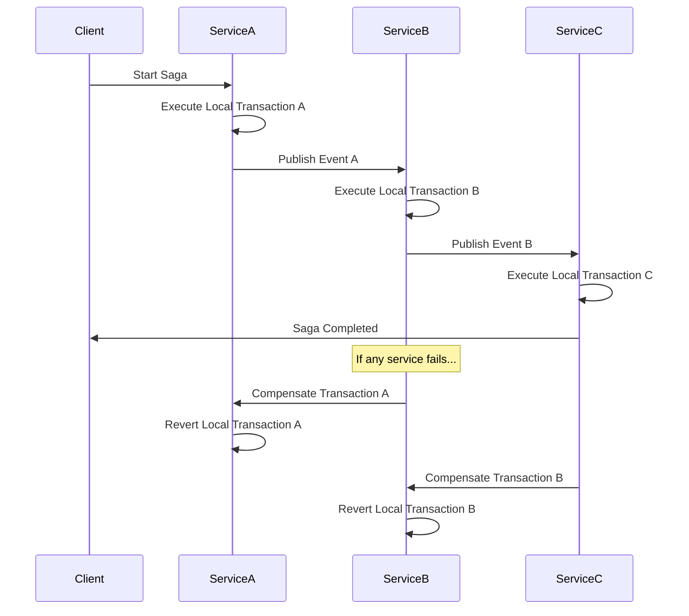
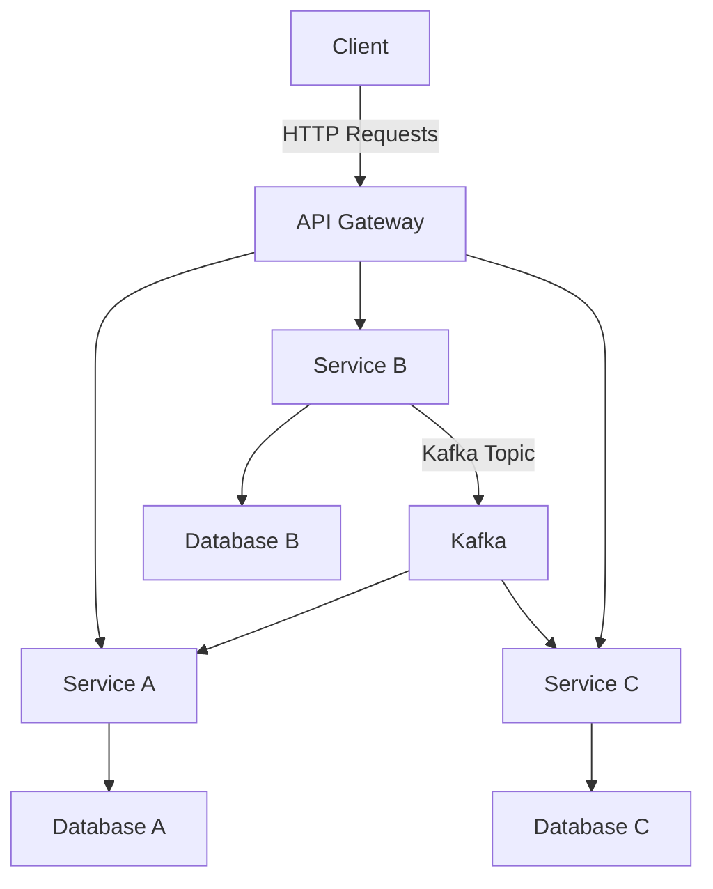
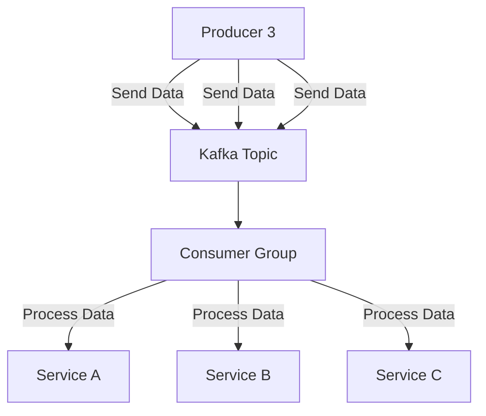
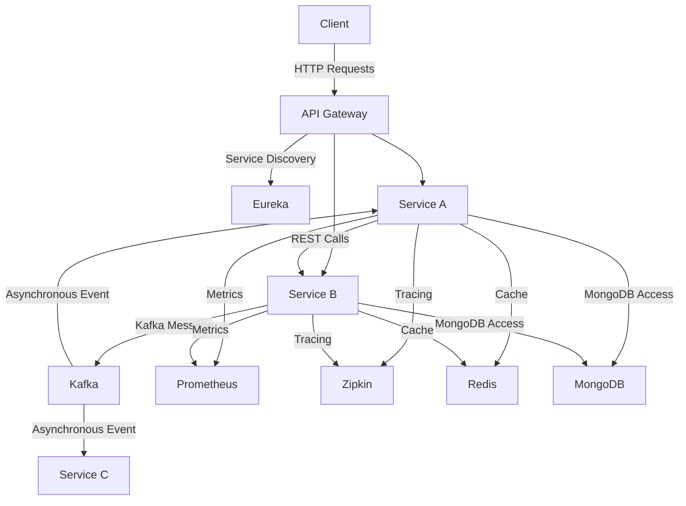

# SPRINGBOOT

## INTROSUCTION

Spring Boot, a powerful extension of the Spring framework, is designed to simplify developing new Spring applications through convention over configuration. This innovative framework focuses on streamlining deployment and development processes, making it a preferred choice for building microservices and enterprise applications. With its robust auto-configuration features, Spring Boot allows developers to focus more on business features and less on boilerplate code.

### 1. What is Spring Boot and what are its Benefits?
   
Spring Boot represents a fusion of the lightweight Spring application framework, configuration annotations, and embedded HTTP server.

Made available with an auto-configuration feature, and support for Spring Initializer, Groovy, and Java, Spring Boot reduces Integration Test, Development, and Unit Test time.

It aids the development of fast, responsive, and secure web applications, providing users with a complete configuration and programming model for Java enterprise applications.

Spring Boot, utilizing the core features of the Spring application framework, offers a faster development technique for RESTful or REST architecture-based web services. 

### 2. What makes Spring Boot superior to JAX-RS?

By leveraging Spring Boot features, users can experience significant advantages over JAX-RS, including:

- Fast deployment
- High scalability
- Container compatibility
- Minimal configuration
- Lower production time
- Increased productivity 
- Reduced development time
- Easy monitoring and management of applications

### 3. What Spring Boot features help develop Microservices Applications?

Primarily used for developing microservices-based applications, Spring Boot offers the following key features for configuring, developing, and deploying microservices architecture.

- Integrates a tool called the Actuator, which enables users to manage and monitor applications
- Provides support for embedded servers, such as Jetty and Tomcat
- Users can simply run war files, without deploying it
- Includes an Auto-Configuration functionality, allowing users to configure Spring applications automatically
- Supports HTTP client Feign

### 4. Why Spring Boot is preferred over any other framework?

The Spring cloud that comes with Spring Boot, includes vast libraries, which is one of the major reasons why most developers prefer the Java-based Spring Boot. 
In addition, Spring Boot offers superior compatibility with Spring frameworks, and it also provides excellent support for docker containerization, heightening performance, and useability. 

Some of the most compelling reasons for using Spring Boot include: 

- Provides the best means to configure Java beans
- Offers robust batch processing 
- Helps users effectively manage Representational State Transfer (REST) endpoints
- Integrates an auto-configuration tool, eliminating the need for manual configuration 
- Enables  annotation-based configurations
- Ease of dependency management
- Includes embedded servlet containers

### 5. What are the key dependencies of Spring Boot?

Mentioned below are important Spring Boot dependencies that need to be added to a Gradle-based or Maven-based application, to ensure application compatibility with Spring Boot features.

- spring-boot-starter-parent
- spring-boot-maven-plugin
- spring-boot-starter-test
- spring-boot-starter-security
- spring-boot-starter-actuator
- Spring-boot-starter-web

### 6. What are the advantages of Spring Boot?

The advantages of Spring Boot are as follows:

- It is very simple to create Spring-based apps in Java or Groovy.
- It cuts down on development time and also increases the output.
- It eliminates the requirement to write repetitive code, annotations, and XML configuration.
- It is very simple to combine Spring Boot Application with its Spring Ecosystem, which includes Spring JDBC, Spring ORM, Spring Data, and Spring Security, among other things.
- To minimize developer effort, it employs the **"Opinionated Defaults Configuration"** approach.
- It provides Embedded HTTP servers such as Tomcat, Jetty, and others to help us build and test our web applications quickly.

### 7. What are the features of Spring Boot?

Features of Spring Boot:

- It is an excellent Spring module for developing online applications.
- Spring Application class offers an easy way to bootstrap a Spring application that can be started from the main method.
- Spring Boot utilizes application events and listeners to handle a variety of tasks. It enables us to build factory files for adding listeners.
- Spring Boot allows you to activate admin-related features for your application.   

### 8. How do you create a Spring Boot application using Maven?

Let us learn how to create a Spring Boot application with Maven. 

Consider Maven is already installed and configured on your machine.

Firstly create a Spring Boot application and to make it simpler create an application with a single main class.

### 9. How do you create a Spring Boot project using Spring Initializer?

Step-by-step instructions for making a spring boot project.

Step 1: Go to https://start.spring.io and launch Spring Initializr.

Step 2: Specify Project Details - Once all of the details are entered, select the Generate Project button to generate and download a Spring Boot project. Following that, unzip the downloaded zip file and transfer it into your preferred IDE.

Step 3: Next open Eclipse and import the file.

Select File -> Import -> Existing Maven Project in Eclipse. On the next page, navigate to or type in the path to the folder where you extracted the zip file. Maven will take some time to download all the dependencies and initialize the project after you select Finish.

### 10. How do you create a Spring Boot project using boot CLI?

- Setting up the CLI: By using SDKMAN, the Spring Boot CLI (Command-Line Interface) can be directly installed!

- Employing the CLI: Once the CLI has been installed, you can launch it by typing spring and hitting Enter.

- Launch a New project: By using start.spring.io and the init command, you can initiate a new project without leaving the shell.

- Using the Embedded Shell: For the BASH and zsh shells, Spring Boot provides command-line completion routines.

### 11. How do you create a simple Spring Boot application?

Check out the simplest method possible used to create a basic "Hello World!" example. Of course, there are many ways to accomplish that, but we'll choose the simplest one. We'll make use of Spring Initializr. With the selected language, version, and dependencies, that tool will automatically build the base project for us. 

### 12. What are the Spring Boot Annotations?

- **@SpringBootApplication**: A configuration class that defines one or more **@Bean** methods and initiates auto-configuration and component scanning is indicated by the annotation.
- **@EnableAutoConfiguration**: Using the jar dependencies you have provided, the **@EnableAutoConfiguration** annotation instructs Spring Boot to "guess" how you want to configure Spring.
- **@ConditionalOnMissingClass**: The Class conditions are these comments' home. Depending on the existence or absence of particular classes, a configuration can be included using the **@ConditionalOnClass** and **@ConditionalOnMissingClass** annotations.
- **@Conditional**: A class evaluating the specific condition can be made for circumstances that are even more complicated.

### 13. What are the Spring Boot properties?

Spring Boot Properties files are used to configure its auto-configuration and application properties. Spring Boot has many properties that can be used to configure the behavior of the application. Some of the commonly used properties in Spring Boot include **server.port**, t**spring.profiles.active**, t**spring.datasource.url**, t**spring.jpa.show-sql**, and many more.

### 14. What are the Spring Boot Starters?

Spring Boot Starters are a set of pre-configured dependencies that can be easily included in your project to quickly get started with common features or technologies. By including a starter in your project, you can quickly get up and running with minimal configuration.

### 15. What is Spring Boot Actuator?

Spring Boot Actuator is a set of features that provide monitoring and management capabilities for your Spring Boot application. Actuator endpoints expose information about your application, such as health status, metrics, and environment variables, that can be used to monitor and manage your application.

Get access and complete hands-on experience on a plethora of software development skills in our unique Job Guarantee bootcamp. Get job-ready with HackerEarth and HIRIST by enrolling in our comprehensive Full Stack Java Developer Masters program today!

### 16. What is thyme leaf?

Thyme leaf is a popular templating engine used in Spring Boot applications for building dynamic web pages. Moreover, it is humanly readable and developers can use it to create templates that can be rendered in HTML

### 17. How to use thyme leaf?

​​To use Thymeleaf in a Spring Boot application you should include the **thymeleaf-spring-boot-starter** dependency in your project. 

### 18. How do you connect Spring Boot to the database using JPA?

To connect Spring Boot to a database using JPA, configure the JPA properties in the **application.properties** or **application.yml** file. 

### 19. How to connect the Spring Boot application to a database using JDBC?

To connect the Spring Boot to a database using JDBC, configure the JDBC properties in the **application.properties** or **application.yml** file.

### 20. What is @RestController annotation in Spring Boot?

**@RestController** is a Spring Boot annotation used to create RESTful web services.

### 21. What is @RequestMapping annotation in Spring Boot?

**@RequestMapping** is a Spring Boot annotation used to map a URL request to a controller method.

### 22. How do you create a Spring Boot application using Spring Starter Project Wizard?

Follow the steps mentioned below to create a Spring Boot application using the Spring Starter Project Wizard, you need to follow these steps:

- Open your preferred IDE and select the "New Project" option.
- Next choose the "Spring Initializr" or "Spring Starter Project" option.
- Fill in the required project information, such as project name, description, and dependencies.
- Click on "Generate" to create the project structure and download the necessary dependencies.
- Start coding your application logic.

### 23. Spring Vs Spring Boot?

Spring is a framework that provides various modules for building enterprise-level applications.

Spring Boot is a framework that simplifies Spring development by providing a pre-configured environment that enables developers to focus on building the application logic.

Difference between Spring and Spring Boot

|Spring|Spring Boot|
|----------------------------------------------------|----------------------------------------------------|
|Spring is an open-source lightweight framework widely used to develop enterprise applications.|Spring Boot is built on top of the conventional spring framework, widely used to develop REST APIs.|
|The most important feature of the Spring Framework is dependency injection.|The most important feature of the Spring Boot is Autoconfiguration.|
|It helps to create a loosely coupled application.|It helps to create a stand-alone application.|
|To run the Spring application, we need to set the server explicitly.|Spring Boot provides embedded servers such as Tomcat and Jetty etc.|
|To run the Spring application, a deployment descriptor is required.|There is no requirement for a deployment descriptor.|
|To create a Spring application, the developers write lots of code.|It reduces the lines of code.|
|It doesn’t provide support for the in-memory database.|It provides support for the in-memory database such as H2.|
|Developers need to write boilerplate code for smaller tasks.|In Spring Boot, there is reduction in boilerplate code.|
|Developers have to define dependencies manually in the pom.xml file.|pom.xml file internally handles the required dependencies.|

### 24. What annotations are used to create an Interceptor?

A prominent functionality of Spring Boot, Interceptor uses the annotated class @Component, and it implements the interface HandlerInterceptor.

The interface contains 3 main methods, which are:

**The preHandle() Method** − preHandle() is used for intercepting the request prior to the implementation of the handler. If preHandle() returns a “true” boolean value, developers can continue with handler execution. If preHandle() returns a “false” boolean value, developers should stop the handler execution. 

preHandle() implementation looks like:

```java
 @Override
    public boolean preHandle(HttpServletRequest httpServletRequest,
               HttpServletResponse httpServletResponse, Object o) throws Exception {
        logger.info(" Pre handle ");
        if(httpServletRequest.getMethod().equals("GET"))
            return true;
        else
            return false;
    }
```
**The postHandle() Method** − postHandle() is used for intercepting a request following the implementation of the handler. It allows the manipulation of the ModelAndView Object before users render it.

postHandle() implementation looks like:

```java
@Override
    public void postHandle(HttpServletRequest httpServletRequest,
                     HttpServletResponse httpServletResponse,
                           Object o, ModelAndView modelAndView) throws Exception {
        logger.info(" Post handle ");
        if(modelAndView.getModelMap().containsKey("status")){
            String status = (String) modelAndView.getModelMap().get("status");
            if(status.equals("SUCCESS!")){
                status = "Authentication " + status;
                modelAndView.getModelMap().put("status",status);
            }
        }
    }
```
**The afterCompletion() Method** − A HandlerInterceptor callback approach, the afterCompletion() method is used when the entire request gets completed.

afterCompletion() looks like:

```java
@Override
    public void afterCompletion(HttpServletRequest httpServletRequest,
                           HttpServletResponse httpServletResponse,
                                Object o, Exception e) throws Exception {
        logger.info(" After Completion ");
    }
}
```

### 25. What is a Swagger in Spring Boot?

Swagger is used for clearly detailing and documenting RESTful APIs in a machine-readable and human-readable format, which is easily comprehensible for testers and developers, as well as individuals having little knowledge of source code.

Enabling hassle-free application discovery, development, and integration, Swagger allows API consumers to interact with remote services with minimum implementation logic.

### 26. What are Profiles in Spring Boot?

Profiles in the Spring framework enables users to map components and beans to specific profiles, such as the Development (dev) profile, Production (prod) profile, or the Test profile. 

In Spring Boot, the annotation @Profile is used to map components and beans to a certain profile. 

Developers can also set up profiles using the SpringApplication, for instance, SpringApplication.setAdditionalProfiles("dev");

### 27. What differentiates Spring Data JPA and Hibernate?

A Java Persistence API (JPA) implementation, Hibernate facilitates Object-Relational Mapping (ORM), allowing users to store, retrieve, map, and update application data to and from Java objects and relational databases. Hibernate maps the data types in Java to SQL (Structured Query Language) data types, and the classes in java to the database tables, relieving developers from scripting data persistence SQL programs. 

A Spring Data sub-project, Spring Data JPA, on the other hand, gives abstraction over the DAL (Data Access Layer) applying JPA and Object–Relational Mapping implementations, such as Hibernate. Spring Data JPA facilitates the smooth implementation of JPA repositories, and it intends to improve the overall implementation of DAL to a great extent. 

### 28. How are the @RestController and @Controller Annotation different?
The traditional Spring @Controller annotation specifies that an annotated class represents a controller. 

It’s basically a @Component specialization, and it is autodetected via the classpath scanning. 

The @Controller annotation is used along with the annotated handler methodologies based on @RequestMapping annotations.

Developers use the @RestController annotation to develop RESTful web services, utilizing the Spring Model–View–Controller (MVC). 

The Spring @RestController maps the request data to specified request handler methods. 

Once the handler method generates the response body, the @RestController modifies it to XML or JSON response.

### 29. In springboot application.properties or application.yml file which one is loading automatically or which one is default property?

In a Spring Boot application, the default property file that gets loaded automatically is the application.properties file. If both application.properties and application.yml files are present in the classpath, the properties defined in the application.properties file will take precedence over the properties defined in the application.yml file.

### 1. What is Spring Boot?

Spring Boot is built on the top of Spring framework to create stand-alone RESTful web application with very minimal configuration and there is no need of external servers to run the application, because it has embedded servers like Tomcat and Jetty etc.

Spring Boot framework is independent.
It creates executable spring applications that are production-grade.

### 2. What are the Features of Spring Boot?

There are many useful features of Spring Boot. Some of them are mentioned below:

- **Auto-configuration** – Spring Boot automatically configures dependencies by using **@EnableAutoconfiguration** annotation and reduces boilerplate code.
- **Spring Boot Starter POM** – These Starter POMs are pre-configured dependencies for functions like database, security, maven configuration etc.
- **Spring Boot CLI (Command Line Interface)** – This command line tool is generally for managing dependencies, creating projects and running the applications.
- **Actuator** – Spring Boot Actuator provides health check, metrics and monitors the endpoints of the application. It also simplifies the troubleshooting management.
- **Embedded Servers** – Spring Boot contains embedded servers like Tomcat and Jetty for quick application run. No need of external servers.

### 3. What are the advantages of using Spring Boot?

Spring Boot is a framework that creates stand-alone, production grade Spring based applications. So, this framework has so many advantages.

- **Easy to use**:  The majority of the boilerplate code required to create a Spring application is reduced by Spring Boot.
- **Rapid Development**: Spring Boot’s opinionated approach and auto-configuration enable developers to quickly develop apps without the need for time-consuming setup, cutting down on development time.
- **Scalable**: Spring Boot apps are intended to be scalable. This implies they may be simply scaled up or down to match your application’s needs.
- **Production-ready**: Metrics, health checks, and externalized configuration are just a few of the features that Spring Boot includes and are designed for use in production environments.

### 4. Define the Key Components of Spring Boot.

The key components of Spring Boot are listed below:

- Spring Boot starters
- Auto-configuration
- Spring Boot Actuator
- Spring Boot CLI
- Embedded Servers

### 5. Why do we prefer Spring Boot over Spring?

Here is a table that summarizes why we use Spring Boot over Spring framework.

Feature
||Spring|Spring Boot|
|-----------------------|--------------------------------------------|--------------------------------------------|
|Ease of use|More complex| Easier|
|Production readiness| Less production-ready|More production-ready|
|Scalability|Less scalable|More scalable|
|Speed|Slower|Faster|
|Customization	|Less Customizable|	More Customizable|

### 6. Explain the internal working of Spring Boot.

Here are the main steps involved in how Spring Boot works:

- Start by creating a new Spring Boot project.
- Add the necessary dependencies to your project.
- Annotate the application with the appropriate annotations.
- Run the application.

### 7. What are the Spring Boot Starter Dependencies?

Spring Boot provides many starter dependencies. Some of them which are used the most in the Spring Boot application are listed below:

- Data JPA starter
- Web starter
- Security starter
- Test Starter
- Thymeleaf starter

### 8. How does a spring application get started?

A Spring application gets started by calling the main() method with **@SpringBootApplication** annotation in the SpringApplication class. 

This method takes a SpringApplicationBuilder object as a parameter, which is used to configure the application.

Once the SpringApplication object is created, the run() method is called.

Once the application context is initialized, the run() method starts the application’s embedded web server.
Example:
```java
import org.springframework.boot.SpringApplication; 
import org.springframework.boot.autoconfigure.SpringBootApplication;
@SpringBootApplication
public class MyApplication 
{ 
  public static void main(String[] args) {
    SpringApplication.run(MyApplication.class, args);
  }
}
```
### 9. What does the @SpringBootApplication annotation do internally?

The @SpringBootApplication annotation combines three annotations. 

Those three annotations are: **@Configuration**, **@EnableAutoConfiguration**, and **@ComponentScan**.

- **@AutoConfiguration**: This annotation automatically configuring beans in the class path and automatically scans the dependencies according to the application need.
- **@ComponentScan**: This annotation scans the components (@Component, @Service, etc.) in the package of annotated class and its sub-packages.
- **@Configuration**: This annotation configures the beans and packages in the class path.

**@SpringBootApplication** automatically configures the application based on the dependencies added during project creation and bootstraps the application by using run() method inside the main class of an application.

**@SpringBootApplication** = **@Configuration** + **@EnableAutoConfiguration** + **@ComponentScan**

### 10. What is Spring Initializr?

Spring Initializer is a tool that helps us to create skeleton of spring boot project or project structure by providing a maven or gradle file to build the application. 
It set up the framework from scratch.

### 11. What are Spring Boot CLI and the most used CLI commands?

Spring Boot CLI is a command-line tool that can be used to create, run, and manage Spring Boot applications. It is a powerful tool that can help us to get started with Spring Boot quickly and easily. It is built on top of the Groovy programming language.

Most used CLI commands are:

-run
-test
-jar
-war
–init
-help


### 12. What are the basic Spring Boot Annotations?

- **@SpringBootApplication**: This is the main annotation used to bootstrap a Spring Boot application. It combines three annotations: **@Configuration**, **@EnableAutoConfiguration**, and **@ComponentScan**. It is typically placed on the main class of the application.
- **@Configuration**: This annotation is used to indicate that a class contains configuration methods for the application context. It is typically used in combination with **@Bean** annotations to define beans and their dependencies.
- **@Component**: This annotation is the most generic annotation for any Spring-managed component. It is used to mark a class as a Spring bean that will be managed by the Spring container.
- **@RestController**: This annotation is used to define a RESTful web service controller. It is a specialized version of the **@Controller** annotation that includes the **@ResponseBody** annotation by default.
- **@RequestMapping**: This annotation is used to map HTTP requests to a specific method in a controller. It can be applied at the class level to define a base URL for all methods in the class, or at the method level to specify a specific URL mapping.

### 13. What is Spring Boot dependency management?

Spring Boot dependency management makes it easier to manage dependencies in a Spring Boot project. It makes sure that all necessary dependencies are appropriate for the current Spring Boot version and are compatible with it.

To create a web application, we can add the Spring Boot starter web dependency to our application.

### 14. Is it possible to change the port of the embedded Tomcat server in Spring Boot?

Yes, it is possible to change the port of the embedded Tomcat server in a Spring Boot application.

The simple way is to set the server. port property in your application’s **application.properties** file. For example, to set the port to **8081**, add the following property to the **application.properties** file:
```
server.port=8081
```
### 15. What is the starter dependency of the Spring boot module?

Spring Boot Starters are a collection of pre-configured maven dependencies that makes it easier to develop particular types of applications. These starters include,

Dependencies
Version control
Configuration needed to make certain features.
To use a Spring Boot starter dependency, we simply need to add it to our project’s **pom.xml** file. For example, to add the Spring Boot starter web dependency, add the following dependency to the **pom.xml** file:
```pom
<dependency>
      <groupId>org.springframework.boot</groupId> 
      <artifactId>spring-boot-starter-web</artifactId> 
</dependency>
```
### 16. What is the default port of Tomcat in spring boot?

The default port of the embedded Tomcat server in Spring Boot is **8080**. We can change the default port by setting the **server.port** property in your application’s **application.properties** file.

### 17. Can we disable the default web server in the Spring Boot application?

Yes, we can disable the default web server in the Spring Boot application. To do this, we need to set the **server.port** property to **“-1”** in the application’s **application.properties** file.

### 18. How to disable a specific auto-configuration class?

To disable a specific auto-configuration class in a Spring Boot application, we can use the **@EnableAutoConfiguration** annotation with the **“exclude”** attribute.
```java
@EnableAutoConfiguration(exclude = {//classname})**
```
### 19. Can we create a non-web application in Spring Boot?

Yes, we can create a non-web application in Spring Boot. Spring Boot is not just for web applications. Using Spring Boot, we can create applications like Microservices, Console applications, and batch applications.

### 20. Describe the flow of HTTPS requests through the Spring Boot application.
The flow of HTTPS requests through a Spring Boot application is as follows:

Spring Boot HTTP Request Flow

- First client makes an HTTP request (GET, POST, PUT, DELETE) to the browser.
- After that the request will go to the controller, where all the requests will be mapped and handled.
- After this in Service layer, all the business logic will be performed. It performs the business logic on the data that is mapped to JPA (Java Persistence API) using model classes.
- In repository layer, all the CRUD operations are being done for the REST APIs.
- A JSP page is returned to the end users if no errors are there.

### 21. Explain @RestController annotation in Spring Boot.

@RestController annotation is like a shortcut to building RESTful services. It combines two annotations:

@Controller: Marks the class as a request handler in the Spring MVC framework.
@ResponseBody: Tells Spring to convert method return values (objects, data) directly into HTTP responses instead of rendering views.
It enables us to Define endpoints for different HTTP methods (GET, POST, PUT, DELETE), return data in various formats (JSON, XML, etc.) and map the request parameters to method arguments.

### 22. Difference between @Controller and @RestController

Features	
@Controller

@RestController

Usage

It marks a class as a controller class.

It combines two annotations i.e. @Controller and @ResponseBody.

Application

Used for Web applications.

Used for RESTful APIs.

Request handling and Mapping

Used with @RequestMapping annotation to map HTTP requests with methods.

Used to handle requests like GET, PUT, POST, and DELETE.

Note: Both annotations handle requests, but @RestController prioritizes data responses for building API.

### 23. What is the difference between RequestMapping and GetMapping?

#### Features

@RequestMapping

@GetMapping

Annotations

@RequestMapping

@GetMapping

#### Purpose

Handles various types of HTTP requests (GET, POST, etc.)

Specifically handles HTTP GET requests.

#### Example

@RequestMapping(value = “/example”, method = RequestMethod.GET)

@GetMapping(“/example”)

### 24. What are the differences between @SpringBootApplication and @EnableAutoConfiguration annotation?

#### Features

@SpringBootApplication

@EnableAutoConfiguration

#### When to use

When we want to use auto-configuration

When we want to customize auto-configuration

#### Entry point

Typically used on the main class of a Spring Boot application, serving as the entry point.

Can be used on any configuration class or in conjunction with @SpringBootApplication.

#### Component Scanning

Includes @ComponentScan annotation to enable component scanning.

Does not perform component scanning by itself.

#### Example

@SpringBootApplication public class MyApplication { public static void main(String[] args) { SpringApplication.run(MyApplication.class, args); } }

@Configuration @EnableAutoConfiguration public class MyConfiguration { }

### 25. What are Profiles in Spring?

Spring Profiles are like different scenarios for the application depending on the environment.

You define sets of configurations (like database URLs) for different situations (development, testing, production).
Use the @Profile annotation to clarify which config belongs to where.
Activate profiles with environment variables or command-line options.
To use Spring Profiles, we simply need to define the spring.profiles.active property to specify which profile we want to use.

### 26. Mention the differences between WAR and embedded containers.

Feature

WAR

Embedded containers

Packaging

Contains all of the files needed to deploy a web application to a web server.

It is a web application server included in the same JAR file as the application code.

Configuration

Requires external configuration files (e.g., web.xml, context.xml) to define the web application.

Uses configuration properties or annotations within the application code.

Security

Can be deployed to a web server that is configured with security features.

Can be made more secure by using security features that are provided by JRE.

### 27. What is Spring Boot Actuator?

Spring Boot Actuator is a component of the Spring Boot framework that provides production-ready operational monitoring and management capabilities. We can manage and monitor your Spring Boot application while it is running.

Note: To use Spring Boot Actuator, we simply need to add the spring-boot-starter-actuator dependency to our project.

To know more about Actuator, refer to this article – Spring Boot Actuator

### 28. How to enable Actuator in the Spring boot application?

Below are the steps to enable actuator in Spring Boot Application:

Add Actuator dependency.
Enable endpoints in application.properties.
Run your Spring Boot app.
Now we can access Actuator endpoints at URLs on the management port.

### 29. What is the purpose of using @ComponentScan in the class files?

@ComponentScan annotation is used to tell Spring to scan a package and automatically detect Spring components, configurations, and services to configure. The @ComponentScan annotation can be used in the following ways:

Without arguments
With basePackageClasses
With basePackages
To know more about @ComponentScan annotation, refer to this article –Spring @ComponentScan Annotation with Example

### 30. What are the @RequestMapping and @RestController annotations in Spring Boot used for?

@RequestMapping: @RequestMapping is used to map HTTP requests to handler methods in your controller classes. It can be used at the class level and method level. It supports mapping by:

HTTP method – GET, POST, PUT, DELETE
URL path
URL parameters
Request headers
@RestController: @RestController is a convenience annotation that combines @Controller and @ResponseBody. It indicates a controller where every method returns a domain object instead of a view.

@RestController = @Controller + @ResponseBody

### 31. How to get the list of all the beans in your Spring boot application?

Using the ApplicationContext object in Spring Boot, we can retrieve a list of all the beans in our application.
The ApplicationContext is responsible for managing the beans and their dependencies.

### 32. Can we check the environment properties in your Spring boot application explain how?

Yes, we can check the environment properties in our Spring Boot Application. The Environment object in a Spring Boot application can be used to check the environment’s properties.

Configuration settings for the application, includes:

property files
command-line arguments
environment variables
We can get the Environment instance by calling the getEnvironment() method.

### 33. How to enable debugging log in the spring boot application?

To enable debugging log in Spring Boot Application, follow the below steps:

Add the logging level property to application.properties.
Configure the log pattern to include useful information.
Run the Spring Boot application.
Using the actuator endpoint, the log level can also be changed at runtime.

Curl -X POST \http://localhost:8080/actuator/loggers/<logger-name> 
\ -H 'content-type: application/json' \-d '{"configuredLevel": "DEBUG"}'

### 34. What is dependency Injection and its types?

Dependency Injection (DI) is a design pattern that enables us to produce loosely coupled components. In DI, an object’s ability to complete a task depends on another object. There three types of dependency Injections.

Constructor injection: This is the most common type of DI in Spring Boot. In constructor injection, the dependency object is injected into the dependent object’s constructor.
Setter injection: In setter injection, the dependency object is injected into the dependent object’s setter method.
Field injection: In field injection, the dependency object is injected into the dependent object’s field.
To know more about Dependency Injection, refer to the article – Spring Dependency Injection with Example – GeeksforGeeks

### 35. What is an IOC container?

An IoC (Inversion of Control) Container in Spring Boot is essentially a central manager for the application objects that controls the creation, configuration, and management of dependency injection of objects (often referred to as beans), also referred to as a DI (Dependency Injection) container.

To know more about IOC Container, refer to the article – Spring – IoC Container

### 36. What is the difference between Constructor and Setter Injection?

|Features|Constructor Injection|Setter Injection|
|-------------------------------|-------------------------------|-------------------------------|
|Dependency|Dependencies are provided through constructor parameters.|Dependencies are set through setter methods after object creation.|
|Immutability|Promotes immutability as dependencies are set at creation.|Dependencies can be changed dynamically after object creation.|
|Dependency Overriding|Harder to override dependencies with different implementations.|Allows easier overriding of dependencies using different setter values.|

Below is an example of Constructor Injection, Setter Injection, and Field Injection in a Spring application with the respective configurations:

- 1. Constructor Injection:

EmployeeService.java:
```java
public class EmployeeService {
    private EmployeeRepository employeeRepository;

    public EmployeeService(EmployeeRepository employeeRepository) {
        this.employeeRepository = employeeRepository;
    }

    public void save(Employee employee) {
        employeeRepository.save(employee);
    }
}
```

EmployeeRepository.java:
```java
public class EmployeeRepository {
    public void save(Employee employee) {
        // save employee implementation
    }
}
```

- 2. Setter Injection:

EmployeeService.java:
```java
public class EmployeeService {
    private EmployeeRepository employeeRepository;

    public void setEmployeeRepository(EmployeeRepository employeeRepository) {
        this.employeeRepository = employeeRepository;
    }

    public void save(Employee employee) {
        employeeRepository.save(employee);
    }
}
```

EmployeeRepository.java:
```java
public class EmployeeRepository {
    public void save(Employee employee) {
        // save employee implementation
    }
}
```

- 3. Field Injection:

EmployeeService.java:
```java
public class EmployeeService {
    @Autowired
    private EmployeeRepository employeeRepository;

    public void save(Employee employee) {
        employeeRepository.save(employee);
    }
}
```

EmployeeRepository.java:
```java
public class EmployeeRepository {
    public void save(Employee employee) {
        // save employee implementation
    }
}
```

- Configuration for Constructor Injection:

EmployeeConfig.java:
```java
@Configuration
public class EmployeeConfig {
    @Bean
    public EmployeeRepository employeeRepository() {
        return new EmployeeRepository();
    }

    @Bean
    public EmployeeService employeeService() {
        return new EmployeeService(employeeRepository());
    }
}
```

- Configuration for Setter Injection and Field Injection:

EmployeeConfig.java:
```java
@Configuration
public class EmployeeConfig {
    @Bean
    public EmployeeRepository employeeRepository() {
        return new EmployeeRepository();
    }

    @Bean
    public EmployeeService employeeService() {
        return new EmployeeService();
    }
}
```

**Note**: For **Setter Injection** and **Field Injection**, make sure to use **`@Autowired`** annotation on the respective setter method or field.

There is no definitive answer on which type of dependency injection (Constructor Injection, Setter Injection, or Field Injection) is better as it ultimately depends on the specific requirements and context of the application being developed.

**Constructor Injection** is considered to be the most recommended and preferred method as it ensures that all dependencies are satisfied when an object is created. This means that the object is in a valid state as soon as it is created, which can help prevent runtime errors and improve code readability.

**Setter Injection**, on the other hand, allows for more flexibility as dependencies can be set after the object has been created. This can be useful in situations where optional dependencies are needed or when circular dependencies exist. However, it can also lead to objects being in an inconsistent state until all dependencies are set.

**Field Injection** injects dependencies directly into the fields of a class, which can lead to issues with encapsulation and testing. Some developers argue that Field Injection can make code harder to maintain and test due to the implicit nature of the injection.

In general, it is recommended to use Constructor Injection whenever possible, as it promotes better code design and makes dependencies explicit. However, there may be situations where Setter Injection or Field Injection are more appropriate, depending on the specific requirements of the application. Ultimately, it is important to consider the pros and cons of each method and choose the one that best fits the needs of the project.

### 37. What is Thymeleaf?

Thymeleaf is a Java-based server-side template engine used in Java web applications to render dynamic web pages. It is a popular choice for server-side templating in the Spring ecosystem, including Spring Boot.

### 38. Explain Spring Data and What is Data JPA?

Spring Data is a powerful framework that can be used to develop data-oriented applications. It aims to simplify the development of data-centric applications by offering abstractions, utilities, and integration with various data sources.

Spring Data JPA: This project provides support for accessing data from relational databases using JPA.

### 39. Explain Spring MVC

MVC stands for Model, View, and Controller. Spring MVC is a web MVC framework built on top of the Spring Framework. It provides a comprehensive programming model for building web applications.

### 40. What is Spring Bean?

An object that is managed by the Spring IoC container is referred to as a spring bean. A Spring bean can be any Java object.

### 41. What are Inner Beans in Spring?

An Inner Bean refers to a bean that is defined within the scope of another bean’s definition. It is a way to declare a bean inside the configuration of another bean, without explicitly giving it a unique identifier.

To define an Inner Bean in Spring, we can declare it as a nested **<bean>** element within the configuration of the enclosing bean.

### 42. What is Bean Wiring?

Bean wiring is a mechanism in Spring that is used to manage the dependencies between beans. It allows Spring to inject collaborating beans into each other. There are two types of Bean Wiring:

- Autowiring
- Manual wiring

In Spring framework, autowiring is a way to automatically inject dependencies into a Spring bean without explicitly defining them in the bean configuration file. This reduces the amount of configuration required and makes the code more maintainable.

There are different types of autowiring in Spring:

- No Autowiring: In this type, autowiring is disabled and you need to explicitly wire the beans using the <ref> tag in the bean configuration file.

- Autowiring by Name: In this type, the Spring container tries to match and wire a bean property with a property of the same name in the container. For example:

```java  
public class UserServiceImpl {
    private UserRepository userRepository;
    
    // Getter and setter for userRepository
}
``
If there is a bean named "userRepository" in the container, it will be injected into the UserServiceImpl bean automatically.

Autowiring by Type: In this type, the Spring container tries to match and wire a bean property by type. For example:
```java 
public class UserServiceImpl {
    @Autowired
    private UserRepository userRepository;
    
    // Getter and setter not needed
}
```
If there is a bean of type UserRepository in the container, it will be injected into the UserServiceImpl bean automatically.

- Autowiring by Constructor: In this type, Spring will try to auto-wire constructor arguments.

For example:

```java 
public class UserServiceImpl {
    private UserRepository userRepository;
    
    @Autowired
    public UserServiceImpl(UserRepository userRepository) {
        this.userRepository = userRepository;
    }
}
```
The UserRepository bean will be automatically passed as a constructor argument when the UserServiceImpl bean is created.

Overall, autowiring can greatly simplify the configuration of Spring beans and reduce the boilerplate code required for dependency injection.

### 43. What Are Spring Boot DevTools Used For?

Spring Boot DevTools provides a number of development-time features and enhancements to increase developers’ productivity and can be used for the following purposes:

- Automatic application restart
- Fast application startup:
- Actuator endpoints
- Additional development utilities

### 44. What error do you see if H2 is not present in the class path?

Below is the error we see if H2 is not present in the class path:

**java.lang.ClassNotFoundException: org.h2.Driver**

### 45. Mention the steps to connect the Spring Boot application to a database using JDBC.

To connect an external database like MySQL or Oracle to a Spring Boot application using JDBC, we need to follow below steps:

- Add the dependency for the JDBC driver of the database.
- Create an application.properties file.
- Configure the database connection properties.
- Create a JdbcTemplate bean.
- Use the JdbcTemplate bean to execute SQL queries and statements.

### 46. Mention the advantages of the YAML file over than Properties file and the different ways to load the YAML file in Spring boot.

Advantages of YAML file over Properties file:

- Easy to edit and modify.
- Conciseness
- Supports Complex data types.

Different ways to load YAML file in Spring Boot:

- Using the **@ConfigurationProperties** annotation
- Using the **YamlPropertiesFactoryBean** class

### 47. What Do you understand about Spring Data Rest?

Spring Data REST is a framework that exposes Spring Data repositories as RESTful web services. It allows us to expose repositories as REST endpoints with minimal configuration by following Spring Data REST Technologies like Spring Data and Spring MVC.

### 48. Why is Spring Data REST not recommended in real-world applications?

Here are the reasons why not to choose Spring Data REST:

- Performance – Performance may not be optimal for very large-scale applications.
- Versioning – It can be difficult to version the REST APIs exposed by Spring Data REST.
- Relationships – Handling relationships between entities can be tricky with Spring Data REST.
- Filtering – There are limited options for filtering the results returned by the endpoints.

### 49. How is Hibernate chosen as the default implementation for JPA without any configuration?

Spring Boot automatically configures Hibernate as the default JPA implementation when we add the spring-boot-starter-data-jpa dependency to our project. This dependency includes the Hibernate JAR file as well as the Spring Boot auto-configuration for JPA.

### 50. servlet vs filter vs interceptor explain and provide the differences?

**Servlet**:
- A servlet is a Java class that handles requests and responses on the server side.
- It is used to generate dynamic web content or process client requests.
- Servlets have a lifecycle managed by the Servlet container.

**Filter**:

- A filter is a Java class that is used to perform preprocessing and postprocessing of requests and responses.
- Filters are used to intercept and modify requests and responses before they reach the servlet or are sent back to the client.
- Multiple filters can be chained together to perform different operations.

**Interceptor**:

- An interceptor is a design pattern used to manage cross-cutting concerns in applications.
- Interceptors are used to intercept and process requests and responses at specific points in the application flow.
- Interceptors are often used in frameworks such as Spring MVC and Struts for logging, authentication, and other cross-cutting concerns.

**servlet vs filter vs interceptor**:

| Feature | Servlet | Filter | Interceptor | 
|--------------|-----------------------------------------------|----------------------------------------------|----------------------------------------------| 
| Type | Interface | Interface | Interface | 
| Purpose | Handle client requests and responses | Intercept and manipulate requests and responses| Intercept and manipulate requests and responses| 
| Sequence | Executes before filters and interceptors | Executes before and after servlets, and other filters | Executes before and after servlets, filters, and other interceptors| | Configuration| Defined in web.xml or via annotations | Defined in web.xml or via annotations | Usually configured using annotations in Spring| 
| Context | Servlet API | Servlet API | Spring framework or other frameworks | 
| Scope | Application-wide | Application-wide | Typically used at controller level in Spring | 
| Example | HttpServlet | javax.servlet.Filter | HandlerInterceptor |

### 51. Setter Dependency Injection (SDI) vs. Constructor Dependency Injection (CDI)

| Setter DI | Constructor DI |
|--------------|-----------------------------------------------|
| Poor readability as it adds a lot of boiler plate codes in the application.|Good readability as it is separately present in the code.|	
| The bean must include getter and setter methods for the properties.|The bean class must declare a matching constructor with arguments. Otherwise, BeanCreationException will be thrown.|
| Requires addition of @Autowired annotation, above the setter in the code and hence, it increases the coupling between the class and the DI container.|	Best in the case of loose coupling with the DI container as it is not even required to add @Autowired annotation in the code.(Implicit constructor injections for single constructor scenarios after spring 4.0)|
|Circular dependencies or partial dependencies result with Setter DI because object creation happens before the injections.|	No scope for circular or partial dependency because dependencies are resolved before object creation itself.|
|Preferred option when properties are less and mutable objects can be created.|	Preferred option when properties on the bean are more and immutable objects (eg: financial processes) are important for application.|

### 52. What is Spring Dependency Injection? Need for Dependency Injection ? Types of Spring Dependency Injection with example and compare with both xml and annotation based configuration with example.

Spring Dependency Injection is a design pattern used in Spring Framework where the components of an application are provided with their dependencies rather than being responsible for creating them. Dependency Injection helps in decoupling the code and making it easier to test and maintain.

The need for Dependency Injection arises when the components of an application have dependencies on other components or services. Using Dependency Injection, these dependencies can be injected into the components at runtime, making the code more modular and flexible.

There are two types of Dependency Injection in Spring Framework:

- Constructor Injection: In Constructor Injection, dependencies are provided to a component through its constructor.
Example of Constructor Injection:
```java
 
public class UserService {
    private UserRepository userRepository;
    
    public UserService(UserRepository userRepository) {
        this.userRepository = userRepository;
    }
}
```
- Setter Injection: In Setter Injection, dependencies are provided to a component through setter methods.
Example of Setter Injection:
```java
 
public class UserService {
    private UserRepository userRepository;
    
    public void setUserRepository(UserRepository userRepository) {
        this.userRepository = userRepository;
    }
}
```
Now, let's compare XML-based configuration and Annotation-based configuration in Spring Dependency Injection:
```xml
- XML-Based Configuration:
 
<bean id="userRepository" class="com.example.UserRepositoryImpl" />
<bean id="userService" class="com.example.UserService">
    <property name="userRepository" ref="userRepository" />
</bean>
```
- Annotation-Based Configuration:
```java
@Component
public class UserRepositoryImpl implements UserRepository {
    // implementation
}

@Component
public class UserService {
    @Autowired
    private UserRepository userRepository;
    // other methods
}
```
In both XML-based and Annotation-based configurations, we are configuring the dependencies for UserService. However, in XML-based configuration, we need to explicitly define the dependencies in an XML file. On the other hand, in Annotation-based configuration, we use annotations like @Component and @Autowired to define and inject dependencies.

Overall, Dependency Injection in Spring Framework helps in achieving loose coupling between components, making the code more maintainable and testable. The choice between XML-based and Annotation-based configuration depends on the preference and requirements of the developers.


#### Spring – IoC Container

The Spring framework can be considered as a collection of sub-frameworks, also referred to as layers, such as Spring AOP, Spring ORM, Spring Web Flow, and Spring Web MVC. You can use any of these modules separately while constructing a Web application. The modules may also be grouped together to provide better functionalities in a web application. 

Prior to penetrating down to Spring to container do remember that Spring provides two types of Containers namely as follows:

- BeanFactory Container
- ApplicationContext Container
The features of the Spring framework such as IoC, AOP, and transaction management, make it unique among the list of frameworks. Some of the most important features of the Spring framework are as follows:

- IoC container
- Data Access Framework
- Spring MVC
- Transaction Management
- Spring Web Services
- JDBC abstraction layer
- Spring TestContext framework
  
Spring IoC Container is the core of Spring Framework. It creates the objects, configures and assembles their dependencies, manages their entire life cycle. The Container uses Dependency Injection(DI) to manage the components that make up the application. It gets the information about the objects from a configuration file(XML) or Java Code or Java Annotations and Java POJO class. These objects are called Beans. Since the Controlling of Java objects and their lifecycle is not done by the developers, hence the name Inversion Of Control. 

Note: Spring IoC generally directly refers to a core container that uses the DI/DC pattern to implicitly provide an object reference in a class during runtime. The IoC container contains assembler code that handles the configuration management of application objects. 

The following diagram depicts how the Container makes use of Configuration metadata and Java POJO classes to manage beans.

So finally let us discuss out some major differences between BeanFactory vs ApplicationContext in order to get a clear cutaway understanding of the spring IoC container which is as shown below in a tabular format below as follows:

|Feature | BeanFactory | ApplicationContext|
|-------------------|-------------------|-------------------|
|Annotation Support	|No |Yes|
|Bean Instantiation/Wiring	|Yes|Yes|
|Internationalization|No|Yes|
|Enterprise Services	|No|Yes|
|ApplicationEvent publication	|No |Yes|
|Automatic BeanPostProcessor registration|No|Yes|
|Loading Mechanism|	Lazy loading|	Aggressive loading|
|Automatic BeanFactoryPostProcessor registration|No|Yes|

#### 1. What is Spring Boot? How it is Different from Spring Framework?
Spring boot modules
Spring boot modules
Spring Boot is a Spring framework module that provides RAD (Rapid Application Development) features to the Spring framework with the help of starter templates and auto-configuration features which are very powerful and work flawlessly.

Spring Boot starters take an opinionated view of the Spring platform and third-party libraries. It means that as soon as we include any dependency into an application, spring boot assumes its general purpose and automatically configures the most used classes in the library as spring beans with sensible defaults.

For example, if we create a WebMVC application, only including the maven dependency spring-boot-starter-web brings all jars/libraries used for building web, including RESTful, applications using Spring WebMVC. It also includes Tomcat as the default embedded server.

It also provides a range of non-functional features such as embedded servers, security, metrics, health checks, and externalized configuration out of the box without extra configurations.

Suppose we have to identify the difference between the Spring framework and Spring boot. In that case, we can say that Spring Boot is an extension of the Spring framework, which eliminated the boilerplate configurations required for setting up a working production-ready application.

It takes an opinionated view of the Spring and third-party libraries imported into the project and configures the behavior for us.

#### 2. What are the New Features in Spring Boot 3?
There are several new features in Spring boot 3 which is based on Spring 6. It changes a lot of things we need to take care of during the application development in the future.

The main features or changes introduced in Spring 6 (also applicable to Spring Boot 3) are as follows:

Upgraded baseline Java version to Java 17. Older versions are not supported. Additionally, in the future, Spring 6 will adopt more exciting features such as Project Loom while retaining a JDK 17 baseline.
Replaced Java EE with Jakarta EE; the minimum supported version is Jakarta EE9. 
Native support for declarative HTTP client interface using @HttpExchange annotations.
New ProblemDetail API for compliance with Problem Details for HTTP APIs specification [RFC 7807].
Expect first-class support for JPMS (Java Platform Module System) which will allow more strict accessibility in the application code and libraries.
Enhanced support for native compilation, a move towards making cloud-native applications more efficient.
Bakes observability into Spring to further encourage cloud-native development.
#### 3. Advantages and Disadvantages of Spring Boot?
Advantages:
The best advantage of Spring Boot is that it provides simplified & version-conflict-free dependency management through the starter POMs and opinionated auto-configuration of most commonly used libraries and behaviors.

The embedded jars enable package the web applications as jar files that we can run anywhere.

The actuator module provides HTTP endpoints to access application internals like detailed performance metrics, health status, etc.

Disadvantages:
On the disadvantages side, they are very few. Still, many developers may see the transitive dependencies included with starter poms as a burden to deployment packaging.

Also, its auto-configuration feature may enable many such features that we may never use in the application lifecycle. They will sit there all the time, initialized and fully configured. It may cause some unnecessary resource utilization.

#### 4. How Can We Set Up a Spring Boot Application With Maven?
The easiest and recommended way to set up a new Spring boot application is using the Spring Initializr tool. It ensures that we are using the latest artifact versions, automatically. The tool can generate the project with various configurations such as Java version, Maven or Gradle build, jar or war packaging, etc. We can also select all the features our application needs, such as Web, JPA, H2 etc.


Another way to create a project is to Create New Maven Project wizard in IDEs such as Eclipse or IntelliJ. After creating the maven project, we need to include the spring-boot-starter-parent dependency in the pom.xml file, if the tool didn’t include it already.

```pom
<parent>
  <groupId>org.springframework.boot</groupId>
  <artifactId>spring-boot-starter-parent</artifactId>
  <version>3.1.2</version>
  <relativePath/> <!-- lookup parent from repository -->
</parent>
```
#### 5. What is AutoConfiguration? How to Enable or Disable a Certain Configuration?
Spring boot autoconfiguration scans the classpath, finds the libraries in the classpath and then attempts to guess the best default configuration for them, and finally configure all such beans.

Autoconfiguration tries to be as intelligent as possible and backs away as we define more of our own custom configuration. Autoconfiguration is always applied after user-defined custom beans have been registered.

Autoconfiguration works with the help of @Conditional annotations such as @ConditionalOnBean and @ConditionalOnClass.

For example, look at AopAutoConfiguration class. If classpath scanning finds EnableAspectJAutoProxy, Aspect, Advice and AnnotatedElement classes and spring.aop.auto=false is not present in the properties file, then Spring boot will configure the Spring AOP module for us.
```java
@Configuration
@ConditionalOnClass({ EnableAspectJAutoProxy.class,
			Aspect.class,
			Advice.class,
			AnnotatedElement.class })
@ConditionalOnProperty(prefix = "spring.aop",
			name = "auto",
			havingValue = "true",
			matchIfMissing = true)
public class AopAutoConfiguration
{
	//code
}
```
To enable an autoconfiguration, just importing the correct starter dependency is enough. Everything else works as discussed above.

To disable an autoconfiguration, use the exclude attribute of the @EnableAutoConfiguration annotation. For instance, this code snippet disables the DataSourceAutoConfiguration:

@EnableAutoConfiguration(exclude = DataSourceAutoConfiguration.class)
public class MyConfiguration { }

#### 6. What are Starter Dependencies?
Spring Boot starters are maven templates that contain a collection of all the relevant transitive dependencies that are needed to start a particular functionality.

For example, If we want to create a Spring WebMVC application, we would have included all required dependencies ourselves in a traditional setup. It leaves the chances of version conflict which ultimately results in ClassCastException.

With Spring boot, to create a WebMVC application, all we need to import is spring-boot-starter-web dependency. Transitively, this starter brings in all other required dependencies to build a web application, for example, spring-webmvc, spring-web, hibernate-validator, tomcat-embed-core, tomcat-embed-el, tomcat-embed-websocket, jackson-databind, jackson-datatype-jdk8, jackson-datatype-jsr310 and jackson-module-parameter-names.
```pom
<dependency>
    <groupId>org.springframework.boot</groupId>
    <artifactId>spring-boot-starter-web</artifactId>
</dependency>
```
#### 7. What are Some Important Spring Boot Annotations?
The most commonly used and important spring boot annotations are as below:

@ComponentScan – enables component scanning in the application classpath.
@EnableAutoConfiguration – enables auto-configuration mechanism that attempts to guess and configure beans that you are likely to need.
@Configuration – indicates that a class declares one or more @Bean methods to generate bean definitions and service requests for those beans at runtime.
@SpringBootApplication – is a composite annotation composed of the above 3 annotations. This enables auto-configuration mechanism, enable component scanning and register extra beans in the context.
@ImportAutoConfiguration – imports and apply only the specified auto-configuration classes. We should use this when we don’t want to enable the default autoconfiguration.
@AutoConfigureBefore, @AutoConfigureAfter, @AutoConfigureOrder – shall be used if the configuration needs to be applied in a specific order (before of after).
@Conditional – annotations such as @ConditionalOnBean, @ConditionalOnWebApplication or @ConditionalOnClass allow to register a bean only when the condition is met.
#### 8. How to Create a REST API?
Creating a REST API is part of the Spring WebMVC module that is imported via spring-boot-starter-web dependency. With the web module, we get the annotations for creating REST APIs such as @RestController, @GetMapping, @PostMapping etc.

The following is the simplest REST API which returns the message “Hello World!” when we access the API at URL “/hello”.
```java
import org.springframework.web.bind.annotation.GetMapping;
import org.springframework.web.bind.annotation.RestController;

@RestController
public class HelloWorldController {

  @GetMapping("hello")
  String hello() {
    return "Hello, World!";
  }
}
```
In a real-world application, we start with defining the REST resource model which is generally a POJO object with necessary fields and accessor methods.
```java
class Employee {

  private Long id;
  private String name;
  private String role;

  //Getters, Setters, constructors, toString, other fields
}
```
Next, we write the REST controllers that handle the requests coming to resource mapping URLs. At this step, we connect to autowired DAO and other components to fetch the data from backend systems and return the response along with appropriate response codes.
```java
import java.util.List;
import org.springframework.web.bind.annotation.DeleteMapping;
import org.springframework.web.bind.annotation.GetMapping;
import org.springframework.web.bind.annotation.PathVariable;
import org.springframework.web.bind.annotation.PostMapping;
import org.springframework.web.bind.annotation.PutMapping;
import org.springframework.web.bind.annotation.RequestBody;
import org.springframework.web.bind.annotation.RestController;

@RestController
class EmployeeController {

  private final EmployeeRepository repository;

  EmployeeController(EmployeeRepository repository) {
    this.repository = repository;
  }

  //Get All Employees
  @GetMapping("/employees")
  List<Employee> all() {
    return repository.findAll();
  }

  //Create an Employee
  @PostMapping("/employees")
  Employee newEmployee(@RequestBody Employee newEmployee) {
    return repository.save(newEmployee);
  }

  //Other methods
}
```
Also, we can use the annotations, such as @ControllerAdvice, to create a central exception handling mechanism.

Optionally, based on requirements, we can plug-in additional functionalities such as request validations and HATEOAS.

#### 9. Difference between @RestController and @Controller annotations?
The @Controller annotation serves as a specialization of @Component, allowing for implementation classes to be auto-detected through classpath scanning. The @RequestMapping annotated methods, in the controller class, act as request handlers for the mapped URLs.

If we need to return raw JSON or XML from the @Controller class methods, we need to annotate the method with @ResponseBody that indicates a method return value should be bound to the web response body.

The @RestController is a composite annotation that is a combination of @Controller and @ResponseBody. When we annotate a class with @RestController, all the handler methods automatically have @ResponseBody annotation applied. So all handler methods automatically return the raw JSON/XML response bodies.

@RestController = @Controller + @ResponseBody

#### 10. What is the difference between @RequestMapping and @GetMapping?
The @GetMapping is a specialized composed version of @RequestMapping annotation that is used on handler methods for HTTP GET APIs.

@GetMapping = @RequestMapping(method = { RequestMethod.GET })

Similarly, @PostMapping annotation maps HTTP POST requests onto specific handler methods. It is a shorter form to write @RequestMapping(method = RequestMethod.POST)}.

#### 11. How do you add a Filter to an application?
To create a filter, we simply need to implement the javax.servlet.Filter interface. Also, for Spring to recognize a filter, we need to define it as a bean with the @Component annotation.

Based on application needs, we override the filter methods init(), doFilter() and destroy().
```java
@Component
public class TraceLoggingFilter implements Filter {

    @Override
    public void doFilter(
      ServletRequest request, 
      ServletResponse response, 
      FilterChain chain) throws IOException, ServletException {

      //...
    }
}
```
To apply the filter on URL patterns, we need to register it as FilterRegistrationBean.
```java
@Bean
public FilterRegistrationBean<TraceLoggingFilter> tracingFilter()
{
    FilterRegistrationBean<TraceLoggingFilter> filterBean 
    	= new FilterRegistrationBean<>();
    filterBean.setFilter(new TraceLoggingFilter());
    filterBean.addUrlPatterns("/*");
    filterBean.setOrder(1);
    return filterBean;    
}
```
#### 12. Explain Embedded Server Support in Spring Boot
Spring boot applications include embedded servers as part of spring-boot-starter-web dependency and configure Tomcat as the default embedded server. It means that we can run a web application from the command prompt without setting up any complex server infrastructure.

If we want, we can exclude Tomcat and include any other embedded server. Or we can exclude the server environment altogether. It is all configuration-based.

For example, the below configuration excludes Tomcat and includes jetty as the embedded server.

<dependency>
    <groupId>org.springframework.boot</groupId>
    <artifactId>spring-boot-starter-web</artifactId>
    <exclusions>
        <exclusion>
            <groupId>org.springframework.boot</groupId>
            <artifactId>spring-boot-starter-tomcat</artifactId>
        </exclusion>
    </exclusions>
</dependency>
  
<dependency>
    <groupId>org.springframework.boot</groupId>
    <artifactId>spring-boot-starter-jetty</artifactId>
</dependency>
#### 13. Can We Disable the Default Web Server?
Yes, we can disable all embedded servers from a spring boot application. We need to look into the maven dependency tree and exclude the Tomcat library from whichever dependency is including it.

Another way to disable all embedded servers is by using the property spring.main.web-application-type to none in application.properties file.

 spring.main.web-application-type=none

A similar configuration can be done using the Java configuration when starting the application by setting the application type to NONE.

SpringApplication application = new SpringApplication(MainApplication.class);
application.setWebApplicationType(WebApplicationType.NONE);
application.run(args);

#### 14. How to Enable Debug Logging?
The easiest way to enable debug logging is to set it through the properties file:
```
debug=true
```
- For trace level logging
```
trace=true 
```
We can pass the debug flag during application startup as well.
```
java -jar application.jar --debug
```
#### 15. How to Check all the Environment Properties in the Application?
The easiest way to list down all the properties in an application is by including the actuator module and accessing the URL endpoint /env.

Do not forget to enable the endpoint in the properties configuration.
```
management.endpoints.web.exposure.include=env
```
#### 16. How do we Define and Load Properties?
Spring boot provides many ways to set up and access properties in an application.

Typically, spring boot reads and applies all configurations from the application.properties file from the classpath.
To specify a different file name or location, use the startup argument spring.config.location. For example, --spring.config.location=config/*.properties will load the properties files from the config folder.
The @PropertySource annotation is a convenient mechanism for adding property sources. Note that it is a repeatable annotation so we can apply this annotation multiple times in a class. In the event of a property name collision, the last source read takes precedence.
@Configuration
@PropertySource("classpath:foo.properties")
@PropertySource("classpath:bar.properties")
public class AppProperties {
    //...
}

We can use @Value annotation to inject a property directly into a field.
@Value( "${jdbc.url}" )
private String jdbcUrl;

To load the test-specific properties file, the most straightforward way is to use the @TestPropertySource annotation.
To load the profile-specific properties files, application-{environment}.properties file in the src/main/resources directory, and then set a Spring profile with the same environment name.
#### 17. How to Connect to the Database using JPA?
To work with JPA-based repositories, first, we need to include spring-boot-starter and spring-boot-starter-data-jpa dependencies. These starters have all the autoconfiguration and hibernate-related dependencies.

Spring Boot configures Hibernate as the default JPA provider, so the application will automatically have all necessary beans such as entityManagerFactory.

For connecting with a database, we need to specify the datasource configuration in the application.properties file.
```
spring.datasource.driver-class-name=com.mysql.cj.jdbc.Driver
spring.datasource.username=root
spring.datasource.password=sa
spring.datasource.url=jdbc:mysql://localhost:3306/testDb?createDatabaseIfNotExist=true
```
Also, note that Spring boot uses HikariCP as the default connection pool. So if you need to change the connection pool, configure the respective properties.

#### 18. Why do we use Spring Boot Maven Plugin?
The plugin provides Spring Boot support in Maven, letting us package executable jar or war archives and run an application in-place. To use it, we must use Maven 3.2 (or later).

The plugin provides several goals to work with a Spring Boot application:

spring-boot:repackage: create a jar or war file that is auto-executable. It can replace the regular artifact or can be attached to the build lifecycle with a separate classifier.
spring-boot:run: run your Spring Boot application with several options to pass parameters to it.
spring-boot:start and stop: integrate your Spring Boot application to the integration-test phase so that the application starts before it.
spring-boot:build-info: generate a build information that can be used by the Actuator.
#### 19. How to Package an Application as Executable .jar or .war File?
Executable jars (sometimes called”fat jar”) are archives containing the compiled classes and all of the jar dependencies that the application needs to run.

To create an executable jar, we shall add spring-boot-maven-plugin in pom.xml. By default, this plugin package the application as .jar file only.
```pom
<build>
    <plugins>
        <plugin>
            <groupId>org.springframework.boot</groupId>
            <artifactId>spring-boot-maven-plugin</artifactId>
        </plugin>
    </plugins>
</build>
```
The first logical step to create a war file is to declare the packaging type ‘war’ in pom.xml file.

The second thing is set the scope of embedded server dependency to ‘provided‘ because server dependencies will be provided by the application server where we will deploy the war file.
```pom
<packaging>war</packaging>
 
<dependency>
    <groupId>org.springframework.boot</groupId>
    <artifactId>spring-boot-starter-tomcat</artifactId>
    <scope>provided</scope>
</dependency>
```
#### 20. How to Configure Logging in Spring Boot?
Spring Boot uses Commons Logging for all logging internal to the framework and thus it is a mandatory dependency. For other logging needs, Spring boot supports default configuration for Java Util Logging, Log4J2, and Logback.

When added directly or transitively, spring-boot-starter-logging module configures the default logging with Logback and SLF4J.

The default logging uses a console logger with a log level set to DEBUG, which we can change in the custom logback.xml file.

To use Log4j2, we must exclude spring-boot-starter-logging module and import spring-boot-starter-log4j2 module. The custom configuration can be done in the log4j2.xml file.
```pom
<dependency>
    <groupId>org.springframework.boot</groupId>
    <artifactId>spring-boot-starter-web</artifactId>
    <exclusions>
        <exclusion>
            <groupId>org.springframework.boot</groupId>
            <artifactId>spring-boot-starter-logging</artifactId>
        </exclusion>
    </exclusions>
</dependency>
<dependency>
    <groupId>org.springframework.boot</groupId>
    <artifactId>spring-boot-starter-log4j2</artifactId>
</dependency>
```
#### 21. What is the Spring Actuator? What are its Advantages?
Spring boot’s actuator module allows us to monitor and manage application usages in the production environment, without coding and configuration for any of them. This monitoring and management information is exposed via REST-like endpoint URLs.

The simplest way to enable the features is to add a dependency to the spring-boot-starter-actuator starter pom file.
```pom
<dependency>
    <groupId>org.springframework.boot</groupId>
    <artifactId>spring-boot-starter-actuator</artifactId>
</dependency>
```
The actuator module includes several built-in endpoints and lets us add our own. Further, each individual endpoint can be enabled or disabled as well.

Some of the important and widely used actuator endpoints are given below:

Endpoint	Usage
/env	Returns list of properties in the current environment
/health	Returns application health information.
/auditevents	Returns all auto-configuration candidates and the reason why they ‘were’ or ‘were not’ applied.
/beans	Returns a complete list of all the Spring beans in your application.
/trace	Returns trace logs (by default the last 100 HTTP requests).
/dump	It performs a thread dump.
/metrics	It shows several useful metrics information like JVM memory used, system CPU usage, open files, and much more.
#### 22. What are Relaxed Bindings?
Spring Boot uses some relaxed rules for resolving configuration property names such that we can write a simple property name in multiple ways.

For example, a simple property log.level.my-package can be written in the following ways and all are correct and will be resolved by framework for its value based on property source.
```
log.level.my-package = debug    	//Kebab case
log.level.my_package = debug 		//Underscore notation
log.level.myPackage = debug 		//Camel case
LOG.LEVEL.MY-PACKAGE = debug 		//Upper case format
```
Following is a list of the relaxed binding rules per property source.

Property Source	Types Allowed
Properties Files	Camel case, kebab case, or underscore notation
YAML Files	Camel case, kebab case, or underscore notation
Environment Variables	Upper case format with an underscore as the delimiter. _ should not be used within a property name
System Properties	Camel case, kebab case, or underscore notation
#### 23. How to Perform Unit Testing and Integration Testing?
Typically any software application is divided into different modules and components. When one such component is tested in isolation, it is called unit testing.

Unit tests do not verify whether the application code works with external dependencies correctly. It focuses on a single component and mocks all dependencies this component interacts with.

We can perform unit testing help of specialized annotations such as :

@JdbcTest – can be used for a typical JDBC test when a test focuses only on jdbc-based components.
@JsonTest – It is used when a test focuses only on JSON serialization.
@RestClientTest – is used to test REST clients.
@WebMvcTest – used for Spring MVC tests with configuration relevant to only MVC tests.
Integration tests can put the whole application in scope or only certain components – based on what is being tested. They may need to require resources like database instances and hardware to be allocated for them. However, these interactions can be mocked out as well to improve the test performance.

In integration testing, we shall focus on testing complete request processing from the controller to the persistence layer.

The @SpringBootTest annotation helps in writing integration tests. It starts the embedded server and fully initializes the application context. We can inject the dependencies in the test class using @Autowired annotation.

We can also provide test-specific beans configuration using nested @Configuration class or explicit @TestConfiguration classes.

It also registers a TestRestTemplate and/or WebTestClient bean for use in web tests.
```java
@SpringBootTest(classes = SpringBootDemoApplication.class, 
        webEnvironment = WebEnvironment.RANDOM_PORT)
public class EmployeeControllerIntegrationTests 
{
    @LocalServerPort
    private int port;
  
    @Autowired
    private TestRestTemplate restTemplate;
  
    //tests
}
```
#### 24. What are Spring Profiles?
We can assume profiles as the various runtime environments where we will deploy the application, and we expect the application to behave differently. For example, localhost, dev, test and prod.

Spring profiles allow us to map our beans to different profiles. Based on the profile, only mapped beans will be activated and other beans will be deactivated.

To create a new profile, we can use the @Profile annotation. In the given example, we have configured two profiles localhost and non-localhost environments for datasource configuration.
```java
@Profile("localhost")
public class LocalhostDatasourceConfig {
   //...
}

@Profile("!localhost")
public class DatasourceConfig {
   //...
}
```
To activate a profile, we can pass the Spring.profiles.active property during the application startup. This property can also be defined using the system property in the respective machines.

java -jar app.jar -Dspring.profiles.active=localhost

We can specify the default profile using the property spring.profiles.default.

#### 25. What Is Spring Boot DevTools Used For?
The Spring boot dev tools module provides many useful developer features for improving the development experience such as caching static resources, automatic restarts, live reload, global settings and running remote applications.

To enable dev tools, add the spring-boot-devtools dependency in the build file.

Read the linked article to know the complete list of features offered by the dev tools module.

#### 26. How to enable Hot Deployment and Live Reload on the browser?
Most modern IDEs support hot-swapping of bytecode, and most code changes should reload cleanly with no side effects. Additionally, the spring-boot-devtools module includes support for automatic application restarts whenever files on the classpath change.

By default, any entry on the classpath that points to a folder is monitored for changes. Note that certain resources, such as static assets and view templates, do not need to restart the application.

The spring-boot-devtools module includes an embedded LiveReload server that can be used to trigger a browser refresh when a resource is changed. LiveReload browser extensions are freely available for Chrome, Firefox and Safari from livereload.com.

To enable/disable LiveReload server, change value of spring.devtools.livereload.enabled property to true (default value) or false.

#### 27. What is a Cross-Site Request Forgery attack?
CSRF stands for Cross-Site Request Forgery or Session Riding. It targets an end-user to, unknowingly, execute unwanted actions on a web application in which they are currently authenticated.

The unwanted actions are generally the form of URL requests that may happen either by clicking on injected links by the bad actor or by image URLs that do not need even a click.

In a Spring boot applications, CSRF protection is enabled by default. We can disable it using the following spring HttpSecurity interface configuration.
```java
@Override
protected void configure(HttpSecurity http) throws Exception {
    http
      .csrf().disable();
}
```
#### 28. Explain CORS in Spring Boot
CORS (Cross-origin resource sharing) allows a webpage to request additional resources into the browser from other domains e.g. fonts, CSS or static images from CDN. CORS helps in serving web content from multiple domains into browsers that usually have the same-origin security policy.

In Spring,  @CrossOrigin annotation marks the annotated method or type as permitting cross-origin requests. If applied to a controller, all the handler methods permit the cross-origin requests.
```java
@CrossOrigin(origins = "*", allowedHeaders = "*")
@Controller
public class HomeController 
{
    //
}

//or

@Controller
public class HomeController 
{
    @CrossOrigin(origins = "*", allowedHeaders = "*")
    @GetMapping(path="/")
    public String homeInit(Model model) {
        return "home";
    }
}
```
To enable CORS for the whole application, use WebMvcConfigurer to add CorsRegistry.
```java
@Configuration
@EnableWebMvc
public class CorsConfiguration implements WebMvcConfigurer
{
    @Override
    public void addCorsMappings(CorsRegistry registry) {
        registry.addMapping("/**")
                .allowedMethods("GET", "POST");
    }
}
```
#### 29. How to enable HTTPS/SSL support in Spring Boot?
The SSL support in spring boot project can be added via application.properties and by adding the below entries.
```
server.port=8443
server.ssl.key-alias=selfsigned_localhost_sslserver
server.ssl.key-password=changeit
server.ssl.key-store=classpath:ssl-server.jks
server.ssl.key-store-provider=SUN
server.ssl.key-store-type=JKS
```

Maintaining scalability in a Spring Boot microservices architecture involves implementing strategies and best practices that allow your system to handle increased load efficiently and reliably. Here’s a comprehensive guide on achieving scalability in Spring Boot microservices:

### 1. **Design Microservices for Scalability**

- **Decompose Services**: Break down the application into smaller, independent services. Each microservice should handle a specific business capability and be independently deployable.

- **Stateless Services**: Design services to be stateless where possible. This allows services to be easily scaled horizontally by adding more instances.

### 2. **Load Balancing**

- **Client-Side Load Balancing**: Use tools like Netflix Ribbon (which is now part of Spring Cloud LoadBalancer) to distribute requests among service instances.

- **Server-Side Load Balancing**: Implement load balancing with tools like NGINX, HAProxy, or cloud-native load balancers (e.g., AWS ELB, Azure Load Balancer).

### 3. **Service Discovery**

- **Service Registry**: Use service discovery tools like Netflix Eureka or Consul to dynamically manage and discover service instances.

- **Spring Cloud Eureka**: Integrate with Eureka for dynamic registration and discovery of microservices.

### 4. **API Gateway**

- **Gateway Pattern**: Use an API Gateway (e.g., Spring Cloud Gateway, Zuul) to manage routing, load balancing, and security for microservices.

- **Centralized Management**: Handle cross-cutting concerns like authentication, logging, and request transformation at the gateway level.

### 5. **Resilience and Fault Tolerance**

- **Circuit Breaker**: Implement circuit breakers using libraries like Resilience4j or Hystrix to handle service failures gracefully and prevent cascading failures.

- **Retry Mechanism**: Configure retry mechanisms for transient errors using Spring Retry or Resilience4j.

- **Fallback Methods**: Provide fallback methods in case of service failures to ensure that the system remains functional even when some services are down.

### 6. **Caching**

- **Local Caching**: Use local caches (e.g., `@Cacheable` annotations in Spring) to reduce load on services and databases.

- **Distributed Caching**: Implement distributed caching solutions like Redis or Memcached to cache data across multiple instances.

### 7. **Database Scaling**

- **Read Replicas**: Use read replicas to distribute read queries and improve performance.

- **Sharding**: Implement database sharding to distribute data across multiple databases based on a shard key.

- **NoSQL Databases**: Consider NoSQL databases (e.g., MongoDB, Cassandra) for horizontal scalability.

### 8. **Asynchronous Processing**

- **Message Queues**: Use message brokers like RabbitMQ, Kafka, or ActiveMQ to handle asynchronous communication between microservices.

- **Event-Driven Architecture**: Implement an event-driven architecture to decouple services and handle background processing.

- **Task Scheduling**: Use Spring’s `@Scheduled` or `@Async` for task scheduling and asynchronous processing.

### 9. **Monitoring and Logging**

- **Distributed Tracing**: Implement distributed tracing with tools like Spring Cloud Sleuth and Zipkin to track and analyze requests across microservices.

- **Centralized Logging**: Aggregate logs using tools like ELK Stack (Elasticsearch, Logstash, Kibana) or cloud-based logging services for better monitoring and debugging.

- **Metrics Collection**: Use Prometheus and Grafana to collect and visualize metrics for monitoring system performance.

### 10. **Configuration Management**

- **Externalized Configuration**: Use Spring Cloud Config Server or other configuration management tools to externalize and manage configuration properties across environments.

- **Dynamic Configuration**: Implement dynamic configuration updates to avoid redeploying services for configuration changes.

### 11. **Security and Authentication**

- **API Security**: Secure APIs with OAuth2 and JWT tokens using Spring Security and Spring Cloud Security.

- **Rate Limiting**: Implement rate limiting to prevent abuse and ensure fair usage of resources.

### 12. **Deployment and Continuous Integration/Continuous Deployment (CI/CD)**

- **Containerization**: Use Docker to containerize microservices for consistent deployment across different environments.

- **Orchestration**: Deploy and manage containers with orchestration tools like Kubernetes or Docker Swarm.

- **CI/CD Pipelines**: Implement CI/CD pipelines with tools like Jenkins, GitLab CI, or GitHub Actions to automate the build, test, and deployment processes.

### Example: Configuring Load Balancing and Service Discovery

**1. Eureka Service Registry Configuration**

**`application.yml` in Eureka Server:**
```yaml
server:
  port: 8761

eureka:
  client:
    registerWithEureka: false
    fetchRegistry: false
```

**2. Eureka Client Configuration**

**`application.yml` in Client Microservice:**
```yaml
spring:
  application:
    name: client-service

eureka:
  client:
    serviceUrl:
      defaultZone: http://localhost:8761/eureka/
```

**3. Using Spring Cloud LoadBalancer**

**`@LoadBalanced` RestTemplate Bean:**
```java
@Configuration
public class AppConfig {
    
    @Bean
    @LoadBalanced
    public RestTemplate restTemplate() {
        return new RestTemplate();
    }
}
```

**4. API Gateway Configuration**

**`application.yml` in API Gateway:**
```yaml
spring:
  cloud:
    gateway:
      routes:
        - id: service1
          uri: lb://SERVICE1
          predicates:
            - Path=/service1/**
          filters:
            - StripPrefix=1
```

By incorporating these practices, you can build a scalable, resilient, and maintainable microservices architecture using Spring Boot.


Handling microservice failures effectively is crucial for maintaining the stability and reliability of a distributed system. Here are some strategies and best practices to address microservice failures:

### 1. **Design for Failure**

- **Fault Tolerance:** Design your microservices to anticipate and handle failures gracefully. Implement retries, fallbacks, and timeouts.
- **Circuit Breakers:** Use circuit breakers to prevent cascading failures. When a service fails, the circuit breaker can stop requests from being sent to it, giving it time to recover.

### 2. **Monitoring and Alerts**

- **Health Checks:** Implement health checks for your microservices to monitor their status and detect issues early.
- **Logging:** Centralize logging to capture detailed information about service interactions and failures.
- **Metrics:** Use metrics and dashboards to track performance and detect anomalies.

### 3. **Retries and Timeouts**

- **Retries:** Implement retry logic with exponential backoff to handle transient failures. Ensure that retries are idempotent to avoid duplicate operations.
- **Timeouts:** Set appropriate timeouts for service calls to avoid long waits for unresponsive services.

### 4. **Graceful Degradation**

- **Fallbacks:** Provide fallback responses or default values when a service is unavailable.
- **Degradation:** Design your system to degrade gracefully, maintaining partial functionality even if some services are down.

### 5. **Service Decomposition**

- **Small, Manageable Services:** Break down your system into smaller, well-defined services to limit the impact of a failure.
- **Single Responsibility Principle:** Each microservice should have a single responsibility and manage its own state.

### 6. **Data Management**

- **Data Replication:** Use replication and sharding to ensure data availability and durability.
- **Consistency Models:** Choose appropriate consistency models (e.g., eventual consistency) based on your use case and tolerance for data staleness.

### 7. **Failover and Redundancy**

- **Redundancy:** Deploy multiple instances of each service to handle failures and load balancing.
- **Failover Mechanisms:** Implement automatic failover to switch to backup instances or services when a primary one fails.

### 8. **Testing and Validation**

- **Chaos Engineering:** Practice chaos engineering to simulate failures and test the resilience of your system.
- **Automated Testing:** Implement automated tests, including unit, integration, and end-to-end tests, to catch issues early.

### 9. **Deployment Strategies**

- **Blue-Green Deployment:** Use blue-green deployments to minimize downtime and enable easy rollback in case of failure.
- **Canary Releases:** Deploy new changes to a small subset of users first, and monitor for issues before full deployment.

### 10. **Documentation and Runbooks**

- **Documentation:** Maintain up-to-date documentation of your microservices and their interactions.
- **Runbooks:** Create runbooks for common failure scenarios and responses to ensure quick resolution.

### 11. **Scalability**

- **Horizontal Scaling:** Scale services horizontally to handle increased load and mitigate the impact of service failures.
- **Load Balancing:** Use load balancers to distribute traffic evenly and improve fault tolerance.

By incorporating these strategies into your microservices architecture, you can build a more resilient system that can handle failures gracefully and continue to deliver reliable services to users.


In Spring Framework and Spring Boot, **Dependency Injection (DI)** and **Inversion of Control (IoC)** are core principles that facilitate flexible and decoupled code architecture. Here’s a detailed explanation of both concepts and how to use them in Spring Boot:

### 1. **Inversion of Control (IoC)**

**Inversion of Control (IoC)** is a design principle in which the control of object creation and the management of dependencies is inverted from the application code to a container. In simpler terms, instead of the application code managing its dependencies, the Spring container manages them. This promotes loose coupling and enhances flexibility.

#### How IoC Works in Spring:

- **Bean Lifecycle Management**: Spring manages the lifecycle of beans (objects) and their dependencies.
- **Configuration and Dependency Resolution**: Spring uses configuration metadata (XML, Java annotations, or Java configuration classes) to resolve and inject dependencies.

### 2. **Dependency Injection (DI)**

**Dependency Injection (DI)** is a pattern used to implement IoC. It involves providing an object's dependencies (services, configurations, etc.) from outside the object rather than the object creating them itself.

#### Types of Dependency Injection:

1. **Constructor Injection**:
   - Dependencies are provided through the class constructor.
   - Preferred for mandatory dependencies.

   ```java
   @Component
   public class MyService {
       private final MyRepository myRepository;

       @Autowired
       public MyService(MyRepository myRepository) {
           this.myRepository = myRepository;
       }

       // Business logic
   }
   ```

2. **Setter Injection**:
   - Dependencies are provided through setter methods.
   - Useful for optional dependencies.

   ```java
   @Component
   public class MyService {
       private MyRepository myRepository;

       @Autowired
       public void setMyRepository(MyRepository myRepository) {
           this.myRepository = myRepository;
       }

       // Business logic
   }
   ```

3. **Field Injection**:
   - Dependencies are injected directly into fields.
   - Not recommended due to issues with immutability and ease of testing.

   ```java
   @Component
   public class MyService {
       @Autowired
       private MyRepository myRepository;

       // Business logic
   }
   ```

### Using IoC and DI in Spring Boot

Spring Boot builds upon the Spring Framework, making it easier to use IoC and DI through its auto-configuration and component scanning features. Here’s how to use IoC and DI in a Spring Boot application:

#### 1. **Setup Spring Boot Project**

- **Create a Spring Boot Project**: Use Spring Initializr or an IDE like IntelliJ IDEA or Eclipse to create a new Spring Boot project.
- **Add Dependencies**: Include dependencies such as `spring-boot-starter` for core functionalities.

#### 2. **Define Components**

In Spring Boot, you annotate your classes with special annotations to indicate their role:

- **`@Component`**: Indicates that the class is a Spring-managed component.
- **`@Service`**: A specialized `@Component` for service layer classes.
- **`@Repository`**: A specialized `@Component` for DAO/repository classes.
- **`@Controller`**: A specialized `@Component` for web controllers.

**Example**:

```java
import org.springframework.beans.factory.annotation.Autowired;
import org.springframework.stereotype.Service;

@Service
public class MyService {

    private final MyRepository myRepository;

    @Autowired
    public MyService(MyRepository myRepository) {
        this.myRepository = myRepository;
    }

    // Business logic
}
```

#### 3. **Configure Spring Boot Application**

- **Application Configuration**: Use `@SpringBootApplication` to mark the main class of your Spring Boot application. It combines `@Configuration`, `@EnableAutoConfiguration`, and `@ComponentScan`.

**Example**:

```java
import org.springframework.boot.SpringApplication;
import org.springframework.boot.autoconfigure.SpringBootApplication;

@SpringBootApplication
public class MySpringBootApplication {

    public static void main(String[] args) {
        SpringApplication.run(MySpringBootApplication.class, args);
    }
}
```

#### 4. **Use DI in Controllers**

Inject services or other components into controllers using constructor or field injection.

**Example**:

```java
import org.springframework.beans.factory.annotation.Autowired;
import org.springframework.web.bind.annotation.GetMapping;
import org.springframework.web.bind.annotation.RequestMapping;
import org.springframework.web.bind.annotation.RestController;

@RestController
@RequestMapping("/api")
public class MyController {

    private final MyService myService;

    @Autowired
    public MyController(MyService myService) {
        this.myService = myService;
    }

    @GetMapping("/data")
    public String getData() {
        return myService.getData();
    }
}
```

#### 5. **Configuration Properties**

- **Configuration Properties**: Use `@ConfigurationProperties` to bind properties from `application.properties` or `application.yml` to Java objects.

**Example**:

```java
import org.springframework.boot.context.properties.ConfigurationProperties;
import org.springframework.stereotype.Component;

@Component
@ConfigurationProperties(prefix = "app")
public class AppProperties {

    private String name;
    private String version;

    // Getters and Setters
}
```

**`application.properties`**:

```properties
app.name=MyApplication
app.version=1.0.0
```

### Summary

- **IoC (Inversion of Control)**: A design principle where the control of object creation and dependency management is handled by the Spring container.
- **DI (Dependency Injection)**: A pattern used to implement IoC by injecting dependencies into objects rather than objects creating their dependencies.
- **Spring Boot**: Uses annotations like `@Component`, `@Service`, `@Repository`, and `@Controller` for managing beans and injecting dependencies. The `@SpringBootApplication` annotation sets up component scanning and configuration.

By leveraging IoC and DI, Spring Boot applications become more modular, testable, and maintainable.

In Spring Framework and Spring Boot, **autowiring** is a feature that allows Spring to automatically resolve and inject dependencies into beans. It reduces the need for explicit bean wiring in configuration files or classes. There are several types of autowiring, and both XML configuration and annotation-based approaches can be used to achieve autowiring.

### Types of Autowiring in Spring

1. **Autowiring by Type**
2. **Autowiring by Name**
3. **Autowiring by Constructor**
4. **Autowiring by Qualifier** (used in conjunction with other autowiring modes)
5. **Autowiring with `@Resource` Annotation**

### 1. **Autowiring by Type**

#### XML Configuration

In XML configuration, you can use the `autowire` attribute in the `<bean>` tag to specify autowiring by type.

**Example:**

**`applicationContext.xml`**:
```xml
<beans xmlns="http://www.springframework.org/schema/beans"
       xmlns:xsi="http://www.w3.org/2001/XMLSchema-instance"
       xsi:schemaLocation="http://www.springframework.org/schema/beans
                           http://www.springframework.org/schema/beans/spring-beans.xsd">

    <bean id="myService" class="com.example.MyService"/>
    <bean id="myRepository" class="com.example.MyRepository" autowire="byType"/>
    
</beans>
```

In this example, `MyRepository` is autowired into `MyService` by type.

#### Annotation-based Configuration

In annotation-based configuration, you use the `@Autowired` annotation to achieve autowiring by type.

**Example:**

**`MyService.java`**:
```java
import org.springframework.beans.factory.annotation.Autowired;
import org.springframework.stereotype.Service;

@Service
public class MyService {
    
    @Autowired
    private MyRepository myRepository;

    // Business logic
}
```

**`MyRepository.java`**:
```java
import org.springframework.stereotype.Repository;

@Repository
public class MyRepository {
    // Data access logic
}
```

In this example, `MyRepository` is injected into `MyService` by type.

### 2. **Autowiring by Name**

#### XML Configuration

Autowiring by name is achieved by setting `autowire="byName"` in the XML configuration.

**Example:**

**`applicationContext.xml`**:
```xml
<beans xmlns="http://www.springframework.org/schema/beans"
       xmlns:xsi="http://www.w3.org/2001/XMLSchema-instance"
       xsi:schemaLocation="http://www.springframework.org/schema/beans
                           http://www.springframework.org/schema/beans/spring-beans.xsd">

    <bean id="myService" class="com.example.MyService"/>
    <bean id="myRepository" class="com.example.MyRepository" autowire="byName"/>
    
</beans>
```

In this case, the `MyRepository` bean is injected into `MyService` by matching the bean name.

#### Annotation-based Configuration

You cannot directly use autowiring by name with annotations. However, you can achieve similar functionality by using the `@Qualifier` annotation to specify the bean by name.

**Example:**

**`MyService.java`**:
```java
import org.springframework.beans.factory.annotation.Autowired;
import org.springframework.beans.factory.annotation.Qualifier;
import org.springframework.stereotype.Service;

@Service
public class MyService {
    
    @Autowired
    @Qualifier("myRepository")
    private MyRepository myRepository;

    // Business logic
}
```

**`MyRepository.java`**:
```java
import org.springframework.stereotype.Repository;

@Repository("myRepository")
public class MyRepository {
    // Data access logic
}
```

In this example, `MyRepository` is injected into `MyService` using the name `"myRepository"`.

### 3. **Autowiring by Constructor**

#### XML Configuration

Autowiring by constructor is specified using `autowire="constructor"` in XML.

**Example:**

**`applicationContext.xml`**:
```xml
<beans xmlns="http://www.springframework.org/schema/beans"
       xmlns:xsi="http://www.w3.org/2001/XMLSchema-instance"
       xsi:schemaLocation="http://www.springframework.org/schema/beans
                           http://www.springframework.org/schema/beans/spring-beans.xsd">

    <bean id="myService" class="com.example.MyService" autowire="constructor"/>
    <bean id="myRepository" class="com.example.MyRepository"/>
    
</beans>
```

In this setup, Spring uses the constructor of `MyService` to inject `MyRepository`.

#### Annotation-based Configuration

In annotation-based configuration, constructor injection is achieved using the `@Autowired` annotation on the constructor.

**Example:**

**`MyService.java`**:
```java
import org.springframework.beans.factory.annotation.Autowired;
import org.springframework.stereotype.Service;

@Service
public class MyService {
    
    private final MyRepository myRepository;

    @Autowired
    public MyService(MyRepository myRepository) {
        this.myRepository = myRepository;
    }

    // Business logic
}
```

**`MyRepository.java`**:
```java
import org.springframework.stereotype.Repository;

@Repository
public class MyRepository {
    // Data access logic
}
```

In this example, `MyRepository` is injected into `MyService` through the constructor.

### 4. **Autowiring with `@Qualifier`**

When multiple beans of the same type are present, `@Qualifier` is used to specify which bean to inject.

**Example:**

**`MyService.java`**:
```java
import org.springframework.beans.factory.annotation.Autowired;
import org.springframework.beans.factory.annotation.Qualifier;
import org.springframework.stereotype.Service;

@Service
public class MyService {
    
    @Autowired
    @Qualifier("myRepository1")
    private MyRepository myRepository;

    // Business logic
}
```

**`MyRepository1.java`**:
```java
import org.springframework.stereotype.Repository;

@Repository("myRepository1")
public class MyRepository1 implements MyRepository {
    // Implementation details
}
```

**`MyRepository2.java`**:
```java
import org.springframework.stereotype.Repository;

@Repository("myRepository2")
public class MyRepository2 implements MyRepository {
    // Implementation details
}
```

In this setup, `MyRepository1` is injected into `MyService` because of the `@Qualifier("myRepository1")` annotation.

### 5. **Autowiring with `@Resource` Annotation**

The `@Resource` annotation is part of the JSR-250 specification and allows for injecting dependencies by name.

**Example:**

**`MyService.java`**:
```java
import javax.annotation.Resource;
import org.springframework.stereotype.Service;

@Service
public class MyService {

    @Resource(name="myRepository")
    private MyRepository myRepository;

    // Business logic
}
```

**`MyRepository.java`**:
```java
import org.springframework.stereotype.Repository;

@Repository
public class MyRepository {
    // Data access logic
}
```

Here, the `@Resource` annotation injects the `MyRepository` bean by its name.

### Summary

- **Autowiring by Type**: Spring injects dependencies by matching the type of the property or constructor parameter. Use `@Autowired` with annotations or `autowire="byType"` in XML.
- **Autowiring by Name**: Spring injects dependencies by matching the name of the property. Use `@Qualifier` with annotations or `autowire="byName"` in XML.
- **Autowiring by Constructor**: Dependencies are injected through the constructor. Use `@Autowired` on the constructor or `autowire="constructor"` in XML.
- **Autowiring with `@Qualifier`**: Specifies which bean to inject when multiple beans of the same type are present.
- **Autowiring with `@Resource`**: Injects dependencies by name, and is part of JSR-250.

Using these methods effectively helps in managing dependencies in a Spring or Spring Boot application, promoting loose coupling and enhancing testability.

In Spring and Spring Boot, you can define multiple databases and configure them using different data sources, each with its own configuration. You might need this setup for scenarios where you have different databases for different purposes (e.g., a main database and a reporting database). Here's a comprehensive guide on how to define and configure multiple databases, including the order of execution.

### **1. Define Multiple Data Sources**

To configure multiple databases in Spring Boot, you'll typically use `DataSource`, `EntityManagerFactory`, and `TransactionManager` beans for each database. The configuration includes setting up the database properties and creating the necessary beans.

#### **Example Scenario**

Let's assume you have two databases:
1. **Primary Database**: MySQL
2. **Secondary Database**: PostgreSQL

### **2. Configuration Using Java Configuration**

#### **Step 1: Add Dependencies**

Add the necessary dependencies to your `pom.xml` or `build.gradle`.

**Maven (`pom.xml`):**
```xml
<dependencies>
    <!-- Primary Database -->
    <dependency>
        <groupId>mysql</groupId>
        <artifactId>mysql-connector-java</artifactId>
    </dependency>
    
    <!-- Secondary Database -->
    <dependency>
        <groupId>org.postgresql</groupId>
        <artifactId>postgresql</artifactId>
    </dependency>
    
    <!-- Spring Data JPA -->
    <dependency>
        <groupId>org.springframework.boot</groupId>
        <artifactId>spring-boot-starter-data-jpa</artifactId>
    </dependency>
</dependencies>
```

#### **Step 2: Configure Data Sources**

Create configuration classes for each data source. 

**Primary Database Configuration:**

**`PrimaryDataSourceConfig.java`**:
```java
import org.springframework.beans.factory.annotation.Qualifier;
import org.springframework.context.annotation.Bean;
import org.springframework.context.annotation.Configuration;
import org.springframework.context.annotation.Primary;
import org.springframework.data.jpa.repository.config.EnableJpaRepositories;
import org.springframework.jdbc.datasource.DriverManagerDataSource;
import org.springframework.orm.jpa.JpaTransactionManager;
import org.springframework.orm.jpa.LocalContainerEntityManagerFactoryBean;
import org.springframework.orm.jpa.vendor.HibernateJpaVendorAdapter;
import org.springframework.transaction.PlatformTransactionManager;

import javax.sql.DataSource;
import java.util.Properties;

@Configuration
@EnableJpaRepositories(
        basePackages = "com.example.primary.repository",
        entityManagerFactoryRef = "primaryEntityManagerFactory",
        transactionManagerRef = "primaryTransactionManager"
)
public class PrimaryDataSourceConfig {

    @Bean
    @Primary
    public DataSource primaryDataSource() {
        DriverManagerDataSource dataSource = new DriverManagerDataSource();
        dataSource.setDriverClassName("com.mysql.cj.jdbc.Driver");
        dataSource.setUrl("jdbc:mysql://localhost:3306/primarydb");
        dataSource.setUsername("root");
        dataSource.setPassword("password");
        return dataSource;
    }

    @Bean
    @Primary
    public LocalContainerEntityManagerFactoryBean primaryEntityManagerFactory(@Qualifier("primaryDataSource") DataSource dataSource) {
        LocalContainerEntityManagerFactoryBean em = new LocalContainerEntityManagerFactoryBean();
        em.setDataSource(dataSource);
        em.setPackagesToScan("com.example.primary.model");
        HibernateJpaVendorAdapter vendorAdapter = new HibernateJpaVendorAdapter();
        em.setJpaVendorAdapter(vendorAdapter);
        em.setJpaProperties(additionalProperties());
        return em;
    }

    @Bean
    @Primary
    public PlatformTransactionManager primaryTransactionManager(@Qualifier("primaryEntityManagerFactory") LocalContainerEntityManagerFactoryBean emf) {
        JpaTransactionManager transactionManager = new JpaTransactionManager();
        transactionManager.setEntityManagerFactory(emf.getObject());
        return transactionManager;
    }

    private Properties additionalProperties() {
        Properties properties = new Properties();
        properties.setProperty("hibernate.dialect", "org.hibernate.dialect.MySQL8Dialect");
        return properties;
    }
}
```

**Secondary Database Configuration:**

**`SecondaryDataSourceConfig.java`**:
```java
import org.springframework.beans.factory.annotation.Qualifier;
import org.springframework.context.annotation.Bean;
import org.springframework.context.annotation.Configuration;
import org.springframework.data.jpa.repository.config.EnableJpaRepositories;
import org.springframework.jdbc.datasource.DriverManagerDataSource;
import org.springframework.orm.jpa.JpaTransactionManager;
import org.springframework.orm.jpa.LocalContainerEntityManagerFactoryBean;
import org.springframework.orm.jpa.vendor.HibernateJpaVendorAdapter;
import org.springframework.transaction.PlatformTransactionManager;

import javax.sql.DataSource;
import java.util.Properties;

@Configuration
@EnableJpaRepositories(
        basePackages = "com.example.secondary.repository",
        entityManagerFactoryRef = "secondaryEntityManagerFactory",
        transactionManagerRef = "secondaryTransactionManager"
)
public class SecondaryDataSourceConfig {

    @Bean
    public DataSource secondaryDataSource() {
        DriverManagerDataSource dataSource = new DriverManagerDataSource();
        dataSource.setDriverClassName("org.postgresql.Driver");
        dataSource.setUrl("jdbc:postgresql://localhost:5432/secondarydb");
        dataSource.setUsername("postgres");
        dataSource.setPassword("password");
        return dataSource;
    }

    @Bean
    public LocalContainerEntityManagerFactoryBean secondaryEntityManagerFactory(@Qualifier("secondaryDataSource") DataSource dataSource) {
        LocalContainerEntityManagerFactoryBean em = new LocalContainerEntityManagerFactoryBean();
        em.setDataSource(dataSource);
        em.setPackagesToScan("com.example.secondary.model");
        HibernateJpaVendorAdapter vendorAdapter = new HibernateJpaVendorAdapter();
        em.setJpaVendorAdapter(vendorAdapter);
        em.setJpaProperties(additionalProperties());
        return em;
    }

    @Bean
    public PlatformTransactionManager secondaryTransactionManager(@Qualifier("secondaryEntityManagerFactory") LocalContainerEntityManagerFactoryBean emf) {
        JpaTransactionManager transactionManager = new JpaTransactionManager();
        transactionManager.setEntityManagerFactory(emf.getObject());
        return transactionManager;
    }

    private Properties additionalProperties() {
        Properties properties = new Properties();
        properties.setProperty("hibernate.dialect", "org.hibernate.dialect.PostgreSQLDialect");
        return properties;
    }
}
```

### **3. Configuration Using XML**

#### **Step 1: Define Data Sources**

**`applicationContext.xml`**:
```xml
<beans xmlns="http://www.springframework.org/schema/beans"
       xmlns:xsi="http://www.w3.org/2001/XMLSchema-instance"
       xsi:schemaLocation="http://www.springframework.org/schema/beans
                           http://www.springframework.org/schema/beans/spring-beans.xsd">

    <!-- Primary Database -->
    <bean id="primaryDataSource" class="org.springframework.jdbc.datasource.DriverManagerDataSource">
        <property name="driverClassName" value="com.mysql.cj.jdbc.Driver"/>
        <property name="url" value="jdbc:mysql://localhost:3306/primarydb"/>
        <property name="username" value="root"/>
        <property name="password" value="password"/>
    </bean>

    <bean id="primaryEntityManagerFactory" class="org.springframework.orm.jpa.LocalContainerEntityManagerFactoryBean">
        <property name="dataSource" ref="primaryDataSource"/>
        <property name="packagesToScan" value="com.example.primary.model"/>
        <property name="jpaVendorAdapter">
            <bean class="org.springframework.orm.jpa.vendor.HibernateJpaVendorAdapter"/>
        </property>
        <property name="jpaProperties">
            <props>
                <prop key="hibernate.dialect">org.hibernate.dialect.MySQL8Dialect</prop>
            </props>
        </property>
    </bean>

    <bean id="primaryTransactionManager" class="org.springframework.orm.jpa.JpaTransactionManager">
        <property name="entityManagerFactory" ref="primaryEntityManagerFactory"/>
    </bean>

    <!-- Secondary Database -->
    <bean id="secondaryDataSource" class="org.springframework.jdbc.datasource.DriverManagerDataSource">
        <property name="driverClassName" value="org.postgresql.Driver"/>
        <property name="url" value="jdbc:postgresql://localhost:5432/secondarydb"/>
        <property name="username" value="postgres"/>
        <property name="password" value="password"/>
    </bean>

    <bean id="secondaryEntityManagerFactory" class="org.springframework.orm.jpa.LocalContainerEntityManagerFactoryBean">
        <property name="dataSource" ref="secondaryDataSource"/>
        <property name="packagesToScan" value="com.example.secondary.model"/>
        <property name="jpaVendorAdapter">
            <bean class="org.springframework.orm.jpa.vendor.HibernateJpaVendorAdapter"/>
        </property>
        <property name="jpaProperties">
            <props>
                <prop key="hibernate.dialect">org.hibernate.dialect.PostgreSQLDialect</prop>
            </props>
        </property>
    </bean>

    <bean id="secondaryTransactionManager" class="org.springframework.orm.jpa.JpaTransactionManager">
        <property name="entityManagerFactory" ref="secondaryEntityManagerFactory"/>
    </bean>

</beans>
```

### **4. Order of Execution**

The order of execution in terms of database configuration is important to ensure proper initialization. Generally:

1. **DataSource Initialization**: Both `primaryDataSource` and `secondaryDataSource` are initialized first. They provide the actual connections to the respective databases.
2. **EntityManagerFactory Initialization**: After the `DataSource` beans are initialized, the `EntityManagerFactory` beans are created. They configure the entity management based on the provided `DataSource`.
3. **TransactionManager Initialization**: Finally, the `TransactionManager` beans are initialized. They manage transactions and are linked to their corresponding `EntityManagerFactory`.

### **5. Additional Configuration**

#### **Using `@Profile` for Conditional Configuration**

You can use Spring's `@Profile` annotation to enable or disable certain configurations based on the environment (e

.g., development, test, production).

**Example**:

**`PrimaryDataSourceConfig.java`**:
```java
@Configuration
@Profile("primary")
@EnableJpaRepositories(
        basePackages = "com.example.primary.repository",
        entityManagerFactoryRef = "primaryEntityManagerFactory",
        transactionManagerRef = "primaryTransactionManager"
)
public class PrimaryDataSourceConfig {
    // Configuration as shown previously
}
```

**`SecondaryDataSourceConfig.java`**:
```java
@Configuration
@Profile("secondary")
@EnableJpaRepositories(
        basePackages = "com.example.secondary.repository",
        entityManagerFactoryRef = "secondaryEntityManagerFactory",
        transactionManagerRef = "secondaryTransactionManager"
)
public class SecondaryDataSourceConfig {
    // Configuration as shown previously
}
```

**`application.properties`**:
```properties
spring.profiles.active=primary,secondary
```

### **Summary**

1. **Define Multiple Data Sources**: Configure each data source with its own `DataSource`, `EntityManagerFactory`, and `TransactionManager`.
2. **Use Annotations or XML**: You can use Java-based configuration or XML-based configuration to define your data sources and related beans.
3. **Order of Execution**: Ensure that `DataSource` beans are initialized first, followed by `EntityManagerFactory` and `TransactionManager`.
4. **Profile-Based Configuration**: Use `@Profile` to activate configurations for specific environments.

This setup allows you to manage multiple databases within a Spring Boot application effectively and flexibly.

Handling multiple requests in a microservices architecture involves several aspects, including managing concurrency, load balancing, and scaling services. Here’s a comprehensive guide on how to handle multiple requests effectively in microservices:

### **1. Concurrency Management**

**Concurrency** refers to the ability of a system to handle multiple requests simultaneously. Managing concurrency is crucial for ensuring that your microservices perform efficiently under load.

#### **A. Asynchronous Processing**

Asynchronous processing allows a service to handle requests without waiting for a response, enabling it to process other requests in parallel.

- **Java Spring Boot Example:**

  **Using `@Async` Annotation:**
  ```java
  import org.springframework.scheduling.annotation.Async;
  import org.springframework.stereotype.Service;

  @Service
  public class AsyncService {

      @Async
      public CompletableFuture<String> processAsyncRequest(String input) {
          // Perform time-consuming operations
          return CompletableFuture.completedFuture("Processed: " + input);
      }
  }
  ```

  **Enable Async Support:**
  ```java
  import org.springframework.boot.SpringApplication;
  import org.springframework.boot.autoconfigure.SpringBootApplication;
  import org.springframework.scheduling.annotation.EnableAsync;

  @SpringBootApplication
  @EnableAsync
  public class MyApplication {
      public static void main(String[] args) {
          SpringApplication.run(MyApplication.class, args);
      }
  }
  ```

#### **B. Thread Management**

- **Thread Pools:** Configure thread pools to handle multiple requests concurrently. This avoids creating a new thread for each request, which can be resource-intensive.

  **Spring Boot Configuration:**
  ```yaml
  # application.yml
  spring:
    task:
      execution:
        pool:
          core-size: 10
          max-size: 20
          queue-capacity: 50
  ```

### **2. Load Balancing**

**Load Balancing** distributes incoming network traffic across multiple instances of a service to ensure no single instance is overwhelmed.

#### **A. Client-Side Load Balancing**

- **Spring Cloud Netflix Ribbon:** Automatically integrates with Spring Boot applications for client-side load balancing.

  **Example:**
  ```java
  @LoadBalanced
  @Bean
  public RestTemplate restTemplate() {
      return new RestTemplate();
  }
  ```

#### **B. Server-Side Load Balancing**

- **Reverse Proxy Servers:** Use reverse proxies like Nginx or HAProxy to balance traffic between multiple instances of a microservice.

  **Nginx Example:**
  ```nginx
  upstream my_service {
      server service-instance1:8080;
      server service-instance2:8080;
  }

  server {
      listen 80;
      location / {
          proxy_pass http://my_service;
      }
  }
  ```

### **3. Scalability**

**Scalability** involves designing your microservices to handle increased load by scaling horizontally (adding more instances) or vertically (upgrading existing instances).

#### **A. Horizontal Scaling**

- **Containerization:** Use Docker to containerize your microservices. Deploy multiple containers to scale horizontally.

  **Docker Compose Example:**
  ```yaml
  version: '3'
  services:
    my-service:
      image: my-service-image
      deploy:
        replicas: 3
      ports:
        - "8080:8080"
  ```

- **Orchestration:** Use Kubernetes to manage and orchestrate containers, handle scaling, and deploy across clusters.

  **Kubernetes Deployment Example:**
  ```yaml
  apiVersion: apps/v1
  kind: Deployment
  metadata:
    name: my-service
  spec:
    replicas: 3
    selector:
      matchLabels:
        app: my-service
    template:
      metadata:
        labels:
          app: my-service
      spec:
        containers:
        - name: my-service
          image: my-service-image
          ports:
          - containerPort: 8080
  ```

#### **B. Vertical Scaling**

- **Increase Resources:** Upgrade the hardware or virtual machine to handle more requests.

### **4. Rate Limiting and Throttling**

**Rate Limiting** controls the number of requests a client can make to your service in a given timeframe.

- **Spring Boot Example:**

  **Using `Bucket4j`:**
  ```java
  import io.github.bucket4j.Bucket;
  import io.github.bucket4j.BucketConfiguration;
  import io.github.bucket4j.BucketBuilder;
  import org.springframework.web.bind.annotation.GetMapping;
  import org.springframework.web.bind.annotation.RequestMapping;
  import org.springframework.web.bind.annotation.RestController;

  import javax.servlet.http.HttpServletRequest;

  @RestController
  @RequestMapping("/api")
  public class MyController {

      private final Bucket bucket;

      public MyController() {
          this.bucket = BucketBuilder.builder()
                  .addLimit(BucketConfiguration.of(Duration.ofMinutes(1), 100))
                  .build();
      }

      @GetMapping("/resource")
      public ResponseEntity<String> getResource(HttpServletRequest request) {
          if (bucket.tryConsume(1)) {
              return ResponseEntity.ok("Resource accessed");
          } else {
              return ResponseEntity.status(HttpStatus.TOO_MANY_REQUESTS).body("Rate limit exceeded");
          }
      }
  }
  ```

### **5. Resilience and Fault Tolerance**

**Resilience** ensures that your services handle failures gracefully and can recover from faults.

#### **A. Circuit Breaker**

- **Spring Cloud Circuit Breaker:** Implements patterns like Circuit Breaker to prevent cascading failures.

  **Example using Resilience4j:**
  ```java
  import io.github.resilience4j.circuitbreaker.CircuitBreaker;
  import io.github.resilience4j.circuitbreaker.CircuitBreakerConfig;
  import io.github.resilience4j.circuitbreaker.CircuitBreakerRegistry;
  import org.springframework.context.annotation.Bean;
  import org.springframework.context.annotation.Configuration;

  @Configuration
  public class ResilienceConfig {

      @Bean
      public CircuitBreaker circuitBreaker() {
          CircuitBreakerConfig config = CircuitBreakerConfig.custom()
                  .failureRateThreshold(50)
                  .waitDurationInOpenState(Duration.ofMillis(1000))
                  .build();
          CircuitBreakerRegistry registry = CircuitBreakerRegistry.of(config);
          return registry.circuitBreaker("myCircuitBreaker");
      }
  }
  ```

#### **B. Retry Mechanism**

- **Retry with Resilience4j:**
  ```java
  import io.github.resilience4j.retry.Retry;
  import io.github.resilience4j.retry.RetryConfig;
  import io.github.resilience4j.retry.RetryRegistry;
  import org.springframework.context.annotation.Bean;
  import org.springframework.context.annotation.Configuration;

  @Configuration
  public class RetryConfig {

      @Bean
      public Retry retry() {
          RetryConfig config = RetryConfig.custom()
                  .maxAttempts(3)
                  .waitDuration(Duration.ofMillis(500))
                  .build();
          RetryRegistry registry = RetryRegistry.of(config);
          return registry.retry("myRetry");
      }
  }
  ```

### **6. Logging and Monitoring**

**Logging** and **Monitoring** help track and manage the requests, identify bottlenecks, and troubleshoot issues.

- **Use tools like ELK Stack (Elasticsearch, Logstash, Kibana)** or **Grafana with Prometheus** to collect and visualize logs and metrics.
- **Spring Boot Actuator** provides endpoints to monitor the health and metrics of your application.

**Spring Boot Actuator Example:**
```yaml
management:
  endpoints:
    web:
      exposure:
        include: 'health,metrics'
  metrics:
    enable:
      jmx: true
```

### **Summary**

1. **Concurrency Management**: Use asynchronous processing and thread pools to handle multiple requests simultaneously.
2. **Load Balancing**: Implement client-side or server-side load balancing to distribute traffic.
3. **Scalability**: Scale your services horizontally or vertically based on load.
4. **Rate Limiting**: Implement rate limiting to control request rates.
5. **Resilience**: Use patterns like Circuit Breaker and Retry to handle failures gracefully.
6. **Logging and Monitoring**: Implement logging and monitoring to track requests and performance.

Handling multiple requests effectively requires a combination of these strategies to ensure your microservices are efficient, resilient, and scalable.

Design patterns for microservices are essential for solving common problems and ensuring that services are robust, scalable, and maintainable. Each pattern addresses specific concerns related to microservice architecture, such as communication, data management, and resilience. Below is a comprehensive list of common microservices design patterns, along with a brief description of each and guidance on which might be most suitable depending on your needs.

### **1. API Gateway Pattern**

**Description**: The API Gateway acts as a single entry point for all client requests. It routes requests to the appropriate microservices, handles cross-cutting concerns like authentication, logging, and load balancing.

**Use Cases**:
- When you need a single entry point for multiple microservices.
- To manage concerns like rate limiting, security, and logging centrally.

**Example**:
- **Spring Cloud Gateway** or **Kong** for routing and managing microservices.

**Pros**:
- Simplifies client interaction with the system.
- Centralized management of cross-cutting concerns.

**Cons**:
- Can become a bottleneck if not scaled properly.

### **2. Service Registry and Discovery Pattern**

**Description**: This pattern involves using a service registry where microservices register themselves on startup and where clients can discover service locations. The service registry helps in dynamic discovery and load balancing.

**Use Cases**:
- When you have a dynamic environment where services may change frequently.
- For service-to-service communication and load balancing.

**Example**:
- **Eureka** or **Consul** for service registration and discovery.

**Pros**:
- Allows services to find each other dynamically.
- Simplifies load balancing and failover.

**Cons**:
- Adds complexity and overhead due to the need for a service registry.

### **3. Circuit Breaker Pattern**

**Description**: This pattern prevents a failure in one microservice from cascading to others. It monitors the calls to services and opens the circuit if failures exceed a threshold, allowing the system to recover and avoid overloading the failing service.

**Use Cases**:
- To prevent failures in one microservice from affecting the entire system.
- For resilience in service-to-service communication.

**Example**:
- **Resilience4j** or **Hystrix** for circuit breaking and fallback mechanisms.

**Pros**:
- Increases system resilience and stability.
- Provides fallback options during failures.

**Cons**:
- Requires careful configuration and monitoring.

### **4. Database per Service Pattern**

**Description**: Each microservice has its own database schema, ensuring that services are decoupled at the data level and that changes to one service’s data schema don’t affect others.

**Use Cases**:
- When you want to maintain loose coupling between services.
- To allow services to use the database technology best suited to their needs.

**Example**:
- Different services using different databases like MySQL, MongoDB, and PostgreSQL.

**Pros**:
- Independent scaling and management of databases.
- Avoids the problem of a single point of failure.

**Cons**:
- Data consistency across services can be challenging.

### **5. Saga Pattern**

**Description**: The Saga pattern manages distributed transactions in microservices by breaking them into a sequence of local transactions. Each local transaction is coordinated to ensure that all parts of the saga either complete successfully or compensate for any failures.

**Use Cases**:
- When you need to manage distributed transactions across multiple services.
- To ensure data consistency and handle failures gracefully.

**Example**:
- Orchestration-based sagas (using a central coordinator) or choreography-based sagas (using events).

**Pros**:
- Allows managing complex transactions without a central transaction manager.
- Provides a way to handle failures and compensations.

**Cons**:
- Can be complex to implement and manage.
- Requires careful design to ensure data consistency.

### **6. Event Sourcing Pattern**

**Description**: Event Sourcing involves persisting the state of a system as a sequence of events. Instead of storing just the current state, you store all changes that have happened to the state.

**Use Cases**:
- When you need to maintain a complete history of changes to your data.
- For systems where auditability and data recovery are critical.

**Example**:
- Storing domain events in an event store like Apache Kafka or EventStoreDB.

**Pros**:
- Provides a complete audit trail of changes.
- Allows replaying events to rebuild state or recover from failures.

**Cons**:
- Can require additional storage and processing for events.
- Requires careful design to ensure event consistency and performance.

### **7. CQRS (Command Query Responsibility Segregation) Pattern**

**Description**: CQRS separates the handling of commands (updates) from queries (reads). This pattern helps to optimize read and write operations independently and improves scalability.

**Use Cases**:
- When you need to optimize read and write operations differently.
- For complex domains where querying and updating data have different requirements.

**Example**:
- Using separate models or databases for reading and writing operations.

**Pros**:
- Optimizes read and write operations independently.
- Can simplify complex querying scenarios.

**Cons**:
- Adds complexity to the system architecture.
- Requires synchronization between command and query models.

### **8. Strangler Fig Pattern**

**Description**: The Strangler Fig pattern involves incrementally replacing an old system with a new one. New features are developed in the new system while old features are gradually phased out.

**Use Cases**:
- When migrating from a legacy system to a new system.
- To enable a gradual transition without a complete rewrite.

**Example**:
- Running the new system alongside the old system and routing requests to the appropriate system.

**Pros**:
- Minimizes risk during migration.
- Allows gradual transition and testing.

**Cons**:
- Requires careful planning and coordination during migration.
- Can be complex to manage multiple systems simultaneously.

### **9. Bulkhead Pattern**

**Description**: The Bulkhead pattern isolates different parts of a system to ensure that failures in one part do not affect others. It’s akin to having separate compartments in a ship to prevent flooding from spreading.

**Use Cases**:
- When you need to isolate failures to prevent cascading failures across services.
- For critical services that need to be protected from failures in other parts of the system.

**Example**:
- Using separate thread pools or resource pools for different services.

**Pros**:
- Enhances system resilience by isolating failures.
- Prevents resource contention and overload.

**Cons**:
- Adds complexity to resource management.
- Requires careful design to balance isolation and resource usage.

### **10. Shared Nothing Pattern**

**Description**: The Shared Nothing pattern ensures that each microservice is completely independent, with its own data store and resources. This pattern avoids sharing resources between services.

**Use Cases**:
- When you need to ensure that services are fully decoupled.
- To avoid contention and dependencies between services.

**Example**:
- Each microservice has its own database and data store.

**Pros**:
- Maximizes decoupling and independence between services.
- Simplifies scaling and deployment.

**Cons**:
- Can lead to data duplication and complexity in data synchronization.

### **Best Suitable Pattern**

There is no one-size-fits-all answer for the best design pattern, as it depends on your specific requirements, such as scalability, resilience, and complexity. However, here are some guidelines:

- **For centralized management**: Use the **API Gateway Pattern**.
- **For dynamic service discovery**: Use the **Service Registry and Discovery Pattern**.
- **For fault tolerance**: Use the **Circuit Breaker Pattern** and **Bulkhead Pattern**.
- **For handling distributed transactions**: Use the **Saga Pattern**.
- **For maintaining audit trails**: Use the **Event Sourcing Pattern**.
- **For optimizing read and write operations**: Use the **CQRS Pattern**.
- **For incremental system migration**: Use the **Strangler Fig Pattern**.
- **For service independence**: Use the **Shared Nothing Pattern**.

Choose the patterns based on your architectural needs, operational requirements, and the specific challenges you are facing in your microservices environment. Often, a combination of these patterns is used to address various aspects of microservices design.

In the context of Java web development, `Servlet`, `Filter`, and `Interceptor` are components used to handle and process HTTP requests and responses. Each has its own specific use cases and roles within a web application. Below is a detailed explanation of each, including their uses, differences, and how they fit into a web application.

### **1. Servlet**

#### **Definition**

A `Servlet` is a Java class that handles HTTP requests and generates HTTP responses. It is a core component of Java EE (Enterprise Edition) and the Servlet API. Servlets are used to create dynamic web content and are part of the server-side technology in web applications.

#### **Uses**

- **Request Handling**: Processes incoming HTTP requests from clients (e.g., web browsers).
- **Response Generation**: Generates dynamic responses, often by interacting with business logic or databases.
- **Session Management**: Manages user sessions and application state.
- **Web Application Logic**: Contains the business logic of a web application.

#### **Example**

**HelloServlet.java**
```java
import java.io.IOException;
import javax.servlet.ServletException;
import javax.servlet.annotation.WebServlet;
import javax.servlet.http.HttpServlet;
import javax.servlet.http.HttpServletRequest;
import javax.servlet.http.HttpServletResponse;

@WebServlet("/hello")
public class HelloServlet extends HttpServlet {
    @Override
    protected void doGet(HttpServletRequest request, HttpServletResponse response) throws ServletException, IOException {
        response.setContentType("text/html");
        response.getWriter().println("<h1>Hello, World!</h1>");
    }
}
```

### **2. Filter**

#### **Definition**

A `Filter` is a Java class used to preprocess and postprocess HTTP requests and responses. Filters are part of the Java Servlet API and allow developers to perform tasks like logging, authentication, or data transformation before the request reaches the servlet and after the response leaves the servlet.

#### **Uses**

- **Request and Response Modification**: Modify request parameters or response content.
- **Logging and Monitoring**: Record request and response data for debugging or analytics.
- **Authentication and Authorization**: Check if the user is authenticated or authorized before processing requests.
- **Compression and Encryption**: Apply compression or encryption to request and response data.

#### **Example**

**LoggingFilter.java**
```java
import java.io.IOException;
import javax.servlet.Filter;
import javax.servlet.FilterChain;
import javax.servlet.FilterConfig;
import javax.servlet.ServletException;
import javax.servlet.ServletRequest;
import javax.servlet.ServletResponse;

public class LoggingFilter implements Filter {
    @Override
    public void init(FilterConfig filterConfig) throws ServletException {
        // Initialization code, if needed
    }

    @Override
    public void doFilter(ServletRequest request, ServletResponse response, FilterChain chain)
            throws IOException, ServletException {
        System.out.println("Request received at: " + System.currentTimeMillis());
        chain.doFilter(request, response);
        System.out.println("Response sent at: " + System.currentTimeMillis());
    }

    @Override
    public void destroy() {
        // Cleanup code, if needed
    }
}
```

### **3. Interceptor**

#### **Definition**

An `Interceptor` is a concept commonly used in frameworks like Spring MVC to provide more advanced request processing capabilities. Unlike `Filters`, which are part of the Servlet API, interceptors are framework-specific and provide additional hooks into the request processing lifecycle.

#### **Uses**

- **Pre-Processing and Post-Processing**: Execute code before and after request handling by controllers.
- **Customization of Request Handling**: Modify the request or response before or after it reaches the controller.
- **Cross-Cutting Concerns**: Handle concerns like logging, security, and transaction management in a more granular way compared to filters.

#### **Example (Spring MVC Interceptor)**

**LoggingInterceptor.java**
```java
import javax.servlet.http.HttpServletRequest;
import javax.servlet.http.HttpServletResponse;
import org.springframework.web.servlet.HandlerInterceptor;

public class LoggingInterceptor implements HandlerInterceptor {
    @Override
    public boolean preHandle(HttpServletRequest request, HttpServletResponse response, Object handler) throws Exception {
        System.out.println("Before handling the request: " + request.getRequestURI());
        return true; // Continue processing
    }

    @Override
    public void postHandle(HttpServletRequest request, HttpServletResponse response, Object handler,
                           ModelAndView modelAndView) throws Exception {
        System.out.println("After handling the request: " + request.getRequestURI());
    }

    @Override
    public void afterCompletion(HttpServletRequest request, HttpServletResponse response, Object handler, Exception ex)
            throws Exception {
        System.out.println("After completing the request: " + request.getRequestURI());
    }
}
```

**Configuration in Spring MVC:**
```java
import org.springframework.context.annotation.Configuration;
import org.springframework.web.servlet.config.annotation.InterceptorRegistry;
import org.springframework.web.servlet.config.annotation.WebMvcConfigurer;

@Configuration
public class WebConfig implements WebMvcConfigurer {
    @Override
    public void addInterceptors(InterceptorRegistry registry) {
        registry.addInterceptor(new LoggingInterceptor());
    }
}
```

### **Key Differences**

1. **Scope and Usage**:
   - **Servlet**: Handles request processing and response generation; core component of Java web applications.
   - **Filter**: Preprocesses or post-processes requests and responses; used for logging, authentication, etc.
   - **Interceptor**: Provides hooks into the request lifecycle for frameworks like Spring; used for advanced request processing and cross-cutting concerns.

2. **Lifecycle**:
   - **Servlet**: Life cycle is managed by the servlet container (e.g., Tomcat). It has a well-defined lifecycle with initialization, request handling, and destruction phases.
   - **Filter**: Filters are also managed by the servlet container and can intercept multiple requests; their lifecycle is simpler compared to servlets.
   - **Interceptor**: Managed by the framework (e.g., Spring); it operates within the context of the framework's request handling mechanism.

3. **Framework Integration**:
   - **Servlet**: Part of the Java EE Servlet API.
   - **Filter**: Part of the Java EE Servlet API.
   - **Interceptor**: Often framework-specific (e.g., Spring MVC); provides more advanced integration with the framework's lifecycle.

4. **Configuration**:
   - **Servlet**: Configured in `web.xml` or using annotations (`@WebServlet`).
   - **Filter**: Configured in `web.xml` or using annotations (`@WebFilter`).
   - **Interceptor**: Configured through the framework’s configuration mechanisms (e.g., Spring configuration).

### **Summary**

- **Servlets** are the fundamental components that process HTTP requests and responses.
- **Filters** provide a way to preprocess or postprocess requests and responses for tasks like logging and authentication.
- **Interceptors** (in frameworks like Spring) offer advanced request processing capabilities and can handle cross-cutting concerns more flexibly.

Choosing between these components depends on the specific needs of your application, the framework you are using, and the level of control you need over request processing.

Understanding the lifecycle of Servlets, Filters, and Microservices is essential for managing and optimizing their operations within a web application. Each has its own lifecycle management process, reflecting their roles and responsibilities in the application architecture.

### **1. Servlet Lifecycle**

**Servlets** are Java classes that handle HTTP requests and responses in web applications. Their lifecycle is managed by the servlet container (e.g., Apache Tomcat).

#### **Lifecycle Phases:**

1. **Loading and Instantiation:**
   - The servlet container loads the servlet class based on the configuration (e.g., `web.xml` or annotations).
   - A single instance of the servlet is created.

2. **Initialization (`init` method):**
   - The servlet's `init` method is called by the servlet container after the servlet instance is created.
   - This is where initialization parameters are read, and resources are allocated.
   - **Example:**
     ```java
     @Override
     public void init(ServletConfig config) throws ServletException {
         // Initialization code
     }
     ```

3. **Request Handling (`service` method):**
   - The `service` method is called to handle incoming requests.
   - This method processes HTTP requests and generates responses. It is called multiple times, once per request.
   - **Example:**
     ```java
     @Override
     protected void service(HttpServletRequest request, HttpServletResponse response)
             throws ServletException, IOException {
         // Request handling code
     }
     ```

4. **Destruction (`destroy` method):**
   - The `destroy` method is called when the servlet container is shutting down or when the servlet is being unloaded.
   - It is used to release resources and perform cleanup.
   - **Example:**
     ```java
     @Override
     public void destroy() {
         // Cleanup code
     }
     ```

**Summary:**
- **Loading and Instantiation**: Create servlet instance.
- **Initialization**: Configure servlet and initialize resources.
- **Request Handling**: Process each request with `service`.
- **Destruction**: Clean up resources.

### **2. Filter Lifecycle**

**Filters** are used to preprocess or postprocess requests and responses. They are also managed by the servlet container.

#### **Lifecycle Phases:**

1. **Initialization (`init` method):**
   - The servlet container initializes the filter instance by calling its `init` method.
   - Initialization parameters can be set here.
   - **Example:**
     ```java
     @Override
     public void init(FilterConfig filterConfig) throws ServletException {
         // Initialization code
     }
     ```

2. **Request Processing (`doFilter` method):**
   - The `doFilter` method is called for each request and response pair.
   - This is where the filter performs its tasks, such as logging or modifying requests and responses.
   - **Example:**
     ```java
     @Override
     public void doFilter(ServletRequest request, ServletResponse response, FilterChain chain)
             throws IOException, ServletException {
         // Preprocessing code
         chain.doFilter(request, response);
         // Postprocessing code
     }
     ```

3. **Destruction (`destroy` method):**
   - The `destroy` method is called when the filter is being removed or when the servlet container is shutting down.
   - It is used for cleanup operations.
   - **Example:**
     ```java
     @Override
     public void destroy() {
         // Cleanup code
     }
     ```

**Summary:**
- **Initialization**: Create filter instance and initialize.
- **Request Processing**: Preprocess and postprocess requests.
- **Destruction**: Clean up resources.

### **3. Microservices Lifecycle**

**Microservices** are independent services in a distributed system, each running in its own process. Their lifecycle can vary depending on the architecture, deployment, and operational model.

#### **Lifecycle Phases:**

1. **Development:**
   - **Code**: Write code for business logic, data access, etc.
   - **Testing**: Perform unit tests, integration tests, and other quality checks.

2. **Deployment:**
   - **Containerization**: Package the microservice into a container (e.g., Docker).
   - **Deployment**: Deploy the container to an environment (e.g., cloud, Kubernetes, on-premises).

3. **Operation:**
   - **Monitoring**: Track performance, health, and usage metrics.
   - **Scaling**: Adjust the number of instances based on load (horizontal scaling) or upgrade resources (vertical scaling).
   - **Health Checks**: Regularly check the health and availability of the service.
   - **Logging**: Collect and analyze logs for debugging and operational insights.

4. **Maintenance:**
   - **Updates**: Apply updates and patches as necessary.
   - **Bug Fixes**: Address any issues that arise.
   - **Refactoring**: Improve the service codebase and architecture.

5. **Decommissioning:**
   - **Deactivation**: Stop the service when it is no longer needed.
   - **Removal**: Remove the service from the environment and clean up resources.

**Summary:**
- **Development**: Code, test, and prepare the microservice.
- **Deployment**: Containerize and deploy.
- **Operation**: Monitor, scale, and maintain.
- **Maintenance**: Update, fix bugs, and refactor.
- **Decommissioning**: Stop and remove the service.

### **Comparison**

- **Servlet Lifecycle**:
  - Managed by the servlet container.
  - Focuses on handling HTTP requests and responses.
  - Phases include initialization, request handling, and destruction.

- **Filter Lifecycle**:
  - Also managed by the servlet container.
  - Focuses on preprocessing and postprocessing of requests and responses.
  - Phases include initialization, request processing, and destruction.

- **Microservices Lifecycle**:
  - Managed by development and operations teams.
  - Involves development, deployment, operation, maintenance, and decommissioning.
  - Focuses on creating, deploying, running, and managing independent services.

Understanding these lifecycles helps in effectively managing web applications and microservices, ensuring efficient handling of requests, and maintaining service health and performance.

The primary difference between HTTP (HyperText Transfer Protocol) and HTTPS (HyperText Transfer Protocol Secure) lies in the security measures that HTTPS implements to ensure safe data transmission over the web. Below is a detailed comparison of HTTP and HTTPS, along with an explanation of why HTTPS is considered more secure.

### **Differences Between HTTP and HTTPS**

| Feature          | HTTP                                 | HTTPS                                  |
|------------------|--------------------------------------|----------------------------------------|
| **Protocol**     | HyperText Transfer Protocol          | HyperText Transfer Protocol Secure     |
| **Port**         | Uses port 80 for communication        | Uses port 443 for communication         |
| **Security**     | No inherent security; data is transmitted in plain text | Provides encryption using TLS/SSL; data is encrypted |
| **Encryption**   | Data is not encrypted, leading to potential exposure of sensitive information | Data is encrypted during transmission, making it unreadable to unauthorized parties |
| **Data Integrity** | Data can be intercepted and modified in transit | Ensures data integrity by preventing tampering or modification during transit |
| **Authentication** | No built-in mechanism to verify the identity of the server | Uses certificates to authenticate the server’s identity, ensuring the server is legitimate |
| **Privacy**      | Data is visible to anyone who intercepts the traffic | Data is encrypted, protecting user privacy and preventing eavesdropping |

### **Why HTTPS is Secure**

#### **1. **Encryption**

- **TLS/SSL Encryption**: HTTPS uses Transport Layer Security (TLS) or its predecessor, Secure Sockets Layer (SSL), to encrypt the data transmitted between the client (e.g., web browser) and the server. This means that even if an attacker intercepts the data, they cannot easily read or understand it without the decryption key.

- **Encryption Algorithms**: HTTPS uses strong encryption algorithms, such as AES (Advanced Encryption Standard) and RSA (Rivest-Shamir-Adleman), to protect data. These algorithms ensure that data remains confidential and secure.

#### **2. **Data Integrity**

- **Integrity Checks**: HTTPS ensures that the data sent from the client to the server and vice versa is not tampered with during transmission. This is achieved through cryptographic hash functions and message authentication codes (MACs). Any alteration in the data would be detected, and the communication would be flagged as compromised.

#### **3. **Authentication**

- **Digital Certificates**: HTTPS uses digital certificates issued by Certificate Authorities (CAs) to authenticate the identity of the server. A digital certificate contains information about the server’s public key and the identity of the organization.

- **Public Key Infrastructure (PKI)**: PKI is used in HTTPS to manage the issuance and verification of digital certificates. It ensures that the public keys used in encryption belong to the legitimate server and not an imposter.

- **Trust Chain**: Browsers and clients have a pre-installed list of trusted CAs. When a server presents its certificate, it is verified against these trusted CAs. If the certificate is valid and issued by a trusted CA, the server’s identity is authenticated.

#### **4. **Secure Session Establishment**

- **TLS Handshake**: Before data transmission begins, HTTPS performs a handshake process to establish a secure connection. During this handshake, the client and server agree on encryption algorithms, exchange keys, and authenticate each other. This process ensures that both parties are legitimate and that the session is secure.

- **Forward Secrecy**: Modern implementations of HTTPS support forward secrecy, which ensures that even if the encryption keys are compromised in the future, past communications remain secure. This is achieved by generating unique session keys for each communication session.

### **Example of HTTPS in Action**

Here’s a simple example to illustrate the HTTPS handshake process:

1. **Client Hello**: The client (e.g., a web browser) sends a “Client Hello” message to the server, including information about supported encryption algorithms and other capabilities.

2. **Server Hello**: The server responds with a “Server Hello” message, selecting the encryption algorithms and sending its digital certificate.

3. **Certificate Verification**: The client verifies the server’s certificate against the trusted CAs. If the certificate is valid, the client proceeds with the handshake.

4. **Key Exchange**: Both parties exchange keys to establish a secure session. This often involves encrypting the session key with the server’s public key.

5. **Secure Communication**: Once the handshake is complete, both parties use the established session keys to encrypt and decrypt the data transmitted during the session.

### **Conclusion**

HTTPS is secured due to its use of encryption, data integrity checks, authentication via digital certificates, and secure session establishment through the TLS handshake. These mechanisms protect data from eavesdropping, tampering, and impersonation, making HTTPS a critical component for ensuring the confidentiality and integrity of web communications.

In HTTP (HyperText Transfer Protocol), `GET` and `POST` are two of the most commonly used methods for sending requests to a server. They serve different purposes and are used in different scenarios. Here’s a detailed comparison between `GET` and `POST` requests:

### **1. Purpose and Use Cases**

- **GET Request:**
  - **Purpose**: Used to retrieve data from a server.
  - **Use Cases**: Fetching resources such as web pages, images, or data from a server. It is typically used for requests that do not change the state of the server.
  - **Example**: Accessing a webpage, querying a database for information, fetching a list of items from an API.

- **POST Request:**
  - **Purpose**: Used to submit data to a server, which can result in changes to the server’s state or create a new resource.
  - **Use Cases**: Submitting form data, creating new records, updating data, or any operation that changes server-side data.
  - **Example**: Submitting a form with user information, posting a comment, creating a new user account.

### **2. Data Transmission**

- **GET Request:**
  - **Data Transmission**: Data is sent in the URL as query parameters. This data is appended to the URL after a question mark (`?`) and is visible in the browser’s address bar.
  - **Limitations**: The length of the URL is limited (typically 2048 characters), so GET requests are not suitable for transmitting large amounts of data.

- **POST Request:**
  - **Data Transmission**: Data is sent in the body of the request, not in the URL. This allows for larger amounts of data to be sent.
  - **Limitations**: There is no inherent limit to the amount of data that can be sent, but practical limits are imposed by web servers and clients.

### **3. Visibility and Security**

- **GET Request:**
  - **Visibility**: Data is visible in the URL, which can be bookmarked, cached, and logged in server logs. This makes GET requests less suitable for sensitive information.
  - **Security**: Less secure for sensitive data transmission since data is exposed in the URL.

- **POST Request:**
  - **Visibility**: Data is included in the body of the request and is not visible in the URL. This makes POST requests more suitable for transmitting sensitive or private information.
  - **Security**: More secure for sensitive data compared to GET requests, but still needs to be used over HTTPS for encryption.

### **4. Idempotence**

- **GET Request:**
  - **Idempotence**: GET requests are idempotent, meaning that making the same request multiple times will have the same effect as making it once. They are used to retrieve data without modifying it.

- **POST Request:**
  - **Idempotence**: POST requests are not necessarily idempotent. Each POST request can result in a different outcome (e.g., creating multiple entries or making changes). Repeated POST requests may have different effects.

### **5. Caching**

- **GET Request:**
  - **Caching**: GET requests can be cached by the browser and intermediate caches (e.g., CDN). This can improve performance by avoiding repeated requests for the same resource.

- **POST Request:**
  - **Caching**: POST requests are not cached by default, as they are intended to change server-side data. Each POST request is processed independently, so caching is generally not applicable.

### **6. Bookmarking and History**

- **GET Request:**
  - **Bookmarking**: URLs for GET requests can be bookmarked and shared since the data is included in the URL.
  - **History**: GET requests are recorded in the browser’s history.

- **POST Request:**
  - **Bookmarking**: POST requests cannot be bookmarked because the data is not included in the URL.
  - **History**: POST requests are not recorded in the browser’s history.

### **Examples**

- **GET Request Example**:
  ```http
  GET /search?q=java+programming HTTP/1.1
  Host: www.example.com
  ```
  This request retrieves search results for "java programming" from the server.

- **POST Request Example**:
  ```http
  POST /submit-form HTTP/1.1
  Host: www.example.com
  Content-Type: application/x-www-form-urlencoded

  username=alice&password=secret
  ```
  This request submits user login data to the server.

### **Summary**

- **GET**:
  - Retrieves data from the server.
  - Data is sent in the URL.
  - Suitable for requests that do not alter server state.
  - Can be cached, bookmarked, and logged.

- **POST**:
  - Submits data to the server.
  - Data is sent in the body of the request.
  - Suitable for requests that change server state or submit large amounts of data.
  - Not cached or bookmarked.

Understanding these differences helps in choosing the appropriate HTTP method for various operations in web development and API design.

In web applications, a **session** is a way to maintain state across multiple HTTP requests from the same client. HTTP is a stateless protocol, meaning that each request is independent and does not retain information about previous requests. Sessions provide a mechanism to keep track of user interactions and data across multiple requests.

### **What is a Session?**

A **session** is a server-side storage of information associated with a specific user or client. It allows web applications to persist data about a user's interaction with the site across multiple requests. For example, a session might store user login status, shopping cart contents, or user preferences.

### **Session Management in Java Web Applications**

In Java web applications, sessions can be managed in several ways. Here’s a breakdown of the common methods for maintaining sessions:

#### **1. HTTP Session (javax.servlet.http.HttpSession)**

- **Description**: The `HttpSession` interface is part of the Servlet API and provides a way to store user-specific data on the server side. Each user has a unique session identifier, which is usually stored in a cookie (named `JSESSIONID` by default) sent with each request.

- **How It Works**:
  - **Creation**: When a user first accesses a web application, a new `HttpSession` object is created.
  - **Storage**: Data is stored in the session using key-value pairs.
  - **Retrieval**: Data can be retrieved and manipulated during subsequent requests.
  - **Expiration**: Sessions have a timeout period, after which they expire if inactive.

- **Example**:
  ```java
  @WebServlet("/sessionDemo")
  public class SessionDemoServlet extends HttpServlet {
      @Override
      protected void doGet(HttpServletRequest request, HttpServletResponse response)
              throws ServletException, IOException {
          HttpSession session = request.getSession();
          session.setAttribute("username", "Alice");
          response.getWriter().println("Session Attribute 'username': " + session.getAttribute("username"));
      }
  }
  ```

#### **2. URL Rewriting**

- **Description**: URL rewriting involves appending the session ID to URLs. This is an alternative method for session management when cookies are disabled in the client’s browser.

- **How It Works**:
  - The server includes the session ID in URLs sent to the client.
  - The client’s browser sends this URL back to the server with each request, allowing the server to identify the session.

- **Example**:
  ```java
  String url = response.encodeURL("http://example.com/page");
  response.sendRedirect(url);
  ```

#### **3. Cookies**

- **Description**: Cookies are small pieces of data stored on the client’s browser. They can be used to store session IDs or other session-related information.

- **How It Works**:
  - The server sets a cookie with the session ID when the session is created.
  - The browser sends the cookie with each request, allowing the server to identify the session.

- **Example**:
  ```java
  Cookie sessionCookie = new Cookie("JSESSIONID", session.getId());
  response.addCookie(sessionCookie);
  ```

#### **4. Hidden Form Fields**

- **Description**: Hidden form fields are used to pass session-related data between requests. This method is less commonly used for session management but can be useful in specific scenarios, such as form submissions.

- **How It Works**:
  - The session ID or other session data is included as a hidden field in forms.
  - The data is submitted with the form and can be used to identify the session on subsequent requests.

- **Example**:
  ```html
  <form action="processForm" method="post">
      <input type="hidden" name="sessionID" value="<%= session.getId() %>">
      <!-- other form fields -->
      <input type="submit" value="Submit">
  </form>
  ```

### **Types of Sessions**

- **Server-side Sessions**:
  - **HTTP Sessions**: As described, these are managed by the server and involve storing session data in memory or a persistent store like a database.

- **Client-side Sessions**:
  - **Cookies**: Store session information directly in the client’s browser.
  - **URL Rewriting**: Includes session information in the URL, avoiding reliance on cookies.

### **Session Lifecycle**

1. **Creation**: A new session is created when a user first interacts with the application.
2. **Management**: Data is added, retrieved, and modified throughout the session.
3. **Timeout**: The session may expire after a period of inactivity.
4. **Destruction**: The session is destroyed when the user logs out or after it expires.

### **Choosing a Session Management Method**

- **HTTP Session**: Most common and straightforward method, suitable for most applications.
- **URL Rewriting**: Useful when cookies are disabled or for environments with strict cookie policies.
- **Cookies**: Convenient for managing session identifiers but requires proper handling to ensure security.
- **Hidden Form Fields**: Used in specific scenarios, often in combination with other methods.

### **Security Considerations**

- **Session Fixation**: Ensure session IDs are regenerated after login to prevent session fixation attacks.
- **Session Hijacking**: Use HTTPS to encrypt data in transit and protect session cookies.
- **Session Expiration**: Implement appropriate session timeout settings to reduce the risk of unauthorized access.

Understanding these methods and their use cases helps in designing effective and secure session management strategies for Java web applications.

Java 8 introduced **functional interfaces**, which are interfaces with exactly one abstract method. They are integral to Java 8's support for functional programming and are used extensively in lambda expressions and method references. Here's an overview of Java 8 functional interfaces, their uses, and some common examples.

### **Functional Interface Overview**

A functional interface in Java is an interface that has only one abstract method. It can have multiple default or static methods. Functional interfaces are annotated with the `@FunctionalInterface` annotation, though this annotation is optional. It is primarily used to indicate that the interface is intended to be functional and to enable compile-time checking.

**Example of a Functional Interface:**
```java
@FunctionalInterface
public interface MyFunctionalInterface {
    void myMethod();
}
```
### **Threads in Java**

A thread is the smallest unit of execution within a process. It allows a program to perform multiple tasks concurrently, making better use of CPU resources and improving the overall performance of applications. Java provides built-in support for multi-threading through the `java.lang.Thread` class and the `java.util.concurrent` package.

### **Thread Creation**

In Java, there are two primary ways to create a thread:

1. **Extending the `Thread` Class**:
   - **Steps**:
     1. Create a new class that extends `Thread`.
     2. Override the `run()` method with the code that you want the thread to execute.
     3. Create an instance of the class and call its `start()` method to begin execution.
   
   - **Example**:
     ```java
     class MyThread extends Thread {
         @Override
         public void run() {
             System.out.println("Thread is running");
         }
     }

     public class ThreadExample {
         public static void main(String[] args) {
             MyThread thread = new MyThread();
             thread.start(); // Starts the new thread
         }
     }
     ```

2. **Implementing the `Runnable` Interface**:
   - **Steps**:
     1. Create a class that implements the `Runnable` interface.
     2. Implement the `run()` method with the code that you want the thread to execute.
     3. Create a `Thread` object and pass an instance of the `Runnable` class to it.
     4. Call the `start()` method on the `Thread` object.

   - **Example**:
     ```java
     class MyRunnable implements Runnable {
         @Override
         public void run() {
             System.out.println("Runnable is running");
         }
     }

     public class RunnableExample {
         public static void main(String[] args) {
             Thread thread = new Thread(new MyRunnable());
             thread.start(); // Starts the new thread
         }
     }
     ```

### **Thread Life Cycle**

A thread in Java goes through various states during its lifecycle. These states are managed by the Java Virtual Machine (JVM) and are part of the `Thread` class:

1. **New (or Born) State**:
   - **Description**: A thread is in this state when it is created but not yet started.
   - **Example**: After you create a new `Thread` object but before calling `start()`.

2. **Runnable (or Ready) State**:
   - **Description**: A thread is in this state when it is eligible to run and waiting for CPU time. It can be in this state while waiting to be picked up by the thread scheduler.
   - **Example**: After calling `start()` on a `Thread` object.

3. **Blocked (or Waiting) State**:
   - **Description**: A thread enters this state when it is waiting for a resource or condition. For example, it might be waiting for I/O operations to complete or waiting to acquire a lock.
   - **Example**: When a thread is waiting to acquire a synchronized block or method.

4. **Timed Waiting State**:
   - **Description**: A thread is in this state when it is waiting for a specified period of time to elapse. It can transition to the runnable state after the timeout expires.
   - **Example**: When a thread calls `Thread.sleep()` or `join()` with a timeout.

5. **Terminated (or Dead) State**:
   - **Description**: A thread is in this state when it has completed its execution or has been terminated due to an exception.
   - **Example**: After the `run()` method has finished execution.

### **Thread Synchronization**

Synchronization is crucial in multi-threaded programming to ensure that shared resources are accessed and modified in a thread-safe manner. Without synchronization, threads can interfere with each other, leading to inconsistent or incorrect data.

#### **Key Concepts in Synchronization**

1. **Synchronized Methods**:
   - **Description**: Synchronization can be achieved by declaring a method as `synchronized`. This ensures that only one thread can execute this method on an object at a time.
   - **Example**:
     ```java
     public synchronized void synchronizedMethod() {
         // Critical section code
     }
     ```

2. **Synchronized Blocks**:
   - **Description**: You can also synchronize specific blocks of code within a method. This allows for more granular control and can reduce the performance overhead compared to synchronizing the entire method.
   - **Example**:
     ```java
     public void someMethod() {
         synchronized(this) {
             // Critical section code
         }
     }
     ```

3. **Locks**:
   - **Description**: Java provides explicit locking mechanisms through the `java.util.concurrent.locks` package. The `ReentrantLock` class is a commonly used implementation.
   - **Example**:
     ```java
     import java.util.concurrent.locks.Lock;
     import java.util.concurrent.locks.ReentrantLock;

     public class LockExample {
         private final Lock lock = new ReentrantLock();

         public void safeMethod() {
             lock.lock();
             try {
                 // Critical section code
             } finally {
                 lock.unlock();
             }
         }
     }
     ```

4. **Volatile Variables**:
   - **Description**: The `volatile` keyword ensures that a variable’s value is always read from and written to main memory, preventing caching issues and ensuring visibility across threads.
   - **Example**:
     ```java
     private volatile boolean flag = false;

     public void setFlagTrue() {
         flag = true;
     }

     public boolean checkFlag() {
         return flag;
     }
     ```

5. **Thread Communication**:
   - **Description**: Threads can communicate with each other using methods like `wait()`, `notify()`, and `notifyAll()` in the `Object` class.
   - **Example**:
     ```java
     public class WaitNotifyExample {
         private final Object lock = new Object();
         private boolean condition = false;

         public void waitForCondition() throws InterruptedException {
             synchronized(lock) {
                 while (!condition) {
                     lock.wait();
                 }
                 // Proceed when condition is true
             }
         }

         public void setConditionTrue() {
             synchronized(lock) {
                 condition = true;
                 lock.notify();
             }
         }
     }
     ```

### **Summary**

- **Threads**: The smallest unit of execution within a process. Java supports multi-threading through the `Thread` class and `Runnable` interface.
- **Creation**: Threads can be created by extending the `Thread` class or implementing the `Runnable` interface.
- **Lifecycle**: Threads go through various states including New, Runnable, Blocked, Timed Waiting, and Terminated.
- **Synchronization**: Essential for thread safety. It can be achieved through synchronized methods, synchronized blocks, explicit locks, and volatile variables. Thread communication can be managed using methods like `wait()`, `notify()`, and `notifyAll()`.

Understanding these concepts helps in writing efficient and reliable multi-threaded applications in Java.

Here’s a comprehensive breakdown of each concept:

### **1. `wait()` vs `sleep()`**

**`wait()` Method:**
- **Description**: Belongs to the `Object` class. It is used for thread synchronization and inter-thread communication. A thread calling `wait()` must hold the object's monitor (i.e., it must be synchronized on the object).
- **Behavior**: Releases the monitor and goes into the waiting state. The thread remains in this state until another thread invokes `notify()` or `notifyAll()` on the same object.
- **Usage**: Used in conjunction with `notify()` and `notifyAll()` methods for coordinating threads.
- **Example**:
  ```java
  synchronized (lock) {
      while (!condition) {
          lock.wait(); // Thread waits
      }
      // Proceed when condition is true
  }
  ```

**`sleep()` Method:**
- **Description**: Belongs to the `Thread` class. It is used to pause the execution of the current thread for a specified amount of time.
- **Behavior**: The thread does not release any locks or monitors. It remains in a blocked state for the specified duration and then resumes execution.
- **Usage**: Used to delay execution or introduce pauses, e.g., for simulation or periodic tasks.
- **Example**:
  ```java
  try {
      Thread.sleep(1000); // Sleep for 1000 milliseconds (1 second)
  } catch (InterruptedException e) {
      e.printStackTrace();
  }
  ```

### **2. `HashMap` vs `Hashtable`**

**`HashMap`:**
- **Description**: Part of the `java.util` package. It is a part of the Java Collections Framework.
- **Synchronization**: Not synchronized; thus, it is not thread-safe.
- **Performance**: Generally faster than `Hashtable` due to lack of synchronization.
- **Null Keys/Values**: Allows one null key and multiple null values.
- **Usage**: Suitable for non-thread-safe scenarios where performance is critical.
- **Example**:
  ```java
  HashMap<String, String> map = new HashMap<>();
  map.put("key1", "value1");
  ```

**`Hashtable`:**
- **Description**: Part of the original version of Java (pre-Java 2). It is synchronized and part of the legacy collection classes.
- **Synchronization**: Synchronized; thus, it is thread-safe.
- **Performance**: Slower compared to `HashMap` due to synchronization overhead.
- **Null Keys/Values**: Does not allow null keys or values.
- **Usage**: Suitable for legacy code or when thread-safety is a concern without using additional synchronization mechanisms.
- **Example**:
  ```java
  Hashtable<String, String> table = new Hashtable<>();
  table.put("key1", "value1");
  ```

### **3. `HashMap` vs `HashSet`**

**`HashMap`:**
- **Description**: Implements the `Map` interface. It stores key-value pairs.
- **Usage**: Used to map keys to values. Each key is associated with exactly one value.
- **Example**:
  ```java
  HashMap<String, Integer> map = new HashMap<>();
  map.put("Apple", 1);
  map.put("Banana", 2);
  ```

**`HashSet`:**
- **Description**: Implements the `Set` interface. It does not store key-value pairs; instead, it only stores unique values.
- **Usage**: Used to store unique elements and perform set operations (e.g., union, intersection).
- **Example**:
  ```java
  HashSet<String> set = new HashSet<>();
  set.add("Apple");
  set.add("Banana");
  ```

### **4. Fail-Fast vs Fail-Safe**

**Fail-Fast:**
- **Description**: Fail-fast iterators immediately throw a `ConcurrentModificationException` if they detect that the collection has been modified while iterating.
- **Behavior**: Designed to fail quickly and clearly when an inconsistency is detected.
- **Example**: `ArrayList`, `HashMap` use fail-fast iterators.
- **Usage**: Suitable when you need immediate feedback about concurrent modifications.

**Fail-Safe:**
- **Description**: Fail-safe iterators work with a copy of the collection, so they do not throw exceptions if the collection is modified while iterating.
- **Behavior**: Designed to allow safe iteration even if the collection is modified.
- **Example**: `CopyOnWriteArrayList`, `ConcurrentHashMap` use fail-safe iterators.
- **Usage**: Suitable for concurrent applications where modifications are expected during iteration.

### **5. Singleton Pattern**

- **Description**: A design pattern that restricts a class to a single instance and provides a global point of access to it.
- **Implementation**:
  - **Eager Initialization**: The instance is created at the time of class loading.
  - **Lazy Initialization**: The instance is created when it is first needed.
  - **Double-Checked Locking**: A thread-safe version that uses synchronization only when necessary.

- **Example**:
  ```java
  public class Singleton {
      private static Singleton instance;

      private Singleton() {
          // Private constructor to prevent instantiation
      }

      public static Singleton getInstance() {
          if (instance == null) {
              synchronized (Singleton.class) {
                  if (instance == null) {
                      instance = new Singleton();
                  }
              }
          }
          return instance;
      }
  }
  ```

### **6. Immutable Class Creation**

- **Description**: An immutable class is one whose state cannot be modified after it is created. Immutable objects are inherently thread-safe.
- **Characteristics**:
  - All fields are `final` and set only in the constructor.
  - No setter methods or mutable fields.
  - If the class contains mutable objects, they should be copied or made immutable.

- **Example**:
  ```java
  public final class ImmutableClass {
      private final int value;

      public ImmutableClass(int value) {
          this.value = value;
      }

      public int getValue() {
          return value;
      }
  }
  ```

### **7. Java 8 Features**

Java 8 introduced several significant features and enhancements to the Java language and libraries:

1. **Lambda Expressions**:
   - **Description**: Allows for more concise and readable code by enabling functional-style operations.
   - **Example**:
     ```java
     List<String> names = Arrays.asList("Alice", "Bob", "Charlie");
     names.forEach(name -> System.out.println(name));
     ```

2. **Functional Interfaces**:
   - **Description**: Interfaces with a single abstract method. Commonly used with lambda expressions and method references.
   - **Example**:
     ```java
     @FunctionalInterface
     public interface MyFunction {
         int apply(int x);
     }
     ```

3. **Stream API**:
   - **Description**: Provides a powerful way to process sequences of elements (collections) in a functional manner.
   - **Example**:
     ```java
     List<String> names = Arrays.asList("Alice", "Bob", "Charlie");
     names.stream()
          .filter(name -> name.startsWith("A"))
          .forEach(System.out::println);
     ```

4. **Optional Class**:
   - **Description**: A container object which may or may not contain a value. Used to avoid `NullPointerException`.
   - **Example**:
     ```java
     Optional<String> name = Optional.of("Alice");
     name.ifPresent(System.out::println); // Prints Alice
     ```

5. **Default Methods**:
   - **Description**: Allows interfaces to have methods with an implementation. Enables backward compatibility with existing interfaces.
   - **Example**:
     ```java
     interface MyInterface {
         default void defaultMethod() {
             System.out.println("Default Method");
         }
     }
     ```

6. **Method References**:
   - **Description**: Provides a shorthand notation for calling methods using lambda expressions.
   - **Example**:
     ```java
     List<String> names = Arrays.asList("Alice", "Bob", "Charlie");
     names.forEach(System.out::println);
     ```

7. **Date and Time API**:
   - **Description**: New classes (`LocalDate`, `LocalTime`, `LocalDateTime`, `ZonedDateTime`, etc.) for handling dates and times more effectively.
   - **Example**:
     ```java
     LocalDate today = LocalDate.now();
     System.out.println(today); // Prints current date
     ```

8. **Nashorn JavaScript Engine**:
   - **Description**: A new JavaScript engine that replaces the older Rhino engine for better performance.
   - **Example**:
     ```java
     ScriptEngine engine = new ScriptEngineManager().getEngineByName("nashorn");
     engine.eval("print('Hello, Nashorn!');");
     ```

9. **CompletableFuture**:
   - **Description**: Provides a way to write asynchronous, non-blocking code in a more readable and flexible manner.
   - **Example**:
     ```java
     CompletableFuture.supplyAsync(() -> {
         return "Hello, Future!";
     }).thenAccept(System.out::println);
     ```

These features collectively enhance the expressiveness, readability, and performance of Java applications, making it a more powerful language for modern programming needs.

### **Default and Static Methods in Functional Interfaces**

In Java 8 and later, functional interfaces can have default and static methods in addition to their single abstract method. This was introduced to support backward compatibility and enhance the flexibility of interfaces. Here’s how each type of method is used:

#### **Default Methods**

- **Definition**: A default method is a method in an interface with a default implementation. It allows you to add new methods to interfaces without affecting classes that implement these interfaces.
- **Use Case**: Default methods are useful for providing common behavior across different classes that implement the interface. They help in extending interfaces with new methods while maintaining backward compatibility.

- **Example**:
  ```java
  @FunctionalInterface
  public interface MyFunctionalInterface {
      void abstractMethod();

      default void defaultMethod() {
          System.out.println("This is a default method");
      }
  }

  public class MyClass implements MyFunctionalInterface {
      @Override
      public void abstractMethod() {
          System.out.println("Implementation of abstract method");
      }

      // defaultMethod() is inherited and can be used directly
  }

  public class Main {
      public static void main(String[] args) {
          MyClass obj = new MyClass();
          obj.abstractMethod();  // Output: Implementation of abstract method
          obj.defaultMethod();   // Output: This is a default method
      }
  }
  ```

#### **Static Methods**

- **Definition**: A static method in an interface belongs to the interface itself rather than to any instance of the class. It can be called using the interface name.
- **Use Case**: Static methods in interfaces are used to define utility functions that are related to the interface but do not require an instance of the implementing class.

- **Example**:
  ```java
  public interface MyInterface {
      static void staticMethod() {
          System.out.println("This is a static method in an interface");
      }
  }

  public class Main {
      public static void main(String[] args) {
          MyInterface.staticMethod();  // Output: This is a static method in an interface
      }
  }
  ```

### **Object-Oriented Programming (OOP) Concepts in Java**

Java is an object-oriented programming language and follows the core principles of OOP:

1. **Encapsulation**:
   - **Definition**: Bundling of data (fields) and methods (functions) that operate on the data into a single unit, i.e., a class. It involves hiding the internal state of an object and requiring all interaction to be performed through an object's methods.
   - **Example**:
     ```java
     public class Person {
         private String name; // private field

         public String getName() { // public method to access the field
             return name;
         }

         public void setName(String name) { // public method to modify the field
             this.name = name;
         }
     }
     ```

2. **Inheritance**:
   - **Definition**: Mechanism by which one class (subclass) can inherit fields and methods from another class (superclass). It promotes code reuse and establishes an “is-a” relationship.
   - **Example**:
     ```java
     public class Animal {
         public void eat() {
             System.out.println("This animal eats");
         }
     }

     public class Dog extends Animal {
         public void bark() {
             System.out.println("The dog barks");
         }
     }
     ```

3. **Polymorphism**:
   - **Definition**: Ability of an object to take many forms. It allows one interface to be used for a general class of actions. The specific action is determined by the exact nature of the situation.
   - **Types**:
     - **Compile-time Polymorphism**: Method overloading.
     - **Run-time Polymorphism**: Method overriding.
   - **Example**:
     ```java
     class Shape {
         public void draw() {
             System.out.println("Drawing shape");
         }
     }

     class Circle extends Shape {
         @Override
         public void draw() {
             System.out.println("Drawing circle");
         }
     }

     public class Main {
         public static void main(String[] args) {
             Shape shape = new Circle();
             shape.draw(); // Output: Drawing circle
         }
     }
     ```

4. **Abstraction**:
   - **Definition**: Hiding the complex implementation details and showing only the essential features of an object. In Java, abstraction is achieved using abstract classes and interfaces.
   - **Example**:
     ```java
     abstract class Vehicle {
         abstract void start();
         void stop() {
             System.out.println("Vehicle stopped");
         }
     }

     class Car extends Vehicle {
         @Override
         void start() {
             System.out.println("Car started");
         }
     }
     ```

### **Difference Between Interface, Abstract Class, and Functional Interface**

**1. Interface:**
   - **Definition**: An interface is a reference type in Java, similar to a class, that can contain only constants, method signatures, default methods, static methods, and nested types. Interfaces cannot contain instance fields.
   - **Methods**: Can have abstract methods (without a body), default methods (with a body), and static methods (with a body).
   - **Inheritance**: A class can implement multiple interfaces.
   - **Usage**: Used to define a contract that classes can implement. It supports multiple inheritance of type.

   - **Example**:
     ```java
     interface Animal {
         void eat();
         default void breathe() {
             System.out.println("Breathing");
         }
     }
     ```

**2. Abstract Class:**
   - **Definition**: An abstract class is a class that cannot be instantiated and is used to provide a common base for subclasses. It can contain abstract methods (without a body) and concrete methods (with a body).
   - **Methods**: Can have abstract methods, concrete methods, constructors, and fields.
   - **Inheritance**: A class can inherit from only one abstract class due to Java’s single inheritance model.
   - **Usage**: Used when you have a base class that should not be instantiated directly but provides common functionality to derived classes.

   - **Example**:
     ```java
     abstract class Animal {
         abstract void eat();
         void sleep() {
             System.out.println("Sleeping");
         }
     }

     class Dog extends Animal {
         @Override
         void eat() {
             System.out.println("Dog is eating");
         }
     }
     ```

**3. Functional Interface:**
   - **Definition**: A functional interface is an interface with exactly one abstract method. It can have multiple default or static methods. It is intended to be used with lambda expressions or method references.
   - **Methods**: Must have exactly one abstract method but can have any number of default and static methods.
   - **Usage**: Used to represent a single operation that can be passed as an argument or returned as a result. Typically used in functional programming constructs like lambda expressions.

   - **Example**:
     ```java
     @FunctionalInterface
     interface MyFunctionalInterface {
         void singleAbstractMethod();
         default void defaultMethod() {
             System.out.println("Default method");
         }
     }
     ```

### **Summary**

- **Default Methods**: Provide a way to add new methods to interfaces while maintaining backward compatibility.
- **Static Methods**: Provide utility functions related to the interface.
- **OOP Concepts**: Encapsulation, inheritance, polymorphism, and abstraction are the core principles of object-oriented programming in Java.
- **Interface vs Abstract Class vs Functional Interface**:
  - **Interface**: Can have abstract methods, default methods, and static methods. Supports multiple inheritance.
  - **Abstract Class**: Can have abstract and concrete methods, constructors, and fields. Supports single inheritance.
  - **Functional Interface**: Must have exactly one abstract method. Used with lambda expressions and method references.
### **Common Java 8 Functional Interfaces**

Java 8 provides several built-in functional interfaces in the `java.util.function` package. Here are some of the most commonly used ones:

#### **1. `Predicate<T>`**

- **Description**: Represents a boolean-valued function of one argument.
- **Abstract Method**: `boolean test(T t);`
- **Common Uses**: Filtering collections, validating input.

- **Example**:
  ```java
  Predicate<String> isNotEmpty = s -> !s.isEmpty();
  System.out.println(isNotEmpty.test("Hello")); // true
  System.out.println(isNotEmpty.test("")); // false
  ```

#### **2. `Function<T, R>`**

- **Description**: Represents a function that accepts one argument and produces a result.
- **Abstract Method**: `R apply(T t);`
- **Common Uses**: Transforming or converting data.

- **Example**:
  ```java
  Function<String, Integer> stringLength = s -> s.length();
  System.out.println(stringLength.apply("Hello")); // 5
  ```

#### **3. `Consumer<T>`**

- **Description**: Represents an operation that accepts a single input argument and returns no result.
- **Abstract Method**: `void accept(T t);`
- **Common Uses**: Performing operations on elements (e.g., printing, updating).

- **Example**:
  ```java
  Consumer<String> printUpperCase = s -> System.out.println(s.toUpperCase());
  printUpperCase.accept("hello"); // HELLO
  ```

#### **4. `Supplier<T>`**

- **Description**: Represents a supplier of results. It provides a result of type `T` without accepting any input.
- **Abstract Method**: `T get();`
- **Common Uses**: Generating or supplying values (e.g., factories).

- **Example**:
  ```java
  Supplier<Double> randomValue = () -> Math.random();
  System.out.println(randomValue.get()); // e.g., 0.123456789
  ```

#### **5. `UnaryOperator<T>`**

- **Description**: Represents a function that accepts a single argument of type `T` and returns a result of the same type.
- **Abstract Method**: `T apply(T t);`
- **Common Uses**: Operations that return a transformed version of the input (e.g., incrementing a number).

- **Example**:
  ```java
  UnaryOperator<Integer> increment = x -> x + 1;
  System.out.println(increment.apply(5)); // 6
  ```

#### **6. `BinaryOperator<T>`**

- **Description**: Represents a function that accepts two arguments of the same type `T` and returns a result of the same type.
- **Abstract Method**: `T apply(T t1, T t2);`
- **Common Uses**: Combining two values (e.g., addition, multiplication).

- **Example**:
  ```java
  BinaryOperator<Integer> add = (a, b) -> a + b;
  System.out.println(add.apply(2, 3)); // 5
  ```

#### **7. `BiFunction<T, U, R>`**

- **Description**: Represents a function that accepts two arguments of types `T` and `U` and produces a result of type `R`.
- **Abstract Method**: `R apply(T t, U u);`
- **Common Uses**: Combining two inputs to produce a result (e.g., concatenating strings).

- **Example**:
  ```java
  BiFunction<String, String, String> concatenate = (a, b) -> a + b;
  System.out.println(concatenate.apply("Hello, ", "world!")); // Hello, world!
  ```

#### **8. `BiPredicate<T, U>`**

- **Description**: Represents a predicate (boolean-valued function) of two arguments.
- **Abstract Method**: `boolean test(T t, U u);`
- **Common Uses**: Validating conditions involving two inputs.

- **Example**:
  ```java
  BiPredicate<String, String> startsWith = (str, prefix) -> str.startsWith(prefix);
  System.out.println(startsWith.test("hello", "he")); // true
  ```

### **Uses and Benefits**

1. **Lambda Expressions**: Functional interfaces are the target types for lambda expressions. They provide a concise way to implement functional programming constructs.
   - **Example**:
     ```java
     Runnable runnable = () -> System.out.println("Hello, world!");
     new Thread(runnable).start();
     ```

2. **Stream API**: Java 8 Streams API extensively uses functional interfaces for operations like filtering, mapping, and reducing collections.
   - **Example**:
     ```java
     List<String> names = Arrays.asList("John", "Jane", "Jack");
     names.stream()
          .filter(name -> name.startsWith("J"))
          .forEach(System.out::println); // Prints John, Jane, Jack
     ```

3. **Method References**: Functional interfaces are used with method references to provide more readable code.
   - **Example**:
     ```java
     List<String> names = Arrays.asList("John", "Jane", "Jack");
     names.forEach(System.out::println); // Prints each name
     ```

4. **Higher-Order Functions**: They allow functions to be passed as arguments, returned from other functions, and stored in variables, enabling more flexible and reusable code.

### **Summary**

Java 8 functional interfaces facilitate functional programming by allowing methods to be implemented in a more concise manner using lambda expressions and method references. They are essential for writing clean, maintainable code and are widely used in the Streams API and other parts of the Java standard library.


Your code appears well-structured, setting up a RESTful API with both WebClient and RestTemplate to fetch grouped employee data. Let’s break down what you have and clarify how to use both approaches effectively.

### Overview

1. **Employee REST API** (`EmployeeController`):
   - Exposes a `/groupByCity` endpoint that returns employees grouped by city.
   - Uses an `EmployeeService` to handle the business logic.

2. **WebClient API** (`ApiController`):
   - Calls the Employee REST API using WebClient and provides a similar `/api/v1/groupByCity` endpoint.

3. **RestTemplate API** (`ExternalController`):
   - Calls the Employee REST API using RestTemplate and provides a `/api/v2/groupByCity` endpoint.

### Implementation Details

#### 1. Employee REST API

```java
@Tag(name = "Employee Rest API", description = "Rest Endpoints for Employee Management Operations")
@RestController
@RequestMapping("/employees")
public class EmployeeController {
    private final EmployeeService employeeService;

    public EmployeeController(EmployeeService employeeService) {
        this.employeeService = employeeService;
    }

    @GetMapping("/groupByCity")
    public Map<String, List<EmployeeList>> getEmployeesGroupedByCity() {
        return employeeService.groupByCity();
    }
}
```

#### 2. Employee Service

This service initializes a list of employees and groups them by city.

```java
@Service
public class EmployeeService {
    private final List<EmployeeList> empList = new ArrayList<>();

    public EmployeeService() {
        empList.add(new EmployeeList(1, "abc", 28, 123, "F", "HR", "Blore", 2020));
        // Add other employees...
    }

    public Map<String, List<EmployeeList>> groupByCity() {
        return empList.stream().collect(Collectors.groupingBy(EmployeeList::getCity));
    }
}
```

#### 3. WebClient API

This controller fetches data from the Employee API using WebClient.

```java
@Tag(name = "Employee Web Client API", description = "Web Client Endpoints for Employee Management Operations")
@RestController
@RequestMapping("/api/v1")
public class ApiController {
    private final ApiService apiService;

    @Autowired
    public ApiController(ApiService apiService) {
        this.apiService = apiService;
    }

    @GetMapping("/groupByCity")
    public Mono<Map<String, List<EmployeeList>>> groupByCity() {
        return apiService.groupByCity();
    }
}

@Service
public class ApiService {
    private final String BASE_URL = "http://localhost:8080/";
    private final WebClient webClient;

    public ApiService(WebClient.Builder builder) {
        this.webClient = builder.baseUrl(BASE_URL).build();
    }

    public Mono<Map<String, List<EmployeeList>>> groupByCity() {
        return webClient.get()
                .uri("/employees/groupByCity")
                .retrieve()
                .bodyToMono(new ParameterizedTypeReference<Map<String, List<EmployeeList>>>() {});
    }
}
```

#### 4. RestTemplate API

This controller fetches data using RestTemplate.

```java
@Tag(name = "Employee Rest Template API", description = "Rest Template Endpoints for Employee Management Operations")
@RestController
@RequestMapping("/api/v2")
public class ExternalController {
    @Autowired
    private ExternalService externalService;

    @GetMapping("/groupByCity")
    public Map<String, List<Employee>> groupByCity() {
        return externalService.groupByCity();
    }
}

@Service
public class ExternalService {
    private final String BASE_URL = "http://localhost:8080/";
    private final RestTemplate restTemplate;

    public ExternalService(RestTemplate restTemplate) {
        this.restTemplate = restTemplate;
    }

    public Map<String, List<Employee>> groupByCity() {
        return restTemplate.getForObject(BASE_URL + "employees/groupByCity", Map.class);
    }
}
```

### Testing the Endpoints

You can test the endpoints using tools like Postman or cURL:

- **WebClient Endpoint**: 
  ```
  GET http://localhost:8080/api/v1/groupByCity
  ```

- **RestTemplate Endpoint**:
  ```
  GET http://localhost:8080/api/v2/groupByCity
  ```

### Notes

- Ensure that the `EmployeeList` and `Employee` classes are correctly defined and imported.
- The base URL for the API should be updated if the service is deployed on a different host or port.
- Exception handling and validation can be added for robustness.
- Consider using logging to capture API interactions and errors.

With this setup, you have a flexible API that can be called using different methods, allowing for greater adaptability in your application architecture. If you have any specific questions or need further enhancements, feel free to ask!


Understanding the differences between interfaces, abstract classes, and functional interfaces is crucial in Java (and other object-oriented programming languages). Here’s a concise breakdown:

### Interface

1. **Definition**: An interface is a reference type in Java that can contain only constants, method signatures, default methods, static methods, and nested types.
2. **Purpose**: It defines a contract that implementing classes must fulfill, specifying what methods they must implement without providing the actual implementation.
3. **Multiple Inheritance**: A class can implement multiple interfaces, allowing for multiple inheritance of type.
4. **Method Types**:
   - **Abstract Methods**: All methods are implicitly abstract (unless they are default or static).
   - **Default Methods**: Introduced in Java 8, these provide a default implementation.
   - **Static Methods**: Also introduced in Java 8; can be called on the interface itself.
5. **No State**: Interfaces cannot have instance variables (only static final constants).

**Example**:
```java
public interface Animal {
    void makeSound();
}
```

### Abstract Class

1. **Definition**: An abstract class is a class that cannot be instantiated on its own and can contain both abstract methods (without implementation) and concrete methods (with implementation).
2. **Purpose**: It serves as a base class for other classes, allowing shared code and partial implementations.
3. **Inheritance**: A class can extend only one abstract class (single inheritance), but it can implement multiple interfaces.
4. **Method Types**:
   - **Abstract Methods**: Must be implemented by subclasses.
   - **Concrete Methods**: Can have fully implemented methods.
5. **State**: Can have instance variables and constructors.

**Example**:
```java
public abstract class Animal {
    abstract void makeSound();
    
    void eat() {
        System.out.println("Eating...");
    }
}
```

### Functional Interface

1. **Definition**: A functional interface is a special type of interface that contains exactly one abstract method. These interfaces are used as the basis for lambda expressions and method references.
2. **Purpose**: They enable functional programming features in Java (introduced in Java 8).
3. **Annotations**: Typically annotated with `@FunctionalInterface` (this is optional but helps in ensuring that the interface remains functional).
4. **Multiple Methods**: Can have multiple default or static methods, but only one abstract method.

**Example**:
```java
@FunctionalInterface
public interface MyFunctionalInterface {
    void execute();
    
    default void log() {
        System.out.println("Logging...");
    }
}
```

### Summary of Differences

| Feature               | Interface                  | Abstract Class             | Functional Interface       |
|-----------------------|----------------------------|----------------------------|-----------------------------|
| Instantiation         | Cannot be instantiated      | Cannot be instantiated     | Cannot be instantiated       |
| Method Implementation  | All methods are abstract by default (except default/static) | Can have both abstract and concrete methods | Exactly one abstract method |
| Inheritance           | Multiple inheritance        | Single inheritance         | Can extend other interfaces  |
| State                 | No instance variables       | Can have instance variables | No instance variables        |
| Purpose               | Define a contract           | Share common code          | Enable functional programming |

This distinction helps you choose the appropriate construct based on your design needs. If you need a pure contract, use an interface; if you need to share code, use an abstract class; and if you want to use lambdas, use a functional interface.


Functional interfaces have specific limitations compared to traditional interfaces (non-functional interfaces) in Java. Here are key aspects of what you cannot achieve with functional interfaces that you can with traditional interfaces:

### 1. Multiple Abstract Methods

**Traditional Interface**:
- Can have multiple abstract methods.
- You can define a rich contract that a implementing class must fulfill with several methods.

**Functional Interface**:
- Can only have **one** abstract method.
- This limits the versatility of the functional interface, as it can only express a single behavior.

**Example**:
```java
// Traditional interface with multiple abstract methods
public interface MultiMethodInterface {
    void method1();
    void method2();
}

// Functional interface with a single abstract method
@FunctionalInterface
public interface SingleMethodInterface {
    void method1(); // Only one abstract method is allowed
}
```

### 2. Inheritance of Abstract Methods

**Traditional Interface**:
- A class can implement multiple interfaces, thus inheriting multiple abstract methods from different sources.
- You can create a more complex behavior by combining various interfaces.

**Functional Interface**:
- Can extend other interfaces, but it can still only have **one** abstract method.
- While it can inherit abstract methods from other interfaces, it cannot define multiple new abstract methods itself.

**Example**:
```java
// Traditional interface extending another interface
public interface ExtendedInterface extends MultiMethodInterface {
    void method3(); // Can define additional abstract methods
}

// Functional interface extending another interface
@FunctionalInterface
public interface ExtendedFunctionalInterface extends SingleMethodInterface {
    // Cannot define additional abstract methods; must remain with one abstract method
}
```

### 3. No Default Methods as Abstract

**Traditional Interface**:
- Can have multiple default methods (introduced in Java 8) that can provide default behavior and can also be overridden.

**Functional Interface**:
- Can have default methods, but these do not count against the limit of one abstract method. However, the primary intent is still to provide a single behavior.

**Example**:
```java
public interface DefaultInterface {
    void method(); // abstract method

    default void defaultMethod() {
        System.out.println("Default Implementation");
    }
}
```

### 4. More Complex Method Signatures

**Traditional Interface**:
- Can define methods with complex signatures, including those that return different types, take various parameters, and handle exceptions.

**Functional Interface**:
- While it can handle complex signatures, its design philosophy encourages a more straightforward use case, focusing primarily on a single method.

### Summary

In summary, functional interfaces are designed for specific use cases, particularly for lambda expressions and method references, which focus on a single action. Traditional interfaces provide more flexibility for defining multiple behaviors and richer contracts that can be inherited and implemented across various classes. If you need to define multiple methods or a complex interaction between several methods, a traditional interface is more suitable.

Yes, one functional interface can extend another functional interface in Java. When a functional interface extends another functional interface, it inherits the abstract method of the parent interface while still being considered a functional interface as long as it does not introduce any additional abstract methods.

### Key Points

1. **Single Abstract Method**: The child functional interface must still adhere to the rule of having only one abstract method. It can, however, have multiple default or static methods.

2. **Inheritance of Methods**: If the child functional interface extends a parent functional interface, it inherits the single abstract method from the parent. This means that any implementing class must provide an implementation for that inherited method.

3. **Multiple Levels**: You can have multiple levels of inheritance, but each functional interface in the chain must comply with the single abstract method rule.

### Example

```java
@FunctionalInterface
public interface ParentFunctionalInterface {
    void parentMethod();
}

@FunctionalInterface
public interface ChildFunctionalInterface extends ParentFunctionalInterface {
    void childMethod(); // One additional abstract method
}

// Implementing the child interface
public class FunctionalInterfaceImpl implements ChildFunctionalInterface {
    @Override
    public void parentMethod() {
        System.out.println("Parent method implementation");
    }

    @Override
    public void childMethod() {
        System.out.println("Child method implementation");
    }
}
```

### Summary

In the example above:
- `ParentFunctionalInterface` is a functional interface with one abstract method.
- `ChildFunctionalInterface` extends `ParentFunctionalInterface` and adds one more abstract method. It remains a functional interface because it has two abstract methods in total, and thus should not be declared as functional.

If you want the `ChildFunctionalInterface` to remain a functional interface, it should not add any new abstract methods.

**Correct Version**:

```java
@FunctionalInterface
public interface ChildFunctionalInterface extends ParentFunctionalInterface {
    // No additional abstract methods here
}
```

In this corrected version, `ChildFunctionalInterface` inherits `parentMethod()` from `ParentFunctionalInterface` and can still be used as a functional interface.


Functional interfaces in Java can extend other functional interfaces, but they are inherently limited in terms of multiple inheritance due to the following reasons:

### 1. Single Abstract Method Rule

Functional interfaces are defined to have exactly **one abstract method**. This restriction means that if you were to try to create a functional interface that inherits from multiple functional interfaces, it could quickly violate this rule.

#### Example

```java
@FunctionalInterface
public interface InterfaceA {
    void methodA();
}

@FunctionalInterface
public interface InterfaceB {
    void methodB();
}

// This will NOT compile because it has two abstract methods
@FunctionalInterface
public interface CombinedInterface extends InterfaceA, InterfaceB {
    // No abstract method can be added here
}
```

### 2. Diamond Problem

If you were allowed to create a functional interface that inherited multiple abstract methods from different interfaces, it could lead to ambiguity, commonly referred to as the **Diamond Problem**. This occurs when a class inherits methods from two interfaces that have the same method signature, leading to confusion about which method implementation to use.

#### Example

```java
public interface InterfaceA {
    void doSomething();
}

public interface InterfaceB {
    void doSomething();
}

// This would create ambiguity
public interface CombinedInterface extends InterfaceA, InterfaceB {
    // This creates a conflict
}
```

### 3. Design Intent

The design philosophy behind functional interfaces is to support **functional programming** paradigms in Java, particularly for lambda expressions. Allowing multiple abstract methods would contradict this intent, as the primary goal is to represent a single behavior or function.

### Summary

- **Single Abstract Method**: Functional interfaces are constrained to a single abstract method, making multiple inheritance impractical.
- **Avoid Ambiguity**: Preventing multiple inheritance avoids the ambiguity and complexity that can arise from inheriting multiple method signatures.
- **Simplified Functional Programming**: The design of functional interfaces supports cleaner, more straightforward functional programming practices.

While functional interfaces can extend one another, they can only do so while adhering to the single abstract method constraint, making traditional multiple inheritance (where a class can inherit behaviors from multiple sources) infeasible in this context.

Sure! Here are some of the interview questions along with answers and examples:

### 1. What is the main difference between an interface and an abstract class?

**Answer**: 
- An interface defines a contract for classes without providing any implementation, while an abstract class can provide both abstract methods (without implementation) and concrete methods (with implementation).
- A class can implement multiple interfaces but can only extend one abstract class.

**Example**:
```java
// Interface
interface Animal {
    void sound(); // abstract method
}

// Abstract class
abstract class Bird {
    abstract void fly(); // abstract method

    void eat() { // concrete method
        System.out.println("Eating...");
    }
}

// Class implementing interface
class Dog implements Animal {
    public void sound() {
        System.out.println("Bark");
    }
}

// Class extending abstract class
class Sparrow extends Bird {
    void fly() {
        System.out.println("Flying high!");
    }
}
```

### 2. Can a class implement multiple interfaces? What about abstract classes?

**Answer**: 
- Yes, a class can implement multiple interfaces. This allows for multiple inheritance of type.
- A class can extend only one abstract class, which means it can inherit behavior from a single source.

**Example**:
```java
interface CanRun {
    void run();
}

interface CanSwim {
    void swim();
}

class Frog implements CanRun, CanSwim {
    public void run() {
        System.out.println("Frog is running");
    }
    
    public void swim() {
        System.out.println("Frog is swimming");
    }
}
```

### 3. What are default methods in interfaces? Why were they introduced?

**Answer**: 
- Default methods allow interfaces to provide a default implementation for methods. They were introduced in Java 8 to enable adding new methods to interfaces without breaking existing implementations.

**Example**:
```java
interface Vehicle {
    void start();

    default void honk() {
        System.out.println("Honking!");
    }
}

class Car implements Vehicle {
    public void start() {
        System.out.println("Car started");
    }
}

class Test {
    public static void main(String[] args) {
        Car car = new Car();
        car.start();
        car.honk(); // Calls default method
    }
}
```

### 4. When would you choose to use an abstract class over an interface?

**Answer**: 
- You would choose an abstract class when you want to share code among several closely related classes. Abstract classes allow you to define some behavior (concrete methods) that can be reused.

**Example**:
```java
abstract class Shape {
    abstract double area();

    void display() {
        System.out.println("Shape Area: " + area());
    }
}

class Circle extends Shape {
    private double radius;

    Circle(double radius) {
        this.radius = radius;
    }

    double area() {
        return Math.PI * radius * radius;
    }
}
```

### 5. What is a functional interface? Can you provide an example?

**Answer**: 
- A functional interface is an interface that has exactly one abstract method. It can have multiple default or static methods. Functional interfaces are used as the basis for lambda expressions in Java.

**Example**:
```java
@FunctionalInterface
interface MyFunctionalInterface {
    void execute(); // single abstract method

    default void log() {
        System.out.println("Logging...");
    }
}

// Using the functional interface
public class Test {
    public static void main(String[] args) {
        MyFunctionalInterface func = () -> System.out.println("Executing...");
        func.execute(); // Calls the lambda expression
        func.log(); // Calls the default method
    }
}
```

### 6. What is the `@FunctionalInterface` annotation used for?

**Answer**: 
- The `@FunctionalInterface` annotation is used to indicate that an interface is intended to be a functional interface. It helps to enforce the single abstract method rule at compile time.

**Example**:
```java
@FunctionalInterface
interface Converter {
    int convert(String s);
}

// Correct usage
public class Test {
    public static void main(String[] args) {
        Converter converter = Integer::parseInt;
        System.out.println(converter.convert("123")); // Outputs: 123
    }
}
```

### 7. Can a functional interface extend another functional interface?

**Answer**: 
- Yes, a functional interface can extend another functional interface. It can inherit the abstract method from the parent interface but cannot add any new abstract methods.

**Example**:
```java
@FunctionalInterface
interface Base {
    void baseMethod();
}

@FunctionalInterface
interface Derived extends Base {
    // No new abstract method
}

// Implementing the derived interface
public class Test implements Derived {
    public void baseMethod() {
        System.out.println("Implementing base method");
    }

    public static void main(String[] args) {
        Derived d = new Test();
        d.baseMethod(); // Calls the implemented method
    }
}
```

### 8. What is a lambda expression, and how does it relate to functional interfaces?

**Answer**: 
- A lambda expression is a concise way to represent an instance of a functional interface. It allows you to provide the implementation of the abstract method directly in a more readable way.

**Example**:
```java
@FunctionalInterface
interface MathOperation {
    int operate(int a, int b);
}

public class Test {
    public static void main(String[] args) {
        MathOperation addition = (a, b) -> a + b; // Lambda expression
        System.out.println("Addition: " + addition.operate(5, 3)); // Outputs: 8
    }
}
```

### 9. Can functional interfaces have default and static methods? How does this affect their use?

**Answer**: 
- Yes, functional interfaces can have default and static methods. These methods do not count against the single abstract method rule, allowing the interface to provide common functionality without affecting its status as a functional interface.

**Example**:
```java
@FunctionalInterface
interface MyInterface {
    void doSomething(); // abstract method

    default void defaultMethod() {
        System.out.println("Default implementation");
    }

    static void staticMethod() {
        System.out.println("Static method");
    }
}

// Using the functional interface
public class Test {
    public static void main(String[] args) {
        MyInterface myInterface = () -> System.out.println("Doing something!");
        myInterface.doSomething(); // Outputs: Doing something!
        myInterface.defaultMethod(); // Outputs: Default implementation
        MyInterface.staticMethod(); // Outputs: Static method
    }
}
```

These examples and answers provide a clear understanding of interfaces, abstract classes, and functional interfaces, along with practical implementations to illustrate the concepts.


Here’s a comprehensive set of answers, complete with explanations and examples, for the questions regarding interfaces, abstract classes, and functional interfaces in Java.

### Questions About Interfaces and Abstract Classes

#### 1. What is the main difference between an interface and an abstract class?

**Answer**:
- An **interface** defines a contract for classes without providing any implementation, meaning all methods in an interface are implicitly abstract (unless they are default or static). 
- An **abstract class** can have both abstract methods (without implementation) and concrete methods (with implementation). This allows for shared code among subclasses.

**Follow-up: Can an interface have method implementations?**

**Answer**:
- Yes, interfaces can have method implementations using **default methods** (introduced in Java 8) and **static methods**. Default methods allow interfaces to provide a default behavior that implementing classes can inherit or override.

**Example**:
```java
interface MyInterface {
    void abstractMethod(); // abstract method

    default void defaultMethod() { // default implementation
        System.out.println("Default method implementation");
    }
}

abstract class MyAbstractClass {
    abstract void abstractMethod(); // abstract method

    void concreteMethod() { // concrete method
        System.out.println("Concrete method implementation");
    }
}
```

#### 2. Can a class implement multiple interfaces? What about abstract classes?

**Answer**:
- Yes, a class can implement multiple interfaces, which allows for multiple inheritance of type. However, a class can only extend one abstract class.

**Follow-up: How does this affect design choices in a Java application?**

**Answer**:
- The ability to implement multiple interfaces encourages composition over inheritance, leading to more flexible and reusable designs. This can reduce the risk of tight coupling and increase the ability to change implementations without affecting other classes.

### 3. What are default methods in interfaces? Why were they introduced?

**Answer**:
- Default methods allow interfaces to provide a method implementation that can be inherited by implementing classes. They were introduced to support backward compatibility, enabling the addition of new methods to interfaces without breaking existing implementations.

**Follow-up: How do default methods affect backward compatibility?**

**Answer**:
- Default methods allow developers to add new functionality to interfaces while maintaining compatibility with existing classes that implement those interfaces. Without default methods, adding new methods would require modifying all implementing classes, leading to potential compilation errors.

### 4. When would you choose to use an abstract class over an interface?

**Answer**:
- An abstract class is preferred when you want to share code among several closely related classes and define common behavior. It’s suitable when you need to maintain some shared state or behavior.

**Follow-up: Can you provide an example scenario where an abstract class is more appropriate?**

**Answer**:
- Consider a scenario where you have different types of vehicles (Car, Truck, Motorcycle). You might want to have common methods like `startEngine` and `stopEngine`, as well as properties like `fuelType`. An abstract class can provide this shared functionality.

**Example**:
```java
abstract class Vehicle {
    String fuelType;

    Vehicle(String fuelType) {
        this.fuelType = fuelType;
    }

    void startEngine() {
        System.out.println("Engine started");
    }

    abstract void drive(); // Abstract method to be implemented by subclasses
}

class Car extends Vehicle {
    Car() {
        super("Petrol");
    }

    void drive() {
        System.out.println("Driving a car");
    }
}
```

### 5. How do you achieve polymorphism with interfaces and abstract classes?

**Answer**:
- Polymorphism allows methods to be called on objects of different classes that implement the same interface or extend the same abstract class. You can achieve this through method overriding.

**Follow-up: Can you give a code example?**

**Answer**:
```java
interface Animal {
    void makeSound();
}

class Dog implements Animal {
    public void makeSound() {
        System.out.println("Bark");
    }
}

class Cat implements Animal {
    public void makeSound() {
        System.out.println("Meow");
    }
}

// Using polymorphism
public class Test {
    public static void main(String[] args) {
        Animal myDog = new Dog();
        Animal myCat = new Cat();
        
        myDog.makeSound(); // Outputs: Bark
        myCat.makeSound(); // Outputs: Meow
    }
}
```

### Questions About Functional Interfaces

#### 1. What is a functional interface? Can you provide an example?

**Answer**:
- A functional interface is an interface that has exactly one abstract method. It can have multiple default or static methods but must adhere to the single abstract method rule. They are used primarily with lambda expressions.

**Example**:
```java
@FunctionalInterface
interface MyFunctionalInterface {
    void execute(); // Single abstract method
}

// Using the functional interface
public class Test {
    public static void main(String[] args) {
        MyFunctionalInterface func = () -> System.out.println("Executing...");
        func.execute(); // Outputs: Executing...
    }
}
```

**Follow-up: Why are functional interfaces important in Java 8?**

**Answer**:
- Functional interfaces are important in Java 8 because they enable the use of lambda expressions and method references, making code more concise and easier to read. They support functional programming concepts in Java.

#### 2. What is the `@FunctionalInterface` annotation used for?

**Answer**:
- The `@FunctionalInterface` annotation indicates that the interface is intended to be a functional interface. It helps the compiler enforce the single abstract method constraint.

**Follow-up: Is it mandatory to use this annotation?**

**Answer**:
- No, it is not mandatory to use the `@FunctionalInterface` annotation. However, it is recommended as it improves code clarity and helps catch errors at compile time.

### 3. Can a functional interface extend another functional interface? If so, what are the implications?

**Answer**:
- Yes, a functional interface can extend another functional interface, inheriting its abstract method. However, it cannot add any new abstract methods; it can only inherit the single abstract method from the parent.

**Follow-up: How does this affect the single abstract method rule?**

**Answer**:
- If a functional interface extends another functional interface, it must still adhere to the single abstract method rule. This means that if the child interface inherits an abstract method from the parent, it cannot declare any new abstract methods.

### 4. What is a lambda expression, and how does it relate to functional interfaces?

**Answer**:
- A lambda expression is a concise way to express an instance of a functional interface. It provides an implementation for the abstract method of the functional interface without requiring a full class definition.

**Follow-up: Can you convert a functional interface into a lambda expression with an example?**

**Answer**:
```java
@FunctionalInterface
interface Calculator {
    int add(int a, int b);
}

public class Test {
    public static void main(String[] args) {
        Calculator addition = (a, b) -> a + b; // Lambda expression
        System.out.println("Sum: " + addition.add(5, 3)); // Outputs: Sum: 8
    }
}
```

### 5. Can functional interfaces have default and static methods? How does this affect their use?

**Answer**:
- Yes, functional interfaces can have default and static methods. These methods do not count against the single abstract method rule, allowing the interface to provide default functionality without affecting its status as a functional interface.

**Follow-up: How do these methods interact with the single abstract method of the interface?**

**Answer**:
- Default and static methods can provide shared functionality for all implementations of the functional interface. They can be called directly on the interface or from implementing classes, providing additional utility without impacting the functional nature of the interface.

### Mixed Questions

#### 1. How do functional interfaces support the functional programming paradigm in Java?

**Answer**:
- Functional interfaces allow Java to adopt functional programming principles by enabling the use of lambda expressions and method references, promoting immutability and stateless behavior. They facilitate operations like mapping, filtering, and reducing collections in a more concise manner.

**Follow-up: What are some practical use cases for functional interfaces in a Java application?**

**Answer**:
- Common use cases include:
  - Using the `Runnable` interface for asynchronous tasks.
  - Utilizing `Comparator` for custom sorting.
  - Stream API methods like `map`, `filter`, and `reduce` which rely on functional interfaces like `Function`, `Predicate`, and `Consumer`.

#### 2. Explain the concept of method references. How do they relate to functional interfaces?

**Answer**:
- Method references provide a way to refer to methods without invoking them. They are a shorthand for lambda expressions when the lambda expression just calls a method.

**Follow-up: Can you provide examples of method references in use?**

**Answer**:
```java
import java.util.Arrays;
import java.util.List;

public class Test {
    public static void main(String[] args) {
        List<String> names = Arrays.asList("Alice", "Bob", "Charlie");

        // Using a method reference
        names.forEach(System.out::println); // Prints each name
    }
}
```

#### 3. What limitations do functional interfaces have compared to traditional interfaces?

**Answer**:
- Functional interfaces can only have one abstract method, while traditional interfaces can have multiple abstract methods. This restricts the design and usability of functional interfaces in scenarios requiring more complex behavior.

**Follow-up: In what scenarios would you prefer to use a traditional interface instead of a functional interface?**

**Answer**:
- Use a traditional interface when you need to define multiple related behaviors that a class must implement. For example, in a graphics application, an interface might define methods for

 rendering, resizing, and moving shapes.

#### 4. Discuss how you can achieve multiple inheritance in Java using interfaces.

**Answer**:
- Java allows multiple inheritance of type through interfaces. A class can implement multiple interfaces, inheriting their abstract methods.

**Follow-up: How does this differ from the approach taken with abstract classes?**

**Answer**:
- With abstract classes, a class can extend only one abstract class, limiting inheritance. In contrast, a class can implement multiple interfaces, allowing for more flexible designs and combinations of behavior.

#### 5. In what ways do default methods in interfaces provide flexibility when compared to abstract classes?

**Answer**:
- Default methods allow interfaces to evolve over time by adding new methods without breaking existing implementations. This provides flexibility in maintaining backward compatibility while still allowing shared behavior.

**Follow-up: Can you implement a situation where default methods can be beneficial?**

**Answer**:
- Consider a logging interface that requires implementing classes to provide a `log` method. Adding a default method to log messages in a standardized format allows existing classes to remain unchanged while still providing new logging capabilities.

**Example**:
```java
interface Logger {
    void log(String message);

    default void logError(String errorMessage) {
        log("ERROR: " + errorMessage);
    }
}

class FileLogger implements Logger {
    public void log(String message) {
        System.out.println("File: " + message);
    }
}

// Using the logger
public class Test {
    public static void main(String[] args) {
        Logger logger = new FileLogger();
        logger.log("This is a log message.");
        logger.logError("This is an error message."); // Uses default method
    }
}
```

These answers and examples provide a comprehensive overview of interfaces, abstract classes, and functional interfaces in Java, making it easier to understand their roles and functionalities in a Java application.


Certainly! Let’s delve into Object-Oriented Programming (OOP) concepts in depth and then explore the SOLID design principles.

## Object-Oriented Programming (OOP) Concepts

OOP is a programming paradigm that uses "objects" to represent data and methods to manipulate that data. The main concepts of OOP are:

### 1. **Encapsulation**
Encapsulation is the bundling of data (attributes) and methods (functions) that operate on the data into a single unit, or object. This concept helps to protect the internal state of an object from unintended interference and misuse. 

- **Access Modifiers**: Control access to the data (e.g., `private`, `protected`, `public`).
- **Getter/Setter Methods**: Provide controlled access to private data.

**Example**:
```java
class BankAccount {
    private double balance;

    public void deposit(double amount) {
        if (amount > 0) {
            balance += amount;
        }
    }

    public double getBalance() {
        return balance;
    }
}
```

### 2. **Abstraction**
Abstraction involves simplifying complex reality by modeling classes based on the essential properties and behaviors of an object. It allows a programmer to focus on interactions at a high level rather than the details.

- **Abstract Classes**: Classes that cannot be instantiated and may contain abstract methods (no body).
- **Interfaces**: Define a contract that implementing classes must follow.

**Example**:
```java
abstract class Shape {
    abstract void draw(); // Abstract method
}

class Circle extends Shape {
    void draw() {
        System.out.println("Drawing a Circle");
    }
}
```

### 3. **Inheritance**
Inheritance is a mechanism by which one class (subclass/child class) can inherit the fields and methods of another class (superclass/parent class). It promotes code reuse and establishes a natural hierarchy between classes.

- **Single Inheritance**: A class inherits from one superclass.
- **Multiple Inheritance**: A class inherits from multiple classes (not supported in Java; achieved through interfaces).

**Example**:
```java
class Animal {
    void eat() {
        System.out.println("Eating...");
    }
}

class Dog extends Animal {
    void bark() {
        System.out.println("Barking...");
    }
}
```

### 4. **Polymorphism**
Polymorphism allows methods to do different things based on the object that it is acting upon, typically through method overriding (runtime polymorphism) and method overloading (compile-time polymorphism).

- **Method Overloading**: Same method name with different parameters.
- **Method Overriding**: A subclass provides a specific implementation of a method that is already defined in its superclass.

**Example**:
```java
class Animal {
    void sound() {
        System.out.println("Animal sound");
    }
}

class Cat extends Animal {
    void sound() {
        System.out.println("Meow");
    }
}

// Using polymorphism
Animal myAnimal = new Cat();
myAnimal.sound(); // Outputs: Meow
```

## SOLID Design Principles

The SOLID principles are a set of five design principles that help software developers design software that is easy to manage, extend, and maintain. They are:

### 1. **Single Responsibility Principle (SRP)**
A class should have only one reason to change, meaning it should have only one job or responsibility. This makes the class easier to maintain and understand.

**Example**:
```java
class User {
    void login(String username, String password) { /* Login logic */ }
}

class UserReport {
    void generateReport(User user) { /* Report generation logic */ }
}
```

### 2. **Open/Closed Principle (OCP)**
Software entities (classes, modules, functions, etc.) should be open for extension but closed for modification. This means you should be able to add new functionality without changing existing code.

**Example**:
```java
abstract class Shape {
    abstract double area();
}

class Rectangle extends Shape {
    double area() { return width * height; }
}

class Circle extends Shape {
    double area() { return Math.PI * radius * radius; }
}

// New shapes can be added without modifying existing code
```

### 3. **Liskov Substitution Principle (LSP)**
Objects of a superclass should be replaceable with objects of a subclass without affecting the correctness of the program. This principle ensures that subclasses are substitutable for their base classes.

**Example**:
```java
class Bird {
    void fly() { /* flying logic */ }
}

class Duck extends Bird {
    void quack() { /* quacking logic */ }
}

// A duck can be treated as a bird without breaking the program
```

### 4. **Interface Segregation Principle (ISP)**
Clients should not be forced to depend on interfaces they do not use. Instead of one large interface, many small interfaces are preferred, each representing a specific functionality.

**Example**:
```java
interface CanFly {
    void fly();
}

interface CanSwim {
    void swim();
}

class Duck implements CanFly, CanSwim {
    public void fly() { /* flying logic */ }
    public void swim() { /* swimming logic */ }
}
```

### 5. **Dependency Inversion Principle (DIP)**
High-level modules should not depend on low-level modules; both should depend on abstractions. Additionally, abstractions should not depend on details; details should depend on abstractions. This principle promotes decoupling and enhances flexibility.

**Example**:
```java
interface Database {
    void save(String data);
}

class MySQLDatabase implements Database {
    public void save(String data) { /* MySQL save logic */ }
}

class UserService {
    private Database database;

    UserService(Database database) {
        this.database = database;
    }

    void saveUser(String user) {
        database.save(user);
    }
}

// UserService can work with any database implementing the Database interface
```

## Conclusion

Understanding OOP concepts and the SOLID design principles can greatly enhance your ability to write clean, maintainable, and scalable code. By leveraging encapsulation, abstraction, inheritance, and polymorphism, alongside adhering to SOLID principles, you can create robust software architectures that are easier to understand, modify, and extend.

Sure! Let’s dive deeper into OOP concepts and how they relate to real-time scenarios, and then we'll discuss Spring Dependency Injection, including how to avoid circular dependencies.

## OOP Concepts

### 1. **Abstraction**
Abstraction is the concept of hiding the complex reality while exposing only the necessary parts. It allows focusing on the essentials by creating abstract classes or interfaces that define a common set of methods without providing complete implementations.

**Real-Time Scenario**: A remote control for a TV abstracts the complexities of how the TV operates. The user only interacts with buttons like "Power," "Volume," and "Channel."

**Example**:
```java
abstract class Appliance {
    abstract void turnOn();
    abstract void turnOff();
}

class Television extends Appliance {
    void turnOn() {
        System.out.println("Television is now ON.");
    }
    void turnOff() {
        System.out.println("Television is now OFF.");
    }
}
```

### 2. **Polymorphism**
Polymorphism allows methods to take many forms. It enables a single interface to control access to a general class of actions. The specific action is determined by the exact nature of the situation.

**Real-Time Scenario**: Consider a payment system that supports various payment methods (credit card, PayPal, etc.). The same function can handle different payment types.

**Example**:
```java
class Payment {
    void pay() {
        System.out.println("Making a payment...");
    }
}

class CreditCardPayment extends Payment {
    void pay() {
        System.out.println("Paying using Credit Card.");
    }
}

class PayPalPayment extends Payment {
    void pay() {
        System.out.println("Paying using PayPal.");
    }
}

// Using polymorphism
Payment payment = new CreditCardPayment();
payment.pay(); // Outputs: Paying using Credit Card.
```

### 3. **Inheritance**
Inheritance is a mechanism wherein a new class inherits properties and behavior (methods) from an existing class. This promotes code reuse.

**Real-Time Scenario**: A corporate hierarchy where an employee class is the base class, and specific roles like Manager and Intern extend from it.

**Example**:
```java
class Employee {
    void work() {
        System.out.println("Employee is working.");
    }
}

class Manager extends Employee {
    void delegate() {
        System.out.println("Manager is delegating tasks.");
    }
}

// Using inheritance
Manager manager = new Manager();
manager.work(); // Outputs: Employee is working.
manager.delegate(); // Outputs: Manager is delegating tasks.
```

### 4. **Encapsulation**
Encapsulation is the bundling of data (attributes) and methods (functions) that operate on the data into a single unit, usually a class. It restricts direct access to some of the object’s components.

**Real-Time Scenario**: A bank account class that protects sensitive data such as balance and requires methods for depositing and withdrawing money.

**Example**:
```java
class BankAccount {
    private double balance;

    public void deposit(double amount) {
        if (amount > 0) {
            balance += amount;
        }
    }

    public double getBalance() {
        return balance;
    }
}
```

### 5. **Composition**
Composition is a design principle where a class is composed of one or more objects from other classes. This establishes a "has-a" relationship.

**Real-Time Scenario**: A car class that has an engine, wheels, and seats as components.

**Example**:
```java
class Engine {
    void start() {
        System.out.println("Engine starting...");
    }
}

class Car {
    private Engine engine;

    public Car() {
        this.engine = new Engine();
    }

    void startCar() {
        engine.start();
        System.out.println("Car is now running.");
    }
}
```

### 6. **Association**
Association represents a relationship between two classes that is established through their objects. It can be one-to-one, one-to-many, or many-to-many.

**Real-Time Scenario**: A teacher can associate with multiple students, and a student can associate with multiple teachers.

**Example**:
```java
class Teacher {
    String name;
    public Teacher(String name) {
        this.name = name;
    }
}

class Student {
    String name;
    public Student(String name) {
        this.name = name;
    }
}

// Association can be represented using a list
class School {
    List<Student> students;
    Teacher teacher;

    public School(Teacher teacher) {
        this.teacher = teacher;
        this.students = new ArrayList<>();
    }
}
```

### 7. **Aggregation**
Aggregation is a special form of association with a "whole-part" relationship, where the part can exist independently of the whole. 

**Real-Time Scenario**: A university and its departments. A department can exist without the university.

**Example**:
```java
class Department {
    String name;
    public Department(String name) {
        this.name = name;
    }
}

class University {
    List<Department> departments;

    public University() {
        this.departments = new ArrayList<>();
    }

    void addDepartment(Department department) {
        departments.add(department);
    }
}
```

## Spring Dependency Injection

### What is Dependency Injection?
Dependency Injection (DI) is a design pattern used in Spring Framework to achieve Inversion of Control (IoC) between classes and their dependencies. It allows you to decouple the creation of objects from their usage, making the code more modular and easier to test.

### Circular Dependency
Circular dependency occurs when two or more beans in Spring depend on each other, either directly or indirectly. This can lead to issues during the instantiation of beans.

**Example**:
```java
@Component
class A {
    @Autowired
    private B b;
}

@Component
class B {
    @Autowired
    private A a;
}
```

### How to Avoid Circular Dependencies

1. **Setter Injection**: Use setter methods instead of constructor injection, allowing Spring to create beans without requiring all dependencies at once.
   
   **Example**:
   ```java
   @Component
   class A {
       private B b;

       @Autowired
       public void setB(B b) {
           this.b = b;
       }
   }

   @Component
   class B {
       private A a;

       @Autowired
       public void setA(A a) {
           this.a = a;
       }
   }
   ```

2. **Use `@Lazy` Annotation**: By annotating one of the beans with `@Lazy`, you can tell Spring to inject a proxy instead of a direct reference, thus breaking the circular dependency.

   **Example**:
   ```java
   @Component
   class A {
       @Autowired
       private B b;
   }

   @Component
   class B {
       @Autowired
       @Lazy
       private A a;
   }
   ```

3. **Refactor Your Design**: Sometimes, circular dependencies indicate a need for a better design. Consider if you can refactor your classes to eliminate the circular references, possibly by introducing a third class that handles the shared functionality.

### Conclusion
Understanding these OOP concepts and their real-world applications helps create robust and maintainable software. Moreover, mastering dependency injection and managing circular dependencies in frameworks like Spring enhances your ability to build clean and efficient applications.


Lazy loading is a design pattern commonly used in programming to defer the initialization of an object until the point at which it is needed. This approach can help improve performance and reduce memory consumption, especially when dealing with large datasets or resource-intensive operations.

### Key Concepts of Lazy Loading

1. **Deferred Initialization**: The actual creation of an object is postponed until it is first accessed, rather than being created at the time of its declaration.

2. **Performance Improvement**: By loading resources only when they are needed, applications can start faster and use less memory, especially if certain resources are not always required.

3. **Resource Management**: This technique helps manage resources more efficiently, as it prevents the application from consuming memory and processing power for objects that might never be used.

### Real-World Example

Consider a web application that displays user profiles with images and detailed information. If every profile is loaded and initialized when the page loads, it can slow down the initial rendering time significantly, especially if there are many users.

Instead, you can use lazy loading to load images only when they become visible on the screen (for example, as the user scrolls).

### Implementation in Java

Here's an example of how you might implement lazy loading in a Java application:

```java
class UserProfile {
    private String username;
    private String profilePictureUrl;

    // The actual image will be loaded lazily
    private Image profilePicture;

    public UserProfile(String username, String profilePictureUrl) {
        this.username = username;
        this.profilePictureUrl = profilePictureUrl;
    }

    public Image getProfilePicture() {
        // Load the profile picture only when this method is called
        if (profilePicture == null) {
            profilePicture = loadProfilePicture();
        }
        return profilePicture;
    }

    private Image loadProfilePicture() {
        // Simulate loading image from URL
        System.out.println("Loading image from: " + profilePictureUrl);
        return new Image(profilePictureUrl); // Assume Image is a class handling images
    }
}
```

### Lazy Loading with Spring

In Spring, lazy loading can be applied to beans. By default, Spring initializes beans at startup, but you can specify that certain beans should be lazily initialized.

#### Example with Spring

1. **Using `@Lazy` Annotation**:
   You can use the `@Lazy` annotation to indicate that a bean should be lazily loaded.

   ```java
   @Component
   class UserService {
       // This service will be lazily loaded
   }

   @Component
   class UserController {
       private final UserService userService;

       @Autowired
       public UserController(@Lazy UserService userService) {
           this.userService = userService;
       }
   }
   ```

2. **Lazy Initialization in Configuration**:
   You can enable lazy initialization globally in a Spring configuration class.

   ```java
   @Configuration
   @EnableLazyInitialization
   public class AppConfig {
       // Define your beans here
   }
   ```

### Pros and Cons of Lazy Loading

#### Pros:
- **Performance**: Reduces startup time and memory usage.
- **Efficiency**: Loads resources only when needed, improving overall resource management.

#### Cons:
- **Complexity**: Can add complexity to the codebase and debugging process.
- **Latency**: May introduce latency when accessing a lazily-loaded resource for the first time.

### Conclusion

Lazy loading is a powerful technique that can enhance performance and resource management in applications. It is particularly useful in scenarios where resource-intensive objects are involved, allowing applications to remain responsive and efficient. Whether in general programming or specific frameworks like Spring, understanding and implementing lazy loading can significantly benefit your software design.


Certainly! Let's explore React concepts like **state**, **props**, **controlled components**, **uncontrolled components**, and **pure components**, along with examples for each.

### 1. State and Props

- **State**: Represents the internal data of a component that can change over time. It is managed within the component.
- **Props**: Short for "properties", these are read-only values passed from a parent component to a child component. Props allow you to pass data and event handlers down the component tree.

#### Example of State and Props
```javascript
import React, { useState } from 'react';

const ChildComponent = ({ name }) => {
    return <h1>Hello, {name}!</h1>;
};

const ParentComponent = () => {
    const [name, setName] = useState("Alice");

    return (
        <div>
            <ChildComponent name={name} />
            <button onClick={() => setName("Bob")}>Change Name</button>
        </div>
    );
};

export default ParentComponent;
```

### 2. Controlled Components

A controlled component is a component that derives its form data from React state. The component's state is the single source of truth, and changes to the form data are handled through event handlers.

#### Example of a Controlled Component
```javascript
import React, { useState } from 'react';

const ControlledComponent = () => {
    const [inputValue, setInputValue] = useState('');

    const handleChange = (event) => {
        setInputValue(event.target.value);
    };

    return (
        <div>
            <input type="text" value={inputValue} onChange={handleChange} />
            <p>Input Value: {inputValue}</p>
        </div>
    );
};

export default ControlledComponent;
```

### 3. Uncontrolled Components

An uncontrolled component is a component that stores its own state internally and does not rely on React to manage the form data. Instead, it uses refs to access form values.

#### Example of an Uncontrolled Component
```javascript
import React, { useRef } from 'react';

const UncontrolledComponent = () => {
    const inputRef = useRef(null);

    const handleSubmit = (event) => {
        event.preventDefault();
        alert(`Input Value: ${inputRef.current.value}`);
    };

    return (
        <form onSubmit={handleSubmit}>
            <input type="text" ref={inputRef} />
            <button type="submit">Submit</button>
        </form>
    );
};

export default UncontrolledComponent;
```

### 4. Pure Components

A pure component in React is a component that does not re-render unless its props or state change. Pure components implement a shallow comparison of props and state. If you are using functional components, you can use `React.memo()` for the same effect.

#### Example of a Pure Component
```javascript
import React from 'react';

class PureComponent extends React.PureComponent {
    render() {
        console.log("Rendering: ", this.props.name);
        return <h1>Hello, {this.props.name}!</h1>;
    }
}

const ParentComponent = () => {
    const [name, setName] = React.useState("Alice");

    return (
        <div>
            <PureComponent name={name} />
            <button onClick={() => setName("Bob")}>Change Name</button>
        </div>
    );
};

export default ParentComponent;
```

### Summary

- **State** is internal and can change over time; **props** are external and immutable within the component.
- **Controlled components** derive their data from React state and update it through event handlers, while **uncontrolled components** use refs and manage their own state.
- **Pure components** optimize performance by preventing unnecessary re-renders through shallow comparison of props and state.

By understanding these concepts, you can create more efficient and maintainable React applications!


In React, lifecycle methods (or hooks in functional components) allow you to hook into different phases of a component's lifecycle. Understanding these phases is crucial for managing side effects, optimizing performance, and ensuring that your components behave as expected.

### Class Component Lifecycle Methods

In class components, there are several lifecycle methods you can use:

1. **Mounting**
   - **`constructor`**: Called when the component is initialized. It's a good place to set up initial state and bind methods.
   - **`componentDidMount`**: Invoked immediately after a component is mounted. Useful for fetching data or adding event listeners.

   ```javascript
   class MyComponent extends React.Component {
       constructor(props) {
           super(props);
           this.state = { data: null };
       }

       componentDidMount() {
           // Fetch data or perform other actions
           console.log("Component mounted");
       }
   }
   ```

2. **Updating**
   - **`shouldComponentUpdate`**: Invoked before rendering, allowing you to control whether a component should re-render. Useful for performance optimization.
   - **`componentDidUpdate`**: Invoked immediately after an update occurs. Useful for operations that depend on the previous state or props.

   ```javascript
   shouldComponentUpdate(nextProps, nextState) {
       return this.props.value !== nextProps.value; // Only update if value has changed
   }

   componentDidUpdate(prevProps, prevState) {
       console.log("Component updated");
   }
   ```

3. **Unmounting**
   - **`componentWillUnmount`**: Called immediately before a component is unmounted and destroyed. Use this for cleanup tasks like removing event listeners or canceling API requests.

   ```javascript
   componentWillUnmount() {
       console.log("Component will unmount");
   }
   ```

4. **Error Handling**
   - **`componentDidCatch`**: Invoked after an error is thrown in a descendant component. You can use this to log errors or show fallback UI.

   ```javascript
   componentDidCatch(error, info) {
       console.log("Error occurred:", error);
   }
   ```

### Functional Component Lifecycle Hooks (React 16.8+)

In functional components, you can use hooks to manage the component lifecycle:

1. **`useEffect`**: Combines `componentDidMount`, `componentDidUpdate`, and `componentWillUnmount` into a single API. You can control when it runs by providing a dependency array.

   - **Run once (like `componentDidMount`)**:
     ```javascript
     useEffect(() => {
         console.log("Component mounted");
     }, []); // Empty array means this effect runs only on mount
     ```

   - **Run on state/prop changes (like `componentDidUpdate`)**:
     ```javascript
     useEffect(() => {
         console.log("Value changed:", value);
     }, [value]); // Runs when `value` changes
     ```

   - **Cleanup (like `componentWillUnmount`)**:
     ```javascript
     useEffect(() => {
         return () => {
             console.log("Cleanup on unmount");
         };
     }, []); // Cleanup runs when the component unmounts
     ```

### Summary of Lifecycle Phases

- **Mounting**: Initialization and fetching data (e.g., `constructor`, `componentDidMount`, `useEffect`).
- **Updating**: Reacting to changes in props or state (e.g., `shouldComponentUpdate`, `componentDidUpdate`, `useEffect`).
- **Unmounting**: Cleanup tasks (e.g., `componentWillUnmount`, cleanup function in `useEffect`).
- **Error Handling**: Handling errors thrown in child components (`componentDidCatch`).

### Conclusion

Understanding these lifecycle methods and hooks is crucial for managing side effects, optimizing performance, and controlling the behavior of your components in React. By leveraging them effectively, you can create responsive and efficient applications.


Handling the failure of a microservice in a system with multiple services (like microservices A, B, and C) requires a robust strategy to ensure resilience and maintainability. Here are several approaches you can take to handle the situation when microservice B fails:

### 1. Circuit Breaker Pattern

Implement the **circuit breaker** pattern to prevent service calls to microservice B when it is known to be failing. This pattern allows you to monitor for failures and automatically stop calls for a specified time, allowing the service time to recover.

- **Implementation**: Use libraries like **Hystrix** (now part of **Resilience4j**) or **Spring Cloud Circuit Breaker**.

**Example**:
```java
@CircuitBreaker
public ResponseEntity<String> callMicroserviceB() {
    // This method will fail fast if B is down
    return restTemplate.getForEntity("http://microservice-b/api/resource", String.class);
}
```

### 2. Retry Pattern

Implement a **retry mechanism** to automatically retry the request to microservice B after a failure. You can configure the number of retries and the delay between attempts.

- **Implementation**: Use libraries like **Spring Retry** or built-in capabilities of your HTTP client.

**Example**:
```java
@Retryable(value = { ExternalServiceException.class }, maxAttempts = 3)
public ResponseEntity<String> callMicroserviceB() {
    return restTemplate.getForEntity("http://microservice-b/api/resource", String.class);
}
```

### 3. Fallback Mechanism

When microservice B is down, provide a **fallback response** to maintain functionality. This can involve returning cached data or a default response.

**Example**:
```java
public ResponseEntity<String> callMicroserviceB() {
    try {
        return restTemplate.getForEntity("http://microservice-b/api/resource", String.class);
    } catch (Exception e) {
        return ResponseEntity.ok("Fallback response due to B being down.");
    }
}
```

### 4. Service Discovery and Load Balancing

Utilize a service discovery tool (like **Eureka**, **Consul**, or **Zookeeper**) to manage the status of microservices. This allows your application to dynamically discover available services and route requests accordingly.

### 5. API Gateway

Use an **API Gateway** to centralize request routing, authentication, and failure handling. The API Gateway can manage service calls and apply patterns like circuit breaking and retries at a centralized level.

### 6. Monitoring and Alerts

Set up monitoring (using tools like **Prometheus**, **Grafana**, or **ELK Stack**) to detect when microservice B is down. Configure alerts to notify developers or ops teams so that they can address the issue promptly.

### 7. Graceful Degradation

Design your services to degrade gracefully. If microservice B is crucial but fails, consider what functionalities can continue to work without it. This approach ensures that your application remains usable, albeit with reduced features.

### 8. Centralized Logging

Implement centralized logging to capture errors and responses across all microservices. This aids in debugging and tracking down the issues when a service fails.

### Example Scenario

Consider the following flow in microservice A when trying to call microservice B:

```java
public String processRequest() {
    // Attempt to call microservice B
    try {
        ResponseEntity<String> response = callMicroserviceB();
        return response.getBody();
    } catch (ServiceUnavailableException e) {
        // Log the error
        log.error("Microservice B is down, using fallback mechanism.");
        // Return fallback response
        return "Default response from A due to B being unavailable.";
    }
}
```

### Conclusion

Handling failures in a microservices architecture requires careful planning and implementation of resilience patterns. By using a combination of circuit breakers, retries, fallbacks, and monitoring, you can build a robust system that can withstand the failure of individual services while maintaining overall functionality.


Here are some common interview questions and answers for Kubernetes, Docker, Kafka, and MongoDB, along with real-time scenarios to help illustrate their practical applications.

---

### Kubernetes Interview Questions

1. **What is Kubernetes, and what are its main components?**

   **Answer**: Kubernetes is an open-source container orchestration platform designed to automate the deployment, scaling, and management of containerized applications. Its main components include:
   - **Pod**: The smallest deployable unit, which can contain one or more containers.
   - **Service**: An abstraction that defines a logical set of pods and a policy for accessing them.
   - **Deployment**: A resource that provides declarative updates to applications.
   - **Node**: A worker machine in Kubernetes, can be a physical or virtual machine.
   - **Cluster**: A set of nodes managed by Kubernetes.

   **Real-Time Scenario**: In a microservices architecture, Kubernetes can manage multiple services, scaling them up or down based on traffic, ensuring high availability.

2. **How does Kubernetes handle scaling?**

   **Answer**: Kubernetes supports both manual and automatic scaling. You can manually scale applications by changing the number of replicas in a deployment. For automatic scaling, Kubernetes uses the **Horizontal Pod Autoscaler** (HPA), which adjusts the number of pod replicas based on metrics like CPU utilization or custom metrics.

   **Real-Time Scenario**: During peak traffic times, such as holiday sales, an e-commerce application can automatically scale its frontend services to handle increased user load.

---

### Docker Interview Questions

1. **What is Docker, and how does it differ from a virtual machine?**

   **Answer**: Docker is a platform for developing, shipping, and running applications in containers. Unlike virtual machines (VMs), which virtualize hardware, Docker containers virtualize the operating system. This allows containers to be more lightweight and faster to start since they share the host OS kernel.

   **Real-Time Scenario**: A developer can create a Docker container for an application and share it with teammates, ensuring that everyone runs the app in the same environment, eliminating "it works on my machine" issues.

2. **How do you manage persistent storage in Docker?**

   **Answer**: Docker manages persistent storage using **volumes** and **bind mounts**. Volumes are stored in a part of the host filesystem managed by Docker, while bind mounts allow you to specify an exact path on the host filesystem.

   **Real-Time Scenario**: For a web application that needs to store user-uploaded files, a Docker volume can be used to ensure that uploaded files persist even if the container is restarted.

---

### Kafka Interview Questions

1. **What is Kafka, and what are its main components?**

   **Answer**: Apache Kafka is a distributed streaming platform designed for building real-time data pipelines and streaming applications. Its main components are:
   - **Producer**: Sends messages to topics.
   - **Consumer**: Reads messages from topics.
   - **Broker**: A Kafka server that stores data and serves clients.
   - **Topic**: A category to which records are published.

   **Real-Time Scenario**: In a financial services application, Kafka can be used to process transactions in real-time, allowing immediate fraud detection.

2. **How does Kafka ensure message durability?**

   **Answer**: Kafka ensures message durability by writing messages to disk and replicating them across multiple brokers. Each topic can be configured with a replication factor, ensuring that even if a broker fails, the data remains available.

   **Real-Time Scenario**: A logistics company can use Kafka to track shipments. Messages about each shipment are stored and replicated, ensuring that even if one broker fails, shipment data is not lost.

---

### MongoDB Interview Questions

1. **What is MongoDB, and what are its key features?**

   **Answer**: MongoDB is a NoSQL database that uses a document-oriented data model. Key features include:
   - **Flexible Schema**: Allows for unstructured data storage.
   - **Scalability**: Supports horizontal scaling via sharding.
   - **Rich Query Language**: Supports complex queries, indexing, and aggregation.

   **Real-Time Scenario**: A social media application can store user profiles and posts in MongoDB, taking advantage of its flexible schema to accommodate varying profile structures.

2. **How do you perform data aggregation in MongoDB?**

   **Answer**: MongoDB provides the **aggregation framework**, which allows you to process data records and return computed results. It supports various operations like filtering, grouping, and sorting through pipelines.

   **Real-Time Scenario**: An analytics dashboard can use MongoDB's aggregation framework to summarize user activity over time, providing insights into user engagement trends.

---

These questions and answers should give you a solid foundation for discussing Kubernetes, Docker, Kafka, and MongoDB in interviews, along with practical examples of how they are used in real-time scenarios.

A **consumer group** in Apache Kafka is a key concept that enables parallel processing of messages and provides a way to scale message consumption. Here’s an in-depth look at consumer groups and their role:

### What is a Consumer Group?

A consumer group is a group of one or more consumers that work together to consume messages from one or more topics. Each consumer in the group is responsible for reading messages from specific partitions of the topic(s) they subscribe to. The main characteristics of consumer groups include:

1. **Load Balancing**: When multiple consumers are part of the same group, Kafka distributes the partitions of the topic(s) among the consumers. This allows for parallel processing of messages, effectively balancing the load.

2. **Offset Management**: Kafka tracks the offsets (the position of messages in a partition) for each consumer group. This means that each consumer group can read messages independently of others. Each consumer maintains its own offset for each partition it consumes, allowing them to process messages at their own pace.

3. **Scalability**: You can add more consumers to a consumer group to increase the throughput of message processing. Conversely, if you have fewer consumers than partitions, some partitions will not be read, which can lead to underutilization.

### Role of Consumer Groups

1. **Message Processing**: Consumer groups enable distributed processing of messages. This is particularly useful for applications that require high throughput or need to process messages concurrently.

2. **Fault Tolerance**: If a consumer in a group fails, Kafka will reassign its partitions to other consumers in the same group, ensuring that message consumption continues without significant interruption.

3. **Independent Consumption**: Different consumer groups can read the same messages from a topic independently. This allows various applications or services to consume the same data stream for different purposes without interfering with each other.

### Real-Time Scenario

Consider a financial transaction processing system that uses Kafka to handle incoming transaction messages. You might have the following setup:

- **Topic**: `transactions`
- **Partitions**: 4 (to allow for parallel processing)
- **Consumer Groups**:
  - **Group A**: Responsible for processing transactions for Account A.
  - **Group B**: Responsible for processing transactions for Account B.
  - **Group C**: Responsible for monitoring and auditing all transactions.

Each consumer group can have multiple consumers. For example, Group A might have two consumers that share the work of reading from the `transactions` topic. If one consumer in Group A fails, the other consumer can take over its partitions, ensuring no messages are lost and processing continues smoothly.

### Conclusion

In summary, consumer groups are a powerful feature of Kafka that enable efficient, scalable, and fault-tolerant message processing. They allow multiple consumers to work together, providing a mechanism to manage load and maintain high throughput while ensuring that messages are consumed in an organized manner.


Let's break down the concepts of **load factor**, **broker**, **partition**, **offset**, and **topic** in the context of Apache Kafka:

### 1. Load Factor

**Load Factor** generally refers to the distribution of load across multiple consumers or partitions in Kafka. It can be interpreted in a couple of ways:

- **Consumer Load Factor**: In a consumer group, it describes how evenly messages are distributed among consumers. An ideal load factor means that each consumer is assigned roughly the same number of partitions to read from, ensuring optimal resource utilization.
  
- **Partition Load Factor**: This reflects how evenly the data is spread across the partitions of a topic. A well-balanced load allows for efficient processing and reduces the chance of bottlenecks.

### 2. Broker

A **Broker** is a Kafka server that stores and manages the data. It is responsible for:

- **Receiving messages** from producers.
- **Storing messages** in partitions.
- **Serving messages** to consumers.

Kafka is designed to work in a clustered environment, so a Kafka installation typically consists of multiple brokers. They work together to provide fault tolerance and scalability.

### 3. Partition

A **Partition** is a unit of parallelism in Kafka. Each topic is divided into one or more partitions, and these partitions enable Kafka to:

- **Distribute data**: Messages in a topic are split across partitions, which allows for horizontal scaling.
- **Support parallel consumption**: Each consumer in a consumer group can read from a separate partition, enabling multiple consumers to process messages concurrently.
- **Ensure order**: Messages within a single partition are ordered, but there is no guaranteed order across different partitions.

### 4. Offset

An **Offset** is a unique identifier for each message within a partition. It represents the position of a message in that partition and is crucial for:

- **Tracking message consumption**: Each consumer keeps track of the last offset it has processed, allowing it to resume reading from the correct position in case of failures.
- **Ensuring reliability**: Offsets enable consumers to acknowledge which messages they have successfully processed.

Offsets are sequential and start at zero, increasing as new messages are produced.

### 5. Topic

A **Topic** is a category or feed name to which messages are published. Topics are fundamental to Kafka's architecture, as they allow for:

- **Logical grouping**: Topics serve as a way to organize messages into different streams based on business requirements or functional boundaries (e.g., `transactions`, `user-signups`).
- **Decoupling producers and consumers**: Producers send messages to a topic without knowing which consumers will read them, allowing for flexibility and scalability in application architecture.

### Summary

- **Load Factor**: Describes how evenly messages are distributed among consumers or partitions.
- **Broker**: A Kafka server that stores and manages messages.
- **Partition**: A unit of parallelism within a topic that allows for concurrent processing and message ordering.
- **Offset**: A unique identifier for each message within a partition, used for tracking consumption.
- **Topic**: A named feed to which messages are published, allowing for logical organization and decoupling of producers and consumers.

These concepts are fundamental to understanding how Kafka operates and how it achieves high throughput, scalability, and fault tolerance.


Improving the performance of microservices, managing memory leaks, load balancing, and implementing the Saga pattern are crucial aspects of a microservices architecture. Let’s explore each of these topics in detail, including flow diagrams using Mermaid syntax for clarity.

### Improving Performance of Microservices

1. **Optimize Database Access**:
   - Use connection pooling to reduce the overhead of opening and closing connections.
   - Employ caching strategies (e.g., Redis, in-memory caches) to minimize database queries.

2. **Asynchronous Processing**:
   - Use message queues (like Kafka) for background processing to decouple services and handle spikes in load.

3. **Circuit Breaker Pattern**:
   - Implement the circuit breaker pattern to prevent cascading failures and improve resilience.

4. **Load Testing**:
   - Regularly perform load testing to identify bottlenecks and optimize the code and infrastructure.

5. **Profiling and Monitoring**:
   - Use monitoring tools (like Prometheus, Grafana) to track performance metrics and identify slow parts of the application.

### Managing Memory Leaks

1. **Static Analysis**:
   - Use tools to perform static code analysis to identify potential memory leaks.

2. **Garbage Collection**:
   - Monitor garbage collection metrics to understand memory usage and adjust JVM settings if needed.

3. **Resource Cleanup**:
   - Ensure that all resources (e.g., database connections, file handles) are properly closed after use.

4. **Regular Profiling**:
   - Use profilers (like VisualVM or YourKit) to analyze memory usage during development and testing.

### Load Balancing

1. **Client-Side Load Balancing**:
   - Use libraries like Ribbon to distribute requests across multiple instances of a microservice.

2. **Server-Side Load Balancing**:
   - Implement load balancers (like NGINX or AWS ELB) to distribute incoming requests among instances.

3. **Service Discovery**:
   - Use tools like Consul or Eureka to dynamically discover service instances and route traffic accordingly.

### Saga Pattern

The Saga pattern is a way to manage distributed transactions in a microservices architecture. It breaks a transaction into smaller, independent operations, ensuring data consistency across services.

#### Flow of Saga Pattern

1. **Initiate Saga**: A request triggers the saga to start.
2. **Execute Local Transactions**: Each service performs its local transaction and publishes an event.
3. **Compensating Transactions**: If any transaction fails, the saga executes compensating transactions for previously completed steps to revert changes.

#### Mermaid Diagram for Saga Pattern



### Microservice Architecture Diagram

Here’s a basic example of a microservices architecture in Mermaid:



### Kafka Flow for Managing Large Amounts of Data

Kafka is often used to handle large volumes of data by decoupling data producers and consumers.

1. **Producers**: Send data to a Kafka topic.
2. **Kafka Cluster**: Stores data in partitions for scalability.
3. **Consumers**: Read data from the topic, allowing for parallel processing.

#### Mermaid Diagram for Kafka Flow



### Conclusion

By employing strategies for performance improvement, memory leak management, load balancing, and implementing the Saga pattern, you can create a resilient and efficient microservices architecture. The provided diagrams help visualize the flow and structure of these concepts, aiding in their understanding and implementation.

In a microservices architecture, various components and tools can be integrated to enhance functionality, monitoring, and communication. Let's explore how **Kafka**, **Prometheus**, **Zipkin**, **Actuator**, **Eureka**, **API Gateway**, **Redis**, and **MongoDB** fit into this architecture. After that, I'll provide a Mermaid diagram to visualize the interactions.

### Components and Their Roles

1. **Kafka**:
   - Acts as a messaging queue that facilitates asynchronous communication between microservices.
   - Producers send messages to Kafka topics, and consumers read from these topics.

2. **Prometheus**:
   - A monitoring tool that collects metrics from microservices.
   - It scrapes metrics exposed by services (e.g., via Spring Actuator) for visualization and alerting.

3. **Zipkin**:
   - A distributed tracing system that helps trace the flow of requests through microservices.
   - It collects timing data, allowing developers to identify bottlenecks and performance issues.

4. **Spring Boot Actuator**:
   - Provides production-ready features to monitor and manage Spring Boot applications.
   - Exposes endpoints to expose health, metrics, and application information.

5. **Eureka**:
   - A service discovery tool that allows microservices to find each other without hard-coded URLs.
   - Services register themselves with Eureka, and others can query for service instances.

6. **API Gateway**:
   - Acts as a single entry point for client requests to microservices.
   - It routes requests to the appropriate services, handles authentication, and can also perform load balancing.

7. **Redis**:
   - An in-memory data store used for caching frequently accessed data, reducing latency.
   - It can also be used for session management and as a message broker in some architectures.

8. **MongoDB**:
   - A NoSQL database used for storing unstructured or semi-structured data.
   - Each microservice can have its own database or share databases, depending on the design.

### Intercommunication Between Microservices

In a microservices architecture, intercommunication typically happens through HTTP REST calls, messaging (like Kafka), or event-based communication. Here’s how these components interact:

- **Client requests** are routed through the **API Gateway**.
- The API Gateway forwards requests to the appropriate microservice, using **Eureka** for service discovery.
- Microservices can communicate with each other directly (via REST) or asynchronously using **Kafka**.
- **Kafka** allows microservices to publish and subscribe to events, decoupling services and allowing for more resilient architectures.
- Each microservice can expose its metrics via **Spring Actuator**, which Prometheus scrapes for monitoring.
- **Zipkin** collects tracing information from microservices to monitor request flows and latencies.
- **Redis** is used by microservices for caching and session management to improve performance.
- **MongoDB** serves as the persistent storage layer for one or more microservices.

### Mermaid Diagram

Here’s a Mermaid diagram illustrating the interactions between these components in a microservices architecture:



### Explanation of the Diagram

1. **Client**: Initiates requests, which go through the **API Gateway**.
2. **API Gateway**: Acts as the entry point, forwarding requests to microservices. It queries **Eureka** to find available service instances.
3. **Eureka**: Handles service registration and discovery, enabling services to find each other dynamically.
4. **Microservices (Service A, B, C)**: Each service can communicate directly or via Kafka for event-driven architectures. They also expose metrics for Prometheus and tracing information for Zipkin.
5. **Kafka**: Serves as the messaging layer for asynchronous communication between services, allowing them to publish and subscribe to events.
6. **Prometheus**: Scrapes metrics from the microservices for monitoring.
7. **Zipkin**: Collects tracing data to help diagnose latency and performance issues.
8. **Redis**: Acts as a caching layer for frequently accessed data, reducing load on databases and improving response times.
9. **MongoDB**: Provides persistent storage for the microservices.

### Conclusion

This architecture effectively uses various components to create a resilient, scalable, and maintainable system. By leveraging Kafka for asynchronous messaging, Redis for caching, and Prometheus and Zipkin for monitoring and tracing, the system can handle large volumes of data while ensuring high performance and observability.


Certainly! Here are some interview questions related to `WebClient` in Spring, along with brief explanations and possible answers:

### 1. What is WebClient in Spring?
**Answer:** `WebClient` is a non-blocking, reactive client for performing HTTP requests, introduced in Spring 5 as part of the Spring WebFlux framework. It allows for both synchronous and asynchronous requests and can handle a variety of data formats.

### 2. How do you create an instance of WebClient?
**Answer:** You can create an instance of `WebClient` using the `WebClient.builder()` method. Here's an example:

```java
WebClient webClient = WebClient.builder()
    .baseUrl("http://api.example.com")
    .defaultHeader(HttpHeaders.CONTENT_TYPE, MediaType.APPLICATION_JSON_VALUE)
    .build();
```

### 3. What are the main advantages of using WebClient over RestTemplate?
**Answer:**
- **Non-blocking:** `WebClient` supports reactive programming and is non-blocking, making it suitable for high-throughput applications.
- **Flexibility:** It allows for more complex configurations and supports streaming responses.
- **Support for both synchronous and asynchronous calls:** You can use it in a reactive way or in a blocking manner depending on the use case.

### 4. How do you make a GET request using WebClient?
**Answer:** You can make a GET request like this:

```java
WebClient webClient = WebClient.create();
String response = webClient.get()
    .uri("/resource")
    .retrieve()
    .bodyToMono(String.class)
    .block(); // Use block() for synchronous execution
```

### 5. How do you handle errors with WebClient?
**Answer:** You can handle errors using the `onStatus()` method in the `retrieve()` function:

```java
webClient.get()
    .uri("/resource")
    .retrieve()
    .onStatus(HttpStatus::is4xxClientError, response -> {
        // Handle 4xx errors
    })
    .onStatus(HttpStatus::is5xxServerError, response -> {
        // Handle 5xx errors
    })
    .bodyToMono(String.class)
    .block();
```

### 6. How do you send a POST request with a body using WebClient?
**Answer:** Here's how to send a POST request:

```java
MyRequest requestBody = new MyRequest("data");
MyResponse response = webClient.post()
    .uri("/submit")
    .bodyValue(requestBody)
    .retrieve()
    .bodyToMono(MyResponse.class)
    .block();
```

### 7. What is the difference between `bodyToMono()` and `bodyToFlux()`?
**Answer:**
- `bodyToMono(Class<T> responseType)`: Used when the response is expected to contain a single item.
- `bodyToFlux(Class<T> responseType)`: Used when the response is expected to contain multiple items (like a list).

### 8. How do you configure timeouts with WebClient?
**Answer:** You can configure timeouts using `ExchangeStrategies`:

```java
WebClient webClient = WebClient.builder()
    .clientConnector(new ReactorClientHttpConnector(
        HttpClient.create()
            .responseTimeout(Duration.ofSeconds(5))
            .option(ChannelOption.CONNECT_TIMEOUT_MILLIS, 5000)))
    .build();
```

